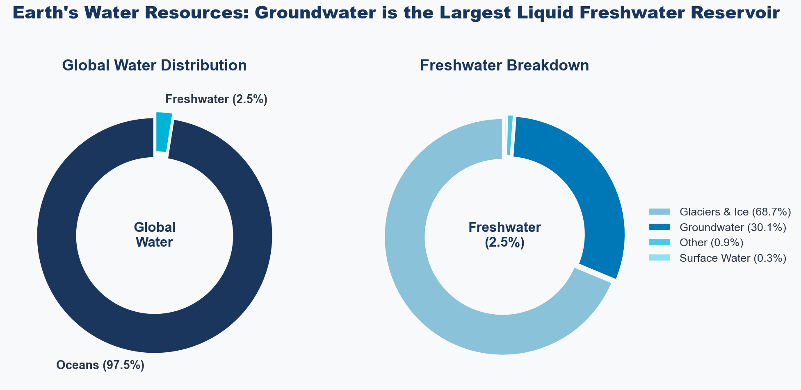
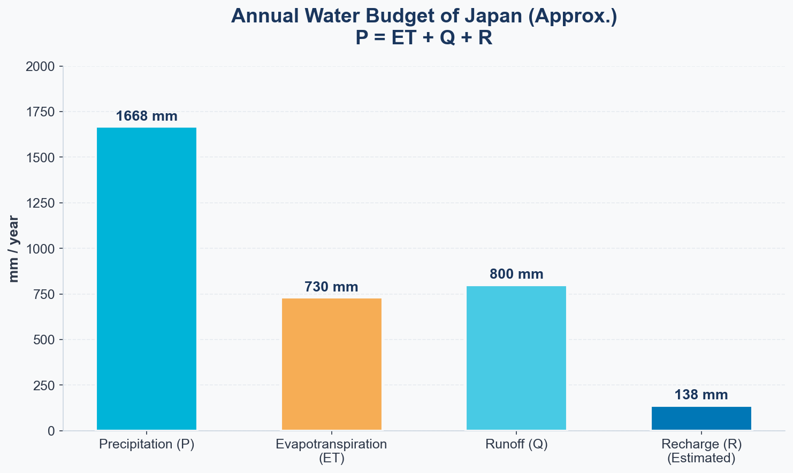
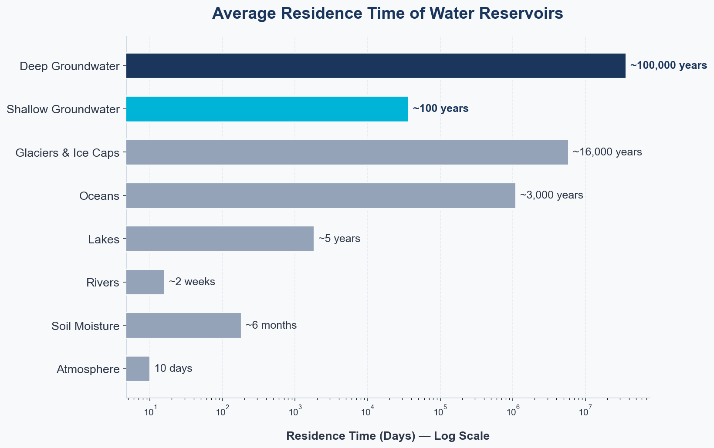

## Introduction: Where Does the Rain Go? {#sec-intro}

Imagine it rained today.

After those raindrops fall to the ground, where do they disappear to?

Some flow into rivers and head to the ocean, some evaporate from the ground back into clouds, and some silently infiltrate into the earth—rain generally has these three destinations.

The water that takes the final path, "infiltrating into the ground," eventually becomes **groundwater**. Groundwater feeds our wells, becomes springs, sustains rivers, and eventually returns to the sea. Much of the tap water we drink also traces back to this groundwater.

In this series, "**Introduction to Groundwater Science**", we will explore what is happening beneath the surface through science and code. Rather than focusing on complex formulas, we will start by valuing the intuition behind "why things happen."

The theme of Part 1 is the **Water Cycle**. As a starting point to understand groundwater, let's look at how water moves around the Earth.

---

## Overview of the Water Cycle {#sec-water-cycle}

### Where is Earth's Water Located?

Earth is called the "Water Planet," but the amount of water actually available for human use is surprisingly small.

About **97.5% of the water on Earth is seawater (saltwater)**, and freshwater accounts for only a mere **2.5%**. Furthermore, about 68.7% of that freshwater is locked up in glaciers and ice caps, leaving very little existing as liquid freshwater.

{#fig-water-distribution}

<details>
<summary>Show Python Code for Plotting</summary>

```python
import matplotlib.pyplot as plt
import numpy as np

# Font settings for English
plt.rcParams['font.family'] = ['sans-serif']
plt.rcParams['font.sans-serif'] = ['Arial', 'Helvetica', 'DejaVu Sans']
plt.rcParams['axes.unicode_minus'] = False

# Global premium colors
BG_COLOR = '#F8F9FA'
TEXT_COLOR = '#2D3748'
TITLE_COLOR = '#1A365D'

# ==========================================
# Figure 1: Water Distribution (Donut Charts)
# ==========================================
fig, axes = plt.subplots(1, 2, figsize=(14, 6))
fig.patch.set_facecolor(BG_COLOR)
for ax in axes:
    ax.set_facecolor(BG_COLOR)

# Left: Global Water
sizes_total = [97.5, 2.5]
labels_total = ['Seawater (97.5%)', 'Freshwater (2.5%)']
colors_total = ['#1A365D', '#00B4D8']
explode_total = (0, 0.05)

wedges1, texts1 = axes[0].pie(
    sizes_total, explode=explode_total, labels=labels_total, colors=colors_total,
    startangle=90, pctdistance=0.8,
    textprops={'fontsize': 14, 'fontweight': 'bold', 'color': TEXT_COLOR},
    wedgeprops={'width': 0.35, 'edgecolor': BG_COLOR, 'linewidth': 3}
)
axes[0].text(0, 0, 'Global\nWater', ha='center', va='center', 
             fontsize=16, fontweight='bold', color=TITLE_COLOR)
axes[0].set_title('Global Water Distribution', fontsize=18, fontweight='bold', pad=20, color=TITLE_COLOR)

# Right: Freshwater
sizes_fresh = [68.7, 30.1, 0.9, 0.3]
labels_fresh = ['Glaciers & Ice Caps (68.7%)', 'Groundwater (30.1%)', 'Other (0.9%)', 'Surface Water (0.3%)']
colors_fresh = ['#89C2D9', '#0077B6', '#48CAE4', '#90E0EF']
explode_fresh = (0.02, 0.02, 0.02, 0.02)

wedges2, texts2 = axes[1].pie(
    sizes_fresh, explode=explode_fresh, colors=colors_fresh,
    startangle=90,
    wedgeprops={'width': 0.35, 'edgecolor': BG_COLOR, 'linewidth': 2}
)
axes[1].text(0, 0, 'Freshwater\n(2.5%)', ha='center', va='center', 
             fontsize=16, fontweight='bold', color=TITLE_COLOR)
axes[1].set_title('Freshwater Breakdown', fontsize=18, fontweight='bold', pad=20, color=TITLE_COLOR)

# Legend instead of overlapping text
axes[1].legend(wedges2, labels_fresh, loc="center left", bbox_to_anchor=(0.95, 0.5),
               fontsize=13, frameon=False, labelcolor=TEXT_COLOR)

plt.suptitle("Earth's Water Resources: Groundwater is the Largest Liquid Freshwater Reservoir", 
             fontsize=22, fontweight='heavy', y=1.05, color=TITLE_COLOR)
plt.tight_layout()
plt.show()
```
</details>

Here lies an important fact. **Groundwater accounts for about 30% of freshwater, making it the largest liquid freshwater reservoir on Earth** [@gleick1996]. Compared to rivers and lakes (0.3%), it becomes clear just how massive an amount of water is stored underground.

---

### The 5 Processes of the Water Cycle {#sec-processes}

Water circulates the Earth in an endless cycle of evaporation, precipitation, and runoff. This cycle is called the **Hydrologic Cycle** [@freeze1979].

The main five processes are as follows:

**1. Evapotranspiration (ET)**  
Water evaporates from the oceans, lakes, and soil into the atmosphere, while water vapor is also released from plant leaves (transpiration). Together, these are called "Evapotranspiration (ET)". Globally, about 60% of precipitation returns to the atmosphere as evapotranspiration.

**2. Precipitation**  
Water vapor in the atmosphere condenses and falls to the surface as rain or snow. Japan's annual precipitation is about 1,700 mm, roughly twice the global average (about 800 mm).

**3. Surface Runoff**  
Water that flows over the land surface toward rivers and the ocean. In urban areas, the abundance of impermeable surfaces (asphalt and concrete) increases surface runoff and reduces infiltration into the ground.

**4. Infiltration / Recharge**  
Water that soaks into the ground and heads subsurface. **This is the gateway to groundwater**. The infiltrated water passes through the unsaturated zone and reaches the aquifer.

**5. Groundwater Flow / Discharge**  
Water that slowly flows through the aquifer and emerges into springs, rivers, and the sea. This "slow" movement is the defining characteristic of groundwater, which we will explore in detail in the next section.

@fig-water-cycle-diagram illustrates the overview of these processes. It shows how precipitation, after reaching the surface, divides into three pathways: evapotranspiration, surface runoff, and infiltration. The infiltrated water flows slowly through the aquifer and eventually discharges into springs and the sea. Below the surface, it is also affected by sedimentation, reactive transport [@appelo2005], and deep geothermal heat.

![Overview of the water cycle. It illustrates major processes such as Rainfall/Snowfall, Evapotranspiration, Surface Water Flow, Groundwater Flow, and Spring/Discharge, along with subsurface effects like reactive transport, seawater intrusion, and geothermal heat [@geosphere2010].](water%20cycle.png){#fig-water-cycle-diagram}

### The Water Budget Equation {#sec-budget}

These processes are quantitatively summarized by the **Water Budget Equation**. You can think of it simply as a "balance of water in and out" [@yamamoto1983]:

$$
P = ET + Q + R \pm \Delta S
$$

Where:

- **$P$**: Precipitation (mm/year)
- **$ET$**: Evapotranspiration (mm/year)
- **$Q$**: Surface Runoff (mm/year)
- **$R$**: Groundwater Recharge (mm/year)
- **$\Delta S$**: Storage change (mm/year)

In a long-term average, we can assume $\Delta S \approx 0$, making the equation quite simple.

{#fig-water-budget}

<details>
<summary>Show Python Code for Plotting</summary>

```python
import matplotlib.pyplot as plt
import numpy as np

# Global premium colors
BG_COLOR = '#F8F9FA'
TEXT_COLOR = '#2D3748'
TITLE_COLOR = '#1A365D'

P  = 1668
ET = 730
Q  = 800
R  = P - ET - Q

fig, ax = plt.subplots(figsize=(10, 6))
fig.patch.set_facecolor(BG_COLOR)
ax.set_facecolor(BG_COLOR)

categories = ['Precipitation (P)', 'Evapotranspiration (ET)', 'Runoff (Q)', 'Recharge (R)\n(Estimated)']
values = [P, ET, Q, R]
# Modern cohesive colors
colors = ['#00B4D8', '#F6AD55', '#48CAE4', '#0077B6']

bars = ax.bar(categories, values, color=colors, width=0.55,
              edgecolor=BG_COLOR, linewidth=2, zorder=3)

for bar, val in zip(bars, values):
    ax.text(bar.get_x() + bar.get_width()/2, bar.get_height() + 20,
            f'{val} mm', ha='center', va='bottom', 
            fontsize=13, fontweight='bold', color=TITLE_COLOR)

ax.set_ylabel('mm / year', fontsize=13, color=TEXT_COLOR, fontweight='bold')
ax.set_title('Approximate Annual Water Budget (Japan)\nP = ET + Q + R', 
             fontsize=18, fontweight='bold', color=TITLE_COLOR, pad=20)
ax.set_ylim(0, 2000)
ax.spines['top'].set_visible(False)
ax.spines['right'].set_visible(False)
ax.spines['left'].set_color('#CBD5E0')
ax.spines['bottom'].set_color('#CBD5E0')
ax.tick_params(colors=TEXT_COLOR, labelsize=12)
ax.grid(axis='y', alpha=0.4, color='#CBD5E0', zorder=0, linestyle='--')

plt.tight_layout()
plt.show()
```
</details>

In Japan, it is estimated that about **8%** of precipitation recharges as groundwater. This figure varies greatly depending on the region, geology, and land use—which connects directly to our upcoming topics.

---

## Groundwater is the "Memory of the Water Cycle" {#sec-residence-time}

### The Concept of Residence Time

There is an often-overlooked but crucially important concept in understanding the water cycle: **Residence Time**.

Residence time is the average time a water molecule spends in a particular reservoir. The calculation is straightforward:

$$
T = \frac{V}{Q_{in}}
$$

Where:

- **$V$**: Volume of the reservoir
- **$Q_{in}$**: Inflow rate (or outflow rate)

{#fig-residence-time}

<details>
<summary>Show Python Code for Plotting</summary>

```python
import matplotlib.pyplot as plt
import numpy as np

# Global premium colors
BG_COLOR = '#F8F9FA'
TEXT_COLOR = '#2D3748'
TITLE_COLOR = '#1A365D'

reservoirs = [
    'Atmosphere (Vapor)', 'Soil Moisture', 'Rivers', 'Lakes', 
    'Oceans', 'Glaciers & Ice Caps', 'Groundwater (Shallow)', 'Groundwater (Deep)'
]
residence_days = [10, 182, 16, 1825, 1095000, 5840000, 36500, 36500000]

fig, ax = plt.subplots(figsize=(11, 7))
fig.patch.set_facecolor(BG_COLOR)
ax.set_facecolor(BG_COLOR)

y_pos = np.arange(len(reservoirs))
# Muted colors for context, vibrant for groundwater
bar_colors = ['#94A3B8'] * 6 + ['#00B4D8', '#1A365D']

bars = ax.barh(y_pos, residence_days, color=bar_colors, 
               edgecolor=BG_COLOR, linewidth=1.5, zorder=3, height=0.6)

labels_text = ['10 days', '~6 months', '~2 weeks', '~5 years',
               '~3,000 yrs', '~16,000 yrs', '~100 yrs', '~100,000 yrs']

for i, (bar, label) in enumerate(zip(bars, labels_text)):
    # Bold text for groundwater
    weight = 'bold' if i >= 6 else 'normal'
    color = TITLE_COLOR if i >= 6 else TEXT_COLOR
    ax.text(bar.get_width() * 1.15, bar.get_y() + bar.get_height()/2,
            label, va='center', fontsize=12, fontweight=weight, color=color)

ax.set_yticks(y_pos)
ax.set_yticklabels(reservoirs, fontsize=13, color=TEXT_COLOR)
ax.set_xscale('log')
ax.set_xlabel('Residence Time (Days) — Log Scale', fontsize=13, color=TEXT_COLOR, fontweight='bold', labelpad=15)
ax.set_title('Residence Time of Reservoirs in the Water Cycle', 
             fontsize=18, fontweight='bold', color=TITLE_COLOR, pad=20)

ax.spines['top'].set_visible(False)
ax.spines['right'].set_visible(False)
ax.spines['left'].set_color('#CBD5E0')
ax.spines['bottom'].set_color('#CBD5E0')
ax.tick_params(colors=TEXT_COLOR)
ax.grid(axis='x', alpha=0.4, color='#CBD5E0', zorder=0, linestyle='--')

plt.tight_layout()
plt.show()
```
</details>

Looking at this chart, it becomes clear that groundwater exists on a completely different time scale than other waters.

- Water vapor in the atmosphere: Replaced in **10 days**
- River water: **2 to 3 weeks**
- Groundwater (Shallow): **Tens to hundreds of years**
- Groundwater (Deep): **Tens of thousands to hundreds of thousands of years**

"The groundwater you are drinking today might be rain that fell hundreds of years ago." — This is one of the reasons that makes groundwater so special [@heath1983].

### Why is Residence Time Important?

The long residence time gives groundwater two distinct faces.

One face is **Stability**. Groundwater is relatively insulated from short-term climate fluctuations and serves as a reliable water source even during droughts. Throughout human history, groundwater has supported civilizations.

The other face is **Vulnerability**. Once groundwater is polluted, it takes centuries to naturally recover. Agricultural chemicals, industrial effluents, and waste—modern pollution could affect generations far into the future.

Furthermore, deep groundwater can be measured using isotopes (like Carbon-14) to determine the "age" of the water. Investigating groundwater is akin to "reading" past climate and precipitation patterns. **Groundwater holds the memory of the water cycle.**

---

## Summary {#sec-summary}

Let's review what we learned in Part 1:

- **97.5% of Earth's water is seawater**, and most freshwater is locked in glaciers.
- **Groundwater is the largest liquid freshwater reservoir** (about 30% of total freshwater).
- **Water Budget Equation**: $P = ET + Q + R \pm \Delta S$
- **The 5 Processes of the Water Cycle**: Evapotranspiration → Precipitation → Surface Runoff → Infiltration/Recharge → Groundwater Flow/Discharge.
- **Groundwater's residence time** is orders of magnitude longer (decades to hundreds of thousands of years), which gives it both stability and vulnerability.

---

## Next Time {#sec-next}

The theme for the next article will be "**Topography and Geology**".

> What kind of "container" holds groundwater? Why do groundwater characteristics differ so wildly between mountainous regions and alluvial plains? We will explore how topography and geology determine the "whereabouts" of groundwater.

---

## References {#sec-references}

::: {#refs}
:::
