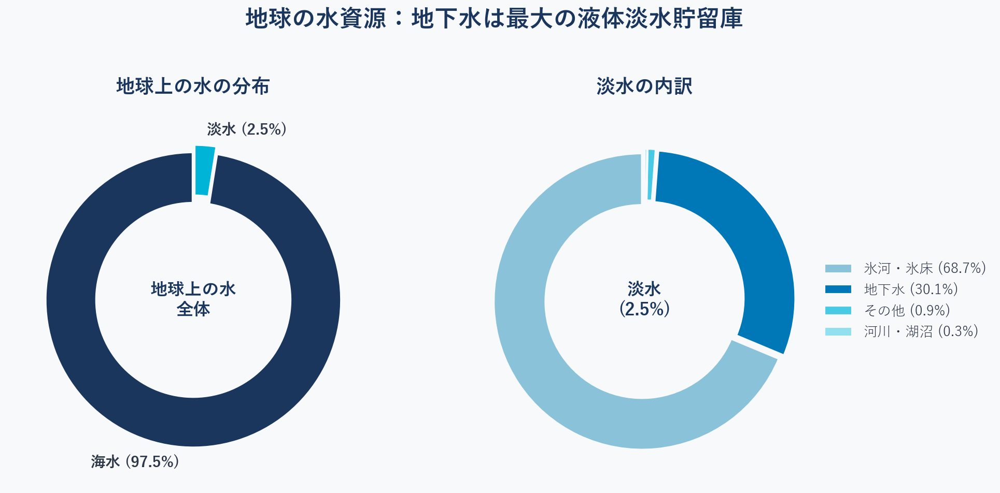
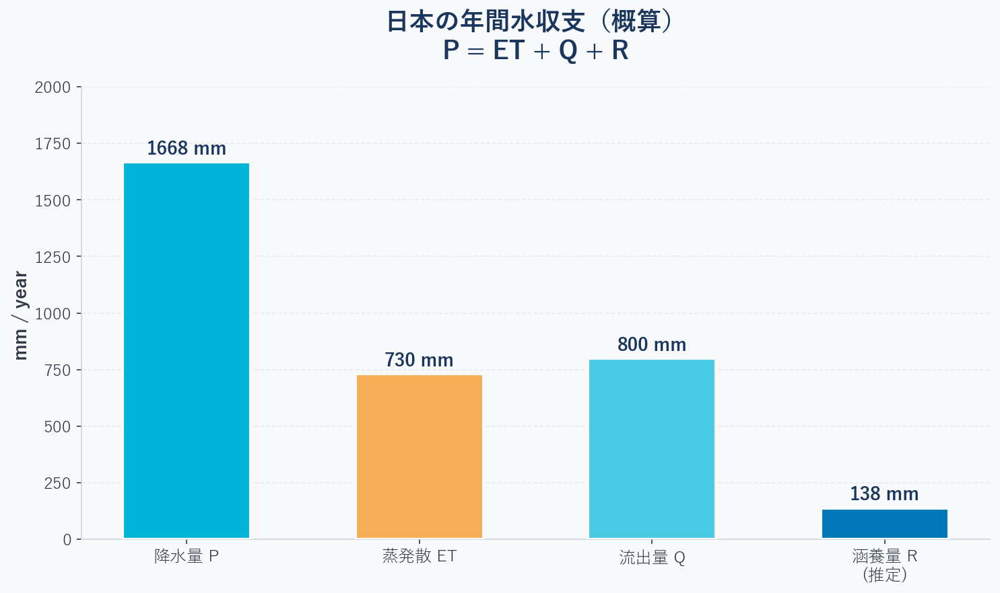
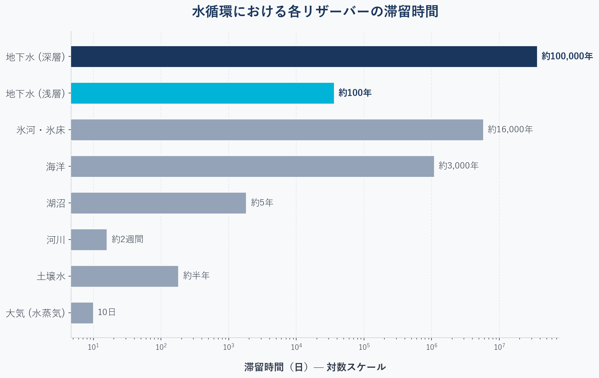

## はじめに：降った雨はどこへ行くのか？ {#sec-intro}

今日、雨が降ったとしよう。

その雨粒は地面に落ちた後、いったいどこへ消えるのだろうか？

川に流れ込んで海へ向かうもの、地面から蒸発して再び雲になるもの、そして静かに地面の中へ染み込んでいくもの——雨にはおおよそ三つの行き先がある。

最後の「地面の中へ染み込む」水。これがやがて**地下水**になる。地下水は井戸の水になり、湧き水になり、川の水になり、そして再び海へと戻る。私たちが飲む水道水の多くも、もとをたどればこの地下水に行き着く。

このシリーズ「**地下水科学入門**」では、地表の下で何が起きているのかを、科学とコードで一緒に探求していく。難しい数式よりも、まず「なぜそうなるのか」という直感を大切にしながら進める。

第1回のテーマは**水循環**である。地下水を理解するための出発点として、水が地球上をどう動いているのかを見ていこう。

---

## 水循環の全体像 {#sec-water-cycle}

**水循環（Water Cycle、水文循環）**とは、水が海・大気・陸のあいだを絶えず移動し続ける現象である。海から蒸発し、雲となり、雨や雪として降り、川や地下を通って再び海へ還る——始まりも終わりもなく、同じ水が姿と場所を変えながら何十億年も循環してきた。

本連載にとって重要なのは、その循環の一部が**地下**を通ることである。土に浸み込んだ水は地下水となり、再び循環に戻るまで数年から数千年ものあいだ地中にとどまる。まずは、地球がどれだけの水を、どこに蓄えているのかを見ていこう。

### 地球上の水はどこにあるのか？

地球は「水の惑星」と呼ばれるが、実際に人間が利用できる水は驚くほど少ない。

地球上の水の約**97.5%は海水（塩水）**であり、淡水はわずか**2.5%**に過ぎない。地球上の水の総量は**約13.6億 km³**にも達するが、淡水の約68.7%は氷河・氷床として固定されており、液体の淡水として存在するのはごくわずかである（全体の割合として見ると、海洋が97.2%、氷河が2.15%、その他が0.65%という推定もある）。

{#fig-water-distribution}

<details>
<summary>作図用のPythonコードを表示</summary>

```python
import matplotlib.pyplot as plt
import numpy as np

# Font settings
plt.rcParams['font.family'] = ['Yu Gothic', 'Hiragino Sans', 'Noto Sans CJK JP', 'DejaVu Sans']
plt.rcParams['axes.unicode_minus'] = False

# Global premium colors
BG_COLOR = '#F8F9FA'
TEXT_COLOR = '#2D3748'
TITLE_COLOR = '#1A365D'

# ==========================================
# Figure 1: Water Distribution (Donut Charts)
# ==========================================
fig, axes = plt.subplots(1, 2, figsize=(14, 6))
fig.patch.set_facecolor(BG_COLOR)
for ax in axes:
    ax.set_facecolor(BG_COLOR)

# Left: Global Water
sizes_total = [97.5, 2.5]
labels_total = ['海水 (97.5%)', '淡水 (2.5%)']
colors_total = ['#1A365D', '#00B4D8']
explode_total = (0, 0.05)

wedges1, texts1 = axes[0].pie(
    sizes_total, explode=explode_total, labels=labels_total, colors=colors_total,
    startangle=90, pctdistance=0.8,
    textprops={'fontsize': 14, 'fontweight': 'bold', 'color': TEXT_COLOR},
    wedgeprops={'width': 0.35, 'edgecolor': BG_COLOR, 'linewidth': 3}
)
axes[0].text(0, 0, '地球上の水\n全体', ha='center', va='center', 
             fontsize=16, fontweight='bold', color=TITLE_COLOR)
axes[0].set_title('地球上の水の分布', fontsize=18, fontweight='bold', pad=20, color=TITLE_COLOR)

# Right: Freshwater
sizes_fresh = [68.7, 30.1, 0.9, 0.3]
labels_fresh = ['氷河・氷床 (68.7%)', '地下水 (30.1%)', 'その他 (0.9%)', '河川・湖沼 (0.3%)']
colors_fresh = ['#89C2D9', '#0077B6', '#48CAE4', '#90E0EF']
explode_fresh = (0.02, 0.02, 0.02, 0.02)

wedges2, texts2 = axes[1].pie(
    sizes_fresh, explode=explode_fresh, colors=colors_fresh,
    startangle=90,
    wedgeprops={'width': 0.35, 'edgecolor': BG_COLOR, 'linewidth': 2}
)
axes[1].text(0, 0, '淡水\n(2.5%)', ha='center', va='center', 
             fontsize=16, fontweight='bold', color=TITLE_COLOR)
axes[1].set_title('淡水の内訳', fontsize=18, fontweight='bold', pad=20, color=TITLE_COLOR)

# Legend instead of overlapping text
axes[1].legend(wedges2, labels_fresh, loc="center left", bbox_to_anchor=(0.95, 0.5),
               fontsize=13, frameon=False, labelcolor=TEXT_COLOR)

plt.suptitle('地球の水資源：地下水は最大の液体淡水貯留庫', 
             fontsize=22, fontweight='heavy', y=1.05, color=TITLE_COLOR)
plt.tight_layout()
plt.show()
```
</details>

ここで重要な事実がある。**地下水は淡水の約30%を占め、液体の淡水としては地球最大の貯留庫**である[@gleick1996]。河川や湖沼（0.3%）と比べても、地下水がいかに大量の水を蓄えているかがわかる。

::: {.callout-note}
#### コラム：氷河と気候変動
地球上の淡水の最大の貯留庫は氷河・氷床ですが、もしこれらがすべて融解した場合、海水準は数十メートルも上昇すると言われています。過去の氷河期と間氷期においても、陸に氷として固定される水の量と海水の量が劇的に変動し、地球規模の水循環バランスに極めて大きな影響を与えてきました。
:::

---

### 水循環の5つの段階（プロセス） {#sec-processes}

水は蒸発・降水・流出という絶え間ないサイクルの中で地球を循環している。このサイクルを**水循環（Hydrologic Cycle）**と呼ぶ[@freeze1979]。

主なプロセスは以下の5つである：

**① 蒸発散（Evapotranspiration）**  
海・湖・土壌から水が大気へ蒸発し、植物の葉からも水蒸気が放出される（蒸散）。この二つを合わせて「蒸発散（ET）」と呼ぶ。地球全体では、降水量の約60%が蒸発散として大気に戻る。

**② 降水（Precipitation）**  
大気中の水蒸気が凝結し、雨・雪として地表へ降り注ぐ。地球全体で大気を通過して移動する水の総量は年間**約380,000 km³**にも達し、これは地球の表面全体に毎年約1,000mmの雨が一様に降るほどの膨大なスケールである。ちなみに日本の年間降水量は約1,700mmで、世界平均（約800mm）の約2倍となっている。

**③ 地表流出（Surface Runoff）**  
地表を流れて河川・海へ向かう水。都市部では不透水面（アスファルト・コンクリート）が多いため、地表流出が増加し地下への浸透が減る。

**④ 浸透・涵養（Infiltration / Recharge）**  
地面に染み込み、地下へと向かう水。**これが地下水の入り口**となる。浸透した水は不飽和帯を経て、帯水層へと達する。

**⑤ 地下水流動・湧出（Groundwater Flow / Discharge）**  
帯水層の中をゆっくりと流れ、湧水・河川・海へと湧き出る。この「ゆっくりと」が地下水の最大の特徴であり、次のセクションで詳しく見ていく。

@fig-water-cycle-diagram は、これらのプロセスの全体像を示したものだ。降水が地表に到達した後、蒸発散・地表流出・浸透という三つの経路に分かれ、地下に浸透した水が帯水層を通じてゆっくりと流れ、やがて湧水や海へと湧き出る様子が描かれている。地下では堆積作用（Sedimentation）、反応性輸送（Reactive Transport）[@appelo2005]、さらに深部では地熱（Geothermal Heat）の影響も受ける。

![水循環の全体像。降水（Rainfall / Snowfall）・蒸発散（Evapotranspiration）・地表流出（Surface Water Flow）・地下水流動（Groundwater Flow）・湧出（Spring / Discharge）など、水循環を構成する主要プロセスと、地下における反応性輸送・塩水浸入・地熱の影響を示す[@geosphere2010]。](water%20cycle.png){#fig-water-cycle-diagram}


### 水収支の式 {#sec-budget}

これらのプロセスを定量的にまとめたのが**水収支式**である。「水の入りと出のバランス」と考えればよい[@yamamoto1983]：

$$
P = ET + Q + R \pm \Delta S
$$

ここで：

| 記号 | 意味 | 単位 |
|------|------|------|
| $P$ | 降水量（Precipitation） | mm/year |
| $ET$ | 蒸発散量（Evapotranspiration） | mm/year |
| $Q$ | 地表流出量（Runoff） | mm/year |
| $R$ | 地下水涵養量（Recharge） | mm/year |
| $\Delta S$ | 貯留変化量（Storage change） | mm/year |

長期平均では $\Delta S \approx 0$ とみなせるため、式はシンプルになる。

{#fig-water-budget}

<details>
<summary>作図用のPythonコードを表示</summary>

```python
import matplotlib.pyplot as plt
import numpy as np

# Global premium colors
BG_COLOR = '#F8F9FA'
TEXT_COLOR = '#2D3748'
TITLE_COLOR = '#1A365D'

P  = 1668
ET = 730
Q  = 800
R  = P - ET - Q

fig, ax = plt.subplots(figsize=(10, 6))
fig.patch.set_facecolor(BG_COLOR)
ax.set_facecolor(BG_COLOR)

categories = ['降水量 P', '蒸発散 ET', '流出量 Q', '涵養量 R\n(推定)']
values = [P, ET, Q, R]
# Modern cohesive colors
colors = ['#00B4D8', '#F6AD55', '#48CAE4', '#0077B6']

bars = ax.bar(categories, values, color=colors, width=0.55,
              edgecolor=BG_COLOR, linewidth=2, zorder=3)

for bar, val in zip(bars, values):
    ax.text(bar.get_x() + bar.get_width()/2, bar.get_height() + 20,
            f'{val} mm', ha='center', va='bottom', 
            fontsize=13, fontweight='bold', color=TITLE_COLOR)

ax.set_ylabel('mm / year', fontsize=13, color=TEXT_COLOR, fontweight='bold')
ax.set_title('日本の年間水収支（概算）\nP = ET + Q + R', 
             fontsize=18, fontweight='bold', color=TITLE_COLOR, pad=20)
ax.set_ylim(0, 2000)
ax.spines['top'].set_visible(False)
ax.spines['right'].set_visible(False)
ax.spines['left'].set_color('#CBD5E0')
ax.spines['bottom'].set_color('#CBD5E0')
ax.tick_params(colors=TEXT_COLOR, labelsize=12)
ax.grid(axis='y', alpha=0.4, color='#CBD5E0', zorder=0, linestyle='--')

plt.tight_layout()
plt.show()
```
</details>

日本では降水量の約**8%**が地下水として涵養されると推定される。この数字は地域・地質・土地利用によって大きく変わる。

また、地球規模で見ると、陸地に降った雨のうち年間**約36,000 km³**の水が、最終的に地表や地下を通って海へと戻っていく。この膨大な水が重力に従って移動する過程で、地表を深く刻み、私たちが目にする多様な**地形**を作り出している。水は単に流れるだけでなく、大地の形を彫刻する「主動力」でもあるのだ——それが第2回のテーマへとつながっていく。

---

## 地下水は「水循環の記憶」である {#sec-residence-time}

### 滞留時間という視点

水循環を理解するうえで、見落とされがちだが非常に重要な概念がある。それが**滞留時間（Residence Time）**である。

滞留時間とは、水がある場所（リザーバー）に留まる平均的な時間のことだ。計算式はシンプルで：

$$
T = \frac{V}{Q_{in}}
$$

ここで $V$ はリザーバーの貯留量、$Q_{in}$ は流入量（または流出量）を意味する。

{#fig-residence-time}

<details>
<summary>作図用のPythonコードを表示</summary>

```python
import matplotlib.pyplot as plt
import numpy as np

# Global premium colors
BG_COLOR = '#F8F9FA'
TEXT_COLOR = '#2D3748'
TITLE_COLOR = '#1A365D'

reservoirs = [
    '大気 (水蒸気)', '土壌水', '河川', '湖沼', 
    '海洋', '氷河・氷床', '地下水 (浅層)', '地下水 (深層)'
]
residence_days = [10, 182, 16, 1825, 1095000, 5840000, 36500, 36500000]

fig, ax = plt.subplots(figsize=(11, 7))
fig.patch.set_facecolor(BG_COLOR)
ax.set_facecolor(BG_COLOR)

y_pos = np.arange(len(reservoirs))
# Muted colors for context, vibrant for groundwater
bar_colors = ['#94A3B8'] * 6 + ['#00B4D8', '#1A365D']

bars = ax.barh(y_pos, residence_days, color=bar_colors, 
               edgecolor=BG_COLOR, linewidth=1.5, zorder=3, height=0.6)

labels_text = ['10日', '約半年', '約2週間', '約5年',
               '約3,000年', '約16,000年', '約100年', '約100,000年']

for i, (bar, label) in enumerate(zip(bars, labels_text)):
    # Bold text for groundwater
    weight = 'bold' if i >= 6 else 'normal'
    color = TITLE_COLOR if i >= 6 else TEXT_COLOR
    ax.text(bar.get_width() * 1.15, bar.get_y() + bar.get_height()/2,
            label, va='center', fontsize=12, fontweight=weight, color=color)

ax.set_yticks(y_pos)
ax.set_yticklabels(reservoirs, fontsize=13, color=TEXT_COLOR)
ax.set_xscale('log')
ax.set_xlabel('滞留時間（日）— 対数スケール', fontsize=13, color=TEXT_COLOR, fontweight='bold', labelpad=15)
ax.set_title('水循環における各リザーバーの滞留時間', 
             fontsize=18, fontweight='bold', color=TITLE_COLOR, pad=20)

ax.spines['top'].set_visible(False)
ax.spines['right'].set_visible(False)
ax.spines['left'].set_color('#CBD5E0')
ax.spines['bottom'].set_color('#CBD5E0')
ax.tick_params(colors=TEXT_COLOR)
ax.grid(axis='x', alpha=0.4, color='#CBD5E0', zorder=0, linestyle='--')

plt.tight_layout()
plt.show()
```
</details>

この図を見ると、地下水が他の水とまったく異なる時間スケールで存在していることがわかる。

- 大気中の水蒸気：**10日**で入れ替わる
- 河川の水：**2〜3週間**
- 地下水（浅層）：**数十〜数百年**
- 地下水（深層）：**数万〜数十万年**

「今日飲んでいる地下水は、もしかすると数百年前に降った雨かもしれない」——これが地下水を特別な存在にしている理由の一つである[@heath1983]。

### なぜ滞留時間が重要なのか？

滞留時間が長いことは、地下水に二つの顔を与える。

一つは**安定性**である。地下水は短期的な気候変動の影響を受けにくく、干ばつ時にも安定した水源となる。人類の歴史において、地下水は文明を支えてきた。

もう一つは**脆弱性**である。一度汚染された地下水は、数百年かけてようやく自然回復する。農薬・工場排水・廃棄物——現代の汚染は、遥か未来の世代にまで影響を及ぼす可能性がある。

さらに、深層地下水に至っては同位体（炭素14など）を使って「水の年齢」を測定することができる。地下水を調べることは、過去の気候・降水パターンを「読む」ことでもある。**地下水は、水循環の記憶を刻んでいる。**

---

## まとめ {#sec-summary}

第1回で学んだことを整理しよう：

- **地球の水の97.5%は海水**、淡水のほとんどは氷河に固定されている
- **地下水は最大の液体淡水貯留庫**（淡水の約30%）
- **水収支式**：$P = ET + Q + R \pm \Delta S$
- **水循環の5プロセス**：蒸発散 → 降水 → 地表流出 → 浸透・涵養 → 地下水流動・湧出
- **地下水の滞留時間**は数十〜数十万年と桁違いに長く、それが安定性と脆弱性の両方を生む

---

## 次回予告 {#sec-next}

次回は「**地形・地質**」がテーマとなる。

> 地下水はどんな「器」の中にあるのか？山岳地帯の地下水と沖積平野の地下水、なぜこんなにも性質が違うのか？地形と地質が地下水の「居場所」をどのように決めているのかを探っていく。

::: {.callout-tip}
## 関連シリーズ：PHREEQC 地球化学モデリング
地下水の「流れ」を学んだら、次は水の「**化学**」へ。水と岩石の反応や水質を計算で解き明かす [PHREEQC 入門シリーズ #1：インストールと最初の計算](/posts/phreeqc/phreeqc-part1/) もあわせてどうぞ。
:::

---

## 参考文献 {#sec-references}

::: {#refs}
:::

---

## 連載記事一覧（地下水科学入門シリーズ）

1. [第1回：水循環とは？— 雨はどこへ行くのか](../groundwater-sci01/index.qmd) （本記事）
2. [第2回：地下水はどこに存在し、どう動くのか？— 地層という器と地形というエンジン](../groundwater-sci02/index.qmd)
3. 第3回：Darcy（ダルシー）の法則と地下水の流れ（予定）
