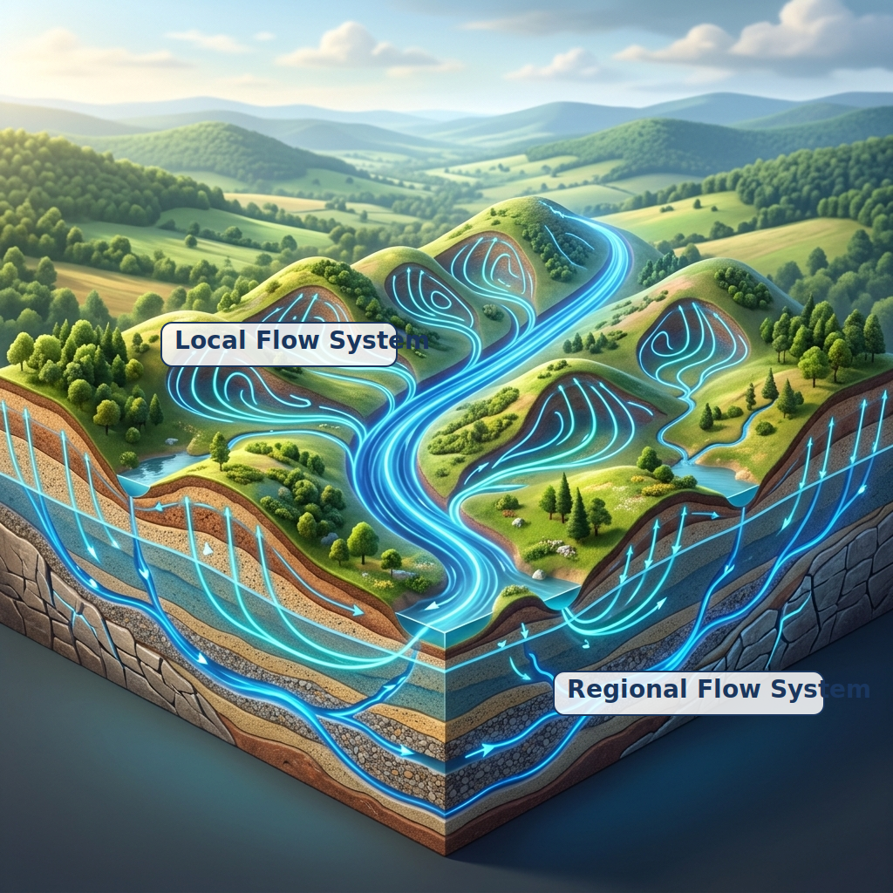

## Introduction: What is the "Container" for Groundwater? {#sec-intro}

In Part 1, we learned about the **Water Cycle**, where rain infiltrates the ground and flows slowly as groundwater.

So, in what kind of space does this groundwater exist? There aren't massive tunnels running in all directions underground like subterranean rivers (with the exception of limestone caves).

Groundwater is abundantly stored in the tiny spaces between soil and sand particles (**Porosity**) and in the cracks within solid bedrock (**Fractures**). Geological layers that easily transmit water are called "**Aquifers**", while impermeable layers like clay or hard rock are called "**Aquitards**".

In Part 2, we will look at this geological "container" and the "topography" that acts as the driving force moving the water.

---

## How Does Groundwater Differ Between Plains and Mountains? {#sec-geology}

Depending on where we live, the shape of the groundwater "container" beneath our feet is completely different. Broadly speaking, imagine two types: plains (alluvial plains) and mountainous areas (bedrock).

### 1. Alluvial Plains: A Mille-feuille of Sand and Clay

Many major cities in Japan (such as the Kanto, Nobi, and Osaka plains) are situated on **alluvial plains** formed by sediment carried by rivers.

Groundwater here is stored in layers of sand and gravel. Since sand and gravel layers easily transmit water, they make excellent "aquifers." On the other hand, mud and clay layers are difficult for water to pass through, making them "aquitards." As these two alternate, massive water layers (groundwater basins) are formed underground.

{#fig-aquifer-types}

Water trapped under a clay layer (a lid) is subjected to pressure from above, so when a well is drilled, the water pushes itself up. This is called **Confined Groundwater**. On the other hand, the groundwater at the very top, which has no lid, is called **Unconfined Groundwater**.

These geological layers in the plains can be considered a "container" that was gradually built over time by "**Alluvial Channels**", where rivers flow gently and repeatedly deposit sediments.

### 2. Mountainous Areas: A Complex Network Created by Fractures

Mountainous areas make up about 70% of Japan's landmass. Since these are made of hard bedrock (such as granite and sedimentary rock), water hardly infiltrates the rock itself.

So where is the water? It is in the **cracks (fractures) in the bedrock** caused by faulting and weathering. This is called a "**Fractured Aquifer**." Water can flow vigorously where there are fractures, but move a few meters away, and you might find no water at all. Compared to groundwater in plains, predicting the movement of mountain groundwater is extremely difficult.

Rivers in mountainous areas act as "**Bedrock Channels**" that violently carve through the rock on steep slopes. The sediment eroded here is carried downstream to form the aquifers of the plains (alluvial plains) mentioned earlier. In other words, mountain erosion and plain deposition are two sides of the same coin in the process of creating the "container" for groundwater.

### 3. Drainage Patterns Governed by Geological Structure

Just as groundwater flows through gaps and fractures in the strata, the network of rivers (drainage patterns) flowing on the surface is also strongly governed by the underlying "geology."
If the strata are uniform, rivers spread out like tree branches, creating a "**dendritic**" pattern. However, on volcanic slopes, they become "**radial**," and if regular fractures (faults or joints) run through the bedrock, "**rectangular**" or "**trellis**" drainage patterns are born. By looking at the shape of rivers on the surface, we can to some extent infer the structure of the fractured aquifer network underground.

{#fig-drainage}

### 4. Limestone and Karst Topography: When Water Dissolves the "Container" Itself

The sand, clay, and fractured bedrock we have seen so far have been considered a "static container" through which water passes. However, there is a special case where **water itself dynamically dissolves and reshapes the container**. This is known as **Karst Topography**, found in limestone regions.

While pure water barely dissolves limestone, groundwater that has absorbed carbon dioxide (CO2) from the air and soil becomes slightly acidic (carbonic acid), making it easy to dissolve limestone. This unique hydrogeological structure has been extensively studied in carbonate islands such as Bermuda [@vacher2004].

Furthermore, in uplifted coral reef islands (carbonate islands) like Minami-Daito Island in Japan, dynamic groundwater behaviors unique to limestone islands surrounded by the sea can be observed. These include the oscillation of freshwater lenses induced by sea tides and variable rainfall, as well as the long-term effects of sea-level rise on hydrogeochemical processes [@yang2020oscillation; @yang2020hydrogeochemical].

{#fig-karst}

Karst topography presents several remarkable features woven together by groundwater and terrain:

- **Disappearing Streams**: In karst regions, surface rivers often flow abruptly into a "sinkhole (ponor)" and disappear underground.
- **Massive Caverns and Limestone Caves**: When limestone is dissolved below the water table, massive caverns are formed. Later, if the "Base Level" drops due to climate change or crustal uplift, rivers intensify their downcutting, pulling the water table down with them. When previously submerged caverns are exposed to the air, carbon dioxide escapes from the dripping water on the ceiling, causing calcium carbonate to precipitate and grow into **stalactites and stalagmites**.
- **Sinkholes and Tower Karst**: Countless bowl-shaped "Sinkholes" (dolines) are created either by dissolution from the surface or by the sudden collapse of a cave ceiling. Furthermore, in tropical regions like southern China, abundant rain and active CO2 supply from the soil accelerate dissolution, leaving behind stunning towers of un-dissolved rock known as "Tower Karst."

In limestone regions, the evolution of the topography is directly linked to the transformation of the underground scenery (the birth of limestone caves).

---

## Topography Determines the Flow: Tóth's Flow Systems {#sec-toth-flow}

If geology is the "container," what is the "engine" that moves the water inside it?
That is **Topography**.

Groundwater flows from areas of high energy to low energy, driven by the balance of gravity and pressure. Simply put, **it enters the ground in the mountains (recharge areas) and flows toward valleys and rivers (discharge areas)**.

In 1963, Canadian hydrogeologist J. Tóth theoretically demonstrated how groundwater flows under undulating topography, shocking researchers worldwide [@toth1963].

Let's look at a conceptual diagram of the "**Groundwater Flow System**" he proposed.

{#fig-toth-flow}

The important facts illustrated by this diagram are as follows:

1. **Local System**:
   Water recharged at a small hill and discharged at the adjacent small valley. It flows through shallow areas, has a short residence time, and is strongly influenced by rainfall.
2. **Regional System**:
   Water recharged at the highest mountain in the basin, flowing slowly deep underground over a long period, and discharging at the final point (a large river or the sea). The groundwater mentioned in Part 1 with a "residence time of thousands or tens of thousands of years" rides on this regional system.

Even if it looks like a single aquifer at first glance, the slight undulations in the topography create a complex network (hierarchical structure) of groundwater flow, from shallow to deep, overlapping in multiple layers.

---

## Summary and Next Time {#sec-summary}

This time, we learned about the "container" for groundwater and the "engine" that determines its flow.

- Alluvial plains consist of "alternating layers of sand and clay," forming massive groundwater basins.
- Pressurized groundwater trapped beneath a clay layer is called "confined groundwater."
- Groundwater in mountainous areas is stored in "fractures (cracks)," making it highly complex.
- Groundwater is driven by topographic undulations, flowing at various scales from shallow, short "local systems" to deep, long "regional systems."

Now we know that geology stores the water, and topography moves it.
But **"how fast" does groundwater actually flow?**

Next time, in Part 3, we will explore "**Darcy's Law and Groundwater Flow**." We will approach the most beautiful and important law of groundwater science, discovered by a French engineer in the 19th century.

---

## References {#sec-references}

::: {#refs}
:::

---

## Introduction to Groundwater Science Series

1. [Part 1: What is the Water Cycle? — Where Does the Rain Go?](../groundwater-sci01/index-en.qmd)
2. [Part 2: Where Does Groundwater Exist and How Does It Move?](../groundwater-sci02/index-en.qmd) (This article)
3. [Part 3: Why Does Groundwater Move? — Darcy's Law and the Physics of Head](../groundwater-sci03/index-en.qmd)
