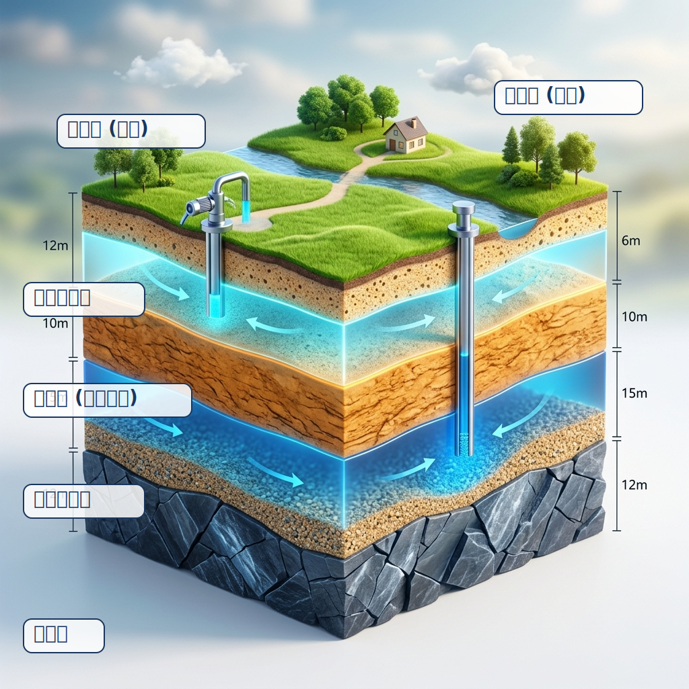
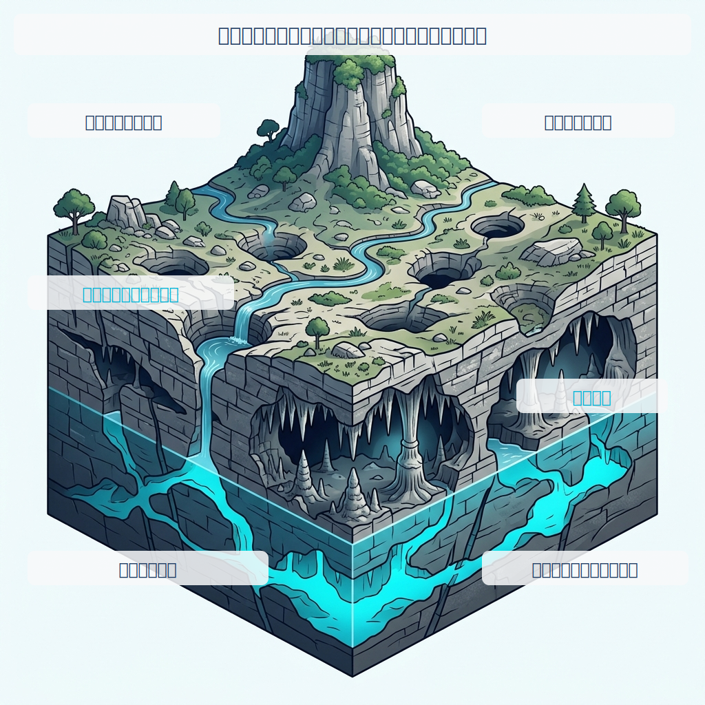
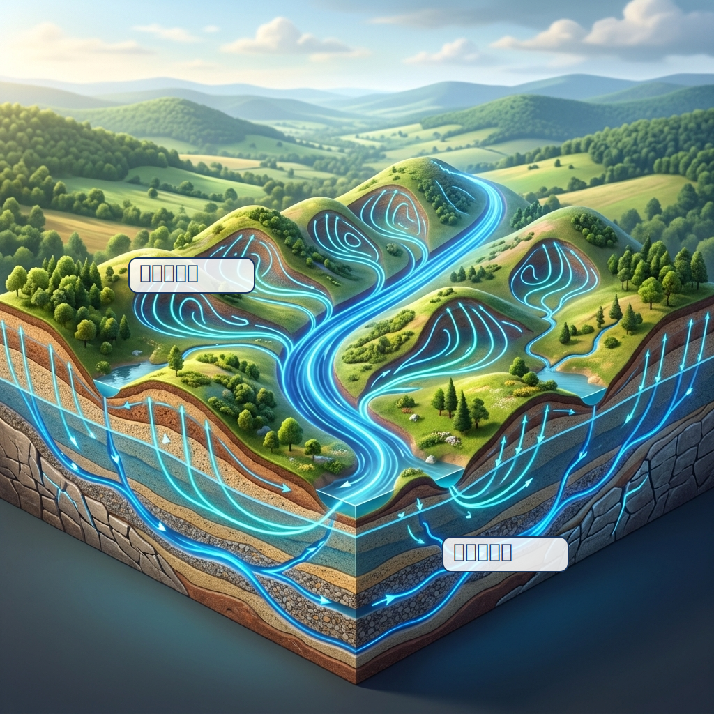

## はじめに：地下水を入れる「器」とは？ {#sec-intro}

第1回で、降った雨が地面に浸透し、地下水となってゆっくりと流れる**水循環**について学んだ。

では、その地下水はいったいどんな空間に存在しているのだろうか？ 地下には川のような巨大なトンネルが縦横無尽に走っているわけではない（石灰岩の洞窟などを除いて）。

地下水は、土や砂の粒と粒の間のわずかな隙間（**間隙：Porosity**）や、固い岩盤に入ったヒビ（**亀裂：Fracture**）の中にたっぷりと蓄えられている。水を通しやすいこの地層を「**帯水層（Aquifer）**」と呼び、逆に水を通しにくい粘土や硬い岩盤を「**難透水層（Aquitard）**」と呼ぶ。

第2回では、この「地質」という器と、水を動かす原動力となる「地形」について見ていく。

---

## 平野と山の地下水はどう違う？ {#sec-geology}

私たちが住んでいる場所によって、足元にある地下水の「器」の形はまったく異なる。大きく分けて、平野部（沖積平野）と山間部（岩盤）の2つをイメージしてほしい。

### 1. 沖積平野：砂と粘土のミルフィーユ

日本の主要な都市（関東平野、濃尾平野、大阪平野など）の多くは、川が運んできた土砂が積もってできた**沖積平野**の上にある。

ここでの地下水は、砂や小石（礫）の層に蓄えられている。砂礫層は水を通しやすいため優れた「帯水層」となる。一方、泥や粘土の層は水を通しにくいため「難透水層」となる。この2つが交互に重なり合うことで、地下には巨大な水の層（地下水盆）が形成される。

{#fig-aquifer-types}

粘土層（蓋）の下に閉じ込められた水は、上からの圧力を受けているため、井戸を掘ると水が自ら押し上がってくる。これを**被圧地下水（Confined Groundwater）**と呼ぶ。一方、一番上にある蓋のない地下水は**不圧地下水（Unconfined Groundwater）**と呼ばれる。

こうした平野部の地層は、川が穏やかに流れて堆積を繰り返す「**沖積層河道（Alluvial Channels）**」によって時間をかけて作られた「器」であると言える。

### 2. 山岳地帯：亀裂が生み出す複雑なネットワーク

日本の国土の約7割を占める山岳地帯。ここは硬い岩盤（花崗岩や堆積岩など）でできているため、岩そのものに水はほとんど染み込まない。

では水はどこにあるのか？ それは、断層や風化によって生じた**岩盤の割れ目（亀裂）**だ。これを「**亀裂性帯水層（Fractured Aquifer）**」と呼ぶ。亀裂のある場所には水が勢いよく流れるが、数メートル隣に行くと全く水が出ないこともある。平野部の地下水に比べて、山の地下水の動きを予測することは非常に難しい。

山間部の川は急勾配で岩盤を激しく削る「**基盤岩河道（Bedrock Channels）**」となっており、ここで削り取られた土砂が下流へ運ばれることで、先ほどの平野部（沖積平野）の帯水層が形成される。つまり、山の侵食と平野の堆積は、地下水の「器」を作る表裏一体のプロセスなのである。

### 3. 地質構造が支配する水系パターン

地下水が地層の隙間や亀裂を通るように、地表を流れる川（水系）の網目模様もまた、足元の「地質」に強く支配されている。
地層が均質であれば川は木の枝のように広がる「**樹枝状**」になるが、火山の斜面では「**放射状**」になり、岩盤に規則的な亀裂（断層や節理）が走っていれば「**正方形状**」や「**つる状**」の水系パターンが生まれる。地表の川の形を見れば、地下にある亀裂性帯水層のネットワークの構造もある程度推測できるのだ。

{#fig-drainage}

### 4. 石灰岩とカルスト地形：水が「器」そのものを溶かすとき

これまで見てきた砂・粘土層や岩盤の亀裂は、水が通り抜ける「変わらない器」として考えられてきました。しかし、**水が自ら地層を溶かし、器そのものをダイナミックに作り変えていく**特殊なケースがあります。それが石灰岩地域で見られる「**カルスト地形（Karst Topography）**」です。

純粋な水は石灰岩をほとんど溶かしませんが、大気中や土壌中の二酸化炭素（CO2）を取り込んだ地下水は弱酸性（炭酸水）となり、石灰岩を容易に溶かします。バミューダ諸島などの炭酸塩岩（石灰岩）でできた島々でも、この特殊な水文地質構造が詳しく研究されています[@vacher2004]。

また、日本の南大東島のような隆起サンゴ礁の島（炭酸塩岩の島）でも、潮汐や降雨による淡水レンズの変動や、長期的な海面上昇が地下水質に与える影響など、海に囲まれた石灰岩特有のダイナミックな地下水動態が見られます[@yang2020oscillation; @yang2020hydrogeochemical]。

{#fig-karst}

カルスト地形には、地下水と地形が織りなす驚くべき特徴がいくつもあります：

- **吸い込み穴へ消える川**：カルスト地域では、地表を流れる川が突如として「吸い込み穴（ポノール）」へ流れ込み、地下へと姿を消してしまうことがよくあります。
- **巨大な地下空洞と鍾乳洞**：地下水面の下で石灰岩が溶かされると、巨大な空洞が形成されます。その後、気候変動や地盤の隆起などによって川が下方侵食を強め、「侵食基準面（Base Level）」が下がると、それに引っ張られて地下水面も低下します。かつて水没していた空洞が空気に触れると、天井から滴る水から二酸化炭素が抜け、炭酸カルシウムが沈殿して**鍾乳石や石筍**が成長し始めます。
- **窪地（ドリーネ）とタワーカルスト**：地表から溶かされたり、地下の洞窟の天井が崩落したりすることで、すり鉢状の「窪地（Sinkholes）」が無数に生まれます。さらに、中国南部のような熱帯地域では、豊富な雨と活発な土壌のCO2供給により、強烈な溶解が進み、溶け残った岩が塔のようにそびえ立つ「タワーカルスト」と呼ばれる絶景を作り出します。

石灰岩地帯では、地形の進化がそのまま地下の景色の変化（鍾乳洞の誕生）に直結しているのです。

---

## 地形が流れを決める：Tóthの流動系 {#sec-toth-flow}

地質が「器」だとしたら、その中の水を動かす「エンジン」は何だろうか？
それは**地形（Topography）**である。

地下水は、重力と圧力のバランスによって、エネルギーが高いところから低いところへ向かって流れる。平たく言えば、**山（涵養域）で地下に入り、谷や川（流出域）へ向かって流れる**。

1963年、カナダの地下水学者 J. Tóth は、起伏のある地形の下で地下水がどのように流れるかを理論的に示し、世界中の研究者に衝撃を与えた[@toth1963]。

彼が提唱した「**地下水流動系（Groundwater Flow System）**」の概念図を見てみよう。

{#fig-toth-flow}

この図が示している重要な事実は以下の通りだ：

1. **局地流動系（Local System）**：
   小さな丘で涵養され、すぐ隣の小さな谷で湧き出す水。浅い場所を流れ、滞留時間も短いため、降雨の影響を強く受ける。
2. **広域流動系（Regional System）**：
   流域の一番高い山で涵養され、地下深くを長い時間をかけてゆっくりと流れ、最終地点（大きな川や海）で湧き出す水。第1回で触れた「滞留時間が何千年・何万年」という地下水は、この広域流動系に乗っている。

一見すると一つの帯水層に見えても、地形のわずかな起伏によって、地下水の流れは浅いものから深いものまで、幾重にも重なり合う複雑なネットワーク（階層構造）を形成しているのである。

---

## まとめと次回予告 {#sec-summary}

今回は地下水の「器」と、流れを決める「エンジン」について学んだ。

- 沖積平野は「砂と粘土の互層」からなり、巨大な地下水盆を形成する。
- 粘土層の下にある圧力を持った地下水を「被圧地下水」と呼ぶ。
- 山岳地帯の地下水は「亀裂（割れ目）」に蓄えられるため、非常に複雑である。
- 地下水は地形の起伏に駆動され、浅く短い「局地流動系」から、深く長い「広域流動系」まで様々なスケールで流れている。

さて、地質が水を蓄え、地形が水を動かすことがわかった。
では、地下水はいったい**「どのくらいの速さ」で流れているのだろうか？**

次回、第3回は「**Darcy（ダルシー）の法則と地下水の流れ**」。19世紀のフランスの技術者が発見した、地下水科学の最も美しく、最も重要な法則に迫る。

---

## 参考文献 {#sec-references}

::: {#refs}
:::

---

## 連載記事一覧（地下水科学入門シリーズ）

1. [第1回：水循環とは？— 雨はどこへ行くのか](../groundwater-sci01/index.qmd)
2. [第2回：地下水はどこに存在し、どう動くのか？— 地層という器と地形というエンジン](../groundwater-sci02/index.qmd) （本記事）
3. [第3回：地下水はなぜ動くのか？ — ダルシーの法則と水頭の物理](../groundwater-sci03/index.qmd)
