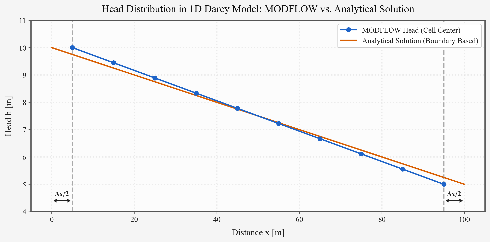

## はじめに：等高線図の「標高」の正体 {#sec-intro}

第2回で、地下水が地質という「器」に蓄えられ、地形の起伏に駆動されてゆっくりと流れていることを学んだ。

しかし、地下水の等高線図を見たことがあるだろうか。そこには山の地形図のように「標高」が描かれているが、この「標高」とは何を意味しているのか？ 山の高さではない。そして地下水はなぜ、**どの方向**に、**どのくらいの速さ**で動くのか？

第3回では、地下水流動を支配する最も重要な物理法則である**ダルシーの法則（Darcy's Law）**に迫る。1856年、フランスの技術者アンリ・ダルシーが砂を詰めたカラムに水を流す単純な実験から見出した法則——その美しいシンプルさが、現代の地下水モデリングのすべての出発点になっている。

---

## 地下水の存在形態：飽和帯と不飽和帯 {#sec-zones}

まず、土の中の水はすべて「地下水」なのだろうか？ 実はそうではない。地表面から地下深部に向かう縦断面を想像してほしい。

### 不飽和帯（Vadose Zone） {#sec-vadose}

地表面から地下水面までの区間を**不飽和帯**と呼ぶ。この領域では、土壌の間隙は**水と空気が混在**した状態にある。水は重力だけでなく**毛管力（Capillary Pressure）**——液状水の表面張力と固体表面の濡れ性が生み出す引力——に引っ張られ、間隙の細い部分に保持される[@freeze1979]。 乾いたスポンジやティッシュペーパーが水を吸い上げるのと同じ原理だ。

不飽和帯の流動は、飽和帯とは根本的に異なる挙動を示す。間隙の水飽和率 $S_w$ が低下するにつれ、水が通過できる有効経路が減少するため、水の通しやすさ（**相対浸透率** $k_r$）は飽和率とともに急激に下がる。ある飽和率（**残留飽和率**）に達すると水は動けなくなる[@tosaka2006]。こうした多相共存の流動は**一般化ダルシー則**やRichards方程式で記述されるが、詳細はシリーズ後半（第8回・涵養プロセス）で取り上げる。

### 飽和帯（Saturated Zone） {#sec-saturated}

地下水面より下の区間が**飽和帯**だ。間隙が100%水で満たされ、空気は存在しない。私たちが通常「地下水」と呼ぶ水は、この飽和帯の水を指す。飽和帯の流動解析が地下水科学の中心テーマであり、ダルシーの法則はまさにこの領域の法則である。

::: {.callout-note}
#### 間隙率と飽和率
**間隙率（Porosity, $n$）** とは、岩石や土壌の全体積に占める間隙の体積の割合です。堆積岩では10～50%と変動が大きく、火成岩・変成岩では割れ目が主な空隙となります[@freeze1979]。間隙中では水（液相）とガス（気相）が共存し、それぞれの占有率を**水相飽和率 $S_w$**、**ガス相飽和率 $S_g$** と呼びます（$S_w + S_g = 1$）。飽和帯では $S_w = 1$。
:::

---

## ベルヌーイの定理と全水頭（Total Head） {#sec-total-head}

地下水が流れる原動力は「エネルギーの高いところから低いところへ向かう」という自然の摂理だ。流体力学のエネルギー保存則である**ベルヌーイの定理**は、地下水にも適用される。

全水頭（Total Head, $h$）は以下の3つの成分の和で表される：

$$h = z + \frac{P}{\rho g} + \frac{v^2}{2g}$$ {#eq-bernoulli}

- **位置水頭（Elevation Head, $z$）**: 基準面からの高さが持つポテンシャルエネルギー
- **圧力水頭（Pressure Head, $P/\rho g$）**: 水圧によるエネルギー
- **速度水頭（Velocity Head, $v^2/2g$）**: 水の運動エネルギー

ここで地下水流動の特性が効いてくる。地下水の流速は極めて遅い——典型的には数 cm/day から数 m/day 程度だ。この速度を @eq-bernoulli に代入すると、速度水頭 $v^2/2g$ は他の項に比べて**7桁以上も小さく**なる。

したがって、地下水流動では速度水頭を無視でき、全水頭は実質的に次のように簡略化される[@freeze1979]：

$$h = z + \frac{P}{\rho g}$$ {#eq-head}

井戸に水を入れて測った水位（**ピエゾメーター水頭**）は、まさにこの全水頭を示している。地下水の等高線図に描かれた「標高」の正体は、位置エネルギーと圧力エネルギーの合計を「水柱の高さ」で表したもの——すなわち**全水頭**なのである。

---

## 帯水層の種類：不圧と被圧 {#sec-aquifer-types}

水を通しやすい地層を**帯水層（Aquifer）**と呼ぶ。第2回でも触れたが、ここではさらに踏み込んで、「圧力水頭」と「位置水頭」の変換メカニズムの観点から理解しよう。

### 不圧帯水層（Unconfined Aquifer） {#sec-unconfined}

上部に難透水層（蓋）がなく、地下水面が自由に変動できる帯水層。井戸の水位は、そのままその地点の**地下水面（Water Table）**と一致する。全水頭は「位置水頭 ＋ 圧力水頭」だが、不圧帯水層の地下水面では圧力は大気圧（ゲージ圧ゼロ）なので、水位＝地下水面の標高となる。

### 被圧帯水層（Confined Aquifer） {#sec-confined}

上下を難透水層に挟まれた帯水層。水は圧力を受けて閉じ込められている。井戸を掘ると、水は上部の難透水層を超えて上昇する。この水位が到達する仮想的な面を**被圧面（Potentiometric Surface）**と呼ぶ。

被圧帯水層で重要なのは、全水頭の式（@eq-head）における**圧力水頭と位置水頭の変換**だ。帯水層の深い位置では位置水頭 $z$ が小さいが、難透水層に閉じ込められた圧力水頭 $P/\rho g$ が大きい。井戸を掘ると、この圧力エネルギーが解放され、水が上昇する——これが被圧のメカニズムである。

さらに、もし被圧面が地表面を超えていれば、水が井戸から自ら噴き出す——これが**自噴井（Artesian Well）**だ。被圧地下水系は、その仕組みを**都市の水道管**に喩えるとわかりやすい。高い場所にある給水タワー（涵養域）がパイプ内の水を加圧し、低い場所にある蛇口（井戸）を開ければ水が勢いよく出てくる——原理は同じである。

::: {.callout-tip}
#### 非自噴被圧井と自噴被圧井
被圧井には2つの状態があります。被圧面が地表面より**下**にある場合、水は自然には地表まで到達せず、ポンプが必要です（**非自噴被圧井**）。被圧面が地表面より**上**にある場合に初めて自噴が起きます（**自噴被圧井**）。つまり「被圧」＝「自噴」ではない点に注意してください。
:::

---

## ダルシーの法則（Darcy's Law） {#sec-darcy}

いよいよ、地下水科学で最も重要な法則に入ろう。

1856年、フランスのディジョン市の技術者**アンリ・ダルシー**は、市の給水システム改善のために、砂を詰めた鉛直カラムに水を流す実験を行った。その結果、「水を通しやすさ（透水係数）」と「水位の差（動水勾配）」が水の流量に比例するという関係を発見する[@freeze1979; @yamamoto1983]。

$$Q = -K \cdot A \cdot \frac{\Delta h}{\Delta l}$$ {#eq-darcy}

- $Q$：流量（$m^3/day$）— 単位時間あたりに流れる水の量
- $K$：**透水係数（Hydraulic Conductivity）**（$m/day$）— 地層の水を通しやすさ
- $A$：断面積（$m^2$）— 水が流れる面の広さ
- $\frac{\Delta h}{\Delta l}$：**動水勾配（Hydraulic Gradient）**（無次元）— 距離 $\Delta l$ の間に水頭がどれだけ変化するか

マイナスは水が高い水頭から低い水頭に向かうことを意味する。断面積 $A$ で割った**比流量（ダルシー流速）** $q$ は次のように表される：

$$q = -K \frac{dh}{dl}$$ {#eq-darcy-flux}

::: {.callout-important}
#### ダルシー流速は「見かけの流速」
ダルシー流速 $q$ は、断面全体（固体 ＋ 間隙）を分母にした「見かけの流速」です。実際に水が間隙を通り抜ける速度（**浸透流速**）は $v = q / n$（$n$：有効間隙率）であり、ダルシー流速よりも大きくなります。汚染物質の移動速度を考える際は、この浸透流速を使う必要があります。
:::

### 透水係数 $K$ と絶対浸透率 $k$ {#sec-permeability}

ダルシーの法則は一見シンプルだが、透水係数 $K$ には「地層の性質」と「流体の性質」の**両方**が含まれている点に注意が必要だ[@tosaka2006]。

$$K = \frac{k \rho g}{\mu}$$ {#eq-k-relation}

- $k$：**絶対浸透率（Intrinsic Permeability）**（$m^2$）— 地層固有の通しやすさ（流体によらない）
- $\rho$：流体の密度（$kg/m^3$）
- $\mu$：流体の粘性係数（$Pa \cdot s$）
- $g$：重力加速度（$m/s^2$）

つまり、同じ帯水層でも流れる液体が水か油か温泉水かで透水係数は変わる。石油工学や地球化学シミュレーションでは絶対浸透率 $k$ で議論するが、地下水学では透水係数 $K$ が標準である[@freeze1979]。

さらに、水以外の流体や不飽和帯にもダルシー則を拡張する際は、絶対浸透率 $k$ に飽和率の関数である**相対浸透率 $k_r(S_w)$** を掛けた**一般化ダルシー則**が使われる。この式は @eq-darcy-flux を包含する、より一般的な流体流動の記述である[@tosaka2006]。

### 類似法則：同じ形をした経験法則

ダルシーの法則が美しいのは、その数学形式が他の物理法則と**同形**であることだ[@tosaka2006]。

| 法則 | 物理量 | 駆動力 | 輸送の「しやすさ」 |
|------|--------|--------|-------------------|
| ダルシーの法則 | 水の流れ | 水頭差 | 透水係数 $K$ |
| フーリエの法則 | 熱の伝導 | 温度差 | 熱伝導率 $\lambda$ |
| フィックの法則 | 物質の拡散 | 濃度差 | 拡散係数 $D$ |
| オームの法則 | 電流 | 電位差 | 電気伝導率 $\sigma$ |

: ダルシーの法則と同形の経験法則 {#tbl-analogies}

「流量 ＝ 係数 × 駆動力の勾配」——このシンプルな構造が、自然界のあらゆるスケールで繰り返し現れる。

---

## 1Dダルシーモデルで「理論を体感する」 {#sec-flopy}

理論を学んだところで、MODFLOW 6 と Python（FloPy）を使って実際にモデルを作り、ダルシーの法則を「数値的に体験」しよう。

::: {.callout-important}
#### 事前準備：MODFLOW 6 実行ファイルが必要です
`flopy` はPythonのラッパーライブラリであり、実際の計算には**MODFLOW 6の実行ファイル**（`mf6` または `mf6.exe`）が別途必要です。[USGS公式サイト](https://www.usgs.gov/software/modflow-6-usgs-modular-hydrologic-model)からダウンロードし、パスを通すか作業ディレクトリに配置してください。
:::

### モデルの設定 {#sec-model-setup}

- 長さ **100 m** の1次元カラム（10 m × 10 m のセルが10個）
- 透水係数 $K$ = **10 m/day**
- 左端（col 0）の水頭 = **10 m** に固定
- 右端（col 9）の水頭 = **5 m** に固定

### 手計算での予測 {#sec-hand-calc}

@eq-darcy-flux に値を代入すると：

$$q = -K \frac{\Delta h}{\Delta l} = -10 \times \frac{5 - 10}{100} = 0.5 \text{ m/day}$$

これをFloPyで確認する。**ただし、この手計算とMODFLOWの数値解を厳密に比較する際には、重要な注意点がある。**

### FloPyによるモデリング {#sec-flopy-code}

以下のコードでモデルを構築・実行し、水頭分布を確認する。

<details>
<summary>FloPyモデルのコードを表示</summary>

```python
import flopy
import numpy as np
from pathlib import Path

name = "darcy_1d"
ws = Path("./model_ws").resolve()
ws.mkdir(exist_ok=True)
sim = flopy.mf6.MFSimulation(sim_name=name, sim_ws=str(ws), exe_name="mf6")

# 定常状態
tdis = flopy.mf6.ModflowTdis(sim, time_units="DAYS", perioddata=[(1.0, 1, 1.0)])
ims = flopy.mf6.ModflowIms(sim, complexity="SIMPLE")
gwf = flopy.mf6.ModflowGwf(sim, modelname=name, save_flows=True)

# 空間離散化: 100mを10個のセルに分割
dis = flopy.mf6.ModflowGwfdis(
    gwf, nlay=1, nrow=1, ncol=10,
    delr=10.0, delc=10.0, top=15.0, botm=0.0,
)

npf = flopy.mf6.ModflowGwfnpf(gwf, k=10.0)
ic = flopy.mf6.ModflowGwfic(gwf, strt=10.0)

# 固定水頭 (CHD): 左端10m, 右端5m
chd_spd = [[(0, 0, 0), 10.0], [(0, 0, 9), 5.0]]
chd = flopy.mf6.ModflowGwfchd(gwf, stress_period_data=chd_spd, save_flows=True)

oc = flopy.mf6.ModflowGwfoc(
    gwf,
    head_filerecord=f"{name}.hds",
    budget_filerecord=f"{name}.cbc",
    saverecord=[("HEAD", "ALL"), ("BUDGET", "ALL")],
)

sim.write_simulation()
success, buff = sim.run_simulation()
```
</details>

出力された水頭分布を可視化すると @fig-darcy のようになる。

{#fig-darcy}

### [重要] CHDは「セル中心」に水頭を与える {#sec-chd}

@fig-darcy をよく見ると、MODFLOWの計算点（青）と解析解の直線（オレンジの破線）が**わずかにズレている**ことがわかる。これは数値モデルと手計算を比較する際に誰もが一度はつまずく落とし穴だ。

MODFLOW 6 の `CHD` (Constant Head) パッケージは、「境界面」ではなく**「セルそのもの」に一定水頭を与える**仕様になっている。つまり、水頭が定義されるのはセルの物理的な中心点である。

- col 0 のセル中心: $x = 5$ m ← ここに $h = 10$ m が適用される
- col 9 のセル中心: $x = 95$ m ← ここに $h = 5$ m が適用される

このモデルの「実際のカラム長」は 100 m だが、**水頭の境界条件がかかっているのは $x = 5$ m から $x = 95$ m までの「距離 90 m」** なのである。

| | 距離 Δl | 比流量 q |
|---|---|---|
| 手計算（解析解） | 100 m（カラム全長） | −10 × (−5/100) = **0.500 m/day** |
| MODFLOW数値解 | 90 m（セル中心間） | −10 × (−5/90) ≈ **0.556 m/day** |

: 手計算とMODFLOW数値解のズレ {#tbl-discretization}

その差は約11%となる。これを**空間離散化誤差（Spatial Discretization Error）**と呼ぶ。セルを細かく分割すればするほど、セル中心が境界面に近づき、数値解は解析解に収束していく（**空間収束性**）。

::: {.callout-tip}
#### 教訓：境界条件が「どこに」設定されているか常に意識する
数値モデルを解析解と比較する際は、必ず「境界条件がどこに設定されているか」を確認してください。これは有限差分法や有限要素法など、すべての数値計算手法に共通する重要な概念です。セル数を10倍に増やせば、離散化誤差は約1/10に減少します。
:::

---

## まとめ {#sec-summary}

第3回では、地下水科学の根幹をなす物理法則と、それを数値的に検証する方法を学んだ。

- **不飽和帯**では水と空気が共存し、毛管力と相対浸透率が流動を支配する
- **全水頭** $h = z + P/\rho g$ こそが地下水流動の駆動力であり、速度水頭は無視できる
- **被圧帯水層**の水は、圧力水頭が位置水頭に変換されることで上昇する（自噴井の原理）
- **ダルシーの法則** $q = -K \, dh/dl$ は、飽和帯の流動を記述する最も基本的な方程式である
- 透水係数 $K$ には地層と流体の両方の性質が含まれる（$K = k\rho g / \mu$）
- MODFLOWの境界条件（CHD）は**セル中心**で定義されるため、解析解との比較には空間離散化誤差の考慮が不可欠である

---

## 次回予告 {#sec-next}

第4回：**室内透水試験・揚水試験と井戸のモデル化**

> 井戸から水を汲み上げると、地下水位はどうなるのか？ 定常状態を離れ、時間とともに変化する**非定常流**の世界へ。Theisの非平衡公式と水位降下、そして現場データから帯水層の性質を見抜く方法に迫る。

---

## 参考文献 {#sec-references}

::: {#refs}
:::

---

## シリーズ一覧（地下水科学入門）

- [第1回：水循環とは？ — 雨はどこへ行くのか](../groundwater-sci01/index.qmd)
- [第2回：地下水はどこに存在し、どう流れるのか？ — 地質の器と地形のエンジン](../groundwater-sci02/index.qmd)
- [第3回：地下水はなぜ動くのか？ — ダルシーの法則と水頭の物理](../groundwater-sci03/index.qmd)（本記事）
- [第4回：室内透水試験・揚水試験と井戸のモデル化 — 地層の性質をどう測るか？](../groundwater-sci04/index.qmd)

