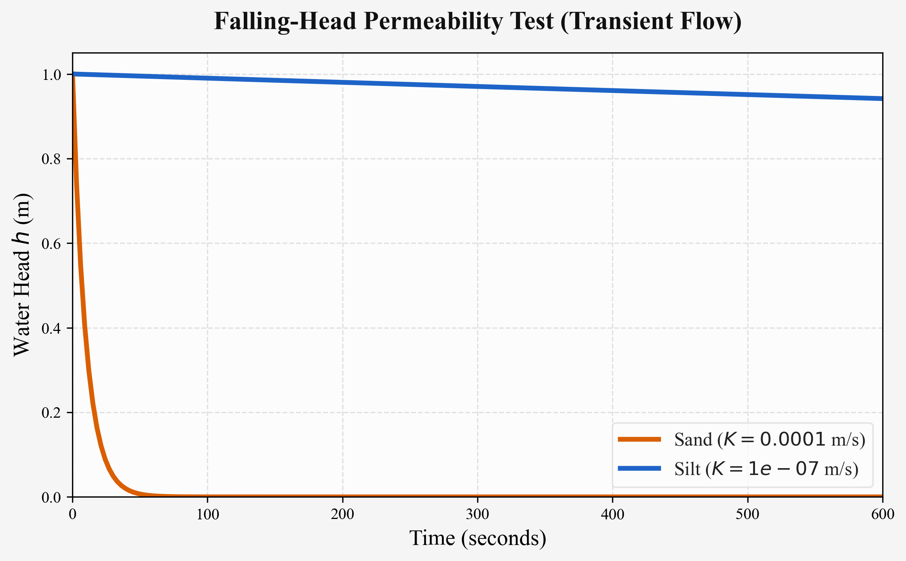
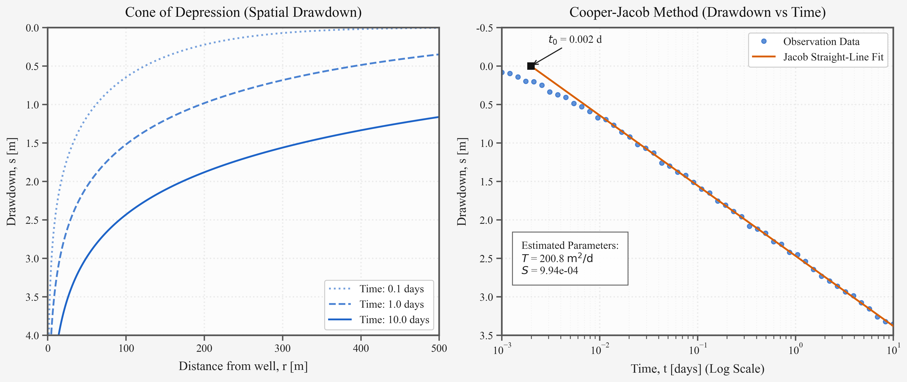
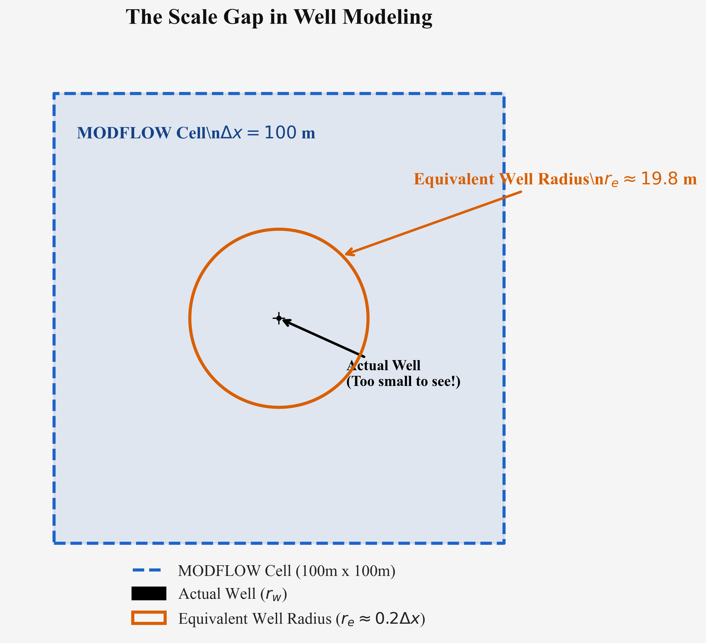

[第3回](../groundwater-sci03/index.qmd)では、地下水がどちらへ向かってどのくらいの速さで流れるかを示す「Darcy（ダルシー）の法則」と、定常状態における水頭の物理について学んだ。

今回は、地下水開発や環境調査において最も重要な現場試験である **「揚水試験（Pumping Test）」** と、その背後にある **非定常流（Transient Flow）** の理論について考えてみよう。

数式が登場するが、第3回のように一つずつ意味を追っていけば難しくはない。Pythonを使った図解を交えながら、直感的に理解できるように進めていく。

---

## はじめに：ストローで水を吸うように {#sec-intro}

コップに刺したストローで勢いよく水を吸い上げると、ストローの周りの水面が少し凹むのを見たことはないだろうか。

井戸からポンプで地下水を汲み上げる（揚水する）と、地下でもこれと全く同じことが起こる。井戸の周囲の地下水圧が下がり、水位がすり鉢状に低下していく。この水位低下の形状を **水位低下錐（Cone of Depression）** と呼ぶ。

揚水を続けると、このすり鉢は時間とともにどんどん外側へ広がり、中心部はより深くなっていく。このように「時間とともに状態（水位）が変化し続ける」流れを **非定常流（Transient Flow）** と呼ぶ。

## 地層の性質をどう測るか？（室内試験 vs 野外試験） {#sec-lab-vs-field}

地下水学者がなぜわざわざ大掛かりなお金をかけて「揚水試験」を行うのか？
その理由を深く理解するために、まずは室内で行う小さな実験（室内透水試験）と比較してみよう。

### ダルシーの実験：定水位透水試験
[第3回](../groundwater-sci03/index.qmd)で学んだダルシーの実験装置は、現在でも **「定水位透水試験（Constant-head test）」** として広く使われている。
水を一定の高さで供給し続け、円柱状の砂を通り抜ける水の量を測ることで、地層の「水を通す能力（透水係数 $K$）」を計算する。水位が変わらないため、これは**定常流（Steady Flow）**の実験である。

### 時間とともに水位が下がる：変水位透水試験 {#sec-falling-head}

一方、粘土やシルトなどの水を通しにくい土の透水性を測るには、**「変水位透水試験（Falling-head test）」**がよく用いられる。これは細いパイプ（変水位目盛管）に水を満たし、土の試料を通って水が少しずつ抜けていく（水位が下がる）スピードを測る実験である。

水位が時間とともに変化するため、これは**非定常流（Transient Flow）**の最もシンプルな例と言える。

実際の試験では、以下の計算式を用いて**飽和透水係数 $K$** を算出する。

$$
K = \frac{2.3 \cdot a \cdot L}{A \cdot t} \log_{10} \frac{h_1}{h_2} \quad (\text{cm/sec})
$$

ここで、各変数は以下の通りである：

- $a$: 変水位目盛管の断面積 ($\text{cm}^2$)
- $A$: 試料の断面積 ($\text{cm}^2$)
- $L$: 試料の厚さ ($\text{cm}$)
- $t$: 測定時間 ($\text{sec}$)
- $h_1$: 測定開始時の水位（試料下部水面からの高さ） ($\text{cm}$)
- $h_2$: 測定終了時の水位（同上） ($\text{cm}$)

#### 透水係数の温度補正（15℃）

また、水を通す能力は水の粘り気（粘性）に影響されるため、水温が変わると透水係数も変化する。そこで、標準的な温度である15℃の透水係数 $K_{15}$ に補正することが一般的である。

$$
K_{15} = K_T \times \frac{\eta_T}{\eta_{15}}
$$

- $K_T$: 温度 $T$℃ における透水係数
- $\eta_T$: 温度 $T$℃ における水の粘性
- $\eta_{15}$: 15℃ における水の粘性

なお、温度 $T$℃ における水の粘性 $\eta_T$ は、水温 $W_t$ を用いて以下の経験式から精度よく算出できる。

$$
\eta_T = \frac{100}{2.1482 \left[ (W_t - 8.435) + \sqrt{8078.4 + (W_t - 8.435)^2} \right] - 120}
$$

#### 計算の具体例（例題）

数式だけではイメージしづらいため、実際の寸法を使って透水係数を手計算してみよう。

**【測定条件（例）】**
- 変水位目盛管の断面積 $a = 0.503 \, \text{cm}^2$
- 試料の断面積 $A = 19.6 \, \text{cm}^2$
- 試料の厚さ $L = 5.1 \, \text{cm}$
- 測定開始時の水位 $h_1 = 18.0 \, \text{cm}$
- 測定終了時（360秒後）の水位 $h_2 = 8.0 \, \text{cm}$
- 測定時間 $t = 360 \, \text{sec}$（6分）
- 測定時の水温 $W_t = 20 \, \text{℃}$

**① 飽和透水係数 $K_{20}$ の計算**
まず、上記の測定値を公式に代入する。

$$
\begin{align*}
K_{20} &= \frac{2.3 \times 0.503 \times 5.1}{19.6 \times 360} \log_{10} \left( \frac{18.0}{8.0} \right) \\
&= \frac{5.90019}{7056} \times \log_{10}(2.25) \\
&\approx 0.00083618 \times 0.35218 \\
&\approx 2.94 \times 10^{-4} \quad (\text{cm/sec})
\end{align*}
$$

**② 15℃への温度補正**
次に、経験式を用いて20℃と15℃の水の粘性（$\eta_{20}$, $\eta_{15}$）を手計算する。

【20℃の粘性 $\eta_{20}$ の計算】
$$
\begin{align*}
\eta_{20} &= \frac{100}{2.1482 \left[ (20 - 8.435) + \sqrt{8078.4 + (20 - 8.435)^2} \right] - 120} \\
&= \frac{100}{2.1482 \left[ 11.565 + \sqrt{8078.4 + 133.75} \right] - 120} \\
&\approx \frac{100}{2.1482 \times 102.186 - 120} \\
&\approx \frac{100}{99.516} \approx 1.0049
\end{align*}
$$

【15℃の粘性 $\eta_{15}$ の計算】
$$
\begin{align*}
\eta_{15} &= \frac{100}{2.1482 \left[ (15 - 8.435) + \sqrt{8078.4 + (15 - 8.435)^2} \right] - 120} \\
&\approx \frac{100}{2.1482 \times 96.684 - 120} \\
&\approx \frac{100}{87.697} \approx 1.1403
\end{align*}
$$

これらを補正公式に代入して、標準温度である15℃での透水係数を求める。

$$
\begin{align*}
K_{15} &= 2.94 \times 10^{-4} \times \frac{1.0049}{1.1403} \\
&\approx 2.60 \times 10^{-4} \quad (\text{cm/sec})
\end{align*}
$$

このように、水温による粘性の違い（約14%の差）をしっかり補正することで、季節や測定日に依存しない標準的な地層のパラメータを得ることができるのである。

::: {.callout-note title="コラム：たった5℃の違いで透水性が変わる？（Binghamの粘性式）"}
上記の計算例で、20℃と15℃の水の粘性を計算すると、それぞれ約1.00と約1.14となりました。「たった5℃違うだけで、粘性が0.14（約14%）も変わるの？」と驚かれるかもしれません。

実は水は、温度によってドロドロ具合（粘性）が劇的に変わる性質を持っています。もし温度補正をせずに、真冬（水温5℃）と真夏（水温25℃）で同じ土の透水試験を行うと、土の性質は全く同じでも、水が冷たくてネバネバしている冬の方が「透水係数が半分近く小さく（水を通しにくく）」測定されてしまいます。季節によるデータのブレを防ぐため、標準温度（15℃）への補正が不可欠なのです。

ちなみに、ここで用いた「$2.1482$」や「$8078.4$」といった独特な係数を持つ経験式は、1922年にユージン・C・ビンガム（Eugene C. Bingham）らがまとめた研究に端を発する有名な近似式です。現在でも流体力学のシミュレーションや地盤工学など、幅広い分野で「水温から粘性を一発で求める標準式」として使われ続けています。
:::

#### Pythonによるシミュレーションと計算

これらの関係式を用いて、実際の試験器具の寸法（高さ、半径など）を変数として定義し、透水係数の計算と水位低下のシミュレーションをPythonで行ってみよう。



オレンジ色の「砂」は透水性が高いため、あっという間に水が抜けて水位がゼロに近づく。一方、青色の「シルト」はじわじわとしか水位が下がらない。時間とともにカーブを描いて状態が変化していくこの様子こそが、まさに非定常流の姿である。

<details>
<summary>Pythonコードを表示（変水位試験の計算とシミュレーション）</summary>

```python
import numpy as np
import matplotlib.pyplot as plt

# 1. 試験器具の寸法（変数の定義）
r_pipe = 0.4      # 目盛管の半径 (cm)
r_sample = 2.5    # 試料の半径 (cm)

a = np.pi * r_pipe**2    # 目盛管の断面積 a (約0.503 cm2)
A = np.pi * r_sample**2  # 試料の断面積 A (約19.6 cm2)
L = 5.1                  # 試料の厚さ (cm)

h1 = 18.0                # 初期水位 (cm)
h2 = 8.0                 # t秒後の水位 (cm)
t_meas = 360.0           # 測定時間 (6分 = 360秒)

# 2. 飽和透水係数の計算式
def calc_K(a, A, L, t, h1, h2):
    # K = (2.3 * a * L) / (A * t) * log10(h1 / h2)
    # （※ 2.3 * log10 は自然対数 ln の近似です）
    K = (2.3 * a * L) / (A * t) * np.log10(h1 / h2)
    return K

K_sample = calc_K(a, A, L, t_meas, h1, h2)
print(f"算出された透水係数: {K_sample:.2e} cm/sec")

# 3. 水の粘性と温度補正（15℃）
def calc_viscosity(Wt):
    """温度 Wt (℃) における水の粘性 η を計算"""
    term1 = Wt - 8.435
    term2 = np.sqrt(8078.4 + term1**2)
    eta = 100 / (2.1482 * (term1 + term2) - 120)
    return eta

Wt_measure = 20.0  # 測定時の水温（例: 20℃）
eta_T = calc_viscosity(Wt_measure)
eta_15 = calc_viscosity(15.0)

K_15 = K_sample * (eta_T / eta_15)
print(f"15℃補正後の透水係数 K_15: {K_15:.2e} cm/sec")

# 4. 水位低下のシミュレーション
# 任意の透水係数 K_sim を与えたときの時間変化 h(t) を計算
def simulate_falling_head(K_sim, t_array):
    alpha = (K_sim * A) / (a * L)
    # 理論解: h(t) = h1 * exp(-alpha * t)
    return h1 * np.exp(-alpha * t_array)

t_array = np.linspace(0, 600, 200) # 0〜600秒
K_sand = 1e-3   # 砂の透水係数 (cm/sec)
K_silt = 1e-5   # シルトの透水係数 (cm/sec)

h_sand = simulate_falling_head(K_sand, t_array)
h_silt = simulate_falling_head(K_silt, t_array)

# (描画コード省略: matplotlibでt_arrayとhをプロット)
```
</details>

### なぜ室内試験だけではダメなのか？（不均質性の問題）
室内試験は安価で簡単だが、ボーリング等で採取した直径数センチの「乱された土」の**点**のデータしか測れない。実際の地層は均質ではなく、ひび割れ（亀裂）や、砂礫レンズと粘土の複雑な層状構造など、マクロな**不均質性（Heterogeneity）**を含んでいる。小さな室内サンプルではそれらの影響を取りこぼしてしまうのである。

そこで、実際の地層全体の平均的な性質（スケール効果を含んだリアルな水理特性）を**面**として測るために、巨大な野外フィールドに持ち出して行うのが **揚水試験（Pumping Test）** である。
この試験によって初めて、地層の**「水を通す能力（透水量係数 $T$）」**と**「水を貯める能力（貯留係数 $S$）」**という、予測シミュレーションに不可欠な2つのパラメータを得ることができる。

---

## 揚水試験の理論：Theis（タイス）の公式 {#sec-theis}

### 熱伝導からのひらめき

1930年代、揚水試験のデータは「水位が完全に安定した状態（定常状態）」を仮定した式で解析されていた。しかし、現実の試験で水位が完全に安定することなど滅多にない。

USGS（米国地質調査所）の水文学者だったC.V. Theis（タイス）は、この問題に悩んでいた。ある時彼は、地下水の流れと**熱伝導**の間に深い物理的・数学的な類似性があることに気づき、数学者の友人に手紙を書いた[@freeze1979]。

> 「地下水理論には熱勾配・熱伝導率・比熱それぞれに対応する量がある。熱伝導の理論で既に解かれている問題が、私たちの問題の近似解になるのではないか？」

この見事なひらめきから、熱伝導の既知の解を応用して導き出されたのが、1935年に発表された **Theisの非平衡公式** である[@theis1935]。

### 数式を追ってみよう

無限に広がる均質な帯水層から、一定の量で水を汲み上げ続けた場合の水位低下量 $s$ は、Theisの公式によって次のように表される。

$$
s = \frac{Q}{4 \pi T} W(u)
$$

$$
u = \frac{r^2 S}{4 T t}
$$

少し複雑に見えるが、一つずつ分解してみよう。

- $s$ : 水位がどれだけ下がったか（**水位低下量**） [m]
- $Q$ : ポンプで汲み上げる水の量（**揚水量**） [m³/day]
- $T$ : 地層の水を通す能力（**透水量係数**） [m²/day]
- $S$ : 地層の水を貯める能力（**貯留係数**） [-]
- $r$ : 井戸から測る場所までの**距離** [m]
- $t$ : ポンプを動かし始めてからの**時間** [day]

そして $W(u)$ は **「井戸関数（Theis Well Function）」** と呼ばれる少し特殊な関数（指数積分）である。
重要なのは $u$ の中身である。

$$u = \frac{\text{距離 } r^2 \times \text{貯める力 } S}{4 \times \text{通す力 } T \times \text{時間 } t}$$

$u$ は「観測点が遠い（$r$ が大きい）」「時間が短い（$t$ が小さい）」ほど大きくなる。
$u$ が小さいほど $W(u)$ は大きくなり、結果として水位低下 $s$ は大きくなる。直感的にも、「井戸に近いほど」「長く汲み続けるほど」水位が大きく下がるという自然の感覚とぴったり一致している。

---

## もっと簡単に：Jacob（ヤコブ）の直線図法 {#sec-jacob}

Theisの式は強力だが、$W(u)$ という特殊な関数のせいで、手計算で $T$ や $S$ を逆算するのは非常に面倒だった。

そこで1946年、CooperとJacobは「**時間が十分に経って、井戸の近く（つまり $u$ が 0.01 より小さくなった時）**」なら、複雑な関数の計算を省略して、もっと簡単な式に近似できることを発見した[@cooper1946]。
これが **Jacob（ヤコブ）の直線図法** である。

$$
s \approx \frac{2.303 Q}{4 \pi T} \log_{10} \left( \frac{2.25 T t}{r^2 S} \right)
$$

この式の素晴らしいところは、水位低下 $s$ が「時間の対数（$\log_{10} t$）」の**一次関数（直線）**になることである。
つまり、横軸に時間を対数（1, 10, 100...と増えるスケール）で取り、縦軸に水位低下を取ってグラフを描くと、データが**ピシッと一直線上に並ぶ**のである。

### Pythonで可視化する揚水試験

実際にPythonを使って、Theisの式が描く「水位低下錐」と、Jacobの法則が示す「直線のデータ」を見てみよう。



左の図は、揚水開始から 0.1日後、1日後、10日後と、時間が経つにつれてすり鉢（Cone of Depression）がどんどん深く、広く広がっていく様子を表している。

右の図は、井戸から30m離れた観測井戸の水位低下を時間ごとにプロットしたものである。横軸が対数スケールになっており、点線より右側（$u < 0.01$ の条件を満たした以降）のデータが見事な直線を描いている。
実務では、この「直線の傾き」から透水量係数 $T$ を、「直線が横軸（$s=0$）と交わる時間（$t_0$）」から貯留係数 $S$ を計算する。

<details>
<summary>Pythonコードを表示（Theis関数とJacob解析）</summary>

```python
import numpy as np
import matplotlib.pyplot as plt
from scipy.special import exp1

# 1. パラメータ定義
Q = 1000.0   # 揚水量 (m3/day)
T = 200.0    # 透水量係数 (m2/day)
S = 0.001    # 貯留係数 (-)

def theis_drawdown(r, t, Q, T, S):
    """Theis公式に基づく水位低下量の計算"""
    u = (r**2 * S) / (4.0 * T * t)
    # scipyの exp1 が Theis井戸関数 W(u) に相当する
    s = (Q / (4.0 * np.pi * T)) * exp1(u)
    return s

# 2. Jacob法による解析（観測井までの距離 30m）
r_obs = 30.0 
t_times = np.logspace(-3, 1, 50)
s_time = theis_drawdown(r_obs, t_times, Q, T, S)

# ノイズを付加して「現場の実測データ」っぽくする
np.random.seed(42)
s_noisy = s_time + np.random.normal(0, 0.02, size=len(s_time))

# u < 0.01 となる後半部分のデータで直線を引く
t_crit = (r_obs**2 * S) / (0.04 * T)
valid_idx = np.where(t_times > t_crit)[0]

if len(valid_idx) > 2:
    log_t_valid = np.log10(t_times[valid_idx])
    s_valid = s_noisy[valid_idx]
    coeffs = np.polyfit(log_t_valid, s_valid, 1) # 最小二乗法で直線を当てはめ
    
    # 直線の傾きから Δs を求め、T と S を逆算
    delta_s = coeffs[0]
    t0 = 10**(-coeffs[1] / coeffs[0]) # s=0 となる時間
    
    T_est = (2.303 * Q) / (4 * np.pi * delta_s)
    S_est = (2.25 * T_est * t0) / (r_obs**2)
    
    print(f"解析結果: T = {T_est:.1f} m2/d, S = {S_est:.2e}")
```
</details>

---

## モデリングの壁：Peacemanの井戸モデル {#sec-peaceman}

ここまでTheisの美しい数式を見てきたが、MODFLOWのような「セル（格子）」を使った数値シミュレーションで井戸を再現しようとすると、大きな壁にぶつかる。

それは **「スケールのギャップ」** である。

実際の井戸の直径は数十センチメートルしかない。一方で、シミュレーションのグリッドセルは通常 10m や 100m もある。
MODFLOWが計算して出力するのは「その巨大なセル全体の平均的な水位（セル中心の水頭）」である。しかし、私たちが知りたいのは「実際の細い井戸の中で、水位がどれくらい深く下がっているか」である。両者は決して一致しない。

### 等価井戸半径（Equivalent Well Radius）という発想

この問題を解決したのが、Peacemanによる**井戸モデル**である[@peaceman1983]。
彼は「セル中心の平均水位とは、解析解におけるどの距離（$r$）の水位に相当するのか？」を数学的に解き明かした。

正方形のセル（1辺が $\Delta x$）の場合、セル中心の水位は、井戸の中心から **$r_e \approx 0.2 \Delta x$** 離れた場所の水位と等しくなることを数学的に示したのである。この $r_e$ を **等価井戸半径（Equivalent Well Radius）** と呼ぶ。

百聞は一見にしかず。これがどれくらいのスケール感なのか、Pythonで図にしてみた。



100m四方の巨大なMODFLOWセル（青い点線）の中央に、実際の井戸がある。しかし実際の井戸（半径15cm程度）は**小さすぎて図では黒い点にしか見えない**。
そこでPeacemanは、MODFLOWのセルが持っている平均水位は、オレンジ色の円（半径約20mの仮想的な井戸）のフチにおける水位に相当すると考えた。

この概念を用いて、セル中心の平均水頭 $h_{i,j}$ と実際の井戸内水位 $h_w$ の関係を繋ぐのが **井戸指数（Well Index, $WI$）** である。

$$
Q = WI \times (h_{i,j} - h_w)
$$
$$
WI = \frac{2 \pi T}{\ln(r_e / r_w)}
$$

MODFLOWのWEL（井戸）パッケージを使うとき、裏側ではこのPeacemanの理論が静かに働いており、巨大なグリッドと極小の井戸の間の「スケールのギャップ」を見事に埋めてくれているのである。

<details>
<summary>Pythonコードを表示（スケールギャップの作図）</summary>

```python
import matplotlib.pyplot as plt
import matplotlib.patches as patches

# セルサイズ 100m
dx, dy = 100.0, 100.0
cx, cy = 0.0, 0.0

fig, ax = plt.subplots(figsize=(8, 8))

# MODFLOWのセル (四角形)
rect = patches.Rectangle((cx - dx/2, cy - dy/2), dx, dy, 
                         linewidth=2, edgecolor='#1E64C8', facecolor='#1E64C8', alpha=0.1)
ax.add_patch(rect)
ax.plot([cx - dx/2, cx + dx/2, cx + dx/2, cx - dx/2, cx - dx/2],
        [cy - dy/2, cy - dy/2, cy + dy/2, cy + dy/2, cy - dy/2], 
        color='#1E64C8', lw=2.5, linestyle='--')

# 実際の井戸 (本来は見えないほど小さい)
well = patches.Circle((cx, cy), 0.3, linewidth=2, edgecolor='black', facecolor='black', zorder=5)
ax.add_patch(well)

# Peacemanの等価井戸半径 (r_e = 0.198 * dx)
r_e = 0.198 * dx
eq_well = patches.Circle((cx, cy), r_e, linewidth=2.5, edgecolor='#D95F02', facecolor='none', linestyle='-', zorder=4)
ax.add_patch(eq_well)

ax.set_aspect('equal')
ax.set_xlim(-60, 60)
ax.set_ylim(-60, 60)
ax.axis('off')
plt.title("The Scale Gap in Well Modeling", fontsize=16)
plt.show()
```
</details>

---

## おわりに {#sec-summary}

今回は井戸から水を汲み上げる揚水試験をテーマに、時間とともに変化する**非定常流**の世界をのぞいてみた。

Theisの非平衡公式は、熱伝導との美しいアナロジーから生まれた地下水科学の金字塔である。そしてJacobの直線図法を使えば、現場のデータから驚くほどシンプルに地層の性質を読み解くことができる。
さらにPeacemanの井戸モデルを知ることで、私たちが使うシミュレーションソフト（MODFLOW）が、裏でどれほど巧妙に「現実とのズレ」を補正してくれているかが分かったと思う。

次回は、地下水が地上へ顔を出す場所——「**河川と地下水の関係**」について解説する。「雨が降っていないのに、なぜ川の水は枯れないのか？」という素朴な疑問を解き明かしていこう。

---

## 参考文献 {#sec-references}

::: {#refs}
:::

---

## 連載記事一覧（地下水科学入門シリーズ）

- [第1回：水循環とは？— 雨はどこへ行くのか](../groundwater-sci01/index.qmd)
- [第2回：地下水はどこに存在し、どう動くのか？— 地層という器と地形というエンジン](../groundwater-sci02/index.qmd)
- [第3回：地下水はなぜ動くのか？— ダルシーの法則と水頭の物理](../groundwater-sci03/index.qmd)
- [第4回：室内透水試験・揚水試験と井戸のモデル化 — 地層の性質をどう測るか？](../groundwater-sci04/index.qmd) （本記事）
- 第5回：河川と地下水の関係（予定）
