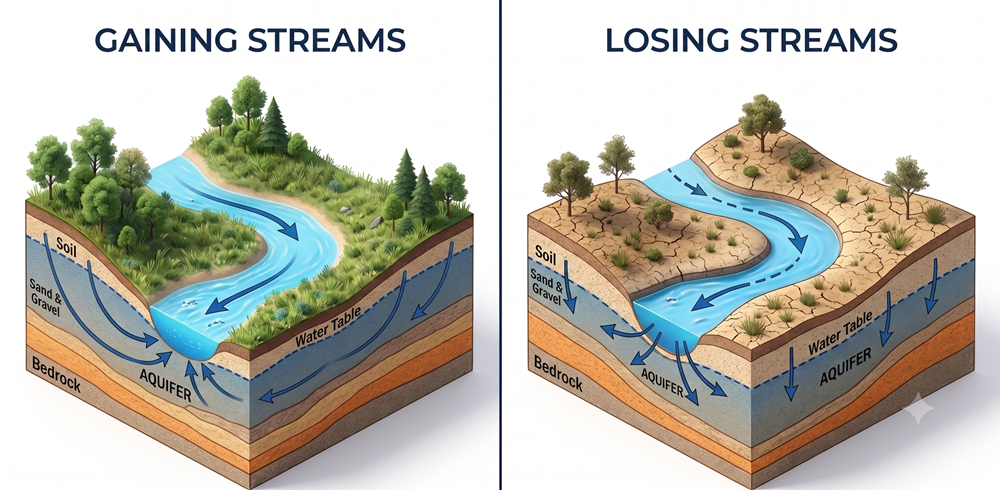
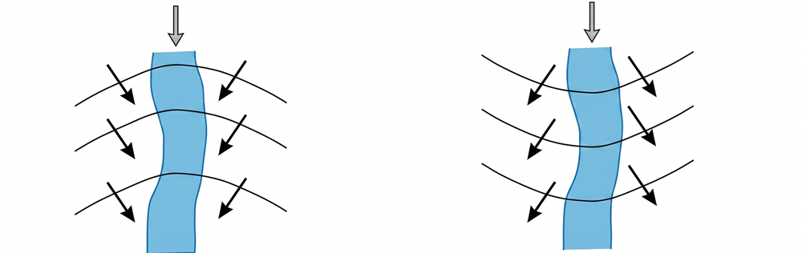
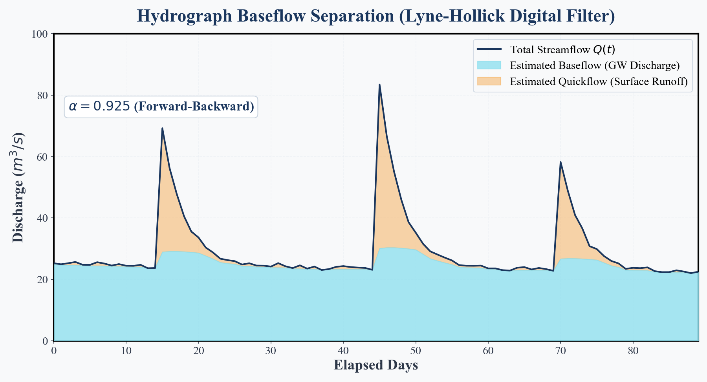

## Introduction: The Mystery of Persistent River Flow {#sec-intro}

Why do rivers continue to flow even when it hasn't rained for weeks?

Saying that water simply flows down from the mountains is only a partial answer. If rainfall were the sole source of river water, small streams would completely dry up within a few days after the rain stops.

However, in reality, they do not. This is because water is continuously supplied from beneath the ground, unseen. This persistent flow, which sustains rivers during dry periods and originates from groundwater, is called **baseflow**.

Rivers and groundwater are not isolated systems; they are dynamically connected through porous gravel and sand layers. In this article, we will explore the mechanisms of water exchange between rivers and groundwater, the underlying hydraulic and mathematical principles, and how to separate baseflow from a hydrograph using Python.

---

## The Physics of Connection: Gaining and Losing Streams {#sec-interaction-physics}

The hydraulic relationship between a river and an aquifer (the geological formation storing groundwater) is broadly classified into two categories based on the relative elevations of the water table and the river stage [@freeze1979].

{#fig-gaining-losing}

When viewed from above as a "plan view," the relationship between the river and groundwater flow becomes even clearer.

{#fig-plan-view}

In the plan view (@fig-plan-view), the curved black lines represent **equipotential lines** (groundwater contours), and the arrows indicate **flowlines** showing the direction of groundwater movement. Groundwater always flows perpendicular to the equipotential lines, from higher to lower hydraulic head. For a gaining stream (left), the contours form a "V" shape pointing upstream, with flow converging into the river. Conversely, for a losing stream (right), the contours form an inverted "V" shape, with flow diverging away from the river.


### Gaining Stream
A gaining stream occurs when the surrounding water table is higher than the river water level (stage) (@fig-gaining-losing Left).
Under these conditions, groundwater flows from the aquifer into the river driven by the hydraulic gradient. Consequently, the streamflow increases in the downstream direction. In humid regions like Japan, most rivers remain in this "gaining" state throughout the year, which is the primary reason why they do not dry up during dry spells.

### Losing Stream
A losing stream occurs when the surrounding water table is lower than the river stage (@fig-gaining-losing Right).
In this case, river water leaks through the riverbed into the aquifer, driven by gravity and the hydraulic gradient. This phenomenon is commonly observed in arid regions or areas where the water table has been drawn down due to excessive groundwater pumping. The flow of such rivers decreases downstream, and some may dry up entirely.


---

---

## Python Hands-on: Hydrograph Baseflow Separation {#sec-python-hands-on}

The streamflow hydrograph measured at a gauging station is a combination of "quickflow" (direct runoff following rainfall events) and "baseflow" (slow discharge from groundwater).

Separating these two components is crucial for estimating groundwater recharge rates and predicting water availability during dry seasons. In this hands-on section, we will implement the **Lyne-Hollick digital filter method**, a classic technique in hydrology, using Python to separate baseflow from a synthetic hydrograph.

### The Lyne-Hollick Filter Algorithm
The method proposed by Lyne & Hollick [@lyne1979] uses a digital low-pass filter, analogous to signal processing, to remove quickflow (high-frequency components) and isolate baseflow (low-frequency components).

$$
q_t = \alpha q_{t-1} + \frac{1+\alpha}{2} (Q_t - Q_{t-1})
$$

$$
b_t = Q_t - q_t
$$

Where the variables are defined as:
*   $Q_t$: total streamflow at time step $t$ ($m^3/s$)
*   $q_t$: quickflow at time step $t$ ($m^3/s$)
*   $b_t$: baseflow at time step $t$ ($m^3/s$)
*   $\alpha$: filter parameter (typically ranges from 0.90 to 0.995; a larger value yields a smoother baseflow. A value of 0.925 is commonly used for daily flow data)

*Note: The constraints $q_t \ge 0$ and $b_t \ge 0$ (implying $q_t \le Q_t$) must be satisfied at each step. To eliminate phase shift, it is standard practice to run the filter forward, reverse the time series and run it backward, and then average the results (Forward-Backward pass) [@chapman1991].*

### Implementation Code

The following script generates a synthetic hydrograph with storm peaks, applies the digital filter, and plots the results (this is the exact script used to generate the figure in this post).

```python
import numpy as np
import matplotlib.pyplot as plt

# 1. Generate synthetic hydrograph data
np.random.seed(42)
days = 90
t = np.arange(days)

# Smooth baseflow representing groundwater contribution (true curve)
baseflow_true = 15.0 * np.exp(-t / 120.0) + 5.0 * np.sin(2.0 * np.pi * t / 365.0) + 10.0

# Storm-induced quickflow
quickflow = np.zeros(days)
storm_days = [15, 45, 70]
storm_magnitudes = [45.0, 60.0, 35.0]

for sd, mag in zip(storm_days, storm_magnitudes):
    for i in range(days):
        if i >= sd:
            quickflow[i] += mag * np.exp(-(i - sd) / 3.0)  # Exponential recession

# Total streamflow = baseflow + quickflow + noise
total_flow = baseflow_true + quickflow + np.random.normal(0, 0.5, days)
total_flow = np.clip(total_flow, 1.0, None)

# 2. Apply the Lyne-Hollick Digital Filter (Forward-Backward Pass)
alpha = 0.925

# Forward Pass
q_f = np.zeros(days)
for i in range(1, days):
    q_f[i] = alpha * q_f[i-1] + 0.5 * (1 + alpha) * (total_flow[i] - total_flow[i-1])
    if q_f[i] < 0:
        q_f[i] = 0
    elif q_f[i] > total_flow[i]:
        q_f[i] = total_flow[i]

# Backward Pass
q_b = np.zeros(days)
for i in range(days-2, -1, -1):
    q_b[i] = alpha * q_b[i+1] + 0.5 * (1 + alpha) * (total_flow[i] - total_flow[i+1])
    if q_b[i] < 0:
        q_b[i] = 0
    elif q_b[i] > total_flow[i]:
        q_b[i] = total_flow[i]

# Average estimated quickflow and calculate baseflow
q_est = 0.5 * (q_f + q_b)
q_est = np.clip(q_est, 0, total_flow)
baseflow_est = total_flow - q_est

# 3. Create a premium plot
fig, ax = plt.subplots(figsize=(10, 6))
fig.patch.set_facecolor('#F8F9FA')
ax.set_facecolor('#F8F9FA')

ax.plot(t, total_flow, color='#1A365D', linewidth=2, label="Total Streamflow Q(t)", zorder=4)
ax.fill_between(t, 0, baseflow_est, color='#90E0EF', alpha=0.8, label="Estimated Baseflow (GW Discharge)", zorder=3)
ax.fill_between(t, baseflow_est, total_flow, color='#F6AD55', alpha=0.5, label="Estimated Quickflow (Runoff)", zorder=2)

ax.set_xlabel("Elapsed Days", fontsize=12, fontweight='bold', color='#2D3748')
ax.set_ylabel("Discharge (m³/s)", fontsize=12, fontweight='bold', color='#2D3748')
ax.set_title("Hydrograph Baseflow Separation", fontsize=16, fontweight='bold', color='#1A365D', pad=15)
ax.set_xlim(0, days-1)
ax.set_ylim(0, 100)
ax.spines['top'].set_visible(False)
ax.spines['right'].set_visible(False)
ax.spines['left'].set_color('#CBD5E0')
ax.spines['bottom'].set_color('#CBD5E0')
ax.grid(axis='y', alpha=0.4, color='#E2E8F0', linestyle='--')
ax.legend(loc="upper right", frameon=True, facecolor='#F8F9FA', edgecolor='#CBD5E0')

plt.tight_layout()
plt.show()
```

### Code Explanation for Beginners

Let's break down what the Python script above is actually doing, step-by-step.

1. **`np.random.seed(42)` and Data Generation**
   First, we create some dummy data for our experiment. `baseflow_true` represents the "slowly changing groundwater," while `quickflow` represents the "sudden surge of water after rain." Adding these together gives us the `total_flow`.
2. **`q_f = np.zeros(days)` and the `for` Loop**
   `np.zeros` creates an empty box (an array) filled with zeros. The `for i in range(...)` loop then goes through each day, adding a little bit of "yesterday's flow" to "today's flow change." This step-by-step accumulation is the core of the digital filter.
3. **Safety Net with `np.clip`**
   To prevent physically impossible numbers—like calculating that "more groundwater is discharging than the total river flow"—we use the `np.clip` function. This strictly caps the calculated values so they stay between 0 and the actual total flow.
4. **Forward-Backward Pass**
   If we only calculate forward in time, the resulting graph gets slightly shifted to the right (a delay). To fix this, we calculate forward, then calculate backward from the future to the past, and average the two. This ensures the peak aligns perfectly with the rain event.

### Analysis of the Filter Results

{#fig-baseflow-sep}

The separation results (@fig-baseflow-sep) show that during storm events when the total flow spikes, the estimated baseflow (light blue region) does not rise abruptly. Instead, it reaches a delayed, muted peak and then recedes very slowly over time.

This gradual, sustained curve embodies the "memory" of the groundwater system, which acts as a massive natural reservoir filtering out the high-frequency variations of rainfall.

---

## Conclusion: Conjunctive Management of Rivers and Groundwater {#sec-summary}

Let's review the key concepts covered in this article:

*   **Baseflow** is the source of dry-weather river flow and is primarily supplied by groundwater discharge.
*   The connection between a river and an aquifer is defined by the head difference, classifying reach dynamics into **gaining reaches** (GW discharges to stream) and **losing reaches** (stream leaks to GW).
*   Using the **Lyne-Hollick digital filter** in Python, we can quantitatively partition a stream hydrograph into baseflow and quickflow.

To address river pollution or water scarcity, it is insufficient to manage surface water alone. We must view surface water and groundwater as a single, hydraulically connected resource, managing them conjunctively (conjunctive management) to achieve sustainable water use.

---

## Next Episode Preview

In the next episode, we will focus on **Time-Series Analysis & FFT**.

> We analyze the long-term decline of unconfined groundwater levels in southern Beppu. Using signal processing (Fast Fourier Transform: FFT) and statistical analysis, we decompose the time-series data to isolate and quantify the periodic components of groundwater levels and their response to atmospheric and tidal variations.

---

## References {#sec-references}

::: {#refs}
:::

---

## Series Posts (Introduction to Groundwater Science)

1. [#1: What is the Water Cycle? — Where Does the Rain Go?](../groundwater-sci01/index-en.qmd)
2. [#2: Where Does Groundwater Exist and How Does It Move? — The Geological Vessel and Topographical Engine](../groundwater-sci02/index-en.qmd)
3. [#3: Physics of Aquifers, Darcy's Law, and Hydraulic Head](../groundwater-sci03/index-en.qmd)
4. [#4: Pumping Tests and Well Modeling](../groundwater-sci04/index-en.qmd)
5. [#5: Where Does the River Water Come From? — Interaction Between River and Groundwater](../groundwater-sci05/index-en.qmd) (This post)
6. [#6: Time-Series Analysis & FFT — Relationship Between Unconfined Groundwater Level and Barometric Pressure](../groundwater-sci06/index-en.qmd)
