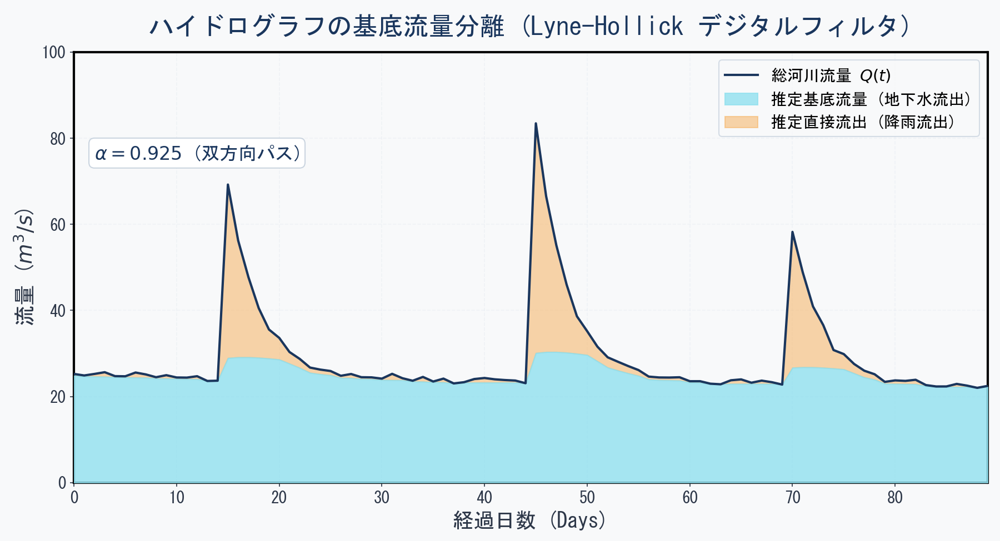

## はじめに：晴れの日が続いても川が流れる謎 {#sec-intro}

何週間も雨が降っていないのに、なぜ川の水は絶え間なく流れ続けているのだろうか？

山から水が流れ落ちてくるから、というのは部分的な答えに過ぎない。もし雨だけが川の源であるならば、雨が止んで数日もすれば、小さな川はすべて干上がってしまうはずである。

しかし、実際にはそうはならない。それは、目に見えない地表の下から、常に水が供給され続けているからである。この「雨が降っていない時期にも川に供給される、地下水由来の流れ」を**基底流量（Baseflow）**と呼ぶ。

川と地下水は独立した存在ではなく、砂や砂利の層を通じて密接につながっている。本記事では、川と地下水が交わす水のやり取りの仕組みと、その物理的・数理的背景、そしてPythonを用いたハイドログラフからの基底流量の分離手法について解説する。

---

## 川と地下水をつなぐ物理：得水河川と失水河川 {#sec-interaction-physics}

河川と帯水層（地下水を蓄える地層）のつながり方は、地下水位と河川水位の相対的な高さ関係によって大きく二つに分類される [@freeze1979]。

{#fig-gaining-losing}

また、これらを上空から見下ろした「平面図」で表すと、以下のようになります。

{#fig-plan-view}

平面図（@fig-plan-view）において、黒い曲線は地下水位の高さが等しい点を結んだ**等水頭線（コンター）**を、矢印は地下水が流れる方向（**流線**）を表しています。地下水は常に「高いところから低いところへ」と、等高線に直交するように流れます。得水河川（左）では等水頭線がＶ字型を描き矢印が川に集まる一方、失水河川（右）では逆Ｖ字型となり矢印が川から外へ広がることが分かります。


### 得水河川（Gaining Stream）
周りの地下水位が、川の水位よりも高い場合である（@fig-gaining-losing 左）。
このとき、地下水は水頭勾配（水圧の差）に従って帯水層から川へと湧き出る。結果として、下流に行くほど川の流量は増加する。日本の湿潤な気候における多くの河川は、年間を通じてこの「得水河川」の状態にあり、これが雨が降らなくても川が涸れない最大の理由である。

### 失水河川（Losing Stream）
周りの地下水位が、川の水位よりも低い場合である（@fig-gaining-losing 右）。
この場合、川の水は重力と水頭勾配によって川底から帯水層へと染み出していく。乾燥地域や、過剰な地下水揚水によって周囲の地下水位が低下した地域でよく見られる。このような川は、下流に行くほど流量が減少するか、あるいは完全に途中で干上がってしまう。

---

---

## Pythonハンズオン：ハイドログラフの基底流量分離 {#sec-python-hands-on}

実際の河川で観測される流量データ（ハイドログラフ）は、降雨の直後に急激に立ち上がる「直接流出（Quickflow）」と、地下水がじわじわと染み出す「基底流量（Baseflow）」が合わさったものである。

これら二つの成分を分離することは、流域の地下水涵養量を推定したり、渇水期の水資源量を予測したりするうえで極めて重要である。今回は、水文学で広く用いられる **Lyne-Hollickのデジタルフィルタ法** をPythonで実装し、合成ハイドログラフから基底流量を分離してみよう。

### Lyne-Hollick フィルタのアルゴリズム
Lyne & Hollick [@lyne1979] によって提案された手法は、信号処理のローパスフィルタに似たアプローチで直接流出（高周波成分）を除去し、基底流量（低周波成分）を抽出する。

$$
q_t = \alpha q_{t-1} + \frac{1+\alpha}{2} (Q_t - Q_{t-1})
$$

$$
b_t = Q_t - q_t
$$

ここで：

*   $Q_t$: 時刻 $t$ における総河川流量 ($m^3/s$)
*   $q_t$: 時刻 $t$ における直接流出量 ($m^3/s$)
*   $b_t$: 時刻 $t$ における基底流量 ($m^3/s$)
*   $\alpha$: フィルタパラメータ。通常 0.90〜0.995 の範囲（値が大きいほど基底流量が滑らかになる。日流量データでは 0.925 程度が定番）

※ 計算上の制約条件として、$q_t \ge 0$ かつ $b_t \ge 0$（すなわち $q_t \le Q_t$）を常に維持する。また、1回のフィルタリングでは流出のピークに対して位相の遅れが生じるため、順方向（Forward）にフィルタをかけた後、時系列を逆方向（Backward）にして再度かけ、それらを平均する「双方向パス（Forward-Backward pass）」を行うのが標準的である [@chapman1991]。

### 実装コード

以下のコードは、降雨イベントを模したダミーの流量データを作成し、デジタルフィルタを適用して基底流量を分離・可視化するためのスクリプトである（本記事の図を生成したコードそのもの）。

```python
import numpy as np
import matplotlib.pyplot as plt

# 1. 疑似ハイドログラフデータの作成
np.random.seed(42)
days = 90
t = np.arange(days)

# 地下水由来の緩やかな基底流量（真値のモデル）
baseflow_true = 15.0 * np.exp(-t / 120.0) + 5.0 * np.sin(2.0 * np.pi * t / 365.0) + 10.0

# 降雨に伴う突発的な直接流出
quickflow = np.zeros(days)
storm_days = [15, 45, 70]
storm_magnitudes = [45.0, 60.0, 35.0]

for sd, mag in zip(storm_days, storm_magnitudes):
    for i in range(days):
        if i >= sd:
            quickflow[i] += mag * np.exp(-(i - sd) / 3.0)  # 指数減衰流出

# 総流量 = 基底流量 + 直接流出 + 観測ノイズ
total_flow = baseflow_true + quickflow + np.random.normal(0, 0.5, days)
total_flow = np.clip(total_flow, 1.0, None)

# 2. Lyne-Hollick デジタルフィルタの適用 (双方向パス)
alpha = 0.925

# 順方向パス (Forward Pass)
q_f = np.zeros(days)
for i in range(1, days):
    q_f[i] = alpha * q_f[i-1] + 0.5 * (1 + alpha) * (total_flow[i] - total_flow[i-1])
    # 制約条件の適用
    if q_f[i] < 0:
        q_f[i] = 0
    elif q_f[i] > total_flow[i]:
        q_f[i] = total_flow[i]

# 逆方向パス (Backward Pass)
q_b = np.zeros(days)
for i in range(days-2, -1, -1):
    q_b[i] = alpha * q_b[i+1] + 0.5 * (1 + alpha) * (total_flow[i] - total_flow[i+1])
    if q_b[i] < 0:
        q_b[i] = 0
    elif q_b[i] > total_flow[i]:
        q_b[i] = total_flow[i]

# 直接流出の推定値を平均化し、基底流量を算出
q_est = 0.5 * (q_f + q_b)
q_est = np.clip(q_est, 0, total_flow)
baseflow_est = total_flow - q_est

# 3. 美麗なプロットの作成
fig, ax = plt.subplots(figsize=(10, 6))
fig.patch.set_facecolor('#F8F9FA')
ax.set_facecolor('#F8F9FA')

ax.plot(t, total_flow, color='#1A365D', linewidth=2, label="総河川流量 Q(t)", zorder=4)
ax.fill_between(t, 0, baseflow_est, color='#90E0EF', alpha=0.8, label="推定基底流量 (地下水流出)", zorder=3)
ax.fill_between(t, baseflow_est, total_flow, color='#F6AD55', alpha=0.5, label="推定直接流出 (降雨流出)", zorder=2)

ax.set_xlabel("経過日数 (Days)", fontsize=12, fontweight='bold', color='#2D3748')
ax.set_ylabel("流量 (m³/s)", fontsize=12, fontweight='bold', color='#2D3748')
ax.set_title("ハイドログラフの基底流量分離", fontsize=16, fontweight='bold', color='#1A365D', pad=15)
ax.set_xlim(0, days-1)
ax.set_ylim(0, 100)
ax.spines['top'].set_visible(False)
ax.spines['right'].set_visible(False)
ax.spines['left'].set_color('#CBD5E0')
ax.spines['bottom'].set_color('#CBD5E0')
ax.grid(axis='y', alpha=0.4, color='#E2E8F0', linestyle='--')
ax.legend(loc="upper right", frameon=True, facecolor='#F8F9FA', edgecolor='#CBD5E0')

plt.tight_layout()
plt.show()
```

### コードの初心者向け解説

上記のPythonスクリプトで何をしているのか、少しだけ紐解いてみましょう。

1. **`np.random.seed(42)` とデータの作成**
   まずは実験用のダミーデータを作ります。`baseflow_true` では「ゆっくり変化する地下水」を、`quickflow` では「雨が降って急激に増える水」を数式で表現し、それらを足し合わせて `total_flow`（総流量）を作っています。
2. **`q_f = np.zeros(days)` と `for` ループ**
   `np.zeros` は「ゼロがずらっと並んだ箱（配列）」を用意する命令です。その後の `for i in range(...)` というループを使って、1日目から順番に「昨日までの流量」と「今日の流量変化」を少しずつ足し合わせていきます。これがデジタルフィルタの正体です。
3. **`np.clip` による安全装置**
   計算の途中で「川の流量よりも大きな地下水が湧き出す」といった物理的におかしな数字が出ないよう、`np.clip` という関数を使って「必ず0以上、総流量以下に収まるように」上限と下限を切り揃えています。
4. **双方向パス（Forward-Backward pass）**
   時間を過去から未来へ進める（順方向）だけでなく、未来から過去へ遡る（逆方向）計算も行い、両者の平均をとっています。これにより、計算結果のグラフが「右にズレる（位相が遅れる）」のを防ぎ、雨が降った瞬間に正しくピークが来るようになります。

### フィルタ結果の考察

{#fig-baseflow-sep}

分離結果（@fig-baseflow-sep）を見ると、雨が降って河川流量が急増したピーク期（オレンジ色の領域）においても、地下水からの供給分である基底流量（水色の領域）は急激には上昇せず、遅れて緩やかにピークを迎え、その後も長い時間をかけてゆっくりと減少（減衰）していく様子が綺麗に表現されている。

このなだらかな曲線こそが、多孔質な地盤という巨大なフィルターを通過して川にたどり着いた「地下水の時間スケール」を体現している。

---

## まとめ：流域水循環における河川と地下水の一体管理 {#sec-summary}

今回のポイントを整理しよう。

*   **基底流量（Baseflow）**は雨が降らない時期に川を流れる水の源であり、その大部分は地下水である。
*   川と地下水の関係は、水位差によって**得水河川（周囲から川へ湧出）**と**失水河川（川から周囲へ浸透）**に分かれる。
*   Pythonを用いた**Lyne-Hollickのデジタルフィルタ法**により、観測流量から基底流量を視覚的に分離・定量評価できる。

川の汚染や水不足を解決するためには、川の水だけを見ていては不十分である。川に流れ込む地下水、あるいは川から染み出す地下水という「地表下の水循環」を一体（Conjunctive Use / Conjunctive Management）として捉え、管理することが持続可能な水資源利用には不可欠である。

---

## 次回予告 {#sec-next}

次回は「**地下水質**」がテーマとなる。

> 地下水はなぜ場所によって味や成分が違うのか？地中を流れる間に、水は周りの岩石とどのように反応し、水質が形成されていくのか。Piper図やヘキサダイアグラムといった水質分析の定番ツールをPythonとPHREEQCを組み合わせて使いこなし、水質データから「地下水の履歴書」を読み解く手法を学ぶ。

---

## 参考文献 {#sec-references}

::: {#refs}
:::

---

## 連載記事一覧（地下水科学入門シリーズ）

1. [第1回：水循環とは？— 雨はどこへ行くのか](../groundwater-sci01/index.qmd)
2. [第2回：地下水はどこに存在し、どう動くのか？— 地層という器と地形というエンジン](../groundwater-sci02/index.qmd)
3. [第3回：帯水層の物理・Darcy則・水頭（予定）](../groundwater-sci03/index.qmd)
4. [第4回：揚水試験と井戸のモデル化（予定）](../groundwater-sci04/index.qmd)
5. [第5回：川の水はどこから来ているのか？ — 河川と地下水の相互作用](../groundwater-sci05/index.qmd) （本記事）
