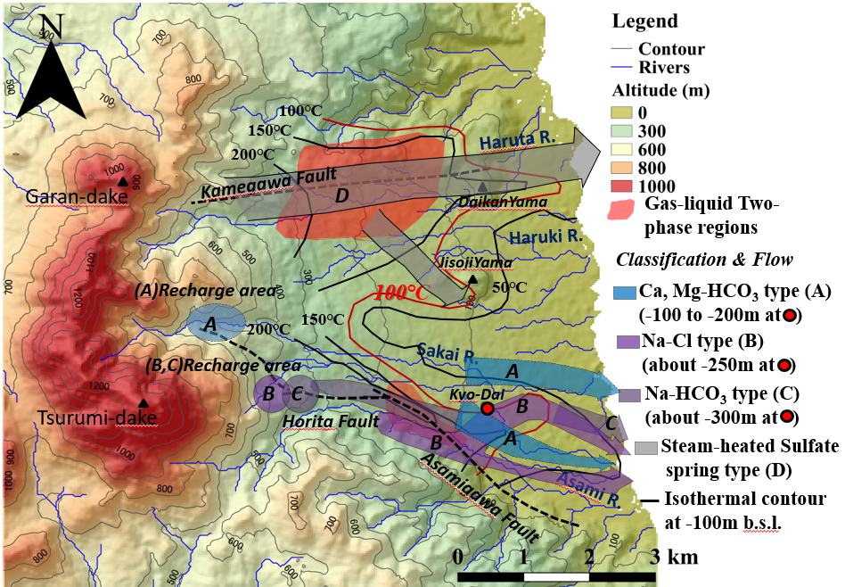
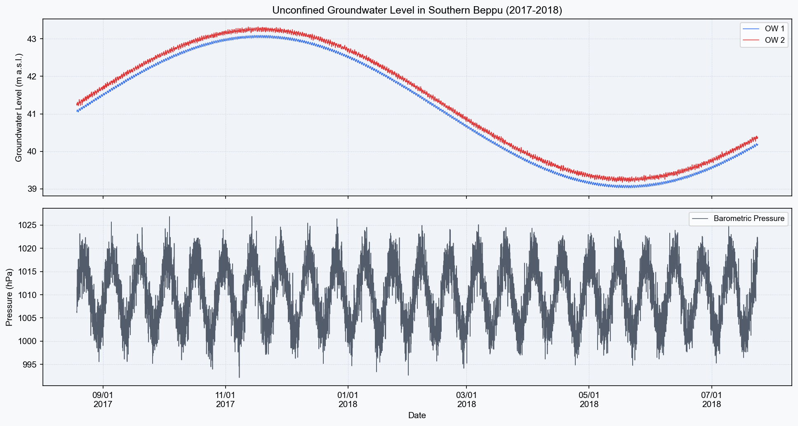
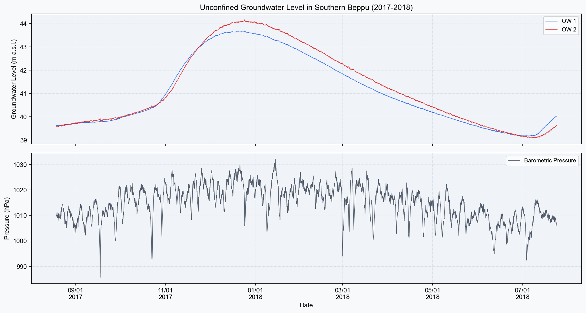
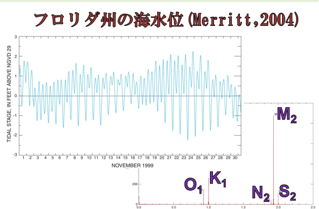

## Introduction: Hydrogeological Settings of the Beppu Geothermal System

One of the world's most active geothermal systems resides beneath the city of Beppu. Geothermal manifestations, such as steaming ground and active hot springs, are widely distributed, and both the spring discharge rate and the number of active vents are among the highest in Japan. However, the origin and flow dynamics of the shallow meteoric groundwater, as well as the mechanisms governing its long-term decline, remain critical hydrogeological questions.

In this series, we analyze time-series data of unconfined groundwater levels measured at the Beppu Geothermal Research Center of Kyoto University. Using signal processing, statistical analysis, and Python-based scripts, we characterize the subsurface flow dynamics.

------------------------------------------------------------------------

## The Beppu Geothermal System and Hydrothermal Flow Paths

The subsurface geological structure and the conceptual hydrogeological model of the hydrothermal flow system in southern Beppu are illustrated in @fig-beppu-system.

{#fig-beppu-system}

The subsurface flow system in southern Beppu is categorized into three major hydrothermal fluid types distributed across different depth intervals.

```{=html}
<div style="overflow-x:auto; margin:1.5em 0;">
<table style="width:100%; border-collapse:collapse; font-size:0.9em;">
  <thead>
    <tr style="background:#2E7D32; color:white;">
      <th style="padding:10px 14px; text-align:left;">Type</th>
      <th style="padding:10px 14px; text-align:left;">Water Quality / Facies</th>
      <th style="padding:10px 14px; text-align:center;">Depth Range (relative to sea level)</th>
      <th style="padding:10px 14px; text-align:left;">Key Characteristics</th>
    </tr>
  </thead>
  <tbody>
    <tr style="background:#F1F8E9;">
      <td style="padding:9px 14px; font-weight:600; color:#1B5E20;">Type A</td>
      <td style="padding:9px 14px; font-size:0.88em;">Ca・Mg-HCO₃ type</td>
      <td style="padding:9px 14px; text-align:center; font-family:monospace;">−100 to −200 m</td>
      <td style="padding:9px 14px; font-size:0.88em;">Shallow meteoric water origin. Strong recharge signal.</td>
    </tr>
    <tr style="background:#FDFDFD;">
      <td style="padding:9px 14px; font-weight:600; color:#6A1B9A;">Type B</td>
      <td style="padding:9px 14px; font-size:0.88em;">Na-Cl type</td>
      <td style="padding:9px 14px; text-align:center; font-family:monospace;">approx. −250 m</td>
      <td style="padding:9px 14px; font-size:0.88em;">Located south of the Horita Fault. Enriched in deep thermal fluid.</td>
    </tr>
    <tr style="background:#FFF3E0;">
      <td style="padding:9px 14px; font-weight:600; color:#E65100;">Type C</td>
      <td style="padding:9px 14px; font-size:0.88em;">Na-HCO₃ type</td>
      <td style="padding:9px 14px; text-align:center; font-family:monospace;">approx. −300 m</td>
      <td style="padding:9px 14px; font-size:0.88em;">Deepest zone. Directly connected to the hydrothermal reservoir.</td>
    </tr>
  </tbody>
</table>
</div>
```

In addition to these types, **Type D (steam-heated acid sulfate water)** is present near the ground surface. This acidic water is generated by the reaction between volcanic gases and shallow groundwater, contributing to the famous "Hell Hot Springs" (Jigoku) in Beppu.

The geological framework of this aquifer system consists of volcanic products (tuff and tuff breccia) from Mt. Tsurumi and Mt. Garandake, overlain by unconsolidated sediments (sand and gravel). The Horita and Kamegawa faults act as low-permeability boundaries (barriers) that compartmentalize the groundwater flow, leading to significant variations in water quality and temperature across the fault blocks.

------------------------------------------------------------------------

## Mechanisms of Long-Term Water Level Decline in Unconfined Aquifers

Long-term hydrological monitoring (Yusa, 1979, 2001) has revealed a steady decline in the unconfined groundwater levels in this region. This downward trend is primarily attributed to two distinct anthropogenic and environmental factors:

```{=html}
<div style="background:#FFF7ED; border-left:4px solid #D97706; padding:1.2em 1.5em; margin:1.5em 0; border-radius:0 8px 8px 0;">
  <div style="font-weight:700; color:#92400E; margin-bottom:0.8em;">Primary Drivers of Unconfined Groundwater Level Decline</div>
  <div style="display:flex; gap:1.5em; flex-wrap:wrap;">
    <div style="flex:1; min-width:200px; background:#FFFBEB; border-radius:8px; padding:1em;">
      <div style="font-weight:600; color:#B45309; margin-bottom:0.4em;">1. Urbanization and Reduced Recharge</div>
      <div style="font-size:0.88em; color:#78350F; line-height:1.7;">
        The expansion of asphalt and concrete pavements in urban Beppu has limited the vertical infiltration of rainfall. Land-use changes from agricultural fields to paved areas have significantly reduced natural recharge rates.
      </div>
    </div>
    <div style="flex:1; min-width:200px; background:#FEF3C7; border-radius:8px; padding:1em;">
      <div style="font-weight:600; color:#B45309; margin-bottom:0.4em;">2. Pressure Drawdown in Deep Hydrothermal Reservoirs</div>
      <div style="font-size:0.88em; color:#78350F; line-height:1.7;">
        Long-term extraction of geothermal water from deep hydrothermal reservoirs has reduced reservoir pressure. This pressure drop induces downward leakage of shallow meteoric groundwater, lowering the unconfined water table (Yusa, 2001).
      </div>
    </div>
  </div>
</div>
```

Evaluating and distinguishing between these two mechanisms requires a rigorous analysis of the periodic fluctuations in the groundwater level. In this study, we utilize **Fast Fourier Transform (FFT) and cross-correlation analysis** to analyze these signals.

------------------------------------------------------------------------

## Hydrogeological Significance of Unconfined Groundwater Level Monitoring

Monitoring the shallow unconfined groundwater table, rather than directly measuring the hydraulic head of deep geothermal reservoirs, offers several distinct advantages:

```{=html}
<div style="background:#F0F4FF; border:1px solid #93C5FD; border-radius:10px; padding:1.3em 1.5em; margin:1.5em 0;">
  <div style="font-weight:700; color:#1E3A8A; margin-bottom:0.6em;">Key Objectives of Shallow Aquifer Monitoring</div>
  <ol style="color:#1E40AF; font-size:0.92em; line-height:2.0; margin:0; padding-left:1.4em;">
    <li><strong>Proxy for Deep Reservoir Pressure:</strong> The unconfined aquifer and the deep geothermal reservoirs are hydraulically connected in the vertical direction. Consequently, pressure variations in the deep reservoirs manifest as water table fluctuations in the shallow zone.</li>
    <li><strong>Evaluation of Aquifer Hydraulic Properties:</strong> Analyzing the attenuation and lag of water table responses allows for the estimation of aquifer hydraulic diffusivity (defined as transmissivity divided by storativity).</li>
    <li><strong>Feasibility of Long-Term Monitoring:</strong> Unlike deep geothermal fluids, which present harsh conditions (high temperature, high pressure, and mineral scaling) that damage sensors, the shallow unconfined aquifer can be safely monitored over multi-year periods using standard CTD-Diver pressure loggers.</li>
  </ol>
</div>
```

------------------------------------------------------------------------

## Monitoring Setup and Dataset Characteristics

The time-series dataset was collected from **two observation wells** located within the campus of the Beppu Geothermal Research Center, Kyoto University (Noguchimoto-machi, Beppu).

```{=html}
<div style="overflow-x:auto; margin:1.5em 0;">
<table style="width:100%; border-collapse:collapse; font-size:0.9em;">
  <thead>
    <tr style="background:#374151; color:white;">
      <th style="padding:10px 14px; text-align:left;">Parameter</th>
      <th style="padding:10px 14px; text-align:center;">Observation Well 1 (OW1)</th>
      <th style="padding:10px 14px; text-align:center;">Observation Well 2 (OW2)</th>
    </tr>
  </thead>
  <tbody>
    <tr style="background:#F9FAFB;">
      <td style="padding:9px 14px; font-weight:600; color:#374151;">Ground Elevation</td>
      <td style="padding:9px 14px; text-align:center;">73 m a.s.l.</td>
      <td style="padding:9px 14px; text-align:center;">80 m a.s.l.</td>
    </tr>
    <tr style="background:#FDFDFD;">
      <td style="padding:9px 14px; font-weight:600; color:#374151;">Well Distance</td>
      <td colspan="2" style="padding:9px 14px; text-align:center;">110 m</td>
    </tr>
    <tr style="background:#F9FAFB;">
      <td style="padding:9px 14px; font-weight:600; color:#374151;">Mean Water Level (Elevation)</td>
      <td style="padding:9px 14px; text-align:center;">41.06 m a.s.l.</td>
      <td style="padding:9px 14px; text-align:center;">41.25 m a.s.l.</td>
    </tr>
    <tr style="background:#FDFDFD;">
      <td style="padding:9px 14px; font-weight:600; color:#374151;">Monitoring Period</td>
      <td colspan="2" style="padding:9px 14px; text-align:center;">August 19, 2017 – July 23, 2018</td>
    </tr>
    <tr style="background:#F9FAFB;">
      <td style="padding:9px 14px; font-weight:600; color:#374151;">Sampling Interval</td>
      <td colspan="2" style="padding:9px 14px; text-align:center;">1 hour ($N = 8,136$ data points)</td>
    </tr>
    <tr style="background:#FDFDFD;">
      <td style="padding:9px 14px; font-weight:600; color:#374151;">Instrumentation</td>
      <td colspan="2" style="padding:9px 14px; text-align:center;">CTD-Diver (Resolution: 2 mm)</td>
    </tr>
    <tr style="background:#F9FAFB;">
      <td style="padding:9px 14px; font-weight:600; color:#374151;">Monitored Variables</td>
      <td colspan="2" style="padding:9px 14px; text-align:center;">Groundwater Level, Barometric Pressure, Precipitation</td>
    </tr>
  </tbody>
</table>
</div>
```

Although the two observation wells are separated by approximately 110 m, their **mean water levels are nearly identical (approximately 41 m a.s.l.)**, indicating a relatively flat water table in this unconfined aquifer. However, high-resolution analysis reveals distinct differences in their response to barometric pressure variations, which is discussed in Part 4 of this series.

------------------------------------------------------------------------

## First Step in Data Analysis: Visualization with Python

We first implement a Python script to import and visualize the time-series data.

::: callout-note
## Use of Synthetic (Dummy) Dataset for Demonstration

To ensure reproducibility and ease of learning, we initially utilize a **synthetic (dummy) dataset** generated using `numpy`. When applying this analysis to field measurements, the synthetic generator section can be replaced with `pd.read_csv()` as described in the subsequent section.
:::

``` python
# [Synthetic Data] Python script for generating and plotting synthetic groundwater level and barometric pressure data

import numpy as np
import pandas as pd
import matplotlib.pyplot as plt
import matplotlib.dates as mdates

# Plot settings
plt.rcParams.update({
    "font.family": "sans-serif",
    "font.sans-serif": ["Arial", "DejaVu Sans"],
    "axes.unicode_minus": False,
    "figure.dpi": 150,
})

# ---- Generate Synthetic Dataset (Replace with pd.read_csv() for field data) ----
np.random.seed(42)
n = 8136   # Hourly sampling for ~1 year

t = pd.date_range("2017-08-19", periods=n, freq="h")

# Define seasonal trend, barometric response, and random noise
seasonal   = 2.0 * np.sin(2 * np.pi * np.arange(n) / (24 * 365))
barometric = 0.03 * np.sin(2 * np.pi * np.arange(n) / 24)
noise_ow1  = 0.005 * np.random.randn(n)
noise_ow2  = 0.020 * np.random.randn(n)

gwl_ow1 = 41.06 + seasonal + barometric + noise_ow1
gwl_ow2 = 41.25 + seasonal + 1.05 * barometric + noise_ow2  # OW2 exhibits larger response amplitude

baro = 1010 + 8 * np.sin(2 * np.pi * np.arange(n) / (24 * 14)) \
            + 3 * np.random.randn(n)

# Figure configuration
fig, axes = plt.subplots(2, 1, figsize=(13, 7), sharex=True)
fig.patch.set_facecolor("#F8F9FA")

# Upper panel: Groundwater level
ax1 = axes[0]
ax1.set_facecolor("#F0F4F8")
ax1.plot(t, gwl_ow1, lw=0.8, color="#2563EB", label="Well 1 (OW1)", alpha=0.9)
ax1.plot(t, gwl_ow2, lw=0.8, color="#DC2626", label="Well 2 (OW2)", alpha=0.9)
ax1.set_ylabel("Groundwater Level (m a.s.l.)", fontsize=10)
ax1.legend(fontsize=9, loc="upper right")
ax1.grid(True, ls="--", lw=0.4, color="#CBD5E1")
ax1.set_title("Unconfined Groundwater Levels in Southern Beppu (Synthetic: 2017–2018)", fontsize=12)

# Lower panel: Barometric pressure
ax2 = axes[1]
ax2.set_facecolor("#F0F4F8")
ax2.plot(t, baro, lw=0.8, color="#374151", label="Barometric Pressure", alpha=0.85)
ax2.set_ylabel("Barometric Pressure (hPa)", fontsize=10)
ax2.set_xlabel("Date", fontsize=10)
ax2.legend(fontsize=9, loc="upper right")
ax2.grid(True, ls="--", lw=0.4, color="#CBD5E1")
ax2.xaxis.set_major_formatter(mdates.DateFormatter("%m/%d\n%Y"))

plt.tight_layout()
plt.savefig("beppu_gwl_overview-en.png", bbox_inches="tight")
plt.show()
```

## Insights from the Synthetic Dataset

Visual inspection of the raw synthetic time-series plot (@fig-gwl-overview) reveals several distinct features. Specifically, transient high-frequency fluctuations are superimposed on the long-term seasonal trend.

{#fig-gwl-overview}

------------------------------------------------------------------------

### Analysis of Field Measurements

In this section, we transition from the numerical simulation using synthetic data to the analysis of actual field measurements.

The dataset analyzed herein consists of unconfined groundwater levels, barometric pressure, and precipitation continuously monitored at hourly intervals for approximately one year at the observation wells of the Beppu Geothermal Research Center, Kyoto University. The field measurement dataset is available for download below:

- **Field Measurement Data:** [BP.csv](BP.csv)

To adapt the previously defined Python script for the field measurements, the synthetic data generation block (lines 207–224) should be replaced with the following data import routine utilizing `pandas.read_csv`:

``` python
# ---- Load Field Measurements ----
df = pd.read_csv("BP.csv", parse_dates=["datetime"], index_col="datetime")
gwl_ow1 = df["OW1"]
gwl_ow2 = df["OW2"]
baro    = df["press"]
```

*Note: The variables are assigned corresponding to the respective column headers (`OW1`, `OW2`, and `press`) in the CSV file.*

Applying this modification and executing the script yields the field data plot presented in @fig-gwl-real.

{#fig-gwl-real}

The field measurement time-series (@fig-gwl-real) reveals several complex physical dynamics:

1.  **Baseline Water Levels and Local Gradients:** The mean water levels of OW1 and OW2 fluctuate within the range of 39.5 to 40.0 m a.s.l. The water level in OW2 remains consistently higher than in OW1 throughout the year, reflecting a stable local hydraulic gradient and indicating the direction of groundwater flow.
2.  **Barometric Response during Typhoon Events:** The barometric pressure drops rapidly (below 985 hPa) during storm events, such as mid-September typhoons. Simultaneously, the groundwater levels in both wells show a sharp increase. This immediate, inverse-phase rise in water level in response to a decline in barometric pressure is a classic barometric response, demonstrating that the unconfined aquifer responds elastically to atmospheric loading.
3.  **Long-Term Seasonal Trends:** Similar to the synthetic dataset, a long-term seasonal fluctuation with a period of several months is observed. This represents the catchment-scale precipitation-recharge and evapotranspiration cycle.
4.  **High-Frequency Micro-Fluctuations:** Continuous micro-fluctuations with amplitudes of 1 to 5 cm are superimposed on the baseline. These represent the combined effects of earth tides and diurnal/semidiurnal barometric variations.

------------------------------------------------------------------------

```{=html}
<div style="background:#FDFDFD; border:1px solid #E5E7EB; border-radius:12px; padding:1.5em; margin:1.5em 0;">
<svg viewBox="0 0 680 200" xmlns="http://www.w3.org/2000/svg" style="width:100%;display:block;" role="img">
  <title>Summary of Groundwater Level Fluctuations</title>

  <!-- Background -->
  <rect x="0" y="0" width="680" height="200" rx="12" fill="#FAFAFA"/>

  <!-- Box 1: Seasonal Fluctuations -->
  <rect x="20" y="20" width="190" height="160" rx="10" fill="#EFF6FF" stroke="#3B82F6" stroke-width="1.5"/>
  <text x="115" y="48" text-anchor="middle" font-family="'Segoe UI',sans-serif" font-size="13" font-weight="700" fill="#1D4ED8">Seasonal Trend</text>
  <text x="115" y="68" text-anchor="middle" font-family="'Segoe UI',sans-serif" font-size="11" fill="#1E40AF">High in Winter, Low in Summer</text>
  <text x="115" y="88" text-anchor="middle" font-family="'Segoe UI',sans-serif" font-size="11" fill="#1E40AF">Amplitude ≈ 4 m</text>
  <text x="115" y="115" text-anchor="middle" font-family="'Segoe UI',sans-serif" font-size="10" fill="#3B82F6" font-style="italic">Reflects precipitation</text>
  <text x="115" y="133" text-anchor="middle" font-family="'Segoe UI',sans-serif" font-size="10" fill="#3B82F6" font-style="italic">and recharge cycles</text>

  <!-- Arrow 1→2 -->
  <line x1="212" y1="100" x2="238" y2="100" stroke="#9CA3AF" stroke-width="1.5" marker-end="url(#arr)"/>

  <!-- Box 2: Short-Period Fluctuations -->
  <rect x="240" y="20" width="200" height="160" rx="10" fill="#FFF7ED" stroke="#D97706" stroke-width="1.5"/>
  <text x="340" y="48" text-anchor="middle" font-family="'Segoe UI',sans-serif" font-size="13" font-weight="700" fill="#92400E">Short-Period Signal</text>
  <text x="340" y="68" text-anchor="middle" font-family="'Segoe UI',sans-serif" font-size="11" fill="#78350F">Amplitude: 1–5 cm</text>
  <text x="340" y="88" text-anchor="middle" font-family="'Segoe UI',sans-serif" font-size="11" fill="#78350F">Periods: 8 h, 12 h, 24 h</text>
  <text x="340" y="115" text-anchor="middle" font-family="'Segoe UI',sans-serif" font-size="10" fill="#D97706" font-style="italic">Tides & barometric pressure</text>
  <text x="340" y="133" text-anchor="middle" font-family="'Segoe UI',sans-serif" font-size="10" fill="#D97706" font-style="italic">Isolate using FFT</text>

  <!-- Arrow 2→3 -->
  <line x1="442" y1="100" x2="468" y2="100" stroke="#9CA3AF" stroke-width="1.5" marker-end="url(#arr)"/>

  <!-- Box 3: Scientific Questions -->
  <rect x="470" y="20" width="190" height="160" rx="10" fill="#F0FDF4" stroke="#16A34A" stroke-width="2"/>
  <text x="565" y="48" text-anchor="middle" font-family="'Segoe UI',sans-serif" font-size="13" font-weight="700" fill="#15803D">Scientific Objectives</text>
  <text x="565" y="70" text-anchor="middle" font-family="'Segoe UI',sans-serif" font-size="11" fill="#166534">Identify dominant periods</text>
  <text x="565" y="90" text-anchor="middle" font-family="'Segoe UI',sans-serif" font-size="11" fill="#166534">Barometric vs. Earth Tides?</text>
  <text x="565" y="115" text-anchor="middle" font-family="'Segoe UI',sans-serif" font-size="10" fill="#16A34A" font-style="italic">→ Analyzed in Parts 2 & 3</text>

  <defs>
    <marker id="arr" viewBox="0 0 10 10" refX="8" refY="5"
            markerWidth="6" markerHeight="6" orient="auto-start-reverse">
      <path d="M2 1L8 5L2 9" fill="none" stroke="#9CA3AF"
            stroke-width="1.5" stroke-linecap="round"/>
    </marker>
  </defs>
</svg>
</div>
```

Although the 1 to 5 cm amplitude of the short-period fluctuations is extremely small, these micro-scale signals encapsulate crucial hydrogeological information, including aquifer hydraulic properties, atmospheric loading response, and tidal forcing (oceanic and earth tides).

To establish a baseline for analyzing these short-period fluctuations, the relationship between ocean tide (sea level) and its constituent frequency components is presented in @fig-tidal-fluctuations.

{#fig-tidal-fluctuations}

The blue curve in the left panel of @fig-tidal-fluctuations represents a 30-day time-series of ocean tide measurements. The sea level fluctuates periodically at diurnal (approx. 24 h) and semidiurnal (approx. 12 h) scales. The amplitude of these fluctuations is modulated over a fortnightly (approx. 15-day) cycle corresponding to the spring-neap tidal variations.

Applying the FFT to this complex time-series transforms the data into the frequency domain, yielding the power spectrum shown in the right panel. This transformation isolates sharp spectral peaks corresponding to specific **tidal constituents**:

- $M_2$ (Principal lunar semidiurnal constituent, period of 12.42 h): A semidiurnal tide induced by lunar gravitational forcing, typically exhibiting the highest spectral energy in most marine tidal records.
- $S_2$ (Principal solar semidiurnal constituent, period of 12.00 h): A semidiurnal tide induced by solar gravitational forcing.
- $K_1$ (Luni-solar declinational diurnal constituent, period of 23.93 h) / $O_1$ (Principal lunar diurnal constituent, period of 25.82 h): Major diurnal tidal constituents associated with the Earth's daily rotation and orbital inclination.
- $N_2$ (Larger lunar elliptic semidiurnal constituent, period of 12.66 h): A semidiurnal constituent that accounts for the eccentricity of the lunar orbit.

In coastal aquifers and regions adjacent to the sea, such as southern Beppu facing Beppu Bay, stress variations induced by tidal sea-level fluctuations propagate through the geologic formations. Consequently, even in unconfined aquifers, micro-scale water table fluctuations (on the order of centimeters) are induced in phase with these marine tides, exhibiting identical periodicities (particularly the semidiurnal $M_2$ component).

In the subsequent part of this series, we apply the Fast Fourier Transform (FFT) to the Beppu field dataset (`BP.csv`) to quantitatively separate and isolate the barometric and tidal periodic components in the frequency domain.

------------------------------------------------------------------------

## Summary

```{=html}
<div style="background:#F9FAFB; border:1px solid #E5E7EB; border-radius:10px; padding:1.3em 1.5em; margin:1.5em 0;">
  <ul style="color:#374151; font-size:0.93em; line-height:2.0; margin:0; padding-left:1.4em;">
    <li>The subsurface structure of southern Beppu hosts multiple hydrothermal flow paths categorized by water chemistry, with faults acting as low-permeability boundaries.</li>
    <li>Long-term decline in the unconfined groundwater level is driven by reduced recharge due to urbanization and vertical leakage induced by reservoir pressure drawdown.</li>
    <li>Shallow water level monitoring serves as a reliable proxy for deep reservoir pressures while offering sensor stability.</li>
    <li>Groundwater time-series contain both long-term seasonal trends and micro-scale (1–5 cm) short-period fluctuations.</li>
    <li>Decomposing these short-period fluctuations into barometric and tidal components requires frequency-domain methods such as FFT and cross-correlation analysis.</li>
  </ul>
</div>
```

::: callout-tip
## Next Post — Part 2: Visualizing Periodic Fluctuations with FFT

By applying the Fast Fourier Transform (FFT) to the 8,136 hourly data points, we identify periodic components that are otherwise invisible in the time-series domain. We will introduce the tidal constituents ($O_1, K_1, M_2, S_2$) and examine their manifestations in this unconfined aquifer system.
:::

------------------------------------------------------------------------

## References

- Yusa Y. (1979) Long-term variations of chemical components in the southern Beppu hot spring area, Reports of the Beppu Hot Spring Research Society, Oita Prefecture, 30, 10-18. (in Japanese)
- Japan Meteorological Agency (JMA) Historical Weather Data Search. (https://www.data.jma.go.jp/obd/stats/etrn/index.php)
- Merritt M. L. (2004) Estimating hydraulic properties of the Floridan Aquifer System by analysis of earth-tide, ocean-tide, and barometric effects, Collier and Hendry counties, Florida. U.S. Geological Survey Water-Resources Investigations Report 2003-4267.
- Yang H.\*, Shibata T. (2020) Aquifer classification and pneumatic diffusivity estimation using periodic groundwater level changes induced by barometric pressure. Hydrological Research Letters 14(3): 111–116.