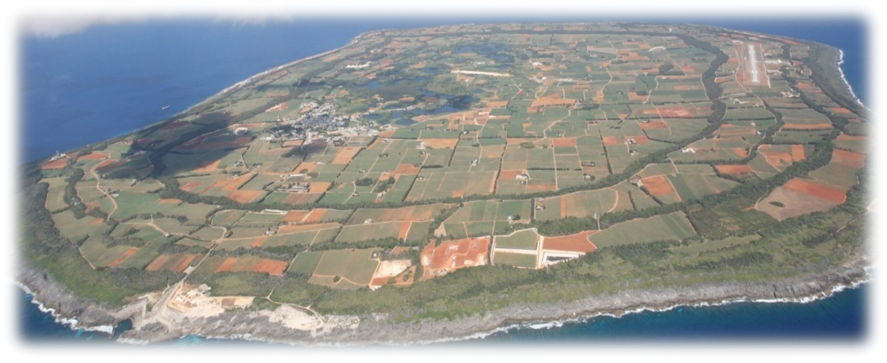

## Introduction: A "Pocket of Fresh Water" on a Remote Island

About 360 km east of Okinawa's main island, a small island sits alone in the open Pacific: **Minami-Daito Island**. It is a coral reef uplifted on the Philippine Sea Plate—an **uplifted atoll**—and the entire island is made of limestone (@fig-island-aerial).

{#fig-island-aerial}

For the people living here, water has long been a concern. The island has no major rivers, and neither basement rock nor an impermeable layer is found. Rain quickly soaks into the limestone. And yet, beneath the island lies enough **fresh water** to support agriculture. How can that be?

The answer is the subject of this article: the **freshwater lens**. Within an island built of saltwater-saturated rock, a body of fresh water floats in a lens shape—a "pocket of fresh water," so to speak (@fig-lens-concept).

In this article, starting from long-term monitoring of groundwater level and electrical conductivity that we conducted on Minami-Daito Island (Yang et al., 2015; Yang et al., 2020), we apply the **Fast Fourier Transform (FFT)** previewed in #6 to real island groundwater. How do ocean tides reach deep into the island and make the freshwater lens "breathe"? Let us read it out of the data.

------------------------------------------------------------------------

## Why a Freshwater Lens Forms — The Ghyben-Herzberg Relation

Why does fresh water float within a saltwater island in the first place? The key is the **density difference**.

Fresh water (≈ 1.000 g/cm³) is slightly lighter than salt water (≈ 1.025 g/cm³). So when rainfall recharges and accumulates underground, it pushes the heavier salt water aside and **floats on top of it**—the same principle as oil floating on water in a glass.

{#fig-lens-concept}

The classic **Ghyben-Herzberg relation** quantifies this "buoyancy." From hydrostatic balance, the following relation is derived:

$$z = \frac{\rho_f}{\rho_s - \rho_f}\, h \approx 40\, h$$

- $z$: depth from sea level to the fresh–saline interface [L]
- $h$: height from sea level to the water table [L]
- $\rho_f$: density of fresh water (≈ 1.000 g/cm³)
- $\rho_s$: density of salt water (≈ 1.025 g/cm³)

In other words, raising the water table by just **1 m** deepens the fresh–saline interface by **about 40 m**. The thickness of a freshwater lens is therefore extremely sensitive to small changes in the water-table height at the surface. This is precisely why sea-level rise and changes in rainfall can have serious consequences for island water resources.

In reality, however, fresh and salt water do not form a knife-sharp boundary. A **transition zone**, where the two mix, develops instead. The thickness of this mixing zone depends on aquifer permeability: **the higher the permeability, the easier seawater intrudes, and the thicker the transition zone becomes**. In a fractured limestone aquifer like that of Minami-Daito, this point becomes especially important.

------------------------------------------------------------------------

## What Is the Tide? — The Sea "Shakes" the Freshwater Lens

The freshwater lens does not float in stillness. On an island surrounded by sea, **ocean tides** constantly shake the groundwater.

The tide originates from the **tide-generating force** exerted by the Moon and Sun on the Earth. Their gravitational pull differs subtly from point to point on the Earth, and this difference draws the seawater, producing high and low tides. Crucially, a tide is not a single period but a **superposition of multiple "tidal constituents"** (@fig-tidal-v2).

{#fig-tidal-v2}

Five **major tidal constituents** are particularly important in the groundwater analysis of Minami-Daito Island.

```{=html}
<div style="overflow-x:auto; margin:1.5em 0;">
<table style="width:100%; border-collapse:collapse; font-size:0.9em;">
  <thead>
    <tr style="background:#1E3A5F; color:white;">
      <th style="padding:10px 14px; text-align:left;">Constituent</th>
      <th style="padding:10px 14px; text-align:left;">Name</th>
      <th style="padding:10px 14px; text-align:center;">Period</th>
      <th style="padding:10px 14px; text-align:center;">Class</th>
    </tr>
  </thead>
  <tbody>
    <tr style="background:#EFF6FF;">
      <td style="padding:9px 14px; font-weight:600; color:#1D4ED8;">M<sub>2</sub></td>
      <td style="padding:9px 14px; font-size:0.88em;">Principal lunar semidiurnal</td>
      <td style="padding:9px 14px; text-align:center; font-family:monospace;">12.42 h</td>
      <td style="padding:9px 14px; text-align:center;">Semidiurnal</td>
    </tr>
    <tr style="background:#FDFDFD;">
      <td style="padding:9px 14px; font-weight:600; color:#1D4ED8;">S<sub>2</sub></td>
      <td style="padding:9px 14px; font-size:0.88em;">Principal solar semidiurnal</td>
      <td style="padding:9px 14px; text-align:center; font-family:monospace;">12.00 h</td>
      <td style="padding:9px 14px; text-align:center;">Semidiurnal</td>
    </tr>
    <tr style="background:#EFF6FF;">
      <td style="padding:9px 14px; font-weight:600; color:#1D4ED8;">N<sub>2</sub></td>
      <td style="padding:9px 14px; font-size:0.88em;">Larger lunar elliptic semidiurnal</td>
      <td style="padding:9px 14px; text-align:center; font-family:monospace;">12.66 h</td>
      <td style="padding:9px 14px; text-align:center;">Semidiurnal</td>
    </tr>
    <tr style="background:#FDFDFD;">
      <td style="padding:9px 14px; font-weight:600; color:#7C3AED;">K<sub>1</sub></td>
      <td style="padding:9px 14px; font-size:0.88em;">Luni-solar diurnal</td>
      <td style="padding:9px 14px; text-align:center; font-family:monospace;">23.93 h</td>
      <td style="padding:9px 14px; text-align:center;">Diurnal</td>
    </tr>
    <tr style="background:#EFF6FF;">
      <td style="padding:9px 14px; font-weight:600; color:#7C3AED;">O<sub>1</sub></td>
      <td style="padding:9px 14px; font-size:0.88em;">Principal lunar diurnal</td>
      <td style="padding:9px 14px; text-align:center; font-family:monospace;">25.82 h</td>
      <td style="padding:9px 14px; text-align:center;">Diurnal</td>
    </tr>
  </tbody>
</table>
</div>
```

These five constituents are geophysically important, accounting for about 95% of the tidal potential (Bredehoeft, 1967). At the coast they overlap to create a complex tidal signal, whose pressure wave **propagates into the interior of the island through the ground**. The problem is that, with the naked eye, one cannot tell which constituent contributes how much.

This is where the FFT comes in.

------------------------------------------------------------------------

## Measuring the Island's Subsurface with 15 Wells

To understand the groundwater of Minami-Daito Island, we acquired data from **15 observation wells**, mainly in the central lowland (Yang et al., 2015). @fig-well-map shows the well layout and the island topography. A ring-shaped plateau (elevation 40–50 m) rims the coast, and the wells (red dots) are distributed in the lowland inside it. The tide was measured at a tidal gauge station (TGS, blue dot) installed at the northern end of the island.

{#fig-well-map}

We measured mainly two quantities.

```{=html}
<div style="background:#F0F4FF; border:1px solid #93C5FD; border-radius:10px; padding:1.3em 1.5em; margin:1.5em 0;">
  <div style="font-weight:700; color:#1E3A8A; margin-bottom:0.6em;">The two monitored quantities</div>
  <ol style="color:#1E40AF; font-size:0.92em; line-height:2.0; margin:0; padding-left:1.4em;">
    <li><strong>Groundwater level</strong> — water-level loggers (Onset HOBO-U20, accuracy ±0.3 cm) were installed in all 15 wells, recording continuously at 1-hour intervals. A separate barometric logger was used for atmospheric-pressure correction.</li>
    <li><strong>Electrical conductivity (EC)</strong> — vertical profiles were measured at 1-m intervals from the water table to the well bottom. EC is a proxy for salinity and is the key to <strong>capturing the fresh–saline interface</strong>.</li>
  </ol>
</div>
```

For electrical conductivity, considering its use as irrigation water, fresh water in this region was defined as **below 2000 µS/cm** (Ishida et al., 2011). EC rises with depth, and its vertical distribution distinguishes the "freshwater zone, mixing zone, and seawater zone." The thickness of the freshwater lens is estimated precisely from these EC measurements.

Groundwater level was monitored from September 2012 to December 2014 at a 1-hour sampling interval. Tide and precipitation data were obtained from the Japan Meteorological Agency. In this article, we analyze **one year of data from 2014 (8,760 points)** of tide and groundwater level.

------------------------------------------------------------------------

## Decomposing the Groundwater Level with FFT — The Tide Is Engraved

Here is the highlight of this article. We apply the **Fast Fourier Transform (FFT)** to the groundwater-level time series and extract the hidden periodic components.

::: callout-note
## We use synthetic (dummy) data for learning

So that anyone can reproduce and learn the analysis at hand, we use **synthetic data generated with `numpy`** here. If you have actual field data (CSV), you can simply swap in `pd.read_csv()` as shown later, and the same analysis runs unchanged.
:::

The idea is simple. We build the **sea tide** as a "superposition of five constituents + noise," and build the **groundwater level** as that tide transmitted with "reduced amplitude and a phase lag." Then we transform both into the frequency domain with FFT.

``` python
# [Synthetic data] Synthesize tide and groundwater level, then extract the major constituents with FFT
import numpy as np
import pandas as pd
import matplotlib.pyplot as plt
import matplotlib.dates as mdates

plt.rcParams.update({
    "font.family": "sans-serif",
    "font.sans-serif": ["Arial", "DejaVu Sans"],
    "axes.unicode_minus": False,
    "figure.dpi": 150,
})

# ---- Five major tidal constituents (period in h) and amplitudes ----
constituents = {"O1": 25.82, "K1": 23.93, "N2": 12.66, "M2": 12.42, "S2": 12.00}
amp = {"O1": 18, "K1": 22, "N2": 9, "M2": 42, "S2": 16}

# ---- Generate synthetic data (replace this block with pd.read_csv() for field data) ----
np.random.seed(7)
n = 8760                       # 1 hour x 8760 = 365 days (one year)
t_idx = np.arange(n)
date = pd.date_range("2014-01-01", periods=n, freq="h")

# Tide: superposition of five constituents
tide = np.zeros(n)
for name, period in constituents.items():
    phase = np.random.uniform(0, 2 * np.pi)
    tide += amp[name] * np.sin(2 * np.pi * t_idx / period + phase)
tide += 2.0 * np.random.randn(n)

# Groundwater level: response attenuated (ratio 0.32) and phase-lagged (3 h)
gwl = 0.32 * np.roll(tide, 3) + 1.0 * np.random.randn(n)

# ---- FFT ----
freq = np.fft.rfftfreq(n, d=1.0)              # cycle / hour
amp_tide = np.abs(np.fft.rfft(tide - tide.mean())) / n * 2
amp_gwl  = np.abs(np.fft.rfft(gwl  - gwl.mean()))  / n * 2

# ---- Plot (premium palette) ----
NAVY, CYAN = "#1A365D", "#00B4D8"
fig, axes = plt.subplots(2, 1, figsize=(13, 8.5),
                         gridspec_kw={"height_ratios": [1, 1.15]})

# Top: time series (first 14 days)
win = 24 * 14
ax0 = axes[0]
ax0.plot(date[:win], tide[:win], color=NAVY, lw=1.6, label="Sea tide")
ax0.plot(date[:win], gwl[:win],  color=CYAN, lw=2.0, label="Groundwater level")
ax0.set_ylabel("Fluctuation (cm)", fontsize=15)
ax0.legend(loc="upper right", fontsize=13)
ax0.set_title("(1) Time series of sea tide and groundwater level (first 14 days)",
              fontsize=16, fontweight="bold", color=NAVY, loc="left")
ax0.grid(True, ls="--", lw=0.5, color="#E5E7EB")
ax0.tick_params(labelsize=12.5)
ax0.xaxis.set_major_formatter(mdates.DateFormatter("%m/%d"))
for s in ["top", "right"]: ax0.spines[s].set_visible(False)

# Bottom: amplitude spectrum
ax1 = axes[1]
ymax = max(amp_tide[1:].max(), amp_gwl[1:].max()) * 1.18
ax1.axvspan(1/26.5, 1/23.0, color="#7C3AED", alpha=0.07)   # diurnal band
ax1.axvspan(1/13.0, 1/11.6, color="#EA580C", alpha=0.07)   # semidiurnal band
ax1.plot(freq, amp_tide, color="#94A3B8", lw=1.2, label="Sea tide")
ax1.fill_between(freq, amp_gwl, color=CYAN, alpha=0.18)
ax1.plot(freq, amp_gwl, color=NAVY, lw=1.7, label="Groundwater level")
ax1.set_xlim(0, 0.11); ax1.set_ylim(0, ymax)
ax1.set_xlabel("Frequency (cycle / hour)", fontsize=15)
ax1.set_ylabel("Amplitude spectrum", fontsize=15)
ax1.set_title("(2) Amplitude spectrum by FFT: five major tidal constituents",
              fontsize=16, fontweight="bold", color=NAVY, loc="left")
ax1.grid(True, ls="--", lw=0.5, color="#E5E7EB")
ax1.tick_params(labelsize=12.5)
for s in ["top", "right"]: ax1.spines[s].set_visible(False)

# Label each constituent peak
for name, period in constituents.items():
    f = 1.0 / period
    peak = amp_gwl[np.argmin(np.abs(freq - f))]
    ax1.annotate(f"$\\mathrm{{{name[0]}}}_{name[1]}$",
                 xy=(f, peak), xytext=(f, peak + ymax * 0.10),
                 ha="center", fontsize=15, fontweight="bold", color="#B91C1C",
                 bbox=dict(boxstyle="round,pad=0.2", fc="white", ec="#FCA5A5"),
                 arrowprops=dict(arrowstyle="-", color="#FCA5A5"))
ax1.text(1/24.7, ymax*0.93, "Diurnal  O₁ · K₁", ha="center",
         fontsize=14, color="#7C3AED", fontweight="bold")
ax1.text(1/12.3, ymax*0.93, "Semidiurnal  N₂ · M₂ · S₂", ha="center",
         fontsize=14, color="#EA580C", fontweight="bold")
ax1.legend(loc="upper right", fontsize=13)

plt.tight_layout()
plt.savefig("daito_tidal_fft.png", bbox_inches="tight")
plt.show()
```

Running this code yields @fig-tidal-fft.

{#fig-tidal-fft}

In the top panel (Time series), the groundwater level (cyan) follows the tide (navy) with suppressed amplitude. But the naked eye cannot tell which constituent contributes how much. That is the job of the FFT in the bottom panel (Amplitude spectrum). Waves that looked tangled are reorganized into a **set of sharp peaks** in the frequency domain, and the five constituents separate at a glance.

What we showed here is synthetic data for learning, but applying exactly the same FFT to the **actual tide and groundwater-level data** of Minami-Daito Island gives @fig-fft-spectrum.

{#fig-fft-spectrum width=70%}

In the lowest spectrum (Tide), exactly as in the synthetic data, distinct peaks stand near 0.04 cph and 0.08 cph. And at the **same frequencies**, the groundwater-level spectra of the two wells (92-2 and Site3) also show peaks. The periods contained in the ocean tide are engraved, virtually unchanged, onto the groundwater level. Indeed, the amplitude spectra show pronounced peaks at **0.0387, 0.0419, 0.0789, 0.0806, and 0.0833 cph**, corresponding respectively to the **O₁, K₁, N₂, M₂, and S₂** constituents (Yang et al., 2015).

::: callout-important
## What this means

Even in a well located near the center of the island, the groundwater level oscillates cleanly at the frequencies of the five constituents. This is firm evidence that the **aquifer is hydraulically connected to the sea, and the tidal pressure wave reaches deep into the island**. The limestone island is "breathing" together with the sea.
:::

The actual Minami-Daito field data used for the analysis (tide and groundwater level of two wells, one year of 2014 at 1-hour intervals) can be downloaded below.

- **Field data:** [daito.csv](daito.csv)

To analyze the field data, simply replace the synthetic-data generation block with the following. Read the data using the column names in the CSV (`Tide`, `92-2`, `Site3`).

``` python
# ---- Load field data ----
df = pd.read_csv("daito.csv", parse_dates=["DATE"], index_col="DATE").dropna()
tide      = df["Tide"].values     # tide
gwl_922   = df["92-2"].values     # observation well 92-2
gwl_site3 = df["Site3"].values    # observation well Site3
```

Then apply `np.fft.rfft` to `tide` and to each well's groundwater level just as in the main text, and you obtain the same amplitude spectra as @fig-fft-spectrum.

------------------------------------------------------------------------

## From Where Does the Tide Travel Faster? — The Time-Lag Map

The FFT does not only tell us "what periods exist." By computing the **amplitude ratio** and **phase lag** between the tide and the groundwater level, we can probe the very properties of the aquifer.

- **Amplitude ratio** — how much smaller the groundwater level responds relative to the sea tide. On Minami-Daito it was 0.30–0.44 for the diurnal constituents and 0.15–0.31 for the semidiurnal ones. The longer-period (diurnal) components travel farther.
- **Phase lag (time lag)** — how much the groundwater level lags behind the tide. Mapping this across the wells reveals **from which direction the tidal pressure wave travels fastest** into the island.

@fig-lag-map shows the time lags mapped across the wells. For both the M₂ and O₁ constituents, the tide propagated **fastest on the southern side of the island** (orange arrow from the south). This agrees well with the geological observation of Takenaga (1965) that "there are large fractures on the southern side of the island, where seawater intrusion is pronounced." Because fractures transmit water quickly, the tidal pressure wave also propagates first through them.

{#fig-lag-map width=70%}

Furthermore, the phase lag lets us estimate the **hydraulic diffusivity**. Using the coastal tidal fluctuation as a boundary condition, we apply the analytical solution for a pressure wave propagating through an unconfined aquifer (the Jacob-Ferris equation; Merritt, 2004).

$$h(x,t) = h_0\, \exp\!\left(-x\sqrt{\frac{\omega S}{2T}}\right)
        \sin\!\left(\omega t - x\sqrt{\frac{\omega S}{2T}}\right)$$

- $h_0$: tidal amplitude at the coast [L]
- $x$: distance from the coast [L]
- $\omega$: angular velocity [T⁻¹]
- $T$: transmissivity [L²T⁻¹]
- $S$: storativity [−]

From both the amplitude attenuation and the phase lag, the hydraulic diffusivity $T/S$ is obtained, ranging on average from **3.5 to 91.6 m²/s** on Minami-Daito. Assuming a storativity and an aquifer thickness, the hydraulic conductivity is estimated at **about 10⁻² to 10⁻¹ cm/s**, broadly consistent with past pumping-test results (Okinawa General Bureau, 1978).

::: callout-tip
## Estimating permeability without a pumping test

Permeability is usually obtained from a pumping test. But on a tide-affected island, we can **use the natural tide like a free pumping test**. Since the sea shakes the water level for free every day, we can estimate aquifer properties simply by reading the response—a remarkably powerful approach in island hydrogeology.
:::

------------------------------------------------------------------------

## "Subtracting" the Tide to See the Effect of Rainfall

So far the tidal effect has come into clear view. But what we really want to know for island water resources is **"how does the freshwater lens grow when it rains?"**

That, however, is difficult. The tidal component in the groundwater level is so large that the rise caused by rainfall is buried in its shadow. The semidiurnal and diurnal components can be removed with a moving average or a low-pass filter, but the tide also contains **long-period components**, which periodically overlap with the rainfall-derived variations.

Yang et al. (2020) therefore used **Multiple Regression Analysis (MRA)**. The idea is as follows.

```{=html}
<div style="background:#FFF7ED; border-left:4px solid #D97706; padding:1.2em 1.5em; margin:1.5em 0; border-radius:0 8px 8px 0;">
  <div style="font-weight:700; color:#92400E; margin-bottom:0.6em;">Procedure for extracting the rainfall effect with MRA</div>
  <ol style="color:#78350F; font-size:0.9em; line-height:1.9; margin:0; padding-left:1.3em;">
    <li>Express the groundwater level with a regression model using <strong>the tide over the past 0–24 hours</strong> as explanatory variables.</li>
    <li>Select the optimal time lag (9–11 hours) using the Akaike Information Criterion (AIC).</li>
    <li><strong>Subtract</strong> the tidal component reproduced by the regression model from the observed groundwater level.</li>
    <li>The remaining component (residual) can be regarded as the <strong>rainfall-derived water-level variation</strong>.</li>
  </ol>
</div>
```

The regression equation estimates the groundwater level as a linear sum of time-lagged tidal components.

$$\hat{y}_t = b + \sum_{m=0}^{M} a_m\, x_{t-m} + \varepsilon_t$$

- $\hat{y}_t$: estimated groundwater level (tidal component)
- $x_{t-m}$: tide $m$ hours earlier
- $a_m$: partial regression coefficients, $b$: intercept, $\varepsilon_t$: white noise

By this "tide-subtraction" procedure, the previously buried rainfall effect emerges. Immediately after the heavy-rain events of May 2015 (258 mm total) and July 2015 (202 mm), the rainfall-derived groundwater level jumped by **0.1–0.3 m**, while the electrical conductivity decreased for several days. In other words, **the rain temporarily thickened the freshwater lens**.

------------------------------------------------------------------------

## The Shape of the Freshwater Lens and Its Seasonal Change

The lens thickness estimated from the vertical EC profiles varied greatly from place to place across the island.

```{=html}
<div style="overflow-x:auto; margin:1.5em 0;">
<table style="width:100%; border-collapse:collapse; font-size:0.9em;">
  <thead>
    <tr style="background:#0B3D91; color:white;">
      <th style="padding:10px 14px; text-align:left;">Location</th>
      <th style="padding:10px 14px; text-align:center;">Lens thickness</th>
      <th style="padding:10px 14px; text-align:left;">Characteristics</th>
    </tr>
  </thead>
  <tbody>
    <tr style="background:#EFF6FF;">
      <td style="padding:9px 14px; font-weight:600; color:#0B3D91;">Central lowland</td>
      <td style="padding:9px 14px; text-align:center; font-family:monospace;">10–13 m</td>
      <td style="padding:9px 14px; font-size:0.88em;">Thickest. Innermost part of the island.</td>
    </tr>
    <tr style="background:#FDFDFD;">
      <td style="padding:9px 14px; font-weight:600; color:#0B3D91;">Western side</td>
      <td style="padding:9px 14px; text-align:center; font-family:monospace;">5–8 m</td>
      <td style="padding:9px 14px; font-size:0.88em;">Many ponds and wetlands; large seasonal variation.</td>
    </tr>
    <tr style="background:#EFF6FF;">
      <td style="padding:9px 14px; font-weight:600; color:#0B3D91;">Northeastern side</td>
      <td style="padding:9px 14px; text-align:center; font-family:monospace;">3–6 m</td>
      <td style="padding:9px 14px; font-size:0.88em;">Many dolines, yet relatively stable through rainfall recharge.</td>
    </tr>
  </tbody>
</table>
</div>
```

What is intriguing is that **only the western lens showed seasonal variation**. The western side hosts many ponds and wetlands, so the freshwater lens is easily affected by infiltration of pond water. Combined with the winter pumping for sugar-refining water, the lens was observed to shrink temporarily. The northeastern side, by contrast, is recharged firmly by rainfall through dolines (depressions formed by limestone dissolution), so its lens stayed relatively stable.

Even within the same island, **differences in topography, geology, and permeability** govern the thickness and stability of the freshwater lens. This means that island water-resource management cannot treat "the whole island uniformly."

------------------------------------------------------------------------

## Why It Matters — Island Water Resources and Climate Change

The freshwater lens is a precious—and often the only—fresh water resource for small islands worldwide. Yet its existence rests on a delicate balance.

```{=html}
<div style="background:#FDFDFD; border:1px solid #E5E7EB; border-radius:12px; padding:1.5em; margin:1.5em 0;">
<svg viewBox="0 0 680 200" xmlns="http://www.w3.org/2000/svg" style="width:100%;display:block;" role="img">
  <title>Factors threatening the freshwater lens</title>
  <rect x="0" y="0" width="680" height="200" rx="12" fill="#FAFAFA"/>

  <rect x="20" y="20" width="190" height="160" rx="10" fill="#FEF2F2" stroke="#EF4444" stroke-width="1.5"/>
  <text x="115" y="48" text-anchor="middle" font-family="'Segoe UI',sans-serif" font-size="13" font-weight="700" fill="#B91C1C">Sea-level rise</text>
  <text x="115" y="74" text-anchor="middle" font-family="'Segoe UI',sans-serif" font-size="11" fill="#991B1B">Salt water pushes</text>
  <text x="115" y="92" text-anchor="middle" font-family="'Segoe UI',sans-serif" font-size="11" fill="#991B1B">up from below</text>
  <text x="115" y="120" text-anchor="middle" font-family="'Segoe UI',sans-serif" font-size="10" fill="#EF4444" font-style="italic">The lens thins</text>

  <rect x="240" y="20" width="200" height="160" rx="10" fill="#FFF7ED" stroke="#D97706" stroke-width="1.5"/>
  <text x="340" y="48" text-anchor="middle" font-family="'Segoe UI',sans-serif" font-size="13" font-weight="700" fill="#92400E">Changing rainfall</text>
  <text x="340" y="74" text-anchor="middle" font-family="'Segoe UI',sans-serif" font-size="11" fill="#78350F">Reduced recharge,</text>
  <text x="340" y="92" text-anchor="middle" font-family="'Segoe UI',sans-serif" font-size="11" fill="#78350F">greater variability</text>
  <text x="340" y="120" text-anchor="middle" font-family="'Segoe UI',sans-serif" font-size="10" fill="#D97706" font-style="italic">The lens destabilizes</text>

  <rect x="470" y="20" width="190" height="160" rx="10" fill="#F0FDF4" stroke="#16A34A" stroke-width="2"/>
  <text x="565" y="48" text-anchor="middle" font-family="'Segoe UI',sans-serif" font-size="13" font-weight="700" fill="#15803D">Continuous monitoring</text>
  <text x="565" y="74" text-anchor="middle" font-family="'Segoe UI',sans-serif" font-size="11" fill="#166534">Long-term records of</text>
  <text x="565" y="92" text-anchor="middle" font-family="'Segoe UI',sans-serif" font-size="11" fill="#166534">water level and EC</text>
  <text x="565" y="120" text-anchor="middle" font-family="'Segoe UI',sans-serif" font-size="10" fill="#16A34A" font-style="italic">Basis of sustainable use</text>
</svg>
</div>
```

Since the IPCC Fourth Assessment Report (2007), shrinkage of freshwater lenses due to warming-driven sea-level rise and changing rainfall patterns has been a concern. As the Ghyben-Herzberg relation shows, a small drop in water level removes a large fraction of the lens thickness. That is exactly why **continuing to measure groundwater level and electrical conductivity** is the starting point for sustainable water use.

The monitoring scheme established on Minami-Daito Island can be applied to other uplifted atolls around the world. By "listening" to the daily rhythm of the tide, we can evaluate the invisible fresh water beneath the ground.

------------------------------------------------------------------------

## Summary

```{=html}
<div style="background:#F9FAFB; border:1px solid #E5E7EB; border-radius:10px; padding:1.3em 1.5em; margin:1.5em 0;">
  <ul style="color:#374151; font-size:0.93em; line-height:2.0; margin:0; padding-left:1.4em;">
    <li>Beneath Minami-Daito Island lies a <strong>freshwater lens</strong> that floats on salt water through the density difference (Ghyben-Herzberg relation).</li>
    <li>The pressure wave of ocean tides reaches deep into the island, periodically shaking the groundwater level.</li>
    <li>Decomposing the groundwater level with <strong>FFT</strong> clearly reveals peaks of the five major constituents O₁, K₁, N₂, M₂, and S₂.</li>
    <li>The tidal-propagation time-lag map shows that the tide travels faster on the southern side (i.e., higher permeability via fractures). The phase lag also yields the hydraulic diffusivity.</li>
    <li>Subtracting the tidal component with <strong>Multiple Regression Analysis (MRA)</strong> brings out the previously buried rainfall-derived water-level variation.</li>
    <li>The lens thickness varies by location (central 10–13 m, western 5–8 m, northeastern 3–6 m) and is vulnerable to sea-level rise and rainfall change.</li>
  </ul>
</div>
```

::: callout-tip
## Next post — #8

We dig deeper into the relationship between tides and groundwater level. How much does a change in barometric pressure or tide propagate to the groundwater level "with what delay"? Using **cross-correlation analysis**, we explain how to quantify the permeability of the strata.
:::

------------------------------------------------------------------------

## References

- Yang, H., Shimada, J., Matsuda, H., Kagabu, M., Dong, L. (2015) Evaluation of a freshwater lens configuration using a time series analysis of groundwater level and electrical conductivity in Minami-Daito Island, Okinawa Prefecture, Japan (in Japanese with English abstract). *Journal of Groundwater Hydrology*, 57(2), 187–205. <https://doi.org/10.5917/jagh.57.187>
- Yang, H., Shimada, J., Shibata, T., Okumura, A., Pinti, D.L. (2020) Freshwater lens oscillation induced by sea tides and variable rainfall at the uplifted atoll island of Minami-Daito, Japan. *Hydrogeology Journal*, 28, 1567–1581. <https://doi.org/10.1007/s10040-020-02185-z>
- Bredehoeft, J.D. (1967) Response of well-aquifer systems to earth tides. *Journal of Geophysical Research*, 72(12), 3075–3087.
- Merritt, M.L. (2004) Estimating hydraulic properties of the Floridan Aquifer System by analysis of earth-tide, ocean-tide, and barometric effects, Collier and Hendry Counties, Florida. U.S. Geological Survey Water-Resources Investigations Report 03-4267.
- Ishida, S., Tsuchihara, T., Yoshimoto, S., Minakawa, H., Masumoto, T., Imaizumi, M. (2011) Estimation of the freshwater lens storage on Tarama Island, Okinawa Prefecture (in Japanese). *Transactions of JSIDRE*, 273, 7–18.
- Takenaga, K. (1965) Lakes and groundwater on Minami-Daito Island, Okinawa (in Japanese). *Geographical Sciences (Chiri-Kagaku)*, 4, 12–15.
