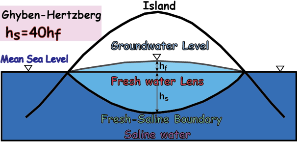
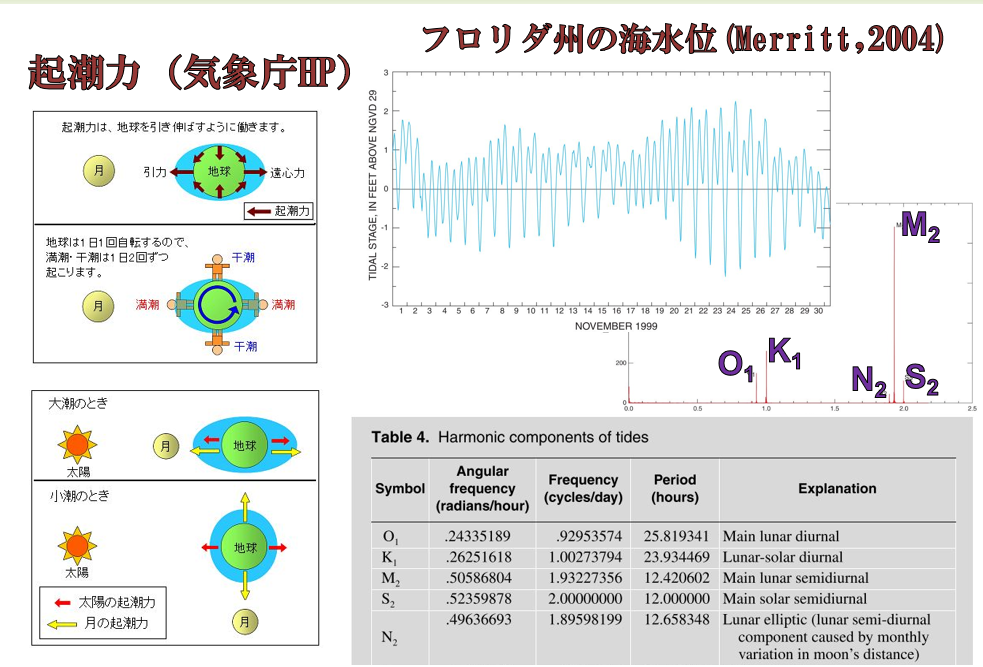
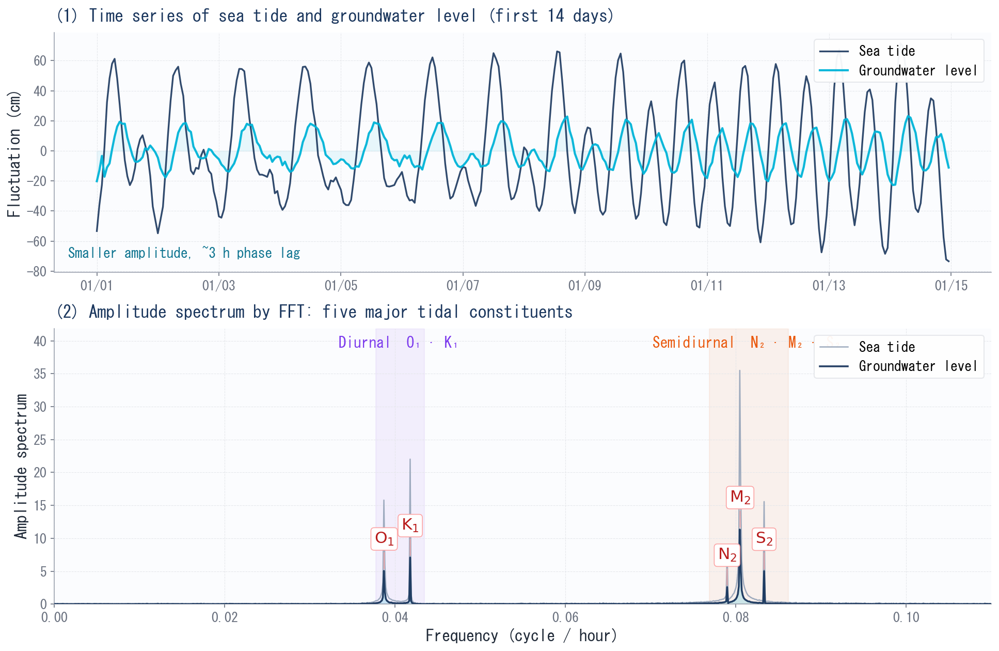
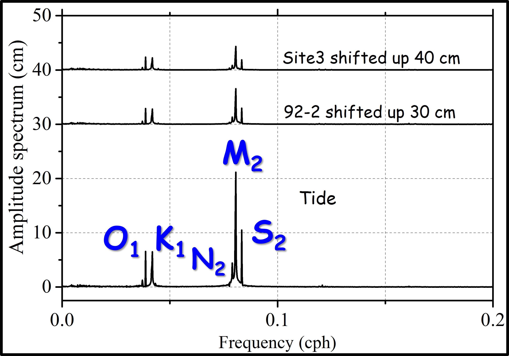
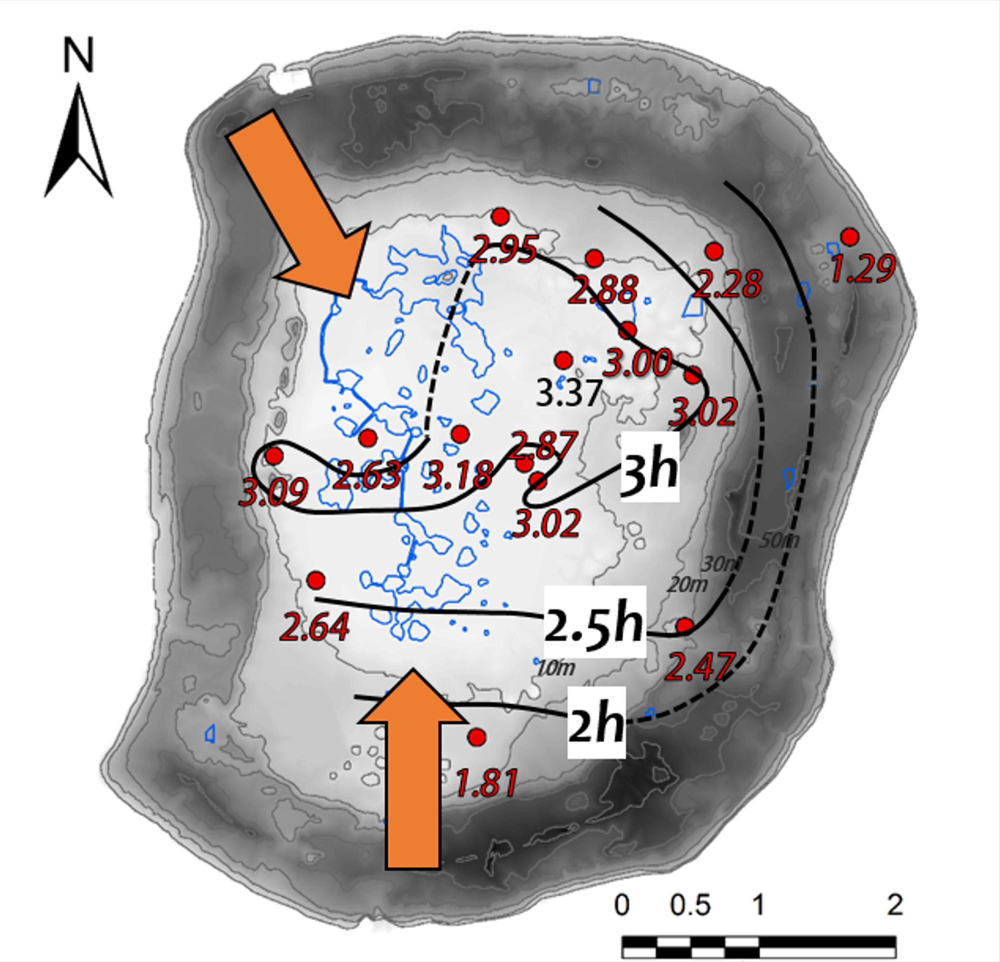

## はじめに：絶海の孤島に「真水の浮き袋」がある

沖縄本島から東へ約360 km。太平洋のただ中に、ぽつんと浮かぶ島がある。**南大東島**である。フィリピン海プレートの上に隆起したサンゴ礁——いわゆる**隆起環礁（uplifted atoll）**で、島全体が石灰岩でできている（@fig-island-aerial）。

{#fig-island-aerial}

ここで暮らす人々にとって、長らく悩みの種は「水」であった。島には大きな川がなく、基盤岩も不透水層も見当たらない。雨はサッと石灰岩に染み込んでしまう。それでも島の地下には、農業を支えるだけの**真水**が確かに存在する。いったいなぜだろうか。

その答えが、本記事の主役である**淡水レンズ（freshwater lens）**である。塩水でできた島の地下に、レンズ状に浮かぶ真水のかたまり——いわば「真水の浮き袋」である（@fig-lens-concept）。

この記事では、筆者らが南大東島で行った地下水位・電気伝導度の長期観測データ（梁ほか, 2015; Yang et al., 2020）を出発点に、前回 #6 で予告した**FFT（高速フーリエ変換）**を実際の島の地下水に適用していく。海の潮汐がどのように島の奥深くまで届き、淡水レンズを「呼吸」させているのか。データから読み解いていこう。

------------------------------------------------------------------------

## 淡水レンズはなぜできるのか — Ghyben-Herzberg関係

そもそも、なぜ塩水の島に真水が浮くのか。鍵は**密度差**である。

淡水（約1.000 g/cm³）は塩水（約1.025 g/cm³）よりもわずかに軽い。だから、雨水が涵養して地下にたまると、重い塩水を押しのけて**その上に浮く**。コップの水に油が浮くのと同じ原理である。

{#fig-lens-concept}

この「浮き具合」を定量化したものが、古典的な**Ghyben-Herzberg関係**である。静水圧の釣り合いから、次の関係が導かれる。

$$z = \frac{\rho_f}{\rho_s - \rho_f}\, h \approx 40\, h$$

- $z$：海面から塩淡境界までの深さ \[L\]
- $h$：海面から地下水面までの高さ \[L\]
- $\rho_f$：淡水の密度（≈ 1.000 g/cm³）
- $\rho_s$：塩水の密度（≈ 1.025 g/cm³）

つまり、地下水面がたった **1 m** 高くなるだけで、塩淡境界は **約40 m** も深くなる。淡水レンズの厚みは、地表のわずかな水位変化に対して非常に敏感なのである。だからこそ、海面上昇や降水量の変化が、島の水資源に深刻な影響を与えうる。

ただし現実には、淡水と塩水はナイフで切ったような鋭い境界を作らない。両者が混じり合う**遷移帯（transition zone）**が形成される。この混合の厚みは帯水層の透水性に依存し、**透水性が高いほど海水が侵入しやすく、遷移帯は厚くなる**。南大東島のような亀裂の多い石灰岩帯水層では、この点が重要な意味を持ってくる。

------------------------------------------------------------------------

## 潮汐とは何か — 海が淡水レンズを「揺らす」

淡水レンズは静かに浮かんでいるわけではない。海に囲まれた島では、**潮の満ち引き（海洋潮汐）**が絶えず地下水を揺さぶっている。

潮汐の正体は、月と太陽が地球に及ぼす**起潮力**である。月や太陽の引力は地球の各点で微妙に異なり、その差が海水を引き寄せ、満潮と干潮を生む。重要なのは、潮汐が単一の周期ではなく、**複数の「分潮（tidal constituents）」の重ね合わせ**でできているという点である（@fig-tidal-v2）。

{#fig-tidal-v2}

南大東島の地下水解析で特に重要になるのが、次の**主要5分潮**である。

```{=html}
<div style="overflow-x:auto; margin:1.5em 0;">
<table style="width:100%; border-collapse:collapse; font-size:0.9em;">
  <thead>
    <tr style="background:#1E3A5F; color:white;">
      <th style="padding:10px 14px; text-align:left;">分潮</th>
      <th style="padding:10px 14px; text-align:left;">名称</th>
      <th style="padding:10px 14px; text-align:center;">周期</th>
      <th style="padding:10px 14px; text-align:center;">区分</th>
    </tr>
  </thead>
  <tbody>
    <tr style="background:#EFF6FF;">
      <td style="padding:9px 14px; font-weight:600; color:#1D4ED8;">M<sub>2</sub></td>
      <td style="padding:9px 14px; font-size:0.88em;">主太陰半日周潮</td>
      <td style="padding:9px 14px; text-align:center; font-family:monospace;">12.42 h</td>
      <td style="padding:9px 14px; text-align:center;">半日周</td>
    </tr>
    <tr style="background:#FDFDFD;">
      <td style="padding:9px 14px; font-weight:600; color:#1D4ED8;">S<sub>2</sub></td>
      <td style="padding:9px 14px; font-size:0.88em;">主太陽半日周潮</td>
      <td style="padding:9px 14px; text-align:center; font-family:monospace;">12.00 h</td>
      <td style="padding:9px 14px; text-align:center;">半日周</td>
    </tr>
    <tr style="background:#EFF6FF;">
      <td style="padding:9px 14px; font-weight:600; color:#1D4ED8;">N<sub>2</sub></td>
      <td style="padding:9px 14px; font-size:0.88em;">楕円太陰半日周潮</td>
      <td style="padding:9px 14px; text-align:center; font-family:monospace;">12.66 h</td>
      <td style="padding:9px 14px; text-align:center;">半日周</td>
    </tr>
    <tr style="background:#FDFDFD;">
      <td style="padding:9px 14px; font-weight:600; color:#7C3AED;">K<sub>1</sub></td>
      <td style="padding:9px 14px; font-size:0.88em;">太陰太陽日周潮</td>
      <td style="padding:9px 14px; text-align:center; font-family:monospace;">23.93 h</td>
      <td style="padding:9px 14px; text-align:center;">日周</td>
    </tr>
    <tr style="background:#EFF6FF;">
      <td style="padding:9px 14px; font-weight:600; color:#7C3AED;">O<sub>1</sub></td>
      <td style="padding:9px 14px; font-size:0.88em;">主太陰日周潮</td>
      <td style="padding:9px 14px; text-align:center; font-family:monospace;">25.82 h</td>
      <td style="padding:9px 14px; text-align:center;">日周</td>
    </tr>
  </tbody>
</table>
</div>
```

この5つの分潮は地球物理学的に重要で、潮位ポテンシャルの約95%を占める（Bredehoeft, 1967）。海岸でこれらが重なって複雑な潮位変動を作り、その圧力波が**地盤を通じて島の内部へ伝播**していく。問題は——肉眼ではどの分潮がどれだけ効いているのか、まったく区別できない点にある。

そこで登場するのが、FFTである。

------------------------------------------------------------------------

## 観測：15本の井戸で島の地下を測る

南大東島の地下水を理解するため、島の中央低地を中心に**15ヶ所の観測井**でデータを取得した（梁ほか, 2015）。観測井の配置と島の地形を @fig-well-map に示す。海岸沿いをリング状の台地（標高40〜50 m）が取り囲み、その内側の低地に観測井（赤点）が分布する。潮位は島の北端に設置した検潮所（TGS、青点）で測定した。

{#fig-well-map}

測ったのは主に2つ。

```{=html}
<div style="background:#F0F4FF; border:1px solid #93C5FD; border-radius:10px; padding:1.3em 1.5em; margin:1.5em 0;">
  <div style="font-weight:700; color:#1E3A8A; margin-bottom:0.6em;">観測した2つの量</div>
  <ol style="color:#1E40AF; font-size:0.92em; line-height:2.0; margin:0; padding-left:1.4em;">
    <li><strong>地下水位</strong>——水位ロガー（Onset社 HOBO-U20、精度 ±0.3 cm）を全15井に設置し、1時間間隔で連続記録。別途、気圧ロガーで気圧補正を実施。</li>
    <li><strong>電気伝導度（EC）</strong>——地下水面から井底まで1 m間隔で鉛直プロファイルを測定。ECは塩分の代理指標であり、<strong>淡水と塩水の境界（塩淡境界）を捉える</strong>ための鍵となる。</li>
  </ol>
</div>
```

電気伝導度については、灌漑用水としての利用を考慮し、本地域では**2000 µS/cm以下を淡水**と定義した（石田ほか, 2011）。ECは深くなるほど上昇し、その鉛直分布から「淡水域・混合域・海水域」を区別できる。淡水レンズの厚みは、まさにこのEC測定から推定される。

観測期間は地下水位が2012年9月〜2014年12月、サンプリングは1時間間隔である。潮位と降水量は気象庁データを参照した。本記事では、このうち**2014年の1年分（8,760点）**の潮位・地下水位データを解析対象とする。

------------------------------------------------------------------------

## FFTで地下水位を「分解」する — 潮汐が刻まれている

ここからが本記事のハイライトである。地下水位の時系列に**FFT（高速フーリエ変換）**をかけ、隠れた周期成分を取り出す。

::: callout-note
## 学習用の仮想データ（ダミーデータ）を使用しています

誰でも手元で再現・学習できるよう、ここでは **`numpy` で合成した仮想データ**を用いる。実際の観測データ（CSV）をお持ちの場合は、後述のように `pd.read_csv()` に差し替えるだけで、同じ解析がそのまま動く。
:::

考え方はシンプルである。**海の潮位**を「5分潮の重ね合わせ＋ノイズ」として作り、**地下水位**をその潮位が「振幅を小さく・位相を遅らせて」伝わったものとして合成する。そして両者をFFTで周波数領域に変換する。

``` python
# 【仮想データ】潮位と地下水位を合成し、FFTで主要分潮を取り出す
import numpy as np
import pandas as pd
import matplotlib.pyplot as plt
import matplotlib.dates as mdates

plt.rcParams.update({
    "font.family": "sans-serif",
    "font.sans-serif": ["MS Gothic", "Noto Sans CJK JP", "DejaVu Sans"],
    "axes.unicode_minus": False,
    "figure.dpi": 150,
})

# ---- 主要5分潮（周期 h）と振幅 ----
constituents = {"O1": 25.82, "K1": 23.93, "N2": 12.66, "M2": 12.42, "S2": 12.00}
amp = {"O1": 18, "K1": 22, "N2": 9, "M2": 42, "S2": 16}

# ---- 仮想データ生成（実データがある場合はここをpd.read_csv()に差し替え）----
np.random.seed(7)
n = 8760                       # 1時間 × 8760 = 365日（1年分）
t_idx = np.arange(n)
date = pd.date_range("2014-01-01", periods=n, freq="h")

# 潮位：5分潮の重ね合わせ
tide = np.zeros(n)
for name, period in constituents.items():
    phase = np.random.uniform(0, 2 * np.pi)
    tide += amp[name] * np.sin(2 * np.pi * t_idx / period + phase)
tide += 2.0 * np.random.randn(n)

# 地下水位：潮位を減衰(振幅比0.32)＆位相遅れ(3h)させた応答
gwl = 0.32 * np.roll(tide, 3) + 1.0 * np.random.randn(n)

# ---- FFT ----
freq = np.fft.rfftfreq(n, d=1.0)              # cycle / hour
amp_tide = np.abs(np.fft.rfft(tide - tide.mean())) / n * 2
amp_gwl  = np.abs(np.fft.rfft(gwl  - gwl.mean()))  / n * 2

# ---- Plot (premium palette) ----
NAVY, CYAN = "#1A365D", "#00B4D8"
fig, axes = plt.subplots(2, 1, figsize=(13, 8.5),
                         gridspec_kw={"height_ratios": [1, 1.15]})

# Top: time series (first 14 days)
win = 24 * 14
ax0 = axes[0]
ax0.plot(date[:win], tide[:win], color=NAVY, lw=1.6, label="Sea tide")
ax0.plot(date[:win], gwl[:win],  color=CYAN, lw=2.0, label="Groundwater level")
ax0.set_ylabel("Fluctuation (cm)", fontsize=15)
ax0.legend(loc="upper right", fontsize=13)
ax0.set_title("(1) Time series of sea tide and groundwater level (first 14 days)",
              fontsize=16, fontweight="bold", color=NAVY, loc="left")
ax0.grid(True, ls="--", lw=0.5, color="#E5E7EB")
ax0.tick_params(labelsize=12.5)
ax0.xaxis.set_major_formatter(mdates.DateFormatter("%m/%d"))
for s in ["top", "right"]: ax0.spines[s].set_visible(False)

# Bottom: amplitude spectrum
ax1 = axes[1]
ymax = max(amp_tide[1:].max(), amp_gwl[1:].max()) * 1.18
ax1.axvspan(1/26.5, 1/23.0, color="#7C3AED", alpha=0.07)   # diurnal band
ax1.axvspan(1/13.0, 1/11.6, color="#EA580C", alpha=0.07)   # semidiurnal band
ax1.plot(freq, amp_tide, color="#94A3B8", lw=1.2, label="Sea tide")
ax1.fill_between(freq, amp_gwl, color=CYAN, alpha=0.18)
ax1.plot(freq, amp_gwl, color=NAVY, lw=1.7, label="Groundwater level")
ax1.set_xlim(0, 0.11); ax1.set_ylim(0, ymax)
ax1.set_xlabel("Frequency (cycle / hour)", fontsize=15)
ax1.set_ylabel("Amplitude spectrum", fontsize=15)
ax1.set_title("(2) Amplitude spectrum by FFT: five major tidal constituents",
              fontsize=16, fontweight="bold", color=NAVY, loc="left")
ax1.grid(True, ls="--", lw=0.5, color="#E5E7EB")
ax1.tick_params(labelsize=12.5)
for s in ["top", "right"]: ax1.spines[s].set_visible(False)

# Label each constituent peak
for name, period in constituents.items():
    f = 1.0 / period
    peak = amp_gwl[np.argmin(np.abs(freq - f))]
    ax1.annotate(f"$\\mathrm{{{name[0]}}}_{name[1]}$",
                 xy=(f, peak), xytext=(f, peak + ymax * 0.10),
                 ha="center", fontsize=15, fontweight="bold", color="#B91C1C",
                 bbox=dict(boxstyle="round,pad=0.2", fc="white", ec="#FCA5A5"),
                 arrowprops=dict(arrowstyle="-", color="#FCA5A5"))
ax1.text(1/24.7, ymax*0.93, "Diurnal  O₁ · K₁", ha="center",
         fontsize=14, color="#7C3AED", fontweight="bold")
ax1.text(1/12.3, ymax*0.93, "Semidiurnal  N₂ · M₂ · S₂", ha="center",
         fontsize=14, color="#EA580C", fontweight="bold")
ax1.legend(loc="upper right", fontsize=13)

plt.tight_layout()
plt.savefig("daito_tidal_fft.png", bbox_inches="tight")
plt.show()
```

このコードを実行すると、@fig-tidal-fft が得られる。

{#fig-tidal-fft}

上段（Time series）では、地下水位（シアン）が潮位（ネイビー）に振幅を抑えつつ追従している様子が見える。だが、肉眼では「どの分潮がどれだけ効いているか」までは読み取れない。そこで下段（Amplitude spectrum）のFFTである。バラバラに見えた波が、周波数領域では**鋭いピークの集まり**に整理され、5つの分潮が一目で分離される。

ここで示したのは学習用の合成データだが、まったく同じFFTを南大東島の**実際の潮位・地下水位データ**に適用した結果が @fig-fft-spectrum である。

{#fig-fft-spectrum width="70%"}

最下段の潮位（Tide）スペクトルを見ると、合成データとまったく同じく、0.04 cph付近と0.08 cph付近に明瞭なピークが立つ。そして、その**同じ周波数**に、2つの観測井（92-2・Site3）の地下水位スペクトルもピークを示している。海の潮汐に含まれる周期が、そっくりそのまま地下水位へ刻まれているのである。実際、振幅スペクトルは **0.0387, 0.0419, 0.0789, 0.0806, 0.0833 cph** で顕著なピークを示し、これがそれぞれ **O₁, K₁, N₂, M₂, S₂** 分潮に対応した（梁ほか, 2015）。

::: callout-important
## これが意味すること

島のほぼ中央に位置する井戸でも、5分潮の周波数で地下水位がきれいに振動している——これは、**帯水層が海と水理的につながっており、潮汐の圧力波が島の奥深くまで届いている**という動かぬ証拠である。石灰岩の島が、海と一緒に「呼吸」しているのである。
:::

本記事で解析に用いた南大東島の実観測データ（潮位・2観測井の地下水位、2014年の1時間間隔・1年分）は、以下からダウンロードできる。

- **実観測データ:** [daito.csv](daito.csv)

実データで解析する場合は、仮想データ生成ブロックを次のように差し替えるだけでよい。CSVの列名（`Tide`・`92-2`・`Site3`）に対応させてデータを読み込む。

``` python
# ---- 実データの読み込み ----
df = pd.read_csv("daito.csv", parse_dates=["DATE"], index_col="DATE").dropna()
tide      = df["Tide"].values     # 潮位
gwl_922   = df["92-2"].values     # 観測井 92-2
gwl_site3 = df["Site3"].values    # 観測井 Site3
```

あとは `tide` と各観測井の地下水位に対して、本文と同じく `np.fft.rfft` を適用すれば、@fig-fft-spectrum と同じ振幅スペクトルが得られる。

------------------------------------------------------------------------

## 潮はどこから速く伝わるか — 時間差マップ

FFTは「どんな周期があるか」を教えてくれるだけではない。潮位と地下水位の**振幅比**と**位相差**を計算すれば、帯水層の性質まで踏み込める。

- **振幅比**——海の潮位に対して、地下水位がどれだけ小さく応答するか。南大東島では日周潮で0.30〜0.44、半日周潮で0.15〜0.31であった。長周期成分（日周潮）の方が遠くまで届く。
- **位相差（時間差）**——潮位に対して地下水位がどれだけ遅れるか。これを各井戸でマッピングすると、潮汐の圧力波が**島のどの方向から速く伝わるか**が見えてくる。

各観測井の時間差をマッピングした結果を @fig-lag-map に示す。M₂分潮・O₁分潮ともに、潮位伝播は**島の南側で最も速かった**（南からのオレンジ矢印）。これは、武永（1965）が報告した「島の南側に大きな亀裂があり、海水の侵入が顕著」という地質学的観察とよく一致する。亀裂は水を速く通すため、潮汐の圧力波もそこから真っ先に伝わるのである。

{#fig-lag-map width="70%"}

さらに、位相差から**水頭拡散率（hydraulic diffusivity）**を推定できる。海岸の潮位変動を境界条件として、不圧帯水層中を圧力波が伝わる解析解（Jacob-Ferris式; Merritt, 2004）を使う。

$$h(x,t) = h_0\, \exp\!\left(-x\sqrt{\frac{\omega S}{2T}}\right)
        \sin\!\left(\omega t - x\sqrt{\frac{\omega S}{2T}}\right)$$

- $h_0$：海岸での潮位振幅 \[L\]
- $x$：海岸からの距離 \[L\]
- $\omega$：角速度 \[T⁻¹\]
- $T$：透水量係数 \[L²T⁻¹\]
- $S$：貯留係数 \[−\]

振幅の減衰と位相の遅れの両方から水頭拡散率 $T/S$ が求まり、南大東島では平均で **3.5〜91.6 m²/s** の範囲となった。さらに貯留係数と帯水層厚を仮定すると、透水係数は **約 10⁻² 〜 10⁻¹ cm/s** と推定され、過去の揚水試験の結果（沖縄総合事務局, 1978）とほぼ整合した。

::: callout-tip
## 揚水試験なしで透水性がわかる

通常、帯水層の透水性は揚水試験で求める。しかし潮汐の効く島では、**自然の潮汐を「ただの揚水試験」のように使える**。海が毎日無償で水位を揺らしてくれるのだから、その応答を読むだけで帯水層の性質が推定できる——これは島嶼の水文地質において非常に強力なアプローチである。
:::

------------------------------------------------------------------------

## 潮汐を「引き算」して降水の効果を見る

ここまでで潮汐の効果はよく見えた。しかし、島の水資源を語るうえで本当に知りたいのは**「雨が降ると淡水レンズはどう増えるのか」**という点である。

ところが、これが難しい。地下水位の変動は潮汐成分があまりに大きく、降水による水位上昇がその陰に埋もれてしまう。半日周・日周成分は移動平均やローパスフィルタで除けるが、潮汐には**長周期成分**も含まれ、これが降水起源の変動と周期的に重なってしまう。

そこで Yang et al.（2020）では、**多変量回帰分析（MRA: Multiple Regression Analysis）**を用いた。考え方は次のとおりである。

```{=html}
<div style="background:#FFF7ED; border-left:4px solid #D97706; padding:1.2em 1.5em; margin:1.5em 0; border-radius:0 8px 8px 0;">
  <div style="font-weight:700; color:#92400E; margin-bottom:0.6em;">MRAで降水の効果を取り出す手順</div>
  <ol style="color:#78350F; font-size:0.9em; line-height:1.9; margin:0; padding-left:1.3em;">
    <li>地下水位を、<strong>過去0〜24時間の潮位</strong>を説明変数とする回帰モデルで表現する。</li>
    <li>赤池情報量規準（AIC）で最適な時間遅れ（9〜11時間）を選ぶ。</li>
    <li>観測水位から、回帰モデルが再現した<strong>潮汐成分を引き算</strong>する。</li>
    <li>残った成分（残差）が、<strong>降水起源の水位変動</strong>とみなせる。</li>
  </ol>
</div>
```

回帰式は次の形で、潮位の時間遅れ成分の線形和として地下水位を推定する。

$$\hat{y}_t = b + \sum_{m=0}^{M} a_m\, x_{t-m} + \varepsilon_t$$

- $\hat{y}_t$：推定された地下水位（潮汐成分）
- $x_{t-m}$：$m$ 時間前の潮位
- $a_m$：偏回帰係数、$b$：切片、$\varepsilon_t$：白色雑音

この「潮汐を引き算する」処理によって、それまで埋もれていた降水の効果が浮かび上がる。2015年5月（総雨量258 mm）や7月（202 mm）の大雨イベントの直後、降水起源の地下水位が **0.1〜0.3 m** 跳ね上がり、同時に電気伝導度が数日間低下した。つまり、**雨が淡水レンズを一時的に厚くした**のである。

------------------------------------------------------------------------

## 淡水レンズの形と季節変化

電気伝導度の鉛直プロファイルから推定した淡水レンズの厚さは、島の場所によって大きく異なっていた。

```{=html}
<div style="overflow-x:auto; margin:1.5em 0;">
<table style="width:100%; border-collapse:collapse; font-size:0.9em;">
  <thead>
    <tr style="background:#0B3D91; color:white;">
      <th style="padding:10px 14px; text-align:left;">場所</th>
      <th style="padding:10px 14px; text-align:center;">レンズ厚</th>
      <th style="padding:10px 14px; text-align:left;">特徴</th>
    </tr>
  </thead>
  <tbody>
    <tr style="background:#EFF6FF;">
      <td style="padding:9px 14px; font-weight:600; color:#0B3D91;">中央低地</td>
      <td style="padding:9px 14px; text-align:center; font-family:monospace;">10〜13 m</td>
      <td style="padding:9px 14px; font-size:0.88em;">最も厚い。島の最も内陸側。</td>
    </tr>
    <tr style="background:#FDFDFD;">
      <td style="padding:9px 14px; font-weight:600; color:#0B3D91;">西側</td>
      <td style="padding:9px 14px; text-align:center; font-family:monospace;">5〜8 m</td>
      <td style="padding:9px 14px; font-size:0.88em;">池沼・低湿地が多く、季節変動が大きい。</td>
    </tr>
    <tr style="background:#EFF6FF;">
      <td style="padding:9px 14px; font-weight:600; color:#0B3D91;">北東側</td>
      <td style="padding:9px 14px; text-align:center; font-family:monospace;">3〜6 m</td>
      <td style="padding:9px 14px; font-size:0.88em;">ドリーネが多いが、降水涵養で比較的安定。</td>
    </tr>
  </tbody>
</table>
</div>
```

興味深いのは**西側のレンズだけが季節変動を示した**点である。西側には池沼や低湿地が多く分布し、淡水レンズが池沼水の浸透の影響を受けやすい。冬季の製糖用水の揚水とあいまって、淡水レンズが一時的に縮小する様子が観測された。一方、北東側はドリーネ（石灰岩の溶食でできた窪地）を通じて降水がしっかり涵養されるため、レンズは比較的安定していた。

同じ島の地下でも、**地形・地質・透水性の違い**が淡水レンズの厚みと安定性を支配している。これは、島の水資源管理が「島全体を一律」には扱えないことを意味する。

------------------------------------------------------------------------

## なぜ重要か — 島嶼の水資源と気候変動

淡水レンズは、世界中の小島にとって貴重な——そしてしばしば唯一の——淡水資源である。しかし、その存在は危ういバランスの上に成り立っている。

```{=html}
<div style="background:#FDFDFD; border:1px solid #E5E7EB; border-radius:12px; padding:1.5em; margin:1.5em 0;">
<svg viewBox="0 0 680 200" xmlns="http://www.w3.org/2000/svg" style="width:100%;display:block;" role="img">
  <title>淡水レンズを脅かす要因</title>
  <rect x="0" y="0" width="680" height="200" rx="12" fill="#FAFAFA"/>

  <rect x="20" y="20" width="190" height="160" rx="10" fill="#FEF2F2" stroke="#EF4444" stroke-width="1.5"/>
  <text x="115" y="48" text-anchor="middle" font-family="'Segoe UI',sans-serif" font-size="13" font-weight="700" fill="#B91C1C">海面上昇</text>
  <text x="115" y="74" text-anchor="middle" font-family="'Segoe UI',sans-serif" font-size="11" fill="#991B1B">塩水が下から</text>
  <text x="115" y="92" text-anchor="middle" font-family="'Segoe UI',sans-serif" font-size="11" fill="#991B1B">押し上がる</text>
  <text x="115" y="120" text-anchor="middle" font-family="'Segoe UI',sans-serif" font-size="10" fill="#EF4444" font-style="italic">レンズが薄くなる</text>

  <rect x="240" y="20" width="200" height="160" rx="10" fill="#FFF7ED" stroke="#D97706" stroke-width="1.5"/>
  <text x="340" y="48" text-anchor="middle" font-family="'Segoe UI',sans-serif" font-size="13" font-weight="700" fill="#92400E">降水パターンの変化</text>
  <text x="340" y="74" text-anchor="middle" font-family="'Segoe UI',sans-serif" font-size="11" fill="#78350F">涵養量の減少・</text>
  <text x="340" y="92" text-anchor="middle" font-family="'Segoe UI',sans-serif" font-size="11" fill="#78350F">変動の増大</text>
  <text x="340" y="120" text-anchor="middle" font-family="'Segoe UI',sans-serif" font-size="10" fill="#D97706" font-style="italic">レンズが不安定に</text>

  <rect x="470" y="20" width="190" height="160" rx="10" fill="#F0FDF4" stroke="#16A34A" stroke-width="2"/>
  <text x="565" y="48" text-anchor="middle" font-family="'Segoe UI',sans-serif" font-size="13" font-weight="700" fill="#15803D">継続的な観測</text>
  <text x="565" y="74" text-anchor="middle" font-family="'Segoe UI',sans-serif" font-size="11" fill="#166534">水位・ECの</text>
  <text x="565" y="92" text-anchor="middle" font-family="'Segoe UI',sans-serif" font-size="11" fill="#166534">長期モニタリング</text>
  <text x="565" y="120" text-anchor="middle" font-family="'Segoe UI',sans-serif" font-size="10" fill="#16A34A" font-style="italic">持続的利用の前提</text>
</svg>
</div>
```

IPCC第4次評価報告書（2007）以降、温暖化に伴う海面上昇と降水パターンの変動による淡水レンズの縮小が懸念されている。Ghyben-Herzberg関係が示すように、わずかな水位低下がレンズの厚みを大きく削る。だからこそ、**地下水位と電気伝導度を測り続けること**が、持続的な水利用の出発点になる。

南大東島で確立したこの観測スキームは、世界の他の隆起環礁にも応用できる。海が毎日刻む潮汐のリズムを「聴く」ことで、目に見えない地下の淡水を評価できるのである。

------------------------------------------------------------------------

## まとめ

```{=html}
<div style="background:#F9FAFB; border:1px solid #E5E7EB; border-radius:10px; padding:1.3em 1.5em; margin:1.5em 0;">
  <ul style="color:#374151; font-size:0.93em; line-height:2.0; margin:0; padding-left:1.4em;">
    <li>南大東島の地下には、密度差（Ghyben-Herzberg関係）によって塩水の上に浮かぶ<strong>淡水レンズ</strong>が存在する。</li>
    <li>海洋潮汐の圧力波が島の奥深くまで伝わり、地下水位を周期的に揺らしている。</li>
    <li><strong>FFT</strong>で地下水位を分解すると、O₁・K₁・N₂・M₂・S₂の主要5分潮のピークが明瞭に現れる。</li>
    <li>潮位伝播の時間差マップから、島の南側で潮汐が速く伝わる（＝亀裂による高透水性）ことがわかる。位相差からは水頭拡散率も推定できる。</li>
    <li><strong>多変量回帰分析（MRA）</strong>で潮汐成分を引き算すると、埋もれていた降水起源の水位変動が浮かび上がる。</li>
    <li>淡水レンズの厚さは場所により異なり（中央10〜13 m、西側5〜8 m、北東側3〜6 m）、海面上昇や降水変動に対して脆弱である。</li>
  </ul>
</div>
```

::: callout-tip
## 次回予告 — #8

潮汐と地下水位の関係をさらに深掘りする。気圧や潮汐の変化が地下水位に「どれだけ遅れて」伝わるのか——**相互相関解析**を使って、地層の透水性を定量化する手法を解説する。
:::

------------------------------------------------------------------------

## 参考文献

- 梁熙俊・嶋田純・松田博貴・利部慎・董林垚 (2015) 島嶼地域における地下水位の時系列解析及び電気伝導度を用いた淡水レンズ形状の評価——沖縄県南大東島の例. 地下水学会誌, 57(2), 187–205. <https://doi.org/10.5917/jagh.57.187>
- Yang, H., Shimada, J., Shibata, T., Okumura, A., Pinti, D.L. (2020) Freshwater lens oscillation induced by sea tides and variable rainfall at the uplifted atoll island of Minami-Daito, Japan. *Hydrogeology Journal*, 28, 1567–1581. <https://doi.org/10.1007/s10040-020-02185-z>
- Bredehoeft, J.D. (1967) Response of well-aquifer systems to earth tides. *Journal of Geophysical Research*, 72(12), 3075–3087.
- Merritt, M.L. (2004) Estimating hydraulic properties of the Floridan Aquifer System by analysis of earth-tide, ocean-tide, and barometric effects, Collier and Hendry Counties, Florida. U.S. Geological Survey Water-Resources Investigations Report 03-4267.
- 石田聡・土原健雄・吉本周平・皆川裕樹・増本隆夫・今泉眞之 (2011) 沖縄県多良間島における淡水レンズ賦存量の推定. 農業農村工学会論文集, 273, 7–18.
- 武永健一郎 (1965) 沖縄南大東島の池沼と地下水. 地理科学, 4, 12–15.