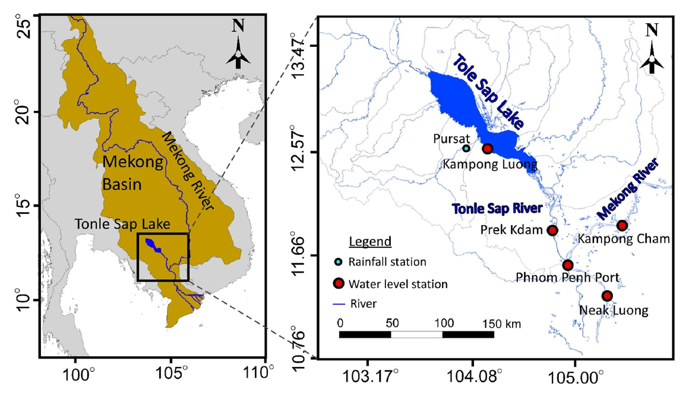
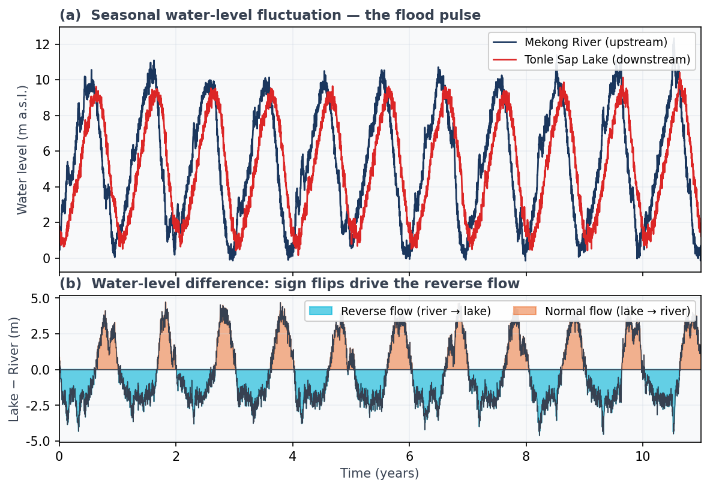
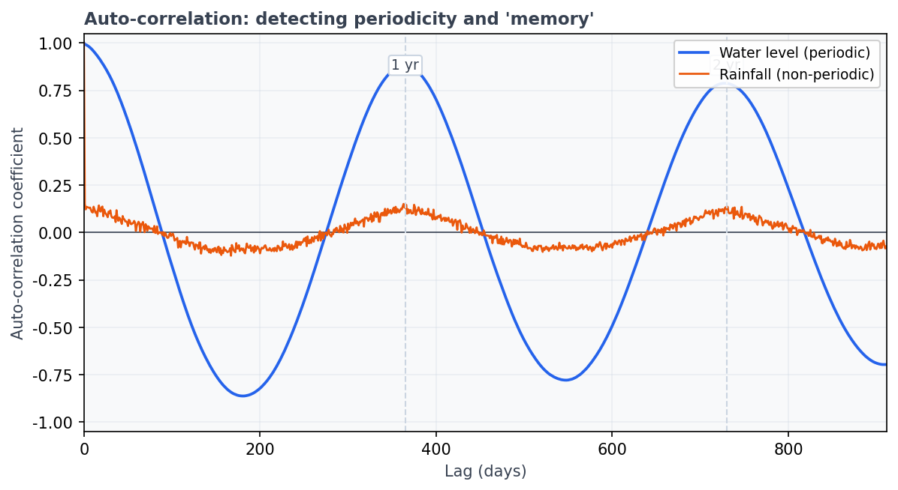
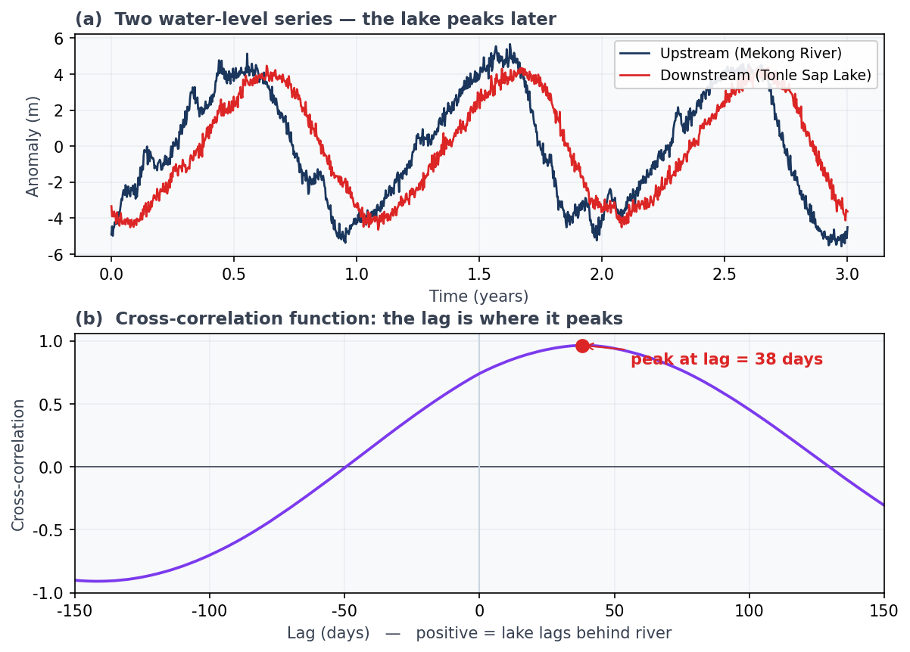
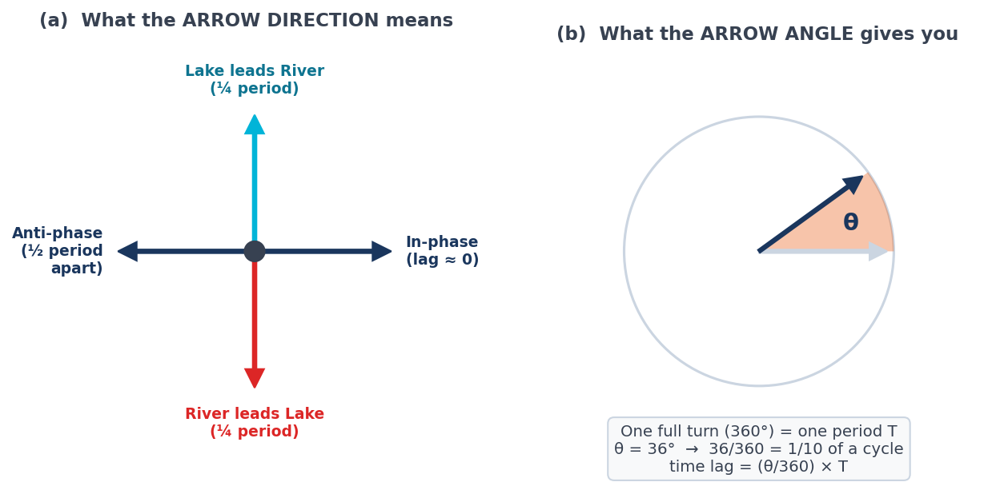

## はじめに：川が逆流する湖

カンボジアの中央に、東南アジア最大の湖がある。**トンレサップ湖（Tonle Sap Lake）**である。乾季には長さ120 km・面積2,500 km²ほどの穏やかな湖だが、雨季になると水面積は約17,500 km²へと**7倍**にも膨れ上がる（Siev et al., 2018）。

なぜ、これほど劇的に姿を変えるのか。鍵は、湖とメコン川（Mekong River）をつなぐ全長120 kmの**トンレサップ川（Tonle Sap River）**にある。この川は、年に2回、流れの向きを変えるのである。

- **乾季（11〜4月）**：湖の水が川を下り、メコン川へと注ぐ（通常流）
- **雨季（5〜10月）**：増水したメコン川の水が川を**逆流**し、湖へと流れ込む（逆流）

この、川がいわば「心臓のように」周期的に逆流して湖を満たす現象を、**洪水パルス（flood pulse）**と呼ぶ（Kummu & Sarkkula, 2008）。洪水パルスはトンレサップの豊かな漁業と生態系を支える、地球上でも稀有な水文現象である。

{#fig-map}

筆者らは、この流域の5地点で15年分（1998〜2013年）の日水位データを解析し、洪水パルスがどのように上流から下流へ、そして湖へと「伝わって」いくのかを定量化した（Yang et al., 2017, 2022）。

その主役となる道具が、本記事のテーマである**時系列解析**である。前回 #7 では FFT で「水位に隠れた周期」を取り出した。今回はそこから一歩進んで、**2つの水位のあいだにある「時間のずれ（時間ラグ）」を測る**方法を学ぶ。すなわち、

> メコン川が増水してから、その影響が湖に届くまで、いったい何日かかるのか？

という問いに、データだけで答えるのである。

------------------------------------------------------------------------

## 洪水パルスを「見る」 — 逆流はどこに現れるか

まず、現象そのものをデータで眺めてみよう。@fig-flood に、上流のメコン川（紺）と下流のトンレサップ湖（赤）の水位を示す。

{#fig-flood}

二つのことに注目してほしい。

1. **両者とも約1年周期で振動している**（@fig-flood a）。これは前回 FFT で確認したのと同じ、季節がもたらす周期性である。
2. **湖のピークは川のピークより少し遅れている**。よく見ると赤い線が紺の線を追いかけるように動いている。この「遅れ」こそ、洪水パルスが上流から湖へ伝わるのにかかった時間である。

@fig-flood (b) は「湖の水位 − 川の水位」を描いたものである。この差が**負**になる時期、つまり川のほうが水位が高い時期に、水は川から湖へと逆流する（青の領域）。逆流はおよそ5〜10月に集中し、その継続日数は年によって80〜150日とばらつくことが分かっている（Yang et al., 2022）。

では、この「遅れ」を、目分量ではなく**数値**として取り出すにはどうすればよいか。ここから3つの道具を順に導入する。

------------------------------------------------------------------------

## 道具①：自己相関 — 時系列の「記憶」を測る

最初の道具は**自己相関（auto-correlation）**である。これは「ある時系列を、自分自身を時間方向にずらしたものと比べたとき、どれだけ似ているか」を測る量である。

少し不思議に聞こえるかもしれないが、考え方は単純である。いま、水位データ $x_t$ を $k$ 日だけずらした $x_{t+k}$ を用意し、両者の相関係数を計算する。これを**ラグ $k$ の自己相関係数 $r(k)$** と呼ぶ。式で書けば、

$$
r(k) = \frac{\sum_{t=1}^{n-k} (x_t - \bar{x})(x_{t+k} - \bar{x})}{\sum_{t=1}^{n}(x_t - \bar{x})^2}
$$

である（$\bar{x}$ は平均、$n$ はデータ長）。$k=0$ なら自分自身との比較なので $r(0)=1$。$k$ を増やしていったとき、

- **周期性を持つ信号**なら、1周期ぶんずらすと再び形が重なるので、$r(k)$ は**振動しながら**、周期の整数倍のラグで大きな値をとる。
- **周期性を持たない信号**（ランダムなノイズなど）なら、少しずらしただけで似ていなくなり、$r(k)$ は**すぐにゼロへ落ちる**。

@fig-acf に、水位（周期的）と降水量（非周期的）の自己相関を示す。

{#fig-acf}

水位（青）は、ラグ365日できれいにピークを描く。これは「水位が1年前の自分とよく似ている」こと、すなわち**1年周期**を持つことの直接の証拠である。さらにピークがゆっくりとしか減衰しないのは、系が**長い記憶（long memory）**を持つ——過去の状態が長く尾を引く——ことを意味する。

対して降水量（橙）は、ラグとともに即座にゼロ近くへ沈む。雨は「昨日降ったから今日も降る」とは限らない、いわば記憶の短い現象である。自己相関は、こうした**周期性と記憶の有無**を一目で診断してくれる。

> **要点**：自己相関は「1つの時系列が、自分自身の過去とどれだけ結びついているか」を測る。周期があるかどうか、記憶が長いか短いかを判定する出発点である。

------------------------------------------------------------------------

## 道具②：相互相関 — 2つの時系列の「時間ラグ」を測る

自己相関が「1つの系列」を相手にするのに対し、**相互相関（cross-correlation）**は「2つの異なる系列」を比べる。考え方は自己相関とほぼ同じで、片方の系列 $x_t$（たとえば上流の川）を $k$ だけずらして、もう片方 $y_t$（湖）との相関を測る：

$$
r_{xy}(k) = \frac{1}{n}\sum_{t=1}^{n-k}\frac{(x_t - \bar{x})(y_{t+k}-\bar{y})}{\sigma_x \sigma_y}
$$

ここで $\sigma_x, \sigma_y$ はそれぞれの標準偏差である。$k$ をマイナスからプラスまで動かしながら $r_{xy}(k)$ を計算し、**相互相関係数が最大になるラグ $k$** を探す。その $k$ こそが、2つの系列のあいだの**時間ラグ**である（Larocque et al., 1998）。

@fig-ccf にその実例を示す。

{#fig-ccf}

相互相関関数（@fig-ccf b）のピークは、ラグ約38日の位置にある。これは「メコン川の水位変動が、トンレサップ湖に届くまでにおよそ38日かかる」ことを意味する。実際の研究では、湖（KL）の水位は中流のPKから **37±7日**、合流点のPPPから **49±7日** 遅れることが分かった（Yang et al., 2017）。さらに河川距離で割れば、洪水パルスの**伝播速度**はおよそ **3.5 km/日** と見積もられる。

降水量と湖の水位を相互相関にかければ、「雨が降ってから湖が応答するまで約80日」という結果も得られる（Yang et al., 2017）。目に見えない「時間のずれ」が、こうして具体的な日数として立ち現れるのである。

相互相関の計算は、Python では数行で書ける。考え方を確認するために、骨子だけ示しておこう（実行は各自のデータで）。

:::: {.callout-note collapse="true"}
## 🐍 Python コードを見る（クリックで展開）

```python
import numpy as np

def cross_correlation(x, y, maxlag):
    """x を基準に y をずらして相互相関係数を計算する。"""
    x = (x - x.mean()) / x.std()
    y = (y - y.mean()) / y.std()
    n = len(x)
    full = np.correlate(y, x, mode="full") / n      # 全ラグの相互相関
    mid = n - 1
    lags = np.arange(-maxlag, maxlag + 1)
    vals = full[mid - maxlag: mid + maxlag + 1]
    return lags, vals

lags, vals = cross_correlation(river_level, lake_level, maxlag=150)
time_lag = lags[np.argmax(vals)]                    # 係数が最大のラグ＝時間ラグ
print(f"推定された時間ラグ: {time_lag} 日")
```
::::

> **要点**：相互相関は「2つの時系列がどれだけ、どれだけずれて似ているか」を測る。ピークの位置が時間ラグであり、そこから伝播の速さまで定量化できる。

------------------------------------------------------------------------

## 道具③：クロスウェーブレット — 時間とともに変わるラグを追う

相互相関には一つ弱点がある。**「全期間で平均したラグ」しか得られない**ことである。だが現実の自然は、年によって、季節によって、その関係を変える。ダム建設の影響や、異常気象の年には、伝播のしかたも変わりうる。

そこで登場するのが**クロスウェーブレット変換（cross-wavelet transform, XWT）**である。これは前回 FFT の発展形にあたる。FFT が時系列全体を一つの周波数スペクトルに潰してしまうのに対し、ウェーブレット変換は「**いつ・どの周期の・どれだけ強い変動があったか**」を時間–周期平面の上に展開する（Torrence & Compo, 1998）。

二つの系列それぞれのウェーブレット変換 $W^X, W^Y$ を求め、

$$
W^{XY} = W^X \, \overline{W^Y}
$$

として掛け合わせたものがクロスウェーブレットである（$\overline{\phantom{W}}$ は複素共役）。その複素数の**偏角（位相角）$\arg(W^{XY})$** が、各時刻・各周期における2系列の**位相のずれ**を表す。位相のずれは、その周期の波が何日ぶんずれているか——すなわち時間ラグ——に換算できる（Grinsted et al., 2004）。

@fig-xwt にその結果を示す。

{#fig-xwt}

### この図の読み方 — 色と矢印を分けて読む

クロスウェーブレット図には**2つの情報**が同時に描かれている。**色（Power）**と**矢印（位相）**である。初心者は、この2つを分けて読むのがコツである。

**① 色 ＝ Power（2つの信号が「同じ周期で・同時に」どれだけ強く振動しているか）**

- 赤いほど、その時刻・その周期で**両方の信号がそろって大きく振動**している（共通の変動が強い）。青いほど弱い。
- 太い黒線の内側は**統計的に有意**（5%水準。偶然ではない、と判断できる領域）。
- 破線より外（COI）は端の影響で信頼できないので**読まない**。

@fig-xwt では、256〜512日（≒1年）の帯がまっ赤なので、「川と湖は1年周期で強く連動している」と読める。

**② 矢印 ＝ 位相（2つの信号の「時間のずれ」の向き）**

矢印の向きが、2つの信号のずれ方を表す（@fig-guide）。

{#fig-guide}

- **→ 右向き**：同位相。2つは足並みをそろえて動く（ラグほぼゼロ）。
- **← 左向き**：逆位相。一方が山のとき他方は谷（半周期ぶんずれる）。
- **↓ 下向き**：川（1本目）が湖（2本目）を**¼周期だけ先導**する。
- **↑ 上向き**：その逆（湖が川を先導）。
- **斜めの矢印**：これらの中間。傾いた角度 θ が、そのまま「ずれの大きさ」になる。

つまり @fig-xwt の年周期帯で矢印が**右下**を向いているのは、「ほぼ同位相（右）だが、わずかに川が湖を先導している（下）」——すなわち**川がほんの少し先に動く**ことを意味している。

:::: {.callout-note}
## 符号の約束 — どちらの系列を先に入れるか

クロスウェーブレットの位相は「（第1系列の位相）−（第2系列の位相）」で決まる。そのため、**2本のうちどちらを第1引数にするかで、位相の符号と矢印の上下が反転する**（物理的な結論は変わらない）。

| 入れ方 | 位相 | 矢印 | 例 |
|---|---|---|---|
| `xwt(川, 湖)`（先行する川が第1） | **+39.7°** | 右**下** | 本記事の @fig-xwt |
| `xwt(湖, 川)`（遅れる湖が第1） | **−35.9°** | 右**上** | Yang et al. (2017) |

どちらも「川が湖を約40日先行する」という**同じ事実**を表している。2017年論文は湖（KL）を第1引数に置いた（`xwt(KL, PK)`）ため位相が負になっているが、符号は順番の約束にすぎない。次の手計算では、論文に合わせて位相の大きさ $35.9°$ を用いる。
::::

年周期（256〜512日）の帯に横一文字に伸びる高パワー領域は、洪水パルスの1年周期が15年間ずっと卓越していたことを物語る。そして矢印の向き（位相）が一貫して右下を指していることから、川と湖は**安定した位相差（＝一定の時間ラグ）を保ったまま**連動していたと読み取れる。もし途中で矢印の向きが乱れていれば、それは「ある年だけ伝播のしかたが変わった」ことのサインになる。クロスウェーブレットは、相互相関では見えない**ラグの時間変化**まで描き出すのである。

さらに、有意帯における位相角 $\theta$ から、時間ラグを直接逆算できる。波長（周期）を $T$ とすれば、

$$
\text{時間ラグ} = \frac{\theta}{2\pi} \, T
$$

である。実際の研究では、374日帯の平均位相 $-35.9°$ から時間ラグ **37.3日**（KL–PK）が得られ、相互相関の結果と整合した（Yang et al., 2017）。@fig-xwt の合成データでも、位相約40°から約41日というラグが逆算され、相互相関（約38日）とよく一致する。**異なる2つの手法が同じ答えに行き着く**ことが、結果の信頼性を裏づけている。

:::: {.callout-tip}
## ✏️ 手計算してみよう — 位相から時間ラグを出す

紙とペンでできる。論文の KL–PK（374日帯）を例にとろう。

1. 図から**位相角**を読む：$\theta = 35.9°$（川が湖を先導）。
2. これは「1周期 360° のうち、どれだけずれているか」の割合：$35.9 \div 360 = 0.0997$（およそ10分の1）。
3. その割合を**周期 $T = 374$ 日**に掛ける：$0.0997 \times 374 \approx \mathbf{37\ 日}$。

→ 「湖の年ピークは、川の年ピークの**約37日後**に来る」と読める。

ラジアンで計算しても同じである：$\text{時間ラグ} = \dfrac{\theta_{\text{rad}}}{2\pi}\,T = \dfrac{0.6266}{6.283}\times 374 \approx 37\ \text{日}$。相互相関で求めた約40日とも一致する。
::::

なお、本記事のクロスウェーブレット図は、原論文で用いた MATLAB の Grinsted ツールボックス（Grinsted et al., 2004）を、依存ライブラリなしで Python に移植して描いている。使い方はおおむね次のとおりで、2本の時系列とサンプリング間隔を渡すだけでよい。

:::: {.callout-note collapse="true"}
## 🐍 Python コードを見る（クリックで展開）

```python
from xwt_grinsted import xwt, plot_xwt, phase_to_timelag

# x, y : 2本の水位（等間隔・同じ dt）, dt = 1.0（日）
Wxy, period, scale, coi, sig95, t, sigmas = xwt(x, y, dt=1.0)

# 2017論文 Fig.4 スタイル（有意水準コンター・COI・位相矢印）で描画
plot_xwt(t, period, Wxy, coi, sig95, dt=1.0, sigmas=sigmas, out="xwt.png")

# 位相角から時間ラグを逆算（374日帯）: timelag = θ·T / 2π
lag, theta, P = phase_to_timelag(Wxy, period, target_period=374)
print(f"時間ラグ: {lag:.1f} 日（平均位相 {np.degrees(theta):.1f}°, 周期 {P:.0f} 日）")
```
::::

------------------------------------------------------------------------

## ここまでをつなぐ — 3つの道具の役割分担

トンレサップの解析を通して、時系列解析の3つの道具を見てきた。役割を整理しておこう。

| 道具 | 何を測るか | トンレサップでの答え |
|------|-----------|----------------------|
| **自己相関** | 1つの系列の周期性・記憶 | 水位は1年周期・長い記憶を持つ |
| **相互相関** | 2つの系列の平均的な時間ラグ | 川→湖は約40日、雨→湖は約80日 |
| **クロスウェーブレット** | 時間とともに変わる位相・ラグ | 1年周期が15年間一貫して卓越 |

「1つの系列 → 2つの系列 → 時間変化」と、見る対象を一段ずつ広げてきたことに注目してほしい。この三段構えは、トンレサップに限らず、あらゆる水文時系列に適用できる汎用の型である。

実際、これらの結果はその後、上流の水位から下流・湖の水位を予測・補間する**ラグベース重回帰モデル**へと発展し、観測値を $R^2$・NSE ともに 0.99 を超える精度で再現することに成功した（Yang et al., 2022）。「時間のずれ」を正しく測ることが、欠測データの補間や将来予測という実用へ直結するのである。

------------------------------------------------------------------------

## 地下水へ — 同じ道具が地面の下でも効く

ここまで地表水（川と湖）の話をしてきた。しかし本連載は地下水科学入門である。なぜこの話をしたのか。答えは単純で、**まったく同じ道具が、地面の下でもそのまま効く**からである。

地下水位もまた、外からの「入力」に遅れて応答する時系列である。たとえば——

- **海洋潮汐 → 沿岸の地下水位**：海が満ち引きするたびに、その圧力が帯水層を通じて内陸へ伝わり、地下水位を揺らす。前回 #7 の南大東島では、潮汐が淡水レンズを「呼吸」させていた（Yang et al., 2020）。海の潮位と各観測井の地下水位を**相互相関**にかければ、「潮の山が井戸に届くまでの時間ラグ」が分かり、そこから帯水層の**透水性**まで推定できる。
- **大気圧 → 不圧地下水位**：気圧が下がると地下水位はわずかに上がる。別府の不圧地下水でも、この気圧応答が観測されている。気圧と水位の相互相関は、地層の性質を映す鏡となる。

川の水位を湖の水位で追いかけるのも、海の潮汐を井戸の水位で追いかけるのも、数学的には同じ「2つの時系列の時間ラグを測る」問題である。トンレサップで身につけた道具は、そのまま地下水の解析へ持ち込める。これが、遠いカンボジアの湖を地下水入門で取り上げた理由である。

------------------------------------------------------------------------

## まとめ

- トンレサップ湖では、雨季にメコン川が**逆流**して湖を満たす**洪水パルス**が起こる。その伝播を時系列解析で定量化した。
- **自己相関**は1つの時系列の周期性と記憶を測る。水位は1年周期・長い記憶を持つことが分かった。
- **相互相関**は2つの時系列の時間ラグを測る。メコン川の変動は約40日かけて湖に届き、雨の影響は約80日後に現れる。
- **クロスウェーブレット**は、時間とともに変わる位相・ラグを描き出す。洪水パルスの1年周期は15年間一貫して卓越していた。
- これらの道具は、**海洋潮汐や気圧に対する地下水位の応答解析**にもそのまま応用でき、帯水層の透水性の推定へとつながる。

::: callout-note
## 次回予告 — #9

相互相関で「時間ラグ」を測れることは分かった。では、**同じ入力に対して、なぜ井戸ごとに応答の遅れが違うのか？** 次回は圧力伝播の方程式に踏み込み、地層の透水性（水理拡散係数）と深度が、ラグをどう決めるのかを解き明かす。
:::

------------------------------------------------------------------------

## 参考文献

- Yang, H., Siev, S., Yoshimura, C., Fujii, H. (2017) Identification of phase propagation of water level between the Tonle Sap Lake and River based on time series analysis. *Proceedings of the 2nd International Symposium on Conservation and Management of Tropical Lakes*, 16–22.
- Yang, H., Siev, S., Uk, S., Yoshimura, C. (2022) Relationship between water levels and flood pulse induced by river–lake interaction in the Tonle Sap basin, Cambodia. *Environmental Earth Sciences*, 81, 226. <https://doi.org/10.1007/s12665-022-10353-5>
- Yang, H., Shimada, J., Okumura, A., Shibata, T., Pinti, D.L. (2020) Freshwater lens oscillation induced by sea tides and variable rainfall at the uplifted atoll island of Minami-Daito, Japan. *Hydrogeology Journal*, 28, 2105–2114. <https://doi.org/10.1007/s10040-020-02185-z>
- Kummu, M., Sarkkula, J. (2008) Impact of the Mekong River flow alteration on the Tonle Sap flood pulse. *Ambio*, 37, 185–192.
- Siev, S., Yang, H., Sok, T., Uk, S., Song, L., Kodikara, D., Oeurng, C., Hul, S., Yoshimura, C. (2018) Sediment dynamics in a large shallow lake characterized by seasonal flood pulse in Southeast Asia. *Science of the Total Environment*, 631–632, 597–607.
- Torrence, C., Compo, G.P. (1998) A practical guide to wavelet analysis. *Bulletin of the American Meteorological Society*, 79, 61–78.
- Grinsted, A., Moore, J.C., Jevrejeva, S. (2004) Application of the cross wavelet transform and wavelet coherence to geophysical time series. *Nonlinear Processes in Geophysics*, 11, 561–566.
- Larocque, M., Mangin, A., Razack, M., Banton, O. (1998) Contribution of correlation and spectral analyses to the regional study of a large karst aquifer (Charente, France). *Journal of Hydrology*, 205, 217–231.
