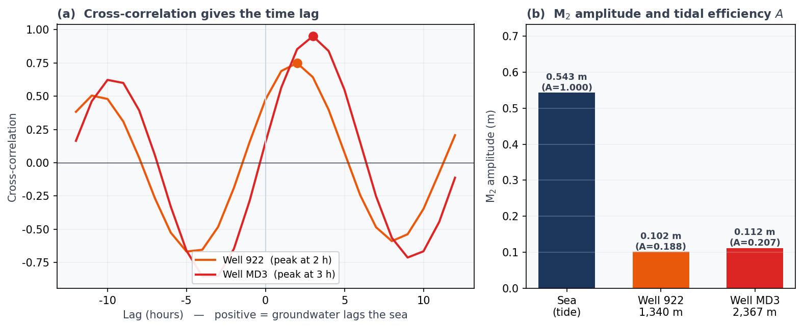
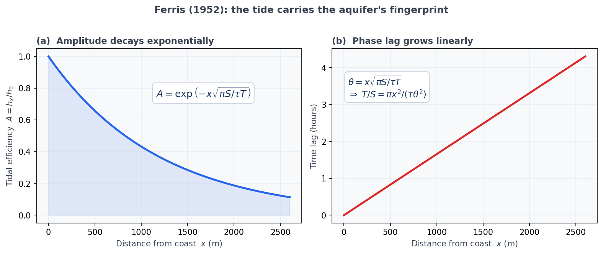

## Introduction: turning the tide into a tool

In [#7](/posts/groundwater/groundwater-sci07/index-en.html) we watched the freshwater lens beneath the remote island of Minami-Daito "breathe" quietly in step with the ocean tide. When the sea rises, the water table rises; when it falls, the table falls. We pulled that oscillation out with the FFT.

But the tide is not merely something to observe. It is also **a natural signal generator for probing the ground**. Every day the sea knocks on the island with a fixed rhythm, and that vibration travels inland through the subsurface. How fast it travels, and how much it weakens, carries the fingerprint of the rock it passed through.

The question of this article is therefore:

> The same tide reaches every well. So why does the "delay" and the "weakening" differ from well to well? And what can we read from those differences?

The answer, stated up front: from the tidal **time lag** and **amplitude ratio** we can obtain the aquifer's **hydraulic conductivity $K$** — its ability to transmit water — without performing a single pumping test. And at the end, we will reconstruct the groundwater level itself from the tide. The cross-correlation we learned in [#8](/posts/groundwater/groundwater-sci08/index-en.html) comes into its own here.

::: callout-note
## The data

We use real observations from Minami-Daito Island (2014, hourly, 8,760 hours): the sea level, and the groundwater level in two monitoring wells — **well 922**, 1,340 m from the coast, and **well MD3**, at the centre of the island and the farthest from the sea at 2,367 m. The analysis follows Yang et al. (2021).
:::

------------------------------------------------------------------------

## Two wells — farther away, yet less attenuated

Let us look at the phenomenon itself. @fig-two shows the **M₂ constituent** — the semidiurnal tide with a period of 12.42 hours — extracted by harmonic analysis.

{#fig-two}

Something strange emerges. **MD3 is 1.8 times farther from the coast than 922**, and yet:

- its tidal amplitude is **larger** (0.112 m against 0.102 m)
- its delay is only marginally longer

Common sense says the tide should weaken and arrive later the farther inland you go. That it does neither can mean only one thing:

> **The ground around MD3 transmits the tide far faster and far better. It is more permeable.**

This is the step beyond the time-lag map of #7. **What matters is not the lag itself, but the lag relative to distance.**

------------------------------------------------------------------------

## Measuring lag and amplitude — the tools of #8 on real data

Raw groundwater levels contain recharge, seasonal variation and noise alongside the tide. So we band-pass the tidal band first, then measure the lag with the **cross-correlation** of #8 (@fig-xc a). For the amplitude we isolate the M₂ constituent rigorously by harmonic analysis (@fig-xc b).

{#fig-xc}

Collecting the numbers:

| Well | Distance to coast $x$ | Time lag (cross-corr.) | M₂ amplitude | Tidal efficiency $A$ |
|---|---|---|---|---|
| **922** | 1,340 m | ~2 hours | 0.102 m | 0.188 |
| **MD3** | 2,367 m | ~3 hours | 0.112 m | **0.207** |
| (sea) | — | — | 0.543 m | 1.000 |

::: callout-important
## A caveat worth stating plainly

The cross-correlation peak reaches 0.75 for 922 but 0.95 for MD3. **The tidal signal at 922 is noticeably noisier.** Indeed, harmonic analysis puts the phase lag at 922 at 1.8 hours, somewhat at odds with the 2.3 hours of the original paper (for MD3 we obtain 2.84 hours, in close agreement with the published 2.8).

For the quantitative work below we therefore use the peer-reviewed M₂ time lags of **2.3 h and 2.8 h** (Yang et al., 2021). The data analysis is here to let you *feel* the method; the numbers come from the paper.
:::

:::: {.callout-note collapse="true"}
## 🐍 Show the Python code (click to expand)

```python
import numpy as np
from scipy.signal import butter, filtfilt

def bandpass(x, lo=1/30, hi=1/10, fs=1.0, order=3):
    """Keep only the tidal band (periods of 10-30 hours)."""
    ny = fs / 2
    b, a = butter(order, [lo/ny, hi/ny], btype="band")
    return filtfilt(b, a, x - x.mean())

def cross_correlation(x, y, maxlag):
    x = (x - x.mean()) / x.std()
    y = (y - y.mean()) / y.std()
    n = len(x)
    full = np.correlate(y, x, mode="full") / n
    mid = n - 1
    lags = np.arange(-maxlag, maxlag + 1)
    return lags, full[mid - maxlag: mid + maxlag + 1]

lags, vals = cross_correlation(bandpass(tide), bandpass(well), maxlag=12)
print(f"Time lag: {lags[np.argmax(vals)]} hours")
```
::::

------------------------------------------------------------------------

## The tide as the aquifer's report card — Ferris's solution

As the tide travels inland, **its amplitude decays exponentially and its phase is delayed in proportion to distance**. Assuming one-dimensional, isotropic, homogeneous flow in an unconfined aquifer with the boundary condition $h(0,t)=h_0\sin(\omega t)$, the solution is (Ferris, 1952):

$$
h(x,t)=h_0\,\exp\!\left(-x\sqrt{\frac{\pi S}{\tau T}}\right)\,
\sin\!\left(\omega t-x\sqrt{\frac{\pi S}{\tau T}}\right)
$$

Here $x$ is the distance from the coast, $\tau$ the tidal period (12.41 h for M₂), $T$ the transmissivity and $S$ the storage coefficient (close to the specific yield in an unconfined aquifer).

{#fig-ferris}

As @fig-ferris shows, the identical quantity $\sqrt{\pi S/\tau T}$ governs **both** the decay of amplitude **and** the growth of phase lag. Measure either one, and the aquifer reveals itself. Rearranging, the **hydraulic diffusivity $T/S$** can be written two ways:

$$
\frac{T}{S}=\frac{\pi x^{2}}{\tau\,\theta^{2}}\quad(\text{from the phase lag }\theta),
\qquad
\frac{T}{S}=\frac{\pi x^{2}}{\tau\,(\ln A)^{2}}\quad(\text{from the tidal efficiency }A)
$$

and the hydraulic conductivity follows by dividing by the aquifer thickness $b$:

$$
K=\frac{T}{b}
$$

Note that $T/S \propto x^{2}/\theta^{2}$. **For the same lag, a more distant well implies a larger diffusivity.** That is precisely why MD3 is "far, yet fast."

::: {.callout-tip}
## ✏️ Try it by hand — from lag to hydraulic conductivity

Pen and paper suffice. Take **MD3**, the well farthest from the sea.

1. **Convert the time lag into a phase angle.** The M₂ period is $\tau = 12.41$ h. A lag of 2.8 h is a fraction $2.8/12.41 = 0.2256$ of one cycle, so
   $$\theta = 2\pi \times 0.2256 = 1.418\ \text{rad}$$
2. **Compute the hydraulic diffusivity.** With $x = 2{,}367$ m and $\tau = 44{,}676$ s,
   $$\frac{T}{S}=\frac{\pi x^{2}}{\tau\,\theta^{2}}
   =\frac{\pi \times 2367^{2}}{44676 \times 1.418^{2}} \approx 196\ \mathrm{m^2/s}$$
3. **Get the transmissivity.** Taking the specific yield $S=0.1$ gives $T = 196 \times 0.1 = 19.6\ \mathrm{m^2/s}$.
4. **Get the hydraulic conductivity.** With an aquifer thickness $b=300$ m,
   $$K=\frac{T}{b}=\frac{19.6}{300} \approx 6.5\times10^{-2}\ \mathrm{m/s}$$

The published value is $6.35\times10^{-2}$ m/s. **The hand calculation lands almost exactly on it.** Repeating the steps for 922 ($x=1{,}340$ m, lag 2.3 h) gives $K \approx 3.1\times10^{-2}$ m/s, again matching the published $3.04\times10^{-2}$ m/s.
:::

### Do the two routes agree?

The $K$ from the phase lag and the $K$ from the amplitude ratio should describe the same rock. Let us check.

| Well | From phase lag | From amplitude | Agreement |
|---|---|---|---|
| MD3 | $6.5\times10^{-2}$ | $5.3\times10^{-2}$ | within ~20% |
| 922 | $3.1\times10^{-2}$ | $1.5\times10^{-2}$ | a factor of ~2 |

They agree well at MD3 but differ twofold at 922. This is not a failure — it is **information**. Ferris's solution assumes a one-dimensional, isotropic, homogeneous aquifer. Departures from those assumptions surface as a mismatch between the two routes. The original paper adopted the phase-lag formula precisely because phase is the more robust of the two.

------------------------------------------------------------------------

## The whole island — look at the lag relative to distance

Applying the method to all fifteen wells maps the hydraulic conductivity of the entire island — without a single pumping test.

{#fig-kmap}

@fig-kmap is the most important figure in this article. Read it like this:

- **The farther a point sits below the dashed contours, the more permeable the ground** (the faster the signal travelled).
- MD3 lies at the far right: a long distance with a short lag → the island's highest $K = 6.35\times10^{-2}$ m/s.
- Conversely **923** is only 934 m from the coast, yet its lag of 3.1 h is the longest on the island. Its $K = 8.5\times10^{-3}$ m/s is low.
- **MD2** sits just 250 m from the sea with the shortest lag of all, 1.3 h — and yet its $K = 3.46\times10^{-3}$ m/s is the island's **lowest**.

MD2 captures the whole lesson. **A short lag does not, by itself, mean high permeability.** That the tide takes 1.3 hours to cross a mere 250 m is exactly what tells us this ground resists the flow of water.

Across the island, $K$ ranges from $3.5\times10^{-3}$ to $6.4\times10^{-2}$ m/s. It is **higher in the south, the centre and the northeast, and lower along the eastern and western rims.** The reason is known: north–south **fissures** (highly permeable) cut through the island, while **dolomite** (poorly permeable) forms the rim. The tide races along the fissures and crawls through the dolomite.

> The map of how the tide travels is, in effect, **a map of the fissures and dolomite beneath the island**.

------------------------------------------------------------------------

## The climax: reconstructing the water level with a lag-based regression

So far we have been *measuring* the ground. Now we will *reproduce* the groundwater level itself from the tide, using the **lag-based multiple regression analysis (MRA)** developed by the author.

The idea is disarmingly simple. Treat the groundwater level as the accumulation of a single signal — the sea level — arriving with **many different delays**. Then regress the groundwater level on time-shifted copies of the sea level:

$$
\hat{y}(t)=b+\sum_{m=0}^{M} a_m\,x_{t-m}+\varepsilon_t
$$

where $\hat{y}(t)$ is the groundwater level to be reproduced, $x_{t-m}$ the sea level $m$ hours earlier, $a_m$ the partial regression coefficients and $b$ the intercept.

Which lags, and how many? That is where **Akaike's Information Criterion (AIC)** enters.

{#fig-mra}

Panel (a) of @fig-mra is a lovely result. The AIC stops improving at a maximum lag of about 12 hours — and 12 hours is **one full M₂ tidal cycle (12.4 h)**. The length of the aquifer's "memory" of the tide is precisely one tidal period. The data is telling us physics.

Restricting the candidates to lags of 0–12 hours, we then run **AIC forward selection** (the equivalent of R's `step`, as in the original paper). The thirteen candidates are pared down to just **five lags: 3, 4, 9, 11 and 12 hours**.

And the result is panel (c). The final **65 days, never used in fitting**, were predicted from the sea level alone:

$$
R^2 = 0.987,\qquad \mathrm{NSE} = 0.985,\qquad \mathrm{RMSE} = 0.0126\ \mathrm{m}
$$

An error of just **1.3 cm**. No pumping test, no heavy density-dependent three-dimensional model — only the sea level, a signal that is free for the taking, pinpointing the groundwater level to within a centimetre.

:::: {.callout-note collapse="true"}
## 🐍 Show the Python code (click to expand)

```python
import numpy as np

def build_design(x, maxlag):
    """Shift the sea level by 0..maxlag hours to form the predictors."""
    n = len(x)
    cols = [np.ones(n - maxlag)]
    for m in range(maxlag + 1):
        cols.append(x[maxlag - m: n - m])
    return np.column_stack(cols)

def aic(X, y):
    beta, *_ = np.linalg.lstsq(X, y, rcond=None)
    rss = np.sum((y - X @ beta) ** 2)
    n, k = X.shape
    return n * np.log(rss / n) + 2 * k, beta

# Fit the coefficients on the training period, predict the unseen period
X = build_design(tide_band, maxlag=12)
y = gwl_band[12:]
_, beta = aic(X[:split], y[:split])
pred = X[split:] @ beta

ss_res = np.sum((y[split:] - pred) ** 2)
ss_tot = np.sum((y[split:] - y[split:].mean()) ** 2)
print(f"NSE = {1 - ss_res/ss_tot:.3f}")
```
::::

One honest note on panel (b): the coefficients alternate in sign because the lagged sea levels are strongly correlated with one another. Reading an individual coefficient as "this delay is the important one" would be a mistake. Together they constitute a single **linear filter** that produces the correct phase and amplitude.

------------------------------------------------------------------------

## Why it matters

- **Water resources on small islands.** On a small island a pumping test is barely feasible. Pump, and saltwater cones up from below; and the tide keeps the water level moving so the test never settles. Obtaining a basin-wide hydraulic conductivity from a signal that costs nothing is therefore no small thing.
- **Preparing for sea-level rise.** Only once the distribution of $K$ is known can a numerical model predict how the freshwater lens will respond to sea-level rise and changing rainfall. The method here is **the first step: parameter estimation.**
- **Filling gaps and forecasting.** The lag-based MRA interpolates missing observations and looks ahead. The sparser the monitoring network, the more valuable that becomes.

------------------------------------------------------------------------

## Summary

- The tide is not an object of observation but **a natural signal generator for measuring the ground**.
- Both the **time lag** and the **amplitude ratio** of the tide reflect the aquifer's **hydraulic diffusivity $T/S$**, from which the hydraulic conductivity $K$ follows.
- What matters is not the lag itself but **the lag relative to distance**. Hence "far yet undiminished" MD3 is highly permeable ($6.35\times10^{-2}$ m/s), while "near yet slow" MD2 is not ($3.46\times10^{-3}$ m/s).
- Where the two routes (phase and amplitude) disagree, they are telling us how far the real aquifer departs from the idealised one-dimensional, isotropic, homogeneous model.
- The **lag-based MRA** reproduced the groundwater level from the sea level alone with $R^2 = 0.987$ and an error of 1.3 cm — no pumping test, no heavy model.

::: callout-note
## Next time — #10

Over four articles we have sharpened one tool: time-series analysis. Next time we reach the culmination. **How do we convey complex analytical results to residents and non-specialists?** We consider the principles of data visualisation, and what it means to make groundwater science reach the public.
:::

------------------------------------------------------------------------

## References

- Yang, H., Tawara, Y., Shimada, J., Kagabu, M., Okumura, A. (2021) Large-scale hydraulic conductivity distribution in an unconfined carbonate aquifer using the ocean tidal propagation. *Hydrogeology Journal*, 29, 2091–2105. <https://doi.org/10.1007/s10040-021-02366-4>
- Yang, H., Siev, S., Uk, S., Yoshimura, C. (2022) Relationship between water levels and flood pulse induced by river–lake interaction in the Tonle Sap basin, Cambodia. *Environmental Earth Sciences*, 81, 226. <https://doi.org/10.1007/s12665-022-10353-5>
- Yang, H., Shimada, J., Shibata, T., Okumura, A., Pinti, D.L. (2020) Freshwater lens oscillation induced by sea tides and variable rainfall at the uplifted atoll island of Minami-Daito, Japan. *Hydrogeology Journal*, 28, 2105–2114. <https://doi.org/10.1007/s10040-020-02185-z>
- Ferris, J.G. (1952) Cyclic fluctuations of water levels as a basis for determining aquifer transmissibility. *U.S. Geological Survey*, Water Resources Division. <https://doi.org/10.3133/70133368>
- Larocque, M., Mangin, A., Razack, M., Banton, O. (1998) Contribution of correlation and spectral analyses to the regional study of a large karst aquifer (Charente, France). *Journal of Hydrology*, 205, 217–231.
- Akaike, H. (1973) Information theory and an extension of the maximum likelihood principle. *Proceedings of the 2nd International Symposium on Information Theory*, 267–281.
