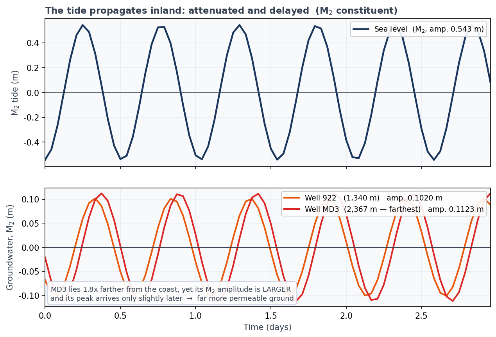
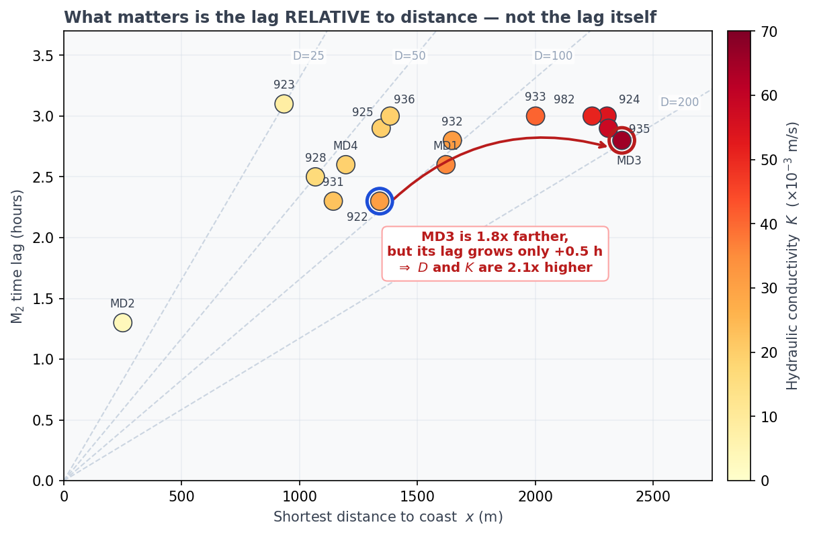
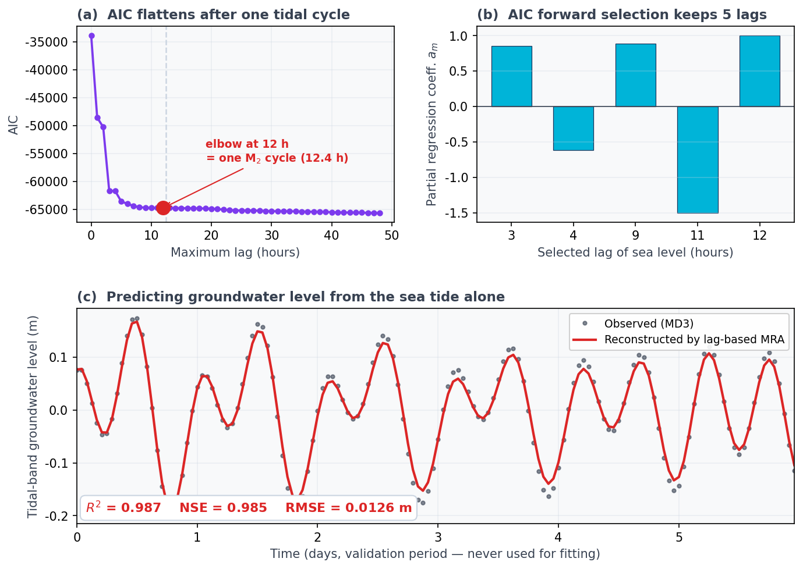

## はじめに：潮汐を"道具"に変える

[#7](/posts/groundwater/groundwater-sci07/) では、絶海の孤島・南大東島の地下に浮かぶ淡水レンズが、海の潮汐に合わせて静かに「呼吸」する様子を眺めた。海が満ちれば地下水位が上がり、引けば下がる。その揺れを FFT で取り出したのである。

しかし潮汐は、単に観察する対象ではない。**地層を診断するための、天然の信号源**でもある。海は毎日きまった周期で島を叩き、その振動は地下を通って内陸へ伝わっていく。伝わる速さと弱まり方には、地層の性質がそのまま刻まれている。

本記事の問いはこうである。

> 同じ潮汐が伝わっているのに、なぜ井戸ごとに「遅れ」と「弱まり」が違うのか。そして、その違いから何を読み取れるのか。

結論を先に言えば、潮汐の**時間ラグ**と**振幅比**から、地層の**透水係数 $K$**——水の通しやすさ——を、揚水試験を1本も行わずに求められる。そして最後には、潮汐から地下水位そのものを**再現**してみせる。[#8](/posts/groundwater/groundwater-sci08/) で身につけた相互相関が、ここで本領を発揮する。

::: callout-note
## 使用するデータ

南大東島の実観測データ（2014年・1時間間隔・8,760時間）を用いる。海の潮位と、2本の観測井——海岸から 1,340 m の **井戸922**、そして島の中央、海岸から最遠 2,367 m の **井戸MD3** ——の地下水位である。解析結果は Yang et al. (2021) に基づく。
:::

------------------------------------------------------------------------

## 二つの井戸 — 遠いのに、弱まらない

まず現象そのものを見よう。潮汐の主役である **M2 分潮**（周期 12.42 時間の半日周潮）を、調和解析で取り出して重ねたのが @fig-two である。

{#fig-two}

奇妙なことに気づく。**MD3 は 922 より 1.8 倍も海から遠い**のに、

- 潮汐の振幅は **MD3 のほうが大きい**（0.112 m 対 0.102 m）
- 遅れも、ほんのわずかしか増えていない

普通に考えれば、遠いほど潮汐は弱まり、遅れるはずである。この「遠いのに弱まらない、遅れない」という事実は、ただ一つのことを意味する。

> **MD3 のまわりの地層は、潮汐を桁違いに速く・よく伝える。すなわち透水性が高い。**

ここが #7 の時間差マップを一歩超える核心である。**重要なのはラグの絶対値ではなく、「距離に対するラグ」**なのだ。

------------------------------------------------------------------------

## ラグと振幅を測る — #8 の道具を実データへ

生の地下水位には、潮汐のほかに涵養・季節変動・ノイズが混じっている。そこで潮汐帯にバンドパスをかけてから、#8 の**相互相関**でラグを測る（@fig-xc a）。振幅は、調和解析で M2 成分だけを厳密に取り出して比べる（@fig-xc b）。

{#fig-xc}

得られた値を整理する。

| 井戸 | 海岸からの距離 $x$ | 時間ラグ（相互相関） | M2振幅 | 潮汐効率 $A$ |
|---|---|---|---|---|
| **922** | 1,340 m | 約 2 時間 | 0.102 m | 0.188 |
| **MD3** | 2,367 m | 約 3 時間 | 0.112 m | **0.207** |
| （海） | — | — | 0.543 m | 1.000 |

::: callout-important
## 正直に書いておきたいこと

922 の相互相関のピーク値は 0.75、MD3 は 0.95 である。**922 の潮汐信号は MD3 より雑音が多い。** 実際、調和解析から求めた 922 の位相ラグは 1.8 時間となり、原論文の 2.3 時間とやや食い違う（MD3 は 2.84 時間で、論文の 2.8 時間とよく一致する）。

以降の定量計算では、査読を経た原論文（Yang et al., 2021）の M2 時間ラグ **2.3 時間 / 2.8 時間**を用いる。データ解析は「手法を体感するため」、数値は「論文の値」を使う、という切り分けである。
:::

:::: {.callout-note collapse="true"}
## 🐍 Python コードを見る（クリックで展開）

```python
import numpy as np
from scipy.signal import butter, filtfilt

def bandpass(x, lo=1/30, hi=1/10, fs=1.0, order=3):
    """潮汐帯（周期10〜30時間）だけを取り出す"""
    ny = fs / 2
    b, a = butter(order, [lo/ny, hi/ny], btype="band")
    return filtfilt(b, a, x - x.mean())

def cross_correlation(x, y, maxlag):
    x = (x - x.mean()) / x.std()
    y = (y - y.mean()) / y.std()
    n = len(x)
    full = np.correlate(y, x, mode="full") / n
    mid = n - 1
    lags = np.arange(-maxlag, maxlag + 1)
    return lags, full[mid - maxlag: mid + maxlag + 1]

lags, vals = cross_correlation(bandpass(tide), bandpass(well), maxlag=12)
print(f"時間ラグ: {lags[np.argmax(vals)]} 時間")
```
::::

------------------------------------------------------------------------

## 潮汐は地層の"通信簿" — Ferris の式

潮汐が内陸へ伝わるとき、**振幅は指数的に弱まり、位相は距離に比例して遅れる**。1次元・等方均質の不圧帯水層を仮定すると、海岸の境界条件 $h(0,t)=h_0\sin(\omega t)$ に対する解は次で与えられる（Ferris, 1952）。

$$
h(x,t)=h_0\,\exp\!\left(-x\sqrt{\frac{\pi S}{\tau T}}\right)\,
\sin\!\left(\omega t-x\sqrt{\frac{\pi S}{\tau T}}\right)
$$

ここで $x$ は海岸からの距離、$\tau$ は潮汐の周期（M2 なら 12.41 時間）、$T$ は透水量係数、$S$ は貯留係数（不圧帯水層では比産出率に近い）である。

{#fig-ferris}

@fig-ferris が示すように、**振幅の減衰**にも**位相の遅れ**にも、まったく同じ量 $\sqrt{\pi S/\tau T}$ が顔を出す。だから、どちらか一方を測れば地層の性質が分かる。式を解き直すと、**水理拡散係数 $T/S$** が2通りに書ける。

$$
\frac{T}{S}=\frac{\pi x^{2}}{\tau\,\theta^{2}}\quad(\text{位相ラグ }\theta\ \text{から}),
\qquad
\frac{T}{S}=\frac{\pi x^{2}}{\tau\,(\ln A)^{2}}\quad(\text{振幅比 }A\ \text{から})
$$

そして透水係数は、帯水層の厚さ $b$ で割って得られる。

$$
K=\frac{T}{b}
$$

ここで $T/S \propto x^{2}/\theta^{2}$ に注目してほしい。**同じラグなら、遠い井戸ほど拡散係数は大きい。** MD3 が「遠いのに速い」のは、まさにこれである。

::: {.callout-tip}
## ✏️ 手計算してみよう — ラグから透水係数を出す

紙とペンでできる。島でもっとも海から遠い **MD3** でやってみよう。

1. **時間ラグを位相角に直す**。M2 の周期は $\tau = 12.41$ 時間。ラグ 2.8 時間は、1周期のうち $2.8/12.41 = 0.2256$ にあたるから、
   $$\theta = 2\pi \times 0.2256 = 1.418\ \text{rad}$$
2. **水理拡散係数を求める**。$x = 2{,}367$ m、$\tau = 44{,}676$ 秒を代入して、
   $$\frac{T}{S}=\frac{\pi x^{2}}{\tau\,\theta^{2}}
   =\frac{\pi \times 2367^{2}}{44676 \times 1.418^{2}} \approx 196\ \mathrm{m^2/s}$$
3. **透水量係数へ**。比産出率を $S=0.1$ とすると $T = 196 \times 0.1 = 19.6\ \mathrm{m^2/s}$。
4. **透水係数へ**。帯水層厚を $b=300$ m とすると、
   $$K=\frac{T}{b}=\frac{19.6}{300} \approx 6.5\times10^{-2}\ \mathrm{m/s}$$

原論文の値は $6.35\times10^{-2}$ m/s。**手計算でほぼ一致する。** 同じ手順を 922（$x=1{,}340$ m, ラグ 2.3 時間）に施すと $K \approx 3.1\times10^{-2}$ m/s となり、これも論文の $3.04\times10^{-2}$ m/s と合う。
:::

### 二つのルートは一致するか

位相ラグから求めた $K$ と、振幅比から求めた $K$ は、理論上どちらも同じ地層を指すはずである。実際に比べてみよう。

| 井戸 | 位相ラグから | 振幅比から | 整合 |
|---|---|---|---|
| MD3 | $6.5\times10^{-2}$ | $5.3\times10^{-2}$ | 約2割差 |
| 922 | $3.1\times10^{-2}$ | $1.5\times10^{-2}$ | 約2倍差 |

MD3 ではよく一致するが、922 では2倍ずれる。これは失敗ではなく、**情報**である。Ferris の解は「1次元・等方・均質」を仮定している。その仮定からのズレが、二つのルートの食い違いとして現れるのだ。原論文が位相ラグの式を採用したのも、位相のほうが頑健だからである。

------------------------------------------------------------------------

## 島全体の透水係数 — 距離に対するラグを見よ

この方法を15本の井戸すべてに適用すると、島全体の透水係数分布が描ける。揚水試験を1本も行わずに、である。

{#fig-kmap}

@fig-kmap は本記事でもっとも重要な図である。読み方はこうだ。

- **破線（等拡散係数線）より下にある点ほど、透水性が高い**（速く伝わっている）
- MD3 は右端にあり、距離が大きいのにラグが小さい → 島内最大の $K = 6.35\times10^{-2}$ m/s
- 逆に **923** は海岸から 934 m と近いのに、ラグは 3.1 時間と島内最長。$K = 8.5\times10^{-3}$ m/s と低い
- **MD2** は海岸から 250 m しかなく、ラグも 1.3 時間と最短だが、$K$ は $3.46\times10^{-3}$ m/s で**島内最小**である

MD2 の例が、この図の教訓を凝縮している。**ラグが短いこと自体は、透水性が高いことを意味しない。** わずか 250 m しか離れていないのに 1.3 時間も遅れる、という事実こそが「この地層は水を通しにくい」と告げているのである。

島全体では、透水係数は $3.5\times10^{-3} \sim 6.4\times10^{-2}$ m/s の範囲に分布した。**南部・中央・北東部で高く、東西の縁辺で低い。** その理由も分かっている。島には南北方向に発達した**断裂**（高透水）があり、縁辺には**ドロマイト**（低透水）が分布する。潮汐は断裂に沿って速く、ドロマイトでは遅く伝わる。

> つまり、潮汐の伝わり方の地図は、そのまま**地下の断裂とドロマイトの地図**になっている。

------------------------------------------------------------------------

## クライマックス：ラグベース重回帰で地下水位を"再現"する

ここまでは「地層を測る」話だった。最後に、潮汐から**地下水位そのものを再現・予測**してみせる。ここで使うのが、筆者が考案した**ラグベース重回帰（lag-based multiple regression analysis, MRA）**である。

考え方は驚くほど素直だ。地下水位は、潮位という一つの信号が、**いくつもの異なる遅れを伴って積み重なった結果**だと考える。ならば、潮位をさまざまな時間だけずらしたものを説明変数にして、地下水位を回帰すればよい。

$$
\hat{y}(t)=b+\sum_{m=0}^{M} a_m\,x_{t-m}+\varepsilon_t
$$

$\hat{y}(t)$ は再現したい地下水位、$x_{t-m}$ は $m$ 時間前の潮位、$a_m$ は偏回帰係数、$b$ は切片である。

問題は「どの遅れ $m$ を、いくつ使うか」。ここで **AIC（赤池情報量規準）** の出番となる。

{#fig-mra}

@fig-mra (a) が美しい。AIC は最大ラグ 12 時間あたりで**改善が頭打ち**になる。そしてこの 12 時間とは、**M2 潮汐の1周期（12.4時間）そのもの**である。帯水層が潮汐を「覚えている」長さは、ちょうど1潮汐周期だったのだ。データが物理を語っている。

そこで候補を 0〜12 時間のラグに絞り、AIC による**前進変数選択**（論文で用いた R の `step` に相当）を行う。13個あった候補は、わずか **5個のラグ（3, 4, 9, 11, 12 時間）**に絞り込まれた。

そして結果が @fig-mra (c) である。**学習にいっさい使っていない後半65日間**を、潮位の情報だけから予測した。

$$
R^2 = 0.987,\qquad \mathrm{NSE} = 0.985,\qquad \mathrm{RMSE} = 0.0126\ \mathrm{m}
$$

誤差はわずか **1.3 cm**。揚水試験も、重い密度依存3次元数値モデルも使わず、潮位という「ただで手に入る信号」だけで、地下水位を 1 cm 精度で言い当てている。

:::: {.callout-note collapse="true"}
## 🐍 Python コードを見る（クリックで展開）

```python
import numpy as np

def build_design(x, maxlag):
    """潮位を 0..maxlag 時間ずらして説明変数にする"""
    n = len(x)
    cols = [np.ones(n - maxlag)]
    for m in range(maxlag + 1):
        cols.append(x[maxlag - m: n - m])
    return np.column_stack(cols)

def aic(X, y):
    beta, *_ = np.linalg.lstsq(X, y, rcond=None)
    rss = np.sum((y - X @ beta) ** 2)
    n, k = X.shape
    return n * np.log(rss / n) + 2 * k, beta

# 学習期間で係数を推定し、未使用の検証期間で予測する
X = build_design(tide_band, maxlag=12)
y = gwl_band[12:]
_, beta = aic(X[:split], y[:split])
pred = X[split:] @ beta

ss_res = np.sum((y[split:] - pred) ** 2)
ss_tot = np.sum((y[split:] - y[split:].mean()) ** 2)
print(f"NSE = {1 - ss_res/ss_tot:.3f}")
```
::::

なお @fig-mra (b) の係数が正負に振れているのは、ラグ付き潮位どうしが強く相関しているためである。個々の係数を「この遅れが効いている」と読むのは適切でない。これらは全体で一つの**線形フィルタ**を構成し、正しい位相と振幅を生み出している、と理解すべきである。

------------------------------------------------------------------------

## なぜ重要か

- **小島の水資源管理**：小さな島では、揚水試験そのものが難しい。汲み上げれば下から塩水が上がってくる（塩水アップコーニング）し、そもそも潮汐で水位が揺れていて試験が成立しない。潮汐という「ただの信号」から広域の透水係数が得られる意義は大きい。
- **海面上昇への備え**：透水係数の分布が分かってはじめて、海面上昇や降水変動に淡水レンズがどう応答するかを数値モデルで予測できる。本記事の手法は、その**最初の一歩（パラメータ推定）**にあたる。
- **欠測の補間と予測**：MRA は観測の穴を埋め、将来を見通す。観測網が薄い地域ほど、その価値は大きい。

------------------------------------------------------------------------

## まとめ

- 潮汐は観察する対象ではなく、**地層を測る天然の信号源**である。
- 潮汐の**時間ラグ**と**振幅比**は、どちらも帯水層の**水理拡散係数 $T/S$** を映す。そこから透水係数 $K$ が得られる。
- 重要なのはラグの絶対値ではなく、**距離に対するラグ**。だから「遠いのに弱まらない」MD3 は透水性が高く（$6.35\times10^{-2}$ m/s）、「近いのに遅い」MD2 は低い（$3.46\times10^{-3}$ m/s）。
- 二つのルート（位相・振幅）の食い違いは、「1次元・等方・均質」という仮定からのズレを教えてくれる。
- **ラグベース重回帰（MRA）**は、潮位だけから地下水位を $R^2=0.987$、誤差 1.3 cm で再現した。揚水試験も重いモデルも要らない。

::: callout-note
## 次回予告 — #10

ここまで4回にわたり、時系列解析という道具を磨いてきた。次回はいよいよ、その集大成である。**複雑な解析結果を、地域の住民や非専門家にどう伝えるか。** データビジュアライゼーションの原則と、「市民に届く地下水科学」のあり方を考える。
:::

------------------------------------------------------------------------

## 参考文献

- Yang, H., Tawara, Y., Shimada, J., Kagabu, M., Okumura, A. (2021) Large-scale hydraulic conductivity distribution in an unconfined carbonate aquifer using the ocean tidal propagation. *Hydrogeology Journal*, 29, 2091–2105. <https://doi.org/10.1007/s10040-021-02366-4>
- Yang, H., Siev, S., Uk, S., Yoshimura, C. (2022) Relationship between water levels and flood pulse induced by river–lake interaction in the Tonle Sap basin, Cambodia. *Environmental Earth Sciences*, 81, 226. <https://doi.org/10.1007/s12665-022-10353-5>
- Yang, H., Shimada, J., Shibata, T., Okumura, A., Pinti, D.L. (2020) Freshwater lens oscillation induced by sea tides and variable rainfall at the uplifted atoll island of Minami-Daito, Japan. *Hydrogeology Journal*, 28, 2105–2114. <https://doi.org/10.1007/s10040-020-02185-z>
- Ferris, J.G. (1952) Cyclic fluctuations of water levels as a basis for determining aquifer transmissibility. *U.S. Geological Survey*, Water Resources Division. <https://doi.org/10.3133/70133368>
- Larocque, M., Mangin, A., Razack, M., Banton, O. (1998) Contribution of correlation and spectral analyses to the regional study of a large karst aquifer (Charente, France). *Journal of Hydrology*, 205, 217–231.
- Akaike, H. (1973) Information theory and an extension of the maximum likelihood principle. *Proceedings of the 2nd International Symposium on Information Theory*, 267–281.
