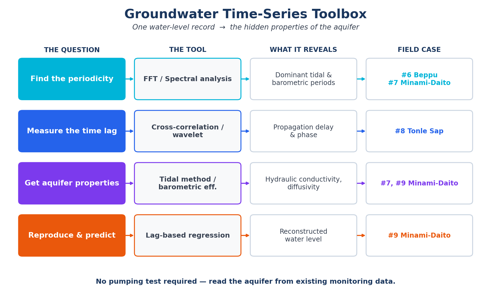

## はじめに：1本の折れ線に刻まれた"指紋"

観測井に記録される地下水位は、一見するとただの折れ線である。上がったり下がったりを繰り返すだけの、退屈なグラフに見えるかもしれない。

しかしこの4回——[#6](/posts/groundwater/groundwater-sci06/) から [#9](/posts/groundwater/groundwater-sci09/) まで——で見てきたのは、その折れ線に、**気圧・潮汐・降雨といった外の世界の"指紋"がびっしりと刻まれている**という事実であった。そして、その指紋を丁寧に読み解けば、地面を一切掘らずとも、目に見えない帯水層の性質——水の通しやすさ、圧力の伝わる速さ、記憶の長さ——を言い当てられる。

本記事は、この時系列解析シリーズの**総まとめ**である。個々の手法を復習するのではなく、**「どんな問いに、どの道具を使えばよいのか」**という判断の地図を描く。地下水位データを前にしたとき、次に何をすればよいかが分かる状態を目指す。

------------------------------------------------------------------------

## 4つの問い、4つの道具

時系列解析というと難しく聞こえるが、実務で問われることは、突き詰めれば4つしかない。**周期を見つけたいのか、時間差を測りたいのか、物性を知りたいのか、それとも将来を予測したいのか。** 問いが決まれば、道具は自ずと決まる。

{#fig-toolbox}

以下、4つの道具を、シリーズの実例とともに一つずつ振り返る。

------------------------------------------------------------------------

## 道具① 周期を見つける — FFT・スペクトル解析

**問い：この水位変動には、どんな周期が隠れているのか。**

最初の一歩は、いつでもここから始まる。ごちゃごちゃした波形を、**フーリエ変換（FFT）**で「周期の成分」に分解するのである。すると、目では見えなかった規則的なリズム——半日周期の海洋潮汐（M2 分潮、周期 12.42 時間）、1日周期の大気潮汐（S2）、季節変動——が、スペクトル上の鋭いピークとして姿を現す。

[#6](/posts/groundwater/groundwater-sci06/) では、別府南部の不圧地下水位に含まれる**気圧の周期成分**を取り出した。[#7](/posts/groundwater/groundwater-sci07/) では、南大東島の淡水レンズが**海洋潮汐に合わせて呼吸する**様子を、FFT で主要分潮に分けて確かめた。

> FFT は、すべての時系列解析の入口である。「まず何が効いているのか」を知らずに、先には進めない。

------------------------------------------------------------------------

## 道具② 時間差と位相を測る — 相互相関・クロスウェーブレット

**問い：ある信号は、別の場所へどれだけ遅れて伝わるのか。**

周期が分かったら、次に知りたくなるのは「ずれ」である。海の潮汐が内陸の井戸に届くまでの遅れ、上流の水位変化が下流に伝わるまでの時間——この**時間ラグ**を測るのが**相互相関**であり、その周期・位相が時間とともにどう変わるかまで追えるのが**クロスウェーブレット**である。

[#8](/posts/groundwater/groundwater-sci08/) では、カンボジア・トンレサップ湖の「逆流する川」を題材に、湖と河川の水位のあいだの位相の伝播を、相互相関とクロスウェーブレットで定量化した。

> ラグは、ただの遅れではない。それは信号が通り抜けた**媒質の性質**を映す鏡である。次の道具は、まさにここを突く。

------------------------------------------------------------------------

## 道具③ 応答から物性を引き出す — 潮汐法・気圧効果

**問い：この地層は、水をどれだけ通しやすいのか。**

ここが時系列解析の真骨頂である。潮汐や気圧という**天然の信号源**に地下水位がどう応答するか——その遅れと弱まり方——から、帯水層の物性を逆算する。

[#9](/posts/groundwater/groundwater-sci09/) では、南大東島の実データに **Ferris の潮汐法**を適用し、潮汐の時間ラグと振幅比から**透水係数** $K$ を、揚水試験を1本も行わずに求めた。同じ発想は気圧応答（バロメトリック効率）にも使え、被圧・不圧の判定や**水理拡散係数**の推定につながる。

> 「遠いのに弱まらない」——[#9](/posts/groundwater/groundwater-sci09/) の南大東島 MD3 井のこの一言が、透水性の高さをそのまま物語っていた。応答は物性を裏切らない。

------------------------------------------------------------------------

## 道具④ 再現し、予測する — ラグベース重回帰

**問い：外力から、地下水位そのものを再現できるか。**

最後は総合である。潮汐や気圧という入力に、複数の時間ラグをもたせて重ね合わせる**ラグベース重回帰**で、地下水位そのものを再構成する。[#9](/posts/groundwater/groundwater-sci09/) では、解析に使っていない後半の期間で **R² = 0.987**、地下水位を高い精度で再現できた。

ただし注意も学んだ。多重共線性のため、個々の回帰係数を物理的に解釈してはならない。**モデル全体を一つの線形フィルタとして扱う**——この節度こそが、データ解析を科学に留める境界線である。

------------------------------------------------------------------------

## 三つの現場を貫く、一つの物語

別府（気圧）、南大東島（潮汐）、トンレサップ（洪水パルス）——舞台も、外力も、まるで違う。しかし、使った道具は同じである。

| 現場 | 主な外力 | 使った道具 | 読み取れたこと |
|----------------|----------------|-----------------|------------------------|
| 別府（[#6](/posts/groundwater/groundwater-sci06/)） | 気圧 | FFT・スペクトル | 不圧地下水位に潜む周期成分 |
| 南大東島（[#7](/posts/groundwater/groundwater-sci07/)・[#9](/posts/groundwater/groundwater-sci09/)） | 海洋潮汐 | FFT → 相互相関 → 潮汐法 → 重回帰 | 淡水レンズの応答、透水係数、水位の再現 |
| トンレサップ（[#8](/posts/groundwater/groundwater-sci08/)） | 河川・湖の相互作用 | 相互相関・クロスウェーブレット | 水位伝播の時間差と位相 |

同じ4つの道具が、地域も現象も超えて通用する。これが、時系列解析という手法のもつ普遍性である。

------------------------------------------------------------------------

## なぜ、これがうれしいのか

時系列解析の最大の魅力は、**特別な追加調査を必要としない**ことにある。

揚水試験には、井戸と機材と、周辺への影響への配慮が要る。しかし地下水位の連続観測データは、多くの現場ですでに取られている。その**既存のデータを"読み直す"だけ**で、帯水層の透水性・記憶の長さ・境界の効き方までが見えてくる。眠っているモニタリング記録が、地層を診断するカルテに変わるのである。

------------------------------------------------------------------------

## おわりに：データから地下水を守る

もっとも、解析は目的ではない。目的は、**地下水を理解し、守ること**である。

別府の温泉と冷たい地下水のバランス、南大東島という孤島でわずかに浮かぶ淡水レンズ——いずれも、使いすぎれば失われる有限の資源である。時系列解析は、その変化をいち早く、定量的にとらえる「聴診器」となる。そして、そこで得られた数字を、専門家だけの言葉に閉じ込めず、地域の人々に届く形へと翻訳すること。それこそが、データを扱う者に残された、最後の、そして最も大切な仕事だと考えている。

------------------------------------------------------------------------

::: callout-note
## 次回予告 — #11 地下水質へ

ここまでは「水位」という物理の物語であった。次回からは、水の**中身**——化学へと踏み込む。なぜ地下水は、場所によって味も成分も違うのか。主要イオン、Piper 図、そして水質の分類。河川・地下水・海水を見比べながら、水質形成のメカニズムを、PHREEQC で計算しつつ読み解いていく。
:::

------------------------------------------------------------------------

## 参考文献

- Ferris, J.G. (1952) Cyclic fluctuations of water levels as a basis for determining aquifer transmissibility. *U.S. Geological Survey*, Water Resources Division. <https://doi.org/10.3133/70133368>
- Yang, H., Tawara, Y., Shimada, J., Kagabu, M., Okumura, A. (2021) Large-scale hydraulic conductivity distribution in an unconfined carbonate aquifer using the ocean tidal propagation. *Hydrogeology Journal*, 29, 2091–2105. <https://doi.org/10.1007/s10040-021-02366-4>
- Yang, H., Shimada, J., Shibata, T., Okumura, A., Pinti, D.L. (2020) Freshwater lens oscillation induced by sea tides and variable rainfall at the uplifted atoll island of Minami-Daito, Japan. *Hydrogeology Journal*, 28, 2105–2114. <https://doi.org/10.1007/s10040-020-02185-z>
- Yang, H., Siev, S., Uk, S., Yoshimura, C. (2022) Relationship between water levels and flood pulse induced by river–lake interaction in the Tonle Sap basin, Cambodia. *Environmental Earth Sciences*, 81, 226. <https://doi.org/10.1007/s12665-022-10353-5>
- Larocque, M., Mangin, A., Razack, M., Banton, O. (1998) Contribution of correlation and spectral analyses to the regional study of a large karst aquifer (Charente, France). *Journal of Hydrology*, 205, 217–231.