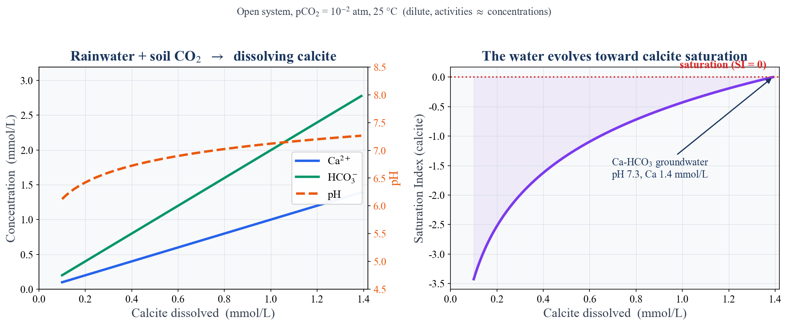
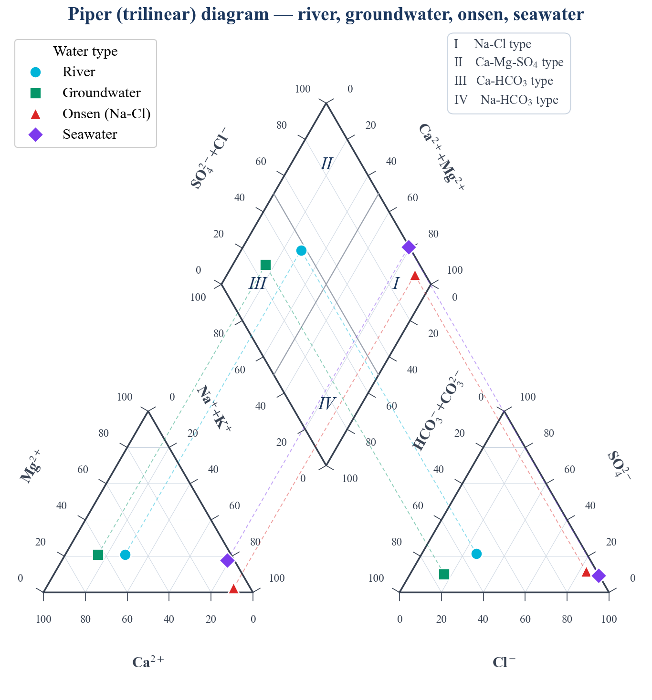

## はじめに：水は、地中を旅して"味"を得る

[#10](/posts/groundwater/groundwater-sci10/) までは「水位」という物理の物語であった。ここからは、水の**中身**——化学へと踏み込む。

湧き水はやわらかく、温泉はしょっぱく、あるいは金属臭がする。同じ「水」なのに、なぜこれほど違うのか。答えは、驚くほどシンプルである。**水は、地中を通る途中で出会った岩石や気体を、少しずつ溶かし込みながら旅をする**からである。雨として降った直後はほとんど何も含まない水が、土壌の二酸化炭素を吸い、鉱物を溶かし、時に古い海水と混じり合う。その履歴が、水の「味」——すなわち水質——として刻まれる。

本記事では、地下水の水質を決める**主要イオン**を確認し、水質を生み出す**4つのメカニズム**を整理する。そして、その中でも最も普遍的な「方解石の溶解」を、地球化学計算ソフト **PHREEQC** で実際に計算しながら追う。最後に、河川・地下水・海水・温泉を **Piper ダイアグラム**で見比べる。

------------------------------------------------------------------------

## 主要イオンという"アルファベット"

天然水の化学組成は、たった8つの主要成分——陽イオン4種（Na⁺・K⁺・Ca²⁺・Mg²⁺）と陰イオン4種（Cl⁻・SO₄²⁻・HCO₃⁻・NO₃⁻）——でほぼ記述できる。この8成分が、水質という言語の「アルファベット」である。

それぞれの起源と意味、そして水質を一枚の図で表す**ヘキサダイアグラム（Stiff 図）**の描き方は、フィールドノートの記事で詳しく解説している。本記事では深入りしないので、主要イオンの基礎はそちらを参照されたい。

なお、冒頭の「金属臭」は、この8成分だけでは説明できない。還元的な地下水には**鉄（Fe²⁺）**が溶け込むことがあり、汲み上げて空気に触れると酸化して赤褐色の水酸化鉄へと姿を変える。これが金属臭や、蛇口・洗濯物につく赤い染みの正体である。こうした微量成分の挙動は、イオンの多寡よりも**酸化還元（レドックス）**に支配される——本シリーズの水質編で改めて扱う主題である。

::: callout-tip
## あわせて読みたい

[ヘキサダイアグラム (Stiff diagram) で読む水質 — 主要8成分の意味と水道水・河川水・地下水・海水の比較](/posts/note/onsen-part2/)
:::

------------------------------------------------------------------------

## なぜ場所で違うのか — 水質形成の4メカニズム

地下水の水質を生み出す反応は、突き詰めると次の4つに整理できる。

1.  **溶解（風化）** — CO₂ を含む水が鉱物を溶かす。地下水質を作る最も基本的な反応。石灰岩の溶解（→ Ca-HCO₃ 型）、長石の風化（→ Na・K の供給）などがこれにあたる。
2.  **陽イオン交換** — 粘土鉱物の表面で、水中の Ca²⁺ と鉱物側の Na⁺ が入れ替わる。海水が浸入した帯水層が淡水化する過程などで効き、Na-HCO₃ 型の水を生む。
3.  **蒸発濃縮** — 乾燥地や滞留時間の長い水では、蒸発によってイオンが濃縮され、やがて塩類が析出する。
4.  **混合** — 淡水と深部熱水、あるいは淡水と海水が混じり合う。[#7](/posts/groundwater/groundwater-sci07/) の淡水レンズや、沿岸・温泉地帯で普遍的に起きる。

このうち **①溶解**は、ほぼすべての地下水が最初に通る道である。次節では、その典型——雨水が方解石（CaCO₃）を溶かして **Ca-HCO₃ 型**の地下水になる過程——を、PHREEQC で計算しながら見てみよう。

------------------------------------------------------------------------

## PHREEQC で水質形成を計算する — 方解石溶解

### 設定

土に染み込む直前の雨水は、ほとんど純水に近い。しかし土壌中は、根や微生物の呼吸によって大気の数十倍もの **CO₂** に満ちている。雨水はこの CO₂ を吸って弱い炭酸となり、酸として石灰岩（方解石）を溶かしはじめる。反応式は次の一本にまとめられる。

$$\mathrm{CaCO_3 + CO_2 + H_2O \;\rightleftharpoons\; Ca^{2+} + 2HCO_3^-}$$

土壌 CO₂ が絶えず供給される「**開放系**」を仮定し、二酸化炭素分圧を $p\mathrm{CO_2}=10^{-2}\,\mathrm{atm}$ に固定して、方解石が飽和に達するまで溶ける過程を計算する。PHREEQC の入力はごく短い。

``` phreeqc
SOLUTION 1  Rainwater
    temp      25
    units     mmol/kgw
    pH        5.6          # CO2を吸った雨水
    -water    1 # kg

EQUILIBRIUM_PHASES 1
    CO2(g)    -2.0         # 土壌CO2分圧を固定（開放系, pCO2 = 10^-2 atm）
    Calcite   0.0   10     # 方解石と平衡（十分量を用意）

SELECTED_OUTPUT
    -pH     true
    -totals    Ca  C(4)
    -si     Calcite
END
```

`EQUILIBRIUM_PHASES` で **CO₂ 分圧を固定**しつつ **Calcite と平衡**をとらせる——これが開放系・方解石飽和の計算である。

### 結果：Ca-HCO₃ 型への進化

計算結果を @fig-calcite に示す。横軸は溶けた方解石の量（＝溶け込んだ Ca²⁺）である。

{#fig-calcite}

読み取れることは3つある。

- **Ca²⁺ : HCO₃⁻ ＝ 1 : 2** で増えていく。これは上の反応式の化学量論そのものである。
- **pH が上がる**。酸（CO₂）が消費され、アルカリ度（HCO₃⁻）が蓄積するためだ。
- **飽和指数 SI が 0 に近づいて溶解が止まる**。ここで水は方解石と平衡に達し、典型的な **Ca-HCO₃ 型地下水**（pH ≈ 7.3、Ca ≈ 1.4 mmol/L ≒ 56 mg/L）が完成する。

::: callout-note
## 値は $p\mathrm{CO_2}$ で変わる — PHREEQCシリーズとの接続

飽和時の Ca 濃度は $p\mathrm{CO_2}$ に強く依存し、およそ $p\mathrm{CO_2}^{1/3}$ で増える。土壌 CO₂ が高い（$p\mathrm{CO_2}=10^{-1.5}\sim10^{-1}$ atm）現場では、Ca は 2〜4 mmol/L に達する。[PHREEQC をゼロから始める #5](/posts/phreeqc/phreeqc-part5/) では、より高い CO₂ 条件で「Ca ≈ 3〜4 mmol/kg・Calcite SI ≈ 0」の炭酸地下水を定義しており、本記事の計算と地続きである。PHREEQC の使い方そのものは [PHREEQC シリーズ](/blog.html) で基礎から解説している。
:::

> なお本計算は活量係数を 1 とした希薄近似である。海水のようにイオン強度が高い水では、PHREEQC が Debye–Hückel 型の活量補正を自動で行う。定量計算では PHREEQC に任せるのが正解である。

------------------------------------------------------------------------

## 実データで確かめる — 論文から

### 熊本のフッ素濃集：溶解が水質を作る

溶解が水質を支配する好例が、熊本地域西部の地下水である。**Hossain et al. (2016)** は、この地域の地下水で局所的に **フッ素（F⁻）が濃集**する仕組みを地球化学的に解析した。火山岩由来の鉱物の溶解と、地下水の滞留・pH 条件が重なることで、飲料水基準を超えるフッ素が生じうる。「どの鉱物が、どの条件で溶けるか」が、水質——時に水質問題——を決めるのである。

### 別府温泉の泉質分類：多変量解析という視点

水質形成が「混合」で決まる典型が温泉である。**梁 (2021)** は、別府温泉の多数の源泉について主要成分を測定し、**多変量解析（クラスター分析・主成分分析）**によって泉質を分類し、その鉛直分布を明らかにした。深部の Na-Cl 型熱水と浅層の Ca-HCO₃ 型地下水が、さまざまな比率で混合して各源泉の個性を作る——という描像である。ヘキサダイアグラムからは、ある源泉が海水混合率 12% と推定された。

> 主要イオンを「読む」だけでなく、多変量解析で「分類する」。これは水質データを時系列解析と同じ目線——[#8](/posts/groundwater/groundwater-sci08/) 以降で扱った統計的手法——で扱うということでもある。

------------------------------------------------------------------------

## Piper ダイアグラムで全体を俯瞰する

最後に、性質の異なる4種類の水——河川水・地下水・温泉・海水——を **Piper（トリリニア）ダイアグラム**で一望する（@fig-piper）。左下が陽イオン、右下が陰イオンの三角ダイアグラムで、それぞれの相対割合（当量%）をプロットする。そして上部のひし形は、**2つの三角の点を投影して交わらせた**もので、水質タイプを一目で判定できる。

{#fig-piper}

- ひし形は水質タイプで4区分される（**I: Na-Cl 型／II: Ca-Mg-SO₄ 型／III: Ca-HCO₃ 型／IV: Na-HCO₃ 型**）。
- **地下水・河川水**は左の **III（Ca-HCO₃ 型）**に落ちる。前節で計算した「方解石溶解」の産物そのものである。
- **温泉・海水**は右の **I（Na-Cl 型）**に落ちる。深部熱水や海水混合が支配する水質である。

一枚の図の上で、水質形成メカニズムの違いが、そのまま点の位置の違いとして表れる。これが Piper ダイアグラムの力である。

------------------------------------------------------------------------

## まとめ

- 地下水の水質は、**溶解・陽イオン交換・蒸発濃縮・混合**という4つのメカニズムの履歴として理解できる。
- 最も基本的な**方解石の溶解**は、PHREEQC で定量的に追える。雨水は CO₂ を吸って方解石を溶かし、Ca : HCO₃ ＝ 1 : 2 で **Ca-HCO₃ 型**へ進化して飽和で止まる。
- **Piper ダイアグラム**は、水質タイプと形成過程を一望する強力な道具であり、ひし形の点は2つの三角ダイアグラムの投影の交点として得られる。

::: callout-note
## 次回予告 — #12 論文を PHREEQC で再現する

本記事で触れた **Hossain et al. (2016)** の「熊本のフッ素濃集」を題材に、次回はこの論文を読み解き、その水質形成過程を **PHREEQC で再現**してみる。公開データと地球化学モデリングで、実際の地下水質をどこまで説明できるかを試す。
:::

------------------------------------------------------------------------

## 参考文献

- Appelo, C.A.J. & Postma, D. (2005) *Geochemistry, Groundwater and Pollution*, 2nd ed. Balkema.
- Parkhurst, D.L. & Appelo, C.A.J. (2013) Description of input and examples for PHREEQC version 3. *U.S. Geological Survey Techniques and Methods*, book 6, chap. A43.
- Hossain, S., Hosono, T., Yang, H., Shimada, J. (2016) Geochemical Processes Controlling Fluoride Enrichment in Groundwater at the Western Part of Kumamoto Area, Japan. *Water, Air, & Soil Pollution*, 227(10), 385.
- 梁 熙俊 (2021) 水文化学的手法と多変量解析による別府温泉の泉質の分類および鉛直分布特性. *地下水学会誌*, 63(3), 137–149.
- Yang, H., Mishima, T., Katazakai, S., Kagabu, M. (2023) Analytical approach using a chemical equilibrium formula and geochemical modeling for alkalinity measurements of small natural water samples. *Applied Geochemistry*, 148, 105535.