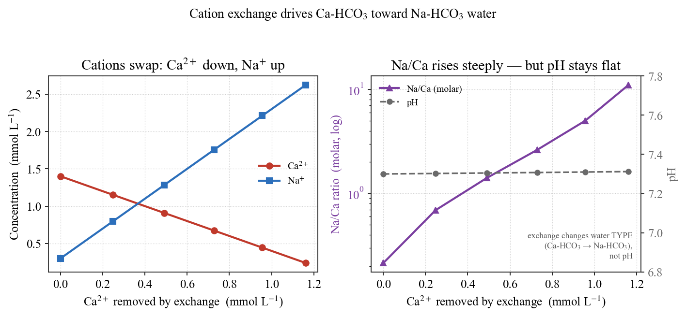

## Introduction: tap water has a limit for a reason

Drinking water carries **quality standards** that define what is safe to drink. Fluoride (F⁻) is one of them: Japan's limit is **0.8 mg/L** (the WHO guideline is 1.5 mg/L). A little fluoride prevents tooth decay, but chronic excess causes dental and skeletal fluorosis.

What is a little surprising is that **this fluoride can exceed the limit *naturally* — not from industrial pollution.** Groundwater in the western part of the Kumamoto area is one example: inside a volcanic aquifer, the water itself concentrates fluoride as it reacts with rock.

Following **Hossain et al. (2016)**, this article reads "why fluoride builds up in natural groundwater" in the language of geochemistry, and reproduces the key reactions in **PHREEQC**. It is the second chapter of a story begun in [#11](/posts/groundwater/groundwater-sci11/index-en.html), where rainwater dissolved calcite into a Ca-HCO₃ recharge water. What happens next, as that water travels on?

::: callout-important
## A note on terms: inorganic F⁻ is not PFAS

This article is about the **inorganic fluoride ion F⁻**. It is chemically distinct from **PFAS (per- and polyfluoroalkyl substances)**, which have entirely different sources and behavior. PFAS deserves — and will get — its own separate article.
:::

------------------------------------------------------------------------

## Continuing from #11: as Ca-HCO₃ recharge water travels on

In [#11](/posts/groundwater/groundwater-sci11/index-en.html), rainwater took up soil CO₂, became a weak acid, and dissolved minerals into a **Ca-HCO₃** groundwater — the "entry water" that almost all groundwater passes through first.

Kumamoto's aquifer is a volcanic one, built mainly of Aso pyroclastic-flow deposits: highly permeable, with active flow. The Ca-HCO₃ water born in the recharge zone undergoes **two more major changes** as it flows down-gradient:

1.  **Cation exchange** on clay minerals gradually replaces Ca with Na.
2.  **Silicate weathering** of volcanic minerals raises pH and HCO₃⁻.

Where these two overlap, a setting forms in which fluoride becomes mobile. Let us take them in turn.

Hossain et al. (2016) analyzed **50 groundwater samples** here. Fluoride ranged from **0.1 to 1.57 mg/L**, and **58% of the first (shallow) aquifer** and **26% of the second (deep) aquifer** exceeded the 0.8 mg/L limit. The high-fluoride waters shared a clear signature — **Na-HCO₃ type, high pH (7.05–9.45), high HCO₃, low Ca, high Na/Ca** — and clustered in **long-residence stagnant zones** (groundwater age over 55 years).

------------------------------------------------------------------------

## Process ① — cation exchange toward Na-HCO₃ water

At the heart of the high-fluoride signature is **low Ca, high Na (a high Na/Ca ratio)**, and this is produced by **cation exchange**.

Clay-mineral surfaces are negatively charged and loosely hold cations. When Ca-HCO₃ groundwater contacts them, **Ca²⁺ in the water is captured by the clay and Na⁺ is released** in its place.

$$\mathrm{Ca^{2+} + 2Na\text{-}X \;\rightarrow\; Ca\text{-}X_2 + 2Na^{+}}$$

(X is an exchange site.) The water loses Ca and gains Na, shifting from **Ca-HCO₃ to Na-HCO₃ type**. Hossain et al. (2016) found the **Na/Ca ratio rising from 0.4 to 27** along this path; Schoeller's **chloro-alkaline indices (CAI)** confirm the exchange.

### Following it in PHREEQC

Starting from the Ca-HCO₃ recharge water of [#11](/posts/groundwater/groundwater-sci11/index-en.html), we react it with a Na-form exchanger (clay) and vary the exchanger amount to advance the reaction.

``` phreeqc
SOLUTION 1  Recharge Ca-HCO3 water (≈ #11 calcite-equilibrium water)
    temp        20
    pH          7.3
    units       mmol/kgw
    Ca          1.4
    Alkalinity  2.8   as HCO3
    Na          0.3
    Cl          0.3
    F           0.02
END

USE solution 1
EXCHANGE 1
    NaX  0.0010     # pure Na-exchanger; vary 0.0005–0.0025 mol to advance reaction
END
```

The result is @fig-exchange. The horizontal axis is the amount of Ca²⁺ removed by exchange (i.e., the reaction progress).

{#fig-exchange}

Two things stand out.

- **Na/Ca rises from 0.2 to 11** — Ca-HCO₃ turning into Na-HCO₃ (the same behavior as the paper's 0.4 → 27; more exchanger reaches 27).
- **pH stays nearly constant (≈ 7.3).** This matters: **pure cation exchange changes the water's *type* but does not raise pH.** So where does the high pH of high-fluoride water (7–9.4) come from? From the next lead actor — silicate weathering.

> In other words, **even with the same fluoride source, the more exchange proceeds in stagnant zones, the higher Na/Ca climbs and the lower Ca falls.** The very setting that lets fluoride move is prepared on the water's side.

------------------------------------------------------------------------

## Process ② — high pH and high HCO₃ mobilize fluoride

Alongside the Na-HCO₃ shift, weathering of volcanic silicates (plagioclase, pyroxene, biotite, …) proceeds. This consumes hydroxide, **raising pH and supplying HCO₃⁻**. The resulting **high-pH, high-HCO₃, low-Ca** environment moves fluoride by three routes.

**(1) Release from mica** (F–OH exchange). Sheet silicates like biotite hold fluoride at OH sites in their structure. At high pH (high OH⁻), this F swaps out with OH into the water.

$$\mathrm{Mica\text{-}F_2 + 2OH^- \;\rightarrow\; Mica\text{-}(OH)_2 + 2F^-}$$

**(2) Dissolution of apatite.** Fluorapatite Ca₅(PO₄)₃F dissolves in CO₂-bearing water, releasing fluoride and phosphate.

$$\mathrm{Ca_5(PO_4)_3F + 6CO_2 + 6H_2O \;\rightarrow\; 5Ca^{2+} + 3H_2PO_4^- + F^- + 6HCO_3^-}$$

**(3) Desorption from metal oxides.** Fluoride adsorbed on Fe/Al oxide–hydroxide surfaces is pushed off as **high pH lowers the surface positive charge**, **high HCO₃ and PO₄ compete for sites**, and **high Na/Ca lowers the surface charge density**.

> Common to all three: **the very properties of "Na-HCO₃-shifted" water — low Ca, high pH, high HCO₃ — are the key that mobilizes fluoride.** Process ① sets the stage for process ②.

::: callout-note
## An honest limit: desorption stays conceptual

Route (3) is described only qualitatively even in Hossain et al. (2016). PHREEQC's `SURFACE` (Dzombak–Morel model) can demonstrate the principle, but site-specific parameters (specific surface area, site density) are unavailable — so here we present the concept, without numerical claims.
:::

------------------------------------------------------------------------

## The mineral brake — does fluorite hold fluoride back?

If fluoride only ever increased, water would become endlessly high in fluoride. In reality there is a ceiling, and the "brake" is **fluorite CaF₂**.

$$\mathrm{Ca^{2+} + 2F^- \;\rightleftharpoons\; CaF_2\ (\text{fluorite})}$$

If the water is **supersaturated** with fluorite, fluorite precipitates and fluoride is capped. If **undersaturated**, fluorite only dissolves and sets no ceiling. Here **low Ca** is decisive: with Ca lowered by the Na-HCO₃ shift, the product Ca × F² is small, fluorite stays undersaturated — **the brake never engages, and fluoride is allowed to reach high levels.**

### Checking saturation indices against the paper

We put the **Table 1** aquifer-average compositions into PHREEQC (WATEQ4F database) and compute saturation indices (SI) and fluoride speciation to compare with the reported values.

``` phreeqc
SOLUTION 1  Kumamoto 1st (shallow) aquifer average — Hossain et al. 2016, Table 1
    temp   19.4;  pH   7.83;  pe   0.6
    units  mg/L
    Na 95.1; K 5.8; Ca 12.4; Mg 3.9; Cl 101.2
    S(6) 19.1 as SO4;  N(5) 4.8 as NO3;  Alkalinity 157.7 as HCO3
    F 0.83;  P 7.0 as PO4;  Si 48.6 as SiO2

SELECTED_OUTPUT
    -saturation_indices  Calcite  Fluorite  Fluorapatite
    -molalities          F-  MgF+  CaF+  NaF
END
```

The result is @fig-si.

{#fig-si}

| Mineral | PHREEQC (this study) | Paper | Meaning |
|-------------------|:----------------:|:----------------:|-------------------|
| Calcite CaCO₃ | −0.42 | −0.69 / −0.57 | near equilibrium (legacy of #11) |
| **Fluorite CaF₂** | **−1.81 / −2.01** | **−2.19 / −2.26** | **undersaturated = does not cap fluoride** |
| Fluorapatite | +4.82 | +2.42 / +1.77 | supersaturated = viable source |

(first aquifer / second aquifer; calcite nearly identical)

**Calcite and fluorite are undersaturated and match the paper well**, reproducing the conclusion that fluorite (undersaturated) does not cap fluoride. Fluoride speciation is **98–99% F⁻**, matching the paper's "96–100%." Fluorapatite is supersaturated in both (sign agrees), though our magnitude is larger — because the **log K for fluorapatite differs substantially between database versions**. The conclusion ("supersaturated, a viable source") is unchanged.

### When does fluorite actually brake?

Under what conditions does fluorite really cap fluoride? We test it by adding Ca step by step to a low-Ca Na-HCO₃ water.

{#fig-fluorite}

@fig-fluorite makes the point plainly. **In the low-Ca range where real high-fluoride waters live, fluorite is at SI ≈ −1.5** and puts no brake on fluoride at all. For fluorite to saturate and begin capping fluoride, **Ca must climb toward 12 mmol/L (≈ 480 mg/L)** — but Na-HCO₃-shifted water never gets there. So fluoride keeps accumulating.

$$\mathrm{CaF_2 + 2HCO_3^- \;\rightarrow\; CaCO_3 + 2F^- + H_2O + CO_2}$$

High HCO₃ in fact pushes the other way, favoring fluorite dissolution (fluoride release).

------------------------------------------------------------------------

## Why it clusters in stagnant zones

Every reaction above **takes time.** Cation exchange, silicate weathering, fluoride mobilization — all proceed the longer groundwater is in contact with rock. So high-fluoride water clusters not in fast recharge zones but in **stagnant zones** — the deep, sluggish areas of the plain, over 55 years old.

This is an extreme, concrete case of the principle from #11: water writes its history into its chemistry. **Fluoride concentration is, in a sense, a record of how long the groundwater has travelled.** This link between "time" and water quality is explored further in later articles (isotopes, residence time).

------------------------------------------------------------------------

## Summary

- In parts of Kumamoto, fluoride exceeds the drinking-water limit through **natural water–rock reaction**, not human pollution.
- The key is two-staged: **① cation exchange** turns Ca-HCO₃ into **low-Ca Na-HCO₃** water (without raising pH), and **② silicate weathering** creates high pH and high HCO₃ that **mobilize fluoride** from mica, apatite, and metal oxides.
- Because Ca is low, **fluorite stays undersaturated** and never brakes fluoride.
- Since these reactions take time, high-fluoride water **clusters in long-residence stagnant zones.**
- And the whole sequence can be **followed quantitatively in PHREEQC** — SI comparison, the exchange path, and the fluorite control.

Even naturally, limits can be exceeded — but not chaotically. It is a necessity we can read with **data and geochemistry.**

::: callout-note
## Next — #13 Redox and groundwater quality: arsenic, iron, nitrate

Starting from the "metallic (iron) smell" mentioned in [#11](/posts/groundwater/groundwater-sci11/index-en.html), the next article enters the world where **redox (oxidation–reduction)** governs groundwater chemistry. In the same Kumamoto area, **Hossain et al. (2016, Environmental Earth Sciences)** revealed arsenic mobilization — occurring, in fact, on a stage much like #12's fluoride: **high pH, reducing, stagnant.**
:::

------------------------------------------------------------------------

## References

- Hossain, S., Hosono, T., Yang, H., Shimada, J. (2016) Geochemical Processes Controlling Fluoride Enrichment in Groundwater at the Western Part of Kumamoto Area, Japan. *Water, Air, & Soil Pollution*, 227(10), 385.
- Parkhurst, D.L. & Appelo, C.A.J. (2013) Description of input and examples for PHREEQC version 3. *U.S. Geological Survey Techniques and Methods*, book 6, chap. A43.
- Appelo, C.A.J. & Postma, D. (2005) *Geochemistry, Groundwater and Pollution*, 2nd ed. Balkema.
- Schoeller, H. (1967) Qualitative evaluation of groundwater resources. In *Methods and Techniques of Groundwater Investigation and Development*, UNESCO.
- Edmunds, W.M. & Smedley, P.L. (2013) Fluoride in natural waters. In *Essentials of Medical Geology*.