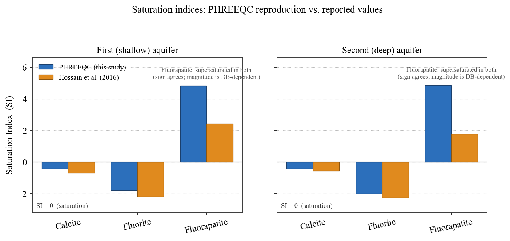
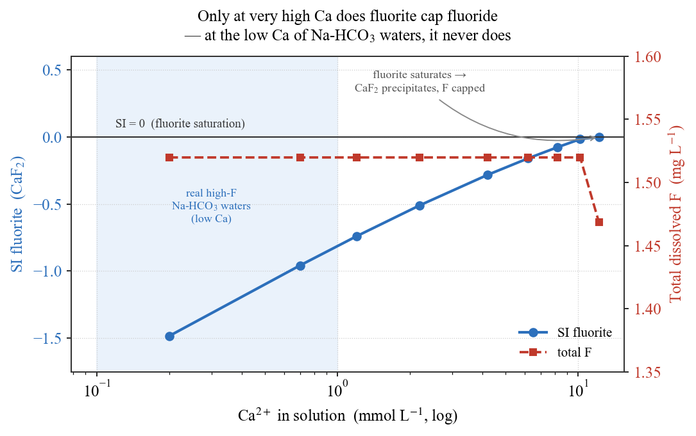

## はじめに：蛇口の水に「基準値」がある

水道水には、飲んで安全な範囲を定めた**水質基準**がある。フッ化物イオン（F⁻）もそのひとつで、日本の飲料水基準は **0.8 mg/L**（WHO ガイドライン 1.5 mg/L）である。適量のフッ素は虫歯を防ぐが、過剰に摂り続けると斑状歯や骨フッ素症の原因となりうる。

ここで少し意外なのは、**このフッ素が、工場排水のような人為汚染ではなく "天然に" 基準を超えることがある**という事実である。熊本地域西部の地下水はその一例で、火山岩からなる帯水層の中で、地下水自身が岩石と反応するうちにフッ素を濃集させてしまう。

本記事では、**Hossain et al. (2016)** の研究に沿って「なぜ天然の地下水でフッ素が増えるのか」を地球化学の言葉で読み解き、その要となる反応を **PHREEQC** で再現する。[#11](/posts/groundwater/groundwater-sci11/) で計算した「雨水が方解石を溶かして Ca-HCO₃ 型になる」涵養水が、旅の続きで何を経験するのか——その物語の第2章である。

::: callout-important
## 用語の整理：無機フッ素 F⁻ と PFAS は別物

本記事で扱うのは**無機のフッ化物イオン F⁻** である。近年話題の **PFAS（有機フッ素化合物）とは化学的にまったく別物**であり、発生源も挙動も異なる。PFAS は別の機会に単独で扱う。
:::

------------------------------------------------------------------------

## #11 からの続き：Ca-HCO₃ 涵養水が旅を続けると

[#11](/posts/groundwater/groundwater-sci11/) では、雨水が土壌の CO₂ を吸って弱い酸となり、鉱物を溶かして **Ca-HCO₃ 型**の地下水へ育つ過程を PHREEQC で追った。これは地下水が最初に通る「入口の水」である。

熊本の帯水層は、阿蘇の火砕流堆積物（Aso pyroclastic flow）を主体とする火山性の地層で、透水性が高く地下水が活発に流れる。涵養域で生まれた Ca-HCO₃ 型の水は、流線に沿って流れ下るあいだに、**さらに二つの大きな変化**を経験する。

1.  粘土鉱物との**陽イオン交換**で、Ca が Na に置き換わっていく。
2.  火山岩の**ケイ酸塩鉱物の風化**が進み、pH と HCO₃⁻ が上がっていく。

この二つが重なった先で、フッ素が動きやすい「場」ができあがる。順番に見ていこう。

Hossain et al. (2016) は、この地域の **50 試料**の地下水を分析した。フッ素濃度は **0.1–1.57 mg/L** に分布し、浅い**第1帯水層では 58%**、深い**第2帯水層でも 26%** の試料が基準 0.8 mg/L を超えていた。そして高フッ素の水には、はっきりした共通の"顔つき"があった——**Na-HCO₃ 型・高pH（7.05–9.45）・高HCO₃・低Ca・高いNa/Ca比**である。しかもそれらは、**滞留時間が長い停滞域**（地下水年齢 55 年以上）に集中していた。

------------------------------------------------------------------------

## 主役プロセス① — 陽イオン交換で Na-HCO₃ 型へ

高フッ素水の"顔つき"の中心が、**低Ca・高Na（高いNa/Ca比）**である。これを作るのが**陽イオン交換**である。

粘土鉱物の表面は負に帯電しており、陽イオンを緩く吸着している。ここに Ca-HCO₃ 型の地下水が触れると、**水中の Ca²⁺ が粘土に捕まり、代わりに粘土表面の Na⁺ が水へ放たれる**。

$$\mathrm{Ca^{2+} + 2Na\text{-}X \;\rightarrow\; Ca\text{-}X_2 + 2Na^{+}}$$

（X は交換サイト）。この結果、水は Ca を失い Na を得て、**Ca-HCO₃ 型 → Na-HCO₃ 型**へと変化する。Hossain et al. (2016) では、この進行に伴って **Na/Ca 比が 0.4 から 27 まで**上昇していた。Schoeller の**塩基交換指数（CAI）**も、交換が起きていることを裏づけている。

### PHREEQC で追う

[#11](/posts/groundwater/groundwater-sci11/) で作った Ca-HCO₃ 涵養水を出発点に、Na 型の交換体（粘土）と反応させる。交換体の量を振ると、反応がどこまで進むかを段階的に見られる。

``` phreeqc
SOLUTION 1  Recharge Ca-HCO3 water (≈ #11 calcite-equilibrium water)
    temp        20
    pH          7.3
    units       mmol/kgw
    Ca          1.4
    Alkalinity  2.8   as HCO3
    Na          0.3
    Cl          0.3
    F           0.02
END

USE solution 1
EXCHANGE 1
    NaX  0.0010     # 純 Na 交換体。量を 0.0005〜0.0025 mol と振り、進行度を出す
END
```

計算結果を @fig-exchange に示す。横軸は交換で除去された Ca²⁺ の量（＝反応の進行度）である。

{#fig-exchange}

読み取れることは二つある。

- **Na/Ca 比が 0.2 から 11 へ上昇**する。Ca-HCO₃ 型が Na-HCO₃ 型へ変わっていく（論文の 0.4→27 と同じ挙動で、交換体をさらに増やせば 27 にも届く）。
- **pH はほぼ一定（≈ 7.3）**。これは重要な点である。**純粋な陽イオン交換は水の"型"を変えるが、pH は上げない**。では高フッ素水の高pH（7〜9.4）はどこから来るのか——それが次の主役、ケイ酸塩の風化である。

> つまり、**フッ素の供給源が同じでも、停滞域で交換が進むほど Na/Ca が上がり、Ca が下がる**。フッ素が動きやすい場そのものが、水の側で準備されていく。

------------------------------------------------------------------------

## 主役プロセス② — 高pH・高HCO₃ がフッ素を「動員」する

Na-HCO₃ 化と並行して、火山岩のケイ酸塩鉱物（斜長石・輝石・黒雲母など）の風化が進む。この反応は水酸化物イオンを消費し、**pH を押し上げ、HCO₃⁻ を供給する**。こうして生まれた**高pH・高HCO₃・低Ca**の環境が、フッ素を三つの経路で動かす。

**(1) 雲母からのフッ素放出**（F–OH 交換）。黒雲母などの層状ケイ酸塩は、結晶構造中の OH の位置にフッ素を含む。高pH（高 OH⁻）環境では、この F が OH と入れ替わって水へ放たれる。

$$\mathrm{Mica\text{-}F_2 + 2OH^- \;\rightarrow\; Mica\text{-}(OH)_2 + 2F^-}$$

**(2) 燐灰石（アパタイト）の溶解**。フッ素燐灰石 Ca₅(PO₄)₃F は、CO₂ を含む水に溶けてフッ素とリン酸を放つ。

$$\mathrm{Ca_5(PO_4)_3F + 6CO_2 + 6H_2O \;\rightarrow\; 5Ca^{2+} + 3H_2PO_4^- + F^- + 6HCO_3^-}$$

**(3) 金属酸化物からのフッ素の脱着**。Fe/Al の酸化物・水酸化物の表面に吸着していた F⁻ が、**高pH で表面の正電荷が減る**こと、**高HCO₃・高PO₄ が競合陰イオンとして席を奪う**こと、**高Na/Ca が表面の電荷密度を下げる**ことで、まとめて水へ押し出される。

> 三つに共通するのは、**低Ca・高pH・高HCO₃ という "Na-HCO₃ 化した水" の性質そのものが、フッ素を動かす鍵**だということである。つまり **①の陽イオン交換が、②のフッ素動員の舞台を整えている**。

::: callout-note
## 正直な限界：脱着（表面錯体）は「概念」にとどめる

上の (3) の脱着は、Hossain et al. (2016) でも定性的な説明にとどまる。PHREEQC の `SURFACE`（Dzombak–Morel モデル）で原理を実演することは可能だが、比表面積やサイト密度といった現場固有のパラメータが無いため、本記事では**数値的な主張はせず、考え方の紹介にとどめる**。
:::

------------------------------------------------------------------------

## 鉱物のブレーキ — 蛍石は効くのか？

フッ素がいくらでも増えるなら、水はどこまでも高フッ素になるはずである。しかし現実には頭打ちがある。その"ブレーキ"を握るのが**蛍石（ホタル石）CaF₂** である。

$$\mathrm{Ca^{2+} + 2F^- \;\rightleftharpoons\; CaF_2\ (\text{蛍石})}$$

もし水が蛍石に対して**過飽和**なら、蛍石が析出してフッ素は頭打ちになる。逆に**未飽和**なら、蛍石は溶けるだけで、フッ素の上限を決めない。ここで効いてくるのが**低Ca**である。Na-HCO₃ 化で Ca が下がっているため、Ca × F² の積が小さく、蛍石は未飽和のまま——つまり**ブレーキが利かず、フッ素が高濃度まで許される**。

### 飽和指数を PHREEQC で照合する

論文の **Table 1** の帯水層平均組成を PHREEQC（WATEQ4F データベース）に入れ、飽和指数（SI）とフッ素の化学種を計算して、論文の公表値と照合する。

``` phreeqc
SOLUTION 1  Kumamoto 1st (shallow) aquifer average — Hossain et al. 2016, Table 1
    temp   19.4;  pH   7.83;  pe   0.6
    units  mg/L
    Na 95.1; K 5.8; Ca 12.4; Mg 3.9; Cl 101.2
    S(6) 19.1 as SO4;  N(5) 4.8 as NO3;  Alkalinity 157.7 as HCO3
    F 0.83;  P 7.0 as PO4;  Si 48.6 as SiO2

SELECTED_OUTPUT
    -saturation_indices  Calcite  Fluorite  Fluorapatite
    -molalities          F-  MgF+  CaF+  NaF
END
```

結果を @fig-si に示す。

{#fig-si}

| 鉱物 | PHREEQC（今回） | 論文 | 意味 |
|-------------------|:----------------:|:----------------:|-------------------|
| 方解石 CaCO₃ | −0.42 | −0.69 / −0.57 | ほぼ平衡近傍（#11 の名残） |
| **蛍石 CaF₂** | **−1.81 / −2.01** | **−2.19 / −2.26** | **未飽和＝フッ素を頭打ちにしない** |
| フッ素燐灰石 | +4.82 | +2.42 / +1.77 | 過飽和＝供給源として矛盾しない |

（第1帯水層／第2帯水層の順。方解石はほぼ同値）

**方解石・蛍石は未飽和で論文とよく一致**し、蛍石が未飽和＝ブレーキが利かない、という結論を再現できた。フッ素の化学種は **F⁻ が全フッ素の 98〜99%** を占め、論文の「96–100%」と一致する。フッ素燐灰石は両者とも過飽和で符号は一致するが、絶対値は今回のほうが大きい——これは**フッ素燐灰石の log K がデータベースの版で大きく異なる**ためで、「過飽和である（供給源になりうる）」という結論は変わらない。

### 蛍石はいつブレーキになるのか

では、蛍石が実際にフッ素を頭打ちにするのはどんな条件か。Na-HCO₃ 化した低Ca の水に、Ca を少しずつ加えていく計算で確かめる。

{#fig-fluorite}

@fig-fluorite が示すのは明快な事実である。**現実の高フッ素水がいる低Ca 域では、蛍石は SI ≈ −1.5 と深く未飽和**で、フッ素にまったくブレーキをかけない。蛍石が飽和してフッ素を抑え始めるには、**Ca を 12 mmol/L（≒ 480 mg/L）近くまで上げる**必要があるが、Na-HCO₃ 化した水ではそこまで Ca は上がらない。だからフッ素は溜まり続ける。

$$\mathrm{CaF_2 + 2HCO_3^- \;\rightarrow\; CaCO_3 + 2F^- + H_2O + CO_2}$$

高HCO₃ はむしろ蛍石の溶解（＝フッ素放出）を後押しする側にはたらく。

------------------------------------------------------------------------

## なぜ停滞域に集中するのか

ここまでの反応は、どれも**時間がかかる**。陽イオン交換も、ケイ酸塩の風化も、フッ素の動員も、地下水が岩石と長く接するほど進む。だから高フッ素の水は、**流れの速い涵養域ではなく、水がよどむ停滞域**——地下水年齢 55 年以上の、平野部の深い停滞ゾーン——に集中する。

これは #11 で見た「水は履歴を味に刻む」という原則の、極端で具体的な現れである。**フッ素濃度は、いわば地下水がどれだけ長く旅をしたかの記録**でもある。この「時間」と水質の関係は、後の回（同位体・滞留時間）でさらに掘り下げる。

------------------------------------------------------------------------

## まとめ

- 熊本の一部の地下水では、**人為汚染ではなく天然の水–岩石反応**によって、飲料水基準を超えるフッ素が生じる。
- 鍵は二段構えである。**①陽イオン交換**が Ca-HCO₃ 型を **Na-HCO₃・低Ca** 型へ変え（ただし pH は上げない）、**②ケイ酸塩の風化**が高pH・高HCO₃ をつくって、雲母・燐灰石・金属酸化物から**フッ素を動員**する。
- **低Ca ゆえに蛍石が未飽和のまま**で、フッ素にブレーキがかからない。
- これらは時間のかかる反応なので、高フッ素水は**滞留時間の長い停滞域に集中**する。
- そして、この一連の過程は **PHREEQC で定量的に追える**——SI の照合、交換の反応経路、蛍石の制御。

天然でも基準超えは起こる。しかしそれは無秩序な現象ではなく、**データと地球化学で読み解ける必然**である。

::: callout-note
## 次回予告 — #13 酸化還元と地下水質：ヒ素・鉄・硝酸

[#11](/posts/groundwater/groundwater-sci11/) で触れた"金属臭（鉄）"を入口に、次回は**酸化還元（レドックス）**が地下水質を支配する世界へ入る。同じ熊本地域で、**Hossain et al. (2016, Environmental Earth Sciences)** が明らかにしたヒ素の動員——**高pH・還元的・停滞域**という、実は #12 のフッ素とよく似た舞台で起きる現象——を扱う。
:::

------------------------------------------------------------------------

## 参考文献

- Hossain, S., Hosono, T., Yang, H., Shimada, J. (2016) Geochemical Processes Controlling Fluoride Enrichment in Groundwater at the Western Part of Kumamoto Area, Japan. *Water, Air, & Soil Pollution*, 227(10), 385.
- Parkhurst, D.L. & Appelo, C.A.J. (2013) Description of input and examples for PHREEQC version 3. *U.S. Geological Survey Techniques and Methods*, book 6, chap. A43.
- Appelo, C.A.J. & Postma, D. (2005) *Geochemistry, Groundwater and Pollution*, 2nd ed. Balkema.
- Schoeller, H. (1967) Qualitative evaluation of groundwater resources. In *Methods and Techniques of Groundwater Investigation and Development*, UNESCO.
- Edmunds, W.M. & Smedley, P.L. (2013) Fluoride in natural waters. In *Essentials of Medical Geology*.