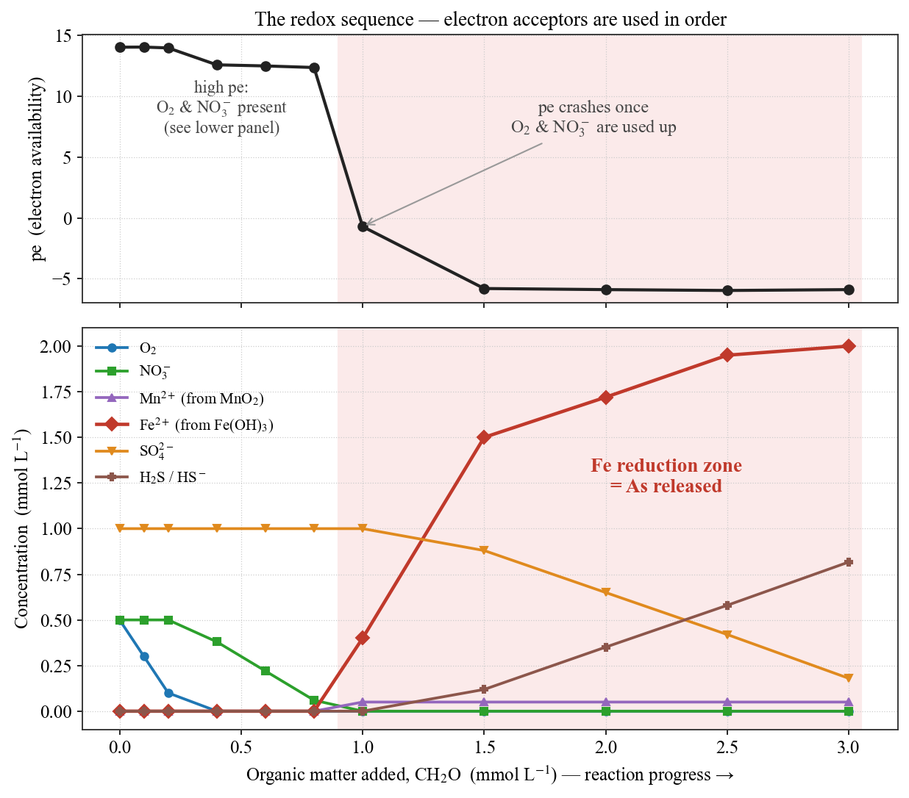
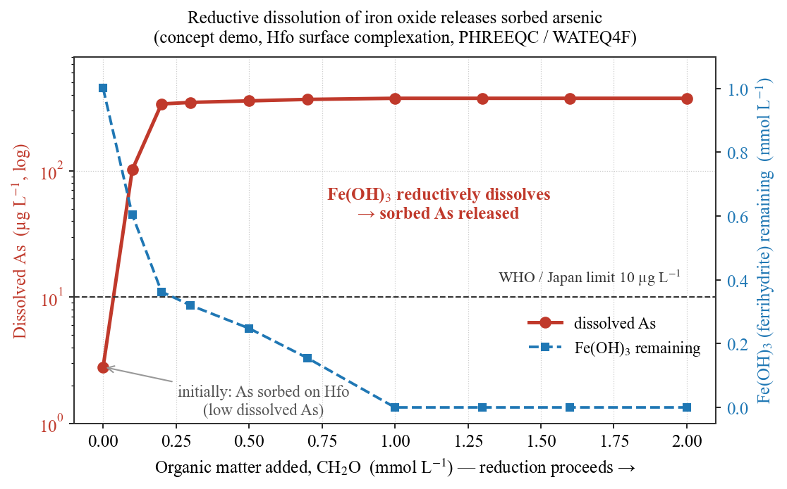
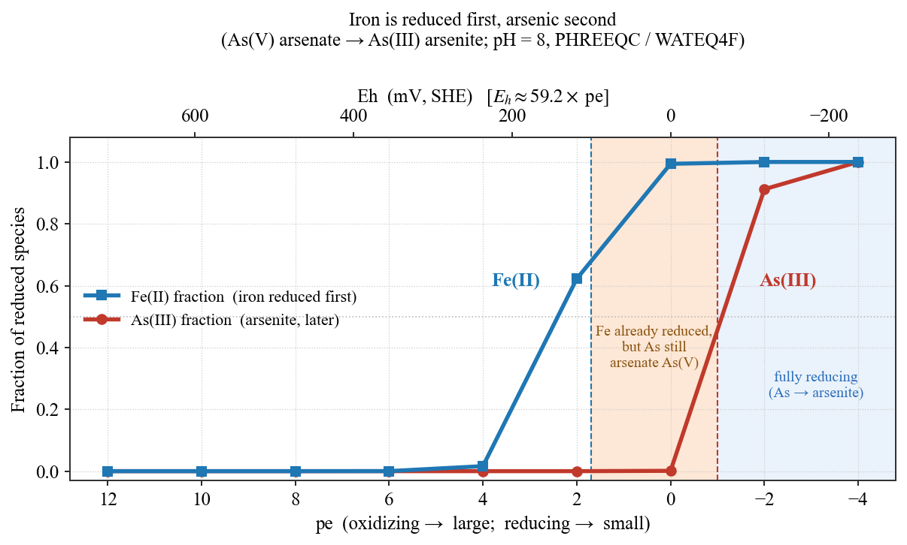

## はじめに：金属臭のその先へ

[#11](/posts/groundwater/groundwater-sci11/) で、井戸水の**金属臭**の正体は、還元的な地下水に溶けた**鉄（Fe²⁺）**だと触れた。汲み上げて空気に触れると酸化し、赤褐色の水酸化鉄へと姿を変える——あの現象である。そして「こうした微量成分の挙動は、**酸化還元（レドックス）**に支配される」と予告した。本記事は、その約束を果たす回である。

主役は**ヒ素（As）**。ヒ素は毒性が高く、飲料水基準は **10 µg/L**（WHO・日本とも）と厳しい。そして熊本地域では、このヒ素が**人為汚染ではなく "天然に"**、基準を超えて地下水に溶け出す場所がある。**Hossain et al. (2016)** は、この地域で **As が 0.1–60.6 µg/L** に分布し、**熊本平野の停滞域で井戸の 36% が基準 10 µg/L を超える**ことを示した。

なぜ天然でヒ素が溶け出すのか。答えは、[#12](/posts/groundwater/groundwater-sci12/) のフッ素と同じく「時間をかけた水–岩石反応」にある。ただし今回、動かすのは pH ではなく**電子**である。本記事では、この機構を **PHREEQC** で三段構えに再現する——**①レドックスシークエンス**、**②ヒ素の化学種**、**③鉄酸化物からのヒ素の放出**。

------------------------------------------------------------------------

## #12 と同じ舞台、違う主役

驚くことに、高ヒ素地下水の"顔つき"は、[#12](/posts/groundwater/groundwater-sci12/) の高フッ素水とよく似ている。Hossain et al. (2016) が高ヒ素域（39 試料）で報告した特徴はこうである。

- **高pH**（平均 7.97、範囲 7.14–9.45）
- **還元的**（ORP 平均 +42 mV、最小 −283 mV／溶存酸素 DO が低い）
- **低NO₃**（多くが検出限界以下）・**高い溶存鉄**（Fe 平均 511 µg/L、最大 5283 µg/L）
- **滞留時間の長い停滞域**（熊本平野中央部）に集中

そして堆積物コアの分析から、**ヒ素は鉄・アルミの酸化物／水酸化物に吸着**して存在し（As は Fe・Al と強く相関、Mn とは無相関）、その供給源は**地質由来（geogenic）**であることが分かった。

つまり舞台は #12 と同じ「高pH・停滞域」。しかし #12 では**高pHがフッ素を脱着**させたのに対し、#13 では**還元（電子の授受）が鉄酸化物ごとヒ素を溶かす**。主役がレドックスに替わるのである。

------------------------------------------------------------------------

## レドックスシークエンス — 電子受容体は順番に使われる

地下水が「還元的になる」とは、具体的に何が起きることか。鍵は、有機物（枯れた植物や土壌有機物）を微生物が分解するとき、**電子の受け手（電子受容体）を"エネルギー効率のよい順"に使い切っていく**ことである。この順序を**レドックスシークエンス（酸化還元シークエンス）**と呼ぶ。

PHREEQC で、酸素を含む涵養水に有機物（CH₂O）を少しずつ加える計算をすると、このシークエンスがそのまま再現できる。

``` phreeqc
SOLUTION 1  Oxic recharge water        # O2・NO3・SO4 を含む酸化的な水
    pe 14;  O(0) 0.5;  N(5) 0.5;  S(6) 1.0 ...
EQUILIBRIUM_PHASES 1
    Pyrolusite  0.0  5e-5              # MnO2（電子受容体）
    Fe(OH)3(a)  0.0  2e-3              # 水酸化鉄（電子受容体 & Fe源）
REACTION 1
    CH2O 1.0;  0 0.1 ... 3.0 mmol      # 有機物を段階的に添加（還元剤）
```

結果を @fig-ladder に示す。

{#fig-ladder}

読み取れる順序は明快である。

1. まず **O₂**（酸素呼吸）が消費される。
2. 次に **NO₃⁻**（脱窒）が消費される。
3. O₂ と NO₃⁻ が尽きると **pe が急落**し、**MnO₂ → Fe(OH)₃** の還元が始まる（Fe²⁺ が急増）。
4. さらに進むと **SO₄²⁻ が還元**され、**H₂S** が生じる。

このシークエンスこそが、高ヒ素水の特徴を説明する。**ヒ素が放出されるのは、赤い帯——鉄酸化物 Fe(OH)₃ が溶ける段**である。そして重要なのは、**NO₃⁻ は鉄よりも先に消費される**という順序である。だから、**まだ NO₃⁻ が残っている水では鉄還元に達しておらず、ヒ素も出ない**。論文が報告した「**高ヒ素 ＝ 低NO₃**」という関係は、このシークエンスの順序そのものなのである。

::: callout-tip
## PHREEQC の使い方はこちらで

レドックスシークエンスを PHREEQC で計算する手順は [PHREEQC をゼロから始める #13：酸化還元シークエンス](/posts/phreeqc/phreeqc-part13/) で、脱窒の診断は [#14：硝酸塩汚染の地下水診断](/posts/phreeqc/phreeqc-part14/) で、手を動かして解説している。本記事ではその結果を「熊本のヒ素」という現場に当てて読む。
:::

------------------------------------------------------------------------

## ヒ素はなぜ動くのか — 鉄酸化物の還元的溶解

堆積物中のヒ素は、**鉄酸化物（水酸化鉄, Hfo）の表面に吸着**して、いわば"固定"されている。酸化的な環境では、この鉄酸化物は安定で、ヒ素も表面にとどまる。

ところが、レドックスシークエンスが鉄還元の段に達すると、事情が変わる。**Fe(OH)₃ が電子を受け取って溶け出す（還元的溶解）**と、その表面にいたヒ素も**行き場を失って水へ放たれる**。PHREEQC で、鉄酸化物に吸着したヒ素（`SURFACE`／Hfo）を還元していくと、この放出が再現できる。

{#fig-release}

@fig-release は、まさに「毒が混入した」のではなく、**もともと鉄酸化物に固定されていたヒ素が、鉄ごと溶け出す**という描像を示している。Fe(OH)₃ が減る（青）のと入れ替わりに、溶存ヒ素（赤）が立ち上がる——この鏡像関係が、ヒ素動員の核心である。

::: callout-note
## 正直な限界：これは「概念デモ」である

この収着・脱着の計算（Dzombak–Morel の Hfo モデル）は、比表面積やサイト密度に既定値を用いている。実際の熊本の堆積物に固有の値ではないため、**具体的な濃度は主張しない**。あくまで「還元的溶解でヒ素が放出される」という**原理の可視化**である。Hossain et al. (2016) 自身も、この脱着過程は定性的に論じている。
:::

------------------------------------------------------------------------

## ヒ素の"顔" — 砒酸から亜砒酸へ

ヒ素は、ただ「溶ける／溶けない」だけではない。**レドックスの状態によって化学種（顔）を変える**。酸化的な水では**砒酸 As(V)**（HAsO₄²⁻ など）、還元的な水では**亜砒酸 As(III)**（H₃AsO₃）が優勢になる。一般に亜砒酸のほうが移動しやすく、毒性も高いとされる。

ここで、現場の水質計が測る **ORP（酸化還元電位 Eh）** と、PHREEQC が使う **pe** の関係を押さえておきたい。

::: callout-note
## pe と ORP（Eh）— 電子のものさし

- **pe** は電子の授受のしやすさを表す無次元数（`pe = −log{e⁻}`）。**pe が大きい＝酸化的**、**小さい＝還元的**。pH が「プロトン（H⁺）の物差し」なら、pe は「電子（e⁻）の物差し」である。
- 現場の **ORP（Eh, mV）** と pe は一対一で対応する。25℃では **$E_h(\mathrm{mV}) \approx 59.2 \times \mathrm{pe}$**（pe = 1 が約 +59 mV）。**PHREEQC は pe で計算し、現場は Eh を測る**——この式で行き来できる。
- ただし、Pt 電極が示す ORP は多くの酸化還元対の**混成電位**であり、個々の対（As(V)/As(III)・Fe(III)/Fe(II) など）が互いに平衡とは限らない。**測定 ORP は目安**として読むのが正しい。
:::

pH = 8 に固定し、pe を酸化側から還元側へ振ってヒ素と鉄の化学種を計算したのが @fig-spec である。

{#fig-spec}

読み取れることは二つある。

- **鉄が先、ヒ素が後**。Fe(III)→Fe(II) は pe ≈ +1.7 で、As(V)→As(III) は pe ≈ −1 で交代する。これはレドックスシークエンス（@fig-ladder）で鉄還元が硫酸還元より先に来る順序と整合する。
- **還元が進むほど亜砒酸 As(III) が優勢**になる。論文が Eh–pH 図で示した「還元的環境で亜砒酸」という描像を、公開データから再現できた。

------------------------------------------------------------------------

## 硫黄の証言 — δ³⁴S が語る微生物の営み

レドックスシークエンスの最下段に近いのが**硫酸還元**である。Hossain et al. (2016) は、硫酸イオンの硫黄同位体比 **δ³⁴S_SO₄ が 8.3–57.6‰** という広い幅を持つことを見いだした。これは、**微生物が硫酸を還元する際に軽い硫黄（³²S）を優先的に使う**ため、残った硫酸に重い硫黄（³⁴S）が濃縮する——という同位体分別の証拠である。つまり、この地下水では**硫黄がレドックス循環を受けている**。

さらに、生じた硫化物イオンと溶存鉄(II)が出会えば、ヒ素は**硫化物として共沈**し、逆に水から除かれる可能性もある。ただし論文は、この共沈の**直接証拠は得られていない**とし、あくまで示唆にとどめている。本記事も同じ姿勢で、「そういう可能性がある」という所までとする。

::: callout-tip
## 硫黄のレドックスもPHREEQCで

硫化物の酸化（黄鉄鉱 → 硫酸・酸性水）と、その逆の世界は [PHREEQC をゼロから始める #6：黄鉄鉱の酸化とAMD](/posts/phreeqc/phreeqc-part6/) で扱っている。δ³⁴S が語る硫黄循環の舞台裏である。
:::

------------------------------------------------------------------------

## 高ヒ素の三条件

ここまでを束ねると、Hossain et al. (2016) が結論づけた**高ヒ素地下水の三条件**が、機構として腑に落ちる。

1. **高pH** — 鉄酸化物表面の正電荷を下げ、ヒ素（陰イオン）を脱着しやすくする（#12 のフッ素と共通）。
2. **還元的（anoxic）** — レドックスシークエンスが鉄還元の段に達し、鉄酸化物ごとヒ素を溶かす。
3. **新しい堆積物での停滞** — 有明粘土層のような**地質的に新しい（堆積してまもない）地層**は、堆積後に地下水で十分に洗い流されておらず、堆積当時のヒ素を鉄酸化物に吸着したまま残している。そこに地下水が停滞し、長い滞留時間をかけて反応が進む。

ここで「新しい」は**地層の地質年代**（堆積してまもない）を指し、その中を流れる**地下水の滞留時間が長い＝"古い"**こととは別物である点に注意したい。①②は「時間をかけた水」の性質、③は「まだ洗い流されていない新しい地層」という器の条件——いずれも、水が長くとどまる停滞域でこそ重なる。ヒ素濃度もまた、フッ素と同じく、**地下水がどれだけ長く旅をし、どれだけ還元が進んだかの記録**なのである。

------------------------------------------------------------------------

## まとめ

- 熊本の一部の地下水では、**人為汚染ではなく天然の還元反応**で、ヒ素が飲料水基準を超えて溶け出す。
- 機構は **レドックスシークエンス**で理解できる。有機物の分解が O₂ → NO₃ → Mn → **Fe** → SO₄ の順に受容体を消費し、**鉄酸化物が溶ける段でヒ素が放出**される。だから **高ヒ素 ＝ 低NO₃** である。
- ヒ素は pe（≒Eh）に応じて**砒酸 → 亜砒酸**へ顔を変え、還元的なほど移動しやすい亜砒酸が優勢になる。
- **高pH・還元・停滞（まだ洗い流されていない新しい地層）**の三条件が重なる停滞域に、高ヒ素水は集中する。
- これら「順序・化学種・放出」は、いずれも **PHREEQC で再現できる**。

毒の混入ではなく、**時間と還元が動かす天然のヒ素**。フッ素（#12）と同じく、データと地球化学で読み解ける現象である。

::: callout-note
## 次回予告 — #14 同位体で読む地下水の"年齢"

#12・#13 と繰り返し現れた「**滞留時間の長い停滞域**」。では、その"年齢"はどう測るのか。次回は**安定同位体（δ¹⁸O・δD）と天水線**で涵養源を、**トリチウム・⁸⁵Kr** で地下水の年齢を読む。熊本や霧島のデータを題材に、「水の時間」を測る道具を扱う。
:::

------------------------------------------------------------------------

## 参考文献

- Hossain, S., Hosono, T., Ide, K., Matsunaga, M., Shimada, J. (2016) Redox processes and occurrence of arsenic in a volcanic aquifer system of Kumamoto Area, Japan. *Environmental Earth Sciences*, 75:740.
- Appelo, C.A.J. & Postma, D. (2005) *Geochemistry, Groundwater and Pollution*, 2nd ed. Balkema.
- Smedley, P.L. & Kinniburgh, D.G. (2002) A review of the source, behaviour and distribution of arsenic in natural waters. *Applied Geochemistry*, 17, 517–568.
- Dzombak, D.A. & Morel, F.M.M. (1990) *Surface Complexation Modeling: Hydrous Ferric Oxide*. Wiley.
- Parkhurst, D.L. & Appelo, C.A.J. (2013) Description of input and examples for PHREEQC version 3. *U.S. Geological Survey Techniques and Methods*, book 6, chap. A43.
