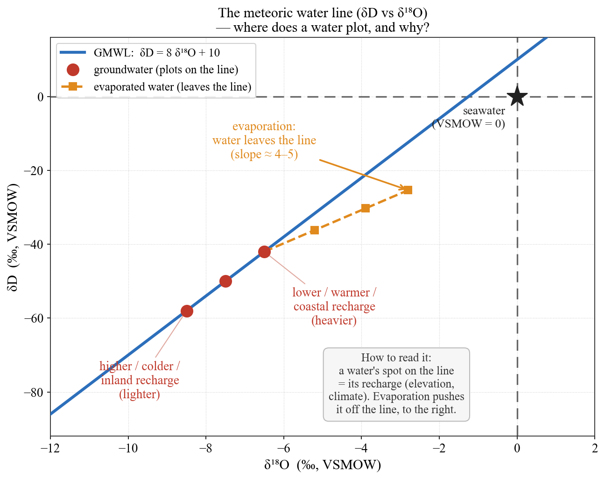
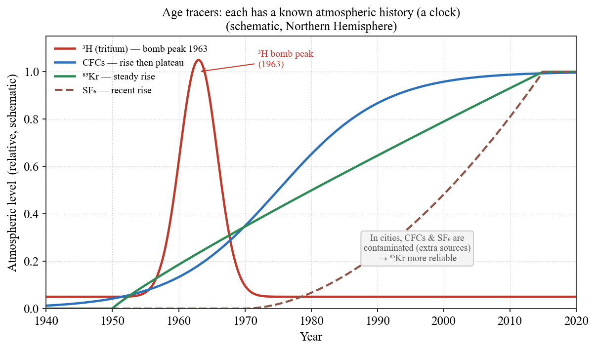
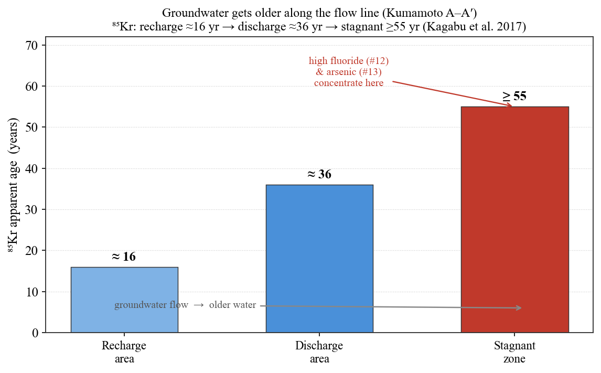

## はじめに：停滞域の"年齢"を測る

[#12](/posts/groundwater/groundwater-sci12/)（フッ素）と [#13](/posts/groundwater/groundwater-sci13/)（ヒ素）で、高濃度が集中したのはいずれも「**滞留時間の長い停滞域**」だった。水がそこに何十年もとどまり、岩石と反応し続けた結果である。では、その"何十年"は、どうやって測るのか。

地下水は、自分自身に二種類の情報を刻んでいる——**どこで生まれたか（涵養源）**と、**いつ生まれたか（年齢）**である。前者は水分子そのものの**安定同位体（δ¹⁸O・δD）**が、後者は大気中で濃度が変化してきた**環境トレーサー（³H・CFC・SF₆・⁸⁵Kr）**が教えてくれる。本記事は、この「水の時間」を読む道具を、教科書的な基礎から実例まで整理する。

#11–13 が「水が岩石と反応して味を得る（化学）」話だったのに対し、#14 は、その反応を支配する**"時間"そのもの**を測る回である。

------------------------------------------------------------------------

## 水の指紋：安定同位体の基礎

> この章は同位体の基礎をやや詳しく解説する。既にご存じの方は §「どこで生まれたか」へ進んでよい。

### 同位体とは何か

**同位体（isotope）**とは、陽子数（＝元素の種類）は同じで、中性子数が異なる原子である。水を構成する二つの元素には、それぞれ安定同位体がある。

- 酸素：**¹⁶O（存在度 99.76%）・¹⁷O（0.04%）・¹⁸O（0.20%）**
- 水素：**¹H（99.985%）・²H＝重水素 D（0.015%）**（＋放射性の ³H＝トリチウム。後述）

したがって水分子の大半は軽い **¹H₂¹⁶O** だが、ごくわずかに重い **¹H₂¹⁸O** や **¹HD¹⁶O** が混じっている。この「重い水」と「軽い水」の**比率のわずかな違い**が、水の来歴を語る指紋になる。

### なぜ δ 表記か — VSMOW を基準にした相対値

¹⁸O/¹⁶O の絶対比はおよそ 0.0020 と極めて小さく、しかも試料間の差はさらにその 1000 分の 1 という微小さである。絶対値のままでは扱いにくいので、**標準物質からのズレを千分率（‰）**で表す。これが **δ 表記**である。

$$\delta = \left(\frac{R_{\text{試料}}}{R_{\text{標準}}} - 1\right) \times 1000\ (‰), \qquad R = \frac{^{18}\mathrm{O}}{^{16}\mathrm{O}}\ \text{または}\ \frac{\mathrm{D}}{\mathrm{H}}$$

- 標準は **VSMOW（Vienna Standard Mean Ocean Water＝標準平均海水）**。定義上、VSMOW の δ¹⁸O = δD = 0‰。
- **δ が負 ＝ 標準（海水）より軽い**（重い同位体が乏しい）。陸の降水・地下水はふつう δ が負である。
- 例：δ¹⁸O = −8‰ とは「VSMOW より ¹⁸O/¹⁶O が 8‰（0.8%）少ない」の意味である。

### 同位体分別 — 重い水と軽い水は振る舞いが違う

相変化（蒸発・凝結）のとき、重い分子と軽い分子で移りやすさがわずかに変わる。これを**同位体分別（fractionation）**という。

- **平衡分別**：重い同位体（¹⁸O, D）は結合が強く、**液相（凝結側）に残りやすく、気相（蒸発側）へ出にくい**。温度が低いほど分別は大きい（温度依存）。
- **速度論的（非平衡）分別**：乾いた空気への急速な蒸発など、逆反応が追いつかないときに生じる追加の分別。**湿度が低いほど大きい**。後述の d-excess の源である。
- 結果として、
  - **海から蒸発した水蒸気は、海水より軽い**（¹⁶O, ¹H に富む）。
  - **雲から雨が凝結して落ちると、重い水が先に抜ける** → **残る水蒸気はどんどん軽くなる**（レイリー蒸留）。
  - だから、水蒸気が内陸・高所・高緯度へ運ばれて降水を繰り返すほど、**後から降る雨は軽く（δ が負に）なる**。

### 天水線（GMWL）— 世界の降水が乗る一本の直線

Craig (1961) は、世界中の降水の δ¹⁸O と δD をプロットすると一本の直線に乗ることを見いだした。**天水線（Global Meteoric Water Line, GMWL）**である。

$$\delta \mathrm{D} = 8\,\delta^{18}\mathrm{O} + 10$$

- **傾き 8** ＝ 水素と酸素の**平衡分別比**を反映する（D の分別が ¹⁸O のおよそ 8 倍）。蒸発・凝結が平衡的に進む限り、両者は連動してこの傾きで動く。
- **切片 10 ＝ d-excess（重水素過剰, Dansgaard 1964）**。定義は $d = \delta \mathrm{D} - 8\,\delta^{18}\mathrm{O}$ で、**水蒸気源の相対湿度**を反映する。乾いた海域で蒸発した水ほど d が大きい。
- 各地域の降水は、GMWL に近い**地域天水線（LMWL）**をつくる。そして**地下水は、涵養したときの降水の δ をほぼ保ったまま**（地下では蒸発分別を受けにくい）流れるので、この線の上に乗る。これが涵養源推定の土台になる。

### δ を動かす「効果」（Dansgaard 1964）

降水の δ は、次の要因で系統的に変化する。いずれもレイリー蒸留（水蒸気が水を失うほど軽くなる）で理解できる。

- **緯度効果**：高緯度ほど軽い。
- **高度効果**：標高が高いほど軽い（δ¹⁸O でおよそ **−0.15〜−0.5‰/100 m**）。→ 涵養標高の推定に使う。
- **内陸効果**：海から遠いほど軽い。
- **雨量効果**：強い降水ほど軽い（熱帯で顕著）。
- **季節効果**：冬の降水は夏より軽い。

------------------------------------------------------------------------

## どこで生まれたか — 涵養源を読む（高度効果）

これらの効果のうち、地下水で最もよく使われるのが**高度効果**である。標高が高いほど降水の δ は軽くなるので、**地下水の δ から、それがどの標高で涵養されたかを逆算できる**。

@fig-gmwl は、天水線と地下水の関係を示したものである。地下水（赤点）は天水線の上に乗り、**涵養標高が高いほど左下（軽い側）**へ移動する。一方、**蒸発を受けた水は天水線から外れ、傾き 4〜5 の蒸発線**に乗る。海水は δ≈0（右上）で、淡水と海水が混じれば両者を結ぶ線上に来る（[#7](/posts/groundwater/groundwater-sci07/) の淡水レンズと相性がよい）。

{#fig-gmwl}

**霧島の実例（Ide et al. 2016）**では、湧水の δD と集水域の平均標高に明瞭な関係が見られ、涵養標高 700〜1000 m 程度の流路が主体と推定された。δ は、水が「どの高さで生まれたか」の標識になるのである。

------------------------------------------------------------------------

## いつ生まれたか — 地下水の"年齢"を測る

涵養源が分かったら、次は年齢である。若い地下水（数十年以内）は、**大気中で時間とともに濃度が変化してきた物質**を"時計"に使える。それぞれの物質は、@fig-tracers のような固有の大気履歴を持つ。

{#fig-tracers}

- **トリチウム ³H**（半減期 12.3 年）：水素の放射性同位体。1960 年代の核実験で降水中に大きなピーク（ボム・トリチウム）を残した。減衰と入力履歴から年代を推定する。
- **CFC（フロン）**：20 世紀後半に大気で単調に増加し、モントリオール議定書後は頭打ちになった。涵養時の大気濃度＝涵養年に対応する。
- **SF₆**：同様に増加してきた人工トレーサー。
- **⁸⁵Kr（クリプトン85）**（半減期 10.8 年）：核燃料再処理由来で大気濃度が増えてきた。**若い水（〜50 年）に強く、局所汚染の影響を受けにくい**のが強みである。

::: callout-important
## 「年齢」はモデル年齢である

これらが与えるのは、**単一の絶対年代ではなく、流れの混合を含む"モデル年齢"**である。井戸で汲む水は、さまざまな経路・年齢の水の混合だからだ。そこで、流動様式を仮定した**集中定数モデル（LPM：ピストン流 PFM・指数混合 EMM など）**を用いて平均滞留時間を推定する。得られる年代は、この仮定の上に立つ「見かけ／モデル年齢」であることを、正直に踏まえて読む必要がある。
:::

------------------------------------------------------------------------

## 熊本の実例 — ⁸⁵Kr で年代を測る（Kagabu et al. 2017）

熊本地域は、飲料水のほぼ 100% を地下水に頼る。**Kagabu et al. (2017)** は、⁸⁵Kr・CFC・SF₆・³H を同時に測定し、地域の地下水流動系の時間構造を描いた。

ここで効いたのが ⁸⁵Kr である。**都市部では CFC・SF₆ が人為的に汚染されて年代が出せない**なか、⁸⁵Kr はその影響を受けにくく、年代測定を可能にした（本研究の核心である）。

結果は明快だった。主要な流線 A–A′ に沿って、**⁸⁵Kr 見かけ年代が、涵養域 ≈16 年 → 流出域 ≈36 年 → 停滞域 ≥55 年**と増えていく（@fig-age）。³H の時系列を使った LPM 解析とも整合した。

{#fig-age}

注目すべきは、**この「停滞域 ≥55 年」が、[#12](/posts/groundwater/groundwater-sci12/) のフッ素・[#13](/posts/groundwater/groundwater-sci13/) のヒ素が濃集した、まさにその場所**だということである。⁸⁵Kr という独立したトレーサーが、「なぜそこで濃集するのか」に**「古い水だから」という時間の答え**を与えたのである。

------------------------------------------------------------------------

## 霧島の実例 — 滞留時間の分布（Ide et al. 2016）

火山地域でも同じ考え方が使える。**Ide et al. (2016)** は、霧島火山群の 25 湧水について CFC 濃度を測り、**指数混合流＋ピストン流（EMM＋PFM）を仮定した LPM で、平均滞留時間 1〜58 年**を推定した。

- **山頂付近は 10 年未満**（若い水）。
- **山麓は 10〜40 年**。
- **最長は 50〜60 年**で、その流動様式は**ピストン流**（押し出し流れ）が卓越していた（※系全体としては混合流＝EMM が主体であり、ピストン流卓越はこの最長流路——高千穂峰溶岩の末端——に限られる）。

滞留時間は、地形と流動様式によって決まる。高度効果（涵養標高）と組み合わせれば、「**どこで生まれ、何年かけて旅したか**」を一枚の地図に描ける。

------------------------------------------------------------------------

## 時間軸としての年代 — 水質へ戻る

同位体と年代は、それ自体が目的ではない。**水質という結果に「時間軸」を与える**ことに意味がある。

- **水質は年齢の関数**である。#12 のフッ素・#13 のヒ素は、いずれも滞留時間の長い停滞域（≥55 年）に集中した。年代は、なぜそこで濃集するのかに「時間」という答えを与える。
- **次回への橋**：Ide et al. (2018) は霧島で、**涵養から約 20 年で溶存シリカが飽和し、二次鉱物がカオリナイト→Ca-スメクタイトへ相転移する**ことを示した。滞留時間（本記事）× 水–岩石反応の"熟成"は、[#15](/posts/groundwater/groundwater-sci15/) で PHREEQC を使って追う。

------------------------------------------------------------------------

## まとめ

- 地下水は、**どこで生まれたか（δ¹⁸O・δD ＝ 涵養源・高度効果）**と、**いつ生まれたか（³H・CFC・SF₆・⁸⁵Kr ＝ 年齢）**を、自らに刻んでいる。
- 天水線 **δD = 8δ¹⁸O + 10** の上で、地下水は涵養時の指紋を保つ。高度効果で涵養標高が、蒸発線で蒸発の履歴が読める。
- 年代は**単一値ではなく、流動様式を仮定したモデル年齢**である（LPM）。この前提を正直に踏まえて読む。
- 熊本では ⁸⁵Kr が、都市の汚染をかわして **16 → 36 → ≥55 年**の時間構造を描き、**停滞域＝古い水**を #12/#13 の濃集域と結びつけた。霧島では滞留時間 **1〜58 年**が地形と結びついた。
- そして年代は、水質濃集に「時間軸」を与え、#15 の"熟成"へつながる。

::: callout-note
## 次回予告 — [#15](/posts/groundwater/groundwater-sci15/) 湧水と滞留時間：水質はどう"熟成"するか

霧島の湧水を舞台に、**滞留時間（本記事）× 水–岩石反応（PHREEQC）**を掛け合わせる。Ide et al. (2018) が示した「涵養から約 20 年でシリカ飽和・二次鉱物の相転移」を、PHREEQC の反応経路で追体験する。**PHREEQC が最も映える回**である。
:::

------------------------------------------------------------------------

## 参考文献

- Kagabu, M., Matsunaga, M., Ide, K., Momoshima, N., Shimada, J. (2017) Groundwater age determination using ⁸⁵Kr and multiple age tracers (SF₆, CFCs, and ³H) to elucidate regional groundwater flow systems. *Journal of Hydrology: Regional Studies*, 12, 165–180.
- Ide, K. et al. (2016) 繰り返し採水試料の CFCs による霧島火山群湧水の滞留時間推定—Lumped parameter model による年代解析—. *日本水文科学会誌*, 46(3), 213–231.
- Ide, K., Hosono, T., Hossain, S., Shimada, J. (2018) Estimating silicate weathering timescales from geochemical modeling and spring water residence time in the Kirishima volcanic area, southern Japan. *Chemical Geology*, 488, 44–55.
- Craig, H. (1961) Isotopic variations in meteoric waters. *Science*, 133, 1702–1703.
- Dansgaard, W. (1964) Stable isotopes in precipitation. *Tellus*, 16, 436–468.
- Clark, I. & Fritz, P. (1997) *Environmental Isotopes in Hydrogeology*. Lewis Publishers.
- Cook, P.G. & Herczeg, A.L. (eds., 2000) *Environmental Tracers in Subsurface Hydrology*. Kluwer.