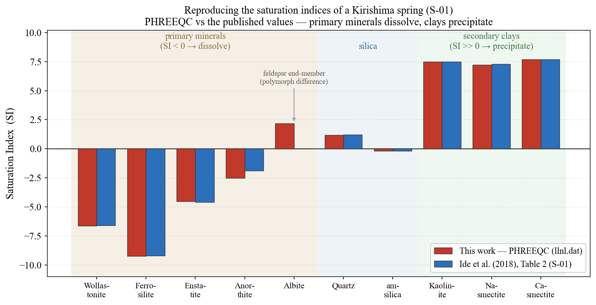
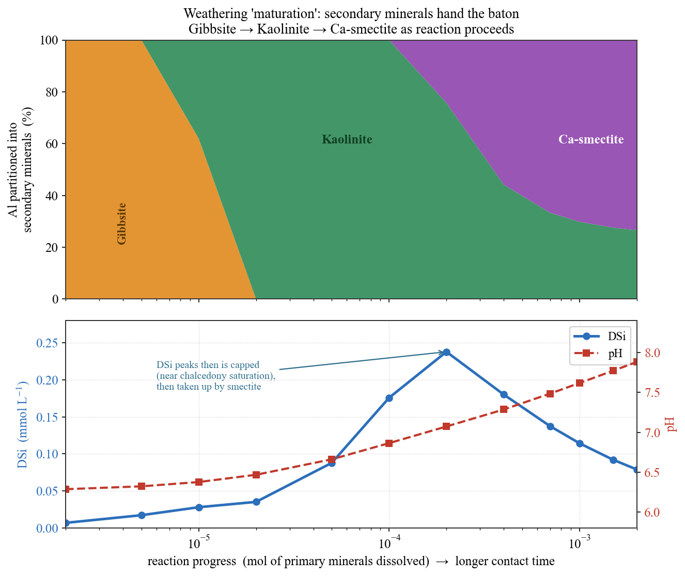
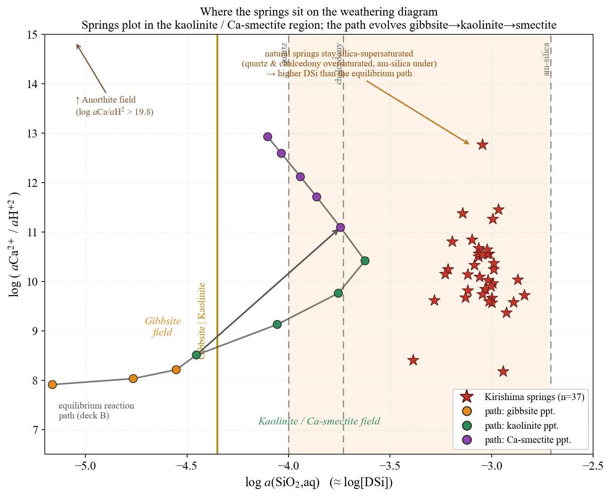

## はじめに：水質は「年齢」の関数である

[#14](/posts/groundwater/groundwater-sci14/) で、地下水の**年齢（滞留時間）**をどう測るかを見た。同位体で涵養源を、トリチウムや ⁸⁵Kr で年代を読む——あの回で得たのは「水の時計」である。本記事は、その時計を**化学変化の時間軸**として使い直す。問いはこうである。

> **地下水は「何年」で化学的に熟成するのか。若い水と古い水では、水質はどう違うのか。**

[#11](/posts/groundwater/groundwater-sci11/) で「雨と土壌 CO₂ が岩石を溶かす（溶解）」ことを、[#12](/posts/groundwater/groundwater-sci12/)・[#13](/posts/groundwater/groundwater-sci13/) で「停滞域ほど成分が濃集する」ことを見た。#15 はこれらを一本の線につなぐ。すなわち、**滞留時間を横軸に、水–岩石反応の進行＝水質の"熟成"を PHREEQC で追う**回である。平衡計算で「熟成」を再現し、そのうえで、この系を本当に定量的に解くには何が足りないのか——反応と輸送の役割分担——まで踏み込む。舞台は、火山地帯の湧水群である霧島。素材はすべて公開データ（Ide et al. 2018 の公開テーブルと公開熱力学データベース）である。

------------------------------------------------------------------------

## 舞台：霧島火山群の湧水

九州南部の霧島火山群は、安山岩を中心とする第四紀火山岩に覆われる。岩石の主要な**苦鉄質鉱物は二つの輝石（普通輝石 augite と紫蘇輝石 hypersthene）**、主要な珪長質鉱物は**斜長石 plagioclase** である（Ide et al. 2018）。これらの新鮮な火山岩を、雨と土壌 CO₂ を溶かし込んだ弱酸性の水がゆっくり通り抜ける。

決定的なのは、この地域では**湧水ごとの滞留時間がすでに測られている**ことである。Ide et al. (2016) は CFCs（クロロフルオロカーボン類）の繰り返し観測と集中定数モデル（LPM）から、**霧島の湧水の平均滞留時間を 1〜58 年**と見積もった（Ide et al. 2016）。つまりここは、「化学変化の進み具合」と「実測の滞留時間」を突き合わせられる、稀有な天然実験場なのである。

もう一つの特徴が**溶存シリカ（DSi）の高さ**である。霧島の湧水の DSi は 0.41–1.45 mmol/L（中央値 0.93）で、**世界の河川水平均（0.158 mmol/L）の 3〜9 倍**に達する（Ide et al. 2018）。火山ガラスや輝石・斜長石が活発に溶けている証拠であり、本記事の主役となる指標である。

------------------------------------------------------------------------

## 熟成の化学：溶ける鉱物と、沈む鉱物

ケイ酸塩の風化は、二つの半過程の綱引きである。

1.  **一次鉱物が溶ける**（不飽和＝ SI \< 0）。輝石・斜長石・火山ガラスが、酸（H⁺）と水に分解し、Ca²⁺・Na⁺・Mg²⁺・溶存シリカ・アルカリ度を水に供給する。
2.  **二次鉱物が沈む**（過飽和＝ SI \> 0）。溶け出した Al と Si は、ほとんど水に残れない。**粘土鉱物**として再び固相へ戻る。

重要なのは、**沈む二次鉱物の"種類"が、反応の進み具合とともに移り変わる**ことである。古典的な風化の系列（Garrels & Christ 1965）はこう教える——反応初期のごく希薄な段階ではまず**ギブサイト（水酸化アルミニウム）**が、シリカが溜まると**カオリナイト**が、さらに陽イオンが溜まると**スメクタイト**が安定になる。この「バトンの受け渡し」こそ、水質の熟成の指紋である。

以下、この描像を PHREEQC（データベースは `llnl.dat`）で二段構えに検証する。

::: callout-note
## SI（飽和指数）の復習

飽和指数 SI = log(IAP/K) は、その鉱物に対して水が過飽和（SI \> 0、沈殿しうる）か不飽和（SI \< 0、溶けうる）かを表す。SI の詳しい意味と PHREEQC での使いこなしは、姉妹シリーズ [PHREEQC をゼロから始める #10：飽和指数（SI）の使いこなし](/posts/phreeqc/phreeqc-part10/) で詳説している。
:::

------------------------------------------------------------------------

## 再現①：湧水の飽和指数を論文と符号照合する

まず、代表的な湧水 1 試料（S-01：pH 7.1、Ca–HCO₃ 型、DSi 0.97 mmol/L）の実測全項目を PHREEQC に入れ、各鉱物の SI を計算した。狙いは、**論文 Table 2 に載る同じ試料の SI と符号が一致するか**を確かめることである（@fig-si）。

{#fig-si}

結果は明瞭である。

- **一次鉱物はすべて不飽和**：Wollastonite ≈ −6.6、Ferrosilite ≈ −9.2、Enstatite ≈ −4.5、Anorthite ≈ −2.5。輝石も斜長石も**溶ける側**にある。
- **二次鉱物は大きく過飽和**：Kaolinite ≈ +7.5、Ca-スメクタイト ≈ +7.7。溶け出した Al・Si は**粘土として沈む側**にある。
- **シリカは石英過飽和・非晶質シリカ不飽和**（Quartz ≈ +1.2、am-silica ≈ −0.2）。DSi は石英と非晶質シリカの飽和の間に位置する。

これらは論文値とほぼ完全に一致した（棒グラフの赤と青がほぼ同じ高さ）。とくに、微量な溶存 Al に依存する**カオリナイト・スメクタイトの SI がピタリと合った**ことは、入力・データベース・手順が正しいことの強い裏づけである。唯一 Albite だけ SI で約 2 のずれが残るが、これは長石端成分の熱力学データ（多形の違い）に由来する既知の系統差であり、風化の物語の骨格には影響しない。

------------------------------------------------------------------------

## 再現②：反応経路で"熟成"を追う

SI の符号照合は「いまの水」の静的なスナップショットである。次はこれを**時間方向に動かす**。希薄な涵養水（雨＋土壌 CO₂）に、斜長石・輝石・火山ガラスを**少しずつ溶かし込み**（＝接触時間の代理）、そのつど二次鉱物を平衡析出させる「反応経路（reaction path）」計算である（@fig-path）。この手法そのものの入門は [PHREEQC をゼロから始める #11：反応経路モデリング](/posts/phreeqc/phreeqc-part11/) を参照されたい。

{#fig-path}

二つの読みどころがある。

**（1）二次鉱物の三段リレー。** 反応のごく初期（希薄・低シリカ）ではまず**ギブサイト**が単独で沈む。シリカが溜まるとギブサイトは溶け戻り、**カオリナイト**へバトンを渡す。さらに陽イオン（とくに Ca・Mg）が溜まると、**Ca-スメクタイト**が主役になる。これは前節で触れた古典的風化系列そのものであり、論文が観測から推定した「湧水はすでにギブサイト析出を経験し、一部はカオリナイトと、より熟成した水は Ca-スメクタイトと平衡にある」という解釈（Ide et al. 2018）を、計算が下から支えている。

**（2）DSi の頭打ち。** 溶存シリカは反応とともに増えるが、無制限には増えない。石英〜玉髄の飽和付近で頭打ちになり、さらに反応が進むとスメクタイトの析出に Si が消費されて微減に転じる。**「溶ける（Si の供給）」と「沈む（Si の除去）」の綱引きが、DSi の上限を決めている**のである。ただし、この後半の減少——二次粘土が Si を吸い取る過程——と、天然の湧水が示す「シリカが石英に対して過飽和のまま留まる」という準安定は、平衡計算だけでは説明しきれない。この点は、活動度図と滞留時間を見たのちに改めて考える。

::: callout-tip
## なぜ pH が上がるのか

一次鉱物の溶解は H⁺ を消費する反応（例：Anorthite ＋ 8H⁺ → Ca²⁺ ＋ 2Al³⁺ ＋ 2SiO₂ ＋ 4H₂O）である。反応が進むほど水は酸を失い、pH が上がる。土壌 CO₂ を開放系で供給し続けることで、この上昇は現実的な 7〜8 の範囲に収まる。
:::

------------------------------------------------------------------------

## 湧水は風化図のどこに乗るか

最後に、37 湧水すべてを**活動度図（activity diagram）**に載せる（@fig-act）。横軸に溶存シリカ、縦軸に log(aCa²⁺/aH⁺²) をとると、どの鉱物が安定かを一枚で読める古典的な図である。この図に、前節の反応経路の軌跡を重ねた。こうした溶解度ダイアグラムの描き方そのものは [PHREEQC をゼロから始める #7：溶解度ダイアグラム（Gibbsite）](/posts/phreeqc/phreeqc-part7/) で扱っている。

{#fig-act}

読み取れることは二つある。

**縦軸では、湧水と反応経路が重なる。** 37 湧水はいずれも log(aCa²⁺/aH⁺²) ≈ 8〜13 の帯に収まり、これはカオリナイト／Ca-スメクタイトが安定な領域である。反応経路の後半（緑〜紫の点）も同じ帯を通る。**霧島の湧水は、まさに粘土鉱物が沈む段階の水**なのである。

**横軸では、湧水が反応経路より右にずれる。** 天然の湧水は DSi が高く（右側）、平衡の反応経路より過飽和側に位置する。これは失敗ではなく、**論文自身が指摘する現象**である——天然水では**シリカが石英に対して過飽和のまま留まる（速度論的な準安定）**。石英や玉髄はゆっくりとしか沈まないため、火山ガラスの溶解で供給されたシリカが高いまま維持される。図の淡い帯（石英〜非晶質シリカの間）が、この「天然の DSi 窓」を示している。

::: callout-note
## モデルと現実の"ずれ"を正直に読む

平衡計算は「十分に時間が経てば到達する終点」を示す。天然水がそこからずれるとき、ずれ方そのものが情報になる。ここでの横方向のずれは、**シリカ沈殿の速度論的な遅さ**を語っている。モデルを実測に無理に合わせ込むより、ずれの理由を読む方が、地球化学的にははるかに実りが多い。
:::

------------------------------------------------------------------------

## 時間の物差し：熟成は「約 20 年」で転移する

反応経路の横軸「反応進行」を、実測の滞留時間に読み替えよう。Ide et al. (2018) は、SI と活動度図の解析に滞留時間（Ide et al. 2016 の 1–58 年）を突き合わせ、**DSi の飽和とカオリナイト→Ca-スメクタイトの相転移が「涵養から約 20 年」で始まる**と結論した。

つまり、

- **数年の若い水**：まだ希薄で、ギブサイト〜カオリナイト段階。DSi は上昇途上。
- **20 年前後**：DSi が飽和に近づき、二次鉱物がカオリナイトから Ca-スメクタイトへ移り始める。
- **数十年の古い水**：Ca-スメクタイト段階。陽イオンに富み、Ca–HCO₃ 型から Na–HCO₃ 型へと寄る。

水質は、文字どおり**年齢の関数**なのである。

------------------------------------------------------------------------

## 平衡モデルの限界：なぜ DSi は年齢によらず一定なのか

平衡計算（再現②）が描くのは、「十分に時間が経てば水が到達する終点」である。だが天然の霧島湧水には、この終点論だけでは説明しにくい事実がある。**DSi が滞留時間（1〜58 年）によらずほぼ一定（中央値 0.93、範囲 0.41–1.45 mmol/L）に保たれ、しかも石英に対して過飽和のまま**という点である。反応経路の描像に従えば、古い水ほど反応が進み、スメクタイト析出で DSi は微減していくはずだから、年齢によって DSi はもっとばらついてよい。なぜ、ほぼ一定なのか。

鍵は、この湧水系の**流動様式**にある。Ide et al. (2016, 2018) は CFCs の解析から、この地域の地下水は**下降流の途中でよく混合し、ピストン流はごくわずか**だと判断し、指数混合モデル（EMM）を主体に滞留時間を推定した。つまり湧口から出てくるのは単一の水塊ではなく、**さまざまな年齢の水の混合物**なのである。ここから、DSi の頭打ちは「値」と「時間発展」の二層に分けて考えると、きれいに整理できる。

**なぜ約 1 mmol で止まるのか（値）。** これは化学が決める。混合は各年齢の水の DSi を加重平均するだけで、それ自体は頭打ちを作れない——最も古い端成分の水が化学的に飽和していなければ、平均もまた上がり続けてしまうからである。逆に言えば、DSi が一定値でキャップされる事実こそ、**最古の水塊そのものが二次鉱物の析出で頭打ちになっている**証拠である。Ide et al. (2018) はこのキャップを **Ca-スメクタイトの析出**に帰した。混合が主役のこの系でも（いや、混合が主役だからこそ）、DSi の上限を決めているのは化学なのである。

**なぜ約 20 年でそこに達し、年齢依存に"見える"のか（時間発展）。** こちらには化学反応の速さと年齢分布（混合）の両方が効く。観測される「見かけの滞留時間 対 DSi」は、単一水塊の反応進行と年齢分布の**畳み込み**であって、閉鎖系の平衡計算だけでは追い切れない。

したがって、この系を本当に定量的に解くには、化学反応と物質輸送（移流・分散・混合）を連立させた**反応輸送（reactive transport）モデル**が要る。PHREEQC 自身も移流・分散を扱う機能を備えており、その基礎は [PHREEQC をゼロから始める #12：移流分散モデル](/posts/phreeqc/phreeqc-part12/) で紹介した。本記事は平衡計算にとどめたが、**「平衡は終点を、輸送は"そこへ至る道"を語る」**という役割分担こそ、次の一歩の出発点である。

------------------------------------------------------------------------

## #12・#13 とのつながり

この「時間の物語」は、水質サブシリーズ全体を貫いている。[#12](/posts/groundwater/groundwater-sci12/)（フッ素）と [#13](/posts/groundwater/groundwater-sci13/)（ヒ素）で高濃度が集中したのは、いずれも**滞留時間の長い停滞域**だった。本記事の言葉で言えば、それは「最も熟成の進んだ水」である。イオン交換で Na 型へ寄り（#12）、還元が進み（#13）、二次鉱物がスメクタイトまで熟した水——同じ一つの時間軸の上に、フッ素もヒ素も、そしてシリカと粘土の相転移も並んでいる。

------------------------------------------------------------------------

## まとめ

- 火山地帯・霧島の湧水を題材に、水質の**"熟成"を滞留時間の関数として** PHREEQC で再現した。
- **再現①**：代表湧水の SI を計算し、一次鉱物は溶ける（SI \< 0）・二次鉱物は沈む（SI ≫ 0）ことを論文 Table 2 と符号照合した。カオリナイト／スメクタイトの SI はほぼ完全一致した。
- **再現②**：反応経路計算で、二次鉱物が **ギブサイト→カオリナイト→Ca-スメクタイト**と三段で移り変わり、DSi が飽和で頭打ちになる「熟成」を再現した。
- 活動度図で 37 湧水は粘土安定領域に乗り、**シリカの準安定過飽和**という天然特有のずれも読み取れた。
- Ide et al. (2018) に倣えば、この熟成は**約 20 年**で相転移期に入る。**水質は年齢の関数**である。
- ただし、DSi が年齢によらずほぼ一定に保たれる挙動は、**混合が主体（ピストン流はごくわずか）**なこの系を平衡計算だけでは説明しきれない。DSi の上限値は化学（Ca-スメクタイト析出）が決め、そこへ至る時間発展は反応と混合の畳み込みが決める。**熟成の"終点"は平衡が、"至る道"は反応輸送（移流）が語る**——それが次の一歩である。

> 本記事のデータ・結果はすべて公開情報（Ide et al. 2016, 2018 の公開テーブルおよび公開熱力学データベース）のみで再構成した。PHREEQC の入力デックと図の生成スクリプトは、手法の共有を目的に本文の記述に沿って設計している。

::: callout-tip
## 関連：姉妹シリーズ「PHREEQC をゼロから始める」

本記事で使った PHREEQC の手法は、姉妹シリーズで一つずつ丁寧に解説している。地球化学モデリングを基礎から学びたい読者は、あわせて参照されたい。

- [#1：インストールと最初の計算](/posts/phreeqc/phreeqc-part1/) — シリーズの入口
- [#7：溶解度ダイアグラム（Gibbsite）](/posts/phreeqc/phreeqc-part7/) — 本記事の活動度図の描き方
- [#10：飽和指数（SI）の使いこなし](/posts/phreeqc/phreeqc-part10/) — 再現①の土台
- [#11：反応経路モデリング](/posts/phreeqc/phreeqc-part11/) — 再現②の土台
- [#12：移流分散モデル](/posts/phreeqc/phreeqc-part12/) — 本記事が残した「反応輸送」への道
- [#16：反応速度論（KINETICS）入門](/posts/phreeqc/phreeqc-part16/) — 熟成の「速さ」を扱う次の一歩
:::

------------------------------------------------------------------------

## 次回予告

本記事が残した宿題——化学反応と物質輸送を連立させる**反応輸送（reactive transport）モデル**——は、今後の回で本格的に扱う。続く #16 では、**温泉・地熱の水質と高温の水–岩石反応**へ進む。方解石の飽和、CO₂ と玄武岩・安山岩の反応など、これまでの低温風化とは温度の桁が変わる世界で、PHREEQC がどこまで水質を読み解けるかを見ていく（玄武岩–CO₂ 反応そのものは [PHREEQC #17](/posts/phreeqc/phreeqc-part17/)・[#18](/posts/phreeqc/phreeqc-part18/) でも扱っている）。

## 参考文献

- Ide, K., Hosono, T., Hossain, S., Shimada, J. (2018) Estimating silicate weathering timescales from geochemical modeling and spring water residence time in the Kirishima volcanic area, southern Japan. *Chemical Geology*, 488, 44–55.
- Ide, K. et al. (2016) 繰り返し採水試料の CFCs による霧島火山群湧水の滞留時間推定—Lumped parameter model による年代解析—. *日本水文科学会誌*, 46(3), 213–231.
- Garrels, R.M. & Christ, C.L. (1965) *Solutions, Minerals, and Equilibria*. Harper & Row.
- Parkhurst, D.L. & Appelo, C.A.J. (2013) Description of input and examples for PHREEQC version 3. *USGS Techniques and Methods*, 6-A43.
- 熱力学データベース：`llnl.dat`（Lawrence Livermore National Laboratory, PHREEQC 付属）。