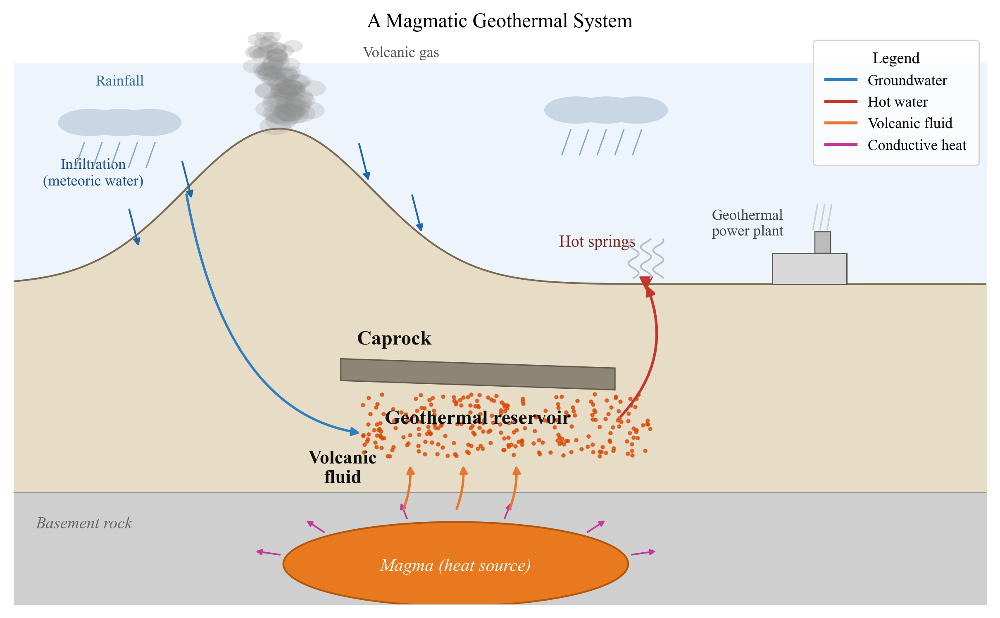

## Reading the temperature underground, without drilling

Suppose that, while soaking in a hot spring, you could tell how hot that water once was kilometers down in the Earth — without drilling. In fact you can. By analyzing only the chemical composition of hot-spring water or geothermal fluid, we estimate the temperature of the deep reservoir. That is the **geothermometer**.

Japan is a volcanic country with the world's third-largest geothermal potential (about 23.5 GW), after the United States and Indonesia. Yet its use remains at a few percent of that potential. Building a large geothermal power plant carries a long lead time of about ten years from start to operation, and the risk of drilling dry holes. That is exactly why **geochemical exploration**, which estimates the temperature, depth, and extent of the subsurface from the surface before drilling, is central to geothermal development (Tsutsumi & Ishibashi, 2022).

In this article, rather than leaving the geothermometer as "a handy method that exists," we unfold it from **a single principle** and answer head-on the question: "so how does it actually perform — does it really work?"

------------------------------------------------------------------------

## Last time's "equilibrium" becomes a thermometer

In [#15](/posts/groundwater/groundwater-sci15/index-en) we watched spring-water chemistry reach chemical equilibrium through water–rock reaction and "mature," in the low-temperature (about 15°C) groundwater of Kirishima. The geothermometer is nothing more than the **high-temperature version** of that equilibrium.

The equilibrium constant $K$ of a chemical reaction depends on temperature. As the relation between Gibbs free energy and the equilibrium constant,

$$\Delta G^{\circ} = -RT \ln K$$

shows, when the temperature changes, so does the position of equilibrium. Conversely, **if water and minerals have reached equilibrium in a hot reservoir, that temperature is "engraved" into the water's chemistry**. The water carries that record as it rises to the surface. The geothermometer is the technique of reading that engraved temperature.

Thus #16 is the final chapter — the "temperature" chapter — of the "**water tells its own history**" trilogy, following [#14](/posts/groundwater/groundwater-sci14/index-en) (isotopes, the "age" of water) and [#15](/posts/groundwater/groundwater-sci15/index-en) (water–rock reaction, the "degree of maturation").

------------------------------------------------------------------------

## The stage: the geothermal system

To understand the geothermometer, let us first set the stage. A geothermal system is a single system in which water that has infiltrated underground is heated as it moves (Tsutsumi & Ishibashi, 2022).

Precipitation (meteoric water) infiltrates and, as it approaches a heat source — magma or a hot intrusive body — is heated. The warmed water becomes less dense and rises by buoyancy. If an impermeable layer (caprock) lies in the way, hot fluid accumulates in the porous rock or fault zones beneath it, forming a **geothermal reservoir**. When the ascending fluid reaches the surface, it emerges as fumaroles or hot springs (@fig-system).

{#fig-system}

What we can collect at the surface is that last item, the "hot-spring water." Working back from it to the temperature of the unseen deep reservoir is the geothermometer's job.

------------------------------------------------------------------------

## Temperature told by cations — the Giggenbach Na-K-Mg diagram

The principle is single, but it appears in two families. The first is the **cations**.

In a hot reservoir, water reacts with alkali feldspars (albite NaAlSi₃O₈ and K-feldspar KAlSi₃O₈) and reaches an exchange equilibrium between sodium and potassium. Because this equilibrium is temperature-dependent, the **Na/K ratio becomes a thermometer** (the Na-K thermometer). Magnesium, on the other hand, is quickly taken up by clay minerals at low temperature and lost from the water, so the **K²/Mg ratio** sensitively reflects relatively low-temperature, shallow conditions (the K-Mg thermometer). Giggenbach (1988) gave the two equations:

$$T_{\mathrm{Na\text{-}K}} = \frac{1390}{1.75 + \log(\mathrm{Na/K})} - 273.15 \quad (^{\circ}\mathrm{C})$$

$$T_{\mathrm{K\text{-}Mg}} = \frac{4410}{14.0 - \log(\mathrm{K^2/Mg})} - 273.15 \quad (^{\circ}\mathrm{C})$$

The curve connecting the points where these two thermometers give the same temperature is the **full-equilibrium curve**. Giggenbach devised a ternary diagram with Na/1000, K/100, and √Mg at the three vertices, so that whether a water lies on this curve tells us the "degree" of equilibrium (@fig-giggenbach).

{#fig-giggenbach}

Look at @fig-giggenbach. Both Shiraoi (Hokkaido) and Bugok (Korea) waters fall away from the full-equilibrium curve, toward the √Mg vertex. This means **magnesium remains** — that is, **partial equilibrium**: cold groundwater has mixed in on the way to the surface. In particular, the eastern Shiraoi district of Shadai (G) and part of Bugok fall furthest toward the immature side, while central Shiraoi (Ishiyama E, Kitayoshiwara C), closer to deep equilibrium, sit nearer the full-equilibrium curve. This single figure becomes the key to reading the "reality" discussed below.

------------------------------------------------------------------------

## Temperature told by silica — the silica geothermometer

The second family is **silica**. The solubility of silica minerals — quartz, chalcedony, amorphous silica — increases with temperature. Therefore, from the amount of dissolved silica (SiO₂) in the water, we can back-calculate the temperature at which the water was last in equilibrium with a silica mineral — the reservoir temperature (Fournier and Potter, 1982).

Let us actually compute it. Using the geochemical program **PHREEQC**, we hold the composition of the Shiraoi Ishiyama hot-spring water fixed and sweep only the temperature from 0°C to 250°C, reading the temperature at which the **saturation index (SI = log(Q/K))** of each mineral crosses zero. SI = 0 is precisely the temperature at which that mineral is in equilibrium with the water.

{#fig-silica}

The result is eloquent (@fig-silica). **151°C for quartz, 119°C for chalcedony** — far above the mere 58°C discharge temperature. That is, "the lukewarm water that emerged at the surface was far hotter underground." This quartz value of 151°C agrees well with the silica-thermometer estimate (140–160°C) that Shigeno (2011) reported for Shiraoi–Ishiyama. A confirmation that the method is working correctly.

Two remarks. First, quartz and chalcedony differ by more than 30°C. Since quartz generally governs solubility in high-temperature systems and chalcedony in low-to-moderate ones, in a moderate-temperature system like Shiraoi the chalcedony thermometer may be closer to the real temperature. **The answer changes with which mineral you read** — this too is part of the geothermometer's "reality." Second, only calcite (CaCO₃) increases in SI as temperature rises, because calcium carbonate has a **retrograde solubility** (its solubility decreases with rising temperature). This is directly linked to the sinter of hot springs and to scaling (clogging by precipitation) in pipes.

------------------------------------------------------------------------

## How reliable is it, really — three hot springs, three faces

Now to the heart of the matter. Is the geothermometer truly reliable? The answer is: "reliable if equilibrium has been reached, and requiring caution if not" — and it can be explained within one framework. Let us contrast three hot springs.

**Hatchobaru (Oita, Kyushu) — the face of agreement.** The neutral, Cl-type fluid of the Hatchobaru geothermal power station plots near the full-equilibrium curve on the Giggenbach diagram. Moreover, the Na-K, K-Mg, and silica thermometers all agree at roughly 260–300°C (Tsutsumi & Ishibashi, 2022). **That several independent thermometers agree is itself firm evidence** that fluid and minerals have sufficiently equilibrated in the reservoir, supporting the presence of a stable high-temperature reservoir. It is the prime example where the geothermometer is most trustworthy.

**Shiraoi (Hokkaido) — the mixed face.** As we saw, the silica thermometer read literally gives quartz 151°C. But on the Giggenbach diagram it lies in the partial-equilibrium field, and the Na-K thermometer returns an even higher 200–250°C. This discrepancy arises because a deep, primary high-temperature fluid (which Shigeno estimated at about 250°C from a mixing model) mixed with cold shallow groundwater on the way up. **Take the thermometer value at face value and you underestimate the true reservoir temperature by the amount of mixing.** Shiraoi is an example where the reality of mixing must be built in.

**Bugok (Korea) — the divergent face.** At Bugok, a non-volcanic area, the K-Mg thermometer gives 90–126°C while the Na-K thermometer diverges greatly to 152–166°C (Jeong et al., 2022). The Na-K thermometer responds slowly to mixing and cooling and tends to overestimate in the moderate-temperature range; here the faster-re-equilibrating K-Mg thermometer is judged the more reasonable. **When thermometers disagree, deciding which to trust** is where the practitioner's skill shows.

This "does it agree or diverge?" is seen at a glance by lining up the four Shiraoi districts (@fig-crosscheck).

{#fig-crosscheck}

------------------------------------------------------------------------

## Therefore, always ask whether equilibrium has been reached

What the three faces teach comes down to one point. The geothermometer is powerful, but its great premise is that **water and minerals have reached equilibrium**. So every time we use it, we must ask whether this premise holds.

The judge of that is precisely the Giggenbach Na-K-Mg diagram. If a water lies on the full-equilibrium curve, we can trust the thermometer; if it departs toward the √Mg vertex, we suspect partial equilibrium or mixing. And the surest check is to see whether **several independent thermometers (Na-K, K-Mg, silica) agree with one another**. If they agree, believe them; if they diverge, consider the cause (mixing, boiling, disequilibrium). That is the true nature of the "reality."

------------------------------------------------------------------------

## Check it yourself — reproduction with PHREEQC

The temperature-sweep figure of this article (silica geothermometry) can be reproduced by the reader's own hands. In PHREEQC, enter the measured composition of the hot-spring water, sweep the temperature with `REACTION_TEMPERATURE`, and output the SI of each mineral. The temperature at which SI crosses zero is that mineral thermometer's answer. Calcite's retrograde solubility also appears naturally in the same calculation. For how to build the input deck, see the equilibrium-calculation article of the [PHREEQC introductory series](/posts/phreeqc/).

------------------------------------------------------------------------

## Limits, and beyond

The geothermometer is not all-powerful. Besides the equilibrium premise, boiling and two-phase separation (vapor–liquid separation) on the way up, and the mixing we saw repeatedly here, distort the values. That is why a comprehensive judgment combining several indicators — rather than trusting a single number — is required (Tsutsumi & Ishibashi, 2022).

Furthermore, combining the thermometer with **isotopes** (δD and δ¹⁸O, treated in [#14](/posts/groundwater/groundwater-sci14/index-en)) lets us see not only the temperature but the origin of the water (meteoric, or magmatic fluid). In recent years, "supercritical geothermal" development targeting supercritical fluids above 400°C at depths of 3–5 km has advanced, and expectations for geochemical exploration are rising further still.

The chemistry of a hot spring speaks of the temperature underground. To hear that voice correctly requires the very posture of continually asking "has equilibrium been reached?" — that is the heart of the technique of reading the subsurface without drilling.

## Coming next

From [#11](/posts/groundwater/groundwater-sci11/index-en) through this article, six installments have read the subsurface from the constituents dissolved in water. With the next installment the series enters a new part, and its subject is the movement of the Earth itself — earthquakes and volcanoes.

The first article takes up a single idea: **a well is the Earth's strain meter**. In [#6](/posts/groundwater/groundwater-sci06/index-en) we saw groundwater levels respond to atmospheric pressure, and in [#9](/posts/groundwater/groundwater-sci09/index-en) to ocean tides. The same well also responds to crustal strain. At the moment of an earthquake the level jumps in a step; before an eruption it fluctuates; after an earthquake the discharge of springs changes. We will follow these three faces of the well through observations at Usu Volcano and Loma Prieta.

------------------------------------------------------------------------

### References

- Tsutsumi, S. and Ishibashi, J. (2022) Geochemical Exploration: Application of Fluid Geochemistry to the Utilization of Geothermal Energy. *Journal of Geography (Chigaku Zasshi)* 131(6), 597–607. (in Japanese with English abstract)
- Giggenbach, W.F. (1988) Geothermal solute equilibria. Derivation of Na-K-Mg-Ca geoindicators. *Geochimica et Cosmochimica Acta* 52, 2749–2765.
- Fournier, R.O. and Potter, R.W. II (1982) A revised and expanded silica (quartz) geothermometer. *Geothermal Resources Council Bulletin* 11(10), 3–12.
- Shigeno, H. (2011) Characteristics and origins of the geothermal waters from the Shiraoi area, and three regional areas surrounding it in the Iburi district, Hokkaido. *Bulletin of the Geological Survey of Japan* 62(3/4), 143–176.
- Jeong, C., Lee, Y., Lee, Y., Ahn, S., Nagao, K. (2022) Geochemical Composition, Source and Geothermometry of Thermal Water in the Bugok Area, South Korea. *Water* 14, 3008.
