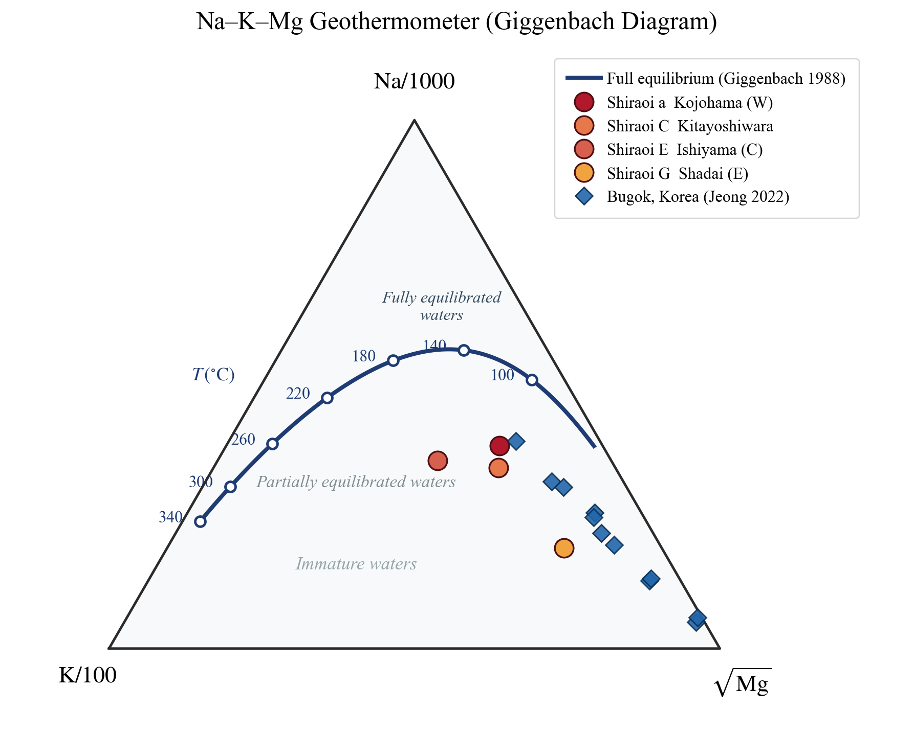
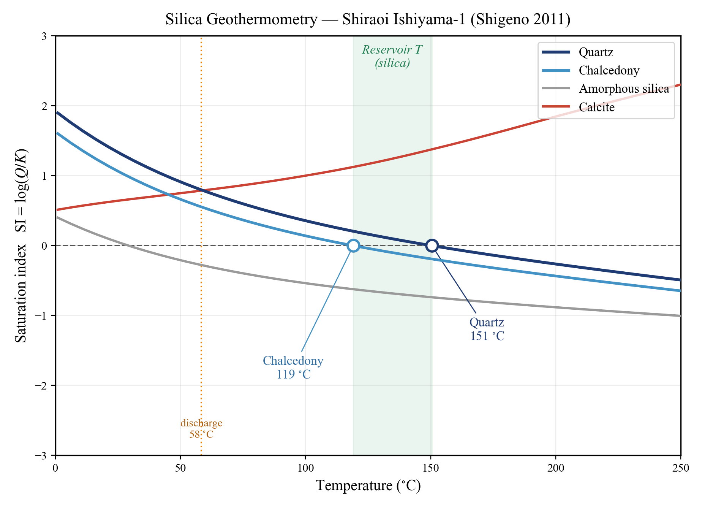
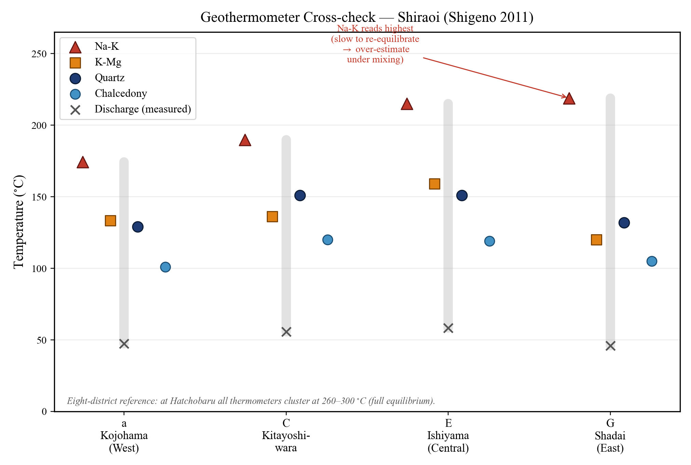

## 掘らずに、地下の温度を知る

温泉に浸かっているとき、その湯がかつて地下数キロメートルの深部で何度だったかを、掘削せずに言い当てられるとしたら、どうだろうか。実はそれができる。温泉水や地熱流体の化学組成を分析するだけで、地下深部の貯留層の温度を推定する——それが **地化学温度計（geothermometer）** である。

日本はアメリカ・インドネシアに次ぐ世界第3位の地熱資源ポテンシャル（約2,347万kW）をもつ火山国である。しかしその利用は設備容量にして潜在量の数パーセントにとどまっている。大規模地熱発電所の建設は、開発着手から運転まで約10年という長いリードタイムと、掘削の空振りという開発リスクを抱える。掘削に先立って地下の温度・深度・広がりを地表から推定する地化学探査こそ、地熱開発の要となる（堤・石橋, 2022）。

本記事では、この地化学温度計を「そういう便利な手法がある」で終わらせず、**たった一つの原理**から解き起こし、「では実情はどうなのか——本当に当たるのか」という問いに正面から答えたい。

------------------------------------------------------------------------

## 前回の「平衡」が、そのまま温度計になる

[#15](/posts/groundwater/groundwater-sci15/) では、湧水の水質が水と鉱物の反応によってやがて化学平衡に達し、「熟成」していく様子を、霧島の低温（約15℃）の地下水で見た。地化学温度計は、この平衡の **高温版** にほかならない。

化学反応の平衡定数 $K$ は温度に依存する。ギブズの自由エネルギー変化と平衡定数の関係

$$\Delta G^{\circ} = -RT \ln K$$

が示すように、温度が変われば平衡の位置も変わる。逆に言えば、**水と鉱物が高温の貯留層で平衡に達したなら、そのときの温度が水の化学組成に"刻み込まれる"**。水はその記録を保ったまま地表へ上昇してくる。地化学温度計とは、この刻まれた温度を読み取る技術である。

したがって #16 は、[#14](/posts/groundwater/groundwater-sci14/)（同位体が語る水の"年齢"）、[#15](/posts/groundwater/groundwater-sci15/)（水岩反応が語る"熟成度"）に続く、「**水が自らの履歴を語る**」三部作の最終章——"温度"の章にあたる。

------------------------------------------------------------------------

## 舞台：地熱系というシステム

地化学温度計を理解するには、まず舞台を押さえておきたい。地熱系（geothermal system）とは、地下に浸透した水が移動しながら加熱される一連のシステムである（堤・石橋, 2022）。

降水（天水）が地下に浸透し、マグマや高温貫入岩体という熱源に近づくと加熱される。温まった水は密度が下がり、浮力で上昇する。途中に不透水層（キャップロック）があれば、その下の多孔質岩体や断層破砕帯に高温流体が溜まって **地熱貯留層** を形成する。上昇した流体が地表に達すれば、噴気や温泉となって湧き出す（@fig-system）。

{#fig-system}

私たちが地表で採取できるのは、この最後の「温泉水」である。そこから、見ることのできない深部貯留層の温度を逆算するのが、地化学温度計の仕事である。

------------------------------------------------------------------------

## 陽イオンが語る温度 — Giggenbach の Na-K-Mg 図

原理は一つだが、その現れ方には二つの系統がある。第一は **陽イオン** である。

高温の貯留層では、水がアルカリ長石（曹長石 NaAlSi₃O₈ と カリ長石 KAlSi₃O₈）と反応し、ナトリウムとカリウムの交換平衡に達する。この平衡は温度依存性をもつため、**Na/K 比が温度計になる**（Na-K 温度計）。一方、マグネシウムは低温で粘土鉱物に速やかに取り込まれて水から失われるため、**K²/Mg 比** は比較的低温・浅部の状態を敏感に映す（K-Mg 温度計）。Giggenbach (1988) は次の二式を与えた。

$$T_{\mathrm{Na\text{-}K}} = \frac{1390}{1.75 + \log(\mathrm{Na/K})} - 273.15 \quad (^{\circ}\mathrm{C})$$

$$T_{\mathrm{K\text{-}Mg}} = \frac{4410}{14.0 - \log(\mathrm{K^2/Mg})} - 273.15 \quad (^{\circ}\mathrm{C})$$

この二つの温度計が同じ温度を示す点をつないだ曲線が、**完全平衡線（full equilibrium）** である。Giggenbach は Na/1000・K/100・√Mg を三頂点にとる三角図を考案し、水がこの曲線に乗るか否かで、平衡の"成立度"を判定できるようにした（@fig-giggenbach）。

{#fig-giggenbach}

@fig-giggenbach を見てほしい。白老（北海道）も Bugok（韓国）の温泉水も、完全平衡線から √Mg 側へ外れて分布している。これは **マグネシウムが残っている** こと、すなわち **部分平衡（partial equilibrium）**——地表へ上がる途中で冷たい地下水が混ざったことを意味する。とりわけ白老の東部・社台（G）や、Bugok の一部は最も未成熟（immature）側に落ちる。逆に、深部平衡に近い白老中部（石山E・北吉原C）は完全平衡線寄りである。この一枚が、後で述べる「実情」を読み解く鍵になる。

------------------------------------------------------------------------

## シリカが語る温度 — シリカ温度計

第二の系統は **シリカ** である。石英・玉髄・非晶質シリカといったシリカ鉱物の溶解度は、温度が上がるほど大きくなる。したがって、水に溶けている溶存シリカ（SiO₂）の量から、その水が最後にシリカ鉱物と平衡にあった温度——貯留層温度——を逆算できる（Fournier and Potter, 1982）。

これを実際に計算してみよう。地球化学計算プログラム **PHREEQC** を使い、白老・石山の温泉水の組成を固定したまま温度だけを 0℃から250℃へ掃引し、各鉱物の **飽和指数（SI = log(Q/K)）** がゼロを横切る温度を読む。SI＝0 こそ、その鉱物と水が平衡にある温度である。

{#fig-silica}

結果は雄弁である（@fig-silica）。**石英で151℃、玉髄で119℃**。湧出温度のわずか58℃をはるかに上回る。すなわち「地表に出てきた温い湯は、地下ではずっと熱かった」。この石英151℃という値は、Shigeno (2011) が白老・石山について報告したシリカ温度計の推定温度（140〜160℃）とよく一致する。手法が正しく機能していることの確認である。

なお、二点補足しておきたい。第一に、石英と玉髄で30℃以上の差が出る。一般に高温系では石英が、中低温系では玉髄が溶解度を支配するため、白老のような中低温の系では玉髄温度計のほうが実温度に近い可能性がある。**どの鉱物で読むかで答えが変わる**——これも地化学温度計の"実情"である。第二に、方解石（CaCO₃）だけは温度が上がるほど SI が増える。炭酸カルシウムは温度上昇で溶解度が下がる **逆溶解度** をもつためで、これは温泉の湯の花や配管スケール（析出による目詰まり）の原因に直結する現象である。

------------------------------------------------------------------------

## 実情はどうなのか — 三つの温泉が見せる三つの顔

さて、本題である。地化学温度計は本当に信頼できるのか。答えは「**平衡に達していれば信頼でき、達していなければ注意を要する**」であり、それは同じ枠組みで説明できる。三つの温泉を対置しよう。

**八丁原（大分・九州）— 一致する顔。** 八丁原地熱発電所の中性・Cl型流体は、Giggenbach 図の完全平衡線の近くにプロットされる。しかも Na-K・K-Mg・シリカのいずれの温度計も 260〜300℃でほぼ一致する（堤・石橋, 2022）。**複数の独立な温度計が一致すること自体が、貯留層で流体と鉱物が十分に平衡に達している動かぬ証拠** であり、安定した高温貯留層の存在を裏づける。地化学温度計が最も頼りになる典型例である。

**白老（北海道）— 混ざった顔。** 先に見たとおり、シリカ温度計はそのまま読めば石英151℃を示す。しかし Giggenbach 図では部分平衡の領域にあり、Na-K 温度計は 200〜250℃というさらに高い値を返す。この食い違いは、深部の本源的な高温流体（Shigeno は混合水モデルから約250℃と推定）が、上昇の途中で冷たい浅層地下水と混合したために生じる。**温度計の値をそのまま鵜呑みにすれば、混合の分だけ真の貯留層温度を過小評価してしまう**。白老は、混合という現実を織り込まねばならない例である。

**Bugok（韓国）— ずれる顔。** 非火山地域にある Bugok 温泉では、K-Mg 温度計が 90〜126℃を示すのに対し、Na-K 温度計は 152〜166℃と大きくずれる（Jeong et al., 2022）。Na-K 温度計は混合や冷却に対して応答が遅く、中温域では過大評価しやすい。ここでは、より速く再平衡する K-Mg 温度計のほうが妥当と判断される。**温度計どうしがずれたとき、どちらを信じるべきかを見極める**——それが実務の腕の見せどころである。

この「一致するか、ずれるか」は、白老の4地区を並べてみると一目で分かる（@fig-crosscheck）。

{#fig-crosscheck}

------------------------------------------------------------------------

## ゆえに、「平衡に達しているか」を毎回問う

三つの顔が教えるのは、次の一点に尽きる。地化学温度計は強力だが、その大前提は「**水と鉱物が平衡に達していること**」である。ゆえに、使うたびにこの前提が成り立っているかを問わねばならない。

その審判こそが Giggenbach の Na-K-Mg 図である。水が完全平衡線に乗れば温度計を信頼でき、√Mg 側へ外れていれば部分平衡や混合を疑う。そして最も確かな検証は、**独立な複数の温度計（Na-K・K-Mg・シリカ）が互いに一致するかどうか** を見ることである。一致すれば信じ、ずれたらその原因（混合・沸騰・非平衡）を考える。これが「実情」の正体である。

------------------------------------------------------------------------

## 自分の手で確かめる — PHREEQC による再現

本記事の温度掃引図（シリカ温度計）は、読者自身が手を動かして再現できる。PHREEQC で温泉水の実測組成を入力し、`REACTION_TEMPERATURE` で温度を掃引して各鉱物の SI を出力するだけである。SI がゼロを横切る温度が、その鉱物温度計の答えとなる。方解石の逆溶解度も、同じ計算のなかで自然に現れる。具体的な入力デックの作り方は、[PHREEQC入門シリーズ](/posts/phreeqc/) の平衡計算の回を参照されたい。

------------------------------------------------------------------------

## 限界と、その先へ

地化学温度計は万能ではない。平衡の前提に加え、上昇途中の沸騰・二相分離（気液分離）や、本記事で繰り返し見た混合が、値を歪める。それゆえ、単独の数値を信じるのではなく、複数の指標を組み合わせた総合判断が求められる（堤・石橋, 2022）。

さらに、温度計に **同位体**（[#14](/posts/groundwater/groundwater-sci14/) で扱った δD・δ¹⁸O）を組み合わせれば、温度だけでなく水の起源（天水か、マグマ起源流体か）まで見通せる。近年は深度3〜5 kmに400℃を超える超臨界流体を狙う「超臨界地熱」の開発研究も進み、地化学探査への期待はいっそう高まっている。

温泉の化学は、地下の温度を語る。その声を正しく聞くには、「平衡に達しているか」を問い続ける姿勢こそが要る——それが、掘らずに地下を読む技術の核心である。

## 次回予告

[#11](/posts/groundwater/groundwater-sci11/) から本回まで、六回にわたって水に溶けた成分から地下を読んできた。次回より、シリーズは新しい部へ入る。主題は、地球そのものの動き——地震と火山である。

その一本目で扱うのは、**井戸は地球の歪み計である**という見方である。[#6](/posts/groundwater/groundwater-sci06/) では大気圧に、[#9](/posts/groundwater/groundwater-sci09/) では海洋潮汐に地下水位が応答することを見た。同じ井戸は、地殻の歪みにも応答する。地震の瞬間に水位が階段状に飛び、噴火の前に水位がゆらぎ、地震の後には湧水の量が変わる——井戸が見せるその三つの顔を、有珠山と Loma Prieta の観測例から追っていく。

------------------------------------------------------------------------

### 参考文献

- 堤 彩紀・石橋純一郎 (2022) 地化学探査—地熱資源の利用に向けた地球化学の応用. 地学雑誌 131(6), 597–607.
- Giggenbach, W.F. (1988) Geothermal solute equilibria. Derivation of Na-K-Mg-Ca geoindicators. *Geochimica et Cosmochimica Acta* 52, 2749–2765.
- Fournier, R.O. and Potter, R.W. II (1982) A revised and expanded silica (quartz) geothermometer. *Geothermal Resources Council Bulletin* 11(10), 3–12.
- 茂野 博 (2011) 北海道 胆振地方，白老地域と周辺3広域地域の「温泉水」の地球化学・同位体化学的な特徴と起源. 地質調査研究報告 62(3/4), 143–176.
- Jeong, C., Lee, Y., Lee, Y., Ahn, S., Nagao, K. (2022) Geochemical Composition, Source and Geothermometry of Thermal Water in the Bugok Area, South Korea. *Water* 14, 3008.
