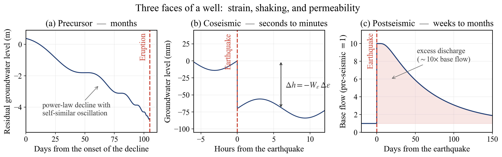
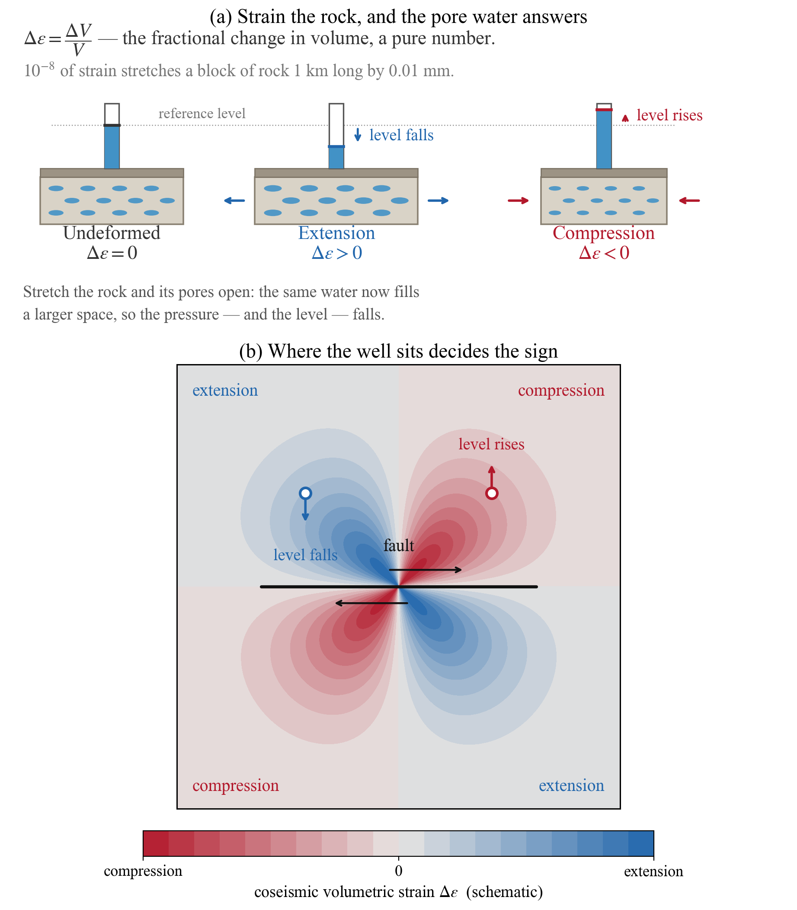
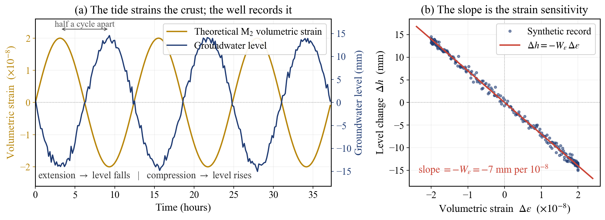
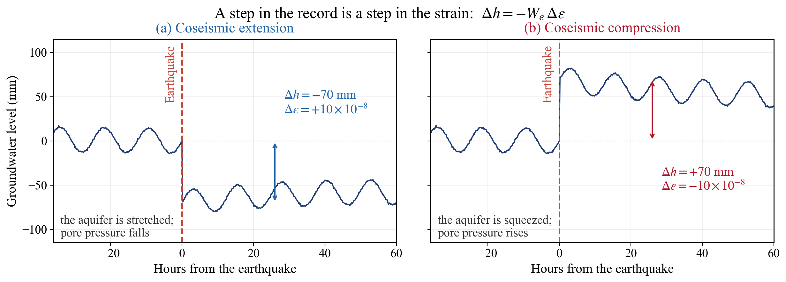
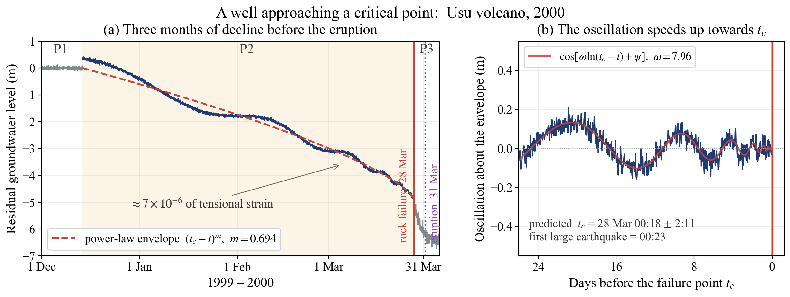
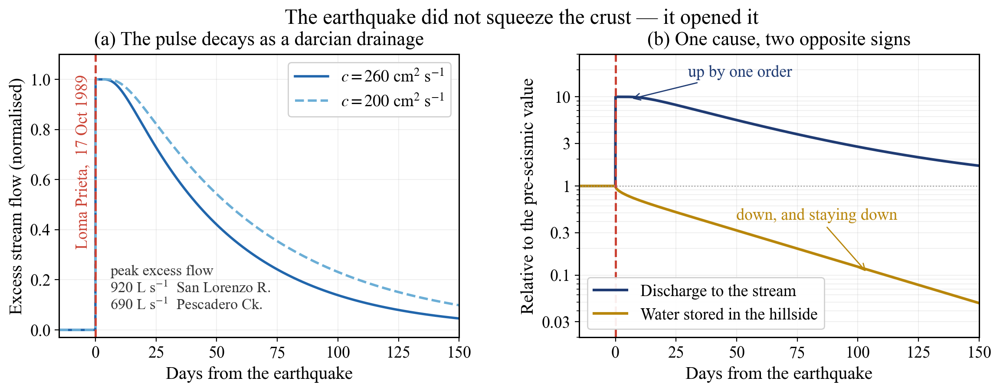

## 井戸は、地球の動きを記録している

2003年9月26日、十勝沖でマグニチュード8.0の地震が起きた。このとき北海道各地の観測井では、地下水位が地震の瞬間に**階段状に飛んだ**。数十ミリメートル下がった井戸もあれば、上がった井戸もある。揺れが収まったあとも、水位は元の高さには戻らなかった。

これは井戸が揺れたのではない。**地殻そのものが変形し、その変形が帯水層の間隙水圧に伝わった**結果である。言い換えれば、井戸は地震計ではなく——**歪み計**として働いたのである。

本記事では、地震・噴火という地球のダイナミクスを、地下水位という一本の時系列から読み取る技術を扱う。舞台は三つある。北海道の19観測井、2000年の有珠山噴火、そして1989年の Loma Prieta 地震である。

------------------------------------------------------------------------

## 井戸が見せる三つの顔

地震や噴火に対して、地下水は一つの応答をするのではない。**時間スケールの異なる三つの顔**を見せる（@fig-timeline）。

{#fig-timeline}

**前兆（数か月）**は、破壊に向かう岩盤が発する微弱な信号である。**同時（数秒〜数分）**は、断層運動が周囲の地殻に与える静的な体積歪みへの弾性応答である。**事後（数週間〜数か月）**は、揺れによって割れ目が開き、地殻の透水性そのものが変わってしまう非可逆な変化である。

三つはまったく別の物理である。しかし、いずれも同じ一本の水位記録に現れる。本記事は、この三つを順に解いていく。技術的な中心は、二番目の「同時」——ポロエラスティシティである。

------------------------------------------------------------------------

## 復習：井戸は外力に応答する

本題に入る前に、このシリーズでここまで積み上げてきた見方を確認しておきたい。

[#6](/posts/groundwater/groundwater-sci06/) では、別府の不圧地下水位が**大気圧**の変動に応答することを見た。気圧が上がれば帯水層は上から押され、水位は下がる。[#9](/posts/groundwater/groundwater-sci09/) では、南大東島の地下水位が**海洋潮汐**に応答し、その位相の遅れから帯水層の透水係数を推定できることを見た。

この二つに共通するのは、**井戸が「外から加わる力」を記録する装置である**という見方である。気圧は上からの荷重、潮汐は海水の荷重と地球そのものの変形。ならば、地震が地殻に与える歪みもまた、同じ井戸が記録できるはずである。

本記事は、この見方を**地殻歪み**へ地続きに拡張する回にあたる。使う道具も同じである。潮汐の分潮を取り出すために [#9](/posts/groundwater/groundwater-sci09/) で使った調和解析が、そのまま歪み計の較正に使われる。

------------------------------------------------------------------------

## 同時 — 地震の歪みを水位で測る

### まず「体積歪み」を掴む

この節の主役は **体積歪み（volumetric strain）** $\Delta\varepsilon$ である。難しそうな名前だが、中身はごく単純で、**体積が何割変わったか**を表す数にすぎない。

$$\Delta\varepsilon = \frac{\Delta V}{V}$$

体積を体積で割っているので**単位を持たない**（無次元である）。伸ばされて体積が増えれば正、押されて縮めば負、と符号を決める。

大きさの感覚をつけておきたい。地震学で扱う歪みは $10^{-8}$ から $10^{-6}$ 程度である。$10^{-8}$ とは、**1 km の岩盤が 0.01 mm だけ伸びる**という量である。目にも測量にも見えない。それでも、この微小な変形が井戸の水位を数ミリメートル動かす。井戸が優れた歪み計である理由がここにある。

なぜ体積の変化が水位に現れるのか。@fig-strain の左が、その一部始終である。

{#fig-strain}

要点は一行にまとまる。**岩の骨格が伸びれば間隙が広がる。同じ水がより広い空間に置かれれば、圧力は下がる。** 観測管の水位は、その圧力を目に見える高さに置き換えたものにすぎない。

そして @fig-strain の右が示すように、断層のまわりでは伸張域と圧縮域が四象限状に並ぶ。**同じ地震でも、井戸がどこに立っているかで水位は下がりもすれば上がりもする。**

### 一つの式に落とす

以上を式にすると、被圧帯水層では地下水位の変化 $\Delta h$ と体積歪みの変化 $\Delta\varepsilon$ が線形の関係で結ばれる。

$$\Delta h = -\frac{B K_u}{\rho_w g}\,\Delta\varepsilon = -W_{\varepsilon}\,\Delta\varepsilon$$

記号は以下のとおりである（Jacob, 1940；Wang, 2000）。

| 記号 | 名称 | 意味・単位 |
|---|---|---|
| $\Delta h$ | 地下水位の変化 | 観測されるもの。m または mm |
| $\Delta\varepsilon$ | 体積歪みの変化 | 知りたいもの。$\Delta V/V$、無次元 |
| $W_{\varepsilon}$ | **歪み感度** | 歪み1あたり水位が何m動くか。m。井戸ごとの「較正値」 |
| $B$ | スケンプトン係数 | 岩体に加えた応力のうち、間隙水圧が受け持つ割合。0〜1、無次元 |
| $K_u$ | 非排水体積弾性率 | 水を逃がさずに岩体を圧縮するときの硬さ。Pa（GPa単位で扱う） |
| $\rho_w$ | 水の密度 | 約 1000 kg m⁻³ |
| $g$ | 重力加速度 | 約 9.8 m s⁻² |

$B$ と $K_u$ は岩石の性質、$\rho_w g$ は圧力を水柱の高さに換算するための係数である。三つをまとめた $W_{\varepsilon}$ ひとつを知れば、水位から歪みが読める。

**負号が本質的である。** 体積歪みが正（伸張）のとき、水位は下がる。@fig-strain で見たとおりである。

$W_{\varepsilon}$ は帯水層ごとに異なる。同じ大きさの歪みを受けても、硬い岩の帯水層と軟らかい堆積層とでは水位の飛び方が違う。**つまり $W_{\varepsilon}$ を知ることは、その井戸を歪み計として「較正」することにほかならない**。

### 較正は、月が行ってくれる

では $W_{\varepsilon}$ をどう決めるか。ここで潮汐が効いてくる。

月と太陽は、毎日確実に地殻を変形させている。その理論的な体積歪みは、地球潮汐と海洋潮汐荷重を計算すれば求められる（Shibata et al. 2010 は GOTIC2 を使用）。一方、観測された水位から同じ周期の成分を取り出せばよい。M₂ 分潮（周期 12.4206 時間）は潮汐歪みのなかで振幅が最大であり、しかも周期が 12 時間を超えるため、気温や気圧の日周変動のピークから離れている——これが M₂ を選ぶ理由である。

$$W_{\varepsilon}^{(M_2)} = \frac{T_W}{T_T}$$

$T_W$ は水位の M₂ 振幅、$T_T$ は理論体積歪みの M₂ 振幅である。水位側の振幅と位相の抽出には、ベイズ型潮汐解析プログラム **BAYTAP-G** が用いられる。

@fig-strainmeter が、この較正の全体像である。

{#fig-strainmeter}

左の図で、二つの曲線は鏡像のように動いている。この**逆位相**こそが、式の負号の見える姿である。右の図では、同じ記録が一本の直線に折り畳まれる。傾きが $-W_{\varepsilon}$ である。

### 地震が来ると、直線が跳ねる

較正が済めば、あとは読むだけである。地震が起きると、断層のすべりは周囲の地殻に静的な体積歪みの階段を刻む。膨張する領域と圧縮される領域が、断層をはさんで四象限状に分布する。

$$\Delta h_{\text{eq}} = -W_{\varepsilon}^{(E)}\,\Delta\varepsilon_{\text{eq}}$$

@fig-coseismic は、同じ大きさの歪みステップに対して、伸張域の井戸と圧縮域の井戸がどう応答するかを並べたものである。

{#fig-coseismic}

**ステップの符号が、その場所の歪みの符号を教える**。振幅は歪みの大きさを教える。井戸は、地表に穿たれた歪み計として機能している。

### 二つの答えは合うのか

ここからが Shibata et al. (2010) の核心である。彼らは北海道の**19観測井**について、$W_{\varepsilon}$ を**二通りの独立な方法**で推定し、突き合わせた。

一つは上に述べた潮汐からの $W_{\varepsilon}^{(M_2)}$。もう一つは、1993年から2004年にかけて発生した**マグニチュード7以上の6地震**——1993年釧路沖（M7.6）、1993年北海道南西沖（M7.8）、1994年北海道東方沖（M8.1）、1994年三陸はるか沖（M7.5）、2003年十勝沖（M8.0）、2004年釧路沖（M7.1）——による水位ステップから求めた $W_{\varepsilon}^{(E)}$ である。地震時の理論体積歪みは Okada (1992) の計算コードで求めている。

**結果として、二つの推定値は良好な直線相関を示した。** まったく異なる二つの外力——月の潮汐と断層の破壊——から同じ係数が得られたということは、地下水位の応答が線形ポロエラスティシティという一つの枠組みで説明できることを意味する。

さらに彼らは、気圧応答から得られる**載荷効率（loading efficiency）**$\gamma$ も求めている。これは [#6](/posts/groundwater/groundwater-sci06/) で扱った気圧応答そのもので、**大気圧が 1 上がったときに間隙水圧が何割上がるか**を表す無次元量である。19井で $\gamma = 0.16$〜$0.62$ であった。この $\gamma$ と $W_{\varepsilon}$ を組み合わせると、帯水層の**一軸非排水体積弾性率** $K_v^{(u)}$ が算出できる。得られた値は、室内試験で知られる砂岩の 13〜47 GPa、花崗岩の 61〜66 GPa（Wang, 2000）とおおむね一致した。

つまり——**井戸の水位という、ただの一本の時系列から、地下の岩石の硬さが読める**。これは驚くべきことである。

### 合わない井戸もある

ただし、19井のすべてが素直だったわけではない。8つの井戸（AB, NW, OB6, SK, SR2, TS, YC, YN）では、水位の潮汐応答の**位相が理論歪みとずれていた**。

このうち OB6 と TS を除く6井は、いずれも**海岸から2 km以内**に位置する。これらの井戸では、M₂ 潮汐体積歪みのうち海洋潮汐荷重の寄与が地球潮汐の寄与の**80%を超えて**いた。海洋潮汐荷重の理論計算そのものが不確かであるか、あるいは海から帯水層への直接の水の流入といった、式に入っていない現象が効いている可能性がある。

論文はこの不一致を隠さずに書いている。**線形ポロエラスティシティは、すべての観測を説明できるわけではない**。この正直さが、次の話につながる。

------------------------------------------------------------------------

## 前兆 — 噴火の前に、地下水が動く

### 有珠山 2000年

2000年3月31日13時07分、北海道の有珠山が噴火した。この噴火の**3か月前**から、山の北側2 km以内にある深さ1200 mの観測井 GSH-1 で、奇妙なことが起きていた。

この井戸は珪化岩の被圧割れ目帯水層に達しており、その水位は帯水層の間隙水圧を素直に示す。気圧と地球潮汐の効果を BAYTAP-G で除去した残差水位を見ると、記録は三つの期間に分かれた（Shibata, Matsumoto & Akita, 2003）。

- **P1**（1999年12月14日 6時まで）：定常的な変動
- **P2**（12月14日 6時〜2000年3月28日 0時）：**べき乗則的に減少しながら、自己相似的に振動**
- **P3**（3月28日 0時以降）：不規則な低下

3月27日20時頃から山体直下で微小地震と地殻変動が急増し、28日0時23分にはより大きな地震が観測された。**P2 の終わりは、岩盤が本格的に破壊を始めた時刻に一致する**。

P2 の水位低下は約5 mに達した。潮汐応答から求めた歪み感度（7 mm あたり $10^{-8}$ 歪み）を通して読み替えると、これは **$7\times10^{-6}$ を超える伸張歪み**に相当する。マグマの上昇が、周囲の岩盤を静かに引き伸ばしていたのである。

### 破壊に近づく系の、独特のリズム

ここからが面白い。彼らはこの水位変動に、**対数周期振動（log-periodic oscillation）**のモデルを当てはめた。

$$f(t) = A + B\,(t_c - t)^{m}\left\{1 + C\cos\left[\omega\ln(t_c - t) + \psi\right]\right\}$$

記号はこうである。$f(t)$ が時刻 $t$ における残差水位、$t_c$ が**臨界破壊点**——岩盤が壊れる時刻そのもの。$m$ は破壊点への**近づき方の速さ**を決める臨界指数、$\omega$ は**振動の細かさ**を決める臨界指数である。$A$・$B$・$C$・$\psi$ は当てはめで決まる定数で、$A$ は最終的な水位、$B$ は下がり幅、$C$ は振動の振幅、$\psi$ は振動の位相にあたる。

式の中身を言葉にすると、こうなる。前半の $(t_c-t)^m$ が、破壊点に向かってなめらかに下がっていく**背骨**である。後半の $\cos[\omega\ln(t_c-t)+\psi]$ が、その背骨のまわりの**揺れ**を作る。ここで対数 $\ln$ が入っているのが肝で、振動は**対数時間で等間隔に**——つまり実時間ではどんどん速く——繰り返す。微小クラック同士の相互作用が階層構造をもつとき、自然に現れる形とされる。

@fig-precursor がその再構成である。

{#fig-precursor}

当てはめの結果、臨界指数は $m = 0.694 \pm 0.006$、$\omega = 7.96 \pm 0.05$ となった。$\omega$ は既往研究の範囲（6〜12）に収まっている。パワースペクトルは P2・P3 で指数 1.77 のべき乗則に従い、そこから求めたフラクタル次元 $D = 2.62$ は、岩石破壊のアコースティック・エミッション実験で得られている 2.25〜2.75 に近い。

そして最も印象的な結果——**予測された破壊点 $t_c$ は3月28日0時18分（±2時間11分）**であり、実際に大きな地震が起きたのは**0時23分**であった。

### ただし、これは「予知」ではない

この結果は魅力的である。しかし、ここで踏みとどまる必要がある。

論文自身が正直に書いているとおり、データ期間を伸ばしながら $t_c$ を再推定していくと、**推定値は安定しなかった**。1月30日までは $m$ と $\omega$ が落ち着き、$t_c$ も3月23日付近に定まっていた。ところが2月20日頃から $t_c$・$m$・$\omega$ がいずれも増大し始め、3月初めに最大となり、3月の中頃から末にかけて2月の値へ戻る、という動きを見せた。著者らはこれを解析上の不安定ではなく、実際の地殻歪みや微小クラックの蓄積の変化を反映したものと考えている。

**事後に振り返れば見事に当たっている。しかし、その渦中にいて「いまが2月20日なのか3月20日なのか」を判定する術は、この方法には無い。** 地下水の前兆現象は、再現性と特異性——ほかの原因では起きないと言えるか——をめぐる議論が今も続いている領域である。本記事は、これを「噴火が予知できる」という話としては扱わない。**破壊に向かう岩盤が、地下水位という窓を通して独特のリズムを見せることがある**——そこまでが、いま言えることである。

------------------------------------------------------------------------

## 事後 — 地震は、地殻の透水性を変える

### Loma Prieta 1989年

1989年10月17日、カリフォルニアで Loma Prieta 地震が発生した。震央周辺では、三つの変化が観測された（Rojstaczer, Wolf & Michel, 1995）。

1. **河川の流量が急増した**——多くの観測点で地震の**15分以内**に
2. **河川水のイオン濃度が上昇した**——ただし**組成比は変わらなかった**
3. **地下水面が低下した**——地震後、数週間から数か月かけて

大地震のあとに湧水や河川の流量が増えるのは、以前から広く知られていた現象である。その説明として、二つの機構が争っていた。

**説A：弾性圧縮**。地震が上部から中部の地殻を圧縮し、深部にあった水が絞り出されて地表に達する。これが正しければ、地震後の湧水を採取することは**深部の流体を採取すること**を意味する。

**説B：浅部の透水性増大**。強い揺れが浅い地殻の割れ目を開き、水が流れやすくなる。これが正しければ、観測されるのは**浅部のレオロジー**の情報にすぎない。

含意がまるで違う。どちらが正しいかは、地震と流体の関係をどう理解するかの根幹に関わる。

### 決め手は「地下水面が下がった」こと

Rojstaczer らが挙げた決定的な観測は、三番目の変化であった。

**破壊帯から15 km以上離れた地点でも、地下水面が低下していた。** しかも、そこは河川流量の増加が観測された地域である。弾性圧縮説では、これは説明できない。圧縮によって深部から水が押し上げられるのなら、地下水面はむしろ上がるはずである。

透水性増大説なら、両方を一度に説明できる。**割れ目が開けば、斜面から河川への地下水の流出が速くなる。しかし涵養は増えない。結果として貯留量が減り、地下水面は下がる。** 河川に出ていく水が増えることと、地下に残る水が減ることは、同じ一つの原因の裏表である（@fig-permeability）。

{#fig-permeability}

### 数字で確かめる

論文は定性的な議論にとどまらない。**基底流量は地震後の数日で約一桁増加した**。これは流域の平均透水性が平均して約一桁増えたことを意味する。そのためには、透水性を支配している開口割れ目の径が**数十から数百マイクロメートル**増えればよい。地震前の流域平均の透水率は約10ミリダルシーと見積もられており、この程度の割れ目の拡大は、この地域の脆弱な浅部地殻にとって無理のない量である。

さらに彼らは、単純なダルシー流の拡散モデルで超過流量の減衰を再現した。斜面の地下水面が三角形の初期形状から排水していく問題を解くと、流量は

$$v = \frac{4k\rho g w}{\eta L}\sum_{n=0}^{\infty}\frac{(-1)^n}{2n+1}\exp\left[-\frac{(2n+1)^2\pi^2 c\,t}{4L^2}\right]$$

と表される。$v$ が河川へ流れ込む地下水の流束、$k$ が**透水率（permeability）**、$\rho$ が水の密度、$\eta$ が水の粘性係数、$w$ が河川に対する地下水面の最大の高さ、$L$ が地下水の流路の最大長、$c$ が**水理拡散係数**——圧力の変化が地層中を伝わる速さを表す量である。$n$ についての無限和は、斜面にたまった水が抜けていく過程を重ね合わせで表したもので、$n$ が大きい項ほど速く消えるため、時間が経つと最初の項だけが残って指数関数的な減衰になる。

San Lorenzo 川（ピーク超過流量 920 L/s）と Pescadero 川（同 690 L/s）の観測は、$c = 260$ および $200$ cm² s⁻¹ でよく再現された。この地震が生んだ超過流量の総量は $1.1\times10^{7}$ m³ に達し、その約65%をこの二つの流域が占めていた。

**地震は地殻を絞ったのではない。開いたのである。**

------------------------------------------------------------------------

## なぜ、地下水がセンサーになるのか

三つの舞台を見終えたところで、根っこにある理屈を一つにまとめておきたい。

地殻に力が加わると、岩石の骨格が変形する。骨格が変形すれば、その隙間——間隙——の容積が変わる。間隙が水で満たされ、かつ**その水がすぐには逃げられない**とき、容積の変化はそのまま**間隙水圧の変化**になる。井戸の水位は、その間隙水圧を目に見える形にしたものにすぎない。

$$\text{応力・歪み} \longrightarrow \text{間隙容積の変化} \longrightarrow \text{間隙水圧の変化} \longrightarrow \text{水位の変化}$$

この連鎖が成り立つための条件は二つある。**帯水層が被圧であること**——上を不透水層に蓋されていて、圧力が逃げないこと。そして**変形が十分に速いこと**——水が横に流れて圧力を均してしまう前に、測定が終わること。地震時のステップが線形ポロエラスティシティでよく説明されるのは、この二条件が満たされているからである。

逆に、この条件が崩れるとき、線形の枠組みも崩れる。長い時間が経てば水は流れて圧力は緩和する。揺れが強ければ割れ目そのものが変わり、そもそも「同じ帯水層」ではなくなる。**Shibata らのポロエラスティシティと Rojstaczer らの透水性増大は、対立する説ではない。同じ現象の、時間スケールの違う二つの層である。**

そして、この見方はここで終わらない。地殻の変形は水の**量**だけでなく、水の**質**にも現れる。地震前後の湧水でラドン濃度や溶存ガス組成が変化する例は数多く報告されている。それは本シリーズの後半で扱いたい主題である。

------------------------------------------------------------------------

## まとめ — 潮汐から地震へ、同じ井戸、同じ考え方

本記事で扱ったことを、時間スケールの順に並べ直しておく。

| 時間スケール | 現象 | 機構 | 可逆性 |
|---|---|---|---|
| 数秒〜数分 | 地震時の水位ステップ | 線形ポロエラスティシティ $\Delta h = -W_{\varepsilon}\Delta\varepsilon$ | 弾性・ほぼ可逆 |
| 数か月（前） | 噴火前の水位低下と振動 | 岩盤の臨界現象・微小クラックの蓄積 | — |
| 数週間〜数か月（後） | 湧水・河川流量の増加 | 浅部地殻の透水性増大 | 非可逆 |

[#6](/posts/groundwater/groundwater-sci06/) で気圧に応答した井戸、[#9](/posts/groundwater/groundwater-sci09/) で潮汐に応答した井戸、そして本記事で地震の歪みに応答した井戸は、**すべて同じ井戸である**。加わる外力が違うだけで、読み方の枠組みは一つである。気圧応答から載荷効率が、潮汐応答から歪み感度が、そして地震時ステップから地殻の変形が読める。**同じ観測記録が、問いを変えるだけで別の答えを返してくる**——これが時系列解析という道具の力である。

そして忘れてはならないのは、これらすべてが**すでに各地で取られている水位記録**から得られたということである。新しい観測網を作ったのではない。温泉井や生活用水の井戸に設置された水位計が、十年にわたって10分間隔で、5〜10 mmの精度で測り続けてきた記録——それを読み直しただけである。**足元に、まだ読まれていないデータがある。**

------------------------------------------------------------------------

## 次回予告

本回では、地殻の変形が地下水位に現れることを見た。次回は、その変形を引き起こしている側——**マグマ**そのものへ降りていく。

火山の下では何が起きているのか。マグマから分離した高温の流体は、周囲の岩石とどう反応し、どのような水になって地表へ現れるのか。[#16](/posts/groundwater/groundwater-sci16/) で扱った地化学温度計は「温度」を教えてくれたが、その熱の**源**には踏み込まなかった。次回はそこを埋める。有珠山の水位を動かしていたマグマの上昇を、化学の側から読み直す回になる。

------------------------------------------------------------------------

### 参考文献

- Shibata, T., Matsumoto, N., Akita, F. (2003) Fluctuation in groundwater level prior to the critical failure point of the crustal rocks. *Geophysical Research Letters* 30(1), 1024. doi:10.1029/2002GL016050
- Shibata, T., Matsumoto, N., Akita, F., Okazaki, N., Takahashi, H., Ikeda, R. (2010) Linear poroelasticity of groundwater levels from observational records at wells in Hokkaido, Japan. *Tectonophysics* 483, 305–309. doi:10.1016/j.tecto.2009.10.025
- Rojstaczer, S., Wolf, S., Michel, R. (1995) Permeability enhancement in the shallow crust as a cause of earthquake-induced hydrological changes. *Nature* 373, 237–239.
- Jacob, C.E. (1940) On the flow of water in an elastic artesian aquifer. *Transactions, American Geophysical Union* 21, 574–586.
- Roeloffs, E.A. (1996) Poroelastic techniques in the study of earthquake-related hydrologic phenomena. *Advances in Geophysics* 37, 135–195.
- Okada, Y. (1992) Internal deformation due to shear and tensile faults in a half-space. *Bulletin of the Seismological Society of America* 82, 1018–1040.
- Tamura, Y., Sato, T., Ooe, M., Ishiguro, M. (1991) A procedure for tidal analysis with a Bayesian information criterion. *Geophysical Journal International* 104, 507–516.
- Wang, H.F. (2000) *Theory of Linear Poroelasticity with Applications to Geomechanics and Hydrogeology*. Princeton University Press.
