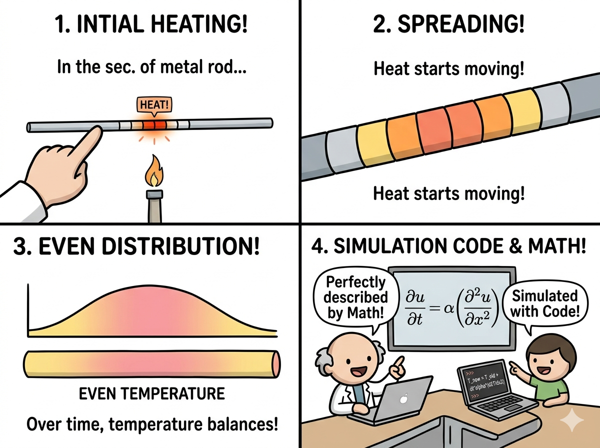

## この記事を読む前に：そこまで難しくないですよ

「偏微分方程式」という言葉を見ただけで、ページを閉じたくなる気持ちはよくわかります。でも安心してください。この記事では数式の厳密な証明はしません。

**ゴールはシンプルです。**

> 「熱がじわじわ広がる現象」を Python で再現して、グラフで確認する。

それだけです。数式は「何をしているか」を説明するための地図として使います。難しそうに見えたら一度飛ばして、コードと図を先に眺めても構いません。

------------------------------------------------------------------------

## 1. 今日扱う現象：熱の拡散

まず、シミュレーションする物理現象をイメージしましょう。

細い金属の棒を想像してください。棒の真ん中だけを一瞬加熱して、その後どうなるかを観察します。

```         
最初の状態：

温度
 ▲
 │       ↑ここだけ熱い
 │       █
 │_______█_______  → 棒の位置（左端〜右端）

しばらく後：

温度
 ▲
 │     ___
 │    /   \
 │___/     \___  → 熱が左右に広がっていく

さらに後：

温度
 ▲
 │   _________
 │__/         \__  → どんどんなめらかになる
```

この「熱がじわじわ広がっていく」現象を**熱拡散**（または熱伝導）と言います。今回はこれを数式とコードで再現します。

{width="600"}

------------------------------------------------------------------------

## 2. 偏微分方程式って何？

### まず「微分」のおさらい

微分とは「変化の速さ」を表すものです。

- $\frac{du}{dt}$ = 「温度 $u$ が時間 $t$ に対してどのくらいの速さで変化しているか」
- $\frac{du}{dx}$ = 「温度 $u$ が場所 $x$ に対してどのくらいの速さで変化しているか」

「偏微分」とは、複数の変数がある中で**1つだけに注目して**微分することです。今回の温度 $u$ は「時間 $t$」と「場所 $x$」の両方に依存しています。

- $\frac{\partial u}{\partial t}$ = 「場所を固定したとき、温度が時間とともにどう変わるか」
- $\frac{\partial u}{\partial x}$ = 「時間を固定したとき、温度が場所とともにどう変わるか」

::: callout-note
## ∂（ラウンドディー、ラウンド、パーシャル、デル）って何？

$d$ が「普通の微分」で、$\partial$ は「偏微分」を表す記号です。読み方は「ラウンドディー」や「デル」。「複数の変数のうち1つだけを動かす微分ですよ」という印です。意味はほぼ $d$ と同じと思ってください。
:::

### 熱方程式の形

今回扱う方程式はこれです：

$$\frac{\partial u}{\partial t} = \alpha \frac{\partial^2 u}{\partial x^2}$$

**日本語に訳すと：**

> 「ある場所の温度の時間変化（左辺）は、その場所の周囲との温度の曲がり具合（右辺）に比例する」

ポイントは右辺の $\frac{\partial^2 u}{\partial x^2}$（2階微分）です。これは「温度のグラフの曲がり方」を表します。

```         
曲がり方が大きい = 周囲との温度差が大きい = 熱の移動が激しい

温度
 ▲
 │  ↑ここは急峻に曲がっている
 │  █
 │██ ██  → ここは曲がり方が大きいので、熱が速く広がる
```

- $\alpha$（アルファ）は**拡散係数**と呼ばれる定数で、「その素材がどれだけ熱を伝えやすいか」を表します。金属は大きく、木材は小さい値になります。

------------------------------------------------------------------------

## 3. 差分法：微分を「近似」に置き換える

コンピュータは極限や微分を直接計算できません。代わりに、微分を**小さな差（差分）で近似**します。これが**差分法（有限差分法）**のアイデアです。

### 時間微分の近似

「温度の時間変化」を、ごく短い時間 $\Delta t$ の前後の差で近似します：

$$\frac{\partial u}{\partial t} \approx \frac{u_i^{n+1} - u_i^n}{\Delta t}$$

- $u_i^n$ = 「$n$ 番目の時刻、$i$ 番目のセルの温度」
- $u_i^{n+1}$ = 「1ステップ後の温度」

```         
時間軸：
  ... ─── n ─── n+1 ─── ...
          ↑今    ↑次のステップ
```

### 空間微分の近似

「温度の空間的な曲がり方」を、隣のセルとの差で近似します：

$$\frac{\partial^2 u}{\partial x^2} \approx \frac{u_{i+1}^n - 2u_i^n + u_{i-1}^n}{\Delta x^2}$$

```         
空間軸：
  ... ─── i-1 ─── i ─── i+1 ─── ...
          ↑左隣   ↑今   ↑右隣
```

これは「今のセルの温度が、左右の隣と比べてどれだけ浮いているか（or へこんでいるか）」を表しています。

### 2つを合わせると

上の2つを熱方程式に代入して整理すると、次の**更新式**が得られます：

$$u_i^{n+1} = u_i^n + \alpha \frac{\Delta t}{\Delta x^2} \left( u_{i+1}^n - 2u_i^n + u_{i-1}^n \right)$$

**日本語に訳すと：**

> 「次のステップの温度 = 今の温度 ＋ 左右との温度差に比例した変化」

これだけです。この式を全セルに繰り返し適用するだけで、熱の拡散がシミュレーションできます。

::: callout-note
## 「陽解法」とは？

今回の方法は「今の状態だけから次の状態を計算する」方式で、**陽解法（明示的スキーム）** と呼ばれます。シンプルで実装しやすい一方、後述の「安定条件」を守らないと計算が破綻します。
:::

------------------------------------------------------------------------

## 4. 安定条件：これを守らないと爆発する

陽解法には**安定条件**があります。これを破ると、温度が現実ありえない値に発散してしまいます（数値爆発）。

$$\frac{\alpha \, \Delta t}{\Delta x^2} \leq 0.5$$

この左辺の値を **Courant 数**（またはフォン・ノイマン数）と呼びます。

```         
安定条件を満たす場合：        安定条件を破った場合：

温度                           温度
 ▲                              ▲
 │    ___                       │              /\
 │   /   \                      │    /\       /  \
 │__/     \__                   │___/  \__/\/    \  → 振動・発散
           時間                                    時間
```

::: callout-important
## なぜ爆発するの？

直感的に言うと「1ステップで熱が移動する量が多すぎて、行ったり来たりを繰り返してしまう」からです。タイムステップ $\Delta t$ を小さくするか、空間分割 $\Delta x$ を大きくすると安定します。
:::

具体例で確認しましょう：

| $\alpha$ | $\Delta t$ | $\Delta x$ | $\frac{\alpha \Delta t}{\Delta x^2}$ | 安定？ |
|---------------|---------------|---------------|---------------|---------------|
| 0.1 | 0.0005 | 1/49 ≈ 0.020 | 0.12 | ✅ 安定 |
| 0.1 | 0.005 | 1/49 ≈ 0.020 | 1.2 | ❌ 不安定 |
| 0.1 | 0.0005 | 1/9 ≈ 0.11 | 0.004 | ✅ 安定（余裕あり） |

------------------------------------------------------------------------

## 5. Pythonコード（完全版）

それでは実際に動くコードを見ていきます。1行1行、何をしているか説明します。

``` python
import numpy as np
import matplotlib.pyplot as plt

# ── パラメータの設定 ────────────────────────────────────────
nx    = 50       # 棒を何個のセルに分割するか（空間解像度）
nt    = 200      # 何ステップ計算するか（時間の長さ）
dx    = 1.0 / (nx - 1)   # 1セルの幅（棒の長さ=1 として正規化）
dt    = 0.0005   # 1ステップの時間幅
alpha = 0.1      # 拡散係数（熱の伝わりやすさ）

# ── 安定条件のチェック ──────────────────────────────────────
r = alpha * dt / dx**2   # Courant 数
print(f"Courant 数 = {r:.4f}  （0.5 以下なら安定）")
if r > 0.5:
    print("⚠️  不安定になる可能性があります。dt を小さくしてください。")
else:
    print("✅ 安定条件を満たしています。")

# ── 初期条件の設定 ──────────────────────────────────────────
u = np.zeros(nx)          # 全セルを温度0で初期化
u[int(nx / 2)] = 1.0      # 棒の真ん中だけ温度1.0（高温）にする

# ── 結果の保存先 ────────────────────────────────────────────
history = []   # 各ステップの温度分布を記録するリスト

# ── 時間発展ループ ──────────────────────────────────────────
for n in range(nt):
    un = u.copy()   # 現在の状態をコピー（元データを壊さないため）

    # 両端以外のセルに更新式を適用
    # ※ 両端（i=0 と i=nx-1）は境界条件で固定（温度=0のまま）
    for i in range(1, nx - 1):
        u[i] = un[i] + alpha * dt / dx**2 * (un[i+1] - 2*un[i] + un[i-1])

    history.append(u.copy())   # このステップの結果を保存

# ── 可視化 ──────────────────────────────────────────────────
x = np.linspace(0, 1, nx)   # 横軸（0〜1 の位置）

plt.figure(figsize=(10, 5))

# 40ステップおきに温度分布を描画
for i in range(0, nt, 40):
    plt.plot(x, history[i], label=f"t = {i * dt:.3f}")

plt.xlabel("位置 x")
plt.ylabel("温度 u")
plt.title("1次元熱方程式：熱の拡散（陽解法）")
plt.legend()
plt.grid(True, alpha=0.3)
plt.tight_layout()
plt.savefig("heat_equation.png", dpi=150)
plt.show()
print("✓ heat_equation.png を保存しました")
```

### コードの構造まとめ

```         
① パラメータ設定（nx, nt, dx, dt, alpha を決める）
         ↓
② 安定条件チェック（Courant 数が 0.5 以下か確認）
         ↓
③ 初期条件設定（真ん中だけ高温にする）
         ↓
④ 時間発展ループ（更新式を nt 回繰り返す）
         ↓
⑤ 可視化（40ステップごとに温度分布を描画）
```

------------------------------------------------------------------------

## 6. 結果の読み方

コードを実行すると、複数の折れ線が重なったグラフが表示されます。

```         
温度
 ▲
 │  t=0.000 ─── 真ん中だけ尖っている（初期状態）
 │  t=0.040 ─── 少し広がりはじめた
 │  t=0.080 ─── さらに広がった
 │  t=0.120 ─── かなりなめらかになってきた
 │  t=0.160 ─── ほぼ均一に近づいている
 └─────────────────────────────────▶ 位置 x
```

注目すべきポイントは2つです。

**① 山の高さが下がり、幅が広がる**\
エネルギー（熱）の総量は保存されているので、「高さ × 幅」のイメージは一定です。広がれば広がるほど、ピークの温度は低くなります。

**② 両端は常に温度0のまま**\
`i=0` と `i=nx-1` のセルは更新していないので、温度が0に固定されています。これを「固定温度境界条件（ディリクレ境界条件）」と呼びます。現実的には「棒の両端を0℃の氷水に浸している」状況に相当します。

------------------------------------------------------------------------

## 7. 次にやると面白いこと

このコードをベースに少し手を加えるだけで、一気にレベルアップできます。

### 境界条件を変える

両端の扱いを変えると、まったく違う挙動になります。

| 境界条件             | 意味                         | 現実のイメージ   |
|----------------------|------------------------------|------------------|
| **固定温度**（今回） | 両端の温度を0に固定          | 氷水に浸した棒   |
| **断熱境界**         | 両端からの熱の出入りをゼロに | 断熱材で包んだ棒 |
| **周期境界**         | 右端と左端をつなぐ           | 輪っか状の棒     |

断熱境界の場合、最終的には棒全体が均一な温度（初期の熱エネルギーを全長で割った値）に落ち着きます。

``` python
# ── 境界条件の切り替え **元のコードの「時間発展ループ」の部分を下記のコードに書き換える**──
# 下の BOUNDARY 変数を変えるだけで動作が変わります
#   "dirichlet" : 固定温度（両端=0）← 今回のデフォルト
#   "neumann"   : 断熱境界（熱の出入りなし）
#   "periodic"  : 周期境界（右端と左端がつながっている）

# ── 時間発展ループ ──────────────────────────────────────────
BOUNDARY = "dirichlet" # ←ここを変えるだけ！ "dirichlet" / "neumann" / "periodic" この3つから選択

for n in range(nt):
    un = u.copy()

    # 内部セルの更新（どの境界条件でも共通）
    for i in range(1, nx - 1):
        u[i] = un[i] + alpha * dt / dx**2 * (un[i+1] - 2*un[i] + un[i-1])

    # ── 境界セルの処理（ここだけ境界条件によって変わる）──
    if BOUNDARY == "dirichlet":
        # 両端を温度0に固定（何もしなくてよい。zeros で初期化済みのまま）
        u[0]    = 0.0
        u[-1]   = 0.0

    elif BOUNDARY == "neumann":
        # 断熱：両端の温度を「すぐ隣と同じ」にする
        # → 端から熱が逃げない＝勾配ゼロ
        u[0]    = u[1]
        u[-1]   = u[-2]

    elif BOUNDARY == "periodic":
        # 周期：右端の隣＝左端、左端の隣＝右端 として更新
        u[0]  = un[0]  + alpha * dt / dx**2 * (un[1]  - 2*un[0]  + un[-1])
        u[-1] = un[-1] + alpha * dt / dx**2 * (un[0]  - 2*un[-1] + un[-2])

    history.append(u.copy())
```

### 2次元化する

$x$ 方向だけでなく $y$ 方向にも拡散させると、**2次元の熱拡散**になります。結果はヒートマップで可視化できます。「真ん中が熱い正方形の板が、じわじわ冷えていく」様子が再現できます。

### 反応項を追加する

熱方程式に「発熱・吸熱」の項を加えると、地球化学シミュレーションに直結します：

$$\frac{\partial u}{\partial t} = \alpha \frac{\partial^2 u}{\partial x^2} + R(u)$$

$R(u)$ が反応速度項です。このシリーズで扱っている PHREEQC カップリングでも、化学反応によるエネルギー変化を同じ形で表現できます。

------------------------------------------------------------------------

## 8. 重要ポイントのまとめ

| 概念 | 一言で言うと |
|--------------------------|----------------------------------------------|
| **偏微分方程式** | 「時間と空間の両方に依存する変化」を表す方程式 |
| **差分法** | 微分を「隣との差」で近似してコンピュータで解く方法 |
| **陽解法** | 「今の状態から次を計算する」シンプルな解き方 |
| **Courant 数** | 安定条件の指標。$\frac{\alpha \Delta t}{\Delta x^2} \leq 0.5$ を守る |
| **境界条件** | 棒の両端をどう扱うかの設定。結果に大きく影響する |

::: callout-tip
## 数値シミュレーションの本質

どんな複雑なシミュレーションも、突き詰めると「今の状態から次の状態を計算する」という繰り返しです。MODFLOW も PHREEQC も、根底にある考え方は今回の熱方程式と同じです。まずこの50行のコードを自分の手で動かしてみることが、数値シミュレーション理解への最短ルートです。
:::