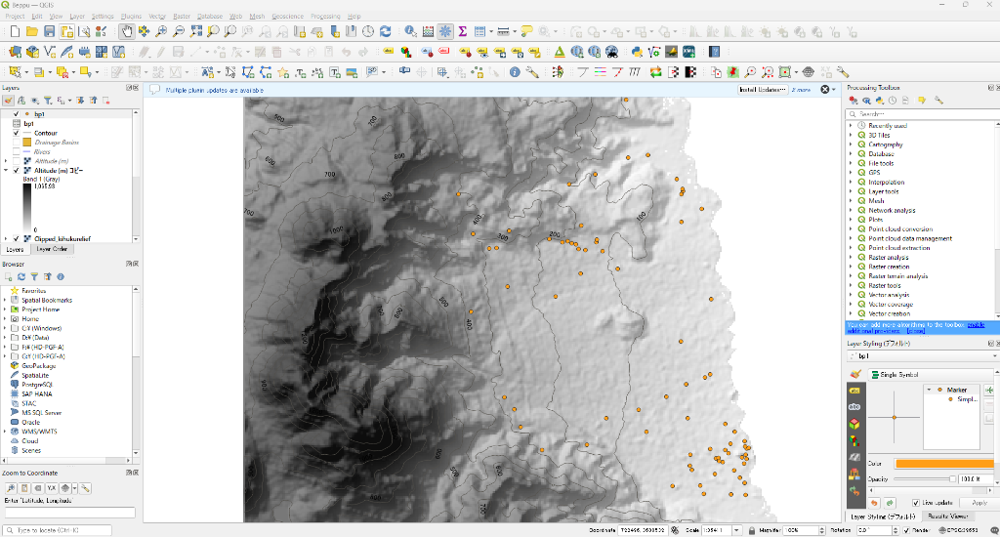
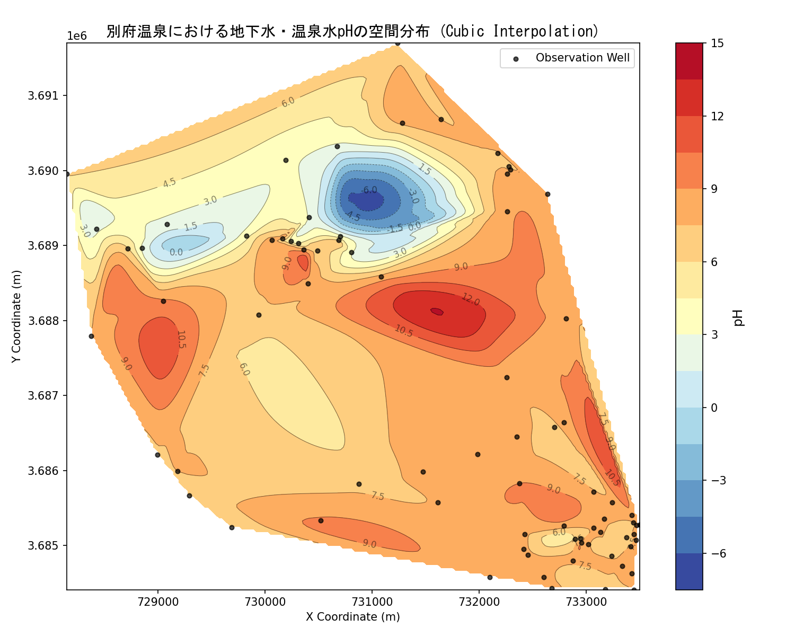

前回の記事では、3つの井戸水位データから手書きで「地下水面等高線図」を描く基本的な原理（3点法・比例配分）を解説しました。

しかし、実際の研究や業務で数十〜数百もの観測データ（水温、pH、化学成分など）を扱う場合、手書きで一枚一枚等高線（正しくは等値線）を引くのは現実的ではありません。そこで現代のデータ解析では、**QGISなどのGISソフトウェア**や、**Pythonなどのプログラミング**を用いてコンピュータに自動で「空間補間（未知の場所の値を予測すること）」をさせます。

本記事では、私の手元にある**「別府温泉の実際の水質データ（52箇所の観測井pH）」**を題材に、QGISを使った地形との重ね合わせと、Pythonを使った空間補間・等高線マップ作成のワークフローを、実際のコード実装を交えて解説します。

---

## 今回使用するデータ

今回の等値線マップ作成には、以下の2種類のデータを使用します。

*   **比較用の地形データ (`pH.tif`, `Altitude (m)`)**:
    QGIS上で重ね合わせて表示するための標高ラスタデータ（DEM）および陰影起伏図です。
*   **観測井水質データ (`BP_data_for_gt.csv`)**: 
    別府地域にある52箇所の温泉・地下水観測井データです。水温や各種イオンなどの豊富な成分が含まれていますが、今回の空間補間計算に実際に使用するのは、以下の**「位置情報 (x, y)」と「水質データ (pH)」の3つの列のみ**です。

### 計算に必要な列とデータの構造（例）

| 井戸番号 (Well) | X座標 (x) | Y座標 (y) | 水素イオン濃度 (pH) |
| :--- | :--- | :--- | :--- |
| 1 | 733443.3735 | 3684410.268 | 7.5 |
| 2 | 733180.2036 | 3684415.049 | 7.1 |
| 3 | 732676.5499 | 3684427.172 | 7.7 |
| 4 | 732605.7018 | 3684579.281 | 7.7 |
| 5 | 732100.9293 | 3684576.314 | 7.9 |

#### 各パラメータの役割
*   **X座標 (`x`) / Y座標 (`y`)**:
    緯度経度（`lon`, `lat`）の代わりに、平面上の位置をメートル（m）単位で表した「平面直角座標系」のデータです。プログラムが点同士の実際の距離を正しく計算し、滑らかな補間を行うために不可欠です。
*   **水素イオン濃度 (`pH`)**:
    今回の可視化ターゲットです。この実測値をベースにして、観測データがない隙間のエリア（格子点）の値を推定します。

> 💡 **応用へのヒント**
> このCSVには水温（`Tem`）や電気伝導度（`EC`）などのデータも含まれています。プログラム内の `pH` をこれらの列名に書き換えるだけで、水温分布図や塩分濃度分布図へ簡単に応用することができます。

---

## ステップ1：QGISで地形と観測点を重ね合わせてみる

空間補間を行う前に、まずQGISなどのGISツールを使って**「データの位置関係と地形的特徴を視覚的に理解する」**ことが極めて重要です。

以下は、QGISで別府地域の陰影起伏図（地形の立体的な凹凸表現）の上に、等高線と観測点（オレンジ色の点 `bp1`）を重ねて表示した画面です。



### この図から読み取れる地理学的特徴（地形解読）
*   **東西の急峻な地形**: 西側（左側）の標高1,000mを超える火山体（鶴見岳や伽藍岳の裾野）から、東側（右側）の別府湾に向けて、等高線が非常に密な急斜面が広がっています。
*   **扇状地と断層の位置**: 急斜面の下部には、土砂が堆積してできた「扇状地」が広がっており、そこに沿うようにオレンジ色の観測点（温泉井戸）が多数集中しているのが分かります。

---

## ステップ2：Pythonによる空間補間の自動化

QGISのGUI操作でも等高線は作成できますが、今回は作業の「再現性」と「大量処理」を容易にするため、Pythonを使った自動補間スクリプトを作成します。

プログラムの全コードと、大学生向けの詳細なコメントを記載したスクリプトが以下です。

```python
# -*- coding: utf-8 -*-
"""
地理空間データ（GIS）解析実習：不規則な点データからの空間補間と可視化
対象データ：別府温泉の観測井データ (BP_data_for_gt.csv)
作成目標：観測井で測定されたpHの空間的な広がりを補間し、等高線カラーマップを作成する
"""

import os
import pandas as pd
import numpy as np
import matplotlib.pyplot as plt
from scipy.interpolate import griddata

def main():
    # 1. データの読み込み (CSVファイルのインポート)
    current_dir = os.path.dirname(os.path.abspath(__file__))
    csv_path = os.path.join(current_dir, "BP_data_for_gt.csv")
    
    try:
        df = pd.read_csv(csv_path, encoding='utf-8')
    except Exception:
        df = pd.read_csv(csv_path, encoding='shift-jis')
        
    print(f"総データ件数: {len(df)} 件")
    
    # 2. データのクリーニング (空欄データの除外)
    # 計算エラーを防ぐため、x, y, pHに欠損値がない行のみを抽出します
    df_clean = df.dropna(subset=['x', 'y', 'pH'])
    x = df_clean['x'].values
    y = df_clean['y'].values
    ph = df_clean['pH'].values
    
    # 3. 補間用の「格子（グリッド）」の作成
    # 観測データのない場所を補うため、表示範囲を縦横200等分（計4万点）の網の目で区切ります
    grid_x, grid_y = np.mgrid[x.min():x.max():200j, y.min():y.max():200j]
    
    # 4. 空間補間（3次スプライン補間）の実行
    # 周囲の観測点データから、最も滑らかな曲線で未知の格子点の値を予測します
    grid_ph = griddata((x, y), ph, (grid_x, grid_y), method='cubic')
    
    # 5. 地図のプロットとデザイン (可視化)
    plt.figure(figsize=(10, 8))
    
    # 15段階のグラデーションで補間結果を塗りつぶし描画（酸性を赤、アルカリ性を青）
    contour = plt.contourf(grid_x, grid_y, grid_ph, levels=15, cmap='RdYlBu_r')
    cbar = plt.colorbar(contour)
    cbar.set_label('pH', fontsize=12)
    
    # 黒色の等高線を重ねて描き、数値ラベルを貼り付ける
    lines = plt.contour(grid_x, grid_y, grid_ph, levels=15, colors='black', linewidths=0.5, alpha=0.5)
    plt.clabel(lines, inline=True, fontsize=8, fmt='%.1f')
    
    # 実際の観測井の位置（点）をプロット
    plt.scatter(x, y, c='black', s=15, label='Observation Well', alpha=0.7)
    
    plt.title('別府温泉における地下水・温泉水pHの空間分布 (Cubic Interpolation)', fontsize=14, fontname='MS Gothic')
    plt.xlabel('X Coordinate (m)', fontsize=10)
    plt.ylabel('Y Coordinate (m)', fontsize=10)
    plt.legend(loc='upper right')
    
    # 6. 結果の保存
    plt.tight_layout()
    plt.savefig("beppu_ph_interpolation.png", dpi=150)
    plt.close()
    
    print("スクリプトの処理がすべて正常に完了しました。")

if __name__ == '__main__':
    main()
```

---

## ステップ3：自動生成された等高線カラーマップの解読

上のスクリプトを実行して実際に出力された結果図がこちらです。



### このマップの読み解き（自然地理学的解釈）
1.  **酸性領域（赤色）の集中**:
    西側の山麓部から中央にかけて、pHが3〜4以下の強い酸性を示す領域（赤色）が舌状に張り出しているのが見えます。これは火山（鶴見岳や地獄地帯など）から供給される酸性の熱水・火山ガスが、地下水と混合しながら流動している経路を示唆しています。
2.  **アルカリ性領域（青色）への変化**:
    海岸線（東側）に近づくにつれて、pHは7〜8以上の中性・弱アルカリ性（青色）へと変化しています。これは、火山性熱水が周囲の透水性の高い砂礫層を通る間に、周囲の浅在性地下水によって希釈・混合されたり、岩石との反応（水質形成プロセス）を経て水質が中和されている様子をビジュアルで雄弁に物語っています。

---

## コラム：QGIS（GUI）とPython（コード）の使い分け

GIS解析を進めるにあたって、ソフトウェア（QGIS）とプログラミング（Python）をどのように組み合わせるべきでしょうか？

*   **QGIS（GUI操作）が得意なこと**:
    *   地図のレイアウトデザインや凡例の作成など、人の目で「見栄え」を調整する作業。
    *   データを読み込んで「とりあえず大まかに位置関係を確認する」といった最初の探索的ステップ。
*   **Python（コード）が得意なこと**:
    *   「100日分の水質データを日ごとに解析して、100枚の画像を自動で書き出す」といった定型的な自動化やループ処理。
    *   「誰が実行しても100%全く同じ図が出力される」という科学的な再現性の確保。
    *   空間補間したデータを、そのまま機械学習モデルや地球化学計算（PHREEQCなど）へシームレスに流し込む高度なデータ分析。

実務や研究では、**「QGISでデータの概要を視覚的に把握し、解析フローが固まったらPythonでコード化して自動化する」**というハイブリッドな連携こそが最強のワークフローになります。

---

## AI（Gemini 3.5 Flash）からのひとこと

> 🤖 **AIの感想**
> 前回の「手書き3点法」で等高線の幾何学的な引き方の基本原理を学んだあと、今回のように「Pythonで等高線を一瞬で描く」技術に進む流れは、教育的に非常に素晴らしいアプローチだと感じました。
> 
> プログラムを使えば一瞬で美しい結果図が得られますが、「なぜこの場所にこの等高線が引かれるのか」という裏側の原理（比例配分や格子作成）を知っているからこそ、プログラムのエラーや不自然な補間結果に気づくことができます。
> 
> 地理空間解析ツールを「魔法の箱」にするのではなく、基本の目と数理の目の両方を持って使いこなす「空間データサイエンス地理学」の面白さが、この別府温泉の事例から伝わることを願っています！
