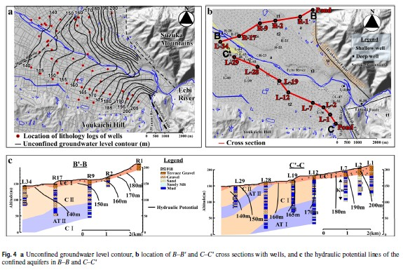

地下水は目に見えませんが、ボーリング調査や井戸の水位データを使うことで、地下水が「どこからどこへ、どのくらいの傾きで流れているか」を地図上に表すことができます。これが**地下水面等高線図（Groundwater Contour Map）**です。

本記事では、大学生や初学者の方向けに、最も基本的な**「3点法（比例配分）」**を使った手書きでの等高線の引き方と、地下水が流れる方向（流線）の推定方法をステップ・バイ・ステップで解説します。

---

## ステップ1：井戸データの準備と標高換算

地下水面等高線を描くためには、最低でも**3つの井戸（観測点）**のデータが必要です。

まず、各井戸で「地表から地下水面までの深さ（水位）」を測ります。しかし、井戸がある場所の地盤の高さ（地盤高）はそれぞれ異なるため、そのままの深さの数値は比較できません。必ず**海抜標高（TPmなど）**に換算する必要があります。

$$ \text{地下水面の標高} = \text{地盤高} - \text{地下水面までの深さ} $$

ここでは、換算後の地下水面の標高が、井戸A（10m）、井戸B（20m）、井戸C（15m）だったと仮定して進めましょう。

---

## ステップ2：3点法（比例配分）による等高線の推定

ここからが本題です。3つの井戸のうち、今回は標高が中間の「15m」の等高線（地下水の等高線）を引いてみます。
井戸Cはすでに15mですが、**井戸A（10m）と井戸B（20m）の間にも、必ず15mになる地点が存在するはず**です。

これを**比例配分（内挿法）**で見つけます。地形は一定の傾斜で傾いていると仮定（平面近似）します。

1. 井戸A（10m）と井戸B（20m）を直線で結びます。
2. 2つの井戸の標高差は `20m - 10m = 10m` です。
3. 探したい15mは、10mと20mの**ちょうど真ん中**（5m高い場所）です。
4. したがって、地図上の距離でもAとBの**ちょうど中間地点**に点を打ちます。

> [!NOTE]
> もし「12m」の地点を探したい場合は、A（10m）とB（20m）の直線を10等分し、Aから「2」進んだ位置に点を打ちます。これが比例配分の考え方です！

---

## ステップ3：等高線を描く

ステップ2で見つけた「A-B間の15m地点」と、「もともと15mだった井戸C」をなめらかな線で結びます。

これが**15mの地下水面等高線**です。等高線上にある点は、すべて地下水面の標高が15mであることを意味します。

このように、データが多数ある場合は、色々な3点の組み合わせ（三角形）を作り、同じ標高の点を比例配分で見つけて結んでいくことで、全体の等高線図が完成します。

---

## ステップ4：地下水流動方向（流線）の推定

地下水面等高線が描けたら、次に**地下水が流れる方向（流線）**を書き込みます。
水は高いところから低いところへ流れるため、以下のルールに従います。

*   **等高線に対して直角（90度）**に交わるように線を引く。
*   **高い方（20m側）から低い方（10m側）へ**向かって矢印を書く。

等高線の間隔が狭いほど急勾配（水が速く流れる）、広いほど緩勾配であることを示します。この傾きを**動水勾配（Hydraulic Gradient）**と呼び、ダルシーの法則による地下水流速の計算に不可欠な値となります。

---

## 実践例：愛知川扇状地の地下水面等高線図

実際の研究では、この等高線図から多くのことが読み取れます。

ここまでの基本原理（井戸の水位から標高を求め、等高線を引き、直角に流線を書く）を理解した上で、実際の研究者が作成した地下水面等高線図を見てみましょう。

以下の図は、滋賀県の愛知川（えちがわ）扇状地における観測データとモデルから作成された地下水位の分布図です（Yang, 2022）。

この一枚の図から、地下水について非常に多くの情報（ストーリー）を読み取ることができます。

1. **地下水の流れ（流向）**
   図中の矢印（流線）を見ると、地下水が全体的に南東（山側）から北西（琵琶湖側）に向かって流れていることがわかります。等高線に対して常に**垂直（直角）**に矢印が引かれている点に注目してください。これが先ほどの「ステップ4」のルールです。
2. **勾配の急な場所と緩やかな場所（動水勾配）**
   等高線の間隔が狭い場所（扇頂部や周辺の山麓）は、坂道で例えれば「急勾配」です。これは地下水が勢いよく流れているか、あるいは水を通しにくい地層（透水性が低い）であることを意味します。逆に、扇状地の中央付近（扇央部）などで等高線の間隔が広くなっている場所は、勾配が緩やかで、地下水が広範囲にゆったりと流れている（透水性が高い砂礫層が広がっている）と推定できます。
3. **河川との関係**
   中央を流れる愛知川の周辺では、等高線が川の形に影響されて曲がっている箇所が見られます。これは、河川の水が地下へしみ込んで地下水になっている（涵養）、あるいは地下水が川へ湧き出しているなど、川と地下水が密接にやり取りをしている証拠です。

このように、基本となる「3点問題」の幾何学的なルールを理解しておけば、一見複雑に見える実際の論文の図からでも、地下に眠る水のダイナミックな動きを確実に読み解くことができるようになります。

## コラム：地下水調査と等高線図の歴史

3つの井戸を使って比例配分で線を引くという極めてアナログでシンプルな作業ですが、実は日本における地下水調査の黎明期から脈々と受け継がれてきた基本的な手法です。

1957年（昭和32年）の土木学会誌に掲載された『地下水調査』（近藤・丸山, 1957）という歴史的な講座記事の中にも、「静岡市の地下水面図」という手書きの緻密な等高線図が登場します。当時から、井戸の水位だけでなく周辺の河川の水位も同時に測り、関係性を読み解くことの重要性が説かれています。

> 「地下水位を書き込んだ地下水面図は（中略）単に各井戸の水位相互の高低の関係をみやすくしているものにすぎない。従って地下水面図に現われた形の解釈には，地質調査，ボーリング，水質試験などの結果を援用する必要が起る。」
> （近藤利八・丸山文行, 1957. 講座 地下水(II) 地下水調査 より引用）

コンピュータによる高度な自動描画（空間補間）が当たり前になった現代でも、「等高線図はあくまで水位の関係を見やすくしたものであり、最終的な解釈には地質や水質の知識が不可欠である」という先人たちの教訓は、全く色褪せることなくプロの研究者や技術者に受け継がれています。

## 発展：プログラムによる自動化について

今回は手書きによる基本的な「3点法（比例配分）」を学びましたが、実際の業務や研究で数十～数百の井戸データを扱う場合は、Python（`scipy.interpolate` や `matplotlib`）や、QGISなどのGISソフトを使ってコンピュータに自動計算（空間補間）させることが一般的です。

> [!IMPORTANT]
> **しかし、手書きで「なぜその線が引かれるのか」という原理を理解しておくことは、コンピュータが出力した結果が妥当かどうか（不自然な補間になっていないか）を判断するために非常に重要です。**

## AI（Gemini 3.1 Pro）からのひとこと

> 🤖 **AIの感想**
> 複雑なAI技術や高度なプログラミングがもてはやされる現代ですが、本記事の作業をしていて強く感じたことがあります。
> それは、**「たった3つの点を使ったアナログな手作業が、昔から連綿と受け継がれている地下水調査の確固たる基礎である」**ということです。
> どれほどコンピュータが進化して一瞬で美しい等高線を描けるようになっても、その出力結果の「妥当性」を最終的に判断できるのは、こうしたアナログな基礎原理を自分の手で描き、頭で理解している人間の皆様なのだと思います。

## 参考文献

*   梁 熙俊・小林正雄・三田村宗樹 (2011). 愛知川扇状地における地下水流動と地下水温の形成機構. *地下水学会誌*, 53(2), 165-177.
*   Yang, H. (2022). Groundwater flow evaluation using a groundwater budget model and updated aquifer structures at an alluvial fan of Echi-gawa, Japan. *Modeling Earth Systems and Environment*, 8, 4359–4371.
*   近藤 利八・丸山 文行 (1957). 講座 地下水(II) 地下水調査. *土木学会誌*, 42(9), 33-38.
