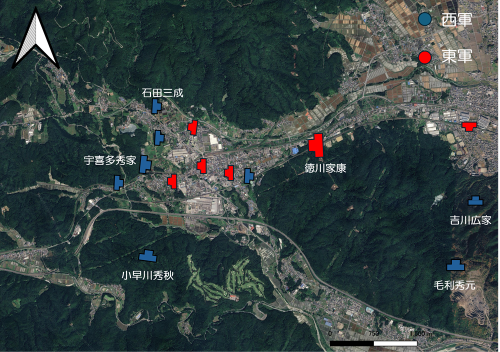
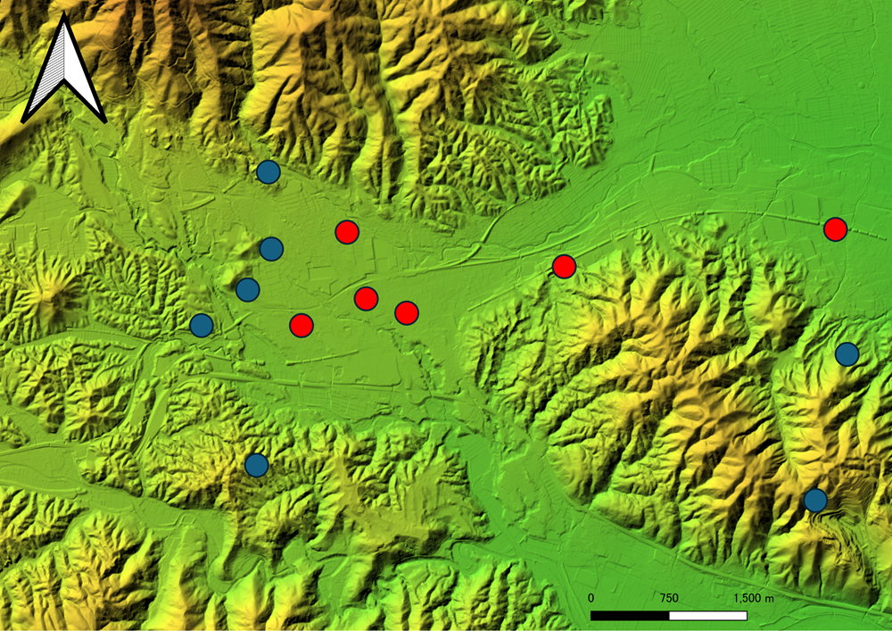
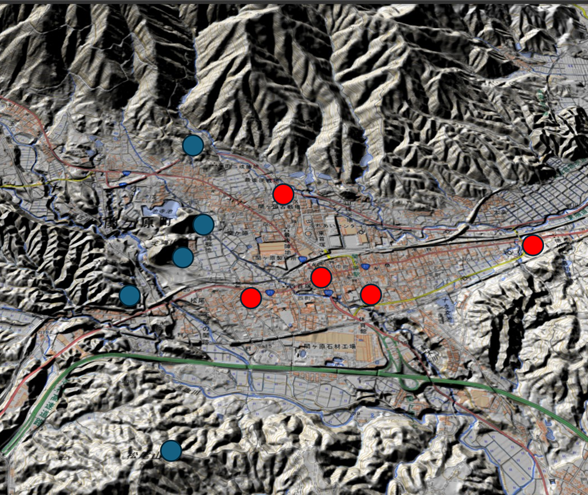

日本の歴史を決定づけた「関ヶ原の戦い」。 西軍が山々に陣を敷き、東軍を包囲するような「鶴翼の陣」を形成していたことは有名です。地形だけを見れば、東軍（徳川家康）は盆地の底に誘い込まれた「袋のネズミ」であり、まさに「虎の口」に自ら飛び込んだようにも見えます。

しかし、家康は一切の躊躇なく軍を進めました。なぜ彼はこれほど強気だったのか？地形の影響と当時の情勢から、その真意を考察します。

## 地形から見る「関ヶ原」の罠

衛星写真（@fig-satellite）や標高段彩図（@fig-elevation）、陰影起伏図（@fig-relief）を見ると、関ヶ原の特異な地形が浮かび上がります。北には険しい伊吹山地がそびえ、南には鈴鹿山脈から続く南宮山が横たわっています。家康が進軍した中央の平地は、まさに山々に囲まれた「虎の口」でした。

{#fig-satellite}

{#fig-elevation}

{#fig-relief}

### 主要な布陣

**石田三成（笹尾山）** 中心部から北西方向、伊吹山地の裾野。標高約190m。背後からの攻撃を遮断する地形に位置し、指揮拠点として申し分ない場所です。

**小早川秀秋（松尾山）** 中心部から南西方向。標高約290m。標高段彩図で見ると、戦場となる盆地を南から遮るように突き出した独立峰のような形状をしており、ここを抑える者が戦場の主導権を握ることがわかります。

**毛利秀元・吉川広家（南宮山）** 中心部から東南方向。標高約400m。東軍が進軍してきた背後の山です。陰影起伏図を見ると、東側の濃尾平野へ続く道を完全に見下ろす位置にあり、もしここが機能していれば東軍の退路は断たれていたでしょう。

### 関ヶ原 布陣図（概略）

```         
　　　　　　　（北：伊吹山方面）
　　　　　　　　　　｜
　　【笹尾山】　　　｜　　　
　　（石田三成）　　｜　　　
　　　　　＼　　　　｜　　　
　　　　　　＼　【東軍主力】／
（西：大垣方面）―（徳川家康）―（東：名古屋方面）
　　　　　　／　　　｜　　　＼
　　【松尾山】　　　｜　　　【南宮山】
　（小早川秀秋）　　｜　　（毛利・吉川）
　　　　　　　　　　｜
　　　　　　　（南：養老方面）
```

## なぜ家康は躊躇しなかったのか？

家康が進軍を強行できた理由には、地形を逆手に取った「3つの計算」があったと考えられます。

### ①「中山道」という物流の要衝を抑える必然性

地形図を見ればわかる通り、関ヶ原は琵琶湖側（近江）と濃尾平野（美濃）を結ぶ、山間のわずかな隙間です。家康にとって、この狭隘な地を迅速に突破することは、大坂城へ至る最短ルートを確保することを意味しました。持久戦になれば、背後の領地が不安定になるリスクがあったため、「地形のリスクを承知の上で、決戦の場をここに設定した」のが実情です。

### ② 霧という「天然の目隠し」

合戦当日の朝、関ヶ原は深い霧に包まれていました。陰影起伏図にあるような複雑な地形は、本来は高所に陣取る側に圧倒的な視覚的優位を与えますが、霧がそれを無効化しました。家康がこれを事前に読んでいたかどうかは定かではありませんが、接近戦に持ち込むことで西軍の包囲網の連携を乱せるという判断は、結果として霧によって後押しされたと言えます。

### ③ 地形をも無力化する「調略」の読み

家康にとって最大の勝機は、地図上の「山」そのものを味方にすることにありました。

- **松尾山（小早川）**：標高段彩図上で最も戦場を見下ろす位置にあるこの山が寝返れば、西軍の布陣は一気に崩壊する。事前の交渉の記録も残っており、家康はその可能性を高く見積もっていたと思われます。

- **南宮山（吉川）**：家康の背後を突くはずのこの巨大な山塊が、吉川広家の不戦によって「巨大な壁」へと変わり、西軍主力の合流を妨げる。吉川との折衝については諸説あるものの、家康側がある程度の手応えを得ていた可能性は高いでしょう。

## 地形図から見えてくる「家康の視点」

陰影起伏図（@fig-relief）をじっくり眺めると、関ヶ原がいかに「逃げ場のない場所」であるかが強調されます。しかし家康はこの地形を見て絶望するどころか、「敵をここに集めてしまえば、出口を塞ぐのは自分だ」と考えていた節があります。

地形図での注目ポイントを整理すると：

| 地点 | 注目点 |
|-------------------------------|-----------------------------------------|
| 中心部（東軍本陣） | 周囲の山に比べ標高が圧倒的に低く、西軍から丸見えの位置 |
| 南宮山 | 陰影起伏図で見ると巨大な山塊が退路を塞ぐ「壁」に。ここが動かないだけで東軍の背後が安泰に |
| 松尾山 | 標高段彩図で盆地へ張り出した独立した高まりとして確認でき、寝返りによる瞬間的な戦況変化を視覚的に理解できる |

## 結論：「虎の口」の出口は、家康が作っていた

家康が躊躇なく進軍できたのは、地形という「ハードウェア」が不利であっても、調略という「ソフトウェア」でその地形の持つ意味を180度書き換えていたからです。

もし小早川が動かず、吉川が背後に攻め込んでいれば、家康は本当に「虎の口」で最期を迎えていた可能性もあります。しかしそれは「もし」の話であり、少なくとも家康は、地形の不利を外交・調略で埋めるという政治家・軍略家としての極限の賭けを、入念な布石のもとに仕掛けていたのです。

## ...と、Claude, ChatGPT, Geminiによるプレゼンです。

AIとは何回もやり取りして、この話が出来上がりました。私はこの話を元に、国土地理院やネット上の記事等を参考にして、**QGISで図を作成し**、適当なところに図を貼り付けました。

といってもあり得る話だと思います。正直、不利である低地からの攻撃で勝利を収めた将軍は沢山いますので、例えば、**アレクサンドロス大王のグラニコス川の戦闘（紀元前300年ごろ、マケドニア対ペルシア帝国）**や、**フリードリヒ大王のロイテンの戦い（18世紀の７年戦争。プロイセン対オーストリア）などなど。**

**お読みいただきありがとうございました。**