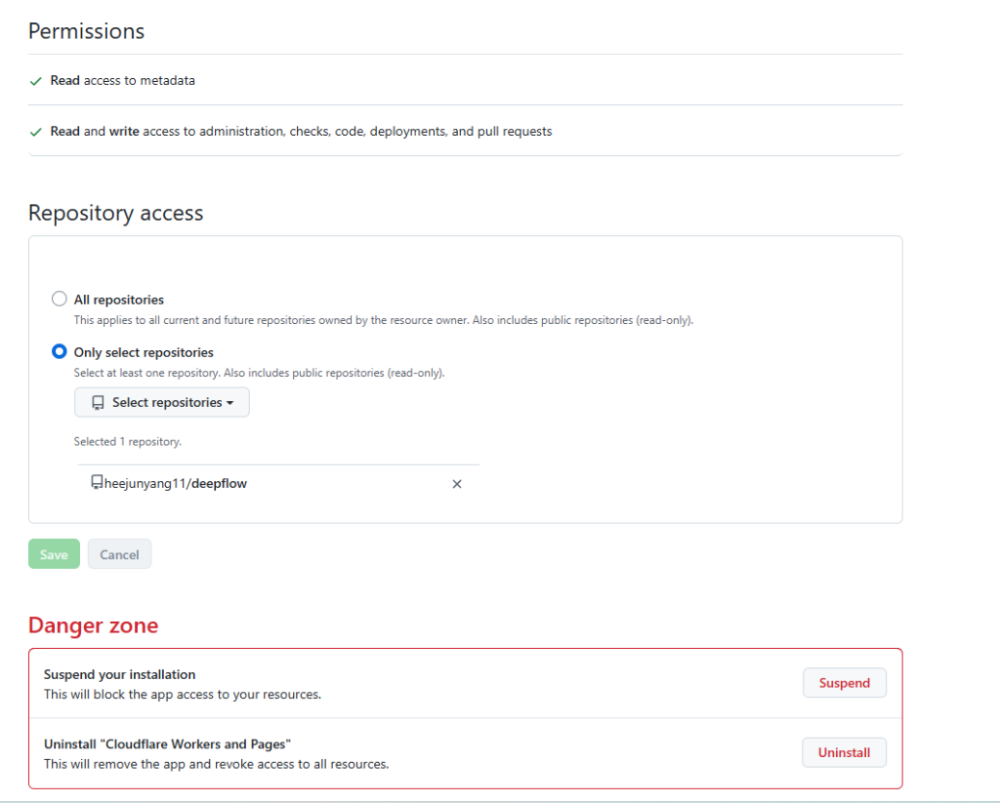
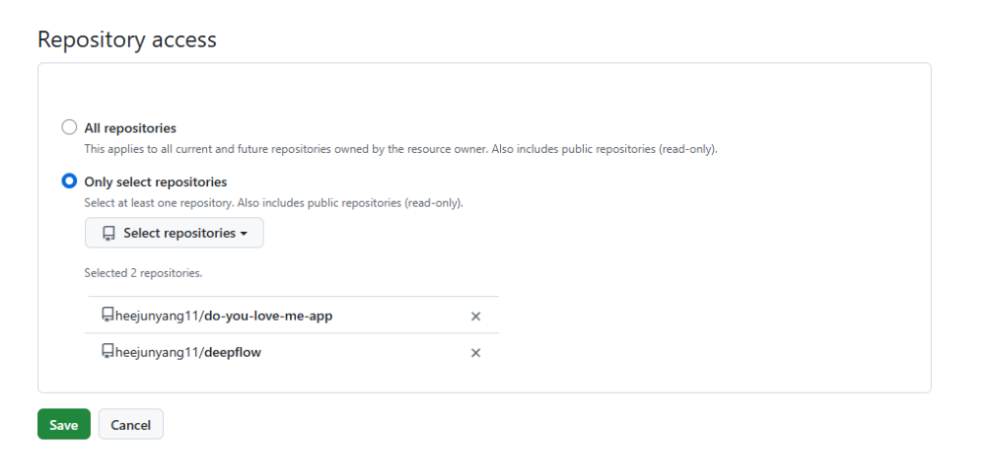
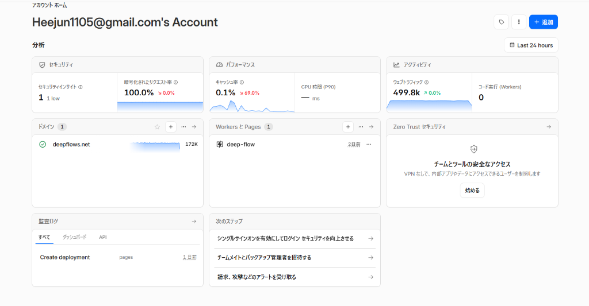
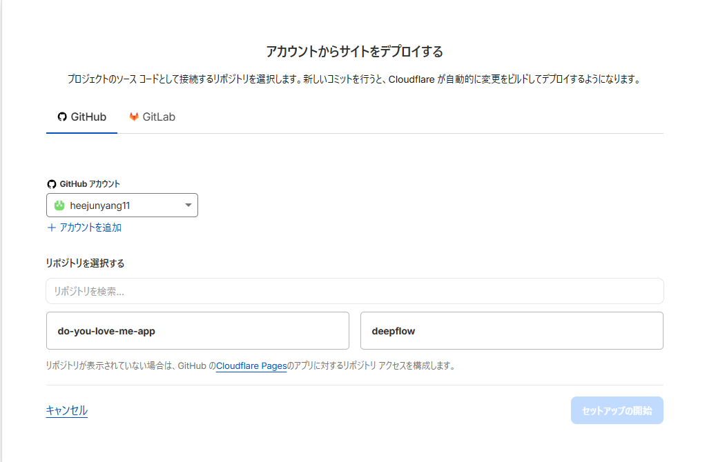
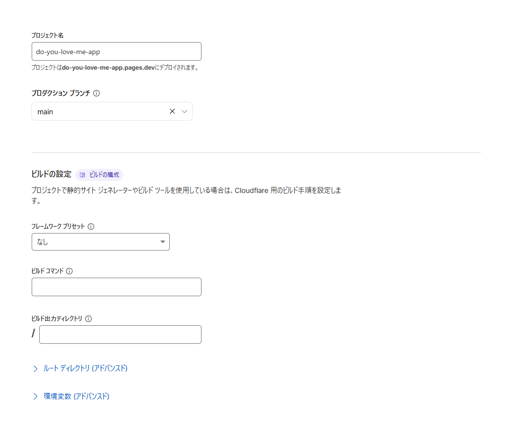
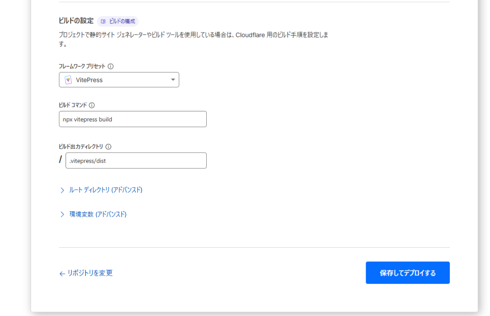
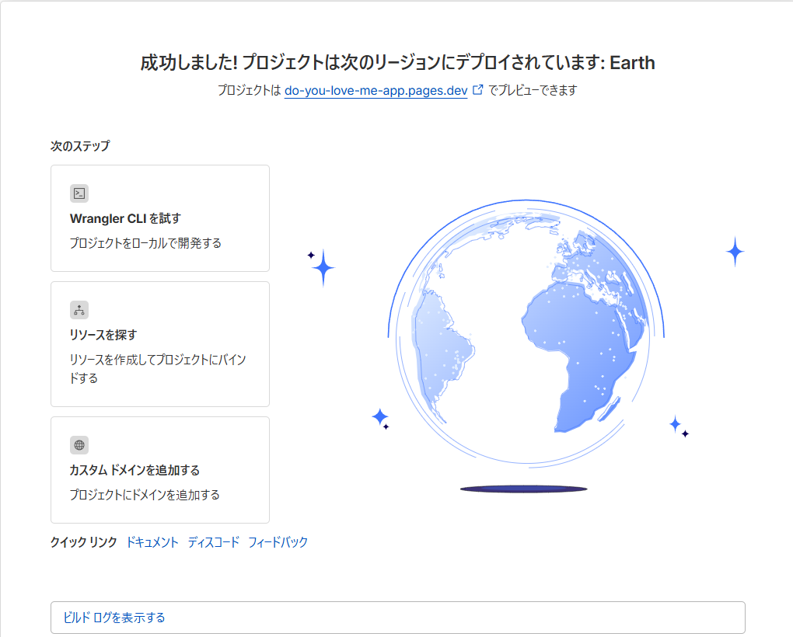
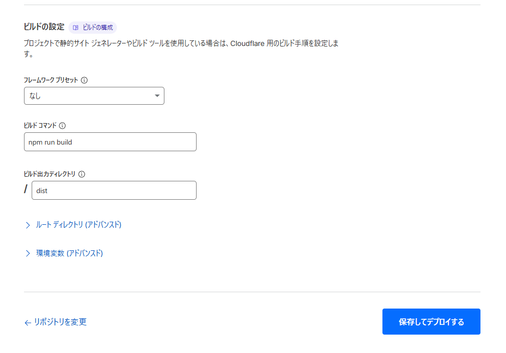

こんにちは、DeepFlowsのHYです。

最近、IT界隈で耳にすることが増えた **「Vibe Coding（バイブ・コーディング）」**。
AIエージェントに大まかな指示を出し、ノリとバイブス（フィーリング）で高速にコードを書いてもらいながらアプリを作る、新しいスタイルの開発方法です。

今回は、AIエージェント（Antigravity）とペアを組み、とびきり可愛くてやんちゃなジョークアプリ **「Do you love me?」** を開発しました。

本記事では、前半で**「全くの初心者が、React + Vite + GitHub + Cloudflare Pages を使って、完全無料で自分の作ったアプリをインターネット上に公開（デプロイ）するまでの全体マップ」**を優しく解説し、後半では私たちが実際に直面した**「爆笑の失敗バグ」と「デプロイの罠の実況中継」**をお届けします。

これからAIを使ってプログラミングを始めたい人、自分の作品をネットに公開してみたい人にとって、最高の入門教材になれば幸いです！

---

## 🛠️ 【ロードマップ】なぜ「React + GitHub + Cloudflare」の連携が初心者にとって最強なのか？

まず、これから「Vibe Coding」を始めたい初心者にとって、なぜこの3つの組み合わせが最も選ばれているのか、その理由と全体の仕組みを整理します。

### 1. この構成が選ばれる理由
* **完全無料で運用コストゼロ**: サーバ代や公開手数料は一切かかりません。どれだけアクセスが来ても、ずっと無料でウェブサイトを稼働させられます。
* **プッシュするだけで全自動更新（CI/CD）**: 一度設定してしまえば、手元のパソコンでコードを修正してGitHubに送る（プッシュする）だけで、Cloudflare Pagesが自動で検知し、数分で本番サイトを最新状態に更新してくれます。
* **AIとの相性が抜群**: Vite+Reactはシンプルで無駄なコードが少ないため、AIエージェント（CursorやGemini等）がコード全体の構造を理解しやすく、高速に指示を反映できます。

### 2. データが世界へ公開されるまでの流れ
あなたのパソコン（ローカル環境）から、世界へアプリが届くまでのパイプラインは以下の図のようになっています。

```
[ あなたのパソコン (Local) ]
      Vibe Codingでアプリを作る・修正する
               │
               ▼  (git push コマンド)
[ GitHub (コードの保管庫) ]
      コードがアップロードされたことを検知
               │
               ▼  (自動で通知・連携)
[ Cloudflare Pages (公開サーバー) ]
      コードをWebサイト用にビルド（自動組み立て）し、世界へ配信！
```

この流れさえ頭に入っていれば、どこで何のエラーが起きているのかがすぐに見えるようになります。

---

## 🎨 どんなアプリを作ったのか？（要件定義）
今回私たちが作ったのは、女性に好まれるパステルカラーと丸いフォントを採用した、ストーリー仕立てのインタラクティブアプリです。

* **美しいビジュアル（グラスモーフィズム）**: 淡いピンクとラベンダーのグラデーション背景に、すりガラス調の半透明カードを配置。
* **ドラマチックな5つの段階**:
  1. **0回目**: 普通の「Yes/No」ボタン。
  2. **1〜3回目**: Noを押すたびに画面が「えっ…？」とショックを受けたように少し揺れ、Yesボタンが徐々に大きく成長する。
  3. **4回目**: Noボタンがカード内をフワフワと滑らかに逃げ回るフェーズに突入。
  4. **5回目**: 逃げ回るNoボタンにマウスが重なると、ボタンは一時停止。クリックすると、全てが消えて**涙目の可愛い子猫**が登場。
  5. **Yesクリック時**: 背景がロマンチックなピンクになり、**大喜びする子猫と「ME TOO! ❤️」の文字**が表示されてハッピーエンド。

▼ 実際にデプロイされたハッピーエンド画面


---

## ❌ 開発中に発生した3つの「大失敗」と解決法

### 失敗1：Yesボタン巨大化による「Noボタン隠滅」事件
最初に実装した際、Noボタンを押すごとにYesボタンが爆発的に巨大化するように設定したところ、Yesボタンが画面全体の約9割を覆い尽くしてしまいました。
結果、隣にあるはずのNoボタンが画面外に押し出されるか、Yesボタンの下に完全に埋もれてしまい、**2回目以降はNoを物理的にクリックできなくなる**という本末転倒なバグが発生しました。

* **解決策**: Yesボタンの最大サイズを `2.5rem`（元の約2倍）に制限。さらに、CSSの `z-index` でNoボタンを常に `10`（Yesは `2`）に設定し、どのような状況でもNoボタンが最前面に残り続けるようにレイアウトを死守しました。

---

### 失敗2：逃げ回るNoボタンが「画面外へ吹き飛んで消える」事件（CSSの罠）
4回目の「Noボタンがやんちゃに逃げ回る」フェーズで、最も奇妙なバグが起きました。4回目になった瞬間、**Noボタンが画面から忽然と消え去ってしまったのです。**

プログラムの座標計算は完璧なはず。なぜ消えたのか？
原因は、Noを押した時の「画面がショックで揺れる演出（CSSの `transform` アニメーション）」でした。

実はブラウザの仕様上、**「親要素（今回の場合はカード）に `transform` が適用されている場合、子要素の `position: fixed` の基準点はビューポート（画面全体）ではなく、その親要素になる」**というルールがあります。これにより、画面全体の座標系として計算した絶対値が、カードの左上を基準に適用され、ボタンがカードのはるか外側の画面外に吹き飛んでいたのです。

* **解決策**: 逃げ回る範囲を「画面全体」から「中央の白いカード（`.app-container`）の内部」に限定し、`position: absolute` に変更。カードの寸法をJavaScriptで動的に取得してその内部でのみ動くように座標計算を書き直しました。

---

### 失敗3：ボタンがやんちゃすぎて「誰もクリックできない」問題
マウスがボタンに近づくと瞬間移動するように逃げる設定にしたところ、動きが速すぎて人間がクリックすることは不可能になり、5回目の涙目猫に一生たどり着けない「無理ゲー」になってしまいました。

* **解決策**: 2つの調整を入れました。
  1. ボタンの移動速度をゆっくり滑らか（`transition: 0.8s`）にする。
  2. **「マウスがボタンに重なっている（引っかかっている）間は逃げない」** というロジックを実装。マウスをうまく重ねる（ホバーする）と、ボタンはピタッと動きを止めます。これにより、「追いかけっこ」のゲーム性と「捕まえられる嬉しさ」が絶妙に調和しました。

▼ 捕獲後に登場する涙目の子猫（Yesボタンだけがドクンドクンと鼓動します）


---

## 🌐 【実況中継】Cloudflare Pages デプロイ時の試行錯誤

GitHubにアップロードしたアプリを、実際にインターネット上へ公開するまでのCloudflare Pagesの設定プロセスでも、いくつかの「初心者あるある」な罠がありました。実際のスクリーンショットと共に振り返ります。

### Step 1：どこからPagesを作成する？
Cloudflareのダッシュボードに入り、最初のプロジェクトを作成するための青いボタンを探すところからスタート。
* **HYさん**: 「この右上か？」
* **AI**: 「はい、まさにその右上の『アプリケーションを作成する』ボタンです！」



---

### Step 2：WorkersとPagesの入り口
次の画面に進みましたが、デフォルトでは「Worker of 作成」画面になっており、Pagesの入り口が少し見えにくい場所にありました。
* **HYさん**: 「この下のPagesだね」
* **AI**: 「大正解です！パネルのすぐ下にある『Pagesを導入しようとお考えですか？ 始める』をクリックしてください！」



---

### Step 3：インポート方法の選択
* **HYさん**: 「ここでGit？」
* **AI**: 「はい！『既存の Git リポジトリをインポートする』の『始める』ボタンをクリックします！」



---

### Step 4：リポジトリが表示されないバグ（GitHub権限の壁）
連携を進めると、GitHubにあるはずの `do-you-love-me-app` がリストに表示されず、以前作った `deepflow` しか見えないという定番のバグ（仕様）に遭遇しました。
* **HYさん**: 「これ？」
* **AI**: 「リポジトリが表示されていませんね。GitHub側の設定（Cloudflare Pagesアプリのアクセス許可）で、新しく作ったリポジトリに権限を追加する必要があります！」



---

### Step 5：GitHubでの設定変更
GitHubのセキュリティ設定画面に飛び、新リポジトリを選択します。



* **HYさん**: 「これでいい？DeepFlowsもあるけど」
* **AI**: 「完璧です！既存の `deepflow` への権限を残したまま、新しく `do-you-love-me-app` もリストに正しく追加されています！」



* **余談（HYさんの可愛いリアクション）**:
  画面の端にある警告欄を見て、「Danger zoneって何か怖いね」と一言。AIが「全解除ボタンがあるだけなので、Saveボタンさえ押せば安全ですよ」となだめる微笑ましいペアプロらしい一幕もありました。

---

### Step 6：リポジトリの表示成功！
GitHubで設定を保存し、Cloudflareの画面に戻ってリロードすると、無事に新リポジトリが表示されました。
* **HYさん**: 「元々開いてたページはこうなった」
* **AI**: 「バッチリ表示されましたね！選択して『セットアップの開始』をクリックします！」



* ※もし途中でCloudflareのダッシュボードに戻ってしまっても、「Workers と Pages」カードの「＋」ボタンから簡単に元のデプロイ画面に戻ることができます。



---

### Step 7：ビルド設定とデプロイ完了
最後の難関はビルド設定です。プリセット一覧に「Vite」がなく、別の「VitePress（ドキュメント用ツール）」を選びそうになりましたが、プリセットを「なし」に設定し、手動でコマンドを入力することで解決しました。
* **ビルドコマンド**: `npm run build`
* **ビルド出力ディレクトリ**: `dist`
これで「保存してデプロイ」を押すと自動ビルドが走り、見事デプロイが完了！無事に世界へ公開されました。
* **HYさん**: 「動いてる。」
* **AI**: 「おめでとうございます！デプロイ大成功です！」

➔ **公開ウェブサイトのURL**: [https://do-you-love-me-app.pages.dev/](https://do-you-love-me-app.pages.dev/)

---

## 💡 おわりに
「Do you love me?」というありふれたジョークアプリ開発でしたが、AIエージェントと密にコミュニケーションを取りながらブラッシュアップを重ねることで、細かいUXの重要性や、CSS of 深い仕様といった本質的な学びに満ちたプロジェクトになりました。

特に、初心者が最初につまずきやすい「Gitのコマンドの罠」や「GitHubのアクセス制限」「Cloudflareのビルド設定」は、実際にエラーを体験したからこそ分かりやすく記録できた貴重なノウハウです。

何より、数時間の「Vibe Coding」で、デザインの最適化、バグの克服、整理された公開作業までをハイスピードで完結できるAIとの協働プロセスのパワーを再確認できました。

DeepFlowsでは、今後も地下水数理物理の「本丸」を突き詰めつつ、こうした最新のAI技術を活用したユニークな開発プロセスや初心者向けガイドも `Note` として発信していきます。皆さんもぜひ、AIと一緒に「Vibe Coding」で自分の作品を世界に向けて発信してみてください！
