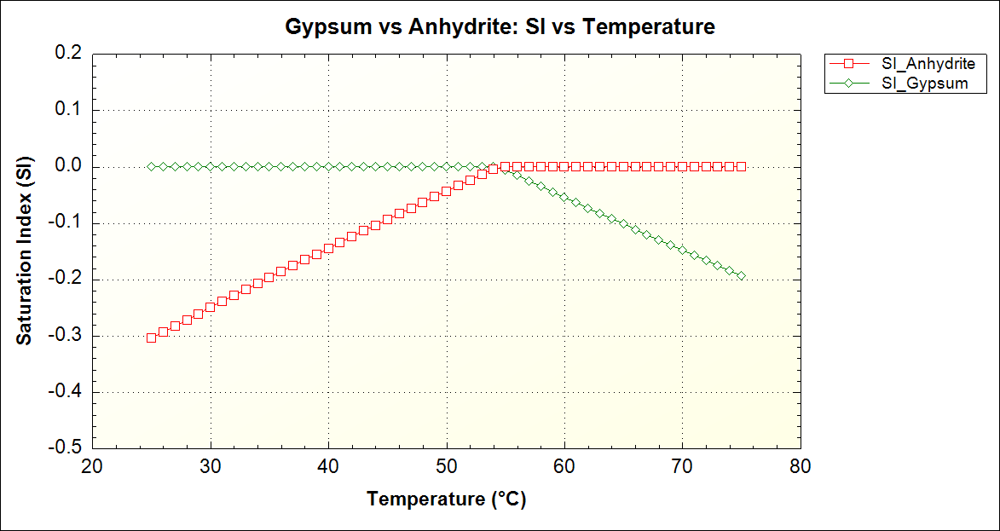

## 今回のテーマ

前回までのSpeciation計算では、「すでに溶けているイオンがどんな化学種として存在するか」を調べた。今回は一歩進んで、「**固体の鉱物と水が接触したとき、何が溶けて何が沈殿するか**」を計算する。

これを担うのが **EQUILIBRIUM_PHASES（平衡相）** ブロックである。

今回使う題材は **石膏（Gypsum）と硬石膏（Anhydrite）** の2つの硫酸カルシウム鉱物である。

```{=html}
<div style="display:flex; gap:1rem; margin:1.5rem 0; flex-wrap:wrap;">
  <div style="flex:1; min-width:200px; background:#EFF6FF; border:1px solid #BFDBFE; border-left:4px solid #3B82F6; border-radius:0 8px 8px 0; padding:1rem;">
    <div style="font-weight:500; color:#1E40AF; margin-bottom:0.4rem;">石膏（Gypsum）</div>
    <div style="font-size:0.9rem; color:#1D4ED8; font-family:monospace; margin-bottom:0.3rem;">CaSO₄・2H₂O</div>
    <div style="font-size:0.85rem; color:#3B82F6;">水分子を2つ含む・低温で安定</div>
  </div>
  <div style="flex:1; min-width:200px; background:#FFF7ED; border:1px solid #FED7AA; border-left:4px solid #D97706; border-radius:0 8px 8px 0; padding:1rem;">
    <div style="font-weight:500; color:#92400E; margin-bottom:0.4rem;">硬石膏（Anhydrite）</div>
    <div style="font-size:0.9rem; color:#B45309; font-family:monospace; margin-bottom:0.3rem;">CaSO₄</div>
    <div style="font-size:0.85rem; color:#D97706;">水分子を含まない・高温で安定</div>
  </div>
</div>
```

この2つは同じ化学組成（Ca・S・O）でできているが、**温度によってどちらが安定かが逆転する**という興味深い性質を持っている。これを計算で確かめていこう。

------------------------------------------------------------------------

## EQUILIBRIUM_PHASESとは

EQUILIBRIUM_PHASESブロックは、「この鉱物を水と平衡状態になるまで反応させる」という指示である。

PHREEQCは以下を自動的に計算する：

- 鉱物の飽和指数（SI）がゼロになるまで溶解または沈殿させる
- その結果として変化するpH・各イオン濃度・鉱物量

```{=html}
<div style="background:#F8F8F8; border:1px solid #E5E7EB; border-radius:8px; padding:1.2rem 1.5rem; margin:1.5rem 0; font-family:monospace; font-size:0.88rem; color:#1F2937;">
  <div style="color:#6B7280; margin-bottom:0.5rem; font-family:sans-serif; font-size:0.8rem;">EQUILIBRIUM_PHASES の基本構文</div>
  <div><span style="color:#D97706;">EQUILIBRIUM_PHASES</span> 1</div>
  <div style="margin-left:1.5rem;"><span style="color:#2563EB;">鉱物名</span>&nbsp;&nbsp;<span style="color:#059669;">SI目標値</span>&nbsp;&nbsp;<span style="color:#7C3AED;">初期鉱物量(mol)</span></div>
  <div style="margin-top:0.5rem; color:#6B7280; font-family:sans-serif; font-size:0.8rem;">
    SI目標値=0：平衡状態を目指す<br>
    初期鉱物量=10：十分な鉱物が「ある」（溶けきらない量）
  </div>
</div>
```

------------------------------------------------------------------------

## 計算シナリオ

今回のシミュレーションは以下の構成である：

```{=html}
<div style="overflow-x:auto; margin:1.5rem 0;">
<table style="width:100%; border-collapse:collapse; font-size:0.88rem;">
  <thead>
    <tr style="background:#F9FAFB;">
      <th style="padding:0.6rem 1rem; text-align:left; border-bottom:2px solid #E5E7EB; color:#111827;">ステップ</th>
      <th style="padding:0.6rem 1rem; text-align:left; border-bottom:2px solid #E5E7EB; color:#111827;">内容</th>
      <th style="padding:0.6rem 1rem; text-align:left; border-bottom:2px solid #E5E7EB; color:#111827;">PHREEQCブロック</th>
    </tr>
  </thead>
  <tbody>
    <tr style="border-bottom:1px solid #F3F4F6;">
      <td style="padding:0.5rem 1rem; color:#374151;">1</td>
      <td style="padding:0.5rem 1rem; color:#374151;">純水を定義（pH 7, 25℃）</td>
      <td style="padding:0.5rem 1rem; font-family:monospace; color:#D97706;">SOLUTION</td>
    </tr>
    <tr style="border-bottom:1px solid #F3F4F6; background:#FAFAFA;">
      <td style="padding:0.5rem 1rem; color:#374151;">2</td>
      <td style="padding:0.5rem 1rem; color:#374151;">GypsumとAnhydriteを過剰に加える</td>
      <td style="padding:0.5rem 1rem; font-family:monospace; color:#D97706;">EQUILIBRIUM_PHASES</td>
    </tr>
    <tr style="border-bottom:1px solid #F3F4F6;">
      <td style="padding:0.5rem 1rem; color:#374151;">3</td>
      <td style="padding:0.5rem 1rem; color:#374151;">25℃ → 75℃まで1℃ずつ加熱</td>
      <td style="padding:0.5rem 1rem; font-family:monospace; color:#D97706;">REACTION_TEMPERATURE</td>
    </tr>
    <tr style="border-bottom:1px solid #F3F4F6; background:#FAFAFA;">
      <td style="padding:0.5rem 1rem; color:#374151;">4</td>
      <td style="padding:0.5rem 1rem; color:#374151;">各温度でのSIを記録・グラフ化</td>
      <td style="padding:0.5rem 1rem; font-family:monospace; color:#D97706;">SELECTED_OUTPUT / USER_GRAPH</td>
    </tr>
  </tbody>
</table>
</div>
```

------------------------------------------------------------------------

## GUI操作手順

### Step 1：純水を設定する

前回・前々回と同じ手順で、デフォルト設定の純水（pH 7, pe 4, 25℃）をSOLUTIONアイコンから設定する。

``` phreeqc
SOLUTION 1
    temp      25
    pH        7
    pe        4
    redox     pe
    units     mmol/kgw
    density   1
    -water    1 # kg
```

### Step 2：EQUILIBRIUM_PHASESを設定する

画面左のアイコンバーから **EQUILIBRIUM_PHASESアイコン**をクリックする。

設定ウィンドウで以下を行う：

1.  リストから **Anhydrite** と **Gypsum** にチェックを入れる
2.  それぞれの **Saturation Index（SI目標値）に `0.0`** を入力
3.  **Amount（初期鉱物量）に `10`** を入力

::: callout-note
## Amount = 10 の意味

Amount は「最初に用意する鉱物の量（mol）」である。`10 mol` は非常に多く、「水が飽和するまで溶解し続けられる十分な量がある」ことを示す。もし Amount を小さい値にすると、平衡に達する前に鉱物が溶けきってしまう。
:::

### Step 3：REACTION_TEMPERATUREを設定する

温度を変化させるには **REACTION_TEMPERATUREアイコン**をクリックする。

設定ウィンドウで：

1.  **Linear step** にチェックを入れる
2.  開始温度 `25`、終了温度 `75`、ステップ数 `51`（1℃刻みで51点）を入力

### Step 4：SELECTED_OUTPUTを設定する

結果をファイルに書き出すため **SELECTED_OUTPUTアイコン**をクリックする。

- **General タブ**：`temperature` を `true` にする
- **Saturation_indices タブ**：`Anhydrite` と `Gypsum` にチェックを入れる

------------------------------------------------------------------------

## PHREEQCコード（完全版）

GUI操作の結果として生成される完全なコードは以下の通りである。

**次のコードをコピーして、PHREEQCに直接貼り付けて実行することもできる。**

``` phreeqc
SOLUTION 1  Pure water
    temp      25
    pH        7
    pe        4
    redox     pe
    units     mmol/kgw
    density   1
    -water    1 # kg

EQUILIBRIUM_PHASES 1
    Anhydrite   0.0   10   # SI=0を目標・10 mol用意
    Gypsum      0.0   10   # SI=0を目標・10 mol用意

REACTION_TEMPERATURE 1
    25.0  75.0  in 51 steps   # 25℃から75℃まで1℃刻み

SELECTED_OUTPUT 1
    -file             gypsum_anhydrite.sel
    -temperature      true
    -saturation_indices  Anhydrite  Gypsum

USER_GRAPH 1
    -headings  Temperature  SI_Anhydrite  SI_Gypsum
    -chart_title  "Gypsum vs Anhydrite: SI vs Temperature"
    -axis_titles  "Temperature (°C)"  "Saturation Index (SI)"
    -initial_solutions  false
    -start
    10  graph_x  TC
    20  graph_y  SI("Anhydrite")  SI("Gypsum")
    -end

END
```

::: callout-important
## USER_GRAPHブロックについて

`USER_GRAPH` はPHREEQCのGUI版（Interactive版）専用のグラフ描画機能である。`graph_x` でX軸の値、`graph_y` でY軸に表示する複数の値を指定する。`TC` は摂氏温度を意味する組み込み変数である。
:::

------------------------------------------------------------------------

## 結果の読み方

計算を実行すると、PHREEQCのウィンドウにSI vs 温度のグラフが表示される。

SELECTED_OUTPUTで出力された `.sel` ファイルの中身はこのような構造になっている：

```         
temp    si_Gypsum    si_Anhydrite
25       0            -0.305 
30       0            -0.250 
35       0            -0.197 
40       0            -0.145 
45       0            -0.093 
50       0            -0.043 
55      -0.006         0
60      -0.054         0
65      -0.102         0
70      -0.148         0
75      -0.194         0
```



------------------------------------------------------------------------

## 考察：なぜ温度で安定性が逆転するのか

### ① 25℃では石膏が安定

低温では、水分子を結晶格子に取り込んだ石膏（CaSO₄・2H₂O）の方が安定である。GypsumのSIはゼロに近く（平衡付近）、Anhydrite（硬石膏）のSIはマイナス（不飽和・溶解方向）となる。

### ② 55℃付近で逆転

温度が上昇するにつれて、AnhydriteのSIが上昇してゼロに近づく（安定性が相対的に増加する）。特定の条件下では約50〜60℃付近で石膏と硬石膏の安定性が逆転し、Anhydriteの飽和状態が向上する。

### ③ 75℃ではAnhydriteが安定

高温では結晶格子から水分子が外れ、CaSO₄（硬石膏）の方が熱力学的に安定になる。これが地熱環境やCO₂地中貯留（CCS）の地層でAnhydriteが優勢になる理由の一つである。

::: callout-note
## 地質学的な意味

この相転移は現実の地質現象にも対応している。堆積盆地の深部（温度が高い）では硬石膏が、浅部（温度が低い）では石膏が卓越する。また、CO₂を高温地中貯留（CCS）環境では、CO₂を高温の地層に圧入する際に、CO₂による水の酸性化により一時的に石膏が溶解し、その後の温度・水活量条件に応じて硬石膏が再沈殿する可能性がある。
:::

------------------------------------------------------------------------

## EQUILIBRIUM_PHASESのキーポイント

今回の計算で学んだことをまとめる：

```{=html}
<div style="display:grid; grid-template-columns: repeat(auto-fit, minmax(180px, 1fr)); gap:0.8rem; margin:1.5rem 0;">
  <div style="background:#FFFFFF; border:1px solid #E5E7EB; border-top:3px solid #3B82F6; border-radius:0 0 8px 8px; padding:1rem;">
    <div style="font-weight:500; color:#111827; margin-bottom:0.4rem; font-size:0.9rem;">SI 目標値 = 0</div>
    <div style="font-size:0.82rem; color:#6B7280;">溶解・沈殿を繰り返して平衡状態（SI=0）を目指す</div>
  </div>
  <div style="background:#FFFFFF; border:1px solid #E5E7EB; border-top:3px solid #D97706; border-radius:0 0 8px 8px; padding:1rem;">
    <div style="font-weight:500; color:#111827; margin-bottom:0.4rem; font-size:0.9rem;">Amount = 10</div>
    <div style="font-size:0.82rem; color:#6B7280;">十分な鉱物量を確保。溶けきらないことを保証する</div>
  </div>
  <div style="background:#FFFFFF; border:1px solid #E5E7EB; border-top:3px solid #059669; border-radius:0 0 8px 8px; padding:1rem;">
    <div style="font-weight:500; color:#111827; margin-bottom:0.4rem; font-size:0.9rem;">REACTION_TEMPERATURE</div>
    <div style="font-size:0.82rem; color:#6B7280;">温度を段階的に変化させて熱力学的挙動を追跡</div>
  </div>
</div>
```

------------------------------------------------------------------------

## 次回予告：カルサイト−CO₂水反応

次回は **開放系と閉鎖系の違い** をテーマに、カルサイト（方解石）とCO₂ガスの反応を計算する。

土壌中のCO₂分圧（$P_{CO_2} = 10^{-1.5}$ atm）で飽和した水がカルサイトと反応するとき、系（Syatem）がCO₂に対して開いているか閉じているかで最終的なpHがどう変わるか ── を追う。地下水の水質形成を理解するうえで最も重要な反応の一つである。

------------------------------------------------------------------------

*このシリーズの他の記事：*

- [#1 インストールと最初の計算](../phreeqc-part1/)
- [#2 Speciationで海水を解析する](../phreeqc-part2/)
- **#3 MixingとEQUILIBRIUM_PHASES**（本記事）
- [#4 カルサイト−CO₂水反応](../phreeqc-part4/)

------------------------------------------------------------------------

*DeepFlow \| 地球科学シミュレーションの深みへ*