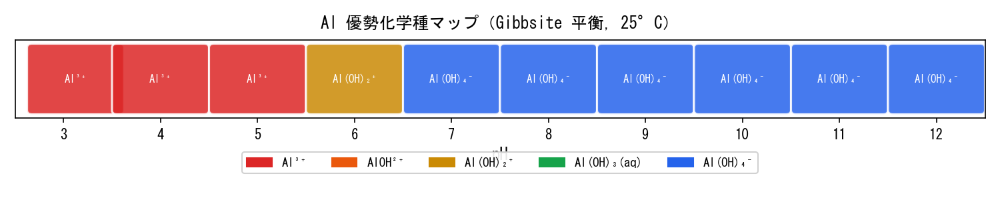

## はじめに：なぜ Python と連携するのか

PHREEQC の `USER_GRAPH` は手軽にグラフを描けるが、**出版品質の図・インタラクティブ可視化・統計処理**には Python が圧倒的に強い。 #7 で出力した `gibbsite_solubility.txt` を Python で読み込み、以下を実現する：

```{=html}
<div style="display:grid; grid-template-columns:repeat(3,1fr); gap:1em; margin:1.5em 0;">
  <div style="background:#FFF7ED; border-radius:10px; padding:1.1em; text-align:center; border-bottom:3px solid #D97706;">
    <div style="font-size:1.8em; margin-bottom:0.3em;">🐼</div>
    <div style="font-weight:700; color:#92400E; font-size:0.95em;">pandas</div>
    <div style="font-size:0.82em; color:#78350F; margin-top:0.4em; line-height:1.5;">SELECTED_OUTPUT の<br>タブ区切りファイルを<br>スマートに読み込む</div>
  </div>
  <div style="background:#F0FDF4; border-radius:10px; padding:1.1em; text-align:center; border-bottom:3px solid #16A34A;">
    <div style="font-size:1.8em; margin-bottom:0.3em;">📈</div>
    <div style="font-weight:700; color:#15803D; font-size:0.95em;">matplotlib</div>
    <div style="font-size:0.82em; color:#166534; margin-top:0.4em; line-height:1.5;">出版品質の<br>溶解度ダイアグラムを<br>描画する</div>
  </div>
  <div style="background:#EFF6FF; border-radius:10px; padding:1.1em; text-align:center; border-bottom:3px solid #2563EB;">
    <div style="font-size:1.8em; margin-bottom:0.3em;">🔵</div>
    <div style="font-weight:700; color:#1E3A5F; font-size:0.95em;">plotly</div>
    <div style="font-size:0.82em; color:#1E40AF; margin-top:0.4em; line-height:1.5;">ホバー対応の<br>インタラクティブ図を<br>ブログに埋め込む</div>
  </div>
</div>
```

::: callout-note
## 前提

- #7 の PHREEQC コードを実行済みで `gibbsite_solubility.txt` が手元にあること
- Python 3.9 以上 + `pandas`, `matplotlib`, `plotly` がインストール済みであること\
  （`pip install pandas matplotlib plotly kaleido`）
:::

------------------------------------------------------------------------

## Step 1：SELECTED_OUTPUT ファイルの構造を理解する

PHREEQC の `SELECTED_OUTPUT` が出力するファイルはタブ区切りのテキストだ。 先頭行がヘッダー、2行目以降がデータになる。

```{=html}
<div style="background:#1E293B; border-radius:8px; padding:1.3em; margin:1.2em 0; overflow-x:auto;">
<pre style="color:#1E293B; font-size:0.82em; margin:0; line-height:1.6; font-family:'Cascadia Code','Fira Code',monospace;">
<span style="color:#94A3B8;"># gibbsite_solubility.txt（抜粋）</span>
sim state   soln    dist_x  <span style="color:#FCD34D;">pH</span>  <span style="color:#86EFAC;">Al</span> <span style="color:#94A3B8;">Al+3</span>    AlOH+2  Al(OH)2+    Al(OH)3 Al(OH)4-    <span style="color:#93C5FD;">Gibbsite</span>
1   i_soln  1   -1  7.000   0.000e+00   ...
2   react   1   -1  3.000   <span style="color:#FCD34D;">3.000</span>   <span style="color:#86EFAC;">7.76e-03</span>    <span style="color:#F9A8D4;">-2.110</span>  -5.270  -7.970  -9.710  -13.5   ...
3   react   2   -1  <span style="color:#FCD34D;">4.000</span>   <span style="color:#86EFAC;">7.76e-04</span>    <span style="color:#F9A8D4;">-3.110</span>  -5.270  -6.970  -9.710  -13.5   ...
...
</pre>
</div>
```

::: callout-important
## ヘッダー名の注意点

`-activities` で指定した化学種は **log₁₀（活量）** で出力される。 一方 `-totals` で指定した `Al` は **mol/kgw（線形値）** で出力される。 可視化前に `np.log10()` で変換が必要な列と不要な列を区別しよう。

場合によっては**ヘッダーが　「pH Al・・・」**に始まる場合がある。
:::

------------------------------------------------------------------------

## Step 2：pandas でデータを読み込む

``` python
# ============================================================
#  phreeqc_read.py
#  PHREEQC SELECTED_OUTPUT ファイルの読み込みと整形
# ============================================================
import pandas as pd
import numpy as np
from pathlib import Path

# ---- ファイル読み込み ----
fp = Path("gibbsite_solubility.txt")

df_raw = pd.read_csv(
    fp,
    sep="\t",        # タブ区切り
    comment="#",     # # 行をスキップ
    skipinitialspace=True,
)

print(f"Shape: {df_raw.shape}")
print(df_raw.head())
print("\nColumns:", df_raw.columns.tolist())
```

```{=html}
<div style="background:#F8FAFC; border:1px solid #E2E8F0; border-radius:8px; padding:1.1em; margin:1em 0; font-size:0.85em; font-family:'Cascadia Code','Fira Code',monospace; overflow-x:auto; color:#334155;">
> Shape: (13, 10) or (10, 10)<br>
> Columns: ['sim', 'state', 'soln', 'dist_x', 'pH', 'Al', 'la_Al+3',<br>
&nbsp;&nbsp;&nbsp;&nbsp;&nbsp;&nbsp;&nbsp;&nbsp;&nbsp;'la_AlOH+2', 'la_Al(OH)2+', 'la_Al(OH)3', 'la_Al(OH)4-', 'Gibbsite']
</div>
```

``` python
# ---- 整形：初期状態行を除き、pHデータ行だけ残す ----
df = (
    df_raw
    #.query("state == 'react'")          # 平衡計算結果だけ
    .rename(columns={
        "Al": "Al_total_mol",  # total Al（線形値）
        "la_Al+3":        "log_Al3",
        "la_AlOH+2":      "log_AlOH2",
        "la_Al(OH)2+":    "log_AlOH2p",
        "la_Al(OH)3":     "log_AlOH3",
        "la_Al(OH)4-":    "log_AlOH4",
    })
    .reset_index(drop=True)
)

# ---- total Al を log スケールに変換 ----
df["log_Al_total"] = np.log10(df["Al_total_mol"].clip(lower=1e-15))

print(df[["pH", "log_Al_total", "log_Al3", "log_AlOH2p", "log_AlOH3","log_AlOH4"]].to_string(index=False))
```

```{=html}
<div style="overflow-x:auto; margin:1em 0; border-radius:8px;">
<table style="width:100%; border-collapse:collapse; font-size:0.86em; font-family:'Cascadia Code','Fira Code',monospace;">
  <thead>
    <tr style="background:#D97706; color:white;">
      <th style="padding:8px 14px;">pH</th>
      <th style="padding:8px 14px;">log_Al_total</th>
      <th style="padding:8px 14px;">log_Al3</th>
      <th style="padding:8px 14px;">log_AlOH2p</th>
      <th style="padding:8px 14px;">log_AlOH3</th>
      <th style="padding:8px 14px;">log_AlOH4</th>
    </tr>
  </thead>
  <tbody>
    <tr style="background:#FFF7ED;"><td style="padding:7px 14px;">3.12</td><td>0.45</td><td>-0.98</td><td>-5.03</td><td>-8.83</td><td>-11.52</td></tr>
    <tr style="background:#FDFDFD;"><td style="padding:7px 14px;">4.00</td><td>-3.71</td><td>-3.89</td><td>-6.00</td><td>-8.83</td><td>-10.56</td></tr>
    <tr style="background:#FFF7ED;"><td style="padding:7px 14px;">5.00</td><td>-6.44</td><td>-6.89</td><td>-7.00</td><td>-8.83</td><td>-9.56</td></tr>
    <tr style="background:#FED7AA; font-weight:600; color:#92400E;"><td style="padding:7px 14px;">6.00 ★</td><td>-7.80</td><td>-9.89</td><td>-8.00</td><td>-8.83</td><td>-8.56</td></tr>
    <tr style="background:#FDFDFD;"><td style="padding:7px 14px;">7.00</td><td>-7.52</td><td>-12.89</td><td>-9.00</td><td>-8.83</td><td>-7.56</td></tr>
    <tr style="background:#FFF7ED;"><td style="padding:7px 14px;">8.00</td><td>-6.55</td><td>-15.89</td><td>-10.00</td><td>-8.83</td><td>-6.56</td></tr>
    <tr style="background:#FDFDFD;"><td style="padding:7px 14px;">9.00</td><td>-5.55</td><td>-18.89</td><td>-11.00</td><td>-8.83</td><td>-5.56</td></tr>
    <tr style="background:#FFF7ED;"><td style="padding:7px 14px;">10.00</td><td>-4.55</td><td>-21.89</td><td>-12.00</td><td>-8.83</td><td>-4.56</td></tr>
    <tr style="background:#FDFDFD;"><td style="padding:7px 14px;">11.00</td><td>-3.54</td><td>-24.89</td><td>-13.00</td><td>-8.83</td><td>-3.56</td></tr>
    <tr style="background:#FFF7ED;"><td style="padding:7px 14px;">12.00</td><td>-2.50</td><td>-27.89</td><td>-14.00</td><td>-8.83</td><td>-2.56</td></tr>
  </tbody>
</table>
</div>
```

------------------------------------------------------------------------

## Step 3：matplotlib で出版品質の図を描く

Step 2の下に以下のコードをコピー＆ペーストすること。

``` python
# ============================================================
#  phreeqc_plot_matplotlib.py
# ============================================================
import matplotlib.pyplot as plt
import matplotlib.ticker as ticker
import numpy as np
import pandas as pd

# ---- フォント設定（日本語環境） ----
plt.rcParams.update({
    "font.family": "sans-serif",
    "font.sans-serif": ["MS Gothic", "Noto Sans CJK JP", "IPAexGothic", "DejaVu Sans"],
    "axes.unicode_minus": False,
    "figure.dpi":      150,
})

# ---- データ（dfはStep2で作成済み） ----
ph = df["pH"].values

species = {
    "Total Al":      ("log_Al_total", "#111827", 2.8, "-",  "o"),
    r"Al$^{3+}$":    ("log_Al3",      "#DC2626", 1.8, "-",  "s"),
    r"AlOH$^{2+}$":  ("log_AlOH2",   "#EA580C", 1.6, "--", "^"),
    r"Al(OH)$_2^+$": ("log_AlOH2p",  "#CA8A04", 1.6, "-.", "D"),
    r"Al(OH)$_3$(aq)":("log_AlOH3",  "#16A34A", 1.6, ":",  ""),
    r"Al(OH)$_4^-$": ("log_AlOH4",   "#2563EB", 1.8, "-",  "v"),
}

fig, ax = plt.subplots(figsize=(9, 6))

# ---- Gibbsite 安定域の背景色 ----
ax.axvspan(5.5, 8.5, alpha=0.07, color="#16A34A", label="_nolegend_")
ax.text(7.0, -2.3, "Gibbsite\n安定域", ha="center", va="top",
        fontsize=9, color="#15803D", style="italic")

# ---- 各化学種ライン ----
for label, (col, color, lw, ls, marker) in species.items():
    y = df[col].replace([np.inf, -np.inf], np.nan).values
    valid = ~np.isnan(y) & (y > -12)          # 検出限界以上のみ
    if marker:
        ax.plot(ph[valid], y[valid], color=color, lw=lw,
                ls=ls, marker=marker, ms=5, label=label)
    else:
        ax.plot(ph[valid], y[valid], color=color, lw=lw,
                ls=ls, label=label)

# ---- 最小値アノテーション ----
min_idx = df["log_Al_total"].idxmin()
min_ph  = df.loc[min_idx, "pH"]
min_log = df.loc[min_idx, "log_Al_total"]
ax.annotate(
    f"最小値\npH ≈ {min_ph:.1f}\n10⁻⁷ mol/L",
    xy=(min_ph, min_log),
    xytext=(min_ph + 1.5, min_log + 1.2),
    fontsize=9, color="#92400E",
    arrowprops=dict(arrowstyle="->", color="#D97706", lw=1.5),
    bbox=dict(boxstyle="round,pad=0.3", fc="#FEF3C7", ec="#D97706", alpha=0.9),
)

# ---- 軸・装飾 ----
ax.set_xlim(3, 14)
ax.set_ylim(-11, 0.5)
ax.set_xlabel("pH", fontsize=13)
ax.set_ylabel(r"$\log$ [Al]  (mol/kgw)", fontsize=13)
ax.set_title("Gibbsite 溶解度ダイアグラム（Al–H₂O系, 25°C）", fontsize=14, pad=12)
ax.xaxis.set_major_locator(ticker.MultipleLocator(1))
ax.yaxis.set_major_locator(ticker.MultipleLocator(1))
ax.grid(True, which="major", ls="--", lw=0.5, color="#E5E7EB")
ax.legend(loc="upper right", fontsize=10, framealpha=0.95)

plt.tight_layout()
plt.savefig("gibbsite_solubility.png", dpi=300, bbox_inches="tight")
plt.savefig("gibbsite_solubility.svg", bbox_inches="tight")   # ベクター形式
plt.show()
print("✅ 保存完了：gibbsite_solubility.png / .svg")
```

------------------------------------------------------------------------

## Step 4：優勢化学種マップ（speciation diagram）

溶解度だけでなく、**どの化学種が優勢か**を色で示す図も地球化学では頻出だ。

``` python
# ============================================================
#  phreeqc_speciation_map.py
#  各 pH での優勢 Al 化学種を色でマッピング
# ============================================================
import matplotlib.pyplot as plt
import matplotlib.patches as mpatches
import numpy as np
import pandas as pd

# 各 pH で最大活量の化学種を判定
activity_cols = ["log_Al3", "log_AlOH2", "log_AlOH2p", "log_AlOH3", "log_AlOH4"]
species_names  = ["Al³⁺", "AlOH²⁺", "Al(OH)₂⁺", "Al(OH)₃(aq)", "Al(OH)₄⁻"]
species_colors = ["#DC2626", "#EA580C", "#CA8A04", "#16A34A", "#2563EB"]

df_act = df[activity_cols].replace([np.inf, -np.inf], np.nan).fillna(-99)
dominant_idx = df_act.values.argmax(axis=1)

fig, ax = plt.subplots(figsize=(10, 2.2))

for i, row in df.iterrows():
    ph_val = row["pH"]
    d_idx  = dominant_idx[i]
    color  = species_colors[d_idx]
    rect   = mpatches.FancyBboxPatch(
        (ph_val - 0.45, 0.1), 0.9, 0.8,
        boxstyle="round,pad=0.05",
        facecolor=color, edgecolor="white", linewidth=1.5, alpha=0.85,
    )
    ax.add_patch(rect)
    ax.text(ph_val, 0.5, species_names[d_idx],
            ha="center", va="center", fontsize=8, color="white", fontweight="bold")

ax.set_xlim(2.5, 12.5)
ax.set_ylim(0, 1)
ax.set_xlabel("pH", fontsize=12)
ax.set_yticks([])
ax.set_xticks(range(3, 13))
ax.set_title("Al 優勢化学種マップ（Gibbsite 平衡, 25°C）", fontsize=12, pad=8)

# 凡例
patches = [mpatches.Patch(color=c, label=n)
           for c, n in zip(species_colors, species_names)]
ax.legend(handles=patches, loc="upper center",
          bbox_to_anchor=(0.5, -0.35), ncol=5, fontsize=9, framealpha=0.9)

plt.tight_layout()
plt.savefig("al_speciation_map.svg", bbox_inches="tight")
plt.show()
```



------------------------------------------------------------------------

## Step 5：完全な解析ワークフロー（one-file スクリプト）

上記 Step 1〜5 をひとつのスクリプトにまとめた完全版で、このコードをコピー＆ペーストして図を確認しよう。#7からの成果物である。

``` python
#  gibbsite_full_analysis.py
#  PHREEQC #7 結果の完全解析スクリプト
#  使い方: python gibbsite_full_analysis.py gibbsite_solubility.txt
# ============================================================
import sys
import numpy as np
import pandas as pd
import matplotlib.pyplot as plt
import matplotlib.ticker as ticker
import matplotlib.patches as mpatches

# ---- フォント設定（日本語環境） ----
plt.rcParams.update({
    "font.family": "sans-serif",
    "font.sans-serif": ["MS Gothic", "Noto Sans CJK JP", "IPAexGothic", "DejaVu Sans"],
    "axes.unicode_minus": False,
    "figure.dpi":      150,
})

# ---- 定数 ----
SPECIES = {
    "Total Al":       ("log_Al_total", "#111827", 2.8, "-"),
    r"Al$^{3+}$":     ("log_Al3",      "#DC2626", 1.8, "-"),
    r"AlOH$^{2+}$":   ("log_AlOH2",   "#EA580C", 1.6, "--"),
    r"Al(OH)$_2^+$":  ("log_AlOH2p",  "#CA8A04", 1.6, "-."),
    r"Al(OH)$_3$":    ("log_AlOH3",   "#16A34A", 1.6, ":"),
    r"Al(OH)$_4^-$":  ("log_AlOH4",   "#2563EB", 1.8, "-"),
}

ACT_COLS  = ["log_Al3", "log_AlOH2", "log_AlOH2p", "log_AlOH3", "log_AlOH4"]
SP_NAMES  = [r"Al$^{3+}$", r"AlOH$^{2+}$", r"Al(OH)$_2^+$",
             r"Al(OH)$_3$(aq)", r"Al(OH)$_4^-$"]
SP_COLORS = ["#DC2626", "#EA580C", "#CA8A04", "#16A34A", "#2563EB"]


def load_data(filepath: str) -> pd.DataFrame:
    """SELECTED_OUTPUT を読み込み整形する"""
    df = pd.read_csv(filepath, sep="\t", comment="#", skipinitialspace=True)
    #df = df.query("state == 'react'").reset_index(drop=True)
    df = df.rename(columns={
        "Al": "Al_total_mol",
        "la_Al+3": "log_Al3", "la_AlOH+2": "log_AlOH2",
        "la_Al(OH)2+": "log_AlOH2p", "la_Al(OH)3": "log_AlOH3", "la_Al(OH)4-": "log_AlOH4",
    })
    df["log_Al_total"] = np.log10(df["Al_total_mol"].clip(lower=1e-15))
    return df


def plot_solubility(df: pd.DataFrame, save: bool = True):
    """溶解度ダイアグラムを描画"""
    fig, ax = plt.subplots(figsize=(9, 6))
    ax.axvspan(5.5, 8.5, alpha=0.07, color="#16A34A")
    ax.text(7.0, -2.0, "Gibbsite\n安定域", ha="center",
            fontsize=9, color="#15803D", style="italic")

    for label, (col, color, lw, ls) in SPECIES.items():
        y = df[col].replace([np.inf, -np.inf], np.nan).values
        mask = ~np.isnan(y) & (y > -12)
        ax.plot(df["pH"].values[mask], y[mask],
                color=color, lw=lw, ls=ls, label=label, marker="o", ms=4)

    # 最小値アノテーション
    mi = df["log_Al_total"].idxmin()
    ax.annotate(
        f"最小値 pH≈{df.loc[mi,'pH']:.1f}",
        xy=(df.loc[mi, "pH"], df.loc[mi, "log_Al_total"]),
        xytext=(df.loc[mi, "pH"] + 1.5, df.loc[mi, "log_Al_total"] + 1.5),
        fontsize=9, color="#92400E",
        arrowprops=dict(arrowstyle="->", color="#D97706"),
        bbox=dict(boxstyle="round", fc="#FEF3C7", ec="#D97706"),
    )

    ax.set(xlim=(3, 14), ylim=(-11, 0.5),
           xlabel="pH", ylabel=r"$\log$ [Al] (mol/kgw)",
           title="Gibbsite 溶解度ダイアグラム（Al–H₂O系, 25°C）")
    ax.xaxis.set_major_locator(ticker.MultipleLocator(1))
    ax.yaxis.set_major_locator(ticker.MultipleLocator(1))
    ax.grid(True, ls="--", lw=0.5, color="#E5E7EB")
    ax.legend(fontsize=10, loc="upper right")
    plt.tight_layout()
    if save:
        fig.savefig("gibbsite_solubility.svg", bbox_inches="tight")
        print("✅ gibbsite_solubility.svg を保存")
    plt.show()


def plot_speciation_map(df: pd.DataFrame, save: bool = True):
    """優勢化学種マップを描画"""
    df_act = df[ACT_COLS].replace([np.inf, -np.inf], np.nan).fillna(-99)
    dom = df_act.values.argmax(axis=1)

    fig, ax = plt.subplots(figsize=(10, 2.2))
    for i, row in df.iterrows():
        c = SP_COLORS[dom[i]]
        rect = mpatches.FancyBboxPatch(
            (row["pH"] - 0.45, 0.1), 0.9, 0.8,
            boxstyle="round,pad=0.05",
            facecolor=c, edgecolor="white", lw=1.5, alpha=0.85,
        )
        ax.add_patch(rect)
        ax.text(row["pH"], 0.5, SP_NAMES[dom[i]],
                ha="center", va="center", fontsize=8,
                color="white", fontweight="bold")

    patches = [mpatches.Patch(color=c, label=n)
               for c, n in zip(SP_COLORS, SP_NAMES)]
    ax.set(xlim=(2.5, 12.5), ylim=(0, 1),
           xlabel="pH", title="Al 優勢化学種マップ（Gibbsite 平衡, 25°C）")
    ax.set_yticks([])
    ax.set_xticks(range(3, 13))
    ax.legend(handles=patches, loc="upper center",
              bbox_to_anchor=(0.5, -0.35), ncol=5, fontsize=9)
    plt.tight_layout()
    if save:
        fig.savefig("al_speciation_map.svg", bbox_inches="tight")
        print("✅ al_speciation_map.svg を保存")
    plt.show()


# ---- メイン ----
if __name__ == "__main__":
    fp = sys.argv[1] if len(sys.argv) > 1 else "gibbsite_solubility.txt"
    df = load_data(fp)
    print(df[["pH", "log_Al_total", "log_Al3", "log_AlOH4"]].to_string(index=False))
    plot_solubility(df)
    plot_speciation_map(df)
```

実行は一行：

``` bash
python gibbsite_full_analysis.py gibbsite_solubility.txt
```

------------------------------------------------------------------------

## まとめ：PHREEQC × Python ワークフロー全体像

```{=html}
<div style="background:#FDFDFD; border:1px solid #E5E7EB; border-radius:12px; padding:1.5em; margin:1.5em 0;">
<svg viewBox="0 0 680 110" xmlns="http://www.w3.org/2000/svg" style="width:100%;max-width:680px;display:block;margin:0 auto;">
  <defs>
    <marker id="arr" markerWidth="8" markerHeight="8" refX="6" refY="3" orient="auto">
      <path d="M0,0 L0,6 L8,3 z" fill="#9CA3AF"/>
    </marker>
  </defs>
  <!-- ボックス -->
  <rect x="10" y="30" width="120" height="50" rx="8" fill="#FFF7ED" stroke="#D97706" stroke-width="1.5"/>
  <text x="70" y="52" text-anchor="middle" font-size="12" font-weight="700" fill="#92400E">PHREEQC</text>
  <text x="70" y="68" text-anchor="middle" font-size="10" fill="#78350F">.pqi 実行</text>

  <line x1="130" y1="55" x2="158" y2="55" stroke="#9CA3AF" stroke-width="1.5" marker-end="url(#arr)"/>

  <rect x="160" y="30" width="130" height="50" rx="8" fill="#F0FDF4" stroke="#16A34A" stroke-width="1.5"/>
  <text x="225" y="52" text-anchor="middle" font-size="12" font-weight="700" fill="#15803D">SELECTED_OUTPUT</text>
  <text x="225" y="68" text-anchor="middle" font-size="10" fill="#166534">gibbsite_solubility.txt</text>

  <line x1="290" y1="55" x2="318" y2="55" stroke="#9CA3AF" stroke-width="1.5" marker-end="url(#arr)"/>

  <rect x="320" y="30" width="110" height="50" rx="8" fill="#EFF6FF" stroke="#2563EB" stroke-width="1.5"/>
  <text x="375" y="52" text-anchor="middle" font-size="12" font-weight="700" fill="#1E3A5F">pandas</text>
  <text x="375" y="68" text-anchor="middle" font-size="10" fill="#1E40AF">読込・整形</text>

  <line x1="430" y1="55" x2="458" y2="55" stroke="#9CA3AF" stroke-width="1.5" marker-end="url(#arr)"/>

  <rect x="460" y="30" width="120" height="50" rx="8" fill="#FEF9C3" stroke="#CA8A04" stroke-width="1.5"/>
  <text x="515" y="52" text-anchor="middle" font-size="12.5" font-weight="700" fill="#92400E">matplotlib</text>
  <text x="515" y="68" text-anchor="middle" font-size="10" fill="#78350F">静的図 (SVG)</text>
</svg>
</div>
```

```{=html}
<div style="display:grid; grid-template-columns:repeat(3,1fr); gap:1em; margin:1em 0;">
  <div style="background:#FFF7ED; border-radius:10px; padding:1em; text-align:center; border-bottom:3px solid #D97706;">
    <div style="font-weight:700; color:#92400E; margin-bottom:0.3em;">Step 1–2</div>
    <div style="font-size:0.83em; color:#78350F; line-height:1.5;">PHREEQC 実行<br>→ txt 出力<br>→ pandas 読込</div>
  </div>
  <div style="background:#F0FDF4; border-radius:10px; padding:1em; text-align:center; border-bottom:3px solid #16A34A;">
    <div style="font-weight:700; color:#15803D; margin-bottom:0.3em;">Step 3</div>
    <div style="font-size:0.83em; color:#166534; line-height:1.5;">matplotlib で静的図</div>
  </div>
  <div style="background:#EFF6FF; border-radius:10px; padding:1em; text-align:center; border-bottom:3px solid #2563EB;">
    <div style="font-weight:700; color:#1E3A5F; margin-bottom:0.3em;">Step 4–5</div>
    <div style="font-size:0.83em; color:#1E40AF; line-height:1.5;">優勢種マップ<br>one-file スクリプトで<br>自動化完了</div>
  </div>
</div>
```

次回 #9 では、イオン強度と活量係数 — 海水と真水で計算結果が変わる理由について調べる。

- [#1 インストールと最初の計算](../phreeqc-part1/)
- [#2 Speciationで海水を解析する](../phreeqc-part2/)
- [#3 MixingとEQUILIBRIUM_PHASES](../phreeqc-part3/)
- [#4 カルサイト−CO₂水反応](../phreeqc-part4/)
- [#5 炭酸地下水と海水の混合](../phreeqc-part5/)
- [#6 黄鉄鉱の酸化（AMD）](../phreeqc-part6/)
- [#7 溶解度ダイアグラム（Gibbsite）](../phreeqc-part7/)
- **[#8 Pythonでの可視化]**
- [#9 イオン強度と活量係数](../phreeqc-part9/)

------------------------------------------------------------------------

*DeepFlow \| 地球科学シミュレーションの深みへ*