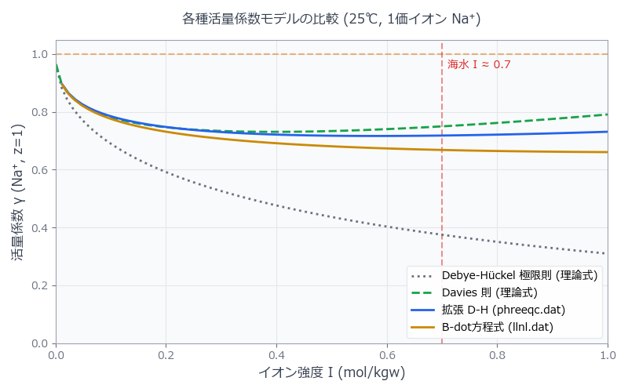

## はじめに：#2 から積み上がってきた「未解決の謎」

#2 の海水 Speciation から始まり、#7 の Gibbsite 溶解度計算まで、
すべての計算の裏でひとつの問いが浮かんでいたはずだ：

> **「なぜ同じ pH・同じ温度でも、海水と真水で計算結果が変わるのか？」**

答えは **活量（activity）** にある。
PHREEQC は濃度（mol/kgw）を直接使って平衡を計算するのではなく、
濃度に「補正係数」をかけた **活量** を使って計算する。
この補正係数こそが **活量係数 γ**（ガンマ）だ。

```{=html}
<div style="background:#FFF7ED; border-left:4px solid #D97706; padding:1.2em 1.5em; margin:1.5em 0; border-radius:0 8px 8px 0;">
  <div style="font-weight:700; color:#92400E; margin-bottom:0.5em;">このシリーズ全体を貫く方程式</div>
  <div style="font-size:1.1em; text-align:center; color:#78350F; font-family:Georgia,serif; padding:0.5em 0;">
    <em>a</em><sub>i</sub> = γ<sub>i</sub> · <em>m</em><sub>i</sub>
  </div>
  <div style="font-size:0.88em; color:#78350F; margin-top:0.6em; line-height:1.7;">
    <em>a<sub>i</sub></em>：化学種 <em>i</em> の活量（無次元）　　
    <em>γ<sub>i</sub></em>：活量係数（0 &lt; γ ≤ 1）　　
    <em>m<sub>i</sub></em>：モル濃度（mol/kgw）
  </div>
</div>
```

希薄溶液では γ ≈ 1 なので活量 ≈ 濃度。
しかし海水（イオン強度 I ≈ 0.7 mol/kg）では γ が 0.1 以下まで下がる種もある。
これが無視できない誤差を生む。

::: {.callout-note}
## この記事で学ぶこと
- **イオン強度 I** の定義と計算方法
- Debye-Hückel・拡張 Debye-Hückel・Davies・Pitzer の 4 モデルの仕組みと使い分け
- PHREEQC での活量係数モデルの設定方法（`-activity_coefficients`）
- 同じ溶液を 4 つのモデルで計算し、結果の差を比較するコード
- 「どのモデルを選ぶべきか」の判断フロー
:::

---

## 理論 Part 1：イオン強度とは何か

### 定義

**イオン強度 I** は溶液中のすべてのイオンの「電荷の重み付き濃度」だ：

$$
I = \frac{1}{2} \sum_i m_i z_i^2
$$

$m_i$：イオン $i$ のモル濃度（mol/kgw）、$z_i$：イオン $i$ の価数

```{=html}
<div style="overflow-x:auto; margin:1.5em 0;">
<table style="width:100%; border-collapse:collapse; font-size:0.9em;">
  <thead>
    <tr style="background:#D97706; color:white;">
      <th style="padding:10px 14px; text-align:left;">溶液</th>
      <th style="padding:10px 14px; text-align:left;">代表的組成</th>
      <th style="padding:10px 14px; text-align:center;">I（mol/kg）</th>
      <th style="padding:10px 14px; text-align:left;">適用モデル</th>
    </tr>
  </thead>
  <tbody>
    <tr style="background:#F0FDF4;">
      <td style="padding:9px 14px; font-weight:600; color:#15803D;">蒸留水・雨水</td>
      <td style="padding:9px 14px; font-size:0.88em; color:#166534;">ほぼ純水</td>
      <td style="padding:9px 14px; text-align:center; font-family:monospace;">&lt; 0.001</td>
      <td style="padding:9px 14px; font-size:0.88em;">Debye-Hückel（単純版）</td>
    </tr>
    <tr style="background:#FDFDFD;">
      <td style="padding:9px 14px; font-weight:600; color:#374151;">河川水・地下水</td>
      <td style="padding:9px 14px; font-size:0.88em; color:#6B7280;">Ca²⁺, HCO₃⁻ 主体</td>
      <td style="padding:9px 14px; text-align:center; font-family:monospace;">0.001–0.05</td>
      <td style="padding:9px 14px; font-size:0.88em;">拡張 Debye-Hückel</td>
    </tr>
    <tr style="background:#FFF7ED;">
      <td style="padding:9px 14px; font-weight:600; color:#92400E;">汽水・温泉水</td>
      <td style="padding:9px 14px; font-size:0.88em; color:#78350F;">Na⁺, Cl⁻ 増加</td>
      <td style="padding:9px 14px; text-align:center; font-family:monospace;">0.05–0.5</td>
      <td style="padding:9px 14px; font-size:0.88em;">Davies</td>
    </tr>
    <tr style="background:#FEF2F2;">
      <td style="padding:9px 14px; font-weight:600; color:#991B1B;">海水</td>
      <td style="padding:9px 14px; font-size:0.88em; color:#7F1D1D;">NaCl ≈ 0.5 M</td>
      <td style="padding:9px 14px; text-align:center; font-family:monospace; font-weight:600;">≈ 0.7</td>
      <td style="padding:9px 14px; font-size:0.88em;">Davies / Pitzer</td>
    </tr>
    <tr style="background:#EFF6FF;">
      <td style="padding:9px 14px; font-weight:600; color:#1E3A5F;">塩湖・坑廃水</td>
      <td style="padding:9px 14px; font-size:0.88em; color:#1E40AF;">高濃度塩類</td>
      <td style="padding:9px 14px; text-align:center; font-family:monospace; font-weight:600;">&gt; 1</td>
      <td style="padding:9px 14px; font-size:0.88em; font-weight:600; color:#1E3A5F;">Pitzer 必須</td>
    </tr>
  </tbody>
</table>
</div>
```

### 海水の I を手計算してみる

```{=html}
<div style="background:#F8FAFC; border:1px solid #E2E8F0; border-radius:8px; padding:1.3em; margin:1em 0; font-size:0.88em; font-family:'Cascadia Code','Fira Code',monospace; color:#334155; overflow-x:auto; line-height:1.8;">
<span style="color:#6B7280;"># 海水の主要イオン組成（mol/kgw）</span><br>
Na⁺  = 0.4689,  z = +1  →  0.4689 × 1²  = 0.4689<br>
Cl⁻  = 0.5453,  z = −1  →  0.5453 × 1²  = 0.5453<br>
Mg²⁺ = 0.0528,  z = +2  →  0.0528 × 4   = 0.2112<br>
SO₄²⁻= 0.0283,  z = −2  →  0.0283 × 4   = 0.1132<br>
Ca²⁺ = 0.0103,  z = +2  →  0.0103 × 4   = 0.0412<br>
K⁺   = 0.0102,  z = +1  →  0.0102 × 1   = 0.0102<br>
<span style="color:#6B7280;">──────────────────────────────────────</span><br>
合計                              = 1.3900<br>
<span style="color:#D97706; font-weight:600;">I = 1.3900 / 2 = <strong>0.695 mol/kg</strong></span>
</div>
```

---

## 理論 Part 2：4 つの活量係数モデル

### モデル 1：Debye-Hückel（DH）

最もシンプルな理論式。イオン間のクーロン引力だけを考慮する：

$$
\log \gamma_i = -A z_i^2 \sqrt{I}
$$

A = 0.509（25°C, 水）。**I < 0.005 mol/kg** の非常に希薄な溶液のみで有効。

### モデル 2：拡張 Debye-Hückel（LLNL 型）

イオンの有効半径（å パラメータ）を加えた補正版：

$$
\log \gamma_i = \frac{-A z_i^2 \sqrt{I}}{1 + B a_i \sqrt{I}}
$$

$a_i$：イオンの有効半径（Å）、B = 0.328。**I < 0.1 mol/kg** で有効。
PHREEQC の標準データベース（phreeqc.dat, llnl.dat）はこのモデルを使用。

### モデル 3：Davies

高イオン強度向けの経験的補正項を加えたもの：

$$
\log \gamma_i = -A z_i^2 \left( \frac{\sqrt{I}}{1 + \sqrt{I}} - 0.3 I \right)
$$

**I < 0.5 mol/kg** まで使用可能。汽水・土壌水に適する。
PHREEQC では `-activity_model davies` で指定。

### モデル 4：Pitzer（ピッツァー）

特定のイオン対ごとに実測した相互作用パラメータ（β⁰, β¹, Cφ）を使った高精度モデル：

$$
\ln \gamma_{\pm} = f(I) + \sum_{ij} B_{ij}(I) m_j + \sum_{ijk} C_{ijk} m_j m_k + \cdots
$$

**I > 0.5 mol/kg**（海水・塩湖・地熱流体）では必須。
PHREEQC では `pitzer.dat` データベースを使用。

---

## 4 モデルの比較
```python
import os
import numpy as np
import pandas as pd
import matplotlib.pyplot as plt
from phreeqpy.iphreeqc.phreeqc_dll import IPhreeqc

# ==============================
# 1. データベースのパス設定
# ==============================
# ※ご自身の環境に合わせて修正してください
DB_PHREEQC = r"C:\あなたのPATH\phreeqc.dat"　#phreeqc.datは同じフォルダに置いてください
DB_LLNL    = r"C:\あなたのPATH\llnl.dat"  　 #llnl.datは同じフォルダに置いてください  

# ==============================
# 2. PHREEQC入力文字列
# ==============================
# ★修正: イオン強度が確実に1.0を超えるように、添加量を 1.1 mol に増やす
input_string = """
SOLUTION 1 Pure water
    temp 25
    pH 7 charge

REACTION 1
    NaCl 1.1
    1.1 moles in 100 steps

SELECTED_OUTPUT
    -reset false
    -user_punch true

USER_PUNCH
    -headings I Gamma_Na
    -start
    10 PUNCH MU, GAMMA("Na+")
    -end
"""

# ==============================
# 3. PHREEQC実行関数
# ==============================
def run_phreeqc(db_path, label):
    db_path = os.path.abspath(db_path)
    print(f"Loading DB: {os.path.basename(db_path)} ...", end=" ")

    if not os.path.exists(db_path):
        raise FileNotFoundError(f"\n❌ Database not found: {db_path}")

    ip = IPhreeqc()

    try:
        ip.load_database(db_path)
    except Exception as e:
        raise RuntimeError(f"\n❌ Python Exception during load_database: {e}")

    error_str = ip.get_error_string()
    if error_str:
        raise RuntimeError(f"\n❌ Failed to load {label} DB (DLL Error):\n{error_str}")
    
    print("OK")

    try:
        ip.run_string(input_string)
    except Exception as e:
        error_str = ip.get_error_string()
        raise RuntimeError(f"\n❌ PHREEQC execution error for {label}:\n{e}\n{error_str}")
    
    out = ip.get_selected_output_array()
    
    if len(out) > 1:
        df = pd.DataFrame(out[1:], columns=out[0]).astype(float)
        return df
    return pd.DataFrame()

# ==============================
# 4. 理論式の計算（モデル 1：Debye-Hückel（DH）, モデル 3：Davies）
# ==============================
def calc_theoretical(I):
    A = 0.509  
    z = 1.0    

    gamma_dh = 10 ** (-A * (z**2) * np.sqrt(I))
    gamma_davies = 10 ** (-A * (z**2) * (np.sqrt(I) / (1 + np.sqrt(I)) - 0.3 * I))

    return gamma_dh, gamma_davies

# ==============================
# 5. 実行とデータ収集
# ==============================
if __name__ == "__main__":
    try:
        df_phreeqc = run_phreeqc(DB_PHREEQC, "PHREEQC")
        df_llnl    = run_phreeqc(DB_LLNL, "LLNL")

        # ★修正: Step 0 (純水) のときに出力される γ=0 の行を除外する！
        df_phreeqc = df_phreeqc[df_phreeqc['Gamma_Na'] > 0]
        df_llnl    = df_llnl[df_llnl['Gamma_Na'] > 0]

        I_theory = np.linspace(0.001, 1.0, 100)
        gamma_dh, gamma_davies = calc_theoretical(I_theory)

        # ==============================
        # 6. グラフの描画
        # ==============================
        plt.rcParams['font.family'] = 'Meiryo' if os.name == 'nt' else 'sans-serif'

        fig, ax = plt.subplots(figsize=(8, 5))
        ax.set_facecolor('#F9FAFB')
        ax.grid(color='#E5E7EB', linestyle='-', linewidth=0.8)
        for spine in ax.spines.values():
            spine.set_color('#9CA3AF')

        ax.axhline(1.0, color='#D97706', linestyle='--', alpha=0.5, label='_nolegend_')
        ax.axvline(0.7, color='#DC2626', linestyle='--', alpha=0.5, label='_nolegend_')
        ax.text(0.71, 0.95, '海水 I ≈ 0.7', color='#DC2626', style='italic', fontsize=10)

        # プロット
        ax.plot(I_theory, gamma_dh, color='#6B7280', linestyle=':', linewidth=2, label='Debye-Hückel 極限則 (理論式)')
        ax.plot(I_theory, gamma_davies, color='#16A34A', linestyle='--', linewidth=2, label='Davies 則 (理論式)')
        ax.plot(df_phreeqc['I'], df_phreeqc['Gamma_Na'], color='#2563EB', linestyle='-', linewidth=2, label='拡張 D-H (phreeqc.dat)')
        ax.plot(df_llnl['I'], df_llnl['Gamma_Na'], color='#CA8A04', linestyle='-', linewidth=2, label='B-dot方程式 (llnl.dat)')

        ax.set_xlabel('イオン強度 I (mol/kgw)', fontsize=12, color='#374151')
        ax.set_ylabel('活量係数 γ (Na⁺, z=1)', fontsize=12, color='#374151')
        
        # X軸を 0～1.0 に固定（これによって1.1molまで計算した余分な部分が見えなくなります）
        ax.set_xlim(0, 1.0)
        ax.set_ylim(0, 1.05)
        ax.tick_params(colors='#6B7280')

        ax.legend(loc='lower right', facecolor='white', framealpha=0.9, edgecolor='#E5E7EB', fontsize=10)
        plt.title('各種活量係数モデルの比較 (25℃, 1価イオン Na⁺)', color='#374151', pad=15)

        plt.tight_layout()
        plt.savefig('Activity_Coefficients_Perfect.png', dpi=300)
        plt.show()

        print("\n✅ 完璧なグラフが 'Activity_Coefficients_Perfect.png' に保存されました。")

    except Exception as e:
        print(f"\n🚨 実行中にエラーが発生しました:\n{e}")
```
{width="100%" fig-align="center"}

イオン強度が高くなるほど、各モデルの活量係数のバラつきが大きくなります。

## PHREEQCでの活量係数の確認方法

実際に γ がどんな値になっているかは `SELECTED_OUTPUT` の `-activities` と `-totals` から逆算できる：

```phreeqc
# 活量係数の確認
SOLUTION 1
    temp  25
    pH    8.22
    units mol/kgw
    Na    0.4689
    Cl    0.5453
    Mg    0.0528
    Ca    0.0103
    K     0.0102
    Alkalinity 2.3e-3 as HCO3
    S(6)  0.0283

SELECTED_OUTPUT 1
    -file     activity_check.txt
    -totals   Na Ca Mg Cl S(6) C(4)
    -activities Na+ Ca+2 Mg+2 Cl- SO4-2 HCO3-

USER_PUNCH 1
    -headings  Species  Molality  Activity  Gamma
    -start
    10 PUNCH "Na+",  MOL("Na+"),  ACT("Na+"),  ACT("Na+") /MOL("Na+")
    20 PUNCH "Ca+2", MOL("Ca+2"), ACT("Ca+2"), ACT("Ca+2")/MOL("Ca+2")
    30 PUNCH "Mg+2", MOL("Mg+2"), ACT("Mg+2"), ACT("Mg+2")/MOL("Mg+2")
    40 PUNCH "Cl-",  MOL("Cl-"),  ACT("Cl-"),  ACT("Cl-") /MOL("Cl-")
    50 PUNCH "SO4-2",MOL("SO4-2"),ACT("SO4-2"),ACT("SO4-2")/MOL("SO4-2")
END
```

### 結果の読み方

```{=html}
<div style="overflow-x:auto; margin:1em 0;">
<table style="width:100%; border-collapse:collapse; font-size:0.88em;">
  <thead>
    <tr style="background:#D97706; color:white;">
      <th style="padding:9px 13px;">化学種</th>
      <th style="padding:9px 13px; text-align:center;">価数 z</th>
      <th style="padding:9px 13px; text-align:center;">濃度 m (mol/kg)</th>
      <th style="padding:9px 13px; text-align:center;">活量 a</th>
      <th style="padding:9px 13px; text-align:center;">活量係数 γ</th>
      <th style="padding:9px 13px; text-align:left;">意味</th>
    </tr>
  </thead>
  <tbody>
    <tr style="background:#FFF7ED;">
      <td style="padding:8px 13px; font-family:monospace;">Na⁺</td>
      <td style="padding:8px 13px; text-align:center;">±1</td>
      <td style="padding:8px 13px; text-align:center; font-family:monospace;">0.4689</td>
      <td style="padding:8px 13px; text-align:center; font-family:monospace;">0.361</td>
      <td style="padding:8px 13px; text-align:center; font-family:monospace; font-weight:600; color:#92400E;">0.77</td>
      <td style="padding:8px 13px; font-size:0.85em; color:#6B7280;">活量は濃度の 77%</td>
    </tr>
    <tr style="background:#FDFDFD;">
      <td style="padding:8px 13px; font-family:monospace;">Ca²⁺</td>
      <td style="padding:8px 13px; text-align:center;">±2</td>
      <td style="padding:8px 13px; text-align:center; font-family:monospace;">0.0103</td>
      <td style="padding:8px 13px; text-align:center; font-family:monospace;">0.00284</td>
      <td style="padding:8px 13px; text-align:center; font-family:monospace; font-weight:600; color:#DC2626;">0.28</td>
      <td style="padding:8px 13px; font-size:0.85em; color:#6B7280;">活量は濃度の 28%！</td>
    </tr>
    <tr style="background:#FFF7ED;">
      <td style="padding:8px 13px; font-family:monospace;">Mg²⁺</td>
      <td style="padding:8px 13px; text-align:center;">±2</td>
      <td style="padding:8px 13px; text-align:center; font-family:monospace;">0.0528</td>
      <td style="padding:8px 13px; text-align:center; font-family:monospace;">0.0148</td>
      <td style="padding:8px 13px; text-align:center; font-family:monospace; font-weight:600; color:#DC2626;">0.28</td>
      <td style="padding:8px 13px; font-size:0.85em; color:#6B7280;">2 価は特に抑制される</td>
    </tr>
    <tr style="background:#FDFDFD;">
      <td style="padding:8px 13px; font-family:monospace;">SO₄²⁻</td>
      <td style="padding:8px 13px; text-align:center;">±2</td>
      <td style="padding:8px 13px; text-align:center; font-family:monospace;">0.0283</td>
      <td style="padding:8px 13px; text-align:center; font-family:monospace;">0.0071</td>
      <td style="padding:8px 13px; text-align:center; font-family:monospace; font-weight:600; color:#DC2626;">0.25</td>
      <td style="padding:8px 13px; font-size:0.85em; color:#6B7280;">濃度の 1/4 しか「効かない」</td>
    </tr>
  </tbody>
</table>
</div>
```

::: {.callout-note}
## なぜ 2 価イオンの γ が特に小さいのか
Debye-Hückel の式に $z^2$ が入っているため、価数 2 のイオンは価数 1 の 4 倍の効果で γ が抑制される。
海水中の SO₄²⁻ の活量が濃度の 1/4 というのは直感に反するが、これが「活量計算をしないと誤る」理由だ。
カルサイトの溶解度積 $K_{sp}$ は $a_{Ca^{2+}} \cdot a_{CO_3^{2-}}$ で定義されており、
γ を無視して濃度で計算すると Ksp を大きく誤って評価する。
:::

---

## Python で γ の pH 依存性を可視化する

```python
# ============================================================
#  activity_coeff_plot.py
#  PHREEQC 出力から活量係数 γ を計算・可視化
# ============================================================
import numpy as np
import matplotlib.pyplot as plt
import matplotlib.ticker as ticker

# ---- フォント設定（日本語環境） ----
plt.rcParams.update({
    "font.family": "sans-serif",
    "font.sans-serif": ["MS Gothic", "Noto Sans CJK JP", "IPAexGothic", "DejaVu Sans"],
    "axes.unicode_minus": False,
    "figure.dpi":      150,
})

# ---- Debye-Hückel パラメータ（25°C, 水） ----
A = 0.509   # (mol/kg)^(-1/2)
B = 0.328e8 # cm^(-1)(mol/L)^(-1/2) → 単位に注意

# ---- 各モデルの γ 計算 ----
I = np.linspace(0, 1.0, 500)

def gamma_dh(I, z=1):
    """単純 Debye-Hückel（極希薄のみ）"""
    return 10 ** (-A * z**2 * np.sqrt(I))

def gamma_edh(I, z=1, a_param=4.0):
    """拡張 Debye-Hückel (a: Å, B_prime = 0.328 Å^-1/(mol/kg)^0.5)"""
    B_prime = 0.328  # Å^(-1)(mol/kg)^(-1/2)
    return 10 ** (-A * z**2 * np.sqrt(I) / (1 + B_prime * a_param * np.sqrt(I)))

def gamma_davies(I, z=1):
    """Davies モデル"""
    return 10 ** (-A * z**2 * (np.sqrt(I)/(1+np.sqrt(I)) - 0.3*I))

def gamma_pitzer_approx(I, z=1):
    """Pitzer 近似（NaCl実験値フィット）"""
    if z == 1:
        return 10 ** (-0.509 * np.sqrt(I) / (1 + 1.316 * np.sqrt(I)) + 0.09 * I)
    else:
        return 10 ** (-0.509 * z**2 * np.sqrt(I) / (1 + 1.316 * np.sqrt(I)) + 0.09 * I * z**2 * 0.3)

fig, axes = plt.subplots(1, 2, figsize=(12, 5))

# ---- Left: z=1 の比較 ----
ax = axes[0]
ax.plot(I, gamma_dh(I, 1),          color="#6B7280", lw=1.8, ls="--", label="Debye-Hückel")
ax.plot(I, gamma_edh(I, 1),         color="#CA8A04", lw=2.0,          label="拡張 D-H (a=4Å)")
ax.plot(I, gamma_davies(I, 1),      color="#16A34A", lw=2.0, ls="-.", label="Davies")
ax.plot(I, gamma_pitzer_approx(I,1),color="#2563EB", lw=2.5,          label="Pitzer (近似)")
ax.axvline(0.7, color="#DC2626", lw=1, ls=":", alpha=0.7)
ax.text(0.72, 0.95, "海水\nI≈0.7", color="#DC2626", fontsize=9)
ax.set(xlim=(0,1), ylim=(0,1.05), xlabel="I (mol/kg)",
       ylabel="γ", title="一価イオン（z = ±1）の活量係数")
ax.legend(fontsize=9); ax.grid(True, ls="--", lw=0.5, color="#E5E7EB")

# ---- Right: 価数比較（拡張 DH） ----
ax = axes[1]
for z, color, label in [(1,"#16A34A","z = ±1（Na⁺, Cl⁻）"),
                         (2,"#EA580C","z = ±2（Ca²⁺, SO₄²⁻）"),
                         (3,"#DC2626","z = ±3（Al³⁺, PO₄³⁻）")]:
    ax.plot(I, gamma_edh(I, z), color=color, lw=2.2, label=label)
ax.axvline(0.7, color="#9CA3AF", lw=1, ls=":", alpha=0.7)
ax.set(xlim=(0,1), ylim=(0,1.05), xlabel="I (mol/kg)",
       ylabel="γ", title="価数による違い（拡張 Debye-Hückel）")
ax.legend(fontsize=9); ax.grid(True, ls="--", lw=0.5, color="#E5E7EB")

plt.suptitle("活量係数 γ のイオン強度依存性（25°C）", fontsize=13, y=1.02)
plt.tight_layout()
plt.savefig("activity_coefficient.svg", bbox_inches="tight")
plt.show()
```

---

## まとめ：「活量」を意識するとどう変わるか

```{=html}
<div style="background:#FDFDFD; border:1px solid #E5E7EB; border-radius:12px; padding:1.5em; margin:1.5em 0;">
<svg viewBox="0 0 680 180" xmlns="http://www.w3.org/2000/svg" style="width:100%;display:block;" role="img">
  <title>活量係数の誤差が溶解度計算に与える影響まとめ</title>
  <defs>
    <marker id="arrS" viewBox="0 0 10 10" refX="8" refY="5" markerWidth="6" markerHeight="6" orient="auto-start-reverse">
      <path d="M2 1L8 5L2 9" fill="none" stroke="context-stroke" stroke-width="1.5" stroke-linecap="round" stroke-linejoin="round"/>
    </marker>
  </defs>

  <!-- 3ボックス: 溶液種別 -->
  <rect x="20"  y="30" width="180" height="120" rx="10" fill="#F0FDF4" stroke="#16A34A" stroke-width="1"/>
  <text x="110" y="58" text-anchor="middle" font-family="'Segoe UI',sans-serif" font-size="13" font-weight="600" fill="#15803D">淡水・地下水</text>
  <text x="110" y="76" text-anchor="middle" font-family="'Segoe UI',sans-serif" font-size="11" fill="#166534">I &lt; 0.1</text>
  <text x="110" y="100" text-anchor="middle" font-family="'Segoe UI',sans-serif" font-size="11" fill="#166534">γ(Ca²⁺) ≈ 0.65–1.0</text>
  <text x="110" y="118" text-anchor="middle" font-family="'Segoe UI',sans-serif" font-size="11" fill="#166534">誤差 ≤ 5%</text>
  <text x="110" y="138" text-anchor="middle" font-family="'Segoe UI',sans-serif" font-size="10" fill="#15803D" font-style="italic">拡張 D-H で十分</text>

  <rect x="250" y="30" width="180" height="120" rx="10" fill="#FFF7ED" stroke="#D97706" stroke-width="1.5"/>
  <text x="340" y="58" text-anchor="middle" font-family="'Segoe UI',sans-serif" font-size="13" font-weight="600" fill="#92400E">汽水・温泉</text>
  <text x="340" y="76" text-anchor="middle" font-family="'Segoe UI',sans-serif" font-size="11" fill="#78350F">I = 0.1–0.5</text>
  <text x="340" y="100" text-anchor="middle" font-family="'Segoe UI',sans-serif" font-size="11" fill="#78350F">γ(Ca²⁺) ≈ 0.30–0.65</text>
  <text x="340" y="118" text-anchor="middle" font-family="'Segoe UI',sans-serif" font-size="11" fill="#78350F">誤差 5–15%</text>
  <text x="340" y="138" text-anchor="middle" font-family="'Segoe UI',sans-serif" font-size="10" fill="#92400E" font-style="italic">Davies を推奨</text>

  <rect x="480" y="30" width="180" height="120" rx="10" fill="#EFF6FF" stroke="#2563EB" stroke-width="2"/>
  <text x="570" y="58" text-anchor="middle" font-family="'Segoe UI',sans-serif" font-size="13" font-weight="600" fill="#1E3A5F">海水・塩湖</text>
  <text x="570" y="76" text-anchor="middle" font-family="'Segoe UI',sans-serif" font-size="11" fill="#1E40AF">I &gt; 0.5</text>
  <text x="570" y="100" text-anchor="middle" font-family="'Segoe UI',sans-serif" font-size="11" fill="#1E40AF">γ(Ca²⁺) ≈ 0.20–0.30</text>
  <text x="570" y="118" text-anchor="middle" font-family="'Segoe UI',sans-serif" font-size="11" fill="#1E40AF">誤差 &gt; 15%</text>
  <text x="570" y="138" text-anchor="middle" font-family="'Segoe UI',sans-serif" font-size="10" fill="#1E3A5F" font-style="italic">Pitzer 必須</text>
</svg>
</div>
```

::: {.callout-tip}
## 次回予告 — #10「飽和指数（SI）の使いこなし」
活量を正しく計算した上で、各鉱物の **飽和指数 SI = log(IAP/Ksp)** を解釈する。
SI > 0 なら沈殿・SI < 0 なら溶解。#2〜#7 の計算すべてが「実はこの判断」をしていたことが明かになる。
:::

今回の記事で、#2 から積み上がっていた「なぜ？」がひとつ解消されたはずだ。
PHREEQC は裏でこの補正を毎回自動でやっている——そのことを知るだけで、
計算結果の読み方が変わる。

---

*DeepFlow | 地球科学シミュレーションの深みへ*
