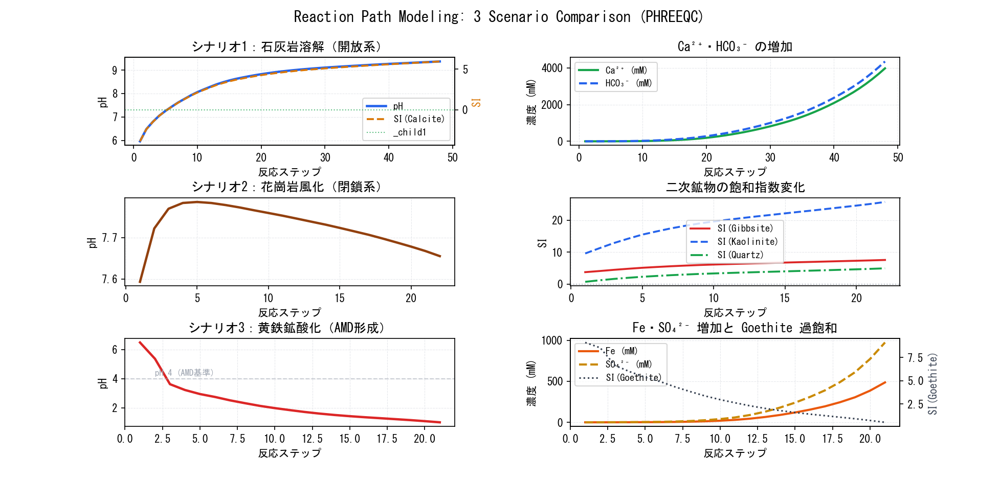

## Introduction: Moving from "Snapshots" to a "Movie"

In Parts 2 through 10, we computed the state of a solution at a single, static moment. You can think of an equilibrium calculation as **a single photograph**.

In contrast, reaction path modeling is like stitching hundreds of these photographs together to create a **movie**.
It is a technique that continuously tracks changes in chemical composition and mineral phases as a reaction progresses, describing how the entire system evolves over time or space.

```{=html}
<div style="background:#FFF7ED; border-left:4px solid #D97706; padding:1.2em 1.5em; margin:1.5em 0; border-radius:0 8px 8px 0;">
  <div style="font-weight:700; color:#92400E; margin-bottom:0.6em;">The Scenarios We Will Simulate</div>
  <div style="font-size:0.92em; color:#78350F; line-height:1.8;">
    <strong>Acidic rainwater (pH 5.6)</strong>, equilibrated with atmospheric CO₂, falls to the ground.<br>
    It passes through the soil zone, absorbing more CO₂,<br>
    then contacts <strong>limestone (calcite)</strong>, dissolving it little by little as it flows.<br>
    Eventually, it evolves into mature <strong>groundwater (pH 7.4, Ca–HCO₃ type)</strong>.<br><br>
    We will track how pH, SI, Ca²⁺, and HCO₃⁻ change step-by-step during this process.
  </div>
</div>
```

::: callout-note
## What You Will Learn in This Article
- The basic syntax of the `REACTION` block and how to "react little by little"
- The significance of step division using `INCREMENTAL_REACTIONS`
- The difference between Open Systems (continuous CO₂ supply) and Closed Systems (no CO₂ supply)
- How to visualize reaction paths using `USER_GRAPH` and `SELECTED_OUTPUT`
- Comparing three geochemical scenarios: Limestone, Granite, and Pyrite
- Visualizing reaction paths with Python
:::

---

## Theory: What is a Reaction Path?

### How the PHREEQC REACTION Block Works

The `REACTION` block **incrementally adds** specified reactants into a solution. An equilibrium calculation runs at each step, updating the pH, SI, and species concentrations dynamically.

```{=html}
<div style="background:var(--color-background-primary); border:1px solid var(--color-border-tertiary); border-radius:12px; padding:1.5em; margin:1.5em 0;">
<svg viewBox="0 0 680 200" xmlns="http://www.w3.org/2000/svg" style="width:100%;max-width:680px;display:block;margin:0 auto;" role="img">
  <title>How PHREEQC's REACTION Block Works: Step-by-step Equilibrium Flow</title>
  <defs>
    <marker id="arrR" viewBox="0 0 10 10" refX="8" refY="5" markerWidth="6" markerHeight="6" orient="auto-start-reverse">
      <path d="M2 1L8 5L2 9" fill="none" stroke="context-stroke" stroke-width="1.5" stroke-linecap="round" stroke-linejoin="round"/>
    </marker>
  </defs>

  <!-- Initial Solution -->
  <rect x="20" y="70" width="110" height="60" rx="8" fill="#EFF6FF" stroke="#2563EB" stroke-width="1"/>
  <text x="75" y="96" text-anchor="middle" font-family="'Segoe UI',sans-serif" font-size="11" font-weight="600" fill="#1E3A5F">Initial Soln</text>
  <text x="75" y="112" text-anchor="middle" font-family="'Segoe UI',sans-serif" font-size="10" fill="#1E40AF">Rainwater pH 5.6</text>

  <!-- Arrow -->
  <line x1="130" y1="100" x2="158" y2="100" stroke="#9CA3AF" stroke-width="1.5" marker-end="url(#arrR)"/>

  <!-- Step 1 -->
  <rect x="160" y="50" width="100" height="100" rx="8" fill="#FFF7ED" stroke="#D97706" stroke-width="1.5"/>
  <text x="210" y="78" text-anchor="middle" font-family="'Segoe UI',sans-serif" font-size="10" font-weight="600" fill="#92400E">Step 1</text>
  <text x="210" y="93" text-anchor="middle" font-family="'Segoe UI',sans-serif" font-size="9" fill="#78350F">CaCO₃ 0.01 mmol</text>
  <text x="210" y="107" text-anchor="middle" font-family="'Segoe UI',sans-serif" font-size="9" fill="#78350F">Added → Eq.</text>
  <text x="210" y="122" text-anchor="middle" font-family="'Segoe UI',sans-serif" font-size="9" fill="#D97706">pH 6.1</text>
  <text x="210" y="136" text-anchor="middle" font-family="'Segoe UI',sans-serif" font-size="9" fill="#D97706">SI=−1.2</text>

  <line x1="260" y1="100" x2="288" y2="100" stroke="#9CA3AF" stroke-width="1.5" marker-end="url(#arrR)"/>

  <!-- Step 2 -->
  <rect x="290" y="50" width="100" height="100" rx="8" fill="#FFF7ED" stroke="#D97706" stroke-width="1.5"/>
  <text x="340" y="78" text-anchor="middle" font-family="'Segoe UI',sans-serif" font-size="10" font-weight="600" fill="#92400E">Step 2</text>
  <text x="340" y="93" text-anchor="middle" font-family="'Segoe UI',sans-serif" font-size="9" fill="#78350F">Another 0.01 mmol</text>
  <text x="340" y="107" text-anchor="middle" font-family="'Segoe UI',sans-serif" font-size="9" fill="#78350F">Added → Eq.</text>
  <text x="340" y="122" text-anchor="middle" font-family="'Segoe UI',sans-serif" font-size="9" fill="#D97706">pH 6.6</text>
  <text x="340" y="136" text-anchor="middle" font-family="'Segoe UI',sans-serif" font-size="9" fill="#D97706">SI=−0.5</text>

  <!-- ... -->
  <text x="415" y="104" text-anchor="middle" font-family="'Segoe UI',sans-serif" font-size="16" fill="#9CA3AF">···</text>

  <line x1="430" y1="100" x2="458" y2="100" stroke="#9CA3AF" stroke-width="1.5" marker-end="url(#arrR)"/>

  <!-- Final Step -->
  <rect x="460" y="50" width="100" height="100" rx="8" fill="#F0FDF4" stroke="#16A34A" stroke-width="1.5"/>
  <text x="510" y="78" text-anchor="middle" font-family="'Segoe UI',sans-serif" font-size="10" font-weight="600" fill="#15803D">Step N</text>
  <text x="510" y="93" text-anchor="middle" font-family="'Segoe UI',sans-serif" font-size="9" fill="#166534">SI(Calcite)</text>
  <text x="510" y="107" text-anchor="middle" font-family="'Segoe UI',sans-serif" font-size="9" fill="#166534">converges to 0</text>
  <text x="510" y="122" text-anchor="middle" font-family="'Segoe UI',sans-serif" font-size="9" fill="#16A34A">pH 7.4</text>
  <text x="510" y="136" text-anchor="middle" font-family="'Segoe UI',sans-serif" font-size="9" fill="#16A34A">SI ≈ 0</text>

  <!-- Description -->
  <text x="340" y="185" text-anchor="middle" font-family="'Segoe UI',sans-serif" font-size="11" fill="#6B7280">Repeats "Solution + Reactant → New Equilibrium" at each step</text>
</svg>
<p style="text-align:center; font-size:0.82em; color:var(--color-text-secondary); margin-top:0.5em;">Figure 1. Flow of Step-wise Equilibrium Calculations via the REACTION Block</p>
</div>
```

### Open Systems vs. Closed Systems

```{=html}
<div style="display:grid; grid-template-columns:1fr 1fr; gap:1.2em; margin:1.5em 0;">
  <div style="background:#EFF6FF; border-radius:10px; padding:1.2em; border-top:3px solid #2563EB;">
    <div style="font-weight:700; color:#1E3A5F; margin-bottom:0.6em;">🌬️ Open System (CO₂ Replenished)</div>
    <div style="font-size:0.88em; color:#1E40AF; line-height:1.7;">
      Dissolution proceeds while maintaining constant equilibrium with atmospheric or soil CO₂.<br>
      You must add <code style="background:#DBEAFE; padding:2px 5px; border-radius:3px;">CO2(g)</code> in the <code style="background:#DBEAFE; padding:2px 5px; border-radius:3px;">EQUILIBRIUM_PHASES</code> block.<br><br>
      → The rise in pH is buffered, allowing much more calcite to dissolve.<br>
      → Typical case: Upper unconfined aquifers & soil zones.
    </div>
  </div>
  <div style="background:#F0FDF4; border-radius:10px; padding:1.2em; border-top:3px solid #16A34A;">
    <div style="font-weight:700; color:#15803D; margin-bottom:0.6em;">🔒 Closed System (No CO₂ Supply)</div>
    <div style="font-size:0.88em; color:#166534; line-height:1.7;">
      Reactions proceed using only the initial dissolved CO₂.<br>
      Once CO₂ is consumed, the supply of H⁺ stops, and dissolution halts prematurely.<br><br>
      → pH rises rapidly, and total dissolution is low.<br>
      → Typical case: Deep confined aquifers.
    </div>
  </div>
</div>
```

---

## Scenario 1: Dissolution of Limestone (Open System)

### Geological Setting

```{=html}
<div style="background:var(--color-background-primary); border:1px solid var(--color-border-tertiary); border-radius:12px; padding:1.5em; margin:1.5em 0;">
<svg viewBox="0 0 680 230" xmlns="http://www.w3.org/2000/svg" style="width:100%;max-width:680px;display:block;margin:0 auto;" role="img">
  <title>Hydrogeological Cross Section of a Limestone Area: Evolution from Rainwater to Groundwater</title>
  <defs>
    <marker id="arrG" viewBox="0 0 10 10" refX="8" refY="5" markerWidth="6" markerHeight="6" orient="auto-start-reverse">
      <path d="M2 1L8 5L2 9" fill="none" stroke="context-stroke" stroke-width="1.5" stroke-linecap="round" stroke-linejoin="round"/>
    </marker>
  </defs>

  <!-- Sky -->
  <rect x="0" y="0" width="680" height="60" fill="#EFF6FF" opacity="0.4" rx="4"/>
  <text x="340" y="25" text-anchor="middle" font-family="'Segoe UI',sans-serif" font-size="11" fill="#2563EB">Atmosphere (CO₂ = 0.04%, log pCO₂ = −3.5)</text>
  <!-- Raindrops -->
  <ellipse cx="80" cy="15" rx="5" ry="7" fill="#93C5FD" opacity="0.7"/>
  <ellipse cx="140" cy="30" rx="4" ry="6" fill="#93C5FD" opacity="0.6"/>
  <ellipse cx="220" cy="10" rx="5" ry="8" fill="#93C5FD" opacity="0.7"/>
  <text x="80" y="55" text-anchor="middle" font-family="'Segoe UI',sans-serif" font-size="9" fill="#1E40AF">pH 5.6</text>

  <!-- Soil Zone -->
  <rect x="0" y="60" width="680" height="45" fill="#92400E" opacity="0.12"/>
  <text x="340" y="82" text-anchor="middle" font-family="'Segoe UI',sans-serif" font-size="11" fill="#78350F">Soil Zone (CO₂ rich, log pCO₂ = −1.5 to −2.0)</text>
  <text x="340" y="97" text-anchor="middle" font-family="'Segoe UI',sans-serif" font-size="9" fill="#92400E">Absorbs extra CO₂ → Becomes more acidic (pH 4.5–5.0)</text>

  <!-- Limestone Zone -->
  <rect x="0" y="105" width="680" height="80" fill="#CA8A04" opacity="0.1"/>
  <line x1="0"   y1="115" x2="20"  y2="105" stroke="#CA8A04" stroke-width="0.5" opacity="0.4"/>
  <line x1="40"  y1="115" x2="60"  y2="105" stroke="#CA8A04" stroke-width="0.5" opacity="0.4"/>
  <line x1="80"  y1="115" x2="100" y2="105" stroke="#CA8A04" stroke-width="0.5" opacity="0.4"/>
  <line x1="120" y1="115" x2="140" y2="105" stroke="#CA8A04" stroke-width="0.5" opacity="0.4"/>
  <line x1="160" y1="115" x2="180" y2="105" stroke="#CA8A04" stroke-width="0.5" opacity="0.4"/>
  <line x1="200" y1="115" x2="220" y2="105" stroke="#CA8A04" stroke-width="0.5" opacity="0.4"/>
  <text x="340" y="138" text-anchor="middle" font-family="'Segoe UI',sans-serif" font-size="11" fill="#92400E">Limestone (Calcite) Aquifer</text>
  <text x="340" y="155" text-anchor="middle" font-family="'Segoe UI',sans-serif" font-size="9" fill="#B45309">Gradually dissolves CaCO₃ → pH rises, Ca²⁺ & HCO₃⁻ increase</text>
  <text x="340" y="170" text-anchor="middle" font-family="'Segoe UI',sans-serif" font-size="9" fill="#B45309">SI(Calcite) rises from -6 towards 0</text>

  <!-- Water Table -->
  <line x1="0" y1="185" x2="680" y2="185" stroke="#2563EB" stroke-width="1.5" stroke-dasharray="8 4" opacity="0.6"/>
  <rect x="0" y="185" width="680" height="45" fill="#DBEAFE" opacity="0.3"/>
  <text x="340" y="210" text-anchor="middle" font-family="'Segoe UI',sans-serif" font-size="11" fill="#1E3A5F">Groundwater (Ca–HCO₃ type, pH 7.2–7.8, SI(Calcite) ≈ 0)</text>

  <!-- Flow Arrows -->
  <line x1="340" y1="55" x2="340" y2="105" stroke="#2563EB" stroke-width="2" marker-end="url(#arrG)" opacity="0.6"/>
  <line x1="340" y1="150" x2="340" y2="183" stroke="#2563EB" stroke-width="2" marker-end="url(#arrG)" opacity="0.6"/>
</svg>
<p style="text-align:center; font-size:0.82em; color:var(--color-text-secondary); margin-top:0.5em;">Figure 2. Reaction Path from Rainwater to Groundwater in a Karst/Limestone Region</p>
</div>
```

### PHREEQC Code (Complete - Scenario 1)

``` phreeqc
# ============================================================
#  DeepFlow Part 11 - Reaction Path Modeling
#  Scenario 1: Limestone Dissolution by Acid Rain (Open System)
# ============================================================

# ---- Initial Solution: Acidic water post-soil passage ----
SOLUTION 1  "Soil Rainwater"
    temp      12
    pH        4.5
    pe        12
    units     mol/kgw
    -water    1

# ---- Maintain Equilibrium with Soil CO2 (Open System) ----
EQUILIBRIUM_PHASES 1
    CO2(g)   -2.0   10    # log pCO2 = -2.0 (Soil CO2 zone)

# ---- Incrementally add 100 steps of Calcite ----
REACTION 1
    CaCO3    1          # Add a total of 1 mol calcite...
    0.0001  0.0002  0.0003  0.0005  0.0007  0.001   # Reaction steps (mol)
    0.0015  0.002   0.003   0.004   0.005   0.007
    0.010   0.012   0.015   0.018   0.020   0.025
    0.030   0.035   0.040   0.045   0.050   0.055
    0.060   0.065   0.070   0.075   0.080   0.085
    0.090   0.095   0.100   0.110   0.120   0.130
    0.140   0.150   0.160   0.170   0.180   0.190
    0.200   0.220   0.240   0.260   0.280   0.300

INCREMENTAL_REACTIONS true

# ---- Output Configuration ----
SELECTED_OUTPUT 1
    -file               limestone_path.txt
    -reset              false
    -step               true
    -pH                 true
    -temperature        true
    -totals             Ca C(4) Mg
    -activities         Ca+2  HCO3-  CO3-2  H+
    -saturation_indices Calcite  Aragonite  Dolomite  CO2(g)
    -equilibrium_phases CO2(g)

USER_PUNCH 1
    -headings  Step  pH  Ca_mM  HCO3_mM  SI_Calcite  pCO2_log
    -start
    10 PUNCH STEP_NO, -LA("H+"), TOT("Ca")*1000, TOT("C(4)")*1000, \
             SI("Calcite"), SI("CO2(g)")
    -end

USER_GRAPH 1
    -chart_title  "Limestone Dissolution: Reaction Path"
    -axis_titles  "Ca dissolved (mmol/kgw)"  "pH"  "SI"
    -axis_scale   y_axis  4  9.5
    -headings     Ca_mmol  pH  SI(Calcite)
    -start
    10 GRAPH_X  TOT("Ca") * 1000
    20 GRAPH_Y  -LA("H+")
    30 GRAPH_SY SI("Calcite")
    -end
END
```

::: callout-tip
## The Significance of `INCREMENTAL_REACTIONS true`
When set to `true`, each step is processed as an "incremental addition" from the *previous* step. If set to `false` (the default), each step evaluates the total accumulated amount added directly to the *initial* solution. For true reaction path modeling (following the timeline of a moving water packet), you almost always want `true`.
:::

---

## Scenario 2: Granite Weathering (Closed System)

Here we track the weathering of **Albite (NaAlSi₃O₈)**, a major component of granite feldspars.

``` phreeqc
# ============================================================
#  Scenario 2: Granite Weathering (Closed System)
#  Dissolution of Albite (Na-feldspar)
# ============================================================

SOLUTION 2  "Atmospheric Eq Rainwater"
    temp      10
    pH        5.65       # Equilibrated with atmospheric CO2
    pe        12
    units     mol/kgw
    -water    1

# ---- Dissolve Albite in a Closed System ----
REACTION 2
    NaAlSi3O8    1       # Albite
    0.0001  0.0002  0.0005  0.001   0.002   0.003
    0.005   0.007   0.010   0.012   0.015   0.020
    0.025   0.030   0.040   0.050   0.060   0.080
    0.100   0.120   0.150   0.200

INCREMENTAL_REACTIONS true

SELECTED_OUTPUT 2
    -file               granite_path.txt
    -reset              false
    -step               true
    -pH                 true
    -totals             Na Al Si Ca
    -activities         Al+3  Na+  H4SiO4
    -saturation_indices Gibbsite  Kaolinite  Albite  Quartz  K-feldspar

USER_PUNCH 2
    -headings  Step  pH  Na_mM  Al_uM  Si_mM  SI_Gibbsite  SI_Kaolinite  SI_Quartz
    -start
    10 PUNCH STEP_NO, -LA("H+"), TOT("Na")*1000, TOT("Al")*1e6, \
             TOT("Si")*1000, SI("Gibbsite"), SI("Kaolinite"), SI("Quartz")
    -end

USER_GRAPH 2
    -chart_title  "Granite Weathering: Reaction Path"
    -axis_titles  "Dissolution Step"  "log Activity"  "SI"
    -headings     Step  Al3+  H4SiO4  SI(Gibbsite)  SI(Kaolinite)
    -start
    10 GRAPH_X  STEP_NO
    20 GRAPH_Y  LA("Al+3"),    "Al³⁺"
    30 GRAPH_Y  LA("H4SiO4"), "H₄SiO₄"
    40 GRAPH_SY SI("Gibbsite"), "SI(Gibbsite)"
    50 GRAPH_SY SI("Kaolinite"),"SI(Kaolinite)"
    -end
END
```

### The Reaction Sequence of Granite Weathering

In granite weathering, as dissolution progresses, **secondary minerals** begin to precipitate in a specific sequential order:

```{=html}
<div style="overflow-x:auto; margin:1.5em 0;">
<table style="width:100%; border-collapse:collapse; font-size:0.88em;">
  <thead>
    <tr style="background:#D97706; color:white;">
      <th style="padding:10px 13px; text-align:left;">Stage</th>
      <th style="padding:10px 13px; text-align:left;">Main Reaction</th>
      <th style="padding:10px 13px; text-align:center;">pH Range</th>
      <th style="padding:10px 13px; text-align:left;">Secondary Mineral Formed</th>
    </tr>
  </thead>
  <tbody>
    <tr style="background:#FFF7ED;">
      <td style="padding:9px 13px; font-weight:600; color:#92400E;">① Initial Dissolution</td>
      <td style="padding:9px 13px; font-size:0.88em;">Feldspar + H₂O + CO₂ → Na⁺ + HCO₃⁻ + Al³⁺ + H₄SiO₄</td>
      <td style="padding:9px 13px; text-align:center; font-family:monospace;">4–5.5</td>
      <td style="padding:9px 13px; font-size:0.88em; color:#DC2626;">None (accumulates in solution)</td>
    </tr>
    <tr style="background:#FDFDFD;">
      <td style="padding:9px 13px; font-weight:600; color:#92400E;">② Gibbsite Ppt</td>
      <td style="padding:9px 13px; font-size:0.88em;">Al³⁺ + 3H₂O → Al(OH)₃ + 3H⁺</td>
      <td style="padding:9px 13px; text-align:center; font-family:monospace;">5.5–6.5</td>
      <td style="padding:9px 13px; font-size:0.88em; color:#16A34A;">Al(OH)₃ (Gibbsite)</td>
    </tr>
    <tr style="background:#FFF7ED;">
      <td style="padding:9px 13px; font-weight:600; color:#92400E;">③ Kaolinite Ppt</td>
      <td style="padding:9px 13px; font-size:0.88em;">Al³⁺ + Si → Al₂Si₂O₅(OH)₄</td>
      <td style="padding:9px 13px; text-align:center; font-family:monospace;">6.5–7.5</td>
      <td style="padding:9px 13px; font-size:0.88em; color:#16A34A;">Kaolinite (Clay mineral)</td>
    </tr>
    <tr style="background:#FDFDFD;">
      <td style="padding:9px 13px; font-weight:600; color:#92400E;">④ Feldspar Eq.</td>
      <td style="padding:9px 13px; font-size:0.88em;">Dissolution rate ≈ Ppt rate</td>
      <td style="padding:9px 13px; text-align:center; font-family:monospace;">&gt; 7.5</td>
      <td style="padding:9px 13px; font-size:0.88em; color:#2563EB;">Smectite / Montmorillonite</td>
    </tr>
  </tbody>
</table>
</div>
```

---

## Scenario 3: Pyrite Oxidation (Open System / Oxygen Present)

Revisiting the AMD (Acid Mine Drainage) theme from Part 6, but tracking it dynamically.

``` phreeqc
# ============================================================
#  Scenario 3: Progressive Pyrite Oxidation (AMD Formation)
# ============================================================

SOLUTION 3  "Neutral Groundwater"
    temp      15
    pH        7.0
    pe        4
    units     mol/kgw
    Na        1.0e-3
    Cl        1.0e-3
    Alkalinity 1.0e-3 as HCO3
    Fe        1.0e-6
    S(6)      1.0e-5

# ---- Under Oxygen (Open to Atmosphere) ----
EQUILIBRIUM_PHASES 3
    O2(g)    -0.68   10      # Atmospheric O2 (pO2 = 0.21 atm, log = -0.68)

# ---- Oxidize Pyrite in Increments ----
REACTION 3
    FeS2     1
    0.0001  0.0002  0.0003  0.0005  0.0008  0.001
    0.002   0.003   0.005   0.007   0.010   0.015
    0.020   0.025   0.030   0.035   0.040   0.050
    0.060   0.080   0.100

INCREMENTAL_REACTIONS true

SELECTED_OUTPUT 3
    -file               pyrite_path.txt
    -reset              false
    -step               true
    -pH                 true
    -totals             Fe S(6) Al
    -activities         Fe+2  Fe+3  SO4-2
    -saturation_indices Goethite  Calcite  Gypsum

USER_PUNCH 3
    -headings  Step  pH  Fe_mM  SO4_mM  SI_Goethite
    -start
    10 PUNCH STEP_NO, -LA("H+"), TOT("Fe")*1000, TOT("S(6)")*1000, \
             SI("Goethite")
    -end

USER_GRAPH 3
    -chart_title  "Pyrite Oxidation: Reaction Path (AMD)"
    -axis_titles  "Reaction step"  "pH / log activity"  "SI"
    -headings     Step  pH  Fe2+  SO4_2-  SI(Goethite)
    -start
    10 GRAPH_X  STEP_NO
    20 GRAPH_Y  -LA("H+")
    30 GRAPH_Y  LA("Fe+2")
    40 GRAPH_Y  LA("SO4-2")
    50 GRAPH_SY SI("Goethite")
    -end
END
```

---

## Visualizing and Comparing the 3 Scenarios with Python

``` python
# ============================================================
#  reaction_path_plot.py
#  Comparing the Reaction Paths of the 3 Scenarios
# ============================================================
import pandas as pd
import numpy as np
import matplotlib.pyplot as plt
import matplotlib.gridspec as gridspec

# ---- Font Configuration ----
plt.rcParams.update({
    "font.family": "sans-serif",
    "axes.unicode_minus": False,
    "figure.dpi": 150,
})

# ---- Data Loading ----
def load_phreeqc_selected(fp, comment="#"):
    return pd.read_csv(fp, sep="\t", comment=comment, skipinitialspace=True)

df1 = load_phreeqc_selected("limestone_path.txt")
df2 = load_phreeqc_selected("granite_path.txt")
df3 = load_phreeqc_selected("pyrite_path.txt")

# ======= 3x2 Subplot Framework =======
fig = plt.figure(figsize=(14, 10))
gs  = gridspec.GridSpec(3, 2, hspace=0.45, wspace=0.35)

# Filter data to exclude initial state (step = -99)
df1_plot = df1[df1["step"] >= 0]
df2_plot = df2[df2["step"] >= 0]
df3_plot = df3[df3["step"] >= 0]

# ======= Scenario 1: Limestone =======
ax1a = fig.add_subplot(gs[0, 0])
ax1b = ax1a.twinx()
ax1a.plot(df1_plot["step"], df1_plot["pH"],          color="#2563EB", lw=2.2, label="pH")
ax1b.plot(df1_plot["step"], df1_plot["SI_Calcite"],  color="#D97706", lw=1.8, ls="--", label="SI(Calcite)")
ax1b.axhline(0, color="#16A34A", lw=1, ls=":", alpha=0.7)
ax1a.set(xlabel="Reaction Step", ylabel="pH", title="Scenario 1: Limestone (Open)")
ax1b.set_ylabel("SI", color="#D97706")
lines = ax1a.get_lines() + ax1b.get_lines()
ax1a.legend(lines, [l.get_label() for l in lines], fontsize=9, loc="lower right")
ax1a.grid(True, ls="--", lw=0.5, color="#E5E7EB")

ax1c = fig.add_subplot(gs[0, 1])
ax1c.plot(df1_plot["step"], df1_plot["Ca_mM"],   color="#16A34A", lw=2, label="Ca²⁺ (mM)")
ax1c.plot(df1_plot["step"], df1_plot["HCO3_mM"], color="#2563EB", lw=2, ls="--", label="HCO₃⁻ (mM)")
ax1c.set(xlabel="Reaction Step", ylabel="Concentration (mM)",
         title="Increase of Ca²⁺ and HCO₃⁻")
ax1c.legend(fontsize=9); ax1c.grid(True, ls="--", lw=0.5, color="#E5E7EB")

# ======= Scenario 2: Granite =======
ax2a = fig.add_subplot(gs[1, 0])
ax2a.plot(df2_plot["step"], df2_plot["pH"],          color="#92400E", lw=2.2, label="pH")
ax2a.set(xlabel="Reaction Step", ylabel="pH", title="Scenario 2: Granite (Closed)")
ax2a.grid(True, ls="--", lw=0.5, color="#E5E7EB")

ax2b = fig.add_subplot(gs[1, 1])
ax2b.plot(df2_plot["step"], df2_plot["SI_Gibbsite"],   color="#DC2626", lw=1.8, label="SI(Gibbsite)")
ax2b.plot(df2_plot["step"], df2_plot["SI_Kaolinite"],  color="#2563EB", lw=1.8, ls="--", label="SI(Kaolinite)")
ax2b.plot(df2_plot["step"], df2_plot["SI_Quartz"],     color="#16A34A", lw=1.8, ls="-.", label="SI(Quartz)")
ax2b.axhline(0, color="#9CA3AF", lw=1, ls=":", alpha=0.7)
ax2b.set(xlabel="Reaction Step", ylabel="SI",
         title="Secondary Mineral SI Evolution")
ax2b.legend(fontsize=9); ax2b.grid(True, ls="--", lw=0.5, color="#E5E7EB")

# ======= Scenario 3: Pyrite =======
ax3a = fig.add_subplot(gs[2, 0])
ax3a.plot(df3_plot["step"], df3_plot["pH"],        color="#DC2626", lw=2.2, label="pH")
ax3a.axhline(4.0, color="#9CA3AF", lw=1, ls="--", alpha=0.5)
ax3a.text(2, 4.2, "pH 4 (AMD threshold)", color="#9CA3AF", fontsize=8)
ax3a.set(xlabel="Reaction Step", ylabel="pH", title="Scenario 3: Pyrite Oxidation (AMD)")
ax3a.grid(True, ls="--", lw=0.5, color="#E5E7EB")

ax3b = fig.add_subplot(gs[2, 1])
ax3b_r = ax3b.twinx()
ax3b.plot(df3_plot["step"],   df3_plot["Fe_mM"],  color="#EA580C", lw=2, label="Fe (mM)")
ax3b.plot(df3_plot["step"],   df3_plot["SO4_mM"], color="#CA8A04", lw=2, ls="--", label="SO₄²⁻ (mM)")
ax3b_r.plot(df3_plot["step"], df3_plot["SI_Goethite"], color="#374151", lw=1.5, ls=":", label="SI(Goethite)")
ax3b.set(xlabel="Reaction Step", ylabel="Concentration (mM)",
         title="Fe & SO₄²⁻ Increase vs Goethite SI")
lines = ax3b.get_lines() + ax3b_r.get_lines()
ax3b.legend(lines, [l.get_label() for l in lines], fontsize=9)
ax3b_r.set_ylabel("SI(Goethite)", color="#374151")
ax3b.grid(True, ls="--", lw=0.5, color="#E5E7EB")

plt.suptitle("Reaction Path Modeling: 3 Scenario Comparison (PHREEQC)", fontsize=14, y=0.98)
plt.savefig("reaction_paths.svg", bbox_inches="tight")
plt.show()
```



---

## Discussion: What the 3 Scenarios Reveal

```{=html}
<div style="background:var(--color-background-primary); border:1px solid var(--color-border-tertiary); border-radius:12px; padding:1.5em; margin:1.5em 0;">
<svg viewBox="0 0 680 310" xmlns="http://www.w3.org/2000/svg" style="width:100%;max-width:680px;display:block;margin:0 auto;" role="img">
  <title>Comparison of pH Trajectories for the 3 Scenarios</title>
  
  <rect x="70" y="30" width="530" height="230" fill="#F9FAFB" rx="4"/>

  <!-- Grids -->
  <line x1="70" y1="30"  x2="600" y2="30"  stroke="#E5E7EB" stroke-width="0.8"/>
  <line x1="70" y1="68"  x2="600" y2="68"  stroke="#E5E7EB" stroke-width="0.8"/>
  <line x1="70" y1="106" x2="600" y2="106" stroke="#E5E7EB" stroke-width="0.8"/>
  <line x1="70" y1="144" x2="600" y2="144" stroke="#E5E7EB" stroke-width="0.8" stroke-dasharray="4 3"/>
  <line x1="70" y1="182" x2="600" y2="182" stroke="#E5E7EB" stroke-width="0.8"/>
  <line x1="70" y1="220" x2="600" y2="220" stroke="#E5E7EB" stroke-width="0.8"/>
  <line x1="70" y1="260" x2="600" y2="260" stroke="#E5E7EB" stroke-width="0.8"/>

  <!-- Axes -->
  <line x1="70" y1="260" x2="600" y2="260" stroke="#9CA3AF" stroke-width="1.5"/>
  <line x1="70" y1="30"  x2="70"  y2="260" stroke="#9CA3AF" stroke-width="1.5"/>

  <!-- X Labels -->
  <text x="70"  y="277" text-anchor="middle" font-family="'Segoe UI',sans-serif" font-size="11" fill="#6B7280">0</text>
  <text x="176" y="277" text-anchor="middle" font-family="'Segoe UI',sans-serif" font-size="11" fill="#6B7280">10</text>
  <text x="282" y="277" text-anchor="middle" font-family="'Segoe UI',sans-serif" font-size="11" fill="#6B7280">20</text>
  <text x="388" y="277" text-anchor="middle" font-family="'Segoe UI',sans-serif" font-size="11" fill="#6B7280">30</text>
  <text x="494" y="277" text-anchor="middle" font-family="'Segoe UI',sans-serif" font-size="11" fill="#6B7280">40</text>
  <text x="600" y="277" text-anchor="middle" font-family="'Segoe UI',sans-serif" font-size="11" fill="#6B7280">50</text>
  <text x="335" y="298" text-anchor="middle" font-family="'Segoe UI',sans-serif" font-size="12" fill="#374151">Reaction Step</text>

  <!-- Y Labels -->
  <text x="58" y="264" text-anchor="end" font-family="'Segoe UI',sans-serif" font-size="11" fill="#6B7280">2</text>
  <text x="58" y="226" text-anchor="end" font-family="'Segoe UI',sans-serif" font-size="11" fill="#6B7280">3</text>
  <text x="58" y="188" text-anchor="end" font-family="'Segoe UI',sans-serif" font-size="11" fill="#6B7280">4</text>
  <text x="58" y="150" text-anchor="end" font-family="'Segoe UI',sans-serif" font-size="11" fill="#6B7280">5</text>
  <text x="58" y="112" text-anchor="end" font-family="'Segoe UI',sans-serif" font-size="11" fill="#6B7280">6</text>
  <text x="58" y="74"  text-anchor="end" font-family="'Segoe UI',sans-serif" font-size="11" fill="#6B7280">7</text>
  <text x="58" y="36"  text-anchor="end" font-family="'Segoe UI',sans-serif" font-size="11" fill="#6B7280">8</text>
  <text transform="rotate(-90 16 145)" x="16" y="145" text-anchor="middle" font-family="'Segoe UI',sans-serif" font-size="12" fill="#374151">pH</text>

  <!-- pH 7 Reference -->
  <line x1="70" y1="74" x2="600" y2="74" stroke="#9CA3AF" stroke-width="0.8" stroke-dasharray="5 3" opacity="0.5"/>
  <text x="603" y="78" font-family="'Segoe UI',sans-serif" font-size="9" fill="#9CA3AF">pH 7</text>

  <!-- Scenario 1: Limestone Open -->
  <polyline points="70,164 123,140 176,113 229,94 282,79 388,65 600,57" fill="none" stroke="#2563EB" stroke-width="2.5" stroke-linejoin="round"/>
  <text x="612" y="57" font-family="'Segoe UI',sans-serif" font-size="10" fill="#2563EB">Limestone</text>
  <text x="612" y="69" font-family="'Segoe UI',sans-serif" font-size="10" fill="#2563EB">(Open)</text>

  <!-- Scenario 2: Granite Closed -->
  <polyline points="70,121 176,112 282,104 388,100 494,96 600,95" fill="none" stroke="#92400E" stroke-width="2.5" stroke-linejoin="round" stroke-dasharray="8 3"/>
  <text x="612" y="95" font-family="'Segoe UI',sans-serif" font-size="10" fill="#92400E">Granite</text>
  <text x="612" y="107" font-family="'Segoe UI',sans-serif" font-size="10" fill="#92400E">(Closed)</text>

  <!-- Scenario 3: Pyrite -->
  <polyline points="70,69 123,144 176,194 229,221 282,240 388,255 600,259" fill="none" stroke="#DC2626" stroke-width="2.5" stroke-linejoin="round"/>
  <text x="612" y="255" font-family="'Segoe UI',sans-serif" font-size="10" fill="#DC2626">Pyrite</text>
  <text x="612" y="267" font-family="'Segoe UI',sans-serif" font-size="10" fill="#DC2626">Oxidation</text>

  <!-- Initial Markers -->
  <circle cx="70" cy="164" r="5" fill="#2563EB"/>
  <circle cx="70" cy="121" r="5" fill="#92400E"/>
  <circle cx="70" cy="69"  r="5" fill="#DC2626"/>
</svg>
<p style="text-align:center; font-size:0.82em; color:var(--color-text-secondary); margin-top:0.5em;">Figure 3. Comparison of pH Trajectories — Limestone climbs, Granite rises gently, and Pyrite crashes.</p>
</div>
```

```{=html}
<div style="display:grid; grid-template-columns:repeat(3,1fr); gap:1em; margin:1.5em 0;">

  <div style="background:#EFF6FF; border-radius:10px; padding:1.2em; border-bottom:3px solid #2563EB;">
    <div style="font-weight:700; color:#1E3A5F; margin-bottom:0.5em;">🏔️ Limestone (Open)</div>
    <div style="font-size:0.85em; color:#1E40AF; line-height:1.7;">
      pH rises from <strong>6 → 9.3</strong><br>
      SI(Calcite) crosses 0 and spikes <strong>(≈ +5)</strong><br>
      Ca²⁺ and HCO₃⁻ increase continuously.<br><br>
      Continuous CO₂ supply drives dissolution, leading to extreme thermodynamic supersaturation without hitting an equilibrium stopping point.
    </div>
  </div>

  <div style="background:#FFF7ED; border-radius:10px; padding:1.2em; border-bottom:3px solid #D97706;">
    <div style="font-weight:700; color:#92400E; margin-bottom:0.5em;">🪨 Granite (Closed)</div>
    <div style="font-size:0.85em; color:#78350F; line-height:1.7;">
      pH plateaus around <strong>7.6–7.8</strong><br>
      Kaolinite & Gibbsite remain <strong>highly supersaturated</strong>.<br>
      Quartz slowly approaches saturation.<br><br>
      Secondary minerals are strongly supersaturated, but actual precipitation in nature is kinetically limited, maintaining a non-equilibrium state for long periods.
    </div>
  </div>

  <div style="background:#FEF2F2; border-radius:10px; padding:1.2em; border-bottom:3px solid #DC2626;">
    <div style="font-weight:700; color:#991B1B; margin-bottom:0.5em;">⚡ Pyrite (Oxidation)</div>
    <div style="font-size:0.85em; color:#7F1D1D; line-height:1.7;">
      pH crashes from <strong>6 → 3 → ~1</strong><br>
      Fe and SO₄²⁻ increase exponentially.<br>
      SI(Goethite) spikes early but drops later.<br><br>
      Autocatalysis by Fe³⁺ accelerates the reaction. Acid generation destroys buffering capacity, driving the system into extreme acidity.
    </div>
  </div>

</div>
```

```{=html}
<div style="margin:1.5em 0; line-height:1.8; font-size:0.95em;">

  <div style="margin-bottom:1.2em;">
    <strong>"Equilibrium Calculation" vs. "Reaction Path Modeling"</strong>
  </div>

  <div style="background:#F0FDF4; padding:1em 1.2em; border-left:4px solid #16A34A; border-radius:6px; margin-bottom:1em;">
    <div style="font-weight:600; margin-bottom:0.4em;">Equilibrium Calculation (EQUILIBRIUM_PHASES)</div>
    <div style="font-size:0.9em;">
      A method to determine the state of a system assuming it has completely reached thermodynamic equilibrium. Used to diagnose which minerals the <em>current</em> water is in equilibrium with, or to check SIs.
    </div>
  </div>

  <div style="background:#EFF6FF; padding:1em 1.2em; border-left:4px solid #2563EB; border-radius:6px; margin-bottom:1em;">
    <div style="font-weight:600; margin-bottom:0.4em;">Reaction Path Modeling (REACTION)</div>
    <div style="font-size:0.9em;">
      A method to track system changes while adding finite amounts of reactants (minerals, gases, solutes) incrementally. Used to answer "how will pH and concentration evolve if I dissolve <em>X</em> amount of this mineral over time/space?"
    </div>
  </div>

</div>
```

---

## Conclusion: Integrating the Entire Series

```{=html}
<div style="background:var(--color-background-primary); border:1px solid var(--color-border-tertiary); border-radius:12px; padding:1.5em; margin:1.5em 0;">
<svg viewBox="0 0 680 240" xmlns="http://www.w3.org/2000/svg" style="width:100%;display:block;" role="img">
  <title>Knowledge Integration Map for PHREEQC Series #1–#11</title>
  <defs>
    <marker id="arrFin" viewBox="0 0 10 10" refX="8" refY="5" markerWidth="6" markerHeight="6" orient="auto-start-reverse">
      <path d="M2 1L8 5L2 9" fill="none" stroke="context-stroke" stroke-width="1.5" stroke-linecap="round" stroke-linejoin="round"/>
    </marker>
  </defs>

  <rect x="10" y="10" width="660" height="220" rx="12" fill="none" stroke="#E5E7EB" stroke-width="1" stroke-dasharray="6 4"/>
  <text x="340" y="32" text-anchor="middle" font-family="'Segoe UI',sans-serif" font-size="12" font-weight="600" fill="#374151">DeepFlow PHREEQC Series Knowledge Map</text>

  <rect x="30"  y="50" width="80" height="36" rx="6" fill="#F0FDF4" stroke="#16A34A" stroke-width="1"/>
  <text x="70"  y="65" text-anchor="middle" font-family="'Segoe UI',sans-serif" font-size="9" font-weight="600" fill="#15803D">#1–3</text>
  <text x="70"  y="78" text-anchor="middle" font-family="'Segoe UI',sans-serif" font-size="8" fill="#166534">Basics/Gypsum</text>

  <rect x="130" y="50" width="80" height="36" rx="6" fill="#FFF7ED" stroke="#D97706" stroke-width="1"/>
  <text x="170" y="65" text-anchor="middle" font-family="'Segoe UI',sans-serif" font-size="9" font-weight="600" fill="#92400E">#4–5</text>
  <text x="170" y="78" text-anchor="middle" font-family="'Segoe UI',sans-serif" font-size="8" fill="#78350F">Carbonates</text>

  <rect x="230" y="50" width="80" height="36" rx="6" fill="#FEF2F2" stroke="#DC2626" stroke-width="1"/>
  <text x="270" y="65" text-anchor="middle" font-family="'Segoe UI',sans-serif" font-size="9" font-weight="600" fill="#991B1B">#6</text>
  <text x="270" y="78" text-anchor="middle" font-family="'Segoe UI',sans-serif" font-size="8" fill="#7F1D1D">Pyrite / AMD</text>

  <rect x="330" y="50" width="80" height="36" rx="6" fill="#EFF6FF" stroke="#2563EB" stroke-width="1"/>
  <text x="370" y="65" text-anchor="middle" font-family="'Segoe UI',sans-serif" font-size="9" font-weight="600" fill="#1E3A5F">#7–8</text>
  <text x="370" y="78" text-anchor="middle" font-family="'Segoe UI',sans-serif" font-size="8" fill="#1E40AF">Solubility & Py</text>

  <rect x="430" y="50" width="80" height="36" rx="6" fill="#F5F3FF" stroke="#7C3AED" stroke-width="1"/>
  <text x="470" y="65" text-anchor="middle" font-family="'Segoe UI',sans-serif" font-size="9" font-weight="600" fill="#5B21B6">#9–10</text>
  <text x="470" y="78" text-anchor="middle" font-family="'Segoe UI',sans-serif" font-size="8" fill="#6D28D9">Activity & SI</text>

  <line x1="70"  y1="86" x2="70"  y2="138" stroke="#9CA3AF" stroke-width="1" marker-end="url(#arrFin)"/>
  <line x1="170" y1="86" x2="170" y2="138" stroke="#9CA3AF" stroke-width="1" marker-end="url(#arrFin)"/>
  <line x1="270" y1="86" x2="270" y2="138" stroke="#9CA3AF" stroke-width="1" marker-end="url(#arrFin)"/>
  <line x1="370" y1="86" x2="370" y2="138" stroke="#9CA3AF" stroke-width="1" marker-end="url(#arrFin)"/>
  <line x1="470" y1="86" x2="470" y2="138" stroke="#9CA3AF" stroke-width="1" marker-end="url(#arrFin)"/>

  <rect x="140" y="140" width="320" height="50" rx="10" fill="#FFF7ED" stroke="#D97706" stroke-width="2"/>
  <text x="300" y="162" text-anchor="middle" font-family="'Segoe UI',sans-serif" font-size="13" font-weight="700" fill="#92400E">#11 Reaction Path Modeling</text>
  <text x="300" y="180" text-anchor="middle" font-family="'Segoe UI',sans-serif" font-size="10" fill="#B45309">REACTION × EQUILIBRIUM_PHASES × SELECTED_OUTPUT</text>

  <line x1="300" y1="190" x2="300" y2="215" stroke="#D97706" stroke-width="1.5" marker-end="url(#arrFin)"/>
  <text x="300" y="230" text-anchor="middle" font-family="'Segoe UI',sans-serif" font-size="10" fill="#9CA3AF">Next #12 → Advection-Dispersion Models (TRANSPORT Block)</text>
</svg>
</div>
```

::: callout-tip
## Coming Up Next — Part 12: "Advection-Dispersion Modeling"
Using the `TRANSPORT` block, we will simulate how pollutants and dissolved constituents spread through an aquifer via advection (carried by flow) and dispersion (spreading out). This adds the dimension of "Space" to the reaction paths developed in Part 11!
:::

------------------------------------------------------------------------

## References

1. **PHREEQC Official Documentation**
   Parkhurst, D.L., and Appelo, C.A.J., 2013. Description of input and examples for PHREEQC version 3—A computer program for speciation, batch-reaction, one-dimensional transport, and inverse geochemical calculations: U.S. Geological Survey Techniques and Methods, book 6, chap. A43, 497 p.
2. **Standard Textbook on Geochemical Modeling**
   Appelo, C., Postma, D., 2005. *Geochemistry, Groundwater and Pollution*, second ed. Balkema, Rotterdam, p. 634.
3. **Applied Research using this Tutorial's Methods (Author's Publication)**
   Yang H., Mishima T., Katazakai S., Kagabu M., 2023. Analytical approach using a chemical equilibrium formula and geochemical modeling for alkalinity measurements of small natural water samples. *Applied Geochemistry* 148:105535.
   👉 For more research publications, please visit the [About page](/about.html).

---

*Other articles in this series:*

- [#1 Installation and Initial Calculation](../phreeqc-part1/index-en.html)
- [#2 Analyzing Seawater with Speciation](../phreeqc-part2/index-en.html)
- [#3 Mineral Equilibrium and Temperature Effects](../phreeqc-part3/index-en.html)
- [#4 Calcite–CO₂ Interaction (Open vs. Closed Systems)](../phreeqc-part4/index-en.html)
- [#5 Mixing Groundwater and Seawater](../phreeqc-part5/index-en.html)
- [#6 Pyrite Oxidation and AMD Formation](../phreeqc-part6/index-en.html)
- [#7 Solubility Diagrams (Gibbsite)](../phreeqc-part7/index-en.html)
- [#8 Visualization with Python](../phreeqc-part8/index-en.html)
- [#9 Ionic Strength and Activity Coefficients](../phreeqc-part9/index-en.html)
- [#10 Mastering the Saturation Index (SI)](../phreeqc-part10/index-en.html)
- **#11 Reaction Path Modeling** (This article)
- [#12 Advection-Dispersion Model](../phreeqc-part12/index-en.html)

---

*DeepFlow | Science beneath the surface*
