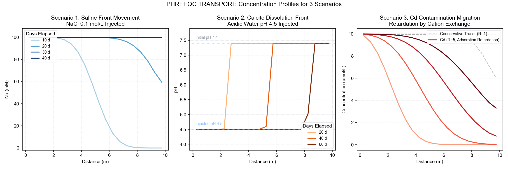

## Introduction: The Grand Integration of the Series

From #2 to #11, we calculated the chemistry at "a single point and a single moment".

- **Speciation** ([#2](../phreeqc-part2/index-en.html)): Solution composition at one point
- **EQUILIBRIUM_PHASES** ([#3](../phreeqc-part3/index-en.html)〜[#5](../phreeqc-part5/index-en.html)): Mineral equilibrium at one point
- **REACTION** ([#11](../phreeqc-part11/index-en.html)): Changes over time

This time, the **TRANSPORT block** adds the **dimension of space** to this. As groundwater flows through an aquifer, it reacts with minerals, transports contaminants, and forms concentration fronts—we will calculate this entire process all at once.

```{=html}
<div style="background:#FFF7ED; border-left:4px solid #D97706; padding:1.2em 1.5em; margin:1.5em 0; border-radius:0 8px 8px 0;">
  <div style="font-weight:700; color:#92400E; margin-bottom:0.6em;">Everything built up in this series is utilized here</div>
  <div style="font-size:0.9em; color:#78350F; line-height:1.9;">
    Activity coefficients (#9) × Saturation indices (#10) × Reaction paths (#11)<br>
    　　　　　　↓<br>
    <strong>TRANSPORT: Space × Time × Chemical Reaction</strong>
  </div>
</div>
```

::: callout-note
## What you will learn in this article

- The three concepts of advection, dispersion, and reaction
- Basic syntax of the `TRANSPORT` block
- Scenario 1: Movement of a saline front (pure advection-dispersion)
- Scenario 2: Calcite dissolution front (advection + chemical reaction)
- Scenario 3: Heavy metal contaminant diffusion and soil adsorption
- Visualization of concentration profiles using Python
:::

------------------------------------------------------------------------

## Theory: Advection-Dispersion Equation

Solute transport in groundwater is described by the **Advection-Dispersion Equation (ADE)**:

$$\frac{\partial C}{\partial t} = D \frac{\partial^2 C}{\partial x^2} - v \frac{\partial C}{\partial x} + R$$

```{=html}
<div style="overflow-x:auto; margin:1.5em 0;">
<table style="width:100%; border-collapse:collapse; font-size:0.9em;">
  <thead>
    <tr style="background:#D97706; color:white;">
      <th style="padding:10px 14px; text-align:left;">Term</th>
      <th style="padding:10px 14px; text-align:left;">Name</th>
      <th style="padding:10px 14px; text-align:left;">Meaning</th>
      <th style="padding:10px 14px; text-align:left;">PHREEQC Parameter</th>
    </tr>
  </thead>
  <tbody>
    <tr style="background:#FFF7ED;">
      <td style="padding:9px 14px; font-family:monospace;">∂C/∂t</td>
      <td style="padding:9px 14px; font-weight:600;">Time change</td>
      <td style="padding:9px 14px; font-size:0.88em;">Rate of change in concentration over time</td>
      <td style="padding:9px 14px; font-family:monospace; font-size:0.88em;">-time_step</td>
    </tr>
    <tr style="background:#FDFDFD;">
      <td style="padding:9px 14px; font-family:monospace;">D ∂²C/∂x²</td>
      <td style="padding:9px 14px; font-weight:600; color:#2563EB;">Dispersion term</td>
      <td style="padding:9px 14px; font-size:0.88em;">Diffusion/dispersion due to concentration gradient</td>
      <td style="padding:9px 14px; font-family:monospace; font-size:0.88em;">-dispersivity</td>
    </tr>
    <tr style="background:#FFF7ED;">
      <td style="padding:9px 14px; font-family:monospace;">v ∂C/∂x</td>
      <td style="padding:9px 14px; font-weight:600; color:#D97706;">Advection term</td>
      <td style="padding:9px 14px; font-size:0.88em;">Mass transport by groundwater flow</td>
      <td style="padding:9px 14px; font-family:monospace; font-size:0.88em;">-shifts (velocity × time)</td>
    </tr>
    <tr style="background:#FDFDFD;">
      <td style="padding:9px 14px; font-family:monospace;">R</td>
      <td style="padding:9px 14px; font-weight:600; color:#16A34A;">Reaction term</td>
      <td style="padding:9px 14px; font-size:0.88em;">Mineral dissolution/precipitation, adsorption, etc.</td>
      <td style="padding:9px 14px; font-family:monospace; font-size:0.88em;">EQUILIBRIUM_PHASES etc.</td>
    </tr>
  </tbody>
</table>
</div>
```

### PHREEQC's Approach: Operator Splitting

PHREEQC does not solve the ADE directly; instead, it uses a method where **advection, dispersion, and reaction are calculated alternately**:

```{=html}
<div style="background:#FDFDFD; border:1px solid #E5E7EB; border-radius:12px; padding:1.5em; margin:1.5em 0;">
<svg viewBox="0 0 680 130" xmlns="http://www.w3.org/2000/svg" style="width:100%;max-width:680px;display:block;margin:0 auto;" role="img">
  <title>Operator Splitting Concept Diagram</title>
  <defs>
    <marker id="arrOP" viewBox="0 0 10 10" refX="8" refY="5" markerWidth="6" markerHeight="6" orient="auto-start-reverse">
      <path d="M2 1L8 5L2 9" fill="none" stroke="context-stroke" stroke-width="1.5" stroke-linecap="round" stroke-linejoin="round"/>
    </marker>
  </defs>
  <!-- Step1: Advection -->
  <rect x="20" y="35" width="130" height="60" rx="8" fill="#FFF7ED" stroke="#D97706" stroke-width="1.5"/>
  <text x="85" y="60" text-anchor="middle" font-family="'Segoe UI',sans-serif" font-size="12" font-weight="600" fill="#92400E">① Advection</text>
  <text x="85" y="76" text-anchor="middle" font-family="'Segoe UI',sans-serif" font-size="10" fill="#78350F">Shift cell forward</text>
  <text x="85" y="89" text-anchor="middle" font-family="'Segoe UI',sans-serif" font-size="9" fill="#B45309">(Repeat -shifts times)</text>

  <line x1="150" y1="65" x2="178" y2="65" stroke="#9CA3AF" stroke-width="1.5" marker-end="url(#arrOP)"/>

  <!-- Step2: Dispersion -->
  <rect x="180" y="35" width="130" height="60" rx="8" fill="#EFF6FF" stroke="#2563EB" stroke-width="1.5"/>
  <text x="245" y="60" text-anchor="middle" font-family="'Segoe UI',sans-serif" font-size="12" font-weight="600" fill="#1E3A5F">② Dispersion</text>
  <text x="245" y="76" text-anchor="middle" font-family="'Segoe UI',sans-serif" font-size="10" fill="#1E40AF">Mix with adjacent cells</text>
  <text x="245" y="89" text-anchor="middle" font-family="'Segoe UI',sans-serif" font-size="9" fill="#3B82F6">(Controlled by dispersivity)</text>

  <line x1="310" y1="65" x2="338" y2="65" stroke="#9CA3AF" stroke-width="1.5" marker-end="url(#arrOP)"/>

  <!-- Step3: Reaction -->
  <rect x="340" y="35" width="130" height="60" rx="8" fill="#F0FDF4" stroke="#16A34A" stroke-width="1.5"/>
  <text x="405" y="60" text-anchor="middle" font-family="'Segoe UI',sans-serif" font-size="12" font-weight="600" fill="#15803D">③ Reaction</text>
  <text x="405" y="76" text-anchor="middle" font-family="'Segoe UI',sans-serif" font-size="10" fill="#166534">Equilibrate in each cell</text>
  <text x="405" y="89" text-anchor="middle" font-family="'Segoe UI',sans-serif" font-size="9" fill="#16A34A">(EQUILIBRIUM_PHASES etc.)</text>

  <line x1="470" y1="65" x2="498" y2="65" stroke="#9CA3AF" stroke-width="1.5" marker-end="url(#arrOP)"/>

  <!-- Repeat -->
  <rect x="500" y="35" width="160" height="60" rx="8" fill="#F9FAFB" stroke="#E5E7EB" stroke-width="1.5"/>
  <text x="580" y="57" text-anchor="middle" font-family="'Segoe UI',sans-serif" font-size="11" font-weight="600" fill="#374151">Next time step</text>
  <text x="580" y="73" text-anchor="middle" font-family="'Segoe UI',sans-serif" font-size="10" fill="#6B7280">Repeat ①-③ -shifts times</text>
  <text x="580" y="87" text-anchor="middle" font-family="'Segoe UI',sans-serif" font-size="9" fill="#9CA3AF">Record results for each cell</text>

  <text x="340" y="118" text-anchor="middle" font-family="'Segoe UI',sans-serif" font-size="10" fill="#9CA3AF">1 time step = 1 shift = Time for groundwater to move one cell</text>
</svg>
</div>
```

------------------------------------------------------------------------

## Basic Syntax of the TRANSPORT Block

``` phreeqc
TRANSPORT
    -cells            20        # Number of cells (spatial divisions)
    -length           0.1       # Length of each cell (m)
    -shifts           40        # Number of time steps (advection steps)
    -time_step        864000    # Time per step (seconds) = 10 days
    -flow_direction   forward   # Flow direction (forward/back/diffusion_only)
    -boundary_conditions  flux  flux  # Boundary conditions (flux/constant)
    -dispersivity     0.015     # Dispersivity (m)
    -diffusion_coefficient 1e-9 # Diffusion coefficient (m²/s)
    -punch_cells      1-20      # Cells to output
    -punch_frequency  10        # Output frequency (every 10 steps)
    -print_cells      1 5 10 20 # Cells to display on screen
```

::: callout-tip
## Balancing Cell Number and Computational Accuracy

Increasing the number of cells improves accuracy but also increases computation time. Determine the cell length so that the **Peclet number (Pe = v·Δx/D)** is 2 or less. For Pe \> 2, numerical dispersion occurs, overestimating physical dispersion.
:::

------------------------------------------------------------------------

## Scenario 1: Movement of a Saline Front (Pure Advection-Dispersion)

### Setup

A NaCl solution (0.1 mol/L) is injected into an aquifer initially filled with pure water (20 cells, 0.5 m each = 10 m total length). We will track how the saline front moves and disperses.

``` phreeqc
# ============================================================
#  DeepFlow #12 - Scenario 1: Saline Front Movement
#  Injecting NaCl solution into a pure water aquifer
# ============================================================

# ---- Initial Solution: Pure Water (fills all 20 cells) ----
SOLUTION 0  "Injection Water (NaCl 0.1 mol/L)"
    temp      25
    pH        7
    units     mol/kgw
    Na        0.1
    Cl        0.1

SOLUTION 1-20  "Initial Aquifer (Pure Water)"
    temp      25
    pH        7
    -water    1

# ---- TRANSPORT Settings ----
TRANSPORT
    -cells            20
    -lengths          20*0.5    # Repeat 0.5 m for 20 cells (PHREEQC array notation, not multiplication)
    -shifts           40        # 40 time steps
    -time_step        86400     # 1 day/step. Apparent velocity: 0.5 m / 86400 s = 5.8e-6 m/s
    -flow_direction   forward
    -boundary_conditions  flux  flux
    -dispersivities   20*0.05   # Repeat 0.05 m for 20 cells (same as above)
    -diffusion_coefficient 1e-9
    -punch_cells      1-20
    -punch_frequency  10        # Output at steps 10, 20, 30, 40

# ---- Output Settings ----
SELECTED_OUTPUT 1
    -file             saltfront.txt
    -distance         true
    -time             true
    -totals           Na Cl

USER_PUNCH 1
    -headings  dist_m  time_d  Na_mM  Cl_mM
    -start
    10 PUNCH DIST, TIME/86400, TOT("Na")*1000, TOT("Cl")*1000
    -end

# ---- Graph Settings ----
USER_GRAPH 1
    -headings         Distance Na_mM Cl_mM
    -chart_title      "Salt Front Movement"
    -axis_titles      "Distance (m)" "Concentration (mM)"
    -axis_scale x_axis 0 10
    -axis_scale y_axis 0 120
    -initial_solutions false
    -start
    10 GRAPH_X DIST
    20 GRAPH_Y TOT("Na")*1000, TOT("Cl")*1000
    -end
END
```

------------------------------------------------------------------------

## Scenario 2: Calcite Dissolution Front (Advection + Chemical Reaction)

### Setup

**Acidic water (pH 4.5)** is injected into an aquifer containing calcite (initial state: Ca–HCO₃ water in equilibrium with calcite). We track how the dissolution front moves, observing pH, Ca²⁺, and SI(Calcite). What happens when acidic water enters a limestone aquifer?

``` phreeqc
# ============================================================
#  Scenario 2: Calcite Dissolution Front
#  Injecting acidic water into a limestone aquifer
# ============================================================

# ---- Injection Water (Acidic + CO2) ----
SOLUTION 0  "Injected Acidic Water"
    temp      12
    pH        4.5
    pe        12
    units     mol/kgw
    -water    1

EQUILIBRIUM_PHASES 0
    CO2(g)   -2.0   10   # Soil CO2

# ---- Initial Groundwater (Calcite + CO2 Equilibrium) ----
SOLUTION 1-20  "Initial Groundwater"
    temp      12
    pH        7.2
    units     mol/kgw
    Ca        2.0e-3
    Alkalinity 4.0e-3 as HCO3
    -water    1

EQUILIBRIUM_PHASES 1-20
    Calcite   0.0   0.005   
    CO2(g)   -2.0   10

# ---- Advection-Dispersion ----
TRANSPORT
    -cells            20
    -lengths          20*0.5    # Repeat 0.5 m for 20 cells (PHREEQC array notation, not multiplication)
    -shifts           60
    -time_step        86400
    -flow_direction   forward
    -boundary_conditions  flux flux
    -dispersivities   20*0.05   # Repeat 0.05 m for 20 cells
    -diffusion_coefficient 1e-9
    -punch_cells      1-20
    -punch_frequency  20

# ---- Output ----
SELECTED_OUTPUT 1
    -file calcite_front.txt
    -distance true
    -time     true
    -pH       true
    -totals   Ca C(4)
    -saturation_indices Calcite
    -equilibrium_phases Calcite

USER_PUNCH 1
    -headings dist_m time_d pH Ca_mM SI_Calcite Calcite_mol
    -start
    10 PUNCH DIST, TIME/86400, -LA("H+"), TOT("Ca")*1000, SI("Calcite"), EQUI("Calcite")
    -end

# ---- Graph Settings (1: Water Chemistry) ----
USER_GRAPH 1
    -headings         Distance pH Ca_mM
    -chart_title      "Calcite Dissolution Front (Water Chemistry)"
    -axis_titles      "Distance (m)" "pH" "Ca (mM)"
    -axis_scale x_axis 0 10
    -initial_solutions false
    -start
    10 GRAPH_X DIST
    20 GRAPH_Y -LA("H+")
    30 GRAPH_SY TOT("Ca")*1000
    -end

# ---- Graph Settings (2: Mineral) ----
USER_GRAPH 2
    -headings         Distance SI_Calcite Calcite_mol
    -chart_title      "Calcite Dissolution Front (Mineral)"
    -axis_titles      "Distance (m)" "SI (Calcite)" "Calcite (mol)"
    -axis_scale x_axis 0 10
    -initial_solutions false
    -start
    10 GRAPH_X DIST
    20 GRAPH_Y SI("Calcite")
    30 GRAPH_SY EQUI("Calcite")
    -end
END
```

### Interpreting the Results

```{=html}
<div style="overflow-x:auto; margin:1.5em 0;">
<table style="width:100%; border-collapse:collapse; font-size:0.88em;">
  <thead>
    <tr style="background:#D97706; color:white;">
      <th style="padding:10px 13px; text-align:left;">Observation</th>
      <th style="padding:10px 13px; text-align:left;">Geochemical Meaning</th>
    </tr>
  </thead>
  <tbody>
    <tr style="background:#FFF7ED;">
      <td style="padding:9px 13px; font-weight:600; color:#92400E;">pH front moves downstream</td>
      <td style="padding:9px 13px; font-size:0.88em;">Propagation of the low pH zone due to acidic water advection. Dispersion makes the front gradual.</td>
    </tr>
    <tr style="background:#FDFDFD;">
      <td style="padding:9px 13px; font-weight:600; color:#16A34A;">Ca²⁺ rises ahead of the front</td>
      <td style="padding:9px 13px; font-size:0.88em;">Ca²⁺ is supplied by calcite dissolution. It dissolves just enough to satisfy equilibrium conditions.</td>
    </tr>
    <tr style="background:#FFF7ED;">
      <td style="padding:9px 13px; font-weight:600; color:#2563EB;">SI(Calcite) = 0 zone exists</td>
      <td style="padding:9px 13px; font-size:0.88em;">A zone where acid is consumed and equilibrium with calcite is re-established. Downstream of here maintains the original groundwater composition.</td>
    </tr>
    <tr style="background:#FDFDFD;">
      <td style="padding:9px 13px; font-weight:600; color:#DC2626;">Zone where calcite mass decreases</td>
      <td style="padding:9px 13px; font-size:0.88em;">Cells where minerals have been depleted by dissolution. Long-term, porosity increases and hydraulic conductivity changes.</td>
    </tr>
  </tbody>
</table>
</div>
```

------------------------------------------------------------------------

## Scenario 3: Heavy Metal (Cd²⁺) Contamination Migration and Soil Adsorption

### Setup

We assume a case where Cd²⁺ contaminated water from mine drainage enters an aquifer. We incorporate the retardation effect due to **cation exchange** in the soil.

``` phreeqc
# ============================================================
#  Scenario 3: Heavy Metal Contamination and Adsorption
#  Cd²⁺ Advection + Retardation by Cation Exchange
# ============================================================

# ---- Injection Water: Cd²⁺ Contaminated Water ----
SOLUTION 0  "Cd Contaminated Water"
    temp      15
    pH        6.5
    units     mol/kgw
    Na        1.0e-3
    Cl        1.0e-3
    Cd        1.0e-5    # 10 μmol/L of Cd²⁺
    -water    1

# ---- Initial Aquifer Water: Clean Groundwater ----
SOLUTION 1-20
    temp      15
    pH        7.2
    units     mol/kgw
    Na        1.5e-3
    Ca        0.5e-3
    Cl        1.0e-3
    Alkalinity 2.0e-3 as HCO3
    -water    1

# ---- Soil Cation Exchanger (All Cells) ----
# Using exchanger definitions from phreeqc.dat:
#   NaX, KX, CaX2, MgX2, CdX2 etc.
# Since X- is not defined natively, we initialize via -equilibrate
EXCHANGE 1-20
    NaX      0.0018   # Na occupies exchange sites initially
    CaX2     0.0001   # Ca also slightly occupies
    -equilibrate  1   # Equilibrate with SOLUTION 1 to set initial state

# ---- TRANSPORT ----
TRANSPORT
    -cells            20
    -lengths          20*0.5    # Repeat 0.5 m for 20 cells (PHREEQC array notation, not multiplication)
    -shifts           80
    -time_step        86400
    -flow_direction   forward
    -boundary_conditions  flux  flux
    -dispersivities   20*0.05   # Repeat 0.05 m for 20 cells
    -diffusion_coefficient 1e-9
    -punch_cells      1-20
    -punch_frequency  20

SELECTED_OUTPUT 3
    -file             cd_transport.txt
    -distance         true
    -time             true
    -totals           Cd Na Ca
    -molalities       Cd+2

USER_PUNCH 3
    -headings  dist_m  time_d  Cd_umol  Cd2_activity  Na_mM
    -start
    10 PUNCH DIST, TIME/86400, TOT("Cd")*1e6, ACT("Cd+2"), TOT("Na")*1000
    -end

USER_GRAPH 1
    -headings         Distance Cd_umol Na_mM
    -chart_title      "Heavy Metal Transport with Ion Exchange"
    -axis_titles      "Distance (m)" "Cd (umol/L)" "Na (mM)"
    -axis_scale x_axis 0 10
    -initial_solutions false
    -start
    10 GRAPH_X DIST
    20 GRAPH_Y TOT("Cd")*1e6
    30 GRAPH_SY TOT("Na")*1000
    -end
END
```

::: callout-important
## What is the Retardation Factor?

When adsorption occurs, the migration speed of the contaminant becomes **slower** than the groundwater velocity. This ratio is the retardation factor R, expressed as:

$$R = 1 + \frac{\rho_b \cdot K_d}{\theta}$$

$\rho_b$: Bulk density, $K_d$: Distribution coefficient, $\theta$: Porosity.

### Physical Meaning

The retardation factor R means:

> **Groundwater velocity ÷ Contaminant migration velocity**. For example:

- R=1: Same speed as water (no adsorption)

- R=5: 1/5 the speed of water

- R=10: 1/10 the speed of water

Heavy metals like Cd²⁺ strongly adsorb to soil, resulting in a high R, often migrating at only 1/5 to 1/10 the speed of groundwater. The EXCHANGE block in PHREEQC calculates this effect thermodynamically and automatically.
:::

------------------------------------------------------------------------

## Visualizing Concentration Profiles with Python

``` python
# ============================================================
#  transport_plot.py
#  Visualize spatial concentration profiles for 3 scenarios
# ============================================================
import numpy as np
import os
import matplotlib
import matplotlib.font_manager as fm
import matplotlib.pyplot as plt
import matplotlib.cm as cm

# ---- Font Settings ----
plt.rcParams.update({
    "font.family": "sans-serif",
    "font.sans-serif": ["Arial", "Helvetica", "DejaVu Sans"],
    "axes.unicode_minus": False,
    "figure.dpi":      150,
})

#  Numerical Core: Reproducing PHREEQC's Operator Splitting
#  ① Advection: Shift cell one to the right
#  ② Dispersion: Mixing between adjacent cells (Mixing ratio = α/(dx+α))

def adv_disp(nx, dx, alpha, n_shifts, C0, C_init,
             punch_freq, R=1):
    """
    1D Advection-Dispersion Simulator (Operator Splitting)

    Parameters
    ----------
    nx         : Number of cells
    dx         : Cell length (m)
    alpha      : Dispersivity (m)
    n_shifts   : Number of time steps (shifts)
    C0         : Injected concentration
    C_init     : Initial aquifer concentration
    punch_freq : Record every N shifts
    R          : Retardation factor (Adsorption present = R>1)

    Returns
    -------
    list of (shift, concentration_array)
    """
    C = np.full(nx, float(C_init))
    f_mix = alpha / (dx + alpha)   # Dispersion mixing ratio
    results = []

    for s in range(1, n_shifts + 1):
        # ① Advection (considering Retardation R: if R=5, shift once every 5 steps)
        if s % R == 0:
            C_adv = np.empty(nx)
            C_adv[0] = C0          # Inlet boundary: Injected concentration
            C_adv[1:] = C[:-1]     # Shift one cell right
        else:
            C_adv = C.copy()       # No shift (adsorption delay)

        # ② Dispersion (Mixing with adjacent cells)
        C_new = C_adv.copy()
        for i in range(nx):
            left  = C_adv[i - 1] if i > 0      else C0          # Left boundary
            right = C_adv[i + 1] if i < nx - 1 else C_adv[i]   # Right boundary (flux BC)
            C_new[i] = C_adv[i] + f_mix * (left - 2 * C_adv[i] + right) / 2

        C = C_new.clip(min(C0, C_init), max(C0, C_init))

        if s % punch_freq == 0:
            results.append((s, C.copy()))

    return results

def ph_front(nx, dx, alpha, n_shifts, pH_in, pH_init,
             punch_freq, calcite_init=0.005, acid_in=0.002):
    """
    pH Front Simulator (Advection-Dispersion + Calcite Buffer Approximation)

    Calcite Buffer Approximation:
      Calculate pH based on explicit tracking of acid and calcite amounts
    """
    acid = np.zeros(nx)                        # Acid concentration in cell (mol/L)
    calcite = np.full(nx, float(calcite_init)) # Remaining calcite (mol/L)    
    f_mix = alpha / (dx + alpha)
    results = []

    for s in range(1, n_shifts + 1):
        # ① Advection (Acid movement)
        acid_adv = np.empty(nx)
        acid_adv[0] = acid_in      # Injected water contains a constant amount of acid
        acid_adv[1:] = acid[:-1]

        # ② Dispersion (Acid mixing)
        acid_d = acid_adv.copy()
        for i in range(nx):
            L = acid_adv[i - 1] if i > 0      else acid_in
            R = acid_adv[i + 1] if i < nx - 1 else acid_adv[i]
            acid_d[i] = acid_adv[i] + f_mix * (L - 2 * acid_adv[i] + R) / 2

        # ③ Chemical Reaction (Acid neutralization by calcite and depletion)
        acid_new = acid_d.copy()
        for i in range(nx):
            if acid_new[i] > 0:
                # Amount neutralized is the minimum of present acid and remaining calcite
                reacted = min(acid_new[i], calcite[i])
                acid_new[i] -= reacted
                calcite[i] -= reacted

        acid = acid_new.copy()

        # ④ pH Calculation
        pH_out = np.empty(nx)
        for i in range(nx):
            if calcite[i] > 0:
                # If calcite remains, it's buffered and maintains initial pH
                pH_out[i] = pH_init
            else:
                # In depleted zones, pH drops according to acid concentration
                ratio = min(acid[i] / acid_in, 1.0)
                pH_out[i] = pH_init - ratio * (pH_init - pH_in)

        if s % punch_freq == 0:
            results.append((s, pH_out.copy()))

    return results

#  Scenario Parameter Setup

x = np.arange(0.5, 20.5) * 0.5   # Cell center coordinates (m)

# Scenario 1: Saline Front (NaCl 0.1 mol/L = Na 100 mM)
res1 = adv_disp(
    nx=20, dx=0.5, alpha=0.5, n_shifts=40,
    C0=100.0, C_init=0.0, punch_freq=10
)

# Scenario 2: Calcite Dissolution Front (pH)
res2 = ph_front(
    nx=20, dx=0.5, alpha=0.3, n_shifts=60,
    pH_in=4.5, pH_init=7.4, punch_freq=20,
    calcite_init=0.005, acid_in=0.002
)

# Scenario 3: Cd²⁺ Contamination (Conservative Tracer + Adsorption Retardation R=5)
res3_cons = adv_disp(
    nx=20, dx=0.5, alpha=0.3, n_shifts=80,
    C0=10.0, C_init=0.0, punch_freq=20, R=1
)
res3_cd = adv_disp(
    nx=20, dx=0.5, alpha=0.3, n_shifts=80,
    C0=10.0, C_init=0.0, punch_freq=20, R=5   # Retardation with R=5
)

#  Plotting

fig, axes = plt.subplots(1, 3, figsize=(15, 5))
fig.patch.set_facecolor("white")

# ---- Scenario 1: Saline Front ----
ax = axes[0]
blues = cm.Blues(np.linspace(0.35, 1.0, len(res1)))
for (step, C), col in zip(res1, blues):
    ax.plot(x, C, color=col, lw=2, label=f"{step} d")
ax.set(
    xlabel="Distance (m)",
    ylabel="Na (mM)",
    title="Scenario 1: Saline Front Movement\nNaCl 0.1 mol/L Injected",
)
ax.legend(title="Days Elapsed", fontsize=8.5, loc="upper left",
          framealpha=0.9, edgecolor="#E5E7EB")
ax.set_ylim(-2, 108)
ax.grid(True, ls="--", lw=0.5, color="#E5E7EB")
ax.set_facecolor("white")

# ---- Scenario 2: Calcite Dissolution Front ----
ax = axes[1]
oranges = cm.Oranges(np.linspace(0.35, 1.0, len(res2)))
for (step, pH), col in zip(res2, oranges):
    ax.plot(x, pH, color=col, lw=2, label=f"{step} d")
ax.axhline(7.4, color="#9CA3AF", lw=1, ls=":", alpha=0.8)
ax.text(0.2, 7.55, "Initial pH 7.4", color="#9CA3AF", fontsize=8.5)
ax.axhline(4.5, color="#93C5FD", lw=1, ls=":", alpha=0.8)
ax.text(0.2, 4.65, "Injected pH 4.5", color="#93C5FD", fontsize=8.5)
ax.set(
    xlabel="Distance (m)",
    ylabel="pH",
    title="Scenario 2: Calcite Dissolution Front\nAcidic Water pH 4.5 Injected",
)
ax.legend(title="Days Elapsed", fontsize=8.5, loc="lower right",
          framealpha=0.9, edgecolor="#E5E7EB")
ax.set_ylim(3.8, 7.9)
ax.grid(True, ls="--", lw=0.5, color="#E5E7EB")
ax.set_facecolor("white")

# ---- Scenario 3: Cd Contamination & Adsorption Retardation ----
ax = axes[2]
grays = cm.Greys(np.linspace(0.35, 0.75, len(res3_cons)))
reds  = cm.Reds(np.linspace(0.35, 1.0,  len(res3_cd)))
for i, ((step, Cc), (_, Cd)) in enumerate(zip(res3_cons, res3_cd)):
    ax.plot(x, Cc, color=grays[i], lw=1.5, ls="--")
    ax.plot(x, Cd, color=reds[i],  lw=2)
ax.plot([], [], color="gray",    lw=1.5, ls="--", label="Conservative Tracer (R=1)")
ax.plot([], [], color="#DC2626", lw=2,            label="Cd (R=5, Adsorption Retardation)")
ax.set(
    xlabel="Distance (m)",
    ylabel="Concentration (umol/L)",
    title="Scenario 3: Cd Contamination Migration\nRetardation by Cation Exchange",
)
ax.legend(fontsize=8.5, loc="upper right",
          framealpha=0.9, edgecolor="#E5E7EB")
ax.grid(True, ls="--", lw=0.5, color="#E5E7EB")
ax.set_facecolor("white")

fig.suptitle("PHREEQC TRANSPORT: Concentration Profiles for 3 Scenarios",
             fontsize=13, y=0.99)
plt.tight_layout()
plt.savefig("transport_profiles.png", dpi=150,
            bbox_inches="tight", facecolor="white")
plt.show()
print("Saved transport_profiles.png")
```

------------------------------------------------------------------------

## Comparing the 3 Scenarios



The figure above compares the concentration profiles (front shape and movement) across the three scenarios. It visually demonstrates how the addition of chemical reactions and adsorption alters the transport mechanism compared to pure advection and dispersion.

### 1. Saline Front (Pure Advection & Dispersion)

The left panel (Scenario 1) shows the transport of a conservative (non-reactive) solute, NaCl. The defining characteristic is the smooth **"S-shaped curve"** of the concentration front. Advection pushes the center of the front downstream with the groundwater flow, while dispersion gradually smears the concentration gradient, widening the front over time. This illustrates the most fundamental solute transport behavior.

### 2. pH Front (Advection-Dispersion + Dissolution & Buffering)

The middle panel (Scenario 2) shows the pH front resulting from acidic water injection. Unlike the smooth S-curve in Scenario 1, the front here forms an extremely sharp, **"vertical step (step function)"**. This occurs because the pH is completely buffered and maintained at its initial value (7.4) until the calcite in the aquifer is fully dissolved. Once the calcite is depleted, the pH drops abruptly to the injected value (4.5). This sharp deformation of the front is a classic hallmark of a reactive transport front.

### 3. Cd²⁺ Contamination (Advection-Dispersion + Adsorption Retardation)

The right panel (Scenario 3) shows the migration of the heavy metal Cd²⁺, which undergoes cation exchange (adsorption) with the soil. Compared to a conservative tracer moving perfectly with the water (dashed line, R=1), the Cd²⁺ front (solid lines) exhibits a similar S-shape but remains much further behind. This clear **"retardation"** physically illustrates how adsorption reactions effectively slow down the migration velocity of contaminants.

------------------------------------------------------------------------

## TRANSPORT Block Essential Parameter Guide

```{=html}
<div style="overflow-x:auto; margin:1.5em 0;">
<table style="width:100%; border-collapse:collapse; font-size:0.87em;">
  <thead>
    <tr style="background:#D97706; color:white;">
      <th style="padding:10px 12px; text-align:left;">Parameter</th>
      <th style="padding:10px 12px; text-align:left;">Unit</th>
      <th style="padding:10px 12px; text-align:left;">Meaning</th>
      <th style="padding:10px 12px; text-align:left;">Typical Value</th>
    </tr>
  </thead>
  <tbody>
    <tr style="background:#FFF7ED;">
      <td style="padding:9px 12px; font-family:monospace;">-cells</td>
      <td style="padding:9px 12px;">—</td>
      <td style="padding:9px 12px; font-size:0.88em;">Spatial divisions. More = higher accuracy & time</td>
      <td style="padding:9px 12px; font-family:monospace;">10~100</td>
    </tr>
    <tr style="background:#FDFDFD;">
      <td style="padding:9px 12px; font-family:monospace;">-length</td>
      <td style="padding:9px 12px;">m</td>
      <td style="padding:9px 12px; font-size:0.88em;">Length of each cell</td>
      <td style="padding:9px 12px; font-family:monospace;">0.01~10</td>
    </tr>
    <tr style="background:#FFF7ED;">
      <td style="padding:9px 12px; font-family:monospace;">-shifts</td>
      <td style="padding:9px 12px;">—</td>
      <td style="padding:9px 12px; font-size:0.88em;">Time steps (= number of times fluid passes a cell)</td>
      <td style="padding:9px 12px; font-family:monospace;">20~200</td>
    </tr>
    <tr style="background:#FDFDFD;">
      <td style="padding:9px 12px; font-family:monospace;">-time_step</td>
      <td style="padding:9px 12px;">s</td>
      <td style="padding:9px 12px; font-size:0.88em;">Time per step. Calculated as length / velocity</td>
      <td style="padding:9px 12px; font-family:monospace;">86400 (1 day)</td>
    </tr>
    <tr style="background:#FFF7ED;">
      <td style="padding:9px 12px; font-family:monospace;">-dispersivity</td>
      <td style="padding:9px 12px;">m</td>
      <td style="padding:9px 12px; font-size:0.88em;">Dispersivity α. Empirical rule: ~1/10 of migration distance</td>
      <td style="padding:9px 12px; font-family:monospace;">0.01~1</td>
    </tr>
    <tr style="background:#FDFDFD;">
      <td style="padding:9px 12px; font-family:monospace;">-stagnant</td>
      <td style="padding:9px 12px;">—</td>
      <td style="padding:9px 12px; font-size:0.88em;">Dual-porosity model (mobile/immobile zones)</td>
      <td style="padding:9px 12px; font-family:monospace;">Important in fractured rock</td>
    </tr>
  </tbody>
</table>
</div>
```

------------------------------------------------------------------------

## Summary: Series Completion

```{=html}
<div style="background:#FDFDFD; border:1px solid #E5E7EB; border-radius:12px; padding:1.5em; margin:1.5em 0;">
<svg viewBox="0 0 680 160" xmlns="http://www.w3.org/2000/svg" style="width:100%;display:block;" role="img">
  <title>PHREEQC Series Completion Map</title>
  <defs>
    <marker id="arrFN" viewBox="0 0 10 10" refX="8" refY="5" markerWidth="6" markerHeight="6" orient="auto-start-reverse">
      <path d="M2 1L8 5L2 9" fill="none" stroke="context-stroke" stroke-width="1.5" stroke-linecap="round" stroke-linejoin="round"/>
    </marker>
  </defs>

  <!-- 4 Stages -->
  <rect x="15"  y="30" width="140" height="70" rx="8" fill="#F0FDF4" stroke="#16A34A" stroke-width="1.5"/>
  <text x="85"  y="55" text-anchor="middle" font-family="'Segoe UI',sans-serif" font-size="11" font-weight="600" fill="#15803D">#1~#6</text>
  <text x="85"  y="70" text-anchor="middle" font-family="'Segoe UI',sans-serif" font-size="9" fill="#166534">Basics & Speciation</text>
  <text x="85"  y="83" text-anchor="middle" font-family="'Segoe UI',sans-serif" font-size="9" fill="#166534">Equilibrium, Mixing, Redox</text>
  <text x="85"  y="96" text-anchor="middle" font-family="'Segoe UI',sans-serif" font-size="9" fill="#16A34A">"Chemistry at 1 point"</text>

  <line x1="155" y1="65" x2="183" y2="65" stroke="#9CA3AF" stroke-width="1.5" marker-end="url(#arrFN)"/>

  <rect x="185" y="30" width="140" height="70" rx="8" fill="#FFF7ED" stroke="#D97706" stroke-width="1.5"/>
  <text x="255" y="55" text-anchor="middle" font-family="'Segoe UI',sans-serif" font-size="11" font-weight="600" fill="#92400E">#7~#10</text>
  <text x="255" y="70" text-anchor="middle" font-family="'Segoe UI',sans-serif" font-size="9" fill="#78350F">Solubility, Activity, SI</text>
  <text x="255" y="83" text-anchor="middle" font-family="'Segoe UI',sans-serif" font-size="9" fill="#78350F">Python Visualization</text>
  <text x="255" y="96" text-anchor="middle" font-family="'Segoe UI',sans-serif" font-size="9" fill="#D97706">"Deepening Thermodynamics"</text>

  <line x1="325" y1="65" x2="353" y2="65" stroke="#9CA3AF" stroke-width="1.5" marker-end="url(#arrFN)"/>

  <rect x="355" y="30" width="140" height="70" rx="8" fill="#EFF6FF" stroke="#2563EB" stroke-width="1.5"/>
  <text x="425" y="55" text-anchor="middle" font-family="'Segoe UI',sans-serif" font-size="11" font-weight="600" fill="#1E3A5F">#11</text>
  <text x="425" y="70" text-anchor="middle" font-family="'Segoe UI',sans-serif" font-size="9" fill="#1E40AF">Reaction Path Modeling</text>
  <text x="425" y="83" text-anchor="middle" font-family="'Segoe UI',sans-serif" font-size="9" fill="#1E40AF">REACTION Block</text>
  <text x="425" y="96" text-anchor="middle" font-family="'Segoe UI',sans-serif" font-size="9" fill="#2563EB">"Temporal Changes"</text>

  <line x1="495" y1="65" x2="523" y2="65" stroke="#9CA3AF" stroke-width="1.5" marker-end="url(#arrFN)"/>

  <rect x="525" y="20" width="140" height="90" rx="8" fill="#FFF7ED" stroke="#D97706" stroke-width="2.5"/>
  <text x="595" y="48" text-anchor="middle" font-family="'Segoe UI',sans-serif" font-size="12" font-weight="700" fill="#92400E">#12 ← Current</text>
  <text x="595" y="64" text-anchor="middle" font-family="'Segoe UI',sans-serif" font-size="9" fill="#78350F">TRANSPORT Block</text>
  <text x="595" y="77" text-anchor="middle" font-family="'Segoe UI',sans-serif" font-size="9" fill="#78350F">Advection, Dispersion, Reaction</text>
  <text x="595" y="90" text-anchor="middle" font-family="'Segoe UI',sans-serif" font-size="9" fill="#D97706">"Space × Time × Chemistry"</text>
  <text x="595" y="103" text-anchor="middle" font-family="'Segoe UI',sans-serif" font-size="9" fill="#B45309">Series Completion</text>

  <text x="340" y="145" text-anchor="middle" font-family="'Segoe UI',sans-serif" font-size="11" fill="#9CA3AF">Now capable of fully simulating the "groundwater journey" in PHREEQC</text>
</svg>
</div>
```

::: callout-tip
## To those who have made it this far

Starting from installation in #1, walking through speciation, mixing, equilibrium, redox, solubility, activity, saturation index, reaction paths, and now advection-dispersion—you have traversed the core knowledge necessary to perform practical geochemical simulations in PHREEQC.

Your next steps could open doors to **inverse modeling** (the `INVERSE_MODELING` block) using actual field data (water quality analysis values), or moving forward to **FloPy × PHREEQC coupling** (like the hydrothermal simulation showcased at the beginning of the series).
:::

------------------------------------------------------------------------

## References

::: {#refs}
:::

- [#1 Installation and Initial Calculation](../phreeqc-part1/index-en.html)
- [#2 Speciation Analysis of Seawater](../phreeqc-part2/index-en.html)
- [#3 Mixing and EQUILIBRIUM_PHASES](../phreeqc-part3/index-en.html)
- [#4 Calcite-CO2-Water Reaction](../phreeqc-part4/index-en.html)
- [#5 Mixing Carbonate Groundwater and Seawater](../phreeqc-part5/index-en.html)
- [#6 Pyrite Oxidation (Acid Mine Drainage)](../phreeqc-part6/index-en.html)
- [#7 Solubility Diagrams (Gibbsite)](../phreeqc-part7/index-en.html)
- [#8 Visualization with Python](../phreeqc-part8/index-en.html)
- [#9 Ionic Strength and Activity Coefficients](../phreeqc-part9/index-en.html)
- [#10 Mastering Saturation Index (SI)](../phreeqc-part10/index-en.html)
- [#11 Reaction Path Modeling (REACTION block)](../phreeqc-part11/index-en.html)
- **#12 Advection-Dispersion Model (TRANSPORT block)** ← Current
- [#13 Redox Sequences — The Order of Groundwater "Reduction"](../phreeqc-part13/index-en.html)

------------------------------------------------------------------------

*DeepFlow \| Science beneath the surface*