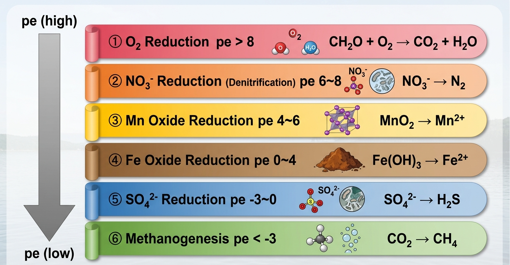

## Introduction: The Order in Which Groundwater "Decays" (Reduces)

As river water infiltrates underground and flows through an aquifer over decades, its chemical composition changes dramatically.

What drives this change is **organic carbon**. As microorganisms decompose organic matter, they utilize "electron acceptors" in a specific sequence. This sequence is governed by thermodynamic inevitability.

```{=html}
<div style="background:#FFF7ED; border-left:4px solid #D97706; padding:1.2em 1.5em; margin:1.5em 0; border-radius:0 8px 8px 0;">
  <div style="font-weight:700; color:#92400E; margin-bottom:0.6em;">Intuitive Understanding of Redox Sequences</div>
  <div style="font-size:0.9em; color:#78350F; line-height:1.9;">
    Microorganisms preferentially use the electron acceptor that yields the "most energy".<br>
    O₂ provides the highest energy yield, so it is consumed first. It is followed by NO₃⁻, Mn oxides, Fe oxides, SO₄²⁻, and finally CO₂ (producing CH₄).<br><br>
    This sequence manifests both <strong>spatially</strong> (along the flow path in the aquifer) and <strong>temporally</strong> (in the history of burial and deposition).
  </div>
</div>
```

The conceptual diagram at the beginning of this article (Appelo & Postma, 1996) illustrates how these "waves" appear one after another. In this session, we will **calculate this sequence using PHREEQC**.

::: callout-note
## What you will learn in this article

- The thermodynamic order of redox reactions and the pe–pH relationship
- How to progressively oxidize organic carbon using the `REACTION` block
- Tracking simultaneous changes in O₂, NO₃⁻, Mn²⁺, Fe²⁺, SO₄²⁻, and CH₄ concentrations
- Simulating the spatial Redox front with the `TRANSPORT` block
- Reproducing the Appelo & Postma diagram using Python
:::

------------------------------------------------------------------------

## Theory: Thermodynamic Order of Redox Reactions

### Half-Reactions and Gibbs Energy

If we arrange the reduction half-reactions of each electron acceptor by the **Gibbs energy ΔG°** gained (kJ/mol CH₂O), we get the following sequence:

```{=html}
<div style="overflow-x:auto; margin:1.5em 0;">
<table style="width:100%; border-collapse:collapse; font-size:0.88em;">
  <thead>
    <tr style="background:#D97706; color:white;">
      <th style="padding:10px 13px; text-align:center;">Order</th>
      <th style="padding:10px 13px; text-align:left;">Reaction (Oxidation of CH₂O)</th>
      <th style="padding:10px 13px; text-align:center;">ΔG° (kJ/mol)</th>
      <th style="padding:10px 13px; text-align:left;">Environment</th>
    </tr>
  </thead>
  <tbody>
    <tr style="background:#FEF2F2;">
      <td style="padding:9px 13px; text-align:center; font-weight:700; font-size:1.1em; color:#DC2626;">①</td>
      <td style="padding:9px 13px; font-size:0.88em;">CH₂O + O₂ → CO₂ + H₂O</td>
      <td style="padding:9px 13px; text-align:center; font-family:monospace; font-weight:600; color:#DC2626;">−479</td>
      <td style="padding:9px 13px; font-size:0.88em; color:#DC2626;">Oxic</td>
    </tr>
    <tr style="background:#FFF7ED;">
      <td style="padding:9px 13px; text-align:center; font-weight:700; font-size:1.1em; color:#EA580C;">②</td>
      <td style="padding:9px 13px; font-size:0.88em;">CH₂O + 4/5 NO₃⁻ + 4/5 H⁺ → CO₂ + 2/5 N₂ + 7/5 H₂O</td>
      <td style="padding:9px 13px; text-align:center; font-family:monospace; font-weight:600; color:#EA580C;">−453</td>
      <td style="padding:9px 13px; font-size:0.88em; color:#EA580C;">Denitrification (Suboxic)</td>
    </tr>
    <tr style="background:#FDFDFD;">
      <td style="padding:9px 13px; text-align:center; font-weight:700; font-size:1.1em; color:#CA8A04;">③</td>
      <td style="padding:9px 13px; font-size:0.88em;">CH₂O + 2MnO₂ + 4H⁺ → CO₂ + 2Mn²⁺ + 3H₂O</td>
      <td style="padding:9px 13px; text-align:center; font-family:monospace; font-weight:600; color:#CA8A04;">−349</td>
      <td style="padding:9px 13px; font-size:0.88em; color:#CA8A04;">Mn reduction</td>
    </tr>
    <tr style="background:#FFF7ED;">
      <td style="padding:9px 13px; text-align:center; font-weight:700; font-size:1.1em; color:#92400E;">④</td>
      <td style="padding:9px 13px; font-size:0.88em;">CH₂O + 4Fe(OH)₃ + 8H⁺ → CO₂ + 4Fe²⁺ + 11H₂O</td>
      <td style="padding:9px 13px; text-align:center; font-family:monospace; font-weight:600; color:#92400E;">−114</td>
      <td style="padding:9px 13px; font-size:0.88em; color:#92400E;">Fe reduction (Suboxic-Reducing)</td>
    </tr>
    <tr style="background:#FDFDFD;">
      <td style="padding:9px 13px; text-align:center; font-weight:700; font-size:1.1em; color:#2563EB;">⑤</td>
      <td style="padding:9px 13px; font-size:0.88em;">2CH₂O + SO₄²⁻ → 2CO₂ + H₂S + 2H₂O</td>
      <td style="padding:9px 13px; text-align:center; font-family:monospace; font-weight:600; color:#2563EB;">−96</td>
      <td style="padding:9px 13px; font-size:0.88em; color:#2563EB;">Sulfate reduction (Reducing)</td>
    </tr>
    <tr style="background:#F0FDF4;">
      <td style="padding:9px 13px; text-align:center; font-weight:700; font-size:1.1em; color:#15803D;">⑥</td>
      <td style="padding:9px 13px; font-size:0.88em;">2CH₂O → CO₂ + CH₄</td>
      <td style="padding:9px 13px; text-align:center; font-family:monospace; font-weight:600; color:#15803D;">−58</td>
      <td style="padding:9px 13px; font-size:0.88em; color:#15803D;">Methanogenesis (Strongly Reducing)</td>
    </tr>
  </tbody>
</table>
</div>
```

The larger the absolute value of ΔG°, the more "profitable" the reaction is. Therefore, microorganisms utilize them in the order from ① to ⑥. This is the thermodynamic basis for redox sequences.

### Correspondence with the pe–pH Diagram

Each reaction is sequentially activated as **pe (the negative logarithm of electron activity)** decreases:



------------------------------------------------------------------------

## PHREEQC Code

### Before Reading the Code: The Role of the 4 Blocks

```{=html}
<div style="display:grid; grid-template-columns:1fr 1fr; gap:1.2em; margin:1.5em 0;">
  <div style="background:#FEF2F2; border-radius:10px; padding:1.3em; border-left:4px solid #DC2626;">
    <div style="font-weight:700; color:#DC2626; margin-bottom:0.5em;">① SOLUTION — Creating the initial water</div>
    <div style="font-size:0.88em; color:#78350F; line-height:1.8;">
      Defines the starting groundwater<br>
      containing O₂, NO₃⁻, and SO₄²⁻.<br>
      pe = 4 represents a "moderately oxidizing" state.
    </div>
  </div>
  <div style="background:#FFF7ED; border-radius:10px; padding:1.3em; border-left:4px solid #D97706;">
    <div style="font-weight:700; color:#D97706; margin-bottom:0.5em;">② EQUILIBRIUM_PHASES — Placing solid phases</div>
    <div style="font-size:0.88em; color:#78350F; line-height:1.8;">
      Defines iron and manganese oxides in the aquifer.<br>
      When carbon is added, they dissolve<br>
      and release Fe²⁺ and Mn²⁺.
    </div>
  </div>
  <div style="background:#F0FDF4; border-radius:10px; padding:1.3em; border-left:4px solid #16A34A;">
    <div style="font-weight:700; color:#15803D; margin-bottom:0.5em;">③ REACTION — Adding carbon gradually</div>
    <div style="font-size:0.88em; color:#166534; line-height:1.8;">
      Adds carbon (C) equally over 26 steps.<br>
      With each addition, pe drops,<br>
      and TEAs (Terminal Electron Acceptors) are sequentially consumed.
    </div>
  </div>
  <div style="background:#EFF6FF; border-radius:10px; padding:1.3em; border-left:4px solid #2563EB;">
    <div style="font-weight:700; color:#1E40AF; margin-bottom:0.5em;">④ USER_GRAPH — Plotting results on the fly</div>
    <div style="font-size:0.88em; color:#1E3A5F; line-height:1.8;">
      Uses PHREEQC's built-in graphing feature<br>
      to display concentration changes<br>
      in real-time during execution.
    </div>
  </div>
</div>
```

### Full Code

``` phreeqc
KNOBS
    -step_size 10
    -pe_step_size 5
    -diagonal_scale true
SOLUTION 1
    temp      25
    pH        6
    pe        4
    redox     pe
    units     mmol/kgw
    density   1
    Na        1.236
    K         0.041
    Mg        0.115
    Ca        0.067
    Cl        1.467
    N(5)      0.058
    S(6)      0.085
    Alkalinity 0.26
    O(0)      0.124
    -water    1 # kg
EQUILIBRIUM_PHASES 1
    Goethite  0 0.0025
    Pyrolusite 0 4e-005
    FeS(ppt)  0 0
REACTION 1
    C          1
    0.572 millimoles in 26 steps
INCREMENTAL_REACTIONS True
USER_GRAPH 1
    -headings               C O2 NO3 Mn(+2) Fe(+2) SO4 S(-2) CH4
    -axis_titles            "Carbon added (mmol/kg)" "Concentration (mol/kg)" ""
    -initial_solutions      false
    -connect_simulations    true
    -plot_concentration_vs  x
  -start
10 graph_x step_no*0.572/26
20 graph_y tot("O(0)")/2, tot("N(5)"), tot("Mn(2)"), tot("Fe(2)"), tot("S(6)"), tot("S(-2)"), tot("C(-4)")
  -end
    -active                 true
END
```

### Meaning of Each Section

**SOLUTION — Initial Solution**

```{=html}
<div style="overflow-x:auto; margin:1.2em 0;">
<table style="width:100%; border-collapse:collapse; font-size:0.87em;">
  <thead>
    <tr style="background:#374151; color:white;">
      <th style="padding:8px 12px; text-align:left;">Line</th>
      <th style="padding:8px 12px; text-align:left;">Meaning</th>
      <th style="padding:8px 12px; text-align:left;">Note</th>
    </tr>
  </thead>
  <tbody>
    <tr style="background:#F9FAFB;">
      <td style="padding:8px 12px; font-family:monospace; color:#DC2626;">pH 6 / pe 4</td>
      <td style="padding:8px 12px;">Slightly acidic, moderately oxidizing</td>
      <td style="padding:8px 12px; color:#6B7280; font-size:0.9em;">pe=4 corresponds to an aquifer where O₂ is still present</td>
    </tr>
    <tr style="background:#FFFFFF;">
      <td style="padding:8px 12px; font-family:monospace; color:#DC2626;">units mmol/kgw</td>
      <td style="padding:8px 12px;">Sets concentration units to mmol/kgw</td>
      <td style="padding:8px 12px; color:#6B7280; font-size:0.9em;">All subsequent values are interpreted in this unit</td>
    </tr>
    <tr style="background:#F9FAFB;">
      <td style="padding:8px 12px; font-family:monospace; color:#DC2626;">O(0) 0.124</td>
      <td style="padding:8px 12px;">Dissolved O₂ ≈ 2 mg/L</td>
      <td style="padding:8px 12px; color:#6B7280; font-size:0.9em;">O(0) is by atomic weight of O. O₂ = O(0)/2 = 0.062 mmol</td>
    </tr>
    <tr style="background:#FFFFFF;">
      <td style="padding:8px 12px; font-family:monospace; color:#DC2626;">N(5) 0.058</td>
      <td style="padding:8px 12px;">NO₃⁻ ≈ 3.6 mg/L</td>
      <td style="padding:8px 12px; color:#6B7280; font-size:0.9em;">N(5) = Nitrogen with oxidation state +5 = Nitrate nitrogen</td>
    </tr>
    <tr style="background:#F9FAFB;">
      <td style="padding:8px 12px; font-family:monospace; color:#DC2626;">S(6) 0.085</td>
      <td style="padding:8px 12px;">SO₄²⁻ ≈ 8.2 mg/L</td>
      <td style="padding:8px 12px; color:#6B7280; font-size:0.9em;">S(6) = Sulfur with oxidation state +6 = Sulfate sulfur</td>
    </tr>
  </tbody>
</table>
</div>
```

**EQUILIBRIUM_PHASES — Solid Phases**

```{=html}
<div style="overflow-x:auto; margin:1.2em 0;">
<table style="width:100%; border-collapse:collapse; font-size:0.87em;">
  <thead>
    <tr style="background:#374151; color:white;">
      <th style="padding:8px 12px; text-align:left;">Mineral Name</th>
      <th style="padding:8px 12px; text-align:left;">Formula</th>
      <th style="padding:8px 12px; text-align:center;">Initial Moles</th>
      <th style="padding:8px 12px; text-align:left;">Role</th>
    </tr>
  </thead>
  <tbody>
    <tr style="background:#FFF7ED;">
      <td style="padding:8px 12px; font-family:monospace; font-weight:600; color:#92400E;">Goethite</td>
      <td style="padding:8px 12px;">FeOOH</td>
      <td style="padding:8px 12px; text-align:center; font-family:monospace;">0.0025</td>
      <td style="padding:8px 12px; font-size:0.9em;">Dissolves in the Fe-reducing zone to release Fe²⁺</td>
    </tr>
    <tr style="background:#FEFCE8;">
      <td style="padding:8px 12px; font-family:monospace; font-weight:600; color:#CA8A04;">Pyrolusite</td>
      <td style="padding:8px 12px;">MnO₂</td>
      <td style="padding:8px 12px; text-align:center; font-family:monospace;">4×10⁻⁵</td>
      <td style="padding:8px 12px; font-size:0.9em;">Dissolves in the Mn-reducing zone to release Mn²⁺ (small amount)</td>
    </tr>
    <tr style="background:#F0FDF4;">
      <td style="padding:8px 12px; font-family:monospace; font-weight:600; color:#15803D;">FeS(ppt)</td>
      <td style="padding:8px 12px;">FeS</td>
      <td style="padding:8px 12px; text-align:center; font-family:monospace;">0</td>
      <td style="padding:8px 12px; font-size:0.9em;">Acts as a sink where H₂S (from sulfate reduction) and Fe²⁺ precipitate</td>
    </tr>
  </tbody>
</table>
</div>
```

::: callout-note
## Meaning of `FeS(ppt) 0 0`

The first `0` is the **target saturation index** (SI = 0 = equilibrium), and the second `0` is the **initial amount** (moles). Setting the initial amount to zero means "this mineral doesn't exist initially, but it is allowed to precipitate if it becomes oversaturated". When H₂S is produced during sulfate reduction, it reacts with Fe²⁺ and precipitates as FeS, effectively removing Fe²⁺ and S²⁻ from the solution.
:::

**REACTION and USER_GRAPH**

`C 1` declares that carbon (C) is used as the reactant. `0.572 millimoles in 26 steps` means a total of 0.572 mmol is divided into 26 equal steps, meaning about 0.022 mmol of carbon is added per step.

The equation for `graph_x`, `step_no * 0.572/26`, converts the step number into "added carbon amount (mmol)". Note that `tot("O(0)")/2` divides the total atomic O by 2 to convert it to molecular O₂.

::: callout-tip
## Avoiding Convergence Errors (Maximum iterations exceeded) using KNOBS

In simulations where the electron state changes rapidly—especially during nitrogen reduction—PHREEQC's calculations often fail to converge and result in an error. By adding a `KNOBS` block at the beginning of the code and configuring parameters like `-step_size 10` or `-pe_step_size 5` (which limit the maximum allowable pe change per step), the calculation is stabilized and can successfully run to completion.
:::

------------------------------------------------------------------------

## How to Read the Calculation Results

The X-axis represents the "Carbon added (mmol/kg)", ranging from 0 to 0.572 mmol. As carbon increases, each electron acceptor changes in sequence.

```{=html}
<div style="overflow-x:auto; margin:1.5em 0;">
<table style="width:100%; border-collapse:collapse; font-size:0.87em;">
  <thead>
    <tr style="background:#D97706; color:white;">
      <th style="padding:10px 12px; text-align:left;">Stage</th>
      <th style="padding:10px 12px; text-align:center;">Approx. Carbon Added</th>
      <th style="padding:10px 12px; text-align:left;">Observed Change</th>
      <th style="padding:10px 12px; text-align:left;">Geological/Environmental Context</th>
    </tr>
  </thead>
  <tbody>
    <tr style="background:#FEF2F2;">
      <td style="padding:9px 12px; font-weight:600; color:#DC2626;">① O₂ Consumption</td>
      <td style="padding:9px 12px; text-align:center; font-family:monospace;">0 → 0.06 mmol</td>
      <td style="padding:9px 12px; font-size:0.88em;">O₂ drops rapidly. The O(0)/2 curve is the first to fall.</td>
      <td style="padding:9px 12px; font-size:0.88em; color:#6B7280;">Recharge zone from river to groundwater</td>
    </tr>
    <tr style="background:#FFF7ED;">
      <td style="padding:9px 12px; font-weight:600; color:#EA580C;">② NO₃⁻ Consumption</td>
      <td style="padding:9px 12px; text-align:center; font-family:monospace;">0.06 → 0.13 mmol</td>
      <td style="padding:9px 12px; font-size:0.88em;">NO₃⁻ decreases. The drop in pe temporarily slows down.</td>
      <td style="padding:9px 12px; font-size:0.88em; color:#6B7280;">Nitrate disappearance in deep groundwater under agricultural areas</td>
    </tr>
    <tr style="background:#FEFCE8;">
      <td style="padding:9px 12px; font-weight:600; color:#CA8A04;">③ Mn²⁺ Appearance</td>
      <td style="padding:9px 12px; text-align:center; font-family:monospace;">Around 0.13 mmol</td>
      <td style="padding:9px 12px; font-size:0.88em;">Pyrolusite dissolves, leading to a spike in Mn²⁺ (short-lived due to small amounts).</td>
      <td style="padding:9px 12px; font-size:0.88em; color:#6B7280;">Causes Mn issues in aging wells</td>
    </tr>
    <tr style="background:#FFF7ED;">
      <td style="padding:9px 12px; font-weight:600; color:#92400E;">④ Fe²⁺ Appearance</td>
      <td style="padding:9px 12px; text-align:center; font-family:monospace;">0.15 → 0.40 mmol</td>
      <td style="padding:9px 12px; font-size:0.88em;">Goethite dissolves, increasing Fe²⁺. This represents the largest solid phase.</td>
      <td style="padding:9px 12px; font-size:0.88em; color:#6B7280;">Reddish-brown well water and pipe scaling</td>
    </tr>
    <tr style="background:#EFF6FF;">
      <td style="padding:9px 12px; font-weight:600; color:#2563EB;">⑤ H₂S Generation</td>
      <td style="padding:9px 12px; text-align:center; font-family:monospace;">0.40 → 0.57 mmol</td>
      <td style="padding:9px 12px; font-size:0.88em;">SO₄²⁻ drops; H₂S appears. Fe²⁺ is scavenged by FeS(ppt).</td>
      <td style="padding:9px 12px; font-size:0.88em; color:#6B7280;">Sulfur smell in hot springs or old oil field brines</td>
    </tr>
    <tr style="background:#F0FDF4;">
      <td style="padding:9px 12px; font-weight:600; color:#15803D;">⑥ CH₄ Generation</td>
      <td style="padding:9px 12px; text-align:center; font-family:monospace;">After 0.57 mmol</td>
      <td style="padding:9px 12px; font-size:0.88em;">C(-4) = CH₄ appears. Starts only after all TEAs are depleted.</td>
      <td style="padding:9px 12px; font-size:0.88em; color:#6B7280;">Wetlands, peat bogs, deep coal seams</td>
    </tr>
  </tbody>
</table>
</div>
```

------------------------------------------------------------------------

## Correspondence with Appelo & Postma's Diagram

The reason the "waves appear to overlap" in the opening figure is because the concentration changes of each component **exhibit peaks**:

```{=html}
<div style="display:grid; grid-template-columns:1fr 1fr; gap:1.2em; margin:1.5em 0;">
  <div style="background:#FFF7ED; border-radius:10px; padding:1.2em; border-left:3px solid #D97706;">
    <div style="font-weight:700; color:#92400E; margin-bottom:0.6em;">Consumed Components (Downward Slope)</div>
    <div style="font-size:0.88em; color:#78350F; line-height:1.7;">
      O₂, NO₃⁻, and SO₄²⁻ drop rapidly<br>
      once the reaction begins.<br>
      They form the "left half of a wave".
    </div>
  </div>
  <div style="background:#F0FDF4; border-radius:10px; padding:1.2em; border-left:3px solid #16A34A;">
    <div style="font-weight:700; color:#15803D; margin-bottom:0.6em;">Generated Components (With Peaks)</div>
    <div style="font-size:0.88em; color:#166534; line-height:1.7;">
      Mn²⁺, Fe²⁺, and H₂S are generated,<br>
      but get consumed again or precipitate<br>
      in subsequent reactions, forming the "right half of a wave".
    </div>
  </div>
</div>
```

::: callout-note
## The "Two Peaks" of Fe²⁺

Fe²⁺ appears twice on the right edge of the graph. This is due to:

1.  **The first peak**: Generation of Fe²⁺ from the reductive dissolution of Goethite (pe 0 to 4).
2.  **The second increase**: In the strongly reducing zone (pe \< −3), once SO₄²⁻ is converted to H₂S, the dissolution of Fe²⁺ exceeds the precipitation of FeS₂ (pyrite).

If we check the SI of pyrite in PHREEQC, we can confirm this behavior computationally.
:::

------------------------------------------------------------------------

## Conclusion

```{=html}
<div style="display:grid; grid-template-columns:repeat(3,1fr); gap:1em; margin:1.5em 0;">
  <div style="background:#FFF7ED; border-radius:10px; padding:1.2em; text-align:center; border-bottom:3px solid #D97706;">
    <div style="font-size:1.6em; margin-bottom:0.3em;">⚡</div>
    <div style="font-weight:700; color:#92400E; margin-bottom:0.4em;">Thermodynamic Inevitability</div>
    <div style="font-size:0.83em; color:#78350F; line-height:1.5;">Electron acceptors are consumed in order of largest ΔG°.<br>Microorganisms maximize energy.</div>
  </div>
  <div style="background:#EFF6FF; border-radius:10px; padding:1.2em; text-align:center; border-bottom:3px solid #2563EB;">
    <div style="font-size:1.6em; margin-bottom:0.3em;">🌊</div>
    <div style="font-weight:700; color:#1E3A5F; margin-bottom:0.4em;">Appears in Space & Time</div>
    <div style="font-size:0.83em; color:#1E40AF; line-height:1.5;">The same sequence appears<br>along the flow distance<br>and depth in sediments.</div>
  </div>
  <div style="background:#F0FDF4; border-radius:10px; padding:1.2em; text-align:center; border-bottom:3px solid #16A34A;">
    <div style="font-size:1.6em; margin-bottom:0.3em;">🔬</div>
    <div style="font-weight:700; color:#15803D; margin-bottom:0.4em;">Direct Water Quality Diagnosis</div>
    <div style="font-size:0.83em; color:#166534; line-height:1.5;">The appearance of Fe²⁺, Mn²⁺, and H₂S<br>are direct indicators of<br>the current redox stage.</div>
  </div>
</div>
```

::: callout-tip
## Coming Up Next — Part 14: "Inverse Modeling (INVERSE_MODELING) — Estimating Reactions from Field Data"

We will input actual water quality analysis data (from an upstream and a downstream point) and reverse-engineer how much of which mineral dissolved or precipitated between them. The types of reactions learned in Redox sequences will serve as the "candidate reaction list" for inverse modeling.
:::

------------------------------------------------------------------------

## References

::: {#refs}
:::
