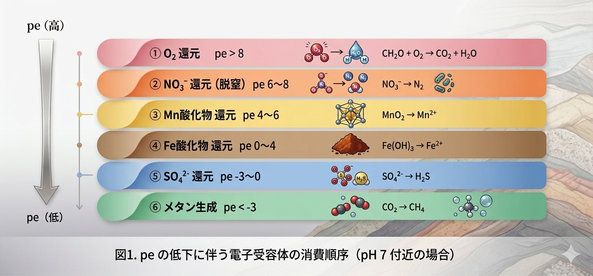

## はじめに：地下水は、「腐る (還元する)」順番がある

川の水が地下に浸透し、帯水層を何十年もかけて流れる間に、 水の化学組成は劇的に変化する。

その変化を駆動するのは **有機炭素（organic carbon）** だ。 有機物が微生物に分解されるとき、電子を受け取る「電子受容体」が順番に使われていく。 この順番には熱力学的な必然性がある。

```{=html}
<div style="background:#FFF7ED; border-left:4px solid #D97706; padding:1.2em 1.5em; margin:1.5em 0; border-radius:0 8px 8px 0;">
  <div style="font-weight:700; color:#92400E; margin-bottom:0.6em;">Redox sequences の直感的理解</div>
  <div style="font-size:0.9em; color:#78350F; line-height:1.9;">
    微生物は「最もエネルギーを得られる」電子受容体を優先して使う。<br>
    O₂ が最も得をするので最初に消費され、次に NO₃⁻、Mn酸化物、Fe酸化物、SO₄²⁻、最後に CO₂（→ CH₄）。<br><br>
    これは帯水層の<strong>空間方向</strong>（流れに沿った距離）にも、<strong>時間方向</strong>（埋没・堆積の歴史）にも現れる。
  </div>
</div>
```

冒頭の図（Appelo & Postma, 1996）は、この「波が次々と現れる」様子を概念的に示したものだ。今回はこれを **PHREEQC で実際に計算**する。

::: callout-note
## この記事で学ぶこと

- 酸化還元反応の熱力学的順序と pe–pH の関係
- `REACTION` ブロックで有機炭素（CH₂O）を段階的に酸化させる方法
- O₂・NO₃⁻・Mn²⁺・Fe²⁺・SO₄²⁻・CH₄ の濃度変化を一気に追う
- `TRANSPORT` ブロックで空間方向の Redox front を再現する
- Python で Appelo & Postma 風の図を再現する
:::

------------------------------------------------------------------------

## 理論：酸化還元反応の熱力学的順序

### 半反応とギブズエネルギー

各電子受容体の還元半反応を、得られる**ギブズエネルギー ΔG°**（kJ/mol CH₂O）で並べると：

```{=html}
<div style="overflow-x:auto; margin:1.5em 0;">
<table style="width:100%; border-collapse:collapse; font-size:0.88em;">
  <thead>
    <tr style="background:#D97706; color:white;">
      <th style="padding:10px 13px; text-align:center;">順番</th>
      <th style="padding:10px 13px; text-align:left;">反応（CH₂O の酸化）</th>
      <th style="padding:10px 13px; text-align:center;">ΔG° (kJ/mol)</th>
      <th style="padding:10px 13px; text-align:left;">環境</th>
    </tr>
  </thead>
  <tbody>
    <tr style="background:#FEF2F2;">
      <td style="padding:9px 13px; text-align:center; font-weight:700; font-size:1.1em; color:#DC2626;">①</td>
      <td style="padding:9px 13px; font-size:0.88em;">CH₂O + O₂ → CO₂ + H₂O</td>
      <td style="padding:9px 13px; text-align:center; font-family:monospace; font-weight:600; color:#DC2626;">−479</td>
      <td style="padding:9px 13px; font-size:0.88em; color:#DC2626;">好気的（Oxic）</td>
    </tr>
    <tr style="background:#FFF7ED;">
      <td style="padding:9px 13px; text-align:center; font-weight:700; font-size:1.1em; color:#EA580C;">②</td>
      <td style="padding:9px 13px; font-size:0.88em;">CH₂O + 4/5 NO₃⁻ + 4/5 H⁺ → CO₂ + 2/5 N₂ + 7/5 H₂O</td>
      <td style="padding:9px 13px; text-align:center; font-family:monospace; font-weight:600; color:#EA580C;">−453</td>
      <td style="padding:9px 13px; font-size:0.88em; color:#EA580C;">脱窒（Suboxic）</td>
    </tr>
    <tr style="background:#FDFDFD;">
      <td style="padding:9px 13px; text-align:center; font-weight:700; font-size:1.1em; color:#CA8A04;">③</td>
      <td style="padding:9px 13px; font-size:0.88em;">CH₂O + 2MnO₂ + 4H⁺ → CO₂ + 2Mn²⁺ + 3H₂O</td>
      <td style="padding:9px 13px; text-align:center; font-family:monospace; font-weight:600; color:#CA8A04;">−349</td>
      <td style="padding:9px 13px; font-size:0.88em; color:#CA8A04;">Mn還元</td>
    </tr>
    <tr style="background:#FFF7ED;">
      <td style="padding:9px 13px; text-align:center; font-weight:700; font-size:1.1em; color="#92400E";">④</td>
      <td style="padding:9px 13px; font-size:0.88em;">CH₂O + 4Fe(OH)₃ + 8H⁺ → CO₂ + 4Fe²⁺ + 11H₂O</td>
      <td style="padding:9px 13px; text-align:center; font-family:monospace; font-weight:600; color:#92400E;">−114</td>
      <td style="padding:9px 13px; font-size:0.88em; color:#92400E;">Fe還元（Suboxic〜Reducing）</td>
    </tr>
    <tr style="background:#FDFDFD;">
      <td style="padding:9px 13px; text-align:center; font-weight:700; font-size:1.1em; color:#2563EB;">⑤</td>
      <td style="padding:9px 13px; font-size:0.88em;">2CH₂O + SO₄²⁻ → 2CO₂ + H₂S + 2H₂O</td>
      <td style="padding:9px 13px; text-align:center; font-family:monospace; font-weight:600; color:#2563EB;">−96</td>
      <td style="padding:9px 13px; font-size:0.88em; color:#2563EB;">硫酸還元（Reducing）</td>
    </tr>
    <tr style="background:#F0FDF4;">
      <td style="padding:9px 13px; text-align:center; font-weight:700; font-size:1.1em; color:#15803D;">⑥</td>
      <td style="padding:9px 13px; font-size:0.88em;">2CH₂O → CO₂ + CH₄</td>
      <td style="padding:9px 13px; text-align:center; font-family:monospace; font-weight:600; color:#15803D;">−58</td>
      <td style="padding:9px 13px; font-size:0.88em; color:#15803D;">メタン生成（強還元）</td>
    </tr>
  </tbody>
</table>
</div>
```

ΔG° の絶対値が大きいほど「お得」なので、微生物は ① → ⑥ の順に使う。 これが Redox sequences の熱力学的根拠だ。

### pe–pH ダイアグラムとの対応

各反応は **pe（電子活量の対数）** が低下するにつれて順次起動する：



------------------------------------------------------------------------

## PHREEQC コード

### コードを読む前に：4つのブロックの役割

```{=html}
<div style="display:grid; grid-template-columns:1fr 1fr; gap:1.2em; margin:1.5em 0;">
  <div style="background:#FEF2F2; border-radius:10px; padding:1.3em; border-left:4px solid #DC2626;">
    <div style="font-weight:700; color:#DC2626; margin-bottom:0.5em;">① SOLUTION — 初期の水を作る</div>
    <div style="font-size:0.88em; color:#78350F; line-height:1.8;">
      O₂・NO₃⁻・SO₄²⁻ を持つ<br>
      地下水の出発点を定義する。<br>
      pe = 4 は「やや酸化的」な状態。
    </div>
  </div>
  <div style="background:#FFF7ED; border-radius:10px; padding:1.3em; border-left:4px solid #D97706;">
    <div style="font-weight:700; color:#D97706; margin-bottom:0.5em;">② EQUILIBRIUM_PHASES — 固相を置く</div>
    <div style="font-size:0.88em; color:#78350F; line-height:1.8;">
      帯水層中の鉄・マンガン酸化物を固相として定義。<br>
      炭素が加わると溶解して<br>
      Fe²⁺・Mn²⁺ を放出する。
    </div>
  </div>
  <div style="background:#F0FDF4; border-radius:10px; padding:1.3em; border-left:4px solid #16A34A;">
    <div style="font-weight:700; color:#15803D; margin-bottom:0.5em;">③ REACTION — 炭素を少しずつ加える</div>
    <div style="font-size:0.88em; color:#166534; line-height:1.8;">
      炭素 C を 26 ステップで均等に添加。<br>
      加えるたびに pe が低下し、<br>
      各 TEA が順番に消費されていく。
    </div>
  </div>
  <div style="background:#EFF6FF; border-radius:10px; padding:1.3em; border-left:4px solid #2563EB;">
    <div style="font-weight:700; color:#1E40AF; margin-bottom:0.5em;">④ USER_GRAPH — 結果をその場で描く</div>
    <div style="font-size:0.88em; color:#1E3A5F; line-height:1.8;">
      PHREEQC の内蔵グラフ機能で<br>
      全成分の濃度変化を<br>
      実行しながらリアルタイムに表示する。
    </div>
  </div>
</div>
```

### コード全文

``` phreeqc
SOLUTION 1
    temp      25
    pH        6
    pe        4
    redox     pe
    units     mmol/kgw
    density   1
    Na        1.236
    K         0.041
    Mg        0.115
    Ca        0.067
    Cl        1.467
    N(5)      0.058
    S(6)      0.085
    Alkalinity 0.26
    O(0)      0.124
    -water    1 # kg
EQUILIBRIUM_PHASES 1
    Goethite  0 0.0025
    Pyrolusite 0 4e-005
    FeS(ppt)  0 0
REACTION 1
    C          1
    0.572 millimoles in 26 steps
INCREMENTAL_REACTIONS True
USER_GRAPH 1
    -headings               C O2 NO3 Mn(+2) Fe(+2) SO4 S(-2) CH4
    -axis_titles            "Carbon added (mmol/kg)" "Concentration (mol/kg)" ""
    -initial_solutions      false
    -connect_simulations    true
    -plot_concentration_vs  x
  -start
10 graph_x step_no*0.572/26
20 graph_y tot("O(0)")/2, tot("N(5)"), tot("Mn(2)"), tot("Fe(2)"), tot("S(6)"), tot("S(-2)"), tot("C(-4)")
  -end
    -active                 true
END
```

### 各行の意味

**SOLUTION — 初期溶液**

```{=html}
<div style="overflow-x:auto; margin:1.2em 0;">
<table style="width:100%; border-collapse:collapse; font-size:0.87em;">
  <thead>
    <tr style="background:#374151; color:white;">
      <th style="padding:8px 12px; text-align:left;">行</th>
      <th style="padding:8px 12px; text-align:left;">意味</th>
      <th style="padding:8px 12px; text-align:left;">補足</th>
    </tr>
  </thead>
  <tbody>
    <tr style="background:#F9FAFB;">
      <td style="padding:8px 12px; font-family:monospace; color:#DC2626;">pH 6 / pe 4</td>
      <td style="padding:8px 12px;">やや酸性・中程度の酸化的条件</td>
      <td style="padding:8px 12px; color:#6B7280; font-size:0.9em;">pe = 4 は O₂ がまだ残っている帯水層に相当</td>
    </tr>
    <tr style="background:#FFFFFF;">
      <td style="padding:8px 12px; font-family:monospace; color:#DC2626;">units mmol/kgw</td>
      <td style="padding:8px 12px;">濃度単位を mmol/kgw に設定</td>
      <td style="padding:8px 12px; color:#6B7280; font-size:0.9em;">以降の数値がすべてこの単位で解釈される</td>
    </tr>
    <tr style="background:#F9FAFB;">
      <td style="padding:8px 12px; font-family:monospace; color:#DC2626;">O(0) 0.124</td>
      <td style="padding:8px 12px;">溶存 O₂ ≈ 2 mg/L</td>
      <td style="padding:8px 12px; color:#6B7280; font-size:0.9em;">O(0) は O 原子量で指定。O₂ = O(0)/2 = 0.062 mmol</td>
    </tr>
    <tr style="background:#FFFFFF;">
      <td style="padding:8px 12px; font-family:monospace; color:#DC2626;">N(5) 0.058</td>
      <td style="padding:8px 12px;">NO₃⁻ ≈ 3.6 mg/L</td>
      <td style="padding:8px 12px; color:#6B7280; font-size:0.9em;">N(5) = 酸化数 +5 の N = 硝酸態窒素</td>
    </tr>
    <tr style="background:#F9FAFB;">
      <td style="padding:8px 12px; font-family:monospace; color:#DC2626;">S(6) 0.085</td>
      <td style="padding:8px 12px;">SO₄²⁻ ≈ 8.2 mg/L</td>
      <td style="padding:8px 12px; color:#6B7280; font-size:0.9em;">S(6) = 酸化数 +6 の S = 硫酸態硫黄</td>
    </tr>
  </tbody>
</table>
</div>
```

**EQUILIBRIUM_PHASES — 固相**

```{=html}
<div style="overflow-x:auto; margin:1.2em 0;">
<table style="width:100%; border-collapse:collapse; font-size:0.87em;">
  <thead>
    <tr style="background:#374151; color:white;">
      <th style="padding:8px 12px; text-align:left;">鉱物名</th>
      <th style="padding:8px 12px; text-align:left;">化学式</th>
      <th style="padding:8px 12px; text-align:center;">初期量 (mol)</th>
      <th style="padding:8px 12px; text-align:left;">役割</th>
    </tr>
  </thead>
  <tbody>
    <tr style="background:#FFF7ED;">
      <td style="padding:8px 12px; font-family:monospace; font-weight:600; color:#92400E;">Goethite</td>
      <td style="padding:8px 12px;">FeOOH</td>
      <td style="padding:8px 12px; text-align:center; font-family:monospace;">0.0025</td>
      <td style="padding:8px 12px; font-size:0.9em;">Fe 還元域で溶解し Fe²⁺ を放出する</td>
    </tr>
    <tr style="background:#FEFCE8;">
      <td style="padding:8px 12px; font-family:monospace; font-weight:600; color:#CA8A04;">Pyrolusite</td>
      <td style="padding:8px 12px;">MnO₂</td>
      <td style="padding:8px 12px; text-align:center; font-family:monospace;">4×10⁻⁵</td>
      <td style="padding:8px 12px; font-size:0.9em;">Mn 還元域で溶解し Mn²⁺ を放出する（少量）</td>
    </tr>
    <tr style="background:#F0FDF4;">
      <td style="padding:8px 12px; font-family:monospace; font-weight:600; color:#15803D;">FeS(ppt)</td>
      <td style="padding:8px 12px;">FeS</td>
      <td style="padding:8px 12px; text-align:center; font-family:monospace;">0</td>
      <td style="padding:8px 12px; font-size:0.9em;">硫酸還元で生じた H₂S と Fe²⁺ が沈殿する受け皿</td>
    </tr>
  </tbody>
</table>
</div>
```

::: callout-note
## `FeS(ppt) 0 0` の意味

`0 0` の最初の `0` は**飽和指数の目標値**（SI = 0 = 平衡）、2番目の `0` は**初期量**（mol）だ。初期量をゼロにしておくと「この鉱物は最初は存在しないが、過飽和になれば沈殿してよい」という設定になる。硫酸還元で H₂S が生成されると Fe²⁺ と反応して FeS として沈殿し、溶液中の Fe²⁺ と S²⁻ が抑制される。
:::

**REACTION と USER_GRAPH**

`C 1` は炭素 C を反応種として使うという宣言。`0.572 millimoles in 26 steps` は合計 0.572 mmol を 26 等分して 1 ステップずつ加えるという意味で、1 ステップあたり約 0.022 mmol の炭素が添加される。

`graph_x` の式 `step_no * 0.572/26` はステップ番号を「添加した炭素量 (mmol)」に変換している。`tot("O(0)")/2` は O 原子の全量を 2 で割って O₂ 分子量に換算している点に注意。

::: callout-note
## `C` と `CH2O` の違い

`C`（炭素単体）を使うと PHREEQC は有機炭素の酸化を次のように処理する：

$$\text{C} + \text{H}_2\text{O} \rightarrow \text{CO}_2 + 4\text{H}^+ + 4e^-$$

`CH2O`（ホルムアルデヒド）でも電子数は同じだが、`C` のほうがデータベース依存の定義問題が起きにくく安定して動く。
:::

------------------------------------------------------------------------

## 計算結果の読み方

X 軸は「添加した炭素量 (mmol/kg)」で 0〜0.572 mmol の範囲を動く。各電子受容体は炭素が増えるにつれて順番に変化する。

```{=html}
<div style="overflow-x:auto; margin:1.5em 0;">
<table style="width:100%; border-collapse:collapse; font-size:0.87em;">
  <thead>
    <tr style="background:#D97706; color:white;">
      <th style="padding:10px 12px; text-align:left;">段階</th>
      <th style="padding:10px 12px; text-align:center;">炭素添加量の目安</th>
      <th style="padding:10px 12px; text-align:left;">観察される変化</th>
      <th style="padding:10px 12px; text-align:left;">地質・環境での意味</th>
    </tr>
  </thead>
  <tbody>
    <tr style="background:#FEF2F2;">
      <td style="padding:9px 12px; font-weight:600; color:#DC2626;">① O₂ 消費</td>
      <td style="padding:9px 12px; text-align:center; font-family:monospace;">0 → 0.06 mmol</td>
      <td style="padding:9px 12px; font-size:0.88em;">O₂ が急速に低下。O(0)/2 の曲線が最初に落ちる</td>
      <td style="padding:9px 12px; font-size:0.88em; color:#6B7280;">河川水→地下水への涵養帯</td>
    </tr>
    <tr style="background:#FFF7ED;">
      <td style="padding:9px 12px; font-weight:600; color:#EA580C;">② NO₃⁻ 消費</td>
      <td style="padding:9px 12px; text-align:center; font-family:monospace;">0.06 → 0.13 mmol</td>
      <td style="padding:9px 12px; font-size:0.88em;">NO₃⁻ 低下・pe の低下が一時緩やかになる</td>
      <td style="padding:9px 12px; font-size:0.88em; color:#6B7280;">農業地帯の深い地下水で硝酸塩が消える</td>
    </tr>
    <tr style="background:#FEFCE8;">
      <td style="padding:9px 12px; font-weight:600; color:#CA8A04;">③ Mn²⁺ 出現</td>
      <td style="padding:9px 12px; text-align:center; font-family:monospace;">0.13 mmol 前後</td>
      <td style="padding:9px 12px; font-size:0.88em;">Pyrolusite が溶解し Mn²⁺ が急増（少量のため短い）</td>
      <td style="padding:9px 12px; font-size:0.88em; color:#6B7280;">老朽化した井戸で Mn が問題になる原因</td>
    </tr>
    <tr style="background:#FFF7ED;">
      <td style="padding:9px 12px; font-weight:600; color:#92400E;">④ Fe²⁺ 出現</td>
      <td style="padding:9px 12px; text-align:center; font-family:monospace;">0.15 → 0.40 mmol</td>
      <td style="padding:9px 12px; font-size:0.88em;">Goethite が溶解し Fe²⁺ が増加。最大の固相量</td>
      <td style="padding:9px 12px; font-size:0.88em; color:#6B7280;">赤茶色の井戸水・配管のスケール</td>
    </tr>
    <tr style="background:#EFF6FF;">
      <td style="padding:9px 12px; font-weight:600; color:#2563EB;">⑤ H₂S 発生</td>
      <td style="padding:9px 12px; text-align:center; font-family:monospace;">0.40 → 0.57 mmol</td>
      <td style="padding:9px 12px; font-size:0.88em;">SO₄²⁻ 低下・H₂S 出現。FeS(ppt) に Fe²⁺ が捕捉される</td>
      <td style="padding:9px 12px; font-size:0.88em; color:#6B7280;">温泉の硫黄臭・古い油田随伴水</td>
    </tr>
    <tr style="background:#F0FDF4;">
      <td style="padding:9px 12px; font-weight:600; color:#15803D;">⑥ CH₄ 生成</td>
      <td style="padding:9px 12px; text-align:center; font-family:monospace;">0.57 mmol 以降</td>
      <td style="padding:9px 12px; font-size:0.88em;">C(-4) = CH₄ が出現。全 TEA が枯渇した後に起動</td>
      <td style="padding:9px 12px; font-size:0.88em; color:#6B7280;">湿地・泥炭地・深部石炭層</td>
    </tr>
  </tbody>
</table>
</div>
```

------------------------------------------------------------------------

## Appelo & Postma の図との対応

冒頭の図で「波が重なる」ように見えるのは、各成分の濃度変化が**ピークを持つ**からだ：

```{=html}
<div style="display:grid; grid-template-columns:1fr 1fr; gap:1.2em; margin:1.5em 0;">
  <div style="background:#FFF7ED; border-radius:10px; padding:1.2em; border-left:3px solid #D97706;">
    <div style="font-weight:700; color:#92400E; margin-bottom:0.6em;">消費される成分（右下がり）</div>
    <div style="font-size:0.88em; color:#78350F; line-height:1.7;">
      O₂・NO₃⁻・SO₄²⁻ は<br>
      反応が始まると急速に低下する。<br>
      「波の左半分」を描く。
    </div>
  </div>
  <div style="background:#F0FDF4; border-radius:10px; padding:1.2em; border-left:3px solid #16A34A;">
    <div style="font-weight:700; color:#15803D; margin-bottom:0.6em;">生成される成分（ピークあり）</div>
    <div style="font-size:0.88em; color:#166534; line-height:1.7;">
      Mn²⁺・Fe²⁺・H₂S は<br>
      生成されるが、次の反応で再び消費されたり<br>
      沈殿したりする。「波の右半分」＝消費を描く。
    </div>
  </div>
</div>
```

::: callout-note
## Fe²⁺ の「2回のピーク」

図の右端に Fe²⁺ が2回現れる。これは：

1.  **最初のピーク**：Goethite の還元溶解による Fe²⁺ の生成（pe 0〜4）
2.  **2回目の増加**：SO₄²⁻ が H₂S になると FeS₂（黄鉄鉱）の沈殿よりも Fe²⁺ の溶解が上回る強還元域（pe \< −3）

PHREEQCで黄鉄鉱の SI を確認すると、この挙動が計算で確認できる。
:::

------------------------------------------------------------------------

## まとめ

```{=html}
<div style="display:grid; grid-template-columns:repeat(3,1fr); gap:1em; margin:1.5em 0;">
  <div style="background:#FFF7ED; border-radius:10px; padding:1.2em; text-align:center; border-bottom:3px solid #D97706;">
    <div style="font-size:1.6em; margin-bottom:0.3em;">⚡</div>
    <div style="font-weight:700; color:#92400E; margin-bottom:0.4em;">熱力学的必然</div>
    <div style="font-size:0.83em; color:#78350F; line-height:1.5;">ΔG° の大きい順に<br>電子受容体が消費される<br>微生物はエネルギー最大化</div>
  </div>
  <div style="background:#EFF6FF; border-radius:10px; padding:1.2em; text-align:center; border-bottom:3px solid #2563EB;">
    <div style="font-size:1.6em; margin-bottom:0.3em;">🌊</div>
    <div style="font-weight:700; color:#1E3A5F; margin-bottom:0.4em;">空間にも時間にも現れる</div>
    <div style="font-size:0.83em; color:#1E40AF; line-height:1.5;">流れ方向の距離でも<br>堆積物の深さ方向でも<br>同じシークエンス</div>
  </div>
  <div style="background:#F0FDF4; border-radius:10px; padding:1.2em; text-align:center; border-bottom:3px solid #16A34A;">
    <div style="font-size:1.6em; margin-bottom:0.3em;">🔬</div>
    <div style="font-weight:700; color:#15803D; margin-bottom:0.4em;">水質診断に直結</div>
    <div style="font-size:0.83em; color:#166534; line-height:1.5;">Fe²⁺・Mn²⁺・H₂S の<br>出現はどの段階にあるかの<br>直接的な指標</div>
  </div>
</div>
```

::: callout-tip
## 次回 #14「逆モデリング（INVERSE_MODELING）— 野外データから反応量を推定する」

実際の水質分析データ（上流・下流の2点）を入力し、 その間でどの鉱物がどれだけ溶解・沈殿したかを逆算する。 Redox sequences で学んだ反応の種類が、逆モデリングの「候補反応リスト」として活きる。
:::

- [#1 インストールと最初の計算](../phreeqc-part1/)

- [#2 Speciationで海水を解析する](../phreeqc-part2/)

- [#3 MixingとEQUILIBRIUM_PHASES](../phreeqc-part3/)

- [#4 カルサイト−CO₂水反応](../phreeqc-part4/)

- [#5 炭酸地下水と海水の混合](../phreeqc-part5/)

- [#6 黄鉄鉱の酸化（AMD）](../phreeqc-part6/)

- [#7 溶解度ダイアグラム（Gibbsite）](../phreeqc-part7/)

- [#8 Pythonでの可視化](../phreeqc-part8/)

- [#9 イオン強度と活量係数](../phreeqc-part9/)

- [#10 飽和指数（SI）の使いこなし](../phreeqc-part10/)

- [#11 反応経路モデリング（REACTION block の応用）](../phreeqc-part11/)

- [#12 移流分散モデル（TRANSPORT block の応用）](../phreeqc-part12/)

- **#13 酸化還元シークエンス — 地下水が「還元」されていく順番**

- [#14 硝酸塩汚染の地下水診断 — 脱窒はどこで、どれだけ起きているか](../phreeqc-part14/)

*DeepFlow \| 地球科学シミュレーションの深みへ*