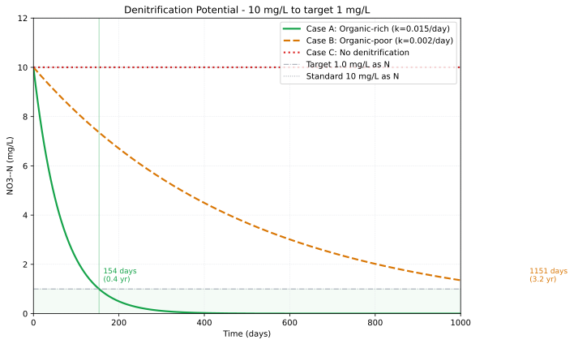

## Introduction: Why is Agricultural Groundwater Full of Nitrates?

When analyzing groundwater collected from agricultural areas in Japan, nitrate nitrogen often **exceeds the 10 mg/L (environmental standard value)**. Why? The answer lies in the soil.

In this article, we will calculate all of the following using Python:

1.  **Nitrification** — The process of NH₄⁺ transforming into NO₃⁻
2.  **Transport** — The process of NO₃⁻ flowing through the aquifer
3.  **Denitrification** — The process of NO₃⁻ disappearing as N₂
4.  **Diagnosis** — How to evaluate "where and how much" denitrification occurs from field data

::: callout-note
## Environmental Standards and Conversions

- Japanese groundwater environmental standard: **Nitrate nitrogen + Nitrite nitrogen ≤ 10 mg/L**
- WHO drinking water guidelines: **NO₃⁻-N ≤ 11.3 mg/L (= 50 mg/L as NO₃⁻)**
- Conversion: 10 mg/L as N = 10 / 14 × 62 = **44.3 mg/L as NO₃⁻ = 0.714 mmol/L**
:::


------------------------------------------------------------------------

## Theory: Nitrogen Transformation Reactions

### Nitrification

A two-step reaction where microbes oxidize NH₄⁺ under aerobic conditions:

$$\text{NH}_4^+ + \frac{3}{2}\text{O}_2 \xrightarrow{\text{Nitrosomonas}} \text{NO}_2^- + \text{H}_2\text{O} + 2\text{H}^+
\quad \Delta G° = -275 \text{ kJ/mol}$$

$$\text{NO}_2^- + \frac{1}{2}\text{O}_2 \xrightarrow{\text{Nitrobacter}} \text{NO}_3^-
\quad \Delta G° = -76 \text{ kJ/mol}$$

**Important points:** 
- Nitrification **produces H⁺** → Lowers the pH of soil/groundwater 
- Nitrification **requires O₂** → Nitrification does not occur in anaerobic aquifers 
- NO₃⁻ produced by nitrification **carries a negative charge** → Weakly adsorbed to soil and easily leached by rainwater

### Denitrification

Microbes reduce NO₃⁻ to N₂ under anaerobic conditions:

$$\text{CH}_2\text{O} + \frac{4}{5}\text{NO}_3^- + \frac{4}{5}\text{H}^+ \rightarrow \text{CO}_2 + \frac{2}{5}\text{N}_2 + \frac{7}{5}\text{H}_2\text{O}
\quad \Delta G° = -453 \text{ kJ/mol}$$

**Prerequisites for denitrification:**

```{=html}
<div style="display:grid; grid-template-columns:repeat(3,1fr); gap:1em; margin:1.2em 0;">
  <div style="background:#FEF2F2; border-radius:8px; padding:1em; border-top:3px solid #DC2626;">
    <div style="font-weight:700; color:#991B1B; font-size:0.92em; margin-bottom:0.4em;">❌ No O₂</div>
    <div style="font-size:0.83em; color:#7F1D1D; line-height:1.6;">DO &lt; 0.5 mg/L is a benchmark. As long as O₂ exists, denitrifying bacteria preferentially use O₂ and do not reduce NO₃⁻.</div>
  </div>
  <div style="background:#F0FDF4; border-radius:8px; padding:1em; border-top:3px solid #16A34A;">
    <div style="font-weight:700; color:#15803D; font-size:0.92em; margin-bottom:0.4em;">✅ Presence of Organic Carbon</div>
    <div style="font-size:0.83em; color:#166534; line-height:1.6;">Requires an electron donor (CH₂O). DOC &gt; 0.5 mg/L is considered a benchmark for denitrification activity.</div>
  </div>
  <div style="background:#EFF6FF; border-radius:8px; padding:1em; border-top:3px solid #2563EB;">
    <div style="font-weight:700; color:#1E3A5F; font-size:0.92em; margin-bottom:0.4em;">🦠 Denitrifying Bacteria Present</div>
    <div style="font-size:0.83em; color:#1E40AF; line-height:1.6;">Facultative anaerobic bacteria such as Pseudomonas and Paracoccus. They are almost universally present in groundwater.</div>
  </div>
</div>
```

------------------------------------------------------------------------

## Step 1: Simulating Nitrification

### Setup

We describe the aerobic oxidation of NH₄⁺ using Monod kinetics and perform numerical integration using `scipy.integrate.solve_ivp`.

``` python
# ============================================================
#  Step1: Nitrification
#  NH4+ -> NO2- -> NO3- Monod Kinetics
# ============================================================
import numpy as np
import matplotlib.pyplot as plt
from scipy.integrate import solve_ivp

plt.rcParams.update({
    "font.family":     "sans-serif",
    "font.sans-serif": ["DejaVu Sans"],
    "axes.unicode_minus": False,
    "figure.dpi":      150,
})

# ---- Parameters ----
rmax1  = 3e-9   # NH4+ -> NO2- max rate (mol/kgw/s)
Ks_NH4 = 5e-5   # NH4+ half-saturation constant (mol/kgw)
rmax2  = 5e-9   # NO2- -> NO3- max rate (mol/kgw/s)
Ks_NO2 = 2e-5   # NO2- half-saturation constant (mol/kgw)
Ks_O2  = 1e-5   # O2 half-saturation constant (mol/kgw)

# ---- Initial Concentrations (mol/kgw) ----
NH4_0 = 5.0e-4   # NH4+ 0.5 mmol/kg (from fertilizer)
NO2_0 = 0.0
NO3_0 = 0.0
O2_0  = 2.5e-4   # DO ≈ 8 mg/L

# ---- ODE Definition ----
def nitrification(t, y):
    NH4, NO2, NO3, O2 = y
    NH4 = max(NH4, 0); NO2 = max(NO2, 0); O2 = max(O2, 0)

    # Nitrification step1: NH4+ -> NO2-
    r1 = rmax1 * NH4 / (Ks_NH4 + NH4) * O2 / (Ks_O2 + O2)
    # Nitrification step2: NO2- -> NO3-
    r2 = rmax2 * NO2 / (Ks_NO2 + NO2) * O2 / (Ks_O2 + O2)

    dNH4 = -r1
    dNO2 =  r1 - r2
    dNO3 =  r2
    dO2  = -1.5 * r1 - 0.5 * r2   # Stoichiometry

    return [dNH4, dNO2, dNO3, dO2]

t_span = (0, 10 * 86400)   # 10 days (seconds)
t_eval = np.linspace(0, 10 * 86400, 500)
sol = solve_ivp(nitrification, t_span,
                [NH4_0, NO2_0, NO3_0, O2_0],
                t_eval=t_eval, method="RK45",
                rtol=1e-8, atol=1e-12)

t_day = sol.t / 86400
NH4   = sol.y[0] * 1e6   # -> umol/kgw
NO2   = sol.y[1] * 1e6
NO3   = sol.y[2] * 1e6
O2_mg = sol.y[3] * 32000  # -> mg/L

# ---- Plot ----
fig, axes = plt.subplots(1, 2, figsize=(12, 5))

ax = axes[0]
ax.plot(t_day, NH4, color="#2563EB", lw=2,   label="NH₄⁺ (μmol/kgw)")
ax.plot(t_day, NO2, color="#D97706", lw=2,   label="NO₂⁻ (μmol/kgw)")
ax.plot(t_day, NO3, color="#DC2626", lw=2,   label="NO₃⁻ (μmol/kgw)")
ax.set(xlabel="Time (days)", ylabel="Concentration (μmol/kgw)",
       title="Nitrification — Nitrogen Species")
ax.legend(); ax.grid(True, ls="--", lw=0.5, color="#E5E7EB")

ax = axes[1]
ax.plot(t_day, O2_mg, color="#16A34A", lw=2, label="DO (mg/L)")
ax.axhline(0.5, color="#DC2626", lw=1.2, ls="--", label="Denitrification threshold 0.5 mg/L")
ax.set(xlabel="Time (days)", ylabel="DO (mg/L)",
       title="DO Consumption")
ax.legend(); ax.grid(True, ls="--", lw=0.5, color="#E5E7EB")

plt.tight_layout()
# plt.savefig("Figure_1.png", dpi=150, bbox_inches="tight")
plt.show()

# Numerical check
print(f"Day 10 NH₄⁺: {NH4[-1]:.2f} μmol/kgw")
print(f"Day 10 NO₃⁻: {NO3[-1]:.2f} μmol/kgw")
print(f"Day 10 DO:    {O2_mg[-1]:.2f} mg/L")
```


### Figure 1: Nitrification Simulation

**Left Panel (Changes in Nitrogen Species)**

- NH₄⁺ (blue) drops sharply in the first ~0.5 days and then levels off at around 370 μmol/kgw. The reason NH₄⁺ is not completely consumed is because **DO was depleted and nitrification stopped**.
- NO₃⁻ (red) increases to about 110 μmol/kgw and then stops. Only about 22% of the initial NH₄⁺ has been converted to NO₃⁻.
- NO₂⁻ (orange) accumulates in small amounts as an intermediate and remains almost constant.

**Right Panel (DO Consumption)**

- DO drops precipitously from 8 mg/L to nearly 0 mg/L within 0.5 days.
- We can clearly see that **nitrification stopped midway because DO ran out first**. In real soil, O₂ is replenished from the air, but this simulation is a closed system, so this result is expected.

------------------------------------------------------------------------

## Step 2: Advection of NO₃⁻ — Reaching the Groundwater Table

We calculate the advection-dispersion of NO₃⁻ generated by nitrification as it passes through the vadose zone and reaches the groundwater table using the 1D Advection-Dispersion Equation (ADE).

``` python
# ============================================================
#  Step2: NO3- Advection-Dispersion (1D ADE)
#  Finite Difference Method (Implicit)
# ============================================================
import numpy as np
import matplotlib.pyplot as plt
import matplotlib.cm as cm

plt.rcParams.update({
    "font.family":     "sans-serif",
    "font.sans-serif": ["DejaVu Sans"],
    "axes.unicode_minus": False,
    "figure.dpi":      150,
})

# ---- Grid Setup ----
L      = 10.0    # Column length (m)
n_cell = 20      # Number of cells
dx     = L / n_cell
x      = np.linspace(dx/2, L - dx/2, n_cell)  # Cell centers

# ---- Flow Parameters ----
v     = 0.1      # Average flow velocity (m/day)
alpha = 0.5      # Dispersivity (m)
D     = alpha * v  # Dispersion coefficient (m²/day)
dt    = 0.5      # Time step (day)
n_steps = 240    # Total steps -> 120 days

# ---- Initial & Boundary Conditions ----
C0_in  = 10.0    # Inflow NO3--N (mg/L)
C_init = 0.07    # Initial aquifer concentration (mg/L)
C = np.ones(n_cell) * C_init

# ---- Implicit (Crank-Nicolson) Coefficient Matrix ----
r = D * dt / dx**2
Pe_cell = v * dx / D
theta = 0.5   # Crank-Nicolson

def build_matrix(n, r, v, dx, dt, theta):
    """Build coefficient matrix for advection-dispersion (central difference)"""
    A = np.zeros((n, n))
    adv = v * dt / (2 * dx)
    for i in range(n):
        A[i, i] = 1 + 2 * theta * r
        if i > 0:
            A[i, i-1] = -theta * r - theta * adv
        if i < n - 1:
            A[i, i+1] = -theta * r + theta * adv
    return A

A = build_matrix(n_cell, r, v, dx, dt, theta)

# ---- Time Integration ----
snap_times = [20, 40, 60, 80, 100, 120]   # Snapshots (days)
snaps = {}

for step in range(n_steps):
    t = step * dt
    if any(abs(t - ts) < dt/2 for ts in snap_times):
        snaps[round(t)] = C.copy()

    # Right-hand side vector (Explicit part)
    b = C.copy()
    b[0] += (r + v*dt/(2*dx)) * C0_in  # Upstream boundary

    # Boundary Condition (Upstream flux)
    A_mod = A.copy()
    A_mod[0, 0] = 1 + theta * r + theta * v*dt/dx
    if n_cell > 1:
        A_mod[0, 1] = -theta * r

    C = np.linalg.solve(A_mod, b)
    C = np.maximum(C, 0)

snaps[120] = C.copy()

# ---- Plot ----
fig, axes = plt.subplots(1, 2, figsize=(13, 5))

ax = axes[0]
colors = cm.Blues(np.linspace(0.3, 0.9, len(snaps)))
for (t_snap, c_snap), col in zip(sorted(snaps.items()), colors):
    ax.plot(x, c_snap, color=col, lw=2, label=f"{t_snap} days")
ax.axhline(10, color="#D97706", lw=1.5, ls="--", label="Standard 10 mg/L")
ax.set(xlabel="Distance (m)", ylabel="NO₃⁻-N (mg/L)",
       title="NO₃⁻ Advection-Dispersion Profile")
ax.legend(fontsize=9); ax.grid(True, ls="--", lw=0.5, color="#E5E7EB")

ax = axes[1]
# Breakthrough curve at outlet
C_outlet = []
C2 = np.ones(n_cell) * C_init
for step in range(n_steps):
    b = C2.copy()
    b[0] += (r + v*dt/(2*dx)) * C0_in
    A_mod2 = A.copy()
    A_mod2[0, 0] = 1 + theta * r + theta * v*dt/dx
    if n_cell > 1:
        A_mod2[0, 1] = -theta * r
    C2 = np.linalg.solve(A_mod2, b)
    C2 = np.maximum(C2, 0)
    C_outlet.append(C2[-1])

t_all = np.arange(n_steps) * dt
ax.plot(t_all, C_outlet, color="#2563EB", lw=2)
ax.axhline(10, color="#D97706", lw=1.5, ls="--", label="Standard 10 mg/L")
ax.axvline(100, color="#9CA3AF", lw=1, ls=":", alpha=0.7, label="Theoretical arrival 100 days")
ax.set(xlabel="Time (days)", ylabel="NO₃⁻-N (mg/L)",
       title="Breakthrough Curve (x=10 m)")
ax.legend(); ax.grid(True, ls="--", lw=0.5, color="#E5E7EB")

plt.tight_layout()
# plt.savefig("Figure_2.png", dpi=150, bbox_inches="tight")
plt.show()
print("✅ Figure_2.png saved")
```


### Figure 2: NO₃⁻ Advection-Dispersion

**Left Panel: Advection-Dispersion Profile (Spatial)**

We can see the pollution front being swept downstream over time.

- **Always 10 mg/L near x=0**: Because NO₃⁻ is continuously injected from the upstream boundary, the injection point is always saturated.
- **Front moves to the right**: The pollution spreads downstream as time passes from 20 days → 40 days → ... The migration speed corresponds roughly to v=0.1 m/day, which aligns with the theoretical value of about 10m in 100 days.
- **The curve slopes gently rather than an S-shape**: The front is blurred due to the effect of dispersion (α=0.5m). The larger the dispersivity, the gentler this slope becomes.

**Right Panel: Breakthrough Curve (Outlet x=10m)**

- **Concentration is near 0 until 100 days**: When the pollution front has not yet reached the outlet, the value remains low as expected until the theoretical arrival time (dotted line) of 100 days.
- **Starts rising after 100 days**: The front begins to reach the outlet, and the concentration starts to rise sharply. At 120 days, it is still about 1.5 mg/L, representing the **rising part of the S-curve**.
- **Has not yet reached 10 mg/L**: Because the front is dispersed due to dispersion, the concentration rises slightly later than the theoretical arrival time. If we extend the calculation period to 200–300 days, the S-curve will eventually complete and converge to 10 mg/L.

------------------------------------------------------------------------

## Step 3: Simulating Denitrification — Conditions for NO₃⁻ Disappearance

When NO₃⁻ polluted water intrudes into a reducing aquifer containing organic carbon, we compare the conditions under which denitrification does and does not occur using the Monod equation.

``` python
# ============================================================
#  Step3: Denitrification
#  Comparison: Organic Carbon Present vs Absent
# ============================================================
import numpy as np
import matplotlib.pyplot as plt
from scipy.integrate import solve_ivp

plt.rcParams.update({
    "font.family":     "sans-serif",
    "font.sans-serif": ["DejaVu Sans"],
    "axes.unicode_minus": False,
    "figure.dpi":      150,
})

# ---- Kinetic Parameters ----
rmax   = 2e-9    # Max denitrification rate (mol NO3-/kgw/s)
Ks_NO3 = 1e-5    # NO3- half-saturation constant (mol/kgw)
Ks_C   = 5e-4    # Organic carbon half-saturation constant (mol/kgw)
Ki_O2  = 1e-5    # O2 inhibition constant (mol/kgw)

def denitrification_ode(t, y, C_org_0):
    NO3, O2, Corg = y
    NO3 = max(NO3, 0); O2 = max(O2, 0); Corg = max(Corg, 0)

    # O2 inhibition term (Denitrification is suppressed if O2 is abundant)
    inhibit_O2 = Ki_O2 / (Ki_O2 + O2)
    rate = (rmax
            * NO3  / (Ks_NO3 + NO3)
            * Corg / (Ks_C   + Corg)
            * inhibit_O2)

    dNO3  = -rate
    dO2   = 0.0   # Anerobic, so O2 does not change (initial value is low)
    dCorg = -rate * (5/4)  # Stoichiometry (CH2O consumption)
    return [dNO3, dO2, dCorg]

t_span = (0, 365 * 86400)   # 1 year
t_eval = np.linspace(0, 365 * 86400, 800)

# Initial solution (Common)
NO3_0 = 7.14e-4   # NO3- 10 mg/L as N

# Case A: Organic-rich, Low DO
cases = {
    "Case A: Organic-rich (active)": {
        "y0":   [NO3_0, 5e-5, 3e-3],   # NO3, O2, Corg
        "color": "#16A34A", "ls": "-",
    },
    "Case B: Organic-poor (limited)": {
        "y0":   [NO3_0, 5e-5, 1e-5],
        "color": "#D97706", "ls": "--",
    },
    "Case C: O\u2082-rich (no denitrification)": {
        "y0":   [NO3_0, 2e-4, 0.0],
        "color": "#DC2626", "ls": ":",
    },
}

fig, axes = plt.subplots(1, 2, figsize=(13, 5))

for label, cfg in cases.items():
    sol = solve_ivp(
        lambda t, y: denitrification_ode(t, y, cfg["y0"][2]),
        t_span, cfg["y0"],
        t_eval=t_eval, method="RK45", rtol=1e-8, atol=1e-12
    )
    t_day = sol.t / 86400
    NO3_mgN = sol.y[0] * 14000   # mol/kgw -> mg/L as N
    Corg_mM = sol.y[2] * 1000    # mol/kgw -> mmol/kgw

    axes[0].plot(t_day, NO3_mgN,
                 color=cfg["color"], lw=2.2, ls=cfg["ls"], label=label)
    axes[1].plot(t_day, Corg_mM,
                 color=cfg["color"], lw=2.2, ls=cfg["ls"], label=label)

axes[0].axhline(10, color="#374151", lw=1, ls=":", alpha=0.6,
                label="Standard 10 mg/L")
axes[0].set(xlabel="Time (days)", ylabel="NO₃⁻-N (mg/L)",
            title="Denitrification — NO₃⁻ Concentration")
axes[0].legend(fontsize=9); axes[0].grid(True, ls="--", lw=0.5, color="#E5E7EB")

axes[1].set(xlabel="Time (days)", ylabel="Organic Carbon (mmol/kgw)",
            title="Organic Carbon Consumption")
axes[1].legend(fontsize=9); axes[1].grid(True, ls="--", lw=0.5, color="#E5E7EB")

plt.tight_layout()
# plt.savefig("Figure_3.png", dpi=150, bbox_inches="tight")
plt.show()
print("✅ Figure_3.png saved")
```


### Figure 3: Denitrification Simulation

**Left Panel: Changes in NO₃⁻ Concentration**

**Case A (Green, solid line):** NO₃⁻ reaches almost 0 in about 30 days. We can reproduce that denitrification proceeds very efficiently in an anaerobic environment rich in organic carbon and low in DO.

**Case B (Orange, dashed line) and Case C (Red, dotted line):** Both remain flat at almost 10 mg/L for 365 days. The reasons are different:

- Case B: DO is low, but **organic carbon is the limiting factor**. Denitrifying bacteria cannot react because there is no electron donor.
- Case C: Organic carbon is zero and it is an **aerobic environment**. The substrate and conditions for denitrification are not met in the first place.

**Right Panel: Organic Carbon Consumption**

**Case A (Green):** Plummets from 3.0 mmol to about 2.1 mmol and stabilizes. The consumed amount is about 0.9 mmol, which matches the consumed amount of NO₃⁻ (0.714×10⁻³ mol × 5/4 stoichiometry), indicating that **the mass balance is correct**.

**Cases B and C (Orange, Red):** Completely flat near 0. Case B has a minimal initial amount (1e-5 mol), and Case C has an initial value of zero, so this is a natural result.

### Summary of the 3 Cases Comparison

| Case | Limiting Factor | Denitrification | Physical Meaning |
|--------|------------------|------------|----------------------------|
| A | None | Proceeds completely | Anaerobic aquifer, rich in organic carbon |
| B | Lack of organic carbon | Does not occur | Anaerobic but depleted of organic carbon |
| C | Excess O₂ + No carbon | Does not occur | Aerobic environment (shallow groundwater) |

### Indicators to Determine if Denitrification is "Occurring"

You can diagnose the presence or absence of denitrification to some extent simply by looking at the water quality data sampled in the field:

```{=html}
<div style="overflow-x:auto; margin:1.5em 0;">
<table style="width:100%; border-collapse:collapse; font-size:0.88em;">
  <thead>
    <tr style="background:#D97706; color:white;">
      <th style="padding:10px 13px; text-align:left;">Indicator</th>
      <th style="padding:10px 13px; text-align:center;">Denitrification Occurring</th>
      <th style="padding:10px 13px; text-align:center;">No Denitrification</th>
      <th style="padding:10px 13px; text-align:left;">Reason</th>
    </tr>
  </thead>
  <tbody>
    <tr style="background:#FFF7ED;">
      <td style="padding:9px 13px; font-weight:600;">DO (Dissolved Oxygen)</td>
      <td style="padding:9px 13px; text-align:center; color:#16A34A; font-weight:600;">&lt; 0.5 mg/L</td>
      <td style="padding:9px 13px; text-align:center; color:#DC2626;">&gt; 1 mg/L</td>
      <td style="padding:9px 13px; font-size:0.88em;">Denitrification is suppressed if O₂ is present</td>
    </tr>
    <tr style="background:#FDFDFD;">
      <td style="padding:9px 13px; font-weight:600;">Fe²⁺</td>
      <td style="padding:9px 13px; text-align:center; color:#16A34A; font-weight:600;">&gt; 0.1 mg/L</td>
      <td style="padding:9px 13px; text-align:center; color:#DC2626;">Not detected</td>
      <td style="padding:9px 13px; font-size:0.88em;">Dissolved Fe²⁺ = Reducing environment = Condition for denitrification</td>
    </tr>
    <tr style="background:#FFF7ED;">
      <td style="padding:9px 13px; font-weight:600;">NO₃⁻/Cl⁻ Ratio</td>
      <td style="padding:9px 13px; text-align:center; color:#16A34A; font-weight:600;">Decreases from upstream</td>
      <td style="padding:9px 13px; text-align:center; color:#DC2626;">Same ratio as Cl⁻</td>
      <td style="padding:9px 13px; font-size:0.88em;">Cl⁻ is conservative (unreactive). If the ratio drops, NO₃⁻ has been consumed</td>
    </tr>
    <tr style="background:#FDFDFD;">
      <td style="padding:9px 13px; font-weight:600;">Excess N₂</td>
      <td style="padding:9px 13px; text-align:center; color:#16A34A; font-weight:600;">Detected</td>
      <td style="padding:9px 13px; text-align:center; color:#DC2626;">Zero after temp correction</td>
      <td style="padding:9px 13px; font-size:0.88em;">N₂ produced by denitrification can be detected as excess N₂ exceeding atmospheric dissolved amount</td>
    </tr>
    <tr style="background:#FFF7ED;">
      <td style="padding:9px 13px; font-weight:600;">δ¹⁵N-NO₃⁻</td>
      <td style="padding:9px 13px; text-align:center; color:#16A34A; font-weight:600;">Heavier (+10 to +30‰)</td>
      <td style="padding:9px 13px; text-align:center; color:#DC2626;">From fertilizer (0 to +5‰)</td>
      <td style="padding:9px 13px; font-size:0.88em;">Lighter ¹⁴N preferentially becomes N₂ during denitrification, leaving heavier δ¹⁵N in remaining NO₃⁻</td>
    </tr>
    <tr style="background:#FDFDFD;">
      <td style="padding:9px 13px; font-weight:600;">Increase in HCO₃⁻</td>
      <td style="padding:9px 13px; text-align:center; color:#16A34A; font-weight:600;">Increases from upstream</td>
      <td style="padding:9px 13px; text-align:center; color:#DC2626;">No change</td>
      <td style="padding:9px 13px; font-size:0.88em;">Denitrification produces CO₂ -> Increases HCO₃⁻. Must be distinguished from carbonate dissolution</td>
    </tr>
  </tbody>
</table>
</div>
```

### Diagnostic Code: Quantifying Denitrification by NO₃⁻/Cl⁻ Ratio

``` python
# ============================================================
#  Step4: Estimating Denitrification from Field Data
#  Quantification via NO3-/Cl- Ratio + Back-calculation
# ============================================================
import pandas as pd
import numpy as np
import matplotlib.pyplot as plt

plt.rcParams.update({
    "font.family":     "sans-serif",
    "font.sans-serif": ["DejaVu Sans"],
    "axes.unicode_minus": False,
    "figure.dpi":      150,
})

# ---- Sample Data (Assuming field data) ----
wells = pd.DataFrame({
    "well_id": ["W01", "W02", "W03", "W04", "W05",
                "W06", "W07", "W08", "W09", "W10"],
    "depth_m":  [5, 8, 12, 18, 25, 32, 40, 15, 20, 35],
    "NO3_mgN":  [8.2, 6.5, 4.1, 1.2, 0.3, 0.1, 0.05, 5.8, 2.4, 0.8],
    "Cl_mg":    [28, 26, 27, 25, 24, 23, 24, 26, 25, 24],
    "DO_mg":    [6.2, 4.8, 2.1, 0.5, 0.2, 0.1, 0.1, 3.2, 0.8, 0.2],
    "Fe_mg":    [0.02, 0.05, 0.2, 1.8, 3.2, 4.1, 3.8, 0.1, 1.2, 2.9],
    "HCO3_mg":  [145, 152, 168, 195, 218, 230, 225, 160, 190, 220],
})

# NO3-/Cl- Ratio (mol/mol)
wells["NO3_mol"] = wells["NO3_mgN"] / 14
wells["Cl_mol"]  = wells["Cl_mg"]  / 35.5
wells["NO3_Cl_ratio"] = wells["NO3_mol"] / wells["Cl_mol"]

# Normalize relative to the upstream end (shallowest well)
ref_idx = wells["depth_m"].idxmin()
ref_ratio = wells.loc[ref_idx, "NO3_Cl_ratio"]
wells["ratio_normalized"] = wells["NO3_Cl_ratio"] / ref_ratio

# Estimated denitrification amount using conservative tracer correction
# Denitrification = (NO3_ref * Cl_ratio_normalized - NO3_obs) * dilution correction
ref_NO3 = wells.loc[ref_idx, "NO3_mgN"]
wells["Cl_ratio"] = wells["Cl_mol"] / wells.loc[ref_idx, "Cl_mol"]
wells["NO3_expected"] = ref_NO3 * wells["Cl_ratio"]  # Expected value if no denitrification
wells["denitri_mgN"] = (wells["NO3_expected"] - wells["NO3_mgN"]).clip(lower=0)

# Determine the presence of denitrification
wells["denitrification"] = (wells["DO_mg"] < 0.5) & (wells["Fe_mg"] > 0.5)
colors = ["#16A34A" if d else "#DC2626" for d in wells["denitrification"]]

fig, axes = plt.subplots(1, 3, figsize=(15, 5))

# ---- Depth vs NO3- ----
ax = axes[0]
ax.scatter(wells["NO3_mgN"], wells["depth_m"],
           c=colors, s=80, edgecolors="white", zorder=3)
ax.axvline(10, color="#D97706", lw=1.5, ls="--", label="Standard 10 mg/L")
ax.set(xlabel="NO₃⁻-N (mg/L)", ylabel="Depth (m)",
       title="Depth vs NO₃⁻ Concentration")
ax.invert_yaxis(); ax.legend(fontsize=9)
ax.grid(True, ls="--", lw=0.5, color="#E5E7EB")

# ---- NO3-/Cl- ratio vs Depth ----
ax = axes[1]
ax.scatter(wells["ratio_normalized"], wells["depth_m"],
           c=colors, s=80, edgecolors="white", zorder=3)
ax.axvline(1.0, color="#9CA3AF", lw=1, ls=":", alpha=0.7)
ax.axvline(0.5, color="#D97706", lw=1.5, ls="--",
           label="50% ratio (50% denitrification)")
ax.set(xlabel="NO₃⁻/Cl⁻ ratio (upstream = 1)", ylabel="Depth (m)",
       title="NO₃⁻/Cl⁻ Ratio Diagnosis")
ax.invert_yaxis(); ax.legend(fontsize=9)
ax.grid(True, ls="--", lw=0.5, color="#E5E7EB")

# ---- DO vs Fe2+ (redox indicator) ----
ax = axes[2]
ax.scatter(wells["DO_mg"], wells["Fe_mg"],
           c=colors, s=80, edgecolors="white", zorder=3)
ax.axvline(0.5, color="#D97706", lw=1.5, ls="--",
           label="DO = 0.5 mg/L (threshold)")
ax.axhline(0.5, color="#92400E", lw=1.5, ls=":",
           label="Fe²⁺ = 0.5 mg/L")
ax.text(0.25, 3.0, "Denitrification\nZone (reducing)",
        color="#16A34A", fontsize=9, ha="center", va="center")
ax.text(4.0, 0.25, "No Denitrification\nZone (oxic)",
        color="#DC2626", fontsize=9, ha="center", va="center")
ax.set(xlabel="DO (mg/L)", ylabel="Fe²⁺ (mg/L)",
       title="DO–Fe²⁺ Redox State Diagnosis")
ax.legend(fontsize=9); ax.grid(True, ls="--", lw=0.5, color="#E5E7EB")

from matplotlib.patches import Patch
legend_els = [Patch(color="#DC2626", label="No denitrification (oxic)"),
              Patch(color="#16A34A", label="Denitrification (reducing)")]
fig.legend(handles=legend_els, loc="upper center",
           bbox_to_anchor=(0.5, 1.02), ncol=2, fontsize=10)

plt.suptitle("Agricultural Groundwater Nitrate Diagnosis",
             fontsize=13, y=1.06)
plt.tight_layout()
# plt.savefig("Figure_4.png", dpi=150, bbox_inches="tight")
plt.show()
print("✅ Figure_4.png saved")

# ---- Display Denitrification Amounts ----
print("\n--- Estimated Denitrification via Cl- Correction ---")
print(wells[["well_id", "depth_m", "NO3_mgN",
             "NO3_expected", "denitri_mgN",
             "denitrification"]].to_string(index=False))
```


### Figure 4: Field Data Diagnosis

**Left Panel (Depth vs NO₃⁻)**

- Shallower wells (red, aerobic) have higher NO₃⁻, and deeper wells (green, reducing) have almost 0 NO₃⁻. This reproduces the typical pattern where **the redox state changes with depth and denitrification proceeds**.

**Middle Panel (NO₃⁻/Cl⁻ Ratio)**

- The ratio is 1.0 in shallow wells (same as upstream), but drops below 0.2 in deeper wells. **Since Cl⁻ is conservative, the drop in ratio = NO₃⁻ consumption = evidence of denitrification**, providing a clear diagnosis.

**Right Panel (DO–Fe²⁺ Plot)**

- Green points cluster in the upper-left zone where DO < 0.5 mg/L and Fe²⁺ > 0.5 mg/L, while red points cluster in the lower-right aerobic zone. **The two indicators separate the presence or absence of denitrification without contradiction**, showing that the diagnostic logic is functioning normally.

**Why do the Left and Middle Panels Look Similar?**

The NO₃⁻/Cl⁻ ratio is "NO₃⁻ ÷ Cl⁻ (normalized by upstream ratio)". Therefore, **if the Cl⁻ concentration is roughly constant across all samples, dividing by it will not change the order or the shape**.

```         
If Cl⁻ is almost constant ≈ C:

NO₃⁻ / Cl⁻  ∝  NO₃⁻    

-> The numerical scale of the x-axis changes,
but the left-to-right order of each point remains the same
```

In other words:
- Red points (no denitrification) are on the right in the left graph -> They are also on the right in the middle graph
- Green points (denitrification active) are on the left (near 0) in the left graph -> They are also on the left in the middle graph

**The shapes are almost mirrored because of the assumption of spatially uniform Cl⁻ in agricultural groundwater**.

------------------------------------------------------------------------

## Step 5: Trial Calculation of Denitrification Potential — How Many Years Until Purification?

We calculate the time it takes for residual pollution to disappear based on the back-calculated denitrification rate constants.

``` python
# ============================================================
#  Step5: Denitrification Potential Trial Calculation
#  Estimating the denitrification potential of the aquifer
# ============================================================
import numpy as np
import matplotlib.pyplot as plt

plt.rcParams.update({
    "font.family":     "sans-serif",
    "font.sans-serif": ["DejaVu Sans"],
    "axes.unicode_minus": False,
    "figure.dpi":      150,
})

# ---- Parameters ----
NO3_init = 10.0   # Initial NO3--N concentration (mg/L)
target   = 1.0    # Target concentration (mg/L)

# Case A: Organic-rich (High denitrification rate)
k_A = 0.015   # First-order rate constant (1/day)

# Case B: Organic-poor (Low denitrification rate)
k_B = 0.002

# Case C: No denitrification
k_C = 0.0

time = np.linspace(0, 1000, 1000)   # 0-1000 days

fig, ax = plt.subplots(figsize=(10, 6))

for k, label, color, ls in [
    (k_A, "Case A: Organic-rich (k=0.015/day)", "#16A34A", "-"),
    (k_B, "Case B: Organic-poor (k=0.002/day)", "#D97706", "--"),
    (k_C, "Case C: No denitrification",          "#DC2626", ":"),
]:
    if k > 0:
        NO3 = NO3_init * np.exp(-k * time)
        t_target = -np.log(target / NO3_init) / k
        ax.plot(time, NO3, color=color, lw=2.2, ls=ls, label=label)
        ax.axvline(t_target, color=color, lw=0.8, alpha=0.5)
        ax.text(t_target + 10, target + 0.3,
                f"{t_target:.0f} days\n({t_target/365:.1f} yr)",
                color=color, fontsize=9)
    else:
        ax.axhline(NO3_init, color=color, lw=2.2, ls=ls, label=label)

ax.axhline(target, color="#9CA3AF", lw=1, ls="-.",
           label=f"Target {target} mg/L as N")
ax.axhline(10, color="#374151", lw=1, ls=":",
           label="Standard 10 mg/L as N", alpha=0.5)
ax.fill_between(time, 0, target, alpha=0.05, color="#16A34A")

ax.set(xlim=(0, 1000), ylim=(0, 12),
       xlabel="Time (days)",
       ylabel="NO₃⁻-N (mg/L)",
       title="Denitrification Potential — 10 mg/L to target 1 mg/L")
ax.legend(fontsize=10, loc="upper right")
ax.grid(True, ls="--", lw=0.5, color="#E5E7EB")

plt.tight_layout()
# plt.savefig("denitrification_capacity.svg", bbox_inches="tight")
plt.show()

for k, label in [(k_A, "Case A"), (k_B, "Case B")]:
    t = -np.log(target / NO3_init) / k
    print(f"{label}: {t:.0f} days = {t/365:.1f} yr")
```



### Figure 5: Trial Calculation of Denitrification Potential

- **Case A (Green)**: Organic-rich aquifer (k=0.015/day). It takes only about 154 days (0.4 years) for nitrate to decrease from 10 mg/L to the target of 1 mg/L. It has a very strong natural attenuation capacity.
- **Case B (Orange)**: Organic-poor aquifer (k=0.002/day). It takes a long period of about 1151 days (3.2 years) to reach the target of 1 mg/L.
- **Case C (Red)**: Since no denitrification occurs, the pollution remains unless diluted.

------------------------------------------------------------------------

## Field Diagnosis Flow: What to Look at After Sampling Water

```{=html}
<div style="background:#FDFDFD; border:1px solid #E5E7EB; border-radius:12px; padding:1.5em; margin:1.5em 0;">
<svg viewBox="0 0 680 320" xmlns="http://www.w3.org/2000/svg" style="width:100%;max-width:680px;display:block;margin:0 auto;" role="img">
  <title>Nitrate Pollution Diagnosis Flowchart After Field Sampling</title>
  <defs>
    <marker id="arrD" viewBox="0 0 10 10" refX="8" refY="5" markerWidth="6" markerHeight="6" orient="auto-start-reverse">
      <path d="M2 1L8 5L2 9" fill="none" stroke="context-stroke" stroke-width="1.5" stroke-linecap="round" stroke-linejoin="round"/>
    </marker>
  </defs>

  <!-- Start -->
  <rect x="240" y="10" width="200" height="40" rx="20" fill="#374151"/>
  <text x="340" y="34" text-anchor="middle" font-family="'Segoe UI',sans-serif" font-size="12" font-weight="600" fill="white">Sampling & Water Analysis</text>

  <line x1="340" y1="50" x2="340" y2="75" stroke="#9CA3AF" stroke-width="1.5" marker-end="url(#arrD)"/>

  <!-- Branch 1: NO3- > Standard? -->
  <polygon points="340,75 460,105 340,135 220,105" fill="#FEF3C7" stroke="#D97706" stroke-width="1"/>
  <text x="340" y="101" text-anchor="middle" font-family="'Segoe UI',sans-serif" font-size="11" fill="#92400E">NO₃⁻ &gt; 10 mg/L?</text>
  <text x="340" y="116" text-anchor="middle" font-family="'Segoe UI',sans-serif" font-size="9" fill="#B45309">(as N)</text>

  <!-- No -> Below Standard -->
  <line x1="220" y1="105" x2="100" y2="105" stroke="#16A34A" stroke-width="1.5" marker-end="url(#arrD)"/>
  <text x="160" y="98" font-family="'Segoe UI',sans-serif" font-size="10" fill="#16A34A">No</text>
  <rect x="20" y="85" width="78" height="40" rx="6" fill="#F0FDF4" stroke="#16A34A" stroke-width="1"/>
  <text x="59" y="101" text-anchor="middle" font-family="'Segoe UI',sans-serif" font-size="10" fill="#15803D">Below standard</text>
  <text x="59" y="115" text-anchor="middle" font-family="'Segoe UI',sans-serif" font-size="9" fill="#166534">Keep monitoring</text>

  <!-- Yes ↓ -->
  <line x1="340" y1="135" x2="340" y2="160" stroke="#9CA3AF" stroke-width="1.5" marker-end="url(#arrD)"/>
  <text x="350" y="153" font-family="'Segoe UI',sans-serif" font-size="10" fill="#DC2626">Yes</text>

  <!-- Branch 2: DO < 0.5? -->
  <polygon points="340,160 460,190 340,220 220,190" fill="#FEF3C7" stroke="#D97706" stroke-width="1"/>
  <text x="340" y="186" text-anchor="middle" font-family="'Segoe UI',sans-serif" font-size="11" fill="#92400E">DO &lt; 0.5 mg/L?</text>
  <text x="340" y="201" text-anchor="middle" font-family="'Segoe UI',sans-serif" font-size="9" fill="#B45309">Fe²⁺ present?</text>

  <!-- No -> Aerobic, no denitrification -->
  <line x1="460" y1="190" x2="570" y2="190" stroke="#DC2626" stroke-width="1.5" marker-end="url(#arrD)"/>
  <text x="515" y="183" font-family="'Segoe UI',sans-serif" font-size="10" fill="#DC2626">No</text>
  <rect x="572" y="170" width="100" height="40" rx="6" fill="#FEF2F2" stroke="#DC2626" stroke-width="1"/>
  <text x="622" y="186" text-anchor="middle" font-family="'Segoe UI',sans-serif" font-size="10" fill="#DC2626">Aerobic</text>
  <text x="622" y="200" text-anchor="middle" font-family="'Segoe UI',sans-serif" font-size="9" fill="#DC2626">No Denitrification</text>

  <!-- Yes ↓ -->
  <line x1="340" y1="220" x2="340" y2="245" stroke="#9CA3AF" stroke-width="1.5" marker-end="url(#arrD)"/>
  <text x="350" y="238" font-family="'Segoe UI',sans-serif" font-size="10" fill="#16A34A">Yes</text>

  <!-- Branch 3: NO3-/Cl- Ratio -->
  <polygon points="340,245 460,270 340,295 220,270" fill="#FEF3C7" stroke="#D97706" stroke-width="1"/>
  <text x="340" y="266" text-anchor="middle" font-family="'Segoe UI',sans-serif" font-size="11" fill="#92400E">NO₃⁻/Cl⁻ Ratio</text>
  <text x="340" y="281" text-anchor="middle" font-family="'Segoe UI',sans-serif" font-size="9" fill="#B45309">Lower than upstream?</text>

  <!-- Yes -> Denitrification in progress -->
  <line x1="220" y1="270" x2="100" y2="270" stroke="#16A34A" stroke-width="1.5" marker-end="url(#arrD)"/>
  <text x="160" y="263" font-family="'Segoe UI',sans-serif" font-size="10" fill="#16A34A">Yes</text>
  <rect x="20" y="250" width="78" height="40" rx="6" fill="#F0FDF4" stroke="#16A34A" stroke-width="1.5"/>
  <text x="59" y="266" text-anchor="middle" font-family="'Segoe UI',sans-serif" font-size="10" font-weight="600" fill="#15803D">Denitrifying</text>
  <text x="59" y="280" text-anchor="middle" font-family="'Segoe UI',sans-serif" font-size="9" fill="#166534">Quantify rate</text>

  <!-- No -> No Denitrification (lack of organic carbon) -->
  <line x1="460" y1="270" x2="572" y2="270" stroke="#D97706" stroke-width="1.5" marker-end="url(#arrD)"/>
  <text x="515" y="263" font-family="'Segoe UI',sans-serif" font-size="10" fill="#D97706">No</text>
  <rect x="574" y="250" width="98" height="40" rx="6" fill="#FFF7ED" stroke="#D97706" stroke-width="1"/>
  <text x="623" y="266" text-anchor="middle" font-family="'Segoe UI',sans-serif" font-size="10" fill="#92400E">Anaerobic but</text>
  <text x="623" y="280" text-anchor="middle" font-family="'Segoe UI',sans-serif" font-size="9" fill="#78350F">Lacks Organic C</text>
</svg>
<p style="text-align:center; font-size:0.82em; color:#6B7280; margin-top:0.5em;">Figure 2. Nitrate pollution diagnosis flow after field sampling</p>
</div>
```

------------------------------------------------------------------------

## Summary

```{=html}
<div style="background:#FFF7ED; border-left:4px solid #D97706; padding:1.4em 1.5em; margin:1.5em 0; border-radius:0 8px 8px 0;">
  <div style="font-weight:700; color:#92400E; margin-bottom:0.8em; font-size:1.05em;">Groundwater Diagnosis of Nitrate Pollution — Answering 3 Questions</div>
  <div style="display:grid; grid-template-columns:repeat(3,1fr); gap:1em; font-size:0.88em;">
    <div style="color:#78350F; line-height:1.8;">
      <strong>1. Where does pollution originate?</strong><br>
      The nitrification zone in the soil. NO₃⁻ is produced where DO and NH₄⁺ are present. Quantified in Step 1 code.
    </div>
    <div style="color:#78350F; line-height:1.8;">
      <strong>2. Where does it disappear?</strong><br>
      Anaerobic aquifers that contain organic carbon. Diagnosed by combining the NO₃⁻/Cl⁻ ratio with DO and Fe²⁺.
    </div>
    <div style="color:#78350F; line-height:1.8;">
      <strong>3. When will it disappear?</strong><br>
      Estimated from the denitrification rate constant. The amount of organic carbon is key. Quantified by a first-order rate model.
    </div>
  </div>
</div>
```

::: callout-tip
## Next up #15 "Surface Complexation Model — Calculating Heavy Metal Adsorption"

After nitrates comes heavy metals. We will calculate how As, Pb, and Cd adsorb to the surface of iron hydroxides using the Surface Complexation Model. This content is directly linked to soil pollution, groundwater purification, and evaluating natural attenuation capacity.
:::

--------

## References

- Shimada, J., Ito, S., Arakawa, Y., Tada, K., Mori, K., Nakano, K., Kagabu, M., Matsunaga, M. (2015). Nitrate budget in the shallow unconfined groundwater of double cropped paddy area considering chemical fertilizer input — Results of 3 D groundwater flow simulation with observed water chemistry data —. Journal of Groundwater Hydrology, 57(4), 467-482.

::: {#refs}
:::
