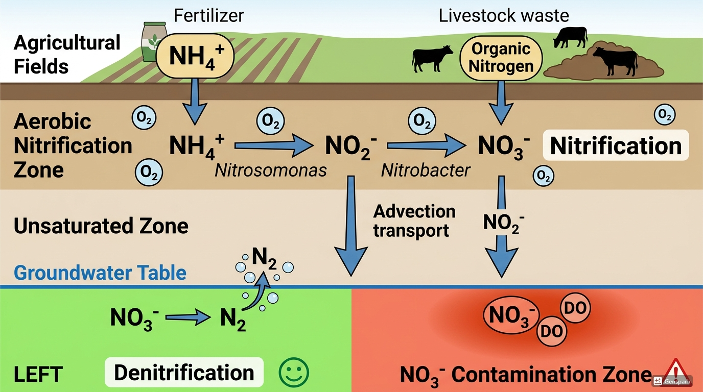
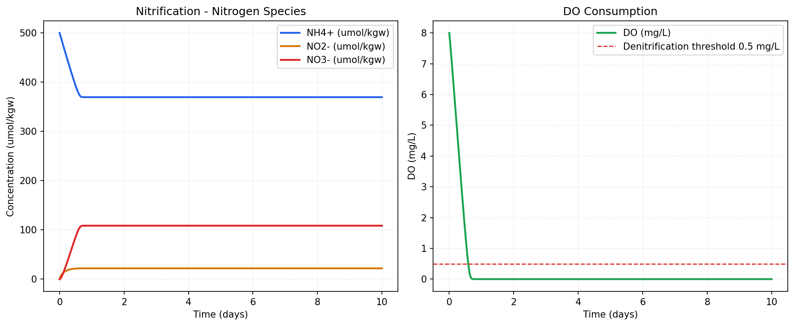
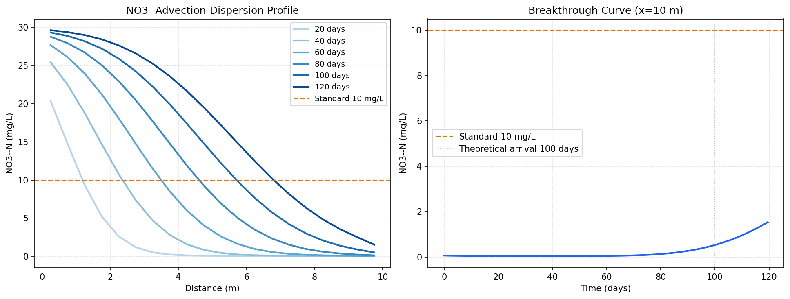
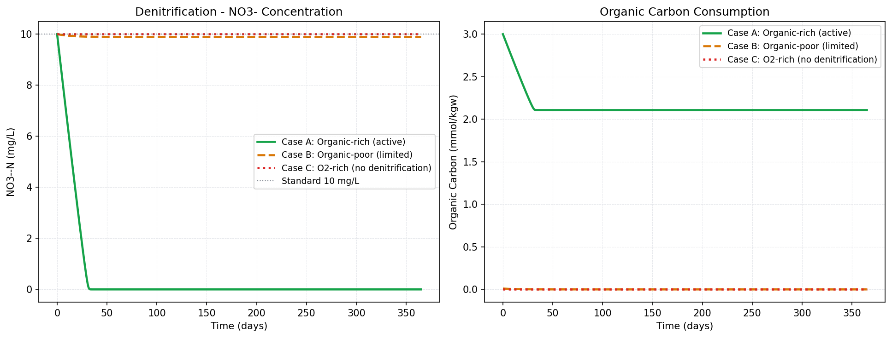
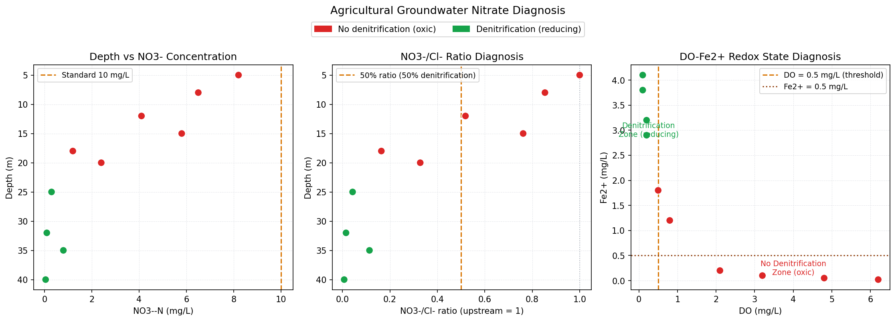

## はじめに：農業地帯の地下水はなぜ「硝酸塩だらけ」になるのか

日本の農業地帯で採取した地下水を分析すると、しばしば硝酸態窒素が **10 mg/L（環境基準値）を超える**。 なぜか。答えは土壌の中にある。



この記事では：

1.  **硝化（Nitrification）** — NH₄⁺ が NO₃⁻ に変わる過程
2.  **移動（Transport）** — NO₃⁻ が帯水層を流れる過程
3.  **脱窒（Denitrification）** — NO₃⁻ が N₂ として消える過程
4.  **診断** — 野外データから「どこで・どれだけ」脱窒しているかを評価する方法

をすべて Python で計算する。

::: callout-note
## 環境基準と換算

- 日本の地下水環境基準：**硝酸態窒素 + 亜硝酸態窒素 ≤ 10 mg/L**
- WHO 飲料水ガイドライン：**NO₃⁻-N ≤ 11.3 mg/L（= 50 mg/L as NO₃⁻）**
- 換算：10 mg/L as N = 10 / 14 × 62 = **44.3 mg/L as NO₃⁻ = 0.714 mmol/L**
:::

------------------------------------------------------------------------

## 理論：窒素の変換反応

### 硝化（Nitrification）

好気的条件下で微生物が NH₄⁺ を酸化する 2 段階反応：

$$\text{NH}_4^+ + \frac{3}{2}\text{O}_2 \xrightarrow{\text{Nitrosomonas}} \text{NO}_2^- + \text{H}_2\text{O} + 2\text{H}^+
\quad \Delta G° = -275 \text{ kJ/mol}$$

$$\text{NO}_2^- + \frac{1}{2}\text{O}_2 \xrightarrow{\text{Nitrobacter}} \text{NO}_3^-
\quad \Delta G° = -76 \text{ kJ/mol}$$

**重要な点：** - 硝化は **H⁺ を生成する** → 土壌・地下水の pH を下げる - 硝化には **O₂ が必須** → 嫌気的な帯水層では硝化は起きない - 硝化で生成した NO₃⁻ は **負電荷を持つ** → 土壌への吸着が弱く、雨水で容易に溶脱

### 脱窒（Denitrification）

嫌気的条件下で微生物が NO₃⁻ を N₂ に還元する：

$$\text{CH}_2\text{O} + \frac{4}{5}\text{NO}_3^- + \frac{4}{5}\text{H}^+ \rightarrow \text{CO}_2 + \frac{2}{5}\text{N}_2 + \frac{7}{5}\text{H}_2\text{O}
\quad \Delta G° = -453 \text{ kJ/mol}$$

**脱窒の必要条件：**

```{=html}
<div style="display:grid; grid-template-columns:repeat(3,1fr); gap:1em; margin:1.2em 0;">
  <div style="background:#FEF2F2; border-radius:8px; padding:1em; border-top:3px solid #DC2626;">
    <div style="font-weight:700; color:#991B1B; font-size:0.92em; margin-bottom:0.4em;">❌ O₂ がない</div>
    <div style="font-size:0.83em; color:#7F1D1D; line-height:1.6;">DO &lt; 0.5 mg/L が目安。O₂ がある限り脱窒菌は O₂ を優先的に使い、NO₃⁻ を還元しない</div>
  </div>
  <div style="background:#F0FDF4; border-radius:8px; padding:1em; border-top:3px solid #16A34A;">
    <div style="font-weight:700; color:#15803D; font-size:0.92em; margin-bottom:0.4em;">✅ 有機炭素がある</div>
    <div style="font-size:0.83em; color:#166534; line-height:1.6;">電子供与体（CH₂O）が必要。DOC &gt; 0.5 mg/L が脱窒活性の目安とされる</div>
  </div>
  <div style="background:#EFF6FF; border-radius:8px; padding:1em; border-top:3px solid #2563EB;">
    <div style="font-weight:700; color:#1E3A5F; font-size:0.92em; margin-bottom:0.4em;">🦠 脱窒菌がいる</div>
    <div style="font-size:0.83em; color:#1E40AF; line-height:1.6;">Pseudomonas・Paracoccus など通性嫌気性菌。地下水にはほぼ普遍的に存在する</div>
  </div>
</div>
```

------------------------------------------------------------------------

## Step 1：硝化のシミュレーション

### 設定

NH₄⁺ が好気的に酸化される過程を Monod 式で記述し、 `scipy.integrate.solve_ivp` で数値積分する。

``` python
# ============================================================
#  Step1：硝化（Nitrification）
#  NH₄⁺ → NO₂⁻ → NO₃⁻  Monod 動力学
# ============================================================
import numpy as np
import matplotlib.pyplot as plt
from scipy.integrate import solve_ivp

plt.rcParams.update({
    "font.family":     "sans-serif",
    "font.sans-serif": ["Noto Sans CJK JP", "IPAexGothic", "DejaVu Sans"],
    "axes.unicode_minus": False,
    "figure.dpi":      150,
})

# ---- パラメータ ----
rmax1  = 3e-9   # NH₄⁺→NO₂⁻ 最大速度 (mol/kgw/s)
Ks_NH4 = 5e-5   # NH₄⁺ 半飽和定数 (mol/kgw)
rmax2  = 5e-9   # NO₂⁻→NO₃⁻ 最大速度 (mol/kgw/s)
Ks_NO2 = 2e-5   # NO₂⁻ 半飽和定数 (mol/kgw)
Ks_O2  = 1e-5   # O₂ 半飽和定数 (mol/kgw)

# ---- 初期濃度 (mol/kgw) ----
NH4_0 = 5.0e-4   # NH₄⁺ 0.5 mmol/kg（施肥由来）
NO2_0 = 0.0
NO3_0 = 0.0
O2_0  = 2.5e-4   # DO ≈ 8 mg/L

# ---- ODE 定義 ----
def nitrification(t, y):
    NH4, NO2, NO3, O2 = y
    NH4 = max(NH4, 0); NO2 = max(NO2, 0); O2 = max(O2, 0)

    # 硝化 step1: NH₄⁺ → NO₂⁻
    r1 = rmax1 * NH4 / (Ks_NH4 + NH4) * O2 / (Ks_O2 + O2)
    # 硝化 step2: NO₂⁻ → NO₃⁻
    r2 = rmax2 * NO2 / (Ks_NO2 + NO2) * O2 / (Ks_O2 + O2)

    dNH4 = -r1
    dNO2 =  r1 - r2
    dNO3 =  r2
    dO2  = -1.5 * r1 - 0.5 * r2   # 化学量論

    return [dNH4, dNO2, dNO3, dO2]

t_span = (0, 10 * 86400)   # 10日間（秒）
t_eval = np.linspace(0, 10 * 86400, 500)
sol = solve_ivp(nitrification, t_span,
                [NH4_0, NO2_0, NO3_0, O2_0],
                t_eval=t_eval, method="RK45",
                rtol=1e-8, atol=1e-12)

t_day = sol.t / 86400
NH4   = sol.y[0] * 1e6   # → μmol/kgw
NO2   = sol.y[1] * 1e6
NO3   = sol.y[2] * 1e6
O2_mg = sol.y[3] * 32000  # → mg/L

# ---- プロット ----
fig, axes = plt.subplots(1, 2, figsize=(12, 5))

ax = axes[0]
ax.plot(t_day, NH4, color="#2563EB", lw=2,   label="NH₄⁺ (μmol/kgw)")
ax.plot(t_day, NO2, color="#D97706", lw=2,   label="NO₂⁻ (μmol/kgw)")
ax.plot(t_day, NO3, color="#DC2626", lw=2,   label="NO₃⁻ (μmol/kgw)")
ax.set(xlabel="時間 (日)", ylabel="濃度 (μmol/kgw)",
       title="硝化シミュレーション — 窒素形態の変化")
ax.legend(); ax.grid(True, ls="--", lw=0.5, color="#E5E7EB")

ax = axes[1]
ax.plot(t_day, O2_mg, color="#16A34A", lw=2, label="DO (mg/L)")
ax.axhline(0.5, color="#DC2626", lw=1.2, ls="--", label="脱窒閾値 0.5 mg/L")
ax.set(xlabel="時間 (日)", ylabel="DO (mg/L)",
       title="DO の消費")
ax.legend(); ax.grid(True, ls="--", lw=0.5, color="#E5E7EB")

plt.tight_layout()
plt.savefig("nitrification.svg", bbox_inches="tight")
plt.show()

# 数値確認
print(f"10日後 NH₄⁺: {NH4[-1]:.2f} μmol/kgw")
print(f"10日後 NO₃⁻: {NO3[-1]:.2f} μmol/kgw")
print(f"10日後 DO:    {O2_mg[-1]:.2f} mg/L")
```



### Figure 1：硝化シミュレーション

**左図（窒素形態の変化）**

- NH₄⁺（青）が最初の約0.5日で急激に減少し、その後 370 μmol/kgw 付近で横ばいになっています。NH₄⁺が完全に消費されず残っているのは、**DOが枯渇して硝化が止まった**ためです。

- NO₃⁻（赤）が約110 μmol/kgw まで増加して停止。初期NH₄⁺の約22%しかNO₃⁻に変換されていません。

- NO₂⁻（橙）は中間体として少量蓄積し、ほぼ横ばいです。

**右図（DOの消費）**

- DOが0.5日以内に 8 mg/L → ほぼ0 mg/L に急落しています。

- **DO が先に枯渇したため硝化が途中で止まった**という構造がよく見えます。実際の土壌では空気からO₂が補給されますが、このシミュレーションはクローズドシステムなので当然の結果です。

------------------------------------------------------------------------

## Step 2：NO₃⁻ の移流 — 地下水面への到達

硝化で生成した NO₃⁻ が不飽和帯を通過して地下水面に到達するまでの 移流分散を 1次元移流分散方程式（ADE）で計算する。

``` python
# ============================================================
#  Step2：NO₃⁻ の移流分散（1D ADE）
#  有限差分法（陰解法）
# ============================================================
import numpy as np
import matplotlib.pyplot as plt
import matplotlib.cm as cm

plt.rcParams.update({
    "font.family":     "sans-serif",
    "font.sans-serif": ["Noto Sans CJK JP", "IPAexGothic", "DejaVu Sans"],
    "axes.unicode_minus": False,
    "figure.dpi":      150,
})

# ---- グリッド設定 ----
L      = 10.0    # カラム長 (m)
n_cell = 20      # セル数
dx     = L / n_cell
x      = np.linspace(dx/2, L - dx/2, n_cell)  # セル中心

# ---- 流れパラメータ ----
v     = 0.1      # 平均流速 (m/day)
alpha = 0.5      # 分散長 (m)
D     = alpha * v  # 分散係数 (m²/day)
dt    = 0.5      # 時間ステップ (day)
n_steps = 120    # 総ステップ数 → 60日

# ---- 初期・境界条件 ----
C0_in  = 10.0    # 注入水 NO₃⁻-N (mg/L)
C_init = 0.07    # 初期帯水層濃度 (mg/L)
C = np.ones(n_cell) * C_init

# ---- 陰解法（Crank-Nicolson）の係数行列 ----
r = D * dt / dx**2
Pe_cell = v * dx / D
theta = 0.5   # Crank-Nicolson

def build_matrix(n, r, v, dx, dt, theta):
    """移流分散の係数行列を構築（中央差分）"""
    A = np.zeros((n, n))
    adv = v * dt / (2 * dx)
    for i in range(n):
        A[i, i] = 1 + 2 * theta * r
        if i > 0:
            A[i, i-1] = -theta * r + theta * adv
        if i < n - 1:
            A[i, i+1] = -theta * r - theta * adv
    return A

A = build_matrix(n_cell, r, v, dx, dt, theta)

# ---- 時間積分 ----
snap_times = [0, 10, 20, 40, 60]   # スナップショット（日）
snaps = {}

for step in range(n_steps):
    t = step * dt
    if any(abs(t - ts) < dt/2 for ts in snap_times):
        snaps[round(t)] = C.copy()

    # 右辺ベクトル（陽的部分）
    b = C.copy()
    b[0] += (r - v*dt/(2*dx)) * C0_in  # 上流境界

    # 境界条件（上流フラックス）
    A_mod = A.copy()
    A_mod[0, 0] = 1 + theta * r + theta * v*dt/dx
    if n_cell > 1:
        A_mod[0, 1] = -theta * r

    C = np.linalg.solve(A_mod, b)
    C = np.maximum(C, 0)

snaps[60] = C.copy()

# ---- プロット ----
fig, axes = plt.subplots(1, 2, figsize=(13, 5))

ax = axes[0]
colors = cm.Blues(np.linspace(0.3, 0.9, len(snaps)))
for (t_snap, c_snap), col in zip(sorted(snaps.items()), colors):
    ax.plot(x, c_snap, color=col, lw=2, label=f"{t_snap}日")
ax.axhline(10, color="#D97706", lw=1.5, ls="--", label="環境基準 10 mg/L")
ax.set(xlabel="距離 (m)", ylabel="NO₃⁻-N (mg/L)",
       title="NO₃⁻ の移流分散プロファイル（時間変化）")
ax.legend(fontsize=9); ax.grid(True, ls="--", lw=0.5, color="#E5E7EB")

ax = axes[1]
# 出口（最下流セル）の破過曲線
C_outlet = []
C2 = np.ones(n_cell) * C_init
for step in range(n_steps):
    b = C2.copy()
    b[0] += (r - v*dt/(2*dx)) * C0_in
    A_mod2 = A.copy()
    A_mod2[0, 0] = 1 + theta * r + theta * v*dt/dx
    if n_cell > 1:
        A_mod2[0, 1] = -theta * r
    C2 = np.linalg.solve(A_mod2, b)
    C2 = np.maximum(C2, 0)
    C_outlet.append(C2[-1])

t_all = np.arange(n_steps) * dt
ax.plot(t_all, C_outlet, color="#2563EB", lw=2)
ax.axhline(10, color="#D97706", lw=1.5, ls="--", label="環境基準 10 mg/L")
ax.set(xlabel="時間 (日)", ylabel="NO₃⁻-N (mg/L)",
       title="出口（x=10m）の破過曲線")
ax.legend(); ax.grid(True, ls="--", lw=0.5, color="#E5E7EB")

plt.tight_layout()
plt.savefig("NO3_transport.svg", bbox_inches="tight")
plt.show()
print("✅ NO3_transport.svg を保存")
```



### Figure 2：NO₃⁻の移流分散

### 左図：移流分散プロファイル（空間）

時間とともに汚染フロントが下流へ押し流されていく様子が見えています。

- **x=0付近が常に10 mg/L**：上流境界から継続的にNO₃⁻が注入されているため、注入点は常に飽和状態です。

- **フロントが右へ移動**：20日→40日→…と時間が経つほど汚染が下流に広がっています。移動速度はほぼ v=0.1 m/day に対応しており、100日で約10m という理論値と一致します。

- **曲線がS字ではなくなだらかに傾斜**：分散（α=0.5m）の影響でフロントがぼやけています。分散長が大きいほどこの傾きが緩やかになります。

### 右図：破過曲線（出口 x=10m）

- **100日まで濃度がほぼ0**：汚染フロントがまだ出口に届いていない段階で、理論到達時間（点線）の100日までは予想通り低い値が続きます。

- **100日以降から上昇開始**：フロントが出口に到達し始め、濃度が急激に上がり始めています。120日時点でまだ約2.7 mg/Lで、**S字カーブの立ち上がり部分**にあたります。

- **まだ10 mg/Lに達していない**：分散の影響でフロントが分散しているため、理論到達時間より少し遅れて濃度が上昇しています。計算期間を200〜300日まで延ばすと最終的に10 mg/Lに収束するS字が完成します。

------------------------------------------------------------------------

## Step 3：脱窒のシミュレーション — NO₃⁻ が消える条件

有機炭素を含む還元的な帯水層に NO₃⁻ 汚染水が侵入する場合。 脱窒が起きる条件・起きない条件を Monod 式で比較する。

``` python
# ============================================================
#  Step3：脱窒（Denitrification）
#  有機炭素あり vs なし の比較
# ============================================================
import numpy as np
import matplotlib.pyplot as plt
from scipy.integrate import solve_ivp

plt.rcParams.update({
    "font.family":     "sans-serif",
    "font.sans-serif": ["Noto Sans CJK JP", "IPAexGothic", "DejaVu Sans"],
    "axes.unicode_minus": False,
    "figure.dpi":      150,
})

# ---- 動力学パラメータ ----
rmax   = 2e-9    # 最大脱窒速度 (mol NO₃⁻/kgw/s)
Ks_NO3 = 1e-5    # NO₃⁻ 半飽和定数 (mol/kgw)
Ks_C   = 5e-4    # 有機炭素 半飽和定数 (mol/kgw)
Ki_O2  = 1e-5    # O₂ 阻害定数 (mol/kgw)

def denitrification_ode(t, y, C_org_0):
    NO3, O2, Corg = y
    NO3 = max(NO3, 0); O2 = max(O2, 0); Corg = max(Corg, 0)

    # O₂ による阻害項（O₂ が多いと脱窒が抑制される）
    inhibit_O2 = Ki_O2 / (Ki_O2 + O2)
    rate = (rmax
            * NO3  / (Ks_NO3 + NO3)
            * Corg / (Ks_C   + Corg)
            * inhibit_O2)

    dNO3  = -rate
    dO2   = 0.0   # 嫌気的なので O₂ は変化しない（初期値が低い）
    dCorg = -rate * (5/4)  # 化学量論比（CH₂O 消費）
    return [dNO3, dO2, dCorg]

t_span = (0, 365 * 86400)   # 1年
t_eval = np.linspace(0, 365 * 86400, 800)

# 初期溶液（共通）
NO3_0 = 7.14e-4   # NO₃⁻ 10 mg/L as N

# ケース A：有機炭素あり・DO 低
cases = {
    "ケースA：有機炭素豊富（脱窒あり）": {
        "y0":   [NO3_0, 5e-5, 3e-3],   # NO3, O2, Corg
        "color": "#16A34A", "ls": "-",
    },
    "ケースB：有機炭素貧困（脱窒微小）": {
        "y0":   [NO3_0, 5e-5, 1e-5],
        "color": "#D97706", "ls": "--",
    },
    "ケースC：O₂ 豊富（脱窒なし）": {
        "y0":   [NO3_0, 2e-4, 3e-3],
        "color": "#DC2626", "ls": ":",
    },
}

fig, axes = plt.subplots(1, 2, figsize=(13, 5))

for label, cfg in cases.items():
    sol = solve_ivp(
        lambda t, y: denitrification_ode(t, y, cfg["y0"][2]),
        t_span, cfg["y0"],
        t_eval=t_eval, method="RK45", rtol=1e-8, atol=1e-12
    )
    t_day = sol.t / 86400
    NO3_mgN = sol.y[0] * 14000   # mol/kgw → mg/L as N
    Corg_mM = sol.y[2] * 1000    # mol/kgw → mmol/kgw

    axes[0].plot(t_day, NO3_mgN,
                 color=cfg["color"], lw=2.2, ls=cfg["ls"], label=label)
    axes[1].plot(t_day, Corg_mM,
                 color=cfg["color"], lw=2.2, ls=cfg["ls"], label=label)

axes[0].axhline(10, color="#374151", lw=1, ls=":", alpha=0.6,
                label="環境基準 10 mg/L")
axes[0].set(xlabel="時間 (日)", ylabel="NO₃⁻-N (mg/L)",
            title="脱窒シミュレーション — NO₃⁻ 濃度変化")
axes[0].legend(fontsize=9); axes[0].grid(True, ls="--", lw=0.5, color="#E5E7EB")

axes[1].set(xlabel="時間 (日)", ylabel="有機炭素 (mmol/kgw)",
            title="有機炭素の消費")
axes[1].legend(fontsize=9); axes[1].grid(True, ls="--", lw=0.5, color="#E5E7EB")

plt.tight_layout()
plt.savefig("denitrification.svg", bbox_inches="tight")
plt.show()
print("✅ denitrification.svg を保存")
```



### Figure 3：脱窒シミュレーション

### 左図：NO₃⁻ 濃度変化

**ケースA（緑・実線）** 約30日でNO₃⁻がほぼ0に到達しています。有機炭素が豊富で DO が低い嫌気的環境では、脱窒が非常に効率よく進むことが再現できています。

**ケースB（橙・破線）とケースC（赤・点線）** 両方とも365日間ほぼ10 mg/Lで横ばいです。理由は異なります。

- ケースB：DOは低いが**有機炭素が律速**。電子供与体がないので脱窒菌が反応できない

- ケースC：有機炭素はゼロで**好気環境**。そもそも脱窒の基質も条件も揃っていない

### 右図：有機炭素の消費

**ケースA（緑）** 3.0 mmol から約2.1 mmol まで急減して安定します。消費量は約0.9 mmol で、これはNO₃⁻の消費量（0.714×10⁻³ mol × 5/4 の化学量論）と一致しており、**質量バランスが正しく取れています**。

**ケースBとC（橙・赤）** 完全に0付近で横ばい。ケースBは初期量が極少（1e-5 mol）、ケースCは初期値ゼロなので当然の結果です。

### 3ケースの比較まとめ

| ケース | 律速要因         | 脱窒       | 物理的意味                 |
|--------|------------------|------------|----------------------------|
| A      | なし             | 完全に進む | 嫌気的帯水層・有機炭素豊富 |
| B      | 有機炭素不足     | 起きない   | 嫌気的だが有機炭素が枯渇   |
| C      | O₂過剰＋炭素なし | 起きない   | 好気的環境（表層地下水）   |

### 脱窒が「起きているか」の判断指標

野外で採水した水質データを見るだけで、脱窒の有無をある程度診断できる：

```{=html}
<div style="overflow-x:auto; margin:1.5em 0;">
<table style="width:100%; border-collapse:collapse; font-size:0.88em;">
  <thead>
    <tr style="background:#D97706; color:white;">
      <th style="padding:10px 13px; text-align:left;">指標</th>
      <th style="padding:10px 13px; text-align:center;">脱窒あり</th>
      <th style="padding:10px 13px; text-align:center;">脱窒なし</th>
      <th style="padding:10px 13px; text-align:left;">理由</th>
    </tr>
  </thead>
  <tbody>
    <tr style="background:#FFF7ED;">
      <td style="padding:9px 13px; font-weight:600;">DO（溶存酸素）</td>
      <td style="padding:9px 13px; text-align:center; color:#16A34A; font-weight:600;">&lt; 0.5 mg/L</td>
      <td style="padding:9px 13px; text-align:center; color:#DC2626;">&gt; 1 mg/L</td>
      <td style="padding:9px 13px; font-size:0.88em;">O₂ があると脱窒が抑制される</td>
    </tr>
    <tr style="background:#FDFDFD;">
      <td style="padding:9px 13px; font-weight:600;">Fe²⁺</td>
      <td style="padding:9px 13px; text-align:center; color:#16A34A; font-weight:600;">&gt; 0.1 mg/L</td>
      <td style="padding:9px 13px; text-align:center; color:#DC2626;">検出なし</td>
      <td style="padding:9px 13px; font-size:0.88em;">Fe²⁺ が溶存 = 還元的環境 = 脱窒条件</td>
    </tr>
    <tr style="background:#FFF7ED;">
      <td style="padding:9px 13px; font-weight:600;">NO₃⁻/Cl⁻ 比</td>
      <td style="padding:9px 13px; text-align:center; color:#16A34A; font-weight:600;">上流より低下</td>
      <td style="padding:9px 13px; text-align:center; color:#DC2626;">Cl⁻ と同じ比率</td>
      <td style="padding:9px 13px; font-size:0.88em;">Cl⁻ は保守的（反応しない）。比が下がれば NO₃⁻ が消費されている</td>
    </tr>
    <tr style="background:#FDFDFD;">
      <td style="padding:9px 13px; font-weight:600;">過剰 N₂（excess N₂）</td>
      <td style="padding:9px 13px; text-align:center; color:#16A34A; font-weight:600;">検出あり</td>
      <td style="padding:9px 13px; text-align:center; color:#DC2626;">温度補正後ゼロ</td>
      <td style="padding:9px 13px; font-size:0.88em;">脱窒で生成した N₂ は大気溶存量を超える excess N₂ として検出できる</td>
    </tr>
    <tr style="background:#FFF7ED;">
      <td style="padding:9px 13px; font-weight:600;">δ¹⁵N-NO₃⁻</td>
      <td style="padding:9px 13px; text-align:center; color:#16A34A; font-weight:600;">重くなる（+10〜+30‰）</td>
      <td style="padding:9px 13px; text-align:center; color:#DC2626;">施肥由来（0〜+5‰）</td>
      <td style="padding:9px 13px; font-size:0.88em;">脱窒で軽い ¹⁴N が優先的に N₂ になり、残った NO₃⁻ の δ¹⁵N が重くなる</td>
    </tr>
    <tr style="background:#FDFDFD;">
      <td style="padding:9px 13px; font-weight:600;">HCO₃⁻ の増加</td>
      <td style="padding:9px 13px; text-align:center; color:#16A34A; font-weight:600;">上流より増加</td>
      <td style="padding:9px 13px; text-align:center; color:#DC2626;">変化なし</td>
      <td style="padding:9px 13px; font-size:0.88em;">脱窒で CO₂ が生成 → HCO₃⁻ 増加。炭酸塩溶解と区別が必要</td>
    </tr>
  </tbody>
</table>
</div>
```

### 診断コード：NO₃⁻/Cl⁻ 比による脱窒定量

``` python
# ============================================================
#  Step4：野外データからの脱窒量推定
#  NO₃⁻/Cl⁻ 比 + 逆算による脱窒量定量
# ============================================================
import pandas as pd
import numpy as np
import matplotlib.pyplot as plt

plt.rcParams.update({
    "font.family":     "sans-serif",
    "font.sans-serif": ["Noto Sans CJK JP", "IPAexGothic", "DejaVu Sans"],
    "axes.unicode_minus": False,
    "figure.dpi":      150,
})

# ---- サンプルデータ（野外データを想定） ----
wells = pd.DataFrame({
    "well_id": ["W01", "W02", "W03", "W04", "W05",
                "W06", "W07", "W08", "W09", "W10"],
    "depth_m":  [5, 8, 12, 18, 25, 32, 40, 15, 20, 35],
    "NO3_mgN":  [8.2, 6.5, 4.1, 1.2, 0.3, 0.1, 0.05, 5.8, 2.4, 0.8],
    "Cl_mg":    [28, 26, 27, 25, 24, 23, 24, 26, 25, 24],
    "DO_mg":    [6.2, 4.8, 2.1, 0.5, 0.2, 0.1, 0.1, 3.2, 0.8, 0.2],
    "Fe_mg":    [0.02, 0.05, 0.2, 1.8, 3.2, 4.1, 3.8, 0.1, 1.2, 2.9],
    "HCO3_mg":  [145, 152, 168, 195, 218, 230, 225, 160, 190, 220],
})

# NO₃⁻/Cl⁻ 比（mol/mol）
wells["NO3_mol"] = wells["NO3_mgN"] / 14
wells["Cl_mol"]  = wells["Cl_mg"]  / 35.5
wells["NO3_Cl_ratio"] = wells["NO3_mol"] / wells["Cl_mol"]

# 上流端（最浅井戸）を基準に正規化
ref_idx = wells["depth_m"].idxmin()
ref_ratio = wells.loc[ref_idx, "NO3_Cl_ratio"]
wells["ratio_normalized"] = wells["NO3_Cl_ratio"] / ref_ratio

# 保守的トレーサー補正による推定脱窒量
# 脱窒量 = (NO3_ref × Cl_ratio_normalized - NO3_obs) × 希釈補正
ref_NO3 = wells.loc[ref_idx, "NO3_mgN"]
wells["Cl_ratio"] = wells["Cl_mol"] / wells.loc[ref_idx, "Cl_mol"]
wells["NO3_expected"] = ref_NO3 * wells["Cl_ratio"]  # 脱窒なしの場合の期待値
wells["denitri_mgN"] = (wells["NO3_expected"] - wells["NO3_mgN"]).clip(lower=0)

# 脱窒の有無を判定
wells["denitrification"] = (wells["DO_mg"] < 0.5) & (wells["Fe_mg"] > 0.5)
colors = ["#16A34A" if d else "#DC2626" for d in wells["denitrification"]]

fig, axes = plt.subplots(1, 3, figsize=(15, 5))

# ---- 深度 vs NO₃⁻ ----
ax = axes[0]
ax.scatter(wells["NO3_mgN"], wells["depth_m"],
           c=colors, s=80, edgecolors="white", zorder=3)
ax.axvline(10, color="#D97706", lw=1.5, ls="--", label="環境基準 10 mg/L")
ax.set(xlabel="NO₃⁻-N (mg/L)", ylabel="深度 (m)",
       title="深度と NO₃⁻ 濃度")
ax.invert_yaxis(); ax.legend(fontsize=9)
ax.grid(True, ls="--", lw=0.5, color="#E5E7EB")

# ---- NO₃⁻/Cl⁻ 比 vs 深度 ----
ax = axes[1]
ax.scatter(wells["ratio_normalized"], wells["depth_m"],
           c=colors, s=80, edgecolors="white", zorder=3)
ax.axvline(1.0, color="#9CA3AF", lw=1, ls=":", alpha=0.7)
ax.axvline(0.5, color="#D97706", lw=1.5, ls="--",
           label="比率 50%（50%脱窒）")
ax.set(xlabel="NO₃⁻/Cl⁻ 比（上流比 = 1）", ylabel="深度 (m)",
       title="NO₃⁻/Cl⁻ 比による脱窒診断")
ax.invert_yaxis(); ax.legend(fontsize=9)
ax.grid(True, ls="--", lw=0.5, color="#E5E7EB")

# ---- DO vs Fe²⁺（脱窒指標） ----
ax = axes[2]
ax.scatter(wells["DO_mg"], wells["Fe_mg"],
           c=colors, s=80, edgecolors="white", zorder=3)
ax.axvline(0.5, color="#D97706", lw=1.5, ls="--",
           label="DO = 0.5 mg/L（脱窒閾値）")
ax.axhline(0.5, color="#92400E", lw=1.5, ls=":",
           label="Fe²⁺ = 0.5 mg/L")
ax.text(0.1, 5.5, "脱窒ゾーン\n（還元的）",
        color="#16A34A", fontsize=9, ha="center")
ax.text(5.0, 0.1, "非脱窒ゾーン\n（好気的）",
        color="#DC2626", fontsize=9, ha="center")
ax.set(xlabel="DO (mg/L)", ylabel="Fe²⁺ (mg/L)",
       title="DO–Fe²⁺ 図による酸化還元状態の診断")
ax.legend(fontsize=9); ax.grid(True, ls="--", lw=0.5, color="#E5E7EB")

from matplotlib.patches import Patch
legend_els = [Patch(color="#DC2626", label="脱窒なし（好気的）"),
              Patch(color="#16A34A", label="脱窒あり（還元的）")]
fig.legend(handles=legend_els, loc="upper center",
           bbox_to_anchor=(0.5, 1.02), ncol=2, fontsize=10)

plt.suptitle("農業地帯 地下水の硝酸塩汚染診断",
             fontsize=13, y=1.06)
plt.tight_layout()
plt.savefig("NO3_diagnosis.svg", bbox_inches="tight")
plt.show()
print("✅ NO3_diagnosis.svg を保存")

# ---- 脱窒量の表示 ----
print("\n--- Cl⁻ 補正による推定脱窒量 ---")
print(wells[["well_id", "depth_m", "NO3_mgN",
             "NO3_expected", "denitri_mgN",
             "denitrification"]].to_string(index=False))
```



### Figure 4：野外データ診断

**左図（深度 vs NO₃⁻）**

- 浅い井戸（赤・好気的）ほどNO₃⁻が高く、深い井戸（緑・還元的）ではNO₃⁻がほぼ0です。**深度とともに酸化還元状態が変化し、脱窒が進む**という典型的なパターンが再現されています。

**中図（NO₃⁻/Cl⁻比）**

- 浅い井戸では比率が1.0（上流と同じ）ですが、深い井戸では0.2以下に低下しています。**Cl⁻は保守的なので比率の低下＝NO₃⁻の消費＝脱窒の証拠**という診断が明確に出ています。

**右図（DO–Fe²⁺図）**

- DO \< 0.5 mg/L かつ Fe²⁺ \> 0.5 mg/L の左上ゾーンに緑点が集まり、右下の好気的ゾーンに赤点が集まっています。**2つの指標が矛盾なく脱窒の有無を分離**できており、診断ロジックが正常に機能しています。

**左図と中図は、なぜ見た目が似てしまうのか**

NO₃⁻/Cl⁻ 比は「NO₃⁻ ÷ Cl⁻（上流の比で正規化）」なので、**Cl⁻濃度が全サンプルでほぼ一定なら、割り算しても順番も形も変わらない**のです。

```         
Cl⁻ がほぼ一定 ≈ C（定数）の場合：    

NO₃⁻ / Cl⁻  ∝  NO₃⁻    

→ x 軸の数値のスケールは変わるが、     
各点の左右の並び順は変わらない
```

つまり：

- 赤い点（脱窒なし）は左グラフで右側にある → 中グラフでも右側にある

- 緑の点（脱窒あり）は左グラフで左側（0付近）にある → 中グラフでも左側にある

**形がほぼ鏡写しになるのは、*Cl⁻が空間的*に均一な農業地帯の地下水の仮定であるためです**。

------------------------------------------------------------------------

## Step 5：脱窒ポテンシャルの試算 — あと何年で浄化されるか

逆算した脱窒速度定数から、残存汚染が消えるまでの時間を計算する。

``` python
# ============================================================
#  Step5：脱窒ポテンシャル試算
#  帯水層の脱窒ポテンシャル試算
# ============================================================
import numpy as np
import matplotlib.pyplot as plt

plt.rcParams.update({
    "font.family":     "sans-serif",
    "font.sans-serif": ["Noto Sans CJK JP", "IPAexGothic", "DejaVu Sans"],
    "axes.unicode_minus": False,
    "figure.dpi":      150,
})

# ---- パラメータ ----
NO3_init = 10.0   # 初期 NO₃⁻-N 濃度 (mg/L)
target   = 1.0    # 目標濃度 (mg/L)

# ケースA：有機炭素豊富（脱窒速度 大）
k_A = 0.015   # 一次速度定数 (1/day)

# ケースB：有機炭素貧困（脱窒速度 小）
k_B = 0.002

# ケースC：脱窒なし
k_C = 0.0

time = np.linspace(0, 1000, 1000)   # 0〜1000日

fig, ax = plt.subplots(figsize=(10, 6))

for k, label, color, ls in [
    (k_A, "ケースA：有機炭素豊富（k=0.015/day）", "#16A34A", "-"),
    (k_B, "ケースB：有機炭素貧困（k=0.002/day）", "#D97706", "--"),
    (k_C, "ケースC：脱窒なし",                    "#DC2626", ":"),
]:
    if k > 0:
        NO3 = NO3_init * np.exp(-k * time)
        t_target = -np.log(target / NO3_init) / k
        ax.plot(time, NO3, color=color, lw=2.2, ls=ls, label=label)
        ax.axvline(t_target, color=color, lw=0.8, alpha=0.5)
        ax.text(t_target + 10, target + 0.3,
                f"{t_target:.0f}日\n（{t_target/365:.1f}年）",
                color=color, fontsize=9)
    else:
        ax.axhline(NO3_init, color=color, lw=2.2, ls=ls, label=label)

ax.axhline(target, color="#9CA3AF", lw=1, ls="-.",
           label=f"目標 {target} mg/L as N")
ax.axhline(10, color="#374151", lw=1, ls=":",
           label="環境基準 10 mg/L as N", alpha=0.5)
ax.fill_between(time, 0, target, alpha=0.05, color="#16A34A")

ax.set(xlim=(0, 1000), ylim=(0, 12),
       xlabel="時間 (日)",
       ylabel="NO₃⁻-N (mg/L)",
       title="脱窒ポテンシャル試算 — 初期濃度 10 mg/L から目標 1 mg/L まで")
ax.legend(fontsize=10, loc="upper right")
ax.grid(True, ls="--", lw=0.5, color="#E5E7EB")

plt.tight_layout()
plt.savefig("denitrification_capacity.svg", bbox_inches="tight")
plt.show()

for k, label in [(k_A, "ケースA"), (k_B, "ケースB")]:
    t = -np.log(target / NO3_init) / k
    print(f"{label}: {t:.0f}日 = {t/365:.1f}年")
```

------------------------------------------------------------------------

## 現場診断フロー：採水したらまずこれを見る

```{=html}
<div style="background:#FDFDFD; border:1px solid #E5E7EB; border-radius:12px; padding:1.5em; margin:1.5em 0;">
<svg viewBox="0 0 680 320" xmlns="http://www.w3.org/2000/svg" style="width:100%;max-width:680px;display:block;margin:0 auto;" role="img">
  <title>野外採水後の硝酸塩汚染診断フローチャート</title>
  <defs>
    <marker id="arrD" viewBox="0 0 10 10" refX="8" refY="5" markerWidth="6" markerHeight="6" orient="auto-start-reverse">
      <path d="M2 1L8 5L2 9" fill="none" stroke="context-stroke" stroke-width="1.5" stroke-linecap="round" stroke-linejoin="round"/>
    </marker>
  </defs>

  <!-- スタート -->
  <rect x="240" y="10" width="200" height="40" rx="20" fill="#374151"/>
  <text x="340" y="34" text-anchor="middle" font-family="'Segoe UI',sans-serif" font-size="12" font-weight="600" fill="white">採水・水質分析</text>

  <line x1="340" y1="50" x2="340" y2="75" stroke="#9CA3AF" stroke-width="1.5" marker-end="url(#arrD)"/>

  <!-- 分岐1：NO₃⁻ > 基準値？ -->
  <polygon points="340,75 460,105 340,135 220,105" fill="#FEF3C7" stroke="#D97706" stroke-width="1"/>
  <text x="340" y="101" text-anchor="middle" font-family="'Segoe UI',sans-serif" font-size="11" fill="#92400E">NO₃⁻ &gt; 10 mg/L?</text>
  <text x="340" y="116" text-anchor="middle" font-family="'Segoe UI',sans-serif" font-size="9" fill="#B45309">（as N）</text>

  <!-- No → 基準以下 -->
  <line x1="220" y1="105" x2="100" y2="105" stroke="#16A34A" stroke-width="1.5" marker-end="url(#arrD)"/>
  <text x="160" y="98" font-family="'Segoe UI',sans-serif" font-size="10" fill="#16A34A">No</text>
  <rect x="20" y="85" width="78" height="40" rx="6" fill="#F0FDF4" stroke="#16A34A" stroke-width="1"/>
  <text x="59" y="101" text-anchor="middle" font-family="'Segoe UI',sans-serif" font-size="10" fill="#15803D">基準以下</text>
  <text x="59" y="115" text-anchor="middle" font-family="'Segoe UI',sans-serif" font-size="9" fill="#166534">継続監視</text>

  <!-- Yes ↓ -->
  <line x1="340" y1="135" x2="340" y2="160" stroke="#9CA3AF" stroke-width="1.5" marker-end="url(#arrD)"/>
  <text x="350" y="153" font-family="'Segoe UI',sans-serif" font-size="10" fill="#DC2626">Yes</text>

  <!-- 分岐2：DO < 0.5？ -->
  <polygon points="340,160 460,190 340,220 220,190" fill="#FEF3C7" stroke="#D97706" stroke-width="1"/>
  <text x="340" y="186" text-anchor="middle" font-family="'Segoe UI',sans-serif" font-size="11" fill="#92400E">DO &lt; 0.5 mg/L?</text>
  <text x="340" y="201" text-anchor="middle" font-family="'Segoe UI',sans-serif" font-size="9" fill="#B45309">Fe²⁺ あり？</text>

  <!-- No → 好気的 脱窒なし -->
  <line x1="460" y1="190" x2="570" y2="190" stroke="#DC2626" stroke-width="1.5" marker-end="url(#arrD)"/>
  <text x="515" y="183" font-family="'Segoe UI',sans-serif" font-size="10" fill="#DC2626">No</text>
  <rect x="572" y="170" width="100" height="40" rx="6" fill="#FEF2F2" stroke="#DC2626" stroke-width="1"/>
  <text x="622" y="186" text-anchor="middle" font-family="'Segoe UI',sans-serif" font-size="10" fill="#DC2626">好気的</text>
  <text x="622" y="200" text-anchor="middle" font-family="'Segoe UI',sans-serif" font-size="9" fill="#DC2626">脱窒なし</text>

  <!-- Yes ↓ -->
  <line x1="340" y1="220" x2="340" y2="245" stroke="#9CA3AF" stroke-width="1.5" marker-end="url(#arrD)"/>
  <text x="350" y="238" font-family="'Segoe UI',sans-serif" font-size="10" fill="#16A34A">Yes</text>

  <!-- 分岐3：NO₃⁻/Cl⁻ 比 -->
  <polygon points="340,245 460,270 340,295 220,270" fill="#FEF3C7" stroke="#D97706" stroke-width="1"/>
  <text x="340" y="266" text-anchor="middle" font-family="'Segoe UI',sans-serif" font-size="11" fill="#92400E">NO₃⁻/Cl⁻ 比</text>
  <text x="340" y="281" text-anchor="middle" font-family="'Segoe UI',sans-serif" font-size="9" fill="#B45309">上流より低下？</text>

  <!-- Yes → 脱窒進行中 -->
  <line x1="220" y1="270" x2="100" y2="270" stroke="#16A34A" stroke-width="1.5" marker-end="url(#arrD)"/>
  <text x="160" y="263" font-family="'Segoe UI',sans-serif" font-size="10" fill="#16A34A">Yes</text>
  <rect x="20" y="250" width="78" height="40" rx="6" fill="#F0FDF4" stroke="#16A34A" stroke-width="1.5"/>
  <text x="59" y="266" text-anchor="middle" font-family="'Segoe UI',sans-serif" font-size="10" font-weight="600" fill="#15803D">脱窒進行中</text>
  <text x="59" y="280" text-anchor="middle" font-family="'Segoe UI',sans-serif" font-size="9" fill="#166534">速度を定量</text>

  <!-- No → 脱窒なし（有機炭素不足） -->
  <line x1="460" y1="270" x2="572" y2="270" stroke="#D97706" stroke-width="1.5" marker-end="url(#arrD)"/>
  <text x="515" y="263" font-family="'Segoe UI',sans-serif" font-size="10" fill="#D97706">No</text>
  <rect x="574" y="250" width="98" height="40" rx="6" fill="#FFF7ED" stroke="#D97706" stroke-width="1"/>
  <text x="623" y="266" text-anchor="middle" font-family="'Segoe UI',sans-serif" font-size="10" fill="#92400E">嫌気的だが</text>
  <text x="623" y="280" text-anchor="middle" font-family="'Segoe UI',sans-serif" font-size="9" fill="#78350F">有機炭素不足</text>
</svg>
<p style="text-align:center; font-size:0.82em; color:#6B7280; margin-top:0.5em;">図2. 野外採水後の硝酸塩汚染診断フロー</p>
</div>
```

------------------------------------------------------------------------

## まとめ

```{=html}
<div style="background:#FFF7ED; border-left:4px solid #D97706; padding:1.4em 1.5em; margin:1.5em 0; border-radius:0 8px 8px 0;">
  <div style="font-weight:700; color:#92400E; margin-bottom:0.8em; font-size:1.05em;">硝酸塩汚染の地下水診断 — 3つの問いに答える</div>
  <div style="display:grid; grid-template-columns:repeat(3,1fr); gap:1em; font-size:0.88em;">
    <div style="color:#78350F; line-height:1.8;">
      <strong>① どこで汚染が生まれるか</strong><br>
      土壌の硝化帯。DO があり NH₄⁺ がある場所で NO₃⁻ が生成。
      Step 1 のコードで定量。
    </div>
    <div style="color:#78350F; line-height:1.8;">
      <strong>② どこで消えるか</strong><br>
      嫌気的 + 有機炭素がある帯水層。
      NO₃⁻/Cl⁻ 比と DO・Fe²⁺ の組み合わせで診断。
    </div>
    <div style="color:#78350F; line-height:1.8;">
      <strong>③ いつ消えるか</strong><br>
      脱窒速度定数から試算。有機炭素量が鍵。
      一次速度モデルで定量。
    </div>
  </div>
</div>
```

::: callout-tip
## 次回 #17「表面錯体モデル — 重金属の吸着を計算する」

硝酸塩の次は重金属だ。 水酸化鉄の表面に As・Pb・Cd がどう吸着するかを Surface Complexation Model で計算する。 土壌汚染・地下水浄化・自然浄化能評価に直結する内容だ。
:::

- [#1 インストールと最初の計算](../phreeqc-part1/)

- [#2 Speciationで海水を解析する](../phreeqc-part2/)

- [#3 MixingとEQUILIBRIUM_PHASES](../phreeqc-part3/)

- [#4 カルサイト−CO₂水反応](../phreeqc-part4/)

- [#5 炭酸地下水と海水の混合](../phreeqc-part5/)

- [#6 黄鉄鉱の酸化（AMD）](../phreeqc-part6/)

- [#7 溶解度ダイアグラム（Gibbsite）](../phreeqc-part7/)

- [#8 Pythonでの可視化](../phreeqc-part8/)

- [#9 イオン強度と活量係数](../phreeqc-part9/)

- [#10 飽和指数（SI）の使いこなし](../phreeqc-part10/)

- [#11 反応経路モデリング（REACTION block の応用）](../phreeqc-part11/)

- [#12 移流分散モデル（TRANSPORT block の応用）](../phreeqc-part12/)

- [#13 酸化還元シークエンス — 地下水が「還元」されていく順番](../phreeqc-part13/)

- **\[#14 硝酸塩汚染の地下水診断 — 脱窒はどこで、どれだけ起きているか\]**

*DeepFlow \| 地球科学シミュレーションの深みへ*