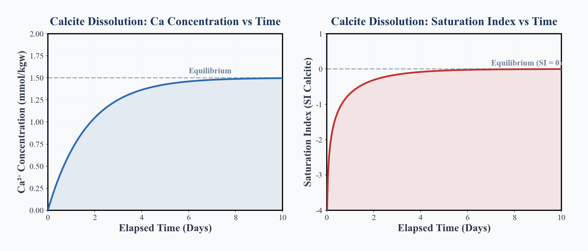
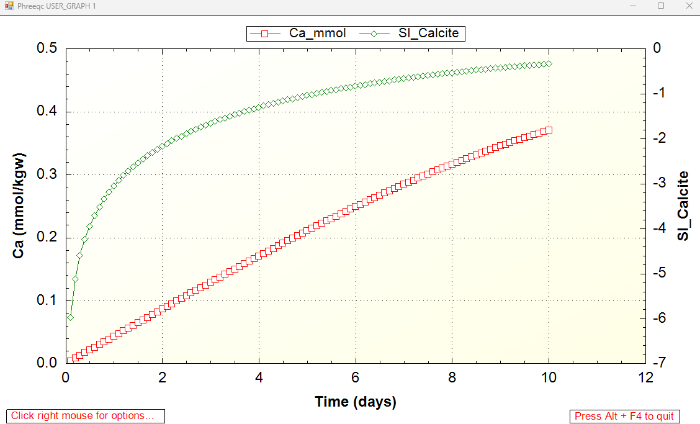

## Introduction: From Thermodynamics (Equilibrium) to Kinetics

In our series so far, we have always calculated the **"ultimate outcome (thermodynamic equilibrium)"**.
For example, calculations like "if we put Calcite in water, it will dissolve until the Saturation Index (SI) reaches 0". This applies to both **Forward Modeling** and **Inverse Modeling**, which predict or backtrack the destination reached after a sufficiently long time.

However, in actual groundwater environments, the element of **"Time"** is crucial.
It takes tens of thousands of years for limestone caves to form, and it takes time for pollutants dissolved in groundwater to be naturally remediated. **KINETICS** answers the question: **"We know what the final state will be, but exactly how long will it take to get there?"**

In this article, we will simulate the most basic and intuitive "Calcite dissolution speed" using the `KINETICS` and `RATES` blocks in PHREEQC.

---

## Basic Concept of Reaction Rates

The speed of chemical reactions varies depending on multiple factors (temperature, pH, surface area, etc.).
According to standard geochemistry textbooks such as [@appelo2005], the mineral dissolution rate is generally expressed in a formula like this:

$$ Rate = k \times \frac{A}{V} \times (1 - \Omega) $$

Here is the meaning of each symbol:

*   **Rate**: Dissolution speed (e.g., how many moles dissolve per 1 kg of water per second)
*   **$k$**: Reaction rate constant (an inherent speed determined by mineral type and temperature)
*   **$A/V$**: Specific surface area of the mineral in contact with water (similar to how fine powder dissolves faster than a solid chunk)
*   **$\Omega$**: Saturation Ratio (SR). $\Omega = 10^{\text{SI}}$. It is close to 0 if undersaturated, and becomes 1 at equilibrium (when it cannot dissolve anymore).

This formula essentially means: **"It dissolves vigorously at first (when $\Omega$ is near 0), but as it approaches saturation ($\Omega = 1$), the brakes are applied, and the dissolution speed drops to zero."**

---

## Implementation in PHREEQC: `RATES` and `KINETICS`

To calculate reaction rates in PHREEQC, we primarily use two blocks:
1.  **`RATES`**: Defines the "mathematical formula (rules)" for dissolution using BASIC language syntax.
2.  **`KINETICS`**: Specifies "which mineral" to react and over "how much time".

### 1. Defining the Formula in the RATES Block

First, we teach PHREEQC the formula introduced above. Inside the `RATES` block, we write the calculation steps line-by-line as a BASIC program.

```phreeqc
RATES
    Calcite_simple
        -start
        10 k = 1.0e-5        # Rate constant (mol/m2/s)
        20 area = 1.0        # Specific surface area (m2/kgw)
        30 # Calculate dissolution speed using Saturation Ratio (SR)
        40 rate = k * area * (1 - SR("Calcite"))
        50 # Calculate moles dissolved during this time step (TIME)
        60 moles = rate * TIME
        70 SAVE moles        # Pass the final dissolved amount to PHREEQC
        -end
```

`SR("Calcite")` is a built-in PHREEQC function that automatically calculates the current saturation ratio ($\Omega$) of Calcite. By passing the calculated moles via the `SAVE` command, the water chemistry is updated.

### 2. Specifying Time in the KINETICS Block

Next, we actually advance time using the rule defined above (`Calcite_simple`).

```phreeqc
KINETICS 1
    Calcite_simple
        -formula CaCO3  1.0 # Specify the elemental composition to dissolve
        -m0 1.0             # Initial amount of Calcite present (mol)
        -cvode true         # Numerical integration stabilization option
        -step_divide 100    # Internal step divisions for higher accuracy
        -steps 864000 in 10 steps # 864000 seconds (10 days) divided into 10 outputs
```

This simulates the change in water chemistry from Day 1, Day 2, up to Day 10 after placing Calcite into pure water.

---

## Simulation Results: Water Chemistry Changes Over Time

The figure below, graphed using Python, shows the changes in water chemistry ($\text{Ca}^{2+}$ concentration and Saturation Index) over time from the simulation described above.

{#fig-kinetics-calcite}

Looking at the left graph (blue line), the $\text{Ca}^{2+}$ concentration rises sharply at first, but as time passes, the curve gradually flattens out, asymptotically approaching the "equilibrium concentration."

The right graph (red line) shows the transition of the Saturation Index (SI_Calcite). It starts from a large negative value (highly undersaturated, dissolving easily) and gradually approaches zero (equilibrium state) as dissolution progresses. As SI approaches zero, the term `1 - SR` approaches zero, applying strong brakes to the dissolution process.

::: {.callout-note}
**【Meaning of the Visualization: A Conceptual Showcase】**
The figure above is a **"conceptual graph"** beautifully drawn in Python from a simple theoretical formula. It serves as a visual showcase to help you intuitively grasp the overall picture of how dissolution speed is "braked" as time passes.
:::

---

## Full Runnable PHREEQC Code: Experience a True Simulation

While the beautiful graph above was a "conceptual diagram" to help understand the theory, the following PHREEQC script is a **"rigorous geochemical simulation"**.
Behind the scenes, it accurately calculates not only the simple reaction equation but also complex thermodynamic models simultaneously, including changes in activity coefficients, pH fluctuations, and carbonate speciation (distribution into $\text{HCO}_3^-$ and $\text{CO}_3^{2-}$).

Below is the complete, runnable PHREEQC script that you can copy and paste to perform the simulation discussed in this article. We have also included PHREEQC's built-in `USER_GRAPH` feature, which automatically plots a basic graph upon execution.

```phreeqc
TITLE Calcite dissolution kinetics

# Initial State (Pure Water)
SOLUTION 1
    pH 7.0
    temp 25
    units mmol/kgw
    C(4) 0.0

# Open System (Constant CO2) to increase dissolution capacity
EQUILIBRIUM_PHASES 1
    CO2(g) -3.5 10.0

# Define the Reaction Rate Formula
RATES
    Calcite_simple
        -start
        10 k = 5.0e-10       # Make rate extremely small to visualize 10-day changes
        20 area = 1.0        # Specific surface area (m2/kgw)
        30 rate = k * area * (1 - SR("Calcite"))
        40 moles = rate * TIME
        50 SAVE moles
        -end

# Specify the Time Steps (10 Days)
KINETICS 1
    Calcite_simple
        -formula CaCO3  1.0
        -m0 1.0
        -cvode true
        -step_divide 100
        -steps 864000 in 100 steps

# Visualization with Built-in Graphing
USER_GRAPH 1
    -headings Time_days Ca_mmol SI_Calcite
    -axis_titles "Time (days)" "Ca (mmol/kgw)" "SI_Calcite"
    -start
    10 GRAPH_X TOTAL_TIME / 86400
    20 GRAPH_Y TOT("Ca") * 1000
    30 GRAPH_SY SI("Calcite")
    -end
END
```

### Actual Simulation Results (USER_GRAPH)

Executing the code above will automatically plot the following graph.



This graph is not just a simple mathematical conceptual curve; it is the result of rigorous thermodynamic calculations governed by geochemical laws, fully accounting for activity coefficients and pH fluctuations.

**【How to Read the Graph】**

1.  **Initial Rapid Dissolution (Days 0–2)**
    Immediately after the start, the slope of the curve is very steep. This indicates that the initial pure water is "highly undersaturated," rapidly dissolving the mineral like a dry sponge absorbing water.
2.  **Braking Effect by the Saturation Index (Green Line)**
    The green line (SI) starts near -6 (highly undersaturated) and gradually rises toward 0 (equilibrium) as dissolution progresses.
    As SI approaches 0, the Saturation Ratio (SR) approaches 1. This causes the `(1 - SR)` term in the rate equation to approach zero, applying strong brakes to the dissolution. This is exactly why the dissolution speed (the slope of the red line) becomes gentler in the latter half.

In this way, KINETICS allows us to perfectly reproduce the realistic geochemical process where "as the water becomes full of minerals (approaches equilibrium), a brake is applied, making it harder to dissolve."

---

## Preview for Next Time: Dissolving More Complex Minerals

This time, as our first step into KINETICS, we covered a very simple dissolution model for Calcite.
However, in actual groundwater environments, there are not only pure limestones but also complex silicate minerals like **Basalt** (containing feldspars and pyroxenes), which exhibit much more complex, incongruent dissolution patterns completely different from Calcite.

Next time (#17), we plan to further expand the concept of KINETICS and tackle the challenge of simulating the "complex process of Basalt dissolving into groundwater."

---

## References

::: {#refs}
:::
