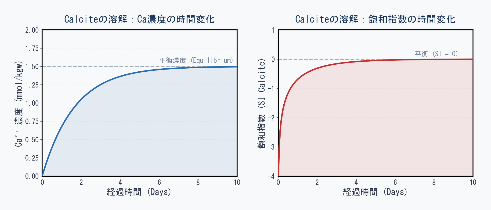

## はじめに：熱力学（平衡）から反応速度論（KINETICS）へ

これまでの連載では、常に**「最終的にどうなるか（熱力学的な平衡状態）」**を計算してきた。
たとえば、「水にCalcite（方解石）を入れると、飽和指数（SI）が0になるまで溶ける」といった計算である。これは**フォワードモデリング**や**インバースモデリング**でも同じであり、「十分に長い時間が経過した後の到達点」を予測・逆算するものであった。

しかし、実際の地下環境では**「時間」**という要素が極めて重要になる。
石灰岩の洞窟（鍾乳洞）が形成されるには数万年の歳月が必要であり、地下水に溶け込んだ汚染物質が自然浄化されるのにも時間がかかる。つまり、**「最終的にそうなることは分かっているが、それには一体どれくらいの時間がかかるのか？」**という問いに答えるのが、**反応速度論（KINETICS）**である。

今回は、PHREEQCの `KINETICS` および `RATES` ブロックを使い、最も基本的で分かりやすい「Calciteの溶解速度」をシミュレーションしてみよう。

---

## 反応速度（Rate）の基本的な考え方

化学反応の速度は、様々な要因（温度、pH、表面積など）によって変化する。
地球化学の標準的な教科書である [@appelo2005] によれば、鉱物の溶解速度（Rate）は一般的に次のような形の数式で表されることが多い。

$$ Rate = k \times \frac{A}{V} \times (1 - \Omega) $$

ここで、各記号の意味は以下の通りである。

*   **Rate**: 溶解速度（例えば、1秒間に水1kgあたり何mol溶けるか）
*   **$k$**: 反応速度定数（鉱物の種類や温度によって決まる固有の速度）
*   **$A/V$**: 水と接している鉱物の比表面積（細かく砕かれた粉末の方が早く溶けるのと同じ理由）
*   **$\Omega$**: 飽和度（Saturation Ratio: SR）。$\Omega = 10^{\text{SI}}$ であり、未飽和なら0に近く、平衡状態（これ以上溶けない状態）になれば1になる。

この式が意味しているのは、**「最初は勢いよく溶ける（$\Omega$が0に近い）が、飽和状態（$\Omega = 1$）に近づくにつれてブレーキがかかり、溶解速度がゼロになる」**ということである。

---

## PHREEQCでの実装：`RATES` と `KINETICS`

PHREEQCで反応速度を計算するには、大きく分けて2つのブロックを使用する。
1.  **`RATES`**: 溶解の「数式（ルール）」をBASIC言語の文法で定義する。
2.  **`KINETICS`**: 「どの鉱物」を、「何時間かけて」反応させるかを指定する。

### 1. RATESブロックでの数式の定義

まずは、上で紹介した式をPHREEQCに教え込む。PHREEQCの `RATES` ブロック内では、計算の手順を1行ずつBASICプログラムとして書く。

```phreeqc
RATES
    Calcite_simple
        -start
        10 k = 1.0e-5        # 反応速度定数 (mol/m2/s)
        20 area = 1.0        # 表面積 (m2/kgw)
        30 # 飽和度 (SR) を用いて溶解速度を計算
        40 rate = k * area * (1 - SR("Calcite"))
        50 # この時間ステップ(TIME)で溶けるモル数を計算
        60 moles = rate * TIME
        70 SAVE moles        # 最終的な溶出量をPHREEQCに渡す
        -end
```

`SR("Calcite")` は、その瞬間のCalciteの飽和度（$\Omega$）を自動で計算してくれるPHREEQCの組み込み関数である。`SAVE` コマンドで計算したモル数を渡すことで、水質が更新される。

### 2. KINETICSブロックでの時間指定

次に、上で定義したルール（`Calcite_simple`）を使って、実際に時間を進めてみる。

```phreeqc
KINETICS 1
    Calcite_simple
        -formula CaCO3  1.0 # 水に溶け出す構成元素を指定
        -m0 1.0             # 最初に存在するCalciteの量 (mol)
        -cvode true         # 数値積分の安定化オプション
        -step_divide 100    # 計算精度を上げるための内部ステップ分割
        -steps 864000 in 10 steps # 864000秒(10日間)を10回に分けて出力
```

これにより、純粋な水にCalciteを入れた後、1日目、2日目…と10日後までの水質の変化をシミュレーションすることができる。

---

## シミュレーション結果：時間の経過と水質変化

上記のシミュレーションを実行し、時間経過に伴う水質変化（$\text{Ca}^{2+}$ 濃度と飽和指数）をPythonでグラフ化したものが下図である。

{#fig-kinetics-calcite}

左のグラフ（青線）を見ると、最初は $\text{Ca}^{2+}$ 濃度が急激に上昇するが、時間が経つにつれて徐々にカーブがなだらかになり、最終的に「平衡濃度」へと漸近していく様子がわかる。

右のグラフ（赤線）は、飽和指数（SI_Calcite）の推移である。最初は大きなマイナス（極めて溶けやすい未飽和状態）からスタートするが、溶解が進むにつれて次第にゼロ（平衡状態）へと近づいていく。そしてSIがゼロに近づくほど、`1 - SR` の項がゼロに近づくため、溶解に強いブレーキがかかるのである。

::: {.callout-note}
**【図解の意味：概念のショーケース】**
上図は、KINETICSの振る舞いを直感的に理解していただくために、単純な理論式からPythonで美しく描画した**「概念図」**である。「時間が経つとどのように溶解スピードにブレーキがかかるのか」という全体像を視覚的に掴むためのショーケースとして機能している。
:::

---

## 実行可能な完全なPHREEQCコード：本物のシミュレーションを体験する

先ほどの美しいグラフは理論を理解するための「概念図」であったが、以下のPHREEQCスクリプトは**「本物の地球化学シミュレーション」**である。
裏側では単純な反応式だけでなく、活量係数の変化、pHの変動、炭酸系のスペシエーション（$\text{HCO}_3^-$ や $\text{CO}_3^{2-}$ への分配）といった複雑な熱力学モデルがすべて厳密に計算されている。

以下に、今回解説したシミュレーションをそのままコピー＆ペーストして実行できる完全なPHREEQCスクリプトを示す。PHREEQC内蔵の `USER_GRAPH` 機能も追加しており、実行すると自動的に簡易グラフが描画される。

```phreeqc
TITLE Calcite dissolution kinetics

# 初期状態（純水）
SOLUTION 1
    pH 7.0
    temp 25
    units mmol/kgw
    C(4) 0.0

# オープンシステム（CO2一定）にして溶解量を増やす
EQUILIBRIUM_PHASES 1
    CO2(g) -3.5 10.0

# 反応速度式の定義
RATES
    Calcite_simple
        -start
        10 k = 5.0e-10       # 反応速度を調整し、10日間で平衡に近づくようにする
        20 area = 1.0        # 表面積 (m2/kgw)
        30 rate = k * area * (1 - SR("Calcite"))
        40 moles = rate * TIME
        50 SAVE moles
        -end

# 時間ステップの指定（10日間）
KINETICS 1
    Calcite_simple
        -formula CaCO3  1.0
        -m0 1.0
        -cvode true
        -step_divide 100
        -steps 864000 in 100 steps

# 内蔵グラフ機能での可視化
USER_GRAPH 1
    -headings Time_days Ca_mmol SI_Calcite
    -axis_titles "Time (days)" "Ca (mmol/kgw)" "SI_Calcite"
    -start
    10 GRAPH_X TOTAL_TIME / 86400
    20 GRAPH_Y TOT("Ca") * 1000
    30 GRAPH_SY SI("Calcite")
    -end
END
```

### 実際のシミュレーション結果（USER_GRAPH）

上記のコードを実行すると、以下のようなグラフが自動的に描画される。


このグラフは、単なる数学的な概念曲線ではなく、活量係数やpHの変動など、地球化学の法則に則った厳密な熱力学計算の結果である。

**【グラフの読み解き方】**

1.  **初期の急激な溶解（0〜2日目）**
    スタート直後は曲線の傾きが非常に急になっている。これは初期の純水が「極めて未飽和」な状態であり、水が乾いたスポンジのようにどんどんミネラルを溶かしている状態を示している。
2.  **飽和指数（緑線）によるブレーキ効果**
    緑の線（SI）は、最初は -6 付近（極めて溶けやすい状態）からスタートし、溶解が進むにつれて徐々に 0（平衡）へ向かって上昇していく。
    SIが0に近づくということは、飽和比（SR）が1に近づくことを意味する。すると速度式の `(1 - SR)` の項がゼロに近づいていくため、強力なブレーキがかかる。これが、後半に行くにつれて赤線の溶解スピード（傾き）がなだらかになっていく理由である。

このようにKINETICSを使えば、「水がミネラルでお腹いっぱい（平衡）に近づくにつれて、徐々にブレーキがかかって溶けにくくなる」というリアルな地下水環境のプロセスを見事に再現することができる。

---

## 次回予告：より複雑な鉱物の溶解へ

今回はKINETICSの第一歩として、Calciteの非常にシンプルな溶解モデルを扱った。
しかし実際の地下環境では、純粋な石灰岩だけでなく、長石や輝石などを含む**玄武岩（Basalt）**のような複雑なケイ酸塩鉱物が存在し、それらはCalciteとは全く異なる、より複雑な溶け方（非調和溶解）をする。

次回（#17）は、このKINETICSの概念をさらに拡張し、「玄武岩が地下水に溶けていく複雑なプロセス」をシミュレーションする方法に挑む予定だ。

---

## 参考文献（References）

::: {#refs}
:::
