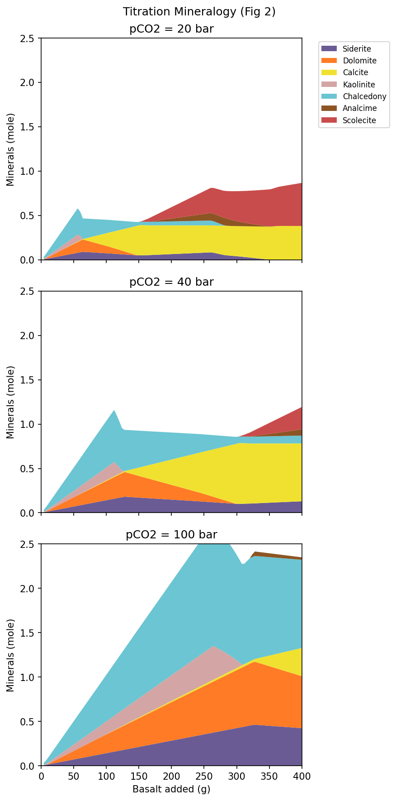
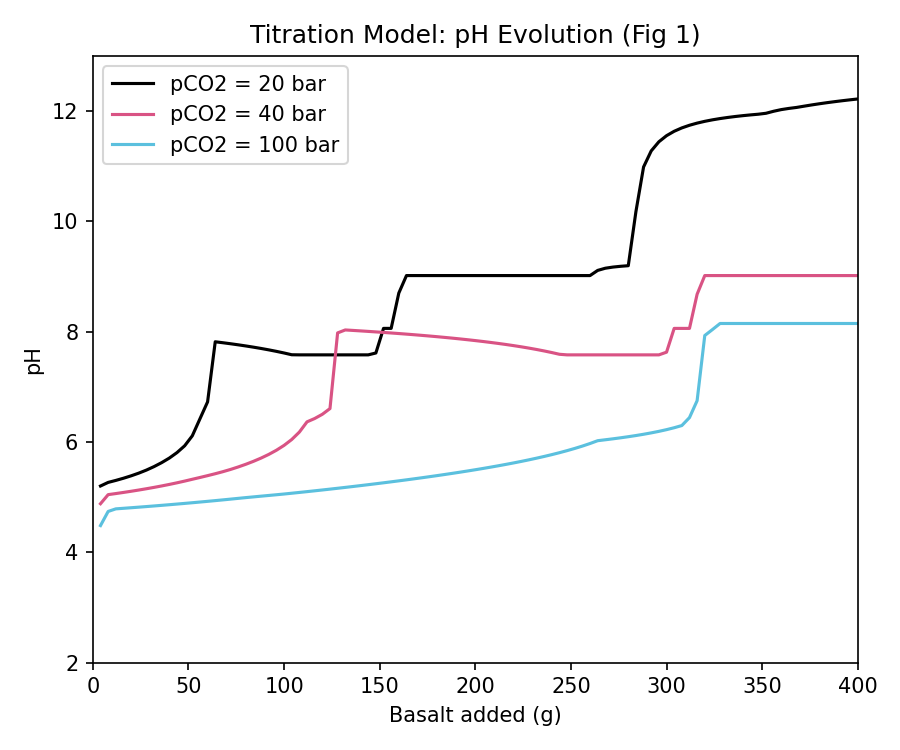
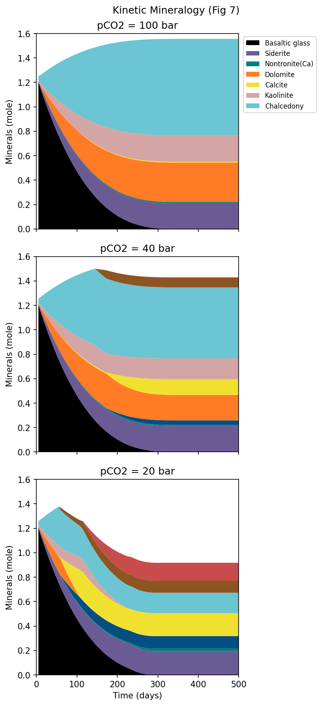
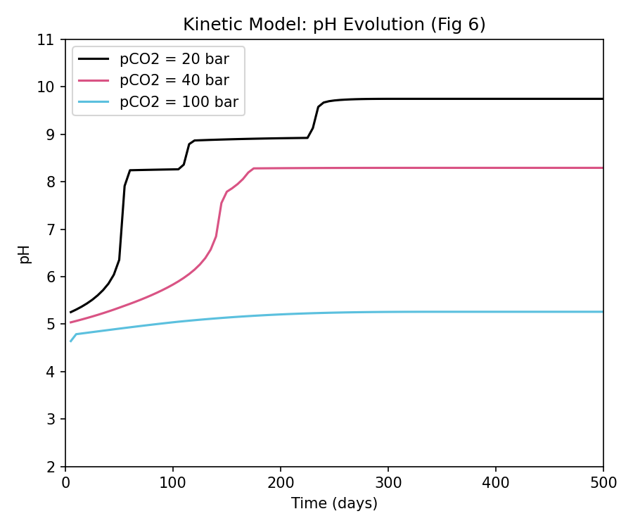

## Introduction: The Challenge of Basalt-CO2 Reactions

In the previous article (#16), we introduced the basics of reaction kinetics (KINETICS) by implementing a simple simulation of Calcite dissolution in pure water.
This time, we will take a significant step forward and try to **reproduce a complex simulation from a state-of-the-art research paper using PHREEQC**.

Our subject is the paper *"Numerical simulations of CO2 sequestration in basaltic rock formations"* by Gysi (2016).
This paper focuses on geologic CO2 sequestration in basalt, a technology actively being commercialized in places like Iceland (e.g., the CarbFix project). The research aims to understand the highly practical mechanism where acidic groundwater, resulting from dissolved CO2, dissolves basaltic rock and eventually combines with Ca, Mg, and Fe to permanently trap CO2 as **carbonate minerals (like Calcite)**.

In this reaction pathway, not only the targeted carbonate minerals but also **silicate minerals (such as zeolites and smectite clays)** precipitate in large quantities, creating "competition" for ions like calcium. The original paper used a powerful software called **GEMS (Gibbs Energy Minimization Software)** for this complex calculation. The question is: Can we reproduce this intricate geochemical reaction using **PHREEQC**, a simulation code much more familiar to hydrogeochemists?

---

## The Database Hurdle: Introducing Thermoddem

When building this complex simulation in PHREEQC, the first major hurdle was **"selecting the right thermodynamic database."**

### Why `llnl.dat` Didn't Work
Initially, we tried using `llnl.dat` (Lawrence Livermore National Laboratory), known for its extensive coverage of mineral data. However, we hit a wall because specific clay mineral end-members like Saponite and Nontronite—which play a critical role as competitors for CO2 fixation in the paper—were missing from `llnl.dat`.

### The Breakthrough with Thermoddem
The solution that broke this deadlock was the **[Thermoddem database](https://thermoddem.brgm.fr/databases/phreeqc)**, developed by the French Geological Survey (BRGM).
Thermoddem incorporates the latest thermodynamic measurement data and includes end-members like `Saponite(Ca)` and zeolites by default. By adopting this database, we no longer needed to manually calculate complex $\log K$ values. We could simulate the precipitation of complex secondary minerals, just like in the paper, simply by specifying the mineral names in PHREEQC's `EQUILIBRIUM_PHASES` block.

---

## Implementing the Titration Model

First, we create a model without the time element (Kinetics) to answer: "If we gradually dissolve basalt into water (Titration), what minerals will ultimately precipitate?"

### Open System vs. Closed System
In our initial testing, we mistakenly set the system as an "Open System" with CO2 gas as an infinite source in `EQUILIBRIUM_PHASES`. As a result, the pH did not rise as it did in the paper when basalt was dissolved.
Based on the paper's description, we needed to configure a **"Closed System where the water is initially saturated with CO2, and then the system is closed before dissolving the basalt."** In PHREEQC, this can be easily implemented using the `SAVE solution` and `USE solution` commands.

### PHREEQC Script (.pqi)
The actual code is shown below. Notice how we specify numerous smectite end-members from the Thermoddem database.

```phreeqc
DATABASE PHREEQC_ThermoddemV1.10_15Dec2020.dat

# 1. Define initial water quality (Vellankatla spring water)
SOLUTION 1 
    temp      50
    units     umol/kgw
    pH        7.0
    Si        256
    Na        269
    K         11.9
    Ca        71
    Mg        38
    Fe        0.16
    Al        1.09
    Cl        120

# 2. Saturate initial water at pCO2 = 20 bar
EQUILIBRIUM_PHASES 1
    CO2(g)    1.301  10.0   # log10(20) = 1.301

# 3. Save the saturated solution and close the system
SAVE solution 1
END

USE solution 1

# 4. List potential secondary minerals that might precipitate
EQUILIBRIUM_PHASES 2
    Chalcedony 0 0
    Kaolinite 0 0
    Calcite 0 0
    Dolomite 0 0
    Siderite 0 0
    Analcime 0 0
    Beidellite(Ca) 0 0
    Beidellite(K) 0 0
    Beidellite(Mg) 0 0
    Beidellite(Na) 0 0
    Nontronite(Ca) 0 0
    Nontronite(K) 0 0
    Nontronite(Mg) 0 0
    Nontronite(Na) 0 0
    Saponite(Ca) 0 0
    Saponite(FeCa) 0 0
    Saponite(FeK) 0 0
    Saponite(FeMg) 0 0
    Saponite(FeNa) 0 0
    Saponite(K) 0 0
    Saponite(Mg) 0 0
    Saponite(Na) 0 0
    Scolecite 0 0

# 5. Define basalt composition and add it in 100 steps (Titration)
REACTION 1 Basaltic Glass Titration
    K        0.008
    Na       0.08
    Ca       0.27
    Mg       0.26
    Fe       0.181
    Si       1.0
    Al       0.35
    O        3.286
    3.347 in 100 steps

SELECTED_OUTPUT
    -file gysi2016_titration_out.csv
    -reset false
    -reaction true
    -pH true
    -totals Ca Mg Fe Al Si C
    -equilibrium_phases Chalcedony Kaolinite Calcite Dolomite Siderite Analcime Beidellite(Ca) Beidellite(K) Beidellite(Mg) Beidellite(Na) Nontronite(Ca) Nontronite(K) Nontronite(Mg) Nontronite(Na) Saponite(Ca) Saponite(FeCa) Saponite(FeK) Saponite(FeMg) Saponite(FeNa) Saponite(K) Saponite(Mg) Saponite(Na) Scolecite

END
```

---

## Visualizing the Results: GEMS (Solid Solutions) vs. PHREEQC (Pure End-Members)

Below is the visualization of our calculation results (pCO2 = 20 bar) plotted as a "Stacked Area Plot" to match the format used in the original paper.

### Evolution of Precipitated Minerals in the Titration Model
{width=70% .lightbox}

### Evolution of pH and the "pH Jump"



::: {.callout-note}
**【A Beautiful Match】**
*   The overall sequence and balance of mineral formation—where pH rises in steps as basalt dissolves, and minerals stack from the bottom up: `Chalcedony` (light blue), `Kaolinite` (pink), `Calcite` (yellow), and smectites like `Saponite` (blues)—perfectly match the results in the paper!


:::

::: {.callout-warning}
**【The Difference: Why did the pH jump to 12 at the end?】**
In the paper's figures, even after adding a large amount of basalt in the final stages, a thick layer of `Chalcedony` (silica) remains, and the **pH is perfectly buffered around 9.8**.
However, in our PHREEQC model, red and brown **zeolites (like Scolecite) excessively precipitate** towards the end, consuming all the silica in the system. As a result, `Chalcedony` disappears, the silica buffer is destroyed, and the pH shoots up to 12.2.
:::


### Solid Solution Models vs. Pure End-Member Models
This clear difference stems from the fundamental distinction between the "complex **solid solution model**" used by GEMS and the "**pure end-member model**" we utilized in PHREEQC.
Natural minerals like zeolites and clays are solid solutions of mixed components. If you use the thermodynamic data of pure end-members directly (the default values in Thermoddem), they tend to be "too stable" and precipitate excessively. The original paper suppressed this excessive precipitation by employing a solid solution model, lowering their activities.

---


## Implementing the Kinetics Model

Following the titration model, we built a time-dependent Kinetics model. This simulates 'how long it takes for 150g of basalt to dissolve in groundwater'.

### PHREEQC Script (.pqi)

The script for the kinetic model is as follows. Using the RATES and KINETICS blocks learned in the previous article (#16), we implemented the dissolution rate equation for basaltic glass (from Gysi 2016).

```phreeqc
DATABASE PHREEQC_ThermoddemV1.10_15Dec2020.dat

SOLUTION 1 Initial water
    temp      50
    units     umol/kgw
    pH        7.0
    Si        256
    Na        269
    K         11.9
    Ca        71
    Mg        38
    Fe        0.16
    Al        1.09
    Cl        120

EQUILIBRIUM_PHASES 1
    CO2(g)    1.301  10.0

SAVE solution 1
END
USE solution 1

EQUILIBRIUM_PHASES 2
    Chalcedony    0.0  0.0
    Kaolinite     0.0  0.0
    Calcite       0.0  0.0
    Dolomite      0.0  0.0
    Siderite      0.0  0.0
    Analcime      0.0  0.0
    Scolecite     0.0  0.0
    Saponite(Ca)  0.0  0.0
    Saponite(Mg)  0.0  0.0
    Nontronite(Ca) 0.0 0.0

RATES
Basalt_Glass
-start
 10 A_factor = 10^-5.6
 20 Ea = 25.5
 30 R = 0.008314
 40 TempK = TK
 50 rate_const = A_factor * EXP(-Ea / (R * TempK))
 60 a_H = ACT("H+")
 70 a_Al = ACT("Al+3")
 80 IF (a_Al <= 0) THEN a_Al = 1e-20
 90 term = (a_H^3 / a_Al)^(1/3)
 100 specific_rate = rate_const * term
 110 m_init = PARM(1)
 120 s_init = PARM(2)
 130 m_curr = M
 140 IF (m_curr <= 0) THEN GOTO 200
 150 current_S = s_init * (m_curr / m_init)^(2/3)
 160 rate_mol = specific_rate * current_S
 170 moles = rate_mol * TIME
 180 SAVE moles
 190 END
 200 SAVE 0
-end

KINETICS 2
Basalt_Glass
    -formula  K 0.008 Na 0.08 Ca 0.27 Mg 0.26 Fe 0.181 Si 1.0 Al 0.35 O 3.286
    -m        1.255
    -m0       1.255
    -parms    1.255  37500
    -steps    43200000 in 100 steps

SELECTED_OUTPUT
    -file gysi2016_kinetics_out.csv
    -reset false
    -time true
    -pH true
    -totals Ca Mg Fe Al Si C
    -equilibrium_phases Chalcedony Kaolinite Calcite Dolomite Siderite Analcime Scolecite Saponite(Ca) Saponite(Mg) Nontronite(Ca)

END
```

::: {.callout-note}
**Note on "WARNING" Messages during Execution (Safe to Ignore)**

When you run the script above in PHREEQC on your local machine, you may see WARNING messages in the terminal or log file, such as:
`WARNING: Maximum iterations exceeded, 100`
`WARNING: Numerical method failed with this set of convergence parameters.`
`WARNING: Trying smaller step size, pe step size 10, 5 ... `

This is **not a calculation error and can be completely ignored**.
This message simply notifies you that during complex kinetic modeling (such as rapid pH changes), the computational algorithm temporarily failed to converge, so PHREEQC automatically reduced the step size to retry. Thanks to this feature, the calculation will proceed normally to the end, outputting the complete data.
:::

### Visualization and Comparison of the Kinetic Model

The results of the kinetic model (pCO2 = 20 bar) were visualized similarly. The black area represents the undissolved basaltic glass.

#### Evolution of Precipitated Minerals and Undissolved Basalt
{width=70% .lightbox}

::: {.callout-note}
**【A Beautiful Match: Reproducing Dissolution Rates】**
The timeframe over which the undissolved basaltic glass (the black area) **completely dissolves in about 150-200 days** matches the paper's figure perfectly. This confirms that the reaction rate equation we implemented using PHREEQC's BASIC language in the RATES block is functioning correctly.


:::

::: {.callout-warning}
**【The Difference: Zeolites Appear Again】**
In the paper's figure (20 bar), zeolites do not appear at all even after 500 days, Chalcedony remains, and the pH is stable around 8.5.
In contrast, in our PHREEQC model, red zeolites start precipitating after about 250 days. Just like the Titration model, this is due to the excessive stability of zeolites when using pure end-member models.
:::


## Sensitivity Analysis: Impact of CO2 Partial Pressure

Understanding this characteristic of "excessive precipitation due to end-member modeling," we performed a Sensitivity Analysis by varying the initial CO2 partial pressure to **20 bar, 40 bar, and 100 bar**. The pH evolution of the Kinetics model is shown below.



Here, the shift in the reaction pathway due to CO2 pressure—the most critical argument of the paper—is perfectly reproduced!
Under higher $pCO_2$ conditions (e.g., 100 bar), the concentration of dissolved carbon in the system is higher, making the solution more acidic. As a result, the **buffering zone shifts downward (to more acidic levels)**, meaning more basalt must be dissolved over a longer time to reach the same pH level. This aligns exactly with the theoretical expectations.

---

## Reproduction Guide for Readers

The simulation results and graphs presented in this article can be easily reproduced by processing PHREEQC output (CSV data) using Python. Below are the specific steps to do so.

### 1. Setting Up Sensitivity Analysis for CO2 Partial Pressure (pCO2)
To change the initial CO2 partial pressure, modify the `CO2(g)` value in the `EQUILIBRIUM_PHASES 1` block of the PHREEQC input script.
Since gas partial pressures in PHREEQC are specified as logarithms ($\log_{10} p$), the settings are as follows:

*   **For pCO2 = 20 bar:**
    ```phreeqc
    EQUILIBRIUM_PHASES 1
        CO2(g)    1.301  10.0   # log10(20) = 1.301
    ```
*   **For pCO2 = 40 bar:**
    ```phreeqc
    EQUILIBRIUM_PHASES 1
        CO2(g)    1.602  10.0   # log10(40) = 1.602
    ```
*   **For pCO2 = 100 bar:**
    ```phreeqc
    EQUILIBRIUM_PHASES 1
        CO2(g)    2.000  10.0   # log10(100) = 2.000
    ```

### 2. Exporting Calculation Results as CSV
To load the PHREEQC simulation results into Python, append the `SELECTED_OUTPUT` block at the end of the script to write a tab-delimited text file (with a `.csv` extension).

When performing sensitivity analysis, create and execute separate PQI scripts for each partial pressure condition (20 bar, 40 bar, and 100 bar), exporting them with unique CSV filenames.

*   **Output configuration for pCO2 = 20 bar**:
    ```phreeqc
    SELECTED_OUTPUT
        -file gysi2016_kinetics_out.csv
        -reset false
        -time true          # For Kinetics model only (use '-reaction true' for Titration)
        -pH true
        -totals Ca Mg Fe Al Si C
        -equilibrium_phases Chalcedony Kaolinite Calcite Dolomite Siderite Analcime Scolecite Saponite(Ca) Saponite(Mg) Nontronite(Ca)
    ```
*   **Output configuration for 40 bar and 100 bar**:
    Change the filename in the `-file` option to `gysi2016_kinetics_40bar_out.csv` and `gysi2016_kinetics_100bar_out.csv` respectively (apply similar naming like `gysi2016_titration_40bar_out.csv` for the titration model).

::: {.callout-tip}
## Column: Why does the PHREEQC CSV data turn into a "Stacked Area Plot"?

While the output CSV from PHREEQC records the absolute amounts of precipitated secondary minerals, **it does not directly record the amount of remaining, undissolved basalt.**
Using Python, we process and plot the data using the following steps:

1.  **Back-calculating the Remaining Basalt**
    By subtracting the "amount of Si dissolved in the aqueous solution" and the "amount of Si incorporated into secondary minerals (calculated from stoichiometric ratios)" from the initial total Si in the basaltic glass (1.255 mol), we **back-calculate the remaining basalt glass amount**.
2.  **Stacking Like Building Blocks (stackplot)**
    We stack these computed datasets sequentially from the bottom: "undissolved basalt (black)," followed by "Chalcedony (light blue)," "Kaolinite (pink)," and so forth, adding them up like building blocks to fill the areas.

This automation of chemical calculations and plotting is the key role of the Python script in data visualization.
:::

### 3. Python Plotting Script
The Python script below reads the exported tab-delimited CSV file, calculates the remaining basalt glass, and plots a Stacked Area Plot (similar to the paper) as well as the pH profile:

Note that the first part of the provided script is configured to draw a single stacked area plot based on the **20 bar (Kinetics model) CSV data**. To plot the stacked area charts for 40 bar or 100 bar, replace the file name in the first data loading section (`pd.read_csv('gysi2016_kinetics_out.csv', ...)`) with `gysi2016_kinetics_40bar_out.csv` or `gysi2016_kinetics_100bar_out.csv`, respectively.


::: {.callout-note}
## Python Libraries Required
Make sure you have `pandas`, `matplotlib`, and `numpy` installed before running the script.
:::

```python
import pandas as pd
import matplotlib.pyplot as plt
import numpy as np

# Define a color map that roughly matches the paper
color_map = {
    'Siderite': '#6b5b95',         # Purple
    'Dolomite': '#ff7b25',         # Orange
    'Calcite': '#f0e130',          # Yellow
    'Kaolinite': '#d4a5a5',        # Pinkish
    'Chalcedony': '#6bc5d2',       # Light Blue
    'Saponite(Ca)': '#034f84',     # Dark Blue
    'Saponite(Mg)': '#034f84',
    'Nontronite(Ca)': '#008080',   # Teal
    'Analcime': '#8d5524',         # Brown
    'Scolecite': '#c94c4c',        # Dark Red
}
order = ['Siderite', 'Nontronite(Ca)', 'Saponite(Ca)', 'Saponite(Mg)', 'Dolomite', 'Calcite', 'Kaolinite', 'Chalcedony', 'Analcime', 'Scolecite']

# 1. Load data (Example: Kinetics at 20 bar)
df = pd.read_csv('gysi2016_kinetics_out.csv', sep='\t', skipinitialspace=True)
df.columns = [c.strip() for c in df.columns] # Strip whitespaces from column headers
df['Time_days'] = df['time'] / 86400.0       # Convert seconds to days

# 2. Calculate remaining basaltic glass
# Multiply the stoichiometric factor of silica (Si) consumed by each secondary mineral
mineral_si = 0
if 'Chalcedony' in df.columns: mineral_si += df['Chalcedony'] * 1
if 'Kaolinite' in df.columns: mineral_si += df['Kaolinite'] * 2
if 'Analcime' in df.columns: mineral_si += df['Analcime'] * 2
if 'Scolecite' in df.columns: mineral_si += df['Scolecite'] * 3
if 'Saponite(Ca)' in df.columns: mineral_si += df['Saponite(Ca)'] * 3.67
if 'Saponite(Mg)' in df.columns: mineral_si += df['Saponite(Mg)'] * 3.67
if 'Nontronite(Ca)' in df.columns: mineral_si += df['Nontronite(Ca)'] * 3.67

# Calculate the remaining basalt glass from the initial 1.255 moles
remaining_basalt = np.maximum(1.255 - (df['Si'] + mineral_si), 0)

# 3. Create the Stacked Area Plot
plot_minerals = [m for m in order if m in df.columns and df[m].max() > 1e-4]
y_data = [remaining_basalt.values] + [df[m].values for m in plot_minerals]
labels = ['Basaltic glass'] + plot_minerals
c_list = ['#000000'] + [color_map.get(m, '#aaaaaa') for m in plot_minerals]

fig, ax = plt.subplots(figsize=(7, 5))
ax.stackplot(df['Time_days'], y_data, labels=labels, colors=c_list)
ax.set_xlim(0, 500)
ax.set_ylim(0, 1.6)
ax.set_xlabel('Time (days)')
ax.set_ylabel('Minerals (mole)')
ax.set_title('Basalt Dissolution and Secondary Minerals (pCO2 = 20 bar)')
ax.legend(loc='upper right', bbox_to_anchor=(1.35, 1.0))
plt.tight_layout()
plt.savefig('reproduced_kinetics.png', dpi=150, bbox_inches='tight')
plt.show()

# 4. Multi-plot for pH Sensitivity Analysis (Reproducing Fig. 6)
pcos = [20, 40, 100]
colors_pco = {20: 'black', 40: '#d95384', 100: '#5bc0de'}

fig, ax = plt.subplots(figsize=(6, 5))
for p in pcos:
    # Handle filename differences (where 20 bar doesn't have the suffix)
    filename = f"gysi2016_kinetics_out.csv" if p == 20 else f"gysi2016_kinetics_{p}bar_out.csv"
    try:
        df_p = pd.read_csv(filename, sep='\t', skipinitialspace=True)
        df_p.columns = [c.strip() for c in df_p.columns]
        time_days = df_p['time'] / 86400.0
        ax.plot(time_days, df_p['pH'], color=colors_pco[p], label=f'pCO2 = {p} bar')
    except FileNotFoundError:
        print(f"File {filename} not found.")

ax.set_xlabel('Time (days)')
ax.set_ylabel('pH')
ax.set_xlim(0, 500)
ax.set_ylim(2, 11)
ax.set_title('Kinetic Model: pH Evolution (Fig 6)')
ax.legend()
plt.tight_layout()
plt.savefig('reproduced_kinetic_ph.png', dpi=150)
plt.show()
```

---

## Conclusion

This challenge demonstrated that with the right database (Thermoddem) and a Closed System setup, PHREEQC is more than capable of simulating the overall big picture of complex basalt-CO2 reaction pathways from state-of-the-art literature.

Rather than artificially tweaking pure thermodynamic database values, acknowledging the inherent differences in modeling approaches (solid solutions vs. end-members) and interpreting the results scientifically is a sound and robust approach.
We hope this exercise reaffirmed the tremendous potential of PHREEQC to visualize the unseen world of subsurface environments.

---

## References

::: {#refs}
:::

<br>

::: {.callout-note appearance="simple"}
*Note: The PHREEQC input scripts and Python code presented in this article were generated and refined with the assistance of AI (Gemini 3.1 Pro).*
:::


