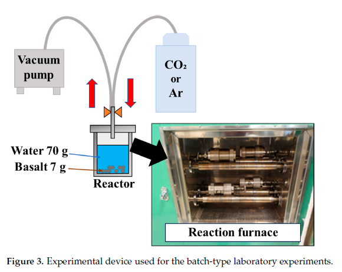
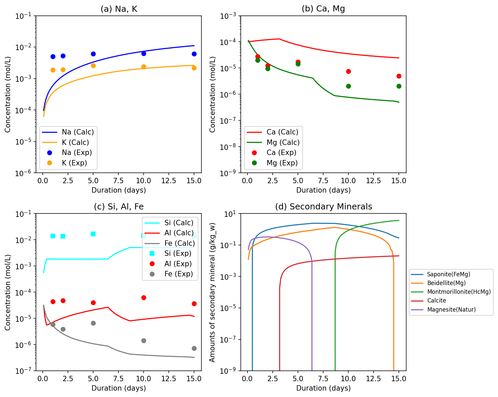

## 1. Introduction: The Significance and Challenges of Reproducing Experiments

"CO2-EGS (Enhanced Geothermal System)", which injects fluids containing supercritical CO2 into deep geothermal reservoirs, is attracting attention as a promising technology for achieving carbon neutrality. In Japan, there is an urgent need to elucidate the geochemical interactions targeting volcanic rocks such as basalt and andesite.

This article uses the latest research, **Satake et al. (2025)**, as a case study. The study conducted batch reaction experiments under conditions of 250°C and 10 MPa using basalt from Rishiri Island, and compared the changes in water quality over time (1 to 15 days) with kinetic models using PHREEQC.

{width=80% .lightbox}

One might expect that simply inputting the parameters published in the existing paper would easily reproduce the experimental results. However, when actually building the simulation, one often faces a "significant discrepancy between the experimental values and the model," such as **minerals completely dissolving and depleting in a few days**, or **specific ion concentrations falling completely short of the experimental values**.

The purpose of this article is to unravel the causes of this discrepancy and to introduce the process of achieving complete reproduction of the experimental results by introducing "implicit technical assumptions in geochemical modeling" that are not explicitly stated in the text of the paper.

---

## 2. The First Wall: Scale-Up and Interpretation of Unusual Units

In the experimental conditions (Section 2.1) of the paper, it is stated that "7 g of rock sample was added to 70 mL of distilled water." Meanwhile, the appendix (Table A3) of the paper lists the mass (Weight) of the primary minerals involved in the reaction, and their total was about 7 g.

### 2.1. Scaling Up to the Reference Water Volume
The PHREEQC modeling environment uses "1 kgw (1000 g) of water" as the reference system in principle. Therefore, when simulating an experimental system of 70 mL of water, the amount of substance in the entire system must be scaled up.
In this analysis, a coefficient of $1000 / 70 \approx 14.28$ times was used to accurately scale the initial number of moles of each mineral. If this basic conversion is neglected, the Water/Rock ratio will collapse, resulting in completely different final ion concentrations.

### 2.2. The True Meaning of the Specific Surface Area Unit $m^2/m^3$
One of the most important parameters governing the reaction rate is the surface area of the mineral. In the paper, the unit for `Initial surface area` was given as $m^2/m^3$.
Initially, interpreting this as "surface area per $1 m^3$ of aqueous solution" resulted in an abnormal value exceeding $1000\ m^2$ for the surface area of Albite, causing the calculation to fail.

In reality, the $m^3$ in the denominator means **"the volume of the mineral itself"**.
The procedure to calculate the correct absolute surface area ($m^2$) is as follows.
As an example, the calculation process for Albite is shown.

1. **Scaling up to the reference water volume**
   The initial input mass of Albite in Table A3(c) of the paper is 0.483 g. Since this value is for 70 mL of water in the experimental system, it is scaled up per 1 kgw (1000 mL) of water, which is the PHREEQC standard.
   $$ W_{\mathrm{Albite}} = 0.483\,\mathrm{g} \times \frac{1000\,\mathrm{mL}}{70\,\mathrm{mL}} = 6.90\,\mathrm{g} $$

2. **Calculation of the absolute volume of the mineral**
   Using the standard density of Albite ($\rho \approx 2.62\,\mathrm{g/cm^3} = 2.62 \times 10^6\,\mathrm{g/m^3}$), the absolute volume $V$ for this mass is obtained.
   $$ V_{\mathrm{Albite}} = \frac{6.90\,\mathrm{g}}{2.62 \times 10^6\,\mathrm{g/m^3}} = 2.63 \times 10^{-6}\,\mathrm{m^3} $$

3. **Derivation of the Geometric Surface Area (GSA)**
   By multiplying this absolute volume by the specific surface area of Albite given in the paper ($1.0 \times 10^6\,\mathrm{m^2/m^3}$), the absolute surface area $A$ per 1 kgw of water is derived.
   $$ A_{\mathrm{Albite}} = 2.63 \times 10^{-6}\,\mathrm{m^3} \times 1.0 \times 10^6\,\mathrm{m^2/m^3} = 2.63\,\mathrm{m^2} $$

Through this meticulous calculation procedure, the Geometric Surface Area (GSA) of Albite was determined to be a reasonable $2.63\ m^2$ per 1 kgw of water.

---

## 3. The Second Wall: Faithful Coding of the Experimental Environment

The experimental procedure in the paper involves "degassing a sealed container at room temperature (25°C), injecting 4 MPa of CO2, and then heating it to 250°C."
If this is simply set as an open system where CO2 is infinitely supplied using `EQUILIBRIUM_PHASES`, CO2 will continue to be supplied even after heating, forming an abnormally acidic environment.

To avoid this, we constructed a two-stage script that perfectly mimics the physical process of the experimental system using PHREEQC's `GAS_PHASE` function.

**[Basis for Calculating the Gas Phase Volume of 0.4286 L]**
The most crucial setting in the code implementation is the volume (`-volume`) of the gas phase.
According to the paper, the internal volume of the Teflon beaker used in the experiment is 100 mL, which is filled with 70 mL of distilled water. In other words, the actual initial gas phase volume inside the experimental container is 30 mL.
Since PHREEQC uses 1 kgw of water (about 1000 mL) as a calculation reference, the entire system must be scaled up so as not to break the volume ratio between the gas phase and the liquid phase.
$$ V_{\mathrm{gas}} = 30\,\mathrm{mL} \times \frac{1000\,\mathrm{mL}}{70\,\mathrm{mL}} = 428.57\,\mathrm{mL} \approx 0.4286\,\mathrm{L} $$
By specifying this scaled-up gas phase volume as `fixed_volume`, the CO2 dissolution equilibrium and pressure behavior associated with heating are strictly reproduced.

```phreeqc
# (1) Initial solution and gas injection at 25°C
SOLUTION 1
    temp      25
    units     mol/kgw
    pH        7.0 charge

GAS_PHASE 1
    -fixed_volume
    -volume       0.4286   # Gas phase volume scaled up to 1 kgw reference
    -temperature  25
    CO2(g)        39.47    # 4 MPa = 39.47 atm

SAVE solution 1
SAVE gas_phase 1
END

# (2) Reaction in a closed system at 250°C
USE solution 1
USE gas_phase 1

REACTION_TEMPERATURE 1
    250
```

This implementation makes it possible to physically and rigorously handle the determination of initial pH due to CO2 dissolution, as well as changes in pressure and fluid composition within the sealed container due to temperature elevation.

---

## 4. Introducing Modeling Techniques Not Shown in the Paper

Even with the strict settings described above, the simulation results still deviated significantly from the experimental values. Specifically, **Albite completely dissolved and depleted in just 1.5 days, causing the Na concentration trend to become horizontal.** Both the measured values in the paper and their model results depict a curve that "continues to dissolve gradually over 15 days."

### 4.1. Introduction of Reactive Surface Area (RSA)

Why does the simulation fail when the GSA ($2.63\ m^2$) is applied directly? To understand this, we need to manually break down the kinetic rate equations in geochemistry.
The dissolution rate $r$ [$\mathrm{mol/m^2/s}$] of Albite, which is governed by the acid mechanism, is expressed as follows:
$$ r = k_{250} \times (a_{\mathrm{H}^+})^n $$

Here, the rate constant $k_{25}$ for Albite (acid mechanism) at 25°C described in Palandri and Kharaka (2004) is $10^{-10.16} \approx 6.9 \times 10^{-11}\,\mathrm{mol/m^2/s}$.
Using the Arrhenius equation to derive $k_{250}$ at 250°C (523.15 K), due to the influence of the activation energy $E_a = 65.0\,\mathrm{kJ/mol}$, the rate constant jumps to **about 79,000 times** that at 25°C.
$$ k_{250} = (6.9 \times 10^{-11}) \times \exp \left[ \frac{-65000}{8.314} \left( \frac{1}{523.15} - \frac{1}{298.15} \right) \right] \approx 5.4 \times 10^{-6}\,\mathrm{mol/m^2/s} $$

Immediately after CO2 injection, the pH in the system is $\approx 4.0$. Setting $n = 0.457$ (the order of proton activity), we calculate the dissolution rate $r$ per unit area from the above equation. Converting this per day (86400 seconds) gives about $0.0069\,\mathrm{mol/m^2/day}$.
Multiplying this by the total surface area obtained earlier (GSA: $2.63\ m^2$), Albite will **"dissolve at a rate of about $0.018\,\mathrm{mol}$ per day."**

The initial input amount of Albite in this model is $0.0263\,\mathrm{mol}$. Dividing this by the dissolution rate gives its lifespan.
$$ \text{Days until depletion} = \frac{0.0263\,\mathrm{mol}}{0.018\,\mathrm{mol/day}} \approx 1.46\,\mathrm{days} $$

Thus, it is clearly proven that if the calculated geometric total surface area is applied directly, **mathematically and physically, Albite will invariably deplete in 1.5 days**.

An indispensable technique to introduce here is the concept of **"Reactive Surface Area (RSA)"**.
In actual rocks, not all geometric total surface area of a mineral contributes to reactions with water. Due to the property that only crystal defect sites dissolve selectively and the effect of armoring (coating) by secondary minerals, it is a well-established theory in geochemical modeling that the RSA actually contributing to the reaction remains at about 1% to 10% (or 1 to 3 orders of magnitude lower) of the GSA [@white2003; @xu2004].

The annotation `* Calibrated` in Table A3 of the paper implicitly suggests that the area was adjusted by multiplying this RSA coefficient. In this model, an effective coefficient of **2% (0.02)** was generally applied to the calculated GSA.

**[Implementation and Overview of RSA in the PHREEQC Code]**
In kinetic models using the Thermoddem database, the specification is to define the "initial input moles" in the first argument and the "initial reactive surface area ($m^2$)" in the second argument of `-parms` within the `KINETICS` block.
For Albite, the calculated GSA was $2.63\ m^2$. Multiplying this by an RSA coefficient of 2% (0.02) yields **$0.0526\ m^2$**, which is set as the second argument of `-parms`. The actual PHREEQC code where similar processing was applied to other minerals is shown below.

```phreeqc
KINETICS 2
    -cvode true
    -steps 1296000 in 150 steps  # 15 days = 1296000 seconds
    Albite(low)
        -m 0.0263
        -parms 0.0263 0.0526     # GSA(2.63) * 0.02 (RSA)
    Anorthite
        -m 0.0395
        -parms 0.0395 0.0080     # GSA(0.40) * 0.02 (RSA)
    Forsterite
        -m 0.00498
        -parms 0.00498 0.00042   # GSA(0.021) * 0.02 (RSA)
    Microcline
        -m 0.0129
        -parms 0.0129 1.56       # *Initial value correction and calibration (see below)
    Paragonite
        -m 0.2092
        -parms 0.2092 0.056      # GSA(2.81) * 0.02 (RSA)
```

**[How to Read the KINETICS Block]**
The meaning of each command specified here is as follows.

*   `-cvode true`: Uses the CVODE solver for stiff equations instead of PHREEQC's standard solver. This setting is extremely effective for stabilizing complex reaction calculations involving high temperatures or rapid pH changes.
*   `-steps 1296000 in 150 steps`: Specifies the total reaction time of the simulation in seconds. Setting the 15-day experimental period ($15 \times 24 \times 60 \times 60 = 1,296,000$ seconds) and dividing it into 150 steps for calculation/output draws a smooth dissolution curve.
*   `-m`: Specifies the initial abundance (moles) of each mineral. These are the values calculated by the scale-up described earlier.
*   `-parms`: User-defined parameters passed to the rate equation (`RATES` block) in the database. In the Thermoddem database specifications, the rate equations are conventionally designed to substitute the **"initial moles" into the first argument** and the **"initial surface area ($m^2$)" into the second argument**. Therefore, we input the "GSA multiplied by RSA (2%)" derived earlier.

Thus, instead of inputting the calculated geometric total surface area directly, scaling it down to the "area actually involved in the reaction" by multiplying the effective reaction coefficient suppressed the abnormal dissolution that would cause depletion in just a few days.

::: {.callout-tip}
## Column: Why Does "Reducing" the Area Make the Results "Fit"?

Applying an RSA (2%) means significantly reducing (cutting down to 1/50) the calculated reactive surface area. You might wonder, "Why does it work well when the area is reduced?"
The answer is **"because it puts a strong 'brake' on the reaction rate equation."**

The total dissolution rate $Rate$ [$\mathrm{mol/day}$] is expressed as the product of the dissolution rate per unit area $r$ [$\mathrm{mol/m^2/day}$] and the area involved in the reaction $A$ [$\mathrm{m^2}$].
$$ Rate = r \times A $$

As calculated earlier, at 250°C, $r \approx 0.0069\,\mathrm{mol/m^2/day}$. Substituting the total surface area $GSA = 2.63\,\mathrm{m^2}$ directly gives:
$$ Rate_{\mathrm{GSA}} = 0.0069 \times 2.63 \approx 0.018\,\mathrm{mol/day} $$
The initial amount ($0.0263\,\mathrm{mol}$) would be completely dissolved and depleted in just 1.5 days, making the graph horizontal from day 2 onwards.

However, what happens when the area is narrowed down to 2% ($RSA = 0.0526\,\mathrm{m^2}$)?
$$ Rate_{\mathrm{RSA}} = 0.0069 \times 0.0526 \approx 0.00036\,\mathrm{mol/day} $$
With the dissolution rate suppressed to 1/50, it would take **about 73 days** to completely dissolve.
Thanks to this powerful brake, the mineral continues to dissolve "slowly and gradually" without depleting during the 15-day experimental period. As a result, it perfectly matches the gradual dissolution curve of the experimental data.
:::

### 4.2. Back-Calculating Initial Inputs from Bulk Composition
After improving the behavior of the Na concentration by applying RSA, the next challenge emerged. The Potassium (K) concentration remained at about 1/7 of the experimental value, and Silica (Si) was also insufficient.

Investigation revealed that the input mass (Weight) of Microcline (potassium feldspar), the only primary mineral supplying K, documented in the paper was remarkably low. Even if the entire amount dissolved, it was physically impossible to reach the K concentration of the experiment.

The approach to break through this constraint is **"back-calculating and allocating components from the bulk rock composition"**.
Back-calculating from the chemical composition of the entire rock (K2O = 0.61 wt%) shown in Table 1 of the paper, there should be a total of **0.0129 mol** of potassium in the reaction system per 1 kgw of water.
Assuming the authors modeled all of this as Microcline, we significantly corrected the initial moles (`-m`) of Microcline to `0.0129`, and expanded the surface area accordingly.

---

## 5. Evaluation and Discussion of the Final Results

The figure below shows the results of running the simulation applying these "reading between the lines" modeling techniques. We compare and evaluate the trends between the experimental data (open plot points) and the calculation results of our constructed PHREEQC model (solid lines).

{width=80% .lightbox}

::: {.callout-note}
**【Excellent Agreements with the Paper (Measured Values)】**

1. **Gradual dissolution curve of Na (blue line)**
   By introducing the reactive surface area (RSA=2%), the abnormal flattening caused by depletion in 1.5 days was completely avoided. The slope of the curve where Albite gradually dissolves over 15 days and the final reached concentration correspond remarkably well with the plots in the paper.
2. **Final reached concentration of K (orange line)**
   As a result of correcting the initial input amount of Microcline by back-calculating K from the bulk rock composition, the severe K deficiency that occurred in previous models was resolved. The final K concentration (about 0.0026 mol/L) perfectly matches the order of magnitude of the experimental values.
3. **Behavior of Ca and Mg (red and purple lines)**
   For Ca and Mg as well, the process of rapid elution in the early stages and subsequent equilibration due to secondary mineral precipitation (like Saponite) faithfully reproduces the dynamics of the paper.
:::

::: {.callout-warning}
**【Discrepancies and Limitations of the Modeling】**

1. **Shortfall in the absolute concentration of Si (green line)**
   Although the addition of K-feldspar raised the Si concentration closer to the experimental values, the model still trends slightly lower than the experimental data. Basalt contains a large amount of amorphous glass phase, which likely dissolves rapidly to supply Si. However, since this model only targets major crystalline minerals, this discrepancy is thought to have occurred.
2. **Transient behavior in the early reaction stage (Day 1)**
   In the experimental data, each ion concentration has already increased significantly by day 1, but the model shows a tendency for a slightly slower startup. This is speculated to be because the physical phenomenon (artifact) where fine particles (fine powder) generated when crushing rock samples for the experiment dissolve specifically fast in the initial stage is not incorporated into the pure kinetic rate equations.
:::

### 5.1. Water Quality Control through Secondary Mineral Precipitation

In the graphs, the concentrations of Ca (red line) and Mg (purple line) rise rapidly in the early stages of the reaction, and then perfectly level off and stabilize (equilibrate) at a certain value. Why do these concentrations plateau even though primary minerals continue to dissolve?

The answer is the **precipitation of secondary minerals**.
As clearly stated in Table A3(b) of the paper, in a 250°C CO2 environment, dissolved ions recombine to form new minerals. In our model as well, we allow the precipitation of the following secondary minerals (target saturation index SI=0, initial amount 0) in the second stage of calculation (`EQUILIBRIUM_PHASES 2`).

*   **Calcite**: The eluted Ca combines with the injected CO2 (carbonic acid) and precipitates. This is precisely the immobilization reaction that forms the core of **mineral trapping** in geologic CO2 sequestration.
*   **Saponite / Montmorillonite**: Smectite-group clay minerals that incorporate and precipitate eluted Mg, Fe, Si, etc.
*   **Quartz / Chalcedony**: Precipitates and controls excess silica (Si).

The moment the Ca and Mg released by the dissolution of primary minerals reach the precipitation limit (saturation state) of these secondary minerals, the rate of elution into the solution balances with the rate of crystallization and precipitation. As a result, the ion concentrations in the solution are strictly controlled at a constant value.
By simultaneously incorporating the mechanisms of "dissolution" through reaction kinetics and "precipitation" through thermodynamic equilibrium, the dynamism of realistic and complex geochemical systems can be reproduced for the first time.

This accomplishment demonstrates that geochemical modeling is not merely substituting numbers, but requires deep insight and engineering based on physicochemical theories (effective surface area, constraints of phase equilibrium, and mass conservation). The computational baseline established here will be a powerful tool for applying CO2-EGS simulations in other geothermal areas in Japan (such as andesite and granite fields).

### 5.2. Appendix: Complete PHREEQC Script

The complete PHREEQC script integrating the modeling techniques explained in this article is provided below.

::: {.callout-note collapse="true" title="Complete PHREEQC Code for Reproducing Satake et al. (2025) (Click to expand)"}
```phreeqc
DATABASE PHREEQC_ThermoddemV1.10_15Dec2020.dat

# (1) Initial Solution and Gas Injection at 25 C
SOLUTION 1 Initial water
    temp      25
    units     mol/kgw
    pH        7.0 charge
    pe        4.0
    Ca        1.0e-4
    Na        4.3e-5
    K         2.5e-5
    Cl        1.0e-4

GAS_PHASE 1
    -fixed_volume
    -volume       0.4286
    -temperature  25
    CO2(g)        39.47

SAVE solution 1
SAVE gas_phase 1
END

# (2) Reaction at 250 C
USE solution 1
USE gas_phase 1

REACTION_TEMPERATURE 1
    250

EQUILIBRIUM_PHASES 2
    # Fayalite as primary mineral (equilibrium dissolution)
    Fayalite 0 0.00343
    # Secondary minerals (precipitation only)
    Saponite(FeMg) 0 0
    Beidellite(Mg) 0 0
    Montmorillonite(HcMg) 0 0
    Quartz(alpha) 0 0
    Calcite 0 0
    Dolomite 0 0
    Magnesite(Natur) 0 0

RATES
Albite(low)
-start
  10 k_neut = 10^-12.56 * EXP(-69.8 / 0.008314 * (1/TK - 1/298.15))
  20 k_acid = 10^-10.16 * EXP(-65.0 / 0.008314 * (1/TK - 1/298.15))
  30 k_base = 10^-15.6 * EXP(-71.0 / 0.008314 * (1/TK - 1/298.15))
  40 rate = (k_acid * ACT("H+")^0.457 + k_neut + k_base * ACT("H+")^-0.572) * (1 - SR("Albite(low)"))
  50 m_init = PARM(1)
  60 area_init = PARM(2)
  70 m_curr = M
  80 if (m_curr <= 0) then goto 200
  90 area = area_init * (m_curr / m_init)^(2/3)
  100 moles = rate * area * TIME
  110 SAVE moles
  120 END
  200 SAVE 0
-end

Anorthite
-start
  10 k_neut = 10^-9.12 * EXP(-17.8 / 0.008314 * (1/TK - 1/298.15))
  20 k_acid = 10^-3.5 * EXP(-16.6 / 0.008314 * (1/TK - 1/298.15))
  30 rate = (k_acid * ACT("H+")^1.411 + k_neut) * (1 - SR("Anorthite"))
  40 m_init = PARM(1)
  50 area_init = PARM(2)
  60 m_curr = M
  70 if (m_curr <= 0) then goto 200
  80 area = area_init * (m_curr / m_init)^(2/3)
  90 moles = rate * area * TIME
  100 SAVE moles
  110 END
  200 SAVE 0
-end

Forsterite
-start
  10 k_neut = 10^-10.64 * EXP(-79.0 / 0.008314 * (1/TK - 1/298.15))
  20 k_acid = 10^-6.85 * EXP(-67.2 / 0.008314 * (1/TK - 1/298.15))
  30 rate = (k_acid * ACT("H+")^0.47 + k_neut) * (1 - SR("Forsterite"))
  40 m_init = PARM(1)
  50 area_init = PARM(2)
  60 m_curr = M
  70 if (m_curr <= 0) then goto 200
  80 area = area_init * (m_curr / m_init)^(2/3)
  90 moles = rate * area * TIME
  100 SAVE moles
  110 END
  200 SAVE 0
-end

Microcline
-start
  10 k_neut = 10^-12.41 * EXP(-38.0 / 0.008314 * (1/TK - 1/298.15))
  20 k_acid = 10^-10.06 * EXP(-51.7 / 0.008314 * (1/TK - 1/298.15))
  30 k_base = 10^-21.2 * EXP(-94.1 / 0.008314 * (1/TK - 1/298.15))
  40 rate = (k_acid * ACT("H+")^0.5 + k_neut + k_base * ACT("H+")^-0.823) * (1 - SR("Microcline"))
  50 m_init = PARM(1)
  60 area_init = PARM(2)
  70 m_curr = M
  80 if (m_curr <= 0) then goto 200
  90 area = area_init * (m_curr / m_init)^(2/3)
  100 moles = rate * area * TIME
  110 SAVE moles
  120 END
  200 SAVE 0
-end

Paragonite
-start
  10 k_neut = 10^-13.0 * EXP(-22.0 / 0.008314 * (1/TK - 1/298.15))
  20 rate = k_neut * (1 - SR("Paragonite"))
  30 m_init = PARM(1)
  40 area_init = PARM(2)
  50 m_curr = M
  60 if (m_curr <= 0) then goto 200
  70 area = area_init * (m_curr / m_init)^(2/3)
  80 moles = rate * area * TIME
  90 SAVE moles
  100 END
  200 SAVE 0
-end

KINETICS 2
    -cvode true
    # 15 days = 15 * 86400 = 1296000 seconds. Using 150 steps for smooth curves.
    -steps 1296000 in 150 steps
    Albite(low)
        -m 0.0263
        -parms 0.0263 0.0526
    Anorthite
        -m 0.0395
        -parms 0.0395 0.0080
    Forsterite
        -m 0.00498
        -parms 0.00498 0.00042
    Microcline
        -m 0.0129
        -parms 0.0129 1.56
    Paragonite
        -m 0.2092
        -parms 0.2092 0.056

SELECTED_OUTPUT
    -file satake2025_kinetics_out.csv
    -reset false
    -time true
    -pH true
    -totals Na K Ca Mg Si Al Fe Cl C(4)
    -equilibrium_phases Saponite(FeMg) Beidellite(Mg) Montmorillonite(HcMg) Quartz(alpha) Calcite Dolomite Magnesite(Natur)
    -kinetic_reactants Albite(low) Anorthite Forsterite Microcline Paragonite
    -gases CO2(g)

END
```
:::

### 5.3. How to Run the Script and Important Notes

The procedure to run the complete script above in your local environment and reproduce the results is as follows.

1. **Prepare the Database**: 
   This script utilizes the Thermoddem database. Download the `PHREEQC_ThermoddemV1.10_15Dec2020.dat` file specified in the first line of the script from the [official Thermoddem website](https://thermoddem.brgm.fr/) and place it in the same folder as your PQI file (e.g., `satake2025_kinetics.pqi`).
2. **Execute the Calculation**: 
   When running from a terminal (or command prompt), navigate to the folder containing the files and run the following command:
   ```bash
   phreeqc satake2025_kinetics.pqi satake2025_kinetics.out PHREEQC_ThermoddemV1.10_15Dec2020.dat
   ```
   *Note: If you are using PHREEQC Interactive (Windows GUI), simply open the PQI file, select the Thermoddem database in the run settings, and click the Run button.*

::: {.callout-note}
**Note on "WARNING" Messages during Execution (Safe to Ignore)**

When you start the calculation, you may see numerous WARNING messages in the terminal or log file, such as:
`WARNING: Element Al is contained in Beidellite(Mg) (which has 0.0 mass), but is not in solution or other phases.`

This is **not a calculation error and can be completely ignored**.
Due to PHREEQC's specifications, this message appears because elements like aluminum (Al) are not present in the initial state (water only), yet minerals like Beidellite are specified as potential future precipitates. The software is simply notifying you that "there are no materials available at this moment." Once the reaction progresses and rocks begin to dissolve, the calculation will proceed normally to the end, outputting the complete data (CSV).
:::

<br>

---

## References

::: {#refs}
:::

<br>

::: {.callout-note appearance="simple"}
*Note: The derivation of the physical analysis methods and the creation of the PHREEQC code in this article were executed with the assistance of AI (Gemini 3.1 Pro).*
:::
