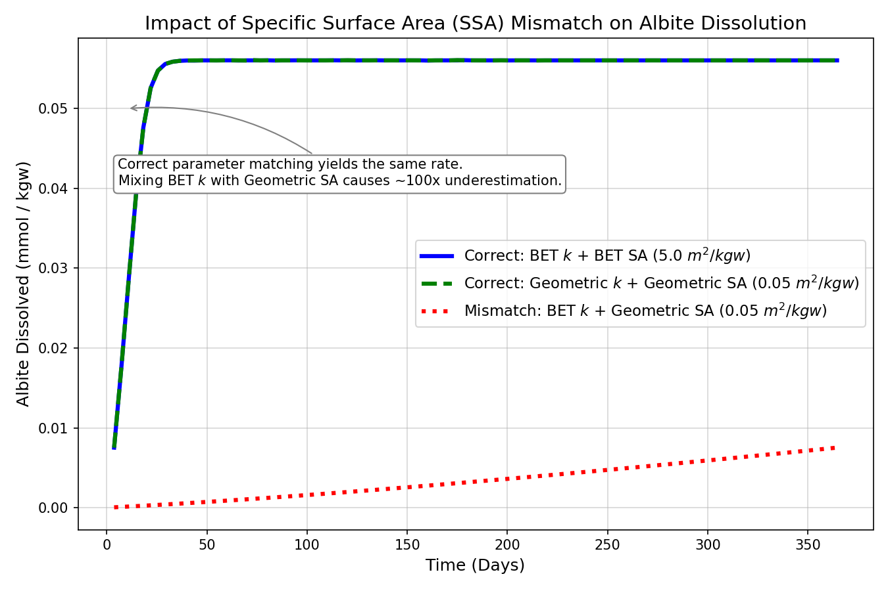

## はじめに

PHREEQCで鉱物の溶解・沈殿速度を計算する際、最もモデラーを悩ませるパラメータが「比表面積（Specific Surface Area: SSA）」である。

TOUGHREACTやCrunchFlowなどの反応性輸送コードでは、比表面積を入力すると、ソフトウェアが内部で自動的に分子量やセル体積を考慮して「水理学的な実表面積」へと自動換算してくれる。しかし、PHREEQCはBASICで速度式（`RATES` ブロック）を完全に自作する仕様であるため、この換算をモデラー自身が行わなければならない。

ここに多くの落とし穴が潜んでいる。本稿では、初心者が最も陥りやすい「単位不整合」と「分子量・初期重量の掛け忘れ」という致命的な技術的ミスが、フィッティングパラメータの物理的意味をどのように破壊するかを数式で明らかにする。その上で、測定不可能な「反応性表面積（RSA）」という限界を直視し、実務においてどのように比表面積を記述し、開示すべきかを論じる。

---

## 1. 速度式の次元解析：$k$ と $A_s$ を「揃える」とは何か

Lasaga et al. (1994) および Palandri & Kharaka (2004) が採用する鉱物溶解速度式の完全形は以下の通りである。

$$
r_{\mathrm{net}} = A_s \left[
  k_{\mathrm{nu}} \exp\!\left(\frac{-E_{a,\mathrm{nu}}}{RT}\right)
  + k_H \exp\!\left(\frac{-E_{a,H}}{RT}\right) a_H^{n_H}
  + k_{\mathrm{OH}} \exp\!\left(\frac{-E_{a,\mathrm{OH}}}{RT}\right) a_{\mathrm{OH}}^{n_{\mathrm{OH}}}
\right](1 - \Omega) \tag{1}
$$

各項の単位は以下の通りである。

- $r_{\mathrm{net}}$：正味反応速度 $[\mathrm{mol\,kgw^{-1}\,s^{-1}}]$
- $A_s$：単位水量あたりの接触面積 $[\mathrm{m^2\,kgw^{-1}}]$
- $k_{\mathrm{nu}},\, k_H,\, k_{\mathrm{OH}}$：各メカニズムの速度定数 $[\mathrm{mol\,m^{-2}\,s^{-1}}]$
- $E_a$：活性化エネルギー $[\mathrm{J\,mol^{-1}}]$

次元解析を行うと：

$$
[A_s] \cdot [k] = \mathrm{m^2\,kgw^{-1}} \cdot \mathrm{mol\,m^{-2}\,s^{-1}} = \mathrm{mol\,kgw^{-1}\,s^{-1}} \quad \checkmark
$$

ここで決定的に重要なのは、$k$ の単位に含まれる $\mathrm{m^{-2}}$ と $A_s$ の $\mathrm{m^2}$ が、**全く同じ定義で測られた面積**でなければ、この掛け算は物理的意味を失うという点である。Palandri & Kharaka (2004) の $k$ は実験室においてBET法で測定された面積で除して求められているから、$A_s$ にも BET 基準の面積を入力しなければならない。

---

## 2. 各種比表面積の定義と換算

### 2.1 幾何学的比表面積 $A_\mathrm{geo}$

粒子を球体、直径 $d\,[\mathrm{m}]$、密度 $\rho\,[\mathrm{g/m^3}]$ と仮定すると：

$$
A_\mathrm{geo} = \frac{6}{d \cdot \rho} \quad [\mathrm{m^2/g}] \tag{2}
$$

例として、石英（$\rho = 2.65 \times 10^6\,\mathrm{g/m^3}$）で粒径 $d = 100\,\mu\mathrm{m}$（$1.0 \times 10^{-4}\,\mathrm{m}$）の場合：

$$
A_\mathrm{geo} = \frac{6}{1.0 \times 10^{-4} \times 2.65 \times 10^6} \approx 0.023\,\mathrm{m^2/g}
$$

これは鉱物表面の凹凸・細孔を無視した**下限推定値**であり、BET とは異なる概念である（Appelo & Postma, 2005）。

### 2.2 BET 比表面積 $A_\mathrm{BET}$

液体窒素温度下でのガス吸着等温線から全表面積を算出する手法であり（Brunauer et al., 1938）、表面の微細な凹凸や細孔まで含めた「ガス分子がアクセスできる全面積」を測定する。$A_\mathrm{geo}$ に対する比（粗度係数）は：

$$
\lambda = \frac{A_\mathrm{BET}}{A_\mathrm{geo}} \tag{3}
$$

White & Peterson (1990) は新鮮なケイ酸塩鉱物について $\lambda \approx 7$ を報告している。ただし $\lambda$ は風化が進んだ試料では 10〜600 に達することもある（White & Brantley, 2003）。

### 2.3 モル比表面積 $A_\mathrm{mol}$

PHREEQCのデータベース等で用いられる形式。$A_\mathrm{BET}$ との関係は：

$$
A_\mathrm{mol} = A_\mathrm{BET} \times M_w \quad [\mathrm{m^2/mol}] \tag{4}
$$

### 2.4 PHREEQCへの入力：$m^2/kgw$ への最終換算と「エラーが出ない罠」

これが初心者が最も陥りやすい落とし穴である。

PHREEQCの `RATES` ブロックにおいて `moles = rate * area * TIME` と記述した場合、`area` の単位は $[\mathrm{m^2\,kgw^{-1}}]$（水 1 kgw あたりの全表面積）でなければならない。
しかし、初心者は文献に記載されている比表面積の値（例えば $A_\mathrm{BET} = 0.1\,\mathrm{m^2/g}$ や $A_\mathrm{geo} = 0.023\,\mathrm{m^2/g}$）を、**そのまま `area` や `KINETICS` の `-parms` に入力してしまう。**

なぜこれが罠かというと、**PHREEQCは「エラーを出さずに、そのままもっともらしい曲線を計算してしまう」からである。**

比表面積 $[\mathrm{m^2/g}]$ と、PHREEQCが要求する水量あたりの全表面積 $A_s\;[\mathrm{m^2/kgw}]$ の物理的な関係式は以下の通りである。
$$
A_s\;[\mathrm{m^2/kgw}] = A_\mathrm{BET}\;[\mathrm{m^2/g}] \times \text{水 1 kgw あたりの鉱物重量 } W\;[\mathrm{g/kgw}]
$$

もし $A_\mathrm{BET}$ の数値をそのまま `area` に代入して計算した場合、上式において暗黙のうちに「実際の鉱物重量 $W$ が**たまたま 1 g/kgw である特殊な系**」として計算を行っていることになる。

そのため、以下のような致命的な計算誤差が生じるが、PHREEQCは親切な警告を一切出してくれない。
* **実際の鉱物量が $10\,\mathrm{g/kgw}$ の場合**: 本来なら面積は10倍（$A_\mathrm{BET} \times 10$）になるべきなのに、換算を怠ると $A_\mathrm{BET}$ （1倍分）のままで計算されてしまうため、反応速度は**10倍過小評価**される。
* **実際の鉱物量が $0.1\,\mathrm{g/kgw}$ の場合**: 本来なら面積は10分の1（$A_\mathrm{BET} \times 0.1$）になるべきなのに、換算を怠ると $A_\mathrm{BET}$ （1倍分）のままで計算されてしまうため、反応速度は**10倍過大評価**される。

実際に入手した幾何学表面積 $A_\mathrm{geo}\;[\mathrm{m^2/g}]$ からPHREEQC用の動的な面積 $A_s(t)\;[\mathrm{m^2/kgw}]$ への正しい変換ステップは以下の通りである。

1. **ステップ1：表面の凹凸（粗度係数 $\lambda$）を考慮した物理的表面積への換算**:
   幾何学比表面積 $A_\mathrm{geo}\;[\mathrm{m^2/g}]$ に粗度係数 $\lambda$ を掛け、ガス分子がアクセスできる現実的な比表面積 $A_\mathrm{BET}\;[\mathrm{m^2/g}]$ を推定する。
   $$
   A_\mathrm{BET}\;[\mathrm{m^2/g}] = A_\mathrm{geo}\;[\mathrm{m^2/g}] \times \lambda
   $$
2. **ステップ2：初期の鉱物重量 $W(0)\;[\mathrm{g/kgw}]$ を用いた、単位水量あたりへの換算**:
   比表面積 $A_\mathrm{BET}$ に、水 1 kgw あたりの初期投入鉱物重量 $W(0)\;[\mathrm{g/kgw}]$ を掛け算して、初期の全表面積 $A_s(0)\;[\mathrm{m^2/kgw}]$ を求める。
   $$
   A_s(0)\;[\mathrm{m^2/kgw}] = A_\mathrm{BET}\;[\mathrm{m^2/g}] \times W(0)\;[\mathrm{g/kgw}]
   $$
   ここで、初期重量 $W(0)$ は、初期モル数 $M(0)\;[\mathrm{mol/kgw}]$ と分子量 $M_w\;[\mathrm{g/mol}]$ を用いて $W(0) = M(0) \times M_w$ と書き換えられる。よって、式は以下のように整理される。
   $$
   A_s(0) = A_\mathrm{BET} \times M_w \times M(0) \tag{5}
   $$
3. **ステップ3：反応進行（溶解）に伴う表面積変化の動的モデル化**:
   反応が進行すると鉱物が溶解して体積が減るため、表面積も減少する。球形粒子が均一に収縮すると仮定する「収縮核モデル（Shrinking Core Model）」を採用する場合、面積は「残存モル数比の 2/3 乗」に比例して縮小する。現在のモル数を $M(t)$ とすると、現在の表面積 $A_s(t)\;[\mathrm{m^2/kgw}]$ は以下の通り動的に計算される。
   $$
   A_s(t) = A_s(0) \times \left(\frac{M(t)}{M(0)}\right)^{2/3} = A_\mathrm{BET} \times M_w \times M(0) \times \left(\frac{M(t)}{M(0)}\right)^{2/3} \tag{6}
   $$

---

## 3. 致命的な落とし穴：分子量・初期重量の掛け忘れとフィッティング値の崩壊

PHREEQCの解説書やサンプルコードでは、以下のような記述がよく見られる。

```basic
area = area_init * (M/M_init)^(2/3)
```

この時、`area_init` に比表面積 $[\mathrm{m^2/g}]$ の数値をそのまま代入し、**分子量 $M_w$ や初期モル数 $M(0)$ を掛け忘れる**ケースが多発している。

この掛け忘れが発生した間違ったコードでの表面積計算は以下のようになる。

$$
A_{s,\mathrm{wrong}}(t) = A_\mathrm{BET} \times \left(\frac{M(t)}{M(0)}\right)^{2/3} \tag{7}
$$

正しい計算式である式(6)と比較すると、本来掛け算されるべき**初期鉱物重量 $W(0) = M(0) \times M_w$ の項が完全に消失している。**

この状態でモデラーが実験データを再現するために、表面積パラメータにスケーリングファクター（$f_\mathrm{fit}$）を掛けてフィッティングを行ったとしよう。このとき、間違ったコードで得られるフィッティング値 $f_{\mathrm{fit},\mathrm{wrong}}$ と、正しいコードで得られる $f_{\mathrm{fit},\mathrm{correct}}$ の関係は以下のようになる。

$$
f_{\mathrm{fit},\mathrm{wrong}} = f_{\mathrm{fit},\mathrm{correct}} \times W(0) \tag{8}
$$

これが意味するのは致命的な事実である。**「同じ鉱物、同じ流動条件の反応であっても、実験開始時に投入した鉱物重量 $W(0)$ が異なれば、フィッティングパラメータの値が何桁も変動してしまう」** のである。

例えば、ある実験で石英を $10\,\mathrm{g/kgw}$ 投入し、別の実験で $0.1\,\mathrm{g/kgw}$ 投入した場合、分子量を掛け忘れたコードを使うと、同一の反応性・同一の水理環境であってもフィッティングパラメータの値に100倍の差が生じる。

これでは、フィッティングパラメータが持つはずの「反応活性度」や「水理的効果」といった物理的意味が完全に破壊され、単に**「初期重量と分子量を掛け忘れたツケを回収しただけの、その実験系限りの数値（ただのゴミ）」**になってしまう。人や実験ごとにフィッティング値が全く異なり、一切の比較が不可能になる最大の原因は、この単純な技術的掛け忘れにある。

---

## 4. 比表面積の定義ミスマッチがもたらす計算誤差の定量的影響

BET 基準の $k$ に対して $A_\mathrm{geo}$ をそのまま入力した場合、あるいは前述の分子量の掛け忘れが発生した場合、計算される反応速度と真の速度の間には、粗度係数 $\lambda$ や初期重量 $W(0)$ に起因する数桁の乖離が生じる。

以下のシミュレーションは、Albite（曹長石）の 25℃・1年間の溶解について、この定義ミスマッチおよび換算忘れの影響を示したものである。



BET基準の $k$ と正しく換算されたBET面積を組み合わせた系（青線）は、幾何学面積（Geo）に対して幾何学基準の速度定数 $k_{\mathrm{geo}}$（$= \lambda \cdot k_{\mathrm{BET}}$）を組み合わせた系（緑線）と完全に一致する。

ここで、幾何学基準の速度定数は $k_{\mathrm{geo}} = \lambda \cdot k_{\mathrm{BET}}$ で定義されるが、実務において標準的な速度定数データベース（Palandri & Kharaka, 2004 等）はすべて**BET基準で統一**されており、幾何学基準の速度定数はデータベースに存在しない。

そのため、モデラーが幾何学面積 $A_{\mathrm{geo}}$ を入力しつつ、データベースの $k_{\mathrm{BET}}$ をそのまま使用すると、必ず $\lambda$ 倍（ここでは $\lambda = 100$）の定義ミスマッチ（赤線）を引き起こす。幾何学面積を入力してフィッティングを行う場合、得られたスケーリングファクターの中に、この粗度係数 $\lambda$ の影響（数倍〜数百倍）が最初から混入してしまっていることを自覚する必要がある。

---

## 5. 測定不可能な「反応性表面積（RSA）」という科学的限界

技術的な単位変換や分子量の掛け忘れをクリアしたとしても、モデラーは次に「科学的限界」に直面する。

速度式が真に要求しているのは、ガス分子がアクセスできる面積（BET）でも、ツルツルの球体の面積（Geo）でもなく、**水と実際に反応している面積、すなわち「反応性表面積（Reactive Surface Area: RSA）」**である。そしてRSAは、現在の技術では原理的に直接測定することができない。各概念の関係は以下のように整理できる。

$$
A_\mathrm{geo} \xrightarrow{+\,\text{表面粗度}} A_\mathrm{BET} \xrightarrow{+\,\text{反応性の不均一}} A_\mathrm{RSA} \xleftarrow{-\,\text{モデル誤差等}} A_\mathrm{eff}
$$

$A_\mathrm{geo}$ から $A_\mathrm{BET}$ への改善は、粗度係数 $\lambda$ という形で定量化できた。しかし $A_\mathrm{BET}$ から真の $A_\mathrm{RSA}$ への距離は、現在の測定技術では定量できていない。

BETの限界を示す具体的な証拠がいくつか報告されている。

* **BET 面積と溶解速度の非比例性:** 石英粉末の長期溶解実験において、溶解に伴いBET面積が増大し続けているにもかかわらず溶解速度が変わらなかったという報告がある（Gautier et al., 2001）。これは内部細孔の表面が水との反応にほとんど寄与していない可能性を示唆している。
* **物理プロセスの責任転嫁:** Maher (2010) は、実験室と野外における風化速度の乖離（数桁に及ぶスケールギャップ）を、表面積の違いではなく「流体滞留時間（fluid residence time）」と熱力学的飽和度の違いとして説明した。この立場からすれば、モデラーが表面積パラメータをフィッティングしていじり回す行為は、モデルに欠けている物理的プロセス（不均質な流動場や滞留時間分布）を表面積に「責任転嫁」しているにすぎない。
* **単一パラメータの限界:** Lüttge らは、鉱物表面の反応性は微視的な欠陥分布やエッチピットの形成によって著しく不均質であり、単一の平均的な速度定数や表面積で表現すること自体が誤りであると指摘している（Fischer et al., 2012）。

すなわち、どれだけ厳密に比表面積を測定・換算しようとも、私たちがフィッティングで得る **有効表面積 $A_\mathrm{eff}$** は、モデルが表現しきれなかった物理的プロセスのツケが押し付けられた「調整弁」としての宿命から逃れられない。

---

## 6. 実務における提案：フィッティング因子の「等価性」と透明な開示

このように、最終的にフィッティングで決定するスケーリングファクター $f_{\mathrm{fit}}$ は、単一の物理的な表面積の補正値ではない。それは輸送の不均質性、熱力学データの誤差、表面の反応的不均質性をすべて吸収した**「等価結合パラメータ（Coupled Effective Parameter）」**である。

「人やモデルによって値が異なる」のは、モデルごとに背負わされている誤差や実験の初期条件が異なるため当然である。だからこそ、モデラーはこの実態を認め、以下の実務を徹底すべきである。

1. **分子量と初期重量を正しく掛けたコードを使用する**
   初期重量 $W(0)$ に依存する無意味なノイズをパラメータから完全に排除し、少なくとも「異なる初期鉱物量で行われた実験間」で、パラメータを物理的に比較可能な状態に保つ。
2. **フィッティング定数 $f_{\mathrm{fit}}$ の透明な開示**
   スケーリングを行った場合、その倍率 $f_{\mathrm{fit}}$ と、基準とした面積の定義（例: 粒径から計算した $A_\mathrm{geo}$ か、ガスの種類を明記した $A_\mathrm{BET}$ か）を論文中に明記する。

---

## 7. PHREEQCでの正しい実装例とケーススタディ

### 7.1 基本的な実装テンプレート

比表面積を入力する際、手計算での事前換算を徹底的に排除し、比表面積 $[\mathrm{m^2/g}]$ をそのままパラメータとして受け取って BASIC コード内部で動的に $[\mathrm{m^2/kgw}]$ に換算する正しい実装テンプレートを以下に示す。

```basic
# ===== 幾何学面積からの動的換算とフィッティング因子の実装 =====
# A_ref : 基準比表面積 A_geo = 0.023 m2/g  (粒径 100 um)
# f_fit : フィッティングによるスケーリングファクター (無次元)
#         ※注意：これは物理的表面積ではなく、モデルの未定義誤差を
#                 吸収するための等価結合パラメータである。

10 m_init = PARM(1)        # 初期モル数 (mol/kgw)
20 Mw     = 262.22         # 鉱物の分子量 (g/mol)
30 A_ref  = PARM(2)        # 基準比表面積 (m2/g)
40 f_fit  = PARM(3)        # スケーリングファクター (例: 0.01)
50 m_curr = M
60 IF (m_curr <= 0) THEN GOTO 200

# 正しく Mw と m_init を掛け算して m2/kgw に換算し、さらに f_fit をかける
70 area   = A_ref * f_fit * Mw * m_init * (m_curr / m_init)^(2/3)  # m2/kgw
80 moles  = rate * area * TIME
90 SAVE moles
100 END
200 SAVE 0
```

`KINETICS` ブロックでは以下のようにパラメータを渡す。

```phreeqc
KINETICS 1
    Mineral_Phase
        -m 0.0263
        -parms 0.0263 0.023 0.01   # m_init, A_ref(m2/g), f_fit
```

### 7.2 ケーススタディ：連載#17および#18のコードの再設計

本サイトの連載記事である **「#17：玄武岩-CO2反応（CarbFix）」** および **「#18：利尻玄武岩バッチ反応実験」** で提示したコードも、実は「手計算の事前処理」に依存しており、BASICコード単体では不完全な（コピペすると罠に陥る）設計になっていた。これらを正しい設計へと書き換える例を以下に示す。

#### ケース1：連載#17（玄武岩ガラスの溶解）の再設計

* **修正前の設定 (事前手計算あり)**:
  `KINETICS` で `-parms 1.255 37500` と指定されていた。この `37500` は、比表面積 $250\,\mathrm{m^2/g}$ に初期ガラス重量 $150\,\mathrm{g}$ を手計算で掛けた結果（$250 \times 150 = 37500$）であった。
  RATESブロックでは以下のように面積を計算していた。
  ```basic
  110 m_init = PARM(1)
  120 s_init = PARM(2)
  130 m_curr = M
  150 current_S = s_init * (m_curr / m_init)^(2/3)
  ```

* **修正後の正しい設定 (コード内動的換算版)**:
  `PARM(2)` には比表面積 $250.0$ ($\mathrm{m^2/g}$) を直接入力する。玄武岩ガラスの分子量はその組成式から $Mw = 119.52\,\mathrm{g/mol}$ としてコードに埋め込む。

  ここで数学的な等価性を検証する。修正前の事前計算値 $s_{\mathrm{init}} = 37500$ に対し、修正後の動的な初期表面積は：
  $$ A_{\mathrm{BET}} \times M_w \times M(0) = 250.0 \times 119.52 \times 1.255 \approx 37500.12 $$
  となり、小数点以下まで極めて正確に一致し、全く同一の計算結果（溶解曲線）が出力される。

  ```phreeqc
  # KINETICSブロック
  Basalt_Glass
      -m 1.255
      -parms 1.255 250.0  # m_init, A_BET(m2/g) を直接指定
  ```

  ```basic
  # RATESブロック
  # (前略：速度定数 k の計算など)
  110 m_init = PARM(1)
  120 A_BET  = PARM(2)       # 比表面積 250.0 m2/g を直接受け取る
  125 Mw     = 119.52        # 玄武岩ガラスの分子量 (g/mol)
  130 m_curr = M
  140 IF (m_curr <= 0) THEN GOTO 200
  # コード内部で Mw と m_init を掛けて m2/kgw に動的変換
  150 current_S = A_BET * Mw * m_init * (m_curr / m_init)^(2/3)
  160 rate_mol = specific_rate * current_S
  170 moles = rate_mol * TIME
  180 SAVE moles
  190 END
  200 SAVE 0
  ```

#### ケース2：連載#18（利尻玄武岩バッチ・Albiteの溶解）の再設計

* **修正前の設定 (事前手計算あり)**:
  `KINETICS` で `-parms 0.0263 0.0526` と指定されていた。この `0.0526` は、初期質量 $6.90\,\mathrm{g}$ から求めた幾何学的面積 $2.63\,\mathrm{m^2}$ に有効反応面積（RSA = 2%）を掛けた手計算結果（$2.63 \times 0.02 = 0.0526$）であった。
  RATESブロックでは以下のように面積を計算していた。
  ```basic
  50 m_init = PARM(1)
  60 area_init = PARM(2)
  70 m_curr = M
  90 area = area_init * (m_curr / m_init)^(2/3)
  ```

* **修正後の正しい設定 (コード内動的換算版)**:
  `PARM(2)` に幾何学比表面積 $A_{\mathrm{geo}} = 0.3817\,\mathrm{m^2/g}$ を、`PARM(3)` に有効係数（RSA = 2% = 0.02）をそれぞれ独立したパラメータとして渡す。分子量は Albite の $262.22\,\mathrm{g/mol}$ を使用する。

  ここでも数学的な等価性を検証する。修正前の事前計算値 $area_{\mathrm{init}} = 0.0526$ に対し、修正後の動的な初期表面積は：
  $$ A_{\mathrm{geo}} \times f_{\mathrm{fit}} \times M_w \times M(0) = 0.3817 \times 0.02 \times 262.22 \times 0.0263 \approx 0.05264 $$
  となり、小数点以下4桁まで完全に一致し、全く同一の溶解曲線を出力する。

  ```phreeqc
  # KINETICSブロック
  Albite(low)
      -m 0.0263
      -parms 0.0263 0.3817 0.02   # m_init, A_geo(m2/g), f_fit(RSA)
  ```

  ```basic
  # RATESブロック
  # (前略：速度定数 k の計算など)
  50 m_init = PARM(1)
  60 A_geo  = PARM(2)       # 幾何学比表面積 0.3817 m2/g を直接受け取る
  65 f_fit  = PARM(3)       # スケーリングファクター (RSA = 0.02)
  68 Mw     = 262.22        # Albiteの分子量 (g/mol)
  70 m_curr = M
  80 IF (m_curr <= 0) THEN GOTO 200
  # 初期重量 Mw * m_init と f_fit を掛けて m2/kgw に動的変換
  90 area   = A_geo * f_fit * Mw * m_init * (m_curr / m_init)^(2/3)
  100 moles = rate * area * TIME
  110 SAVE moles
  120 END
  200 SAVE 0
  ```

このようにパラメータ設計を再定義することで、KINETICSブロックにおける「手動での事前換算」が完全に不要となり、何倍に表面積をスケールダウン（あるいはアップ）したかが一目でわかる自己説明性の高いモデルを構築できる。

---

## 8. 結論：単位の厳密さと限界の誠実な開示

速度論モデリングにおいて、表面積をフィッティングすることは不可避の実務である。しかし、分子量や初期重量の掛け忘れといった「単純な単位ミス」を放置したフィッティングは、得られたパラメータを比較不能なゴミへと変えてしまう。

技術的な次元換算を正しく行い、初期重量依存性を排除した上で、フィッティング値が持つ「等価パラメータ」としての限界を率率に開示すること。これこそが、間違った計算結果を物理的に正しいかのように錯覚するのを防ぐ、最も科学的で誠実なアプローチである。

---

### 参考文献

- Appelo, C. A. J., & Postma, D. (2005). *Geochemistry, groundwater and pollution* (2nd ed.). CRC press.
- Brantley, S. L., & Mellott, N. P. (2000). Surface area and porosity of primary silicate minerals. *American Mineralogist*, 85(11–12), 1767–1783.
- Brunauer, S., Emmett, P. H., & Teller, E. (1938). Adsorption of gases in multimolecular layers. *Journal of the American Chemical Society*, 60(2), 309–319.
- Fischer, C., Arvidson, R. S., & Lüttge, A. (2012). How predictable are dissolution rates of crystalline material? *Geochimica et Cosmochimica Acta*, 98, 177-185.
- Gautier, J. M., Oelkers, E. H., & Schott, J. (2001). Are quartz dissolution rates proportional to B.E.T. surface areas? *Geochimica et Cosmochimica Acta*, 65(7), 1059-1070.
- Hodson, M. E., Langan, S. J., & Meriau, S. (2006). Does reactive surface area depend on grain size? *Geochimica et Cosmochimica Acta*, 70(7), 1670–1687.
- Lasaga, A. C., Soler, J. M., Ganor, J., Burch, T. E., & Nagy, K. L. (1994). Chemical weathering rate laws and global geochemical cycles. *Geochimica et Cosmochimica Acta*, 58(10), 2361–2386.
- Maher, K. (2010). The dependence of chemical weathering rates on fluid residence time. *Earth and Planetary Science Letters*, 294(1-2), 101-110.
- Palandri, J. L., & Kharaka, Y. K. (2004). *A compilation of rate parameters of water-mineral interaction kinetics for application to geochemical modeling*. USGS Open-File Report 2004-1068.
- White, A. F., & Brantley, S. L. (2003). The effect of time on the weathering of silicate minerals: why do weathering rates differ in the laboratory and field? *Chemical Geology*, 202(3–4), 479–506.
- White, A. F., & Peterson, M. L. (1990). Role of reactive-surface-area characterization in geochemical kinetic models. *ACS Symposium Series*, 416, 461–475.
