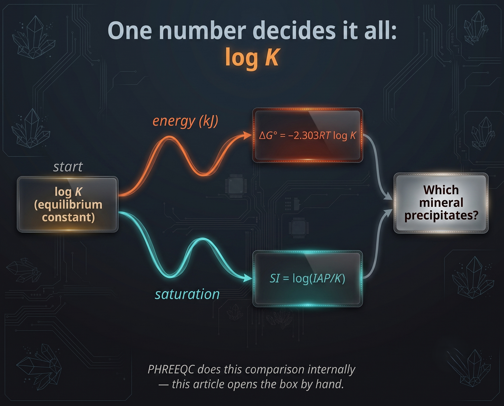
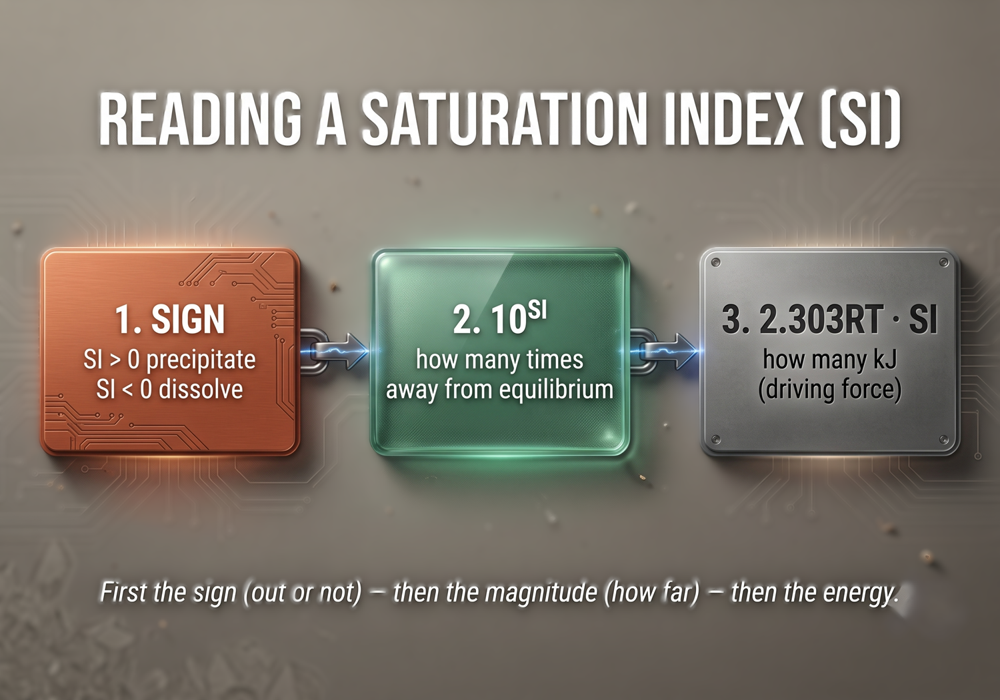
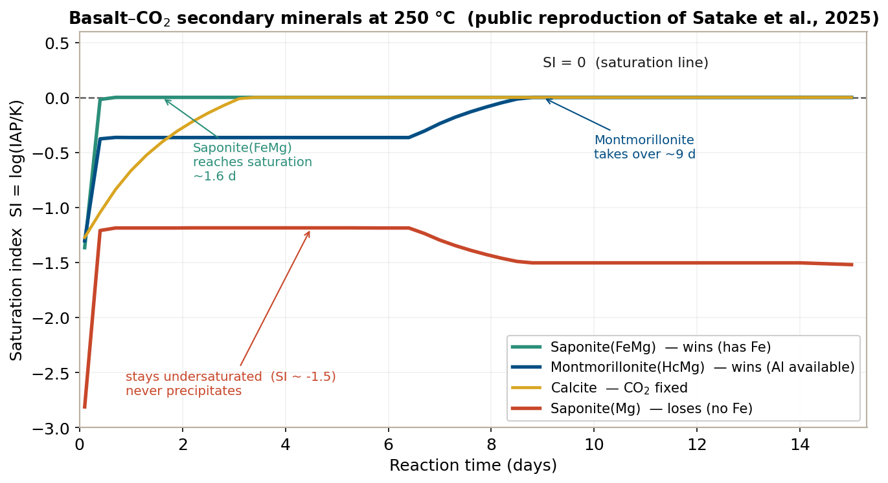
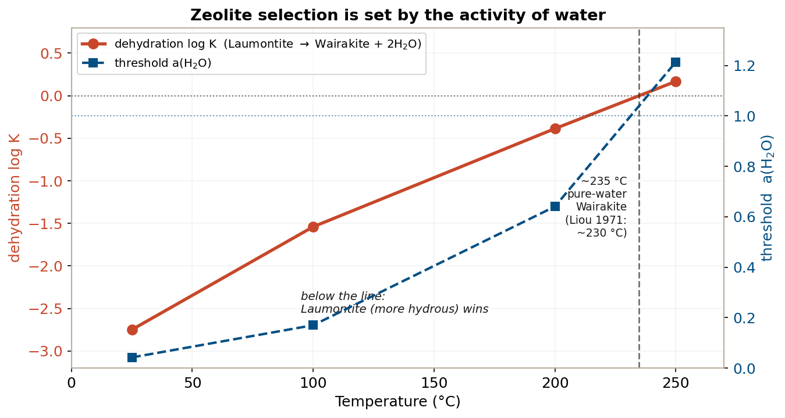

## はじめに：PHREEQCが「裏で」やっていること

これまでの玄武岩-CO2 反応シリーズ（[#17](../phreeqc-part17/) CarbFix 再現、[#18](../phreeqc-part18/) Satake et al. 2025 再現）では、反応速度論（KINETICS）を用いて「一次鉱物がどれくらいの速さで溶けるか」を追いかけてきた。しかし、溶け出したイオンから**どの二次鉱物が実際に析出するのか**——Calcite なのか、スメクタイトなのか、ゼオライトなのか——を決めているのは、速度論ではない。その判定はすべて、データベースに書かれた一つの数字、**平衡定数（equilibrium constant）の対数 log K** が担っている。

PHREEQC の `EQUILIBRIUM_PHASES` に鉱物名を並べるだけで、ソフトウェアは「この溶液から出る／出ない」を自動で判定してくれる。しかしその内部では、log K を使ったギブス自由エネルギーの比較が黙々と行われている。本稿の目的は、この**ブラックボックスを手計算で開くこと**である。log K さえ読めれば、鉱物どうしの「勝ち負け」は紙と鉛筆で説明できる。

題材には、すでに本シリーズで公開した2つの再現研究——Satake et al. (2025) [@satake2025] の玄武岩バッチ反応（250℃）と、Gysi (2017) [@gysi2017] に基づく CarbFix 型の滴定モデル——の結果をそのまま使う。使用する log K はすべて公開データベース Thermoddem [@blanc2012] の値である。

{width=85% .lightbox}

---

## 1. 平衡定数とギブス自由エネルギー — たった一本の親方程式

まず、すべての出発点となる関係式を示す。ギブス自由エネルギー（Gibbs free energy、ギブズの自由エネルギーとも表記される）$\Delta G^\circ$ と平衡定数 $K$ は、次の一本で結ばれている。

$$ \Delta G^\circ = -2.303\,RT \log K $$

$\Delta G$ は「その反応が下り坂か上り坂か」を表すエネルギーである。マイナスなら下り坂（自発的に進む）、プラスなら上り坂（進まない）。ここで $2.303\,RT$ は「log K が 1 変わると、エネルギーが何 kJ 動くか」の換算係数であり、温度で決まる。

| 温度 | $2.303\,RT$（log K 1単位あたりの kJ/mol） |
|---|---|
| 25 ℃ | 5.71 |
| 100 ℃ | 7.14 |
| 250 ℃ | 10.02 |

握っておくべき符号のルールはこれだけである。

- **log K プラス → ΔG マイナス → 下り坂・安定**（その向きに進む）
- **log K マイナス → ΔG プラス → 上り坂・不安定**（進まない）

この一本さえあれば、エネルギーも、どちらの鉱物が安定かも、すべてここから計算できる。

---

## 2. log K の正体 — 「平衡での活量の比」

平衡定数 $K$ とは、「平衡に達したときの、生成物の活量を反応物の活量で割った比」である。活量（activity）は、いわば「効きめの濃度」と考えればよい。

ここで決定的に重要なルールが一つある。**純粋な固体（鉱物）と水は、活量 = 1 と置く**。純物質だからである。したがって、式の中で固体と水は「1」になって消える。

石英（Quartz）で一歩ずつ見てみよう。Thermoddem に書かれた溶解反応と log K は次の通りである。

```
Quartz(alpha):  SiO2 + 2H2O  =  H4SiO4        log K = -3.734
```

この平衡定数を定義どおり「生成物 ÷ 反応物」で書くと、分母の $a(\mathrm{SiO_2})=1$（純粋な固体）、$a(\mathrm{H_2O})\approx 1$（水）が消えて、

$$ K = a(\mathrm{H_4SiO_4}) = 10^{-3.734} \approx 1.8 \times 10^{-4} $$

これが「石英の溶解度」である。log K は、こうした具体的な平衡の数字を裏に持っている。

### pH が効く鉱物 — Calcite

次に、pH に依存するタイプを見る。Calcite の溶解反応は次の通りである。

```
Calcite:  CaCO3 + H+  =  Ca2+ + HCO3-        log K = 1.847
```

分母に $a(\mathrm{H^+})$ が現れる。ここが pH に効く仕掛けである。飽和指数（saturation index, SI）を書き下すと、pH がどう入るかがはっきりする。

$$ \mathrm{SI} = \log a(\mathrm{Ca^{2+}}) + \log a(\mathrm{HCO_3^-}) + \mathrm{pH} - 1.847 $$

（$-\log a(\mathrm{H^+}) = \mathrm{pH}$ が pH の定義である。）つまり pH は SI の中に「係数 +1」でそのまま入る。**pH が 1 上がると SI が 1 上がる**（= 10 倍 過飽和側へ動く）。これが「Calcite は pH で析出する」の正体である。

たとえば $a(\mathrm{Ca^{2+}}) = a(\mathrm{HCO_3^-}) = 10^{-3}$ と置くと $\mathrm{SI} = \mathrm{pH} - 7.847$ となり、pH を動かすだけで析出の可否が反転する。

| pH | SI = pH − 7.847 | 挙動 |
|---|---|---|
| 6 | −1.85 | 未飽和 → Calcite が溶ける |
| 7 | −0.85 | まだ未飽和 |
| 8 | +0.15 | 過飽和 → Calcite が析出 |
| 9 | +1.15 | 強く過飽和 → さらに析出 |

玄武岩-CO2 系で、CO2 が消費されて pH が上がると Calcite が析出するのは、まさにこの仕組みである。

---

## 3. IAP と SI — 「今の水」は平衡からどれだけズレているか

$K$ は「平衡での」比であった。これに対し **IAP（イオン活量積, ion activity product）** は、同じ式に「今の溶液の」活量を入れた積である。式の形は $K$ と同じで、中身が「平衡の値」か「今の値」かの違いだけである。その2つの比の対数が SI である。

$$ \mathrm{SI} = \log \left( \frac{\mathrm{IAP}}{K} \right) $$

- **SI > 0**：今の水が平衡より濃い → 過飽和 → その鉱物が析出する
- **SI = 0**：ちょうど平衡（飽和）
- **SI < 0**：今の水が薄い → 未飽和 → 出ない（あれば溶ける）

SI はエネルギーにも直せる。これも親方程式の仲間である。

$$ \text{析出の駆動力} = 2.303\,RT \cdot \mathrm{SI} $$

SI を見たときの読み方の順序を、一枚の図にまとめておく。**まず符号（±）で出る／出ないを見て、次に $10^{\mathrm{SI}}$ で「何倍ズレているか」、最後に $2.303\,RT \times \mathrm{SI}$ で「何 kJ か」を読む。**

{width=80% .lightbox}

---

## 4. 反応を「組み合わせる」技 — Hess の法則

ここからが本丸である。**鉱物どうしを比べるとは、反応を足し引きして log K を足し引きすること**、ただそれだけである。ルールは3つ。

| 反応にする操作 | log K は… |
|---|---|
| 反応を **逆向き** にする | 符号を反転（＋ ↔ −） |
| 反応を **n 倍** する | n 倍 する |
| 反応を **足す** | 足す（K は掛け算 = log は足し算） |

最後に、両辺に同じ顔で出ている物質を消す。基本形として、Anorthite（灰長石）が Kaolinite（カオリナイト）に変わる反応を組んでみる。材料は Thermoddem の 25℃ 溶解反応である。

```
(1) Anorthite + 8H+ = 2Al3+ + Ca2+ + 2H4SiO4      log K = +24.235
(2) Kaolinite + 6H+ = 2Al3+ + 2H4SiO4 + H2O        log K = +6.483
```

$(1) - (2)$ を作ると、$2\mathrm{Al^{3+}}$ と $2\mathrm{H_4SiO_4}$ が両辺で消えて、

$$ \text{Anorthite} + 2\mathrm{H^+} + \mathrm{H_2O} = \text{Kaolinite} + \mathrm{Ca^{2+}} $$
$$ \log K = 24.235 - 6.483 = +17.75 $$

log K = +17.75、すなわち $\Delta G^\circ(25℃) \approx -5.71 \times 17.75 \approx -101$ kJ/mol の猛烈な下り坂である。Anorthite の Al は、喜んで Kaolinite に落ちる。

---

## 5. 例B：これが CO2 固定そのもの — Anorthite + CO2 → Calcite + Kaolinite

CarbFix や Satake の研究が狙う「CO2 の鉱物固定」を、log K の言葉で書いてみよう。材料に CO2 の溶解反応と Calcite を加える。

```
(1) Anorthite + 8H+ = 2Al3+ + Ca2+ + 2H4SiO4      +24.235
(2) Kaolinite + 6H+ = 2Al3+ + 2H4SiO4 + H2O        +6.483
(3) Calcite + H+ = Ca2+ + HCO3-                     +1.847
(4) CO2 + H2O = HCO3- + H+                          -7.821
```

$(1)$ そのまま、$(2)$ 逆向き、$(3)$ 逆向き、$(4)$ そのままで足し合わせると、$\mathrm{Al^{3+}}$・$\mathrm{H_4SiO_4}$・$\mathrm{Ca^{2+}}$・$\mathrm{HCO_3^-}$・$\mathrm{H^+}$ がすべて消え、

$$ \text{Anorthite} + \mathrm{CO_2} + 2\mathrm{H_2O} = \text{Calcite} + \text{Kaolinite} $$
$$ \log K = 24.235 - 6.483 - 1.847 - 7.821 = +8.08 $$

$\Delta G^\circ(25℃) \approx -46$ kJ/mol の下り坂である。一次鉱物 Anorthite が CO2 を Calcite として固定し、残った Al は Kaolinite になる。**熱力学的には確実に進む反応**であることが、紙の上で分かる。

### 実データによる裏づけ（Satake et al. 2025 再現）

これは机上の計算にとどまらない。[#18](../phreeqc-part18/) の Satake et al. (2025) 再現モデル（利尻島玄武岩、250℃）を、二次鉱物の飽和指数を出力する設定で回すと、Calcite は反応開始から約 4〜5 日目に SI = 0 に到達し、そのまま析出を続けた（最終 $2.0 \times 10^{-4}$ mol）。

::: {.callout-note}
**紙の計算と PHREEQC の答えが一致する**

log K の足し引きが示した「Anorthite + CO2 → Calcite は下り坂」という結論は、そのまま PHREEQC の数値実験でも再現された。Calcite の SI がマイナスからゼロへ立ち上がり、以降ゼロに張り付く（＝溶出と析出が釣り合う）挙動は、下の図の黄色の線である。log K が正しく「下り坂」と言った反応は、実際に進むのである。
:::

---

## 6. 例C：炭酸塩の勝敗 — Dolomite = Calcite + Magnesite

CO2 固定では、Calcite だけでなく Dolomite（ドロマイト）や Magnesite（マグネサイト）も候補になる。どれが出るのか。これも log K の引き算で見える。

```
(1) Dolomite  + 2H+ = Ca2+ + Mg2+ + 2HCO3-        +3.533
(2) Calcite   + H+  = Ca2+ + HCO3-                 +1.847
(3) Magnesite(Natur) + H+ = Mg2+ + HCO3-          +1.415
```

$(1) - (2) - (3)$ を作ると、H+・HCO3-・Ca2+・Mg2+ がすべて消えて、

$$ \text{Dolomite} = \text{Calcite} + \text{Magnesite} $$
$$ \log K = 3.533 - 1.847 - 1.415 = +0.27 $$

log K = +0.27、$\Delta G^\circ \approx -1.5$ kJ/mol。**ほぼ拮抗**である。Dolomite と「Calcite + Magnesite の組」の安定性の差は、わずか数 kJ しかない。これほどの僅差であるため、実際にどちらが出るかは溶液の組成に強く依存する。

Satake 再現モデル（250℃）の最終状態を見ると、この僅差が現実にどう転ぶかが分かる。

| 鉱物 | 最終 SI | 挙動 |
|---|---|---|
| **Calcite** | 0.00 | 析出（$2.0 \times 10^{-4}$ mol） |
| Dolomite | −0.79 | 未飽和・析出せず |
| Magnesite(Natur) | −0.57 | 未飽和・析出せず |

この系では **Calcite が勝ち**、Dolomite と Magnesite は飽和に届かなかった。炭酸塩トラップの主役が Calcite になる、という結果には、こうした log K レベルの拮抗と、溶液の Mg 供給の少なさが効いている。

---

## 7. 例D：スメクタイトの競合 — 勝敗を分けるのは「元素供給」

二次鉱物の中でも、スメクタイト（膨潤性粘土）の競合はやや込み入っている。ここでは Satake 再現モデルの実測 SI 推移を使い、「なぜあるスメクタイトは出て、別のスメクタイトは出ないのか」を追う。

まず、3つのスメクタイト端成分の組成（Thermoddem）を比べる。

```
Saponite(FeMg) : Mg0.17 Mg2 Fe1 Al0.34 ...   log K = 26.022   ← Fe を含む
Saponite(Mg)   : Mg0.17 Mg3   Al0.34 ...      log K = 28.810   ← Fe を含まない
Montmorillonite(HcMg) : Al1.4 Mg0.9 ...        log K =  5.996   ← Al を多く使う
```

Saponite(FeMg) と Saponite(Mg) は、**Fe を含むか否かだけが違う**（一方は Mg の一部が Fe に置き換わっている）。この一点が、勝敗を決定的に分ける。

{width=90% .lightbox}

図を時間で追うと、次の物語が読める。

1. **反応初期（〜1日）**：すべての鉱物が未飽和（SI < 0）。まだ何も出ない。
2. **約1.6日目**：**Saponite(FeMg) が最初に SI = 0 に到達し、析出を開始する**。一次鉱物 Fayalite（$\mathrm{Fe_2SiO_4}$）が溶けて Fe を供給するため、Fe を要求する Saponite(FeMg) の材料が揃うのである。
3. **約9日目**：遅れて **Montmorillonite(HcMg) が SI = 0 に到達**し、以降こちらが主役になる（最終 $9.8 \times 10^{-3}$ mol）。溶液に Al が十分あるため、Al を多く使う Montmorillonite でも飽和に届く。
4. **一方 Saponite(Mg) は、SI ≈ −1.5 のまま一度も析出しない**。組成がほぼ同じ Saponite(FeMg) が出るのに、なぜこちらは負けるのか。

::: {.callout-important}
**答え：勝敗を分けたのは Fe の供給である**

Saponite(FeMg) と Saponite(Mg) の違いは Fe の有無だけである。この系では Fayalite が溶けて Fe を供給するため、Fe を取り込める Saponite(FeMg) は飽和に達し、Fe を使えない Saponite(Mg) は——log K だけ見れば 28.810 と Saponite(FeMg) の 26.022 より大きい（＝一見安定に見える）にもかかわらず——**材料の組み合わせが揃わず、SI が負のまま出られない**。

「どの相が出るか」は、log K の大小だけでは決まらない。**その相が要求する元素が、実際に溶液に供給されているか**が効く。これは本シリーズを貫く「二次鉱物の顔ぶれは元素供給で決まる」という主題そのものである。
:::

---

## 8. 例E：ゼオライトと「水の活量」 — Laumontite と Wairakite

CarbFix 型の低温モデル（[#17](../phreeqc-part17/)）では、終盤にゼオライトが問題を起こす。ゼオライトは、供給される陽イオンだけでなく **水そのものの活量 $a(\mathrm{H_2O})$** に支配される点が特徴的である。これを Laumontite（ローモンタイト）と Wairakite（ワイラカイト）で見る。両者は骨格 $\mathrm{Ca(Al_2Si_4)O_{12}}$ が同じで、**結晶に取り込む水の数だけが違う**。

```
Laumontite … ·4H2O        Wairakite … ·2H2O
```

したがって Ca・Al・Si の供給では両者の勝敗は決まらない。決めるのは水の活量である。Thermoddem の溶解反応から脱水反応を組むと（Laumontite の溶解反応から Wairakite の溶解反応を引く）、

$$ \text{Laumontite} = \text{Wairakite} + 2\mathrm{H_2O} $$

この反応の平衡定数は $K = a(\mathrm{H_2O})^2$（固体は 1）である。よって両者が釣り合う「水の活量のしきい値」は $a(\mathrm{H_2O}) = 10^{\log K / 2}$ で与えられる。PHREEQC で温度ごとの脱水 log K を計算すると、次のようになる。

| 温度 | 脱水 log K | しきい値 $a(\mathrm{H_2O})$ | 純水（$a\approx1$）での安定相 |
|---|---|---|---|
| 25 ℃ | −2.75 | 0.042 | Laumontite |
| 100 ℃ | −1.54 | 0.17 | Laumontite |
| 200 ℃ | −0.39 | 0.64 | Laumontite |
| 250 ℃ | +0.17 | 1.21（>1） | **Wairakite** |

{width=85% .lightbox}

読み方はこうである。$a(\mathrm{H_2O}) >$ しきい値なら含水の多い Laumontite が、下回れば脱水した Wairakite が安定になる。低温では、ふつうの希薄な地下水（$a(\mathrm{H_2O}) \approx 1$）は常にしきい値を上回るので、Laumontite 側が勝つ。Wairakite を出すには、(a) 水の活量を下げる（高塩濃度・蒸発）か、(b) 温度を上げるしかない。

温度を上げると脱水 log K は上昇し、**しきい値が 1 に達する約 235℃ で、純水でもついに Wairakite が現れる**。これは Liou (1971) [@liou1971] の実験による相境界（約 230℃）とほぼ一致する。低温の CarbFix 系でゼオライトの取り扱いが難しいのは、この水の活量による微妙な安定性の綱引きが背後にあるためである。

---

## 9. 【別軸】「出ない」にはもう一種類ある — 速度論の壁

ここまでの例（例D の Saponite(Mg)、例E の Wairakite）は、いずれも**材料の元素は溶液にあるのに飽和に届かない**、すなわち熱力学（SI）の負けであった。しかし「出ない」には、もう一つ別の種類がある。**材料そのものが溶液に供給されない場合**である。

| 「出ない」のタイプ | 判定に使うもの |
|---|---|
| ① 材料はあるが飽和しない（熱力学） | $\mathrm{SI} = \log(\mathrm{IAP}/K)$（＝ log K の世界） |
| ② 材料が供給されない（速度論） | 溶解速度（KINETICS）。log K では決まらない |

②は、[#18](../phreeqc-part18/) で導入した有効反応表面積（RSA）や、[#17](../phreeqc-part17/) の玄武岩ガラスの溶解速度が支配する世界である。ある元素の供給源となる一次鉱物が速度論的に「固く」溶けにくければ、その元素を要求する二次鉱物は、log K がどれだけ大きくても飽和に届かない。Lasaga (1984) [@lasaga1984] が示したように、二次鉱物の生成は一次鉱物の溶解に律速される。

::: {.callout-tip}
**「出ない」を見たら、まず問う — 材料は溶液に来ているか？**

来ていれば、勝負は SI（log K）の世界である。来ていなければ、それは速度論（KINETICS）の話であり、いくら反応を組んで log K を出しても答えは変わらない。この2つの軸を切り分けることが、地球化学モデルの結果を「読む」うえで決定的に重要である。
:::

---

## 10. 使い回せる手順書

最後に、鉱物どうしの安定性を log K で比べるときの手順をまとめておく。

1. 関係する鉱物の **溶解反応と log K** をデータベース（`.dat`）から書き出す。
2. **作りたい式** を決める（なるべく固体＋水だけ、または固体＋CO2 など）。
3. **組む**：逆向き＝符号反転／n倍＝n倍／足す＝log K を足す。
4. 両辺の **同じ物質を消す**（イオン・H+・H4SiO4 など）。
5. 残った式の log K の符号を読む：**＋＝生成物が安定（下り）／−＝反応物が安定**。
6. kJ に直す：$\Delta G^\circ = -2.303\,RT \times \log K$（25℃で 5.71、100℃で 7.14、250℃で 10.02）。

::: {.callout-warning}
**生の log K を直接比べてはいけない**

付録の表を見て「Quartz は −3.7、Anorthite は +24.2 だから Quartz が安定」と考えるのは誤りである。反応式ごとに H+ の数（8個 vs 2個）も Si の数も違うので、生の log K は**別々のものさし**なのである。鉱物どうしを比べるときは、必ず §4 の手順で両者を1本の反応式にまとめ（＝ Al3+ や H+ を消し）てから比べること。消えて初めて、同じ土俵の比較になる。

そして、「この溶液から実際に析出するか？」の最終判定は log K ではなく **SI**（＝モデル出力の活量が必要）で行う。本稿の例B〜Dで実データの SI を参照したのは、このためである。
:::

---

## 付録：本稿で使った Thermoddem の log K（25℃、溶解反応）

すべて公開データベース Thermoddem [@blanc2012] の値である。

| 鉱物 / 種 | 溶解反応 | log K |
|---|---|---|
| Anorthite | CaAl2Si2O8 + 8H+ = 2Al3+ + Ca2+ + 2H4SiO4 | 24.235 |
| Kaolinite | Al2Si2O5(OH)4 + 6H+ = 2Al3+ + 2H4SiO4 + H2O | 6.483 |
| Quartz(alpha) | SiO2 + 2H2O = H4SiO4 | −3.734 |
| Calcite | CaCO3 + H+ = Ca2+ + HCO3- | 1.847 |
| Dolomite | CaMg(CO3)2 + 2H+ = Ca2+ + Mg2+ + 2HCO3- | 3.533 |
| Magnesite(Natur) | MgCO3 + H+ = Mg2+ + HCO3- | 1.415 |
| CO2 溶解 | CO2 + H2O = HCO3- + H+ | −7.821 |
| Laumontite | Ca(Al2Si4)O12·4H2O + 8H+ = 2Al3+ + Ca2+ + 4H4SiO4 | 11.695 |
| Wairakite | Ca(Al2Si4)O12·2H2O + 8H+ + 2H2O = 2Al3+ + Ca2+ + 4H4SiO4 | 14.444 |
| Saponite(FeMg) | (Fe を含む端成分) | 26.022 |
| Saponite(Mg) | (Fe を含まない端成分) | 28.810 |
| Montmorillonite(HcMg) | (Al を多く使う端成分) | 5.996 |

※ この生 log K は、そのまま鉱物間で比較しないこと（§10）。比較は §4 の手順で反応を1本作ってから行う。

<br>

---

## References

::: {#refs}
:::

<br>

::: {.callout-note appearance="simple"}
※本記事で参照した飽和指数（SI）は、既刊 [#18](../phreeqc-part18/)（Satake et al. 2025 再現）の公開済みモデルに、化学条件を一切変えず SI 出力のみを追加して取得したものである。使用した log K はすべて公開データベース Thermoddem の値である。
:::
