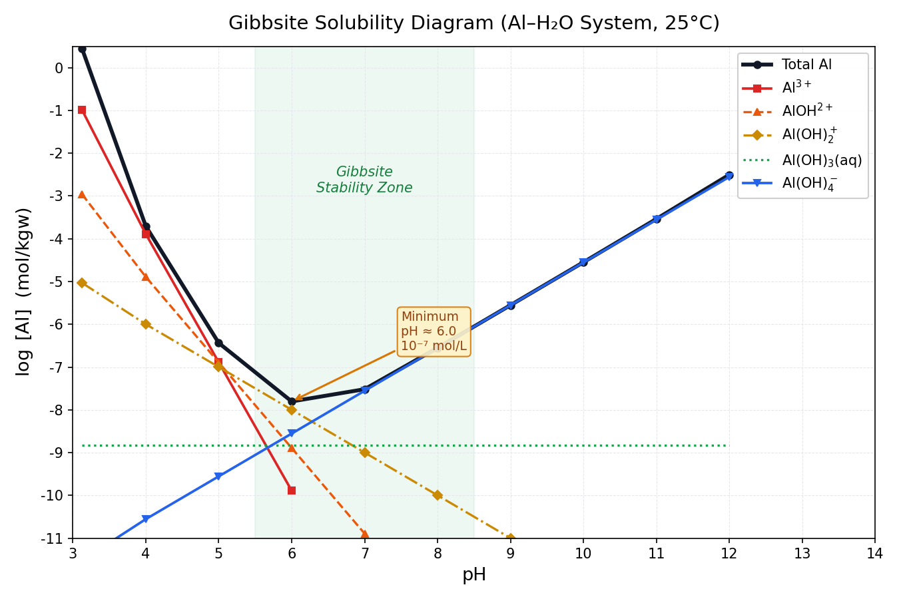
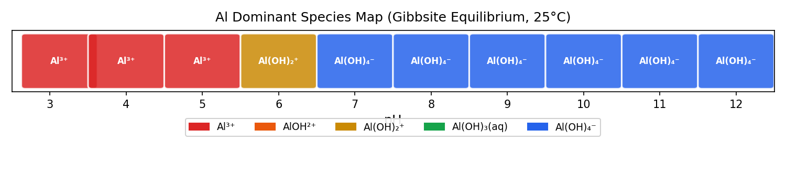

## Introduction: Why Integrate with Python?

While PHREEQC's built-in `USER_GRAPH` is handy for quick plots, Python is undeniably superior when it comes to creating **publication-quality figures, interactive visualizations, and statistical processing**. In this article, we will load the `gibbsite_solubility.txt` output from [Part 7](../phreeqc-part7/index-en.html) into Python to achieve the following:

```{=html}
<div style="display:grid; grid-template-columns:repeat(3,1fr); gap:1em; margin:1.5em 0;">
  <div style="background:var(--color-background-secondary); border-radius:10px; padding:1.1em; text-align:center; border-bottom:3px solid #D97706;">
    <div style="font-size:1.8em; margin-bottom:0.3em;">🐼</div>
    <div style="font-weight:700; color:#92400E; font-size:0.95em;">pandas</div>
    <div style="font-size:0.82em; color:var(--color-text-secondary); margin-top:0.4em; line-height:1.5;">Smartly parse tab-separated SELECTED_OUTPUT files.</div>
  </div>
  <div style="background:var(--color-background-secondary); border-radius:10px; padding:1.1em; text-align:center; border-bottom:3px solid #16A34A;">
    <div style="font-size:1.8em; margin-bottom:0.3em;">📈</div>
    <div style="font-weight:700; color:#15803D; font-size:0.95em;">matplotlib</div>
    <div style="font-size:0.82em; color:var(--color-text-secondary); margin-top:0.4em; line-height:1.5;">Render publication-quality solubility diagrams.</div>
  </div>
  <div style="background:var(--color-background-secondary); border-radius:10px; padding:1.1em; text-align:center; border-bottom:3px solid #2563EB;">
    <div style="font-size:1.8em; margin-bottom:0.3em;">🔵</div>
    <div style="font-weight:700; color:#1E3A5F; font-size:0.95em;">Automated Workflow</div>
    <div style="font-size:0.82em; color:var(--color-text-secondary); margin-top:0.4em; line-height:1.5;">Build a one-file script to analyze geochemical data instantly.</div>
  </div>
</div>
```

::: callout-note
## Prerequisites

- You must have run the PHREEQC code from Part 7 and have the `gibbsite_solubility.txt` file ready.
- You must have Python 3.9+ installed, along with `pandas`, `matplotlib`, `kaleido` and `plotly`.<br> (`pip install pandas matplotlib kaleido plotly`) kaleido is for exporting images from plotly.
- pip is Python's package management tool. You can install the required libraries by running the above command in a terminal (command prompt).
- Example: `pip install phreeqpy` installs phreeqpy. The command above installs pandas, matplotlib, plotly, and kaleido all at once.
:::

------------------------------------------------------------------------

## Step 1: Understanding the SELECTED_OUTPUT Structure

The file generated by PHREEQC's `SELECTED_OUTPUT` is a tab-separated text file. The first line is the header, and the subsequent lines are the data.

```{=html}
<div style="background:#1E293B; border-radius:8px; padding:1.3em; margin:1.2em 0; overflow-x:auto;">
<pre style="color:#1E293B; font-size:0.82em; margin:0; line-height:1.6; font-family:'Cascadia Code','Fira Code',monospace;">
<span style="color:#94A3B8;"># gibbsite_solubility.txt</span>
sim state   soln    dist_x  <span style="color:#FCD34D;">pH</span>  <span style="color:#86EFAC;">Al</span> <span style="color:#94A3B8;">Al+3</span>    AlOH+2  Al(OH)2+    Al(OH)3 Al(OH)4-    <span style="color:#93C5FD;">Gibbsite</span>
1   i_soln  1   -1  7.000   0.000e+00   ...
2   react   1   -1  3.000   <span style="color:#FCD34D;">3.000</span>   <span style="color:#86EFAC;">7.76e-03</span>    <span style="color:#F9A8D4;">-2.110</span>  -5.270  -7.970  -9.710  -13.5   ...
3   react   2   -1  <span style="color:#FCD34D;">4.000</span>   <span style="color:#86EFAC;">7.76e-04</span>    <span style="color:#F9A8D4;">-3.110</span>  -5.270  -6.970  -9.710  -13.5   ...
...
</pre>
</div>
```

::: callout-important
## Header Names Matter

Species specified via `-activities` are output in $\log_{10}(\text{activity})$. Conversely, the `Al` specified via `-totals` is output in **linear scale (mol/kgw)**. Before visualizing, you need to convert the total Al column to log scale while leaving the activity columns as they are.

Also, depending on your PHREEQC version, the header line might start directly with `"pH  Al..."` instead of `"sim  state..."`.
:::

------------------------------------------------------------------------

## Step 2: Loading Data with pandas

``` python
# ============================================================
#  phreeqc_read.py
#  Loading and cleaning PHREEQC SELECTED_OUTPUT files
# ============================================================
import pandas as pd
import numpy as np
from pathlib import Path

# ---- File Loading ----
fp = Path("gibbsite_solubility.txt")

df_raw = pd.read_csv(
    fp,
    sep="\t",             # Tab-separated
    comment="#",          # Skip comment lines
    skipinitialspace=True # Clean up whitespace
)

print(f"Shape: {df_raw.shape}")
print(df_raw.head())
print("\nColumns:", df_raw.columns.tolist())
```

```{=html}
<div style="background:var(--color-background-secondary); border:1px solid var(--color-border-tertiary); border-radius:8px; padding:1.1em; margin:1em 0; font-size:0.85em; font-family:'Cascadia Code','Fira Code',monospace; overflow-x:auto; color:var(--color-text-secondary);">
> Shape: (13, 10) or (10, 10)<br>
> Columns: ['sim', 'state', 'soln', 'dist_x', 'pH', 'Al', 'la_Al+3',<br>
&nbsp;&nbsp;&nbsp;&nbsp;&nbsp;&nbsp;&nbsp;&nbsp;&nbsp;'la_AlOH+2', 'la_Al(OH)2+', 'la_Al(OH)3', 'la_Al(OH)4-', 'Gibbsite']
</div>
```

``` python
# ---- Cleaning: Keep only the pH data rows ----
df = (
    df_raw
    # .query("state == 'react'")          # Optional: keep only equilibrium results
    .rename(columns={
        "Al":             "Al_total_mol",  # total Al (linear scale)
        "la_Al+3":        "log_Al3",
        "la_AlOH+2":      "log_AlOH2",
        "la_Al(OH)2+":    "log_AlOH2p",
        "la_Al(OH)3":     "log_AlOH3",
        "la_Al(OH)4-":    "log_AlOH4",
    })
    .reset_index(drop=True)
)

# ---- Convert total Al to log scale ----
df["log_Al_total"] = np.log10(df["Al_total_mol"].clip(lower=1e-15))

print(df[["pH", "log_Al_total", "log_Al3", "log_AlOH2p", "log_AlOH3","log_AlOH4"]].to_string(index=False))
```

```{=html}
<div style="overflow-x:auto; margin:1em 0; border-radius:8px;">
<table style="width:100%; border-collapse:collapse; font-size:0.86em; font-family:'Cascadia Code','Fira Code',monospace;">
  <thead>
    <tr style="background:#D97706; color:white;">
      <th style="padding:8px 14px;">pH</th>
      <th style="padding:8px 14px;">log_Al_total</th>
      <th style="padding:8px 14px;">log_Al3</th>
      <th style="padding:8px 14px;">log_AlOH2p</th>
      <th style="padding:8px 14px;">log_AlOH3</th>
      <th style="padding:8px 14px;">log_AlOH4</th>
    </tr>
  </thead>
  <tbody>
    <tr style="background:#FFF7ED;"><td style="padding:7px 14px;">3.12</td><td>0.45</td><td>-0.98</td><td>-5.03</td><td>-8.83</td><td>-11.52</td></tr>
    <tr style="background:#FDFDFD;"><td style="padding:7px 14px;">4.00</td><td>-3.71</td><td>-3.89</td><td>-6.00</td><td>-8.83</td><td>-10.56</td></tr>
    <tr style="background:#FFF7ED;"><td style="padding:7px 14px;">5.00</td><td>-6.44</td><td>-6.89</td><td>-7.00</td><td>-8.83</td><td>-9.56</td></tr>
    <tr style="background:#FED7AA; font-weight:600; color:#92400E;"><td style="padding:7px 14px;">6.00 ★</td><td>-7.80</td><td>-9.89</td><td>-8.00</td><td>-8.83</td><td>-8.56</td></tr>
    <tr style="background:#FDFDFD;"><td style="padding:7px 14px;">7.00</td><td>-7.52</td><td>-12.89</td><td>-9.00</td><td>-8.83</td><td>-7.56</td></tr>
    <tr style="background:#FFF7ED;"><td style="padding:7px 14px;">8.00</td><td>-6.55</td><td>-15.89</td><td>-10.00</td><td>-8.83</td><td>-6.56</td></tr>
    <tr style="background:#FDFDFD;"><td style="padding:7px 14px;">9.00</td><td>-5.55</td><td>-18.89</td><td>-11.00</td><td>-8.83</td><td>-5.56</td></tr>
    <tr style="background:#FFF7ED;"><td style="padding:7px 14px;">10.00</td><td>-4.55</td><td>-21.89</td><td>-12.00</td><td>-8.83</td><td>-4.56</td></tr>
  </tbody>
</table>
</div>
```

------------------------------------------------------------------------

## Step 3: Plotting Publication-Quality Figures with matplotlib

Append the following code below Step 2 to generate the plot. Note that the plot labels have been localized to English for broad usability.

``` python
# ============================================================
#  phreeqc_plot_matplotlib.py
# ============================================================
import matplotlib.pyplot as plt
import matplotlib.ticker as ticker

# ---- Matplotlib Configuration ----
plt.rcParams.update({
    "font.family": "sans-serif",
    "axes.unicode_minus": False,
    "figure.dpi": 150,
})

# ---- Data Preparation ----
ph = df["pH"].values

species = {
    "Total Al":      ("log_Al_total", "#111827", 2.8, "-",  "o"),
    r"Al$^{3+}$":    ("log_Al3",      "#DC2626", 1.8, "-",  "s"),
    r"AlOH$^{2+}$":  ("log_AlOH2",   "#EA580C", 1.6, "--", "^"),
    r"Al(OH)$_2^+$": ("log_AlOH2p",  "#CA8A04", 1.6, "-.", "D"),
    r"Al(OH)$_3$(aq)":("log_AlOH3",  "#16A34A", 1.6, ":",  ""),
    r"Al(OH)$_4^-$": ("log_AlOH4",   "#2563EB", 1.8, "-",  "v"),
}

fig, ax = plt.subplots(figsize=(9, 6))

# ---- Gibbsite Stability Background ----
ax.axvspan(5.5, 8.5, alpha=0.07, color="#16A34A", label="_nolegend_")
ax.text(7.0, -2.3, "Gibbsite\nStability Zone", ha="center", va="top",
        fontsize=10, color="#15803D", style="italic")

# ---- Plot Each Species ----
for label, (col, color, lw, ls, marker) in species.items():
    y = df[col].replace([np.inf, -np.inf], np.nan).values
    valid = ~np.isnan(y) & (y > -12)          # Only plot values above detection limit
    if marker:
        ax.plot(ph[valid], y[valid], color=color, lw=lw,
                ls=ls, marker=marker, ms=5, label=label)
    else:
        ax.plot(ph[valid], y[valid], color=color, lw=lw,
                ls=ls, label=label)

# ---- Minimum Value Annotation ----
min_idx = df["log_Al_total"].idxmin()
min_ph  = df.loc[min_idx, "pH"]
min_log = df.loc[min_idx, "log_Al_total"]
ax.annotate(
    f"Minimum\npH ≈ {min_ph:.1f}\n10⁻⁷ mol/L",
    xy=(min_ph, min_log),
    xytext=(min_ph + 1.5, min_log + 1.2),
    fontsize=9, color="#92400E",
    arrowprops=dict(arrowstyle="->", color="#D97706", lw=1.5),
    bbox=dict(boxstyle="round,pad=0.3", fc="#FEF3C7", ec="#D97706", alpha=0.9),
)

# ---- Axes and Formatting ----
ax.set_xlim(3, 14)
ax.set_ylim(-11, 0.5)
ax.set_xlabel("pH", fontsize=13)
ax.set_ylabel(r"$\log$ [Al]  (mol/kgw)", fontsize=13)
ax.set_title("Gibbsite Solubility Diagram (Al–H₂O System, 25°C)", fontsize=14, pad=12)
ax.xaxis.set_major_locator(ticker.MultipleLocator(1))
ax.yaxis.set_major_locator(ticker.MultipleLocator(1))
ax.grid(True, which="major", ls="--", lw=0.5, color="#E5E7EB")
ax.legend(loc="upper right", fontsize=10, framealpha=0.95)

plt.tight_layout()
plt.savefig("gibbsite_solubility.png", dpi=300, bbox_inches="tight")
plt.savefig("gibbsite_solubility.svg", bbox_inches="tight")   # Vector format
plt.show()
print("✅ Saved successfully: gibbsite_solubility.png / .svg")
```



------------------------------------------------------------------------

## Step 4: Dominant Species Map (Speciation Diagram)

In geochemistry, it is equally important to visualize **which species is dominant** at a given pH.

``` python
# ============================================================
#  phreeqc_speciation_map.py
#  Mapping dominant Al species by color across pH
# ============================================================
import matplotlib.patches as mpatches

# Determine the maximum activity species at each pH
activity_cols = ["log_Al3", "log_AlOH2", "log_AlOH2p", "log_AlOH3", "log_AlOH4"]
species_names  = ["Al³⁺", "AlOH²⁺", "Al(OH)₂⁺", "Al(OH)₃(aq)", "Al(OH)₄⁻"]
species_colors = ["#DC2626", "#EA580C", "#CA8A04", "#16A34A", "#2563EB"]

df_act = df[activity_cols].replace([np.inf, -np.inf], np.nan).fillna(-99)
dominant_idx = df_act.values.argmax(axis=1)

fig, ax = plt.subplots(figsize=(10, 2.2))

for i, row in df.iterrows():
    ph_val = row["pH"]
    d_idx  = dominant_idx[i]
    color  = species_colors[d_idx]
    rect   = mpatches.FancyBboxPatch(
        (ph_val - 0.45, 0.1), 0.9, 0.8,
        boxstyle="round,pad=0.05",
        facecolor=color, edgecolor="white", linewidth=1.5, alpha=0.85,
    )
    ax.add_patch(rect)
    ax.text(ph_val, 0.5, species_names[d_idx],
            ha="center", va="center", fontsize=8, color="white", fontweight="bold")

ax.set_xlim(2.5, 12.5)
ax.set_ylim(0, 1)
ax.set_xlabel("pH", fontsize=12)
ax.set_yticks([])
ax.set_xticks(range(3, 13))
ax.set_title("Al Dominant Species Map (Gibbsite Equilibrium, 25°C)", fontsize=12, pad=8)

# Legend
patches = [mpatches.Patch(color=c, label=n)
           for c, n in zip(species_colors, species_names)]
ax.legend(handles=patches, loc="upper center",
          bbox_to_anchor=(0.5, -0.35), ncol=5, fontsize=9, framealpha=0.9)

plt.tight_layout()
plt.savefig("al_speciation_map.svg", bbox_inches="tight")
plt.show()
```



------------------------------------------------------------------------

## Step 5: The Complete Analytical Workflow (One-File Script)

Below is the complete, consolidated script covering Steps 1 through 4. Simply copy, paste, and run this code alongside your `gibbsite_solubility.txt`.

``` python
#  gibbsite_full_analysis.py
#  Complete Analysis Script for PHREEQC Part 7
#  Usage: python gibbsite_full_analysis.py gibbsite_solubility.txt
# ============================================================
import sys
import numpy as np
import pandas as pd
import matplotlib.pyplot as plt
import matplotlib.ticker as ticker
import matplotlib.patches as mpatches

plt.rcParams.update({
    "font.family": "sans-serif",
    "axes.unicode_minus": False,
    "figure.dpi": 150,
})

# ---- Constants ----
SPECIES = {
    "Total Al":       ("log_Al_total", "#111827", 2.8, "-"),
    r"Al$^{3+}$":     ("log_Al3",      "#DC2626", 1.8, "-"),
    r"AlOH$^{2+}$":   ("log_AlOH2",   "#EA580C", 1.6, "--"),
    r"Al(OH)$_2^+$":  ("log_AlOH2p",  "#CA8A04", 1.6, "-."),
    r"Al(OH)$_3$":    ("log_AlOH3",   "#16A34A", 1.6, ":"),
    r"Al(OH)$_4^-$":  ("log_AlOH4",   "#2563EB", 1.8, "-"),
}

ACT_COLS  = ["log_Al3", "log_AlOH2", "log_AlOH2p", "log_AlOH3", "log_AlOH4"]
SP_NAMES  = [r"Al$^{3+}$", r"AlOH$^{2+}$", r"Al(OH)$_2^+$",
             r"Al(OH)$_3$(aq)", r"Al(OH)$_4^-$"]
SP_COLORS = ["#DC2626", "#EA580C", "#CA8A04", "#16A34A", "#2563EB"]

def load_data(filepath: str) -> pd.DataFrame:
    """Load and format SELECTED_OUTPUT."""
    df = pd.read_csv(filepath, sep="\t", comment="#", skipinitialspace=True)
    df = df.rename(columns={
        "Al": "Al_total_mol",
        "la_Al+3": "log_Al3", "la_AlOH+2": "log_AlOH2",
        "la_Al(OH)2+": "log_AlOH2p", "la_Al(OH)3": "log_AlOH3", "la_Al(OH)4-": "log_AlOH4",
    })
    df["log_Al_total"] = np.log10(df["Al_total_mol"].clip(lower=1e-15))
    return df

def plot_solubility(df: pd.DataFrame, save: bool = True):
    """Render the Solubility Diagram."""
    fig, ax = plt.subplots(figsize=(9, 6))
    ax.axvspan(5.5, 8.5, alpha=0.07, color="#16A34A")
    ax.text(7.0, -2.0, "Gibbsite\nStability Zone", ha="center",
            fontsize=10, color="#15803D", style="italic")

    for label, (col, color, lw, ls) in SPECIES.items():
        y = df[col].replace([np.inf, -np.inf], np.nan).values
        mask = ~np.isnan(y) & (y > -12)
        ax.plot(df["pH"].values[mask], y[mask],
                color=color, lw=lw, ls=ls, label=label, marker="o", ms=4)

    mi = df["log_Al_total"].idxmin()
    ax.annotate(
        f"Min pH ≈ {df.loc[mi,'pH']:.1f}",
        xy=(df.loc[mi, "pH"], df.loc[mi, "log_Al_total"]),
        xytext=(df.loc[mi, "pH"] + 1.5, df.loc[mi, "log_Al_total"] + 1.5),
        fontsize=9, color="#92400E",
        arrowprops=dict(arrowstyle="->", color="#D97706"),
        bbox=dict(boxstyle="round", fc="#FEF3C7", ec="#D97706"),
    )

    ax.set(xlim=(3, 14), ylim=(-11, 0.5),
           xlabel="pH", ylabel=r"$\log$ [Al] (mol/kgw)",
           title="Gibbsite Solubility Diagram (Al–H₂O System, 25°C)")
    ax.xaxis.set_major_locator(ticker.MultipleLocator(1))
    ax.yaxis.set_major_locator(ticker.MultipleLocator(1))
    ax.grid(True, ls="--", lw=0.5, color="#E5E7EB")
    ax.legend(fontsize=10, loc="upper right")
    plt.tight_layout()
    if save:
        fig.savefig("gibbsite_solubility.svg", bbox_inches="tight")
        print("✅ Saved gibbsite_solubility.svg")
    plt.show()

def plot_speciation_map(df: pd.DataFrame, save: bool = True):
    """Render the Dominant Species Map."""
    df_act = df[ACT_COLS].replace([np.inf, -np.inf], np.nan).fillna(-99)
    dom = df_act.values.argmax(axis=1)

    fig, ax = plt.subplots(figsize=(10, 2.2))
    for i, row in df.iterrows():
        c = SP_COLORS[dom[i]]
        rect = mpatches.FancyBboxPatch(
            (row["pH"] - 0.45, 0.1), 0.9, 0.8,
            boxstyle="round,pad=0.05",
            facecolor=c, edgecolor="white", lw=1.5, alpha=0.85,
        )
        ax.add_patch(rect)
        ax.text(row["pH"], 0.5, SP_NAMES[dom[i]],
                ha="center", va="center", fontsize=8,
                color="white", fontweight="bold")

    patches = [mpatches.Patch(color=c, label=n)
               for c, n in zip(SP_COLORS, SP_NAMES)]
    ax.set(xlim=(2.5, 12.5), ylim=(0, 1),
           xlabel="pH", title="Al Dominant Species Map (Gibbsite Eq, 25°C)")
    ax.set_yticks([])
    ax.set_xticks(range(3, 13))
    ax.legend(handles=patches, loc="upper center",
              bbox_to_anchor=(0.5, -0.35), ncol=5, fontsize=9)
    plt.tight_layout()
    if save:
        fig.savefig("al_speciation_map.svg", bbox_inches="tight")
        print("✅ Saved al_speciation_map.svg")
    plt.show()

# ---- Main ----
if __name__ == "__main__":
    fp = sys.argv[1] if len(sys.argv) > 1 else "gibbsite_solubility.txt"
    df = load_data(fp)
    print(df[["pH", "log_Al_total", "log_Al3", "log_AlOH4"]].to_string(index=False))
    plot_solubility(df)
    plot_speciation_map(df)
```

Run with a single line:

``` bash
python gibbsite_full_analysis.py gibbsite_solubility.txt
```

------------------------------------------------------------------------

## Summary: The PHREEQC × Python Workflow

```{=html}
<div style="background:var(--color-background-primary); border:1px solid var(--color-border-tertiary); border-radius:12px; padding:1.5em; margin:1.5em 0;">
<svg viewBox="0 0 680 110" xmlns="http://www.w3.org/2000/svg" style="width:100%;max-width:680px;display:block;margin:0 auto;">
  <defs>
    <marker id="arr" markerWidth="8" markerHeight="8" refX="6" refY="3" orient="auto">
      <path d="M0,0 L0,6 L8,3 z" fill="#9CA3AF"/>
    </marker>
  </defs>
  <!-- Blocks -->
  <rect x="10" y="30" width="120" height="50" rx="8" fill="#FFF7ED" stroke="#D97706" stroke-width="1.5"/>
  <text x="70" y="52" text-anchor="middle" font-size="12" font-weight="700" fill="#92400E">PHREEQC</text>
  <text x="70" y="68" text-anchor="middle" font-size="10" fill="#78350F">Run .pqi</text>

  <line x1="130" y1="55" x2="158" y2="55" stroke="#9CA3AF" stroke-width="1.5" marker-end="url(#arr)"/>

  <rect x="160" y="30" width="130" height="50" rx="8" fill="#F0FDF4" stroke="#16A34A" stroke-width="1.5"/>
  <text x="225" y="52" text-anchor="middle" font-size="12" font-weight="700" fill="#15803D">SELECTED_OUTPUT</text>
  <text x="225" y="68" text-anchor="middle" font-size="10" fill="#166534">gibbsite_solubility.txt</text>

  <line x1="290" y1="55" x2="318" y2="55" stroke="#9CA3AF" stroke-width="1.5" marker-end="url(#arr)"/>

  <rect x="320" y="30" width="110" height="50" rx="8" fill="#EFF6FF" stroke="#2563EB" stroke-width="1.5"/>
  <text x="375" y="52" text-anchor="middle" font-size="12" font-weight="700" fill="#1E3A5F">pandas</text>
  <text x="375" y="68" text-anchor="middle" font-size="10" fill="#1E40AF">Load &amp; Clean</text>

  <line x1="430" y1="55" x2="458" y2="55" stroke="#9CA3AF" stroke-width="1.5" marker-end="url(#arr)"/>

  <rect x="460" y="30" width="120" height="50" rx="8" fill="#FEF9C3" stroke="#CA8A04" stroke-width="1.5"/>
  <text x="515" y="52" text-anchor="middle" font-size="12.5" font-weight="700" fill="#92400E">matplotlib</text>
  <text x="515" y="68" text-anchor="middle" font-size="10" fill="#78350F">Render SVG</text>
</svg>
</div>
```

```{=html}
<div style="display:grid; grid-template-columns:repeat(3,1fr); gap:1em; margin:1em 0;">
  <div style="background:var(--color-background-secondary); border-radius:10px; padding:1em; text-align:center; border-bottom:3px solid #D97706;">
    <div style="font-weight:700; color:#92400E; margin-bottom:0.3em;">Step 1–2</div>
    <div style="font-size:0.83em; color:var(--color-text-secondary); line-height:1.5;">Run PHREEQC<br>→ Output TXT<br>→ Load to pandas</div>
  </div>
  <div style="background:var(--color-background-secondary); border-radius:10px; padding:1em; text-align:center; border-bottom:3px solid #16A34A;">
    <div style="font-weight:700; color:#15803D; margin-bottom:0.3em;">Step 3</div>
    <div style="font-size:0.83em; color:var(--color-text-secondary); line-height:1.5;">Plot static figures with matplotlib</div>
  </div>
  <div style="background:var(--color-background-secondary); border-radius:10px; padding:1em; text-align:center; border-bottom:3px solid #2563EB;">
    <div style="font-weight:700; color:#1E3A5F; margin-bottom:0.3em;">Step 4–5</div>
    <div style="font-size:0.83em; color:var(--color-text-secondary); line-height:1.5;">Generate Speciation Maps<br>Automate in a single script</div>
  </div>
</div>
```

Next time, in Part 9, we will dive into Ionic Strength and Activity Coefficients—the reasons why calculation results differ between seawater and freshwater.

------------------------------------------------------------------------

## References

::: {#refs}
:::

- [#1 Installation and Initial Calculation](../phreeqc-part1/index-en.html)
- [#2 Analyzing Seawater with Speciation](../phreeqc-part2/index-en.html)
- [#3 Mineral Equilibrium and Temperature Effects](../phreeqc-part3/index-en.html)
- [#4 Calcite–CO₂ Interaction (Open vs. Closed Systems)](../phreeqc-part4/index-en.html)
- [#5 Mixing Groundwater and Seawater](../phreeqc-part5/index-en.html)
- [#6 Pyrite Oxidation and AMD Formation](../phreeqc-part6/index-en.html)
- [#7 Solubility Diagrams (Gibbsite)](../phreeqc-part7/index-en.html)
- **#8 Visualization with Python** (This article)
- [#9 Ionic Strength and Activity Coefficients](../phreeqc-part9/index-en.html)

------------------------------------------------------------------------

*DeepFlow \| Science beneath the surface*