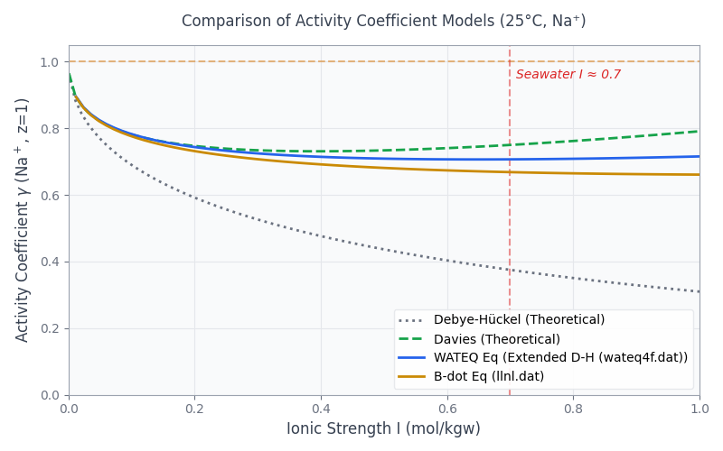
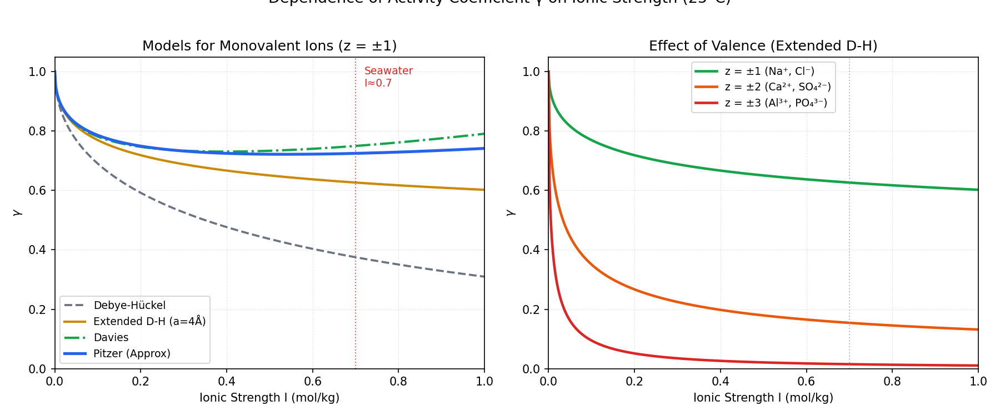

## Introduction: The "Unsolved Mystery" Since Part 2

From analyzing seawater speciation in Part 2 to calculating Gibbsite solubility in Part 7, a single underlying question has likely lingered in your mind throughout these calculations:

> **"Why do seawater and freshwater yield different calculation results even when the pH and temperature are identical?"**

The answer lies in **Activity**. PHREEQC does not use concentration (mol/kgw) directly to calculate chemical equilibrium; instead, it uses **activity**, which is concentration multiplied by a "correction factor." This correction factor is known as the **activity coefficient,** $\gamma$ (gamma).

```{=html}
<div style="background:#FFF7ED; border-left:4px solid #D97706; padding:1.2em 1.5em; margin:1.5em 0; border-radius:0 8px 8px 0;">
  <div style="font-weight:700; color:#92400E; margin-bottom:0.5em;">The Master Equation of this Series</div>
  <div style="font-size:1.1em; text-align:center; color:#78350F; font-family:Georgia,serif; padding:0.5em 0;">
    <em>a</em><sub>i</sub> = γ<sub>i</sub> · <em>m</em><sub>i</sub>
  </div>
  <div style="font-size:0.88em; color:#78350F; margin-top:0.6em; line-height:1.7;">
    <em>a<sub>i</sub></em>: Activity of species <em>i</em> (dimensionless)<br>
    <em>γ<sub>i</sub></em>: Activity coefficient (0 &lt; γ ≤ 1)<br>
    <em>m<sub>i</sub></em>: Molality (mol/kgw)
  </div>
</div>
```

In dilute solutions, $\gamma \approx 1$, meaning activity $\approx$ concentration. However, in seawater (which has an ionic strength $I \approx 0.7$ mol/kgw), $\gamma$ drops below $0.1$ for certain species. This creates an error that cannot be ignored.

::: callout-note
## What You Will Learn in This Article

- The definition and calculation of **Ionic Strength (**$I$)
- The mechanics and applications of the four activity models: Debye-Hückel, Extended Debye-Hückel, Davies, and Pitzer
- How to configure activity coefficient models in PHREEQC (`-activity_coefficients`)
- Python code to compare results across the four models for the same solution
- A decision flow for choosing the right model
:::

------------------------------------------------------------------------

## Theory Part 1: What is Ionic Strength?

### Definition

**Ionic strength (**$I$) is a measure of the "charge-weighted concentration" of all ions in a solution:

$$I = \frac{1}{2} \sum_i m_i z_i^2$$

Where $m_i$ is the molality of ion $i$ (mol/kgw), and $z_i$ is the valence (charge) of ion $i$.

```{=html}
<div style="overflow-x:auto; margin:1.5em 0;">
<table style="width:100%; border-collapse:collapse; font-size:0.9em;">
  <thead>
    <tr style="background:#D97706; color:white;">
      <th style="padding:10px 14px; text-align:left;">Water Type</th>
      <th style="padding:10px 14px; text-align:left;">Composition</th>
      <th style="padding:10px 14px; text-align:center;">I (mol/kg)</th>
      <th style="padding:10px 14px; text-align:left;">Applicable Model</th>
    </tr>
  </thead>
  <tbody>
    <tr style="background:#F0FDF4;">
      <td style="padding:9px 14px; font-weight:600; color:#15803D;">Distilled / Rainwater</td>
      <td style="padding:9px 14px; font-size:0.88em; color:#166534;">Nearly pure water</td>
      <td style="padding:9px 14px; text-align:center; font-family:monospace;">&lt; 0.001</td>
      <td style="padding:9px 14px; font-size:0.88em;">Debye-Hückel</td>
    </tr>
    <tr style="background:#FDFDFD;">
      <td style="padding:9px 14px; font-weight:600; color:#374151;">River / Groundwater</td>
      <td style="padding:9px 14px; font-size:0.88em; color:#6B7280;">Ca²⁺, HCO₃⁻ dominant</td>
      <td style="padding:9px 14px; text-align:center; font-family:monospace;">0.001–0.05</td>
      <td style="padding:9px 14px; font-size:0.88em;">Extended Debye-Hückel</td>
    </tr>
    <tr style="background:#FFF7ED;">
      <td style="padding:9px 14px; font-weight:600; color:#92400E;">Brackish / Hot Springs</td>
      <td style="padding:9px 14px; font-size:0.88em; color:#78350F;">Increased Na⁺, Cl⁻</td>
      <td style="padding:9px 14px; text-align:center; font-family:monospace;">0.05–0.5</td>
      <td style="padding:9px 14px; font-size:0.88em;">Davies</td>
    </tr>
    <tr style="background:#FEF2F2;">
      <td style="padding:9px 14px; font-weight:600; color:#991B1B;">Seawater</td>
      <td style="padding:9px 14px; font-size:0.88em; color:#7F1D1D;">NaCl ≈ 0.5 M</td>
      <td style="padding:9px 14px; text-align:center; font-family:monospace; font-weight:600;">≈ 0.7</td>
      <td style="padding:9px 14px; font-size:0.88em;">Davies / Pitzer</td>
    </tr>
    <tr style="background:#EFF6FF;">
      <td style="padding:9px 14px; font-weight:600; color:#1E3A5F;">Salt Lakes / Brines</td>
      <td style="padding:9px 14px; font-size:0.88em; color:#1E40AF;">Hyper-saline</td>
      <td style="padding:9px 14px; text-align:center; font-family:monospace; font-weight:600;">&gt; 1</td>
      <td style="padding:9px 14px; font-size:0.88em; font-weight:600; color:#1E3A5F;">Pitzer required</td>
    </tr>
  </tbody>
</table>
</div>
```

### Hand-Calculating the Ionic Strength of Seawater

```{=html}
<div style="background:#F8FAFC; border:1px solid #E2E8F0; border-radius:8px; padding:1.3em; margin:1em 0; font-size:0.88em; font-family:'Cascadia Code','Fira Code',monospace; color:#334155; overflow-x:auto; line-height:1.8;">
<span style="color:#6B7280;"># Major Ion Composition of Seawater (mol/kgw)</span><br>
Na⁺  = 0.4689,  z = +1  →  0.4689 × 1²  = 0.4689<br>
Cl⁻  = 0.5453,  z = −1  →  0.5453 × 1²  = 0.5453<br>
Mg²⁺ = 0.0528,  z = +2  →  0.0528 × 4   = 0.2112<br>
SO₄²⁻= 0.0283,  z = −2  →  0.0283 × 4   = 0.1132<br>
Ca²⁺ = 0.0103,  z = +2  →  0.0103 × 4   = 0.0412<br>
K⁺   = 0.0102,  z = +1  →  0.0102 × 1   = 0.0102<br>
<span style="color:#6B7280;">──────────────────────────────────────</span><br>
Sum                              = 1.3900<br>
<span style="color:#D97706; font-weight:600;">I = 1.3900 / 2 = <strong>0.695 mol/kg</strong></span>
</div>
```

------------------------------------------------------------------------

## Theory Part 2: The Four Activity Coefficient Models

### Model 1: Debye-Hückel (DH)

The simplest theoretical equation, considering only the Coulombic attraction between ions:

$$\log \gamma_i = -A z_i^2 \sqrt{I}$$

$A = 0.509$ (for water at 25°C). This is valid only for extremely dilute solutions where $I < 0.005$ mol/kg.

### Model 2: Extended Debye-Hückel (LLNL form)

An improved version that incorporates the effective ionic radius ($a_i$):

$$\log \gamma_i = \frac{-A z_i^2 \sqrt{I}}{1 + B a_i \sqrt{I}}$$

Where $a_i$ is the effective radius (in Å) and $B = 0.328$. Valid for $I < 0.1$ mol/kg. This model is used by the standard PHREEQC databases (`phreeqc.dat`, `llnl.dat`).

### Model 3: Davies

Adds an empirical correction term for higher ionic strengths:

$$\log \gamma_i = -A z_i^2 \left( \frac{\sqrt{I}}{1 + \sqrt{I}} - 0.3 I \right)$$

Valid up to $I < 0.5$ mol/kg. It is highly suitable for brackish waters and soil waters. In PHREEQC, you can manually specify it using `-activity_model davies`.

### Model 4: Pitzer

A highly accurate model using empirically derived interaction parameters ($\beta^{(0)}$, $\beta^{(1)}$, $C^{\phi}$) for specific ion pairs:

$$\ln \gamma_{\pm} = f(I) + \sum_{ij} B_{ij}(I) m_j + \sum_{ijk} C_{ijk} m_j m_k + \cdots$$

Mandatory for brines, salt lakes, and geothermal fluids where $I > 0.5$ mol/kg. In PHREEQC, you must load the `pitzer.dat` database to use this model.

------------------------------------------------------------------------

## Comparing the Four Models with Python

The code below performs calculations using `phreeqc.dat` and `llnl.dat`.

However, an error occurs with `phreeqc.dat` when using **Phreeqc Interactive 3.8.6-17100**. Therefore, it is recommended to use `wateq4f.dat` or the newly added `PHREEQC_ThermoddemV1.10_15Dec2020.dat` instead. (Note that this issue does not occur in **Phreeqc Interactive 3.7.3-15968**.)

The following code assumes the use of **Phreeqc Interactive 3.8.6-17100** and utilizes `wateq4f.dat`. Please pay close attention to the database file paths on your system.

For example, if `llnl.dat` is located in a folder named `Phreeqc` on your Desktop, the path would be specified as follows:

`r"C:\Users\Desktop\Phreeqc\llnl.dat"`

Please modify the file paths for `DB_PHREEQC` and `DB_LLNL` in the code below accordingly.

``` python
import os
import numpy as np
import pandas as pd
import matplotlib.pyplot as plt
from phreeqpy.iphreeqc.phreeqc_dll import IPhreeqc

# ==============================
# 1. Database Paths Configuration
# ==============================
# ***Please modify these to match your local paths***
DB_PHREEQC = r"C:\...\wateq4f.dat" 
DB_LLNL    = r"C:\...\llnl.dat"    

# ==============================
# 2. PHREEQC Input String
# ==============================
# We add 1.1 moles to ensure ionic strength exceeds 1.0
input_string = """
SOLUTION 1 Pure water
    temp 25
    pH 7 charge

REACTION 1
    NaCl 1.1
    1.1 moles in 100 steps

SELECTED_OUTPUT
    -reset false
    -user_punch true

USER_PUNCH
    -headings I Gamma_Na
    -start
    10 PUNCH MU, GAMMA("Na+")
    -end
"""

# ==============================
# 3. PHREEQC Execution Function
# ==============================
def run_phreeqc(db_path, label):
    db_path = os.path.abspath(db_path)
    print(f"Loading DB: {os.path.basename(db_path)} ...", end=" ")

    if not os.path.exists(db_path):
        raise FileNotFoundError(f"\n❌ Database not found: {db_path}")

    ip = IPhreeqc()

    try:
        ip.load_database(db_path)
    except Exception as e:
        raise RuntimeError(f"\n❌ Python Exception during load_database: {e}")

    error_str = ip.get_error_string()
    if error_str:
        raise RuntimeError(f"\n❌ Failed to load {label} DB (DLL Error):\n{error_str}")
    
    print("OK")

    try:
        ip.run_string(input_string)
    except Exception as e:
        error_str = ip.get_error_string()
        raise RuntimeError(f"\n❌ PHREEQC execution error for {label}:\n{e}\n{error_str}")
    
    out = ip.get_selected_output_array()
    
    if len(out) > 1:
        df = pd.DataFrame(out[1:], columns=out[0]).astype(float)
        return df
    return pd.DataFrame()

# ==============================
# 4. Theoretical Calculations
# ==============================
def calc_theoretical(I):
    A = 0.509  
    z = 1.0    

    gamma_dh = 10 ** (-A * (z**2) * np.sqrt(I))
    gamma_davies = 10 ** (-A * (z**2) * (np.sqrt(I) / (1 + np.sqrt(I)) - 0.3 * I))

    return gamma_dh, gamma_davies

# ==============================
# 5. Execution and Data Collection
# ==============================
if __name__ == "__main__":
    try:
        df_phreeqc = run_phreeqc(DB_PHREEQC, "PHREEQC")
        df_llnl    = run_phreeqc(DB_LLNL, "LLNL")

        # Exclude Step 0 (pure water) where gamma output might be 0
        df_phreeqc = df_phreeqc[df_phreeqc['Gamma_Na'] > 0]
        df_llnl    = df_llnl[df_llnl['Gamma_Na'] > 0]

        I_theory = np.linspace(0.001, 1.0, 100)
        gamma_dh, gamma_davies = calc_theoretical(I_theory)

        # ==============================
        # 6. Plotting
        # ==============================
        plt.rcParams['font.family'] = 'sans-serif'
        plt.rcParams['axes.unicode_minus'] = False

        fig, ax = plt.subplots(figsize=(8, 5))
        ax.set_facecolor('#F9FAFB')
        ax.grid(color='#E5E7EB', linestyle='-', linewidth=0.8)
        for spine in ax.spines.values():
            spine.set_color('#9CA3AF')

        ax.axhline(1.0, color='#D97706', linestyle='--', alpha=0.5, label='_nolegend_')
        ax.axvline(0.7, color='#DC2626', linestyle='--', alpha=0.5, label='_nolegend_')
        ax.text(0.71, 0.95, 'Seawater I ≈ 0.7', color='#DC2626', style='italic', fontsize=10)

        # Plot Data
        ax.plot(I_theory, gamma_dh, color='#6B7280', linestyle=':', linewidth=2, label='Debye-Hückel (Theoretical)')
        ax.plot(I_theory, gamma_davies, color='#16A34A', linestyle='--', linewidth=2, label='Davies (Theoretical)')
        ax.plot(df_phreeqc['I'], df_phreeqc['Gamma_Na'], color='#2563EB', linestyle='-', linewidth=2, label='WATEQ Eq (Extended D-H (wateq4f.dat))')
        ax.plot(df_llnl['I'], df_llnl['Gamma_Na'], color='#CA8A04', linestyle='-', linewidth=2, label='B-dot Eq (llnl.dat)')

        ax.set_xlabel('Ionic Strength I (mol/kgw)', fontsize=12, color='#374151')
        ax.set_ylabel(r'Activity Coefficient $\gamma$ (Na$^+$, z=1)', fontsize=12, color='#374151')
        
        ax.set_xlim(0, 1.0)
        ax.set_ylim(0, 1.05)
        ax.tick_params(colors='#6B7280')

        ax.legend(loc='lower right', facecolor='white', framealpha=0.9, edgecolor='#E5E7EB', fontsize=10)
        plt.title('Comparison of Activity Coefficient Models (25°C, Na⁺)', color='#374151', pad=15)

        plt.tight_layout()
        plt.savefig('Activity_Coefficients.png', dpi=300)
        plt.savefig('Activity_Coefficients.svg', bbox_inches='tight')
        plt.show()

        print("\n✅ Saved as 'Activity_Coefficients.png / .svg'")

    except Exception as e:
        print(f"\n🚨 Error occurred during execution:\n{e}")
```

{width="100%" fig-align="center"}

As ionic strength increases, the divergence between the activity coefficient models becomes significant.

------------------------------------------------------------------------

## Verifying Activity Coefficients in PHREEQC

You can back-calculate the exact $\gamma$ values from `SELECTED_OUTPUT` using `-activities` and `-totals`:

``` phreeqc
# Checking Activity Coefficients
SOLUTION 1
    temp  25
    pH    8.22
    units mol/kgw
    Na    0.4689
    Cl    0.5453
    Mg    0.0528
    Ca    0.0103
    K     0.0102
    Alkalinity 2.3e-3 as HCO3
    S(6)  0.0283

SELECTED_OUTPUT 1
    -file     activity_check.txt
    -totals   Na Ca Mg Cl S(6) C(4)
    -activities Na+ Ca+2 Mg+2 Cl- SO4-2 HCO3-

USER_PUNCH 1
    -headings  Species  Molality  Activity  Gamma
    -start
    10 PUNCH "Na+",  MOL("Na+"),  ACT("Na+"),  ACT("Na+") /MOL("Na+")
    20 PUNCH "Ca+2", MOL("Ca+2"), ACT("Ca+2"), ACT("Ca+2")/MOL("Ca+2")
    30 PUNCH "Mg+2", MOL("Mg+2"), ACT("Mg+2"), ACT("Mg+2")/MOL("Mg+2")
    40 PUNCH "Cl-",  MOL("Cl-"),  ACT("Cl-"),  ACT("Cl-") /MOL("Cl-")
    50 PUNCH "SO4-2",MOL("SO4-2"),ACT("SO4-2"),ACT("SO4-2")/MOL("SO4-2")
END
```

### Interpreting the Results

```{=html}
<div style="overflow-x:auto; margin:1em 0;">
<table style="width:100%; border-collapse:collapse; font-size:0.88em;">
  <thead>
    <tr style="background:#D97706; color:white;">
      <th style="padding:9px 13px;">Species</th>
      <th style="padding:9px 13px; text-align:center;">Valence z</th>
      <th style="padding:9px 13px; text-align:center;">Molality m</th>
      <th style="padding:9px 13px; text-align:center;">Activity a</th>
      <th style="padding:9px 13px; text-align:center;">Gamma γ</th>
      <th style="padding:9px 13px; text-align:left;">Meaning</th>
    </tr>
  </thead>
  <tbody>
    <tr style="background:#FFF7ED;">
      <td style="padding:8px 13px; font-family:monospace;">Na⁺</td>
      <td style="padding:8px 13px; text-align:center;">±1</td>
      <td style="padding:8px 13px; text-align:center; font-family:monospace;">0.4689</td>
      <td style="padding:8px 13px; text-align:center; font-family:monospace;">0.361</td>
      <td style="padding:8px 13px; text-align:center; font-family:monospace; font-weight:600; color:#92400E;">0.77</td>
      <td style="padding:8px 13px; font-size:0.85em; color:#6B7280;">Activity is 77% of concentration.</td>
    </tr>
    <tr style="background:#FDFDFD;">
      <td style="padding:8px 13px; font-family:monospace;">Ca²⁺</td>
      <td style="padding:8px 13px; text-align:center;">±2</td>
      <td style="padding:8px 13px; text-align:center; font-family:monospace;">0.0103</td>
      <td style="padding:8px 13px; text-align:center; font-family:monospace;">0.00284</td>
      <td style="padding:8px 13px; text-align:center; font-family:monospace; font-weight:600; color:#DC2626;">0.28</td>
      <td style="padding:8px 13px; font-size:0.85em; color:#6B7280;">Activity is only 28% of conc!</td>
    </tr>
    <tr style="background:#FFF7ED;">
      <td style="padding:8px 13px; font-family:monospace;">Mg²⁺</td>
      <td style="padding:8px 13px; text-align:center;">±2</td>
      <td style="padding:8px 13px; text-align:center; font-family:monospace;">0.0528</td>
      <td style="padding:8px 13px; text-align:center; font-family:monospace;">0.0148</td>
      <td style="padding:8px 13px; text-align:center; font-family:monospace; font-weight:600; color:#DC2626;">0.28</td>
      <td style="padding:8px 13px; font-size:0.85em; color:#6B7280;">Divalent ions are suppressed heavily.</td>
    </tr>
    <tr style="background:#FDFDFD;">
      <td style="padding:8px 13px; font-family:monospace;">SO₄²⁻</td>
      <td style="padding:8px 13px; text-align:center;">±2</td>
      <td style="padding:8px 13px; text-align:center; font-family:monospace;">0.0283</td>
      <td style="padding:8px 13px; text-align:center; font-family:monospace;">0.0071</td>
      <td style="padding:8px 13px; text-align:center; font-family:monospace; font-weight:600; color:#DC2626;">0.25</td>
      <td style="padding:8px 13px; font-size:0.85em; color:#6B7280;">Only effectively "acts" as 1/4th.</td>
    </tr>
  </tbody>
</table>
</div>
```

::: callout-note
## Why is $\gamma$ so low for Divalent (Charge=2) Ions?

Because the Debye-Hückel equation contains $z^2$, a divalent ion is suppressed by a factor of 4 compared to a monovalent ion. It may seem counterintuitive that sulfate in seawater behaves as if only 1/4th of it is present, but this is exactly why neglecting activity leads to massive errors. The solubility product of Calcite ($K_{sp}$) is defined as $a_{\mathrm{Ca^{2+}}} \cdot a_{\mathrm{CO_3^{2-}}}$. Evaluating it strictly by concentration leads to fundamentally flawed thermodynamic interpretations.
:::

------------------------------------------------------------------------

## Visualizing Activity vs. Ionic Strength in Python

``` python
# ============================================================
#  activity_coeff_plot.py
# ============================================================
import numpy as np
import matplotlib.pyplot as plt

plt.rcParams.update({
    "font.family": "sans-serif",
    "axes.unicode_minus": False,
    "figure.dpi": 150,
})

# ---- Debye-Hückel Parameters (25°C, Water) ----
A = 0.509   
B = 0.328e8 # Careful with units

# ---- Calculating Gamma across Models ----
I = np.linspace(0, 1.0, 500)

def gamma_dh(I, z=1):
    """Simple Debye-Hückel"""
    return 10 ** (-A * z**2 * np.sqrt(I))

def gamma_edh(I, z=1, a_param=4.0):
    """Extended Debye-Hückel"""
    B_prime = 0.328  
    return 10 ** (-A * z**2 * np.sqrt(I) / (1 + B_prime * a_param * np.sqrt(I)))

def gamma_davies(I, z=1):
    """Davies Model"""
    return 10 ** (-A * z**2 * (np.sqrt(I)/(1+np.sqrt(I)) - 0.3*I))

def gamma_pitzer_approx(I, z=1):
    """Pitzer Approximation (fitted to NaCl empirical data)"""
    if z == 1:
        return 10 ** (-0.509 * np.sqrt(I) / (1 + 1.316 * np.sqrt(I)) + 0.09 * I)
    else:
        return 10 ** (-0.509 * z**2 * np.sqrt(I) / (1 + 1.316 * np.sqrt(I)) + 0.09 * I * z**2 * 0.3)

fig, axes = plt.subplots(1, 2, figsize=(12, 5))

# ---- Left: Comparing Models for z=1 ----
ax = axes[0]
ax.plot(I, gamma_dh(I, 1),          color="#6B7280", lw=1.8, ls="--", label="Debye-Hückel")
ax.plot(I, gamma_edh(I, 1),         color="#CA8A04", lw=2.0,          label="Extended D-H (a=4Å)")
ax.plot(I, gamma_davies(I, 1),      color="#16A34A", lw=2.0, ls="-.", label="Davies")
ax.plot(I, gamma_pitzer_approx(I,1),color="#2563EB", lw=2.5,          label="Pitzer (Approx)")
ax.axvline(0.7, color="#DC2626", lw=1, ls=":", alpha=0.7)
ax.text(0.72, 0.95, "Seawater\nI≈0.7", color="#DC2626", fontsize=9)
ax.set(xlim=(0,1), ylim=(0,1.05), xlabel="Ionic Strength I (mol/kg)",
       ylabel=r"$\gamma$", title="Models for Monovalent Ions (z = ±1)")
ax.legend(fontsize=9); ax.grid(True, ls="--", lw=0.5, color="#E5E7EB")

# ---- Right: Comparing Valences (Extended DH) ----
ax = axes[1]
for z, color, label in [(1,"#16A34A","z = ±1 (Na⁺, Cl⁻)"),
                         (2,"#EA580C","z = ±2 (Ca²⁺, SO₄²⁻)"),
                         (3,"#DC2626","z = ±3 (Al³⁺, PO₄³⁻)")]:
    ax.plot(I, gamma_edh(I, z), color=color, lw=2.2, label=label)
ax.axvline(0.7, color="#9CA3AF", lw=1, ls=":", alpha=0.7)
ax.set(xlim=(0,1), ylim=(0,1.05), xlabel="Ionic Strength I (mol/kg)",
       ylabel=r"$\gamma$", title="Effect of Valence (Extended D-H)")
ax.legend(fontsize=9); ax.grid(True, ls="--", lw=0.5, color="#E5E7EB")

plt.suptitle("Dependence of Activity Coefficient γ on Ionic Strength (25°C)", fontsize=13, y=1.02)
plt.tight_layout()
plt.savefig("activity_coefficient.svg", bbox_inches="tight")
plt.show()
```



------------------------------------------------------------------------

## Summary: The Importance of Recognizing "Activity"

```{=html}
<div style="background:var(--color-background-primary); border:1px solid var(--color-border-tertiary); border-radius:12px; padding:1.5em; margin:1.5em 0;">
<svg viewBox="0 0 680 180" xmlns="http://www.w3.org/2000/svg" style="width:100%;display:block;" role="img">
  <title>Impact of Activity Coefficient Errors on Solubility Calculations</title>
  
  <!-- Freshwater -->
  <rect x="20"  y="30" width="180" height="120" rx="10" fill="#F0FDF4" stroke="#16A34A" stroke-width="1"/>
  <text x="110" y="58" text-anchor="middle" font-family="'Segoe UI',sans-serif" font-size="13" font-weight="600" fill="#15803D">Freshwater</text>
  <text x="110" y="76" text-anchor="middle" font-family="'Segoe UI',sans-serif" font-size="11" fill="#166534">I &lt; 0.1</text>
  <text x="110" y="100" text-anchor="middle" font-family="'Segoe UI',sans-serif" font-size="11" fill="#166534">γ(Ca²⁺) ≈ 0.65–1.0</text>
  <text x="110" y="118" text-anchor="middle" font-family="'Segoe UI',sans-serif" font-size="11" fill="#166534">Error ≤ 5%</text>
  <text x="110" y="138" text-anchor="middle" font-family="'Segoe UI',sans-serif" font-size="10" fill="#15803D" font-style="italic">Ext. D-H is sufficient</text>

  <!-- Brackish -->
  <rect x="250" y="30" width="180" height="120" rx="10" fill="#FFF7ED" stroke="#D97706" stroke-width="1.5"/>
  <text x="340" y="58" text-anchor="middle" font-family="'Segoe UI',sans-serif" font-size="13" font-weight="600" fill="#92400E">Brackish / Hot Springs</text>
  <text x="340" y="76" text-anchor="middle" font-family="'Segoe UI',sans-serif" font-size="11" fill="#78350F">I = 0.1–0.5</text>
  <text x="340" y="100" text-anchor="middle" font-family="'Segoe UI',sans-serif" font-size="11" fill="#78350F">γ(Ca²⁺) ≈ 0.30–0.65</text>
  <text x="340" y="118" text-anchor="middle" font-family="'Segoe UI',sans-serif" font-size="11" fill="#78350F">Error 5–15%</text>
  <text x="340" y="138" text-anchor="middle" font-family="'Segoe UI',sans-serif" font-size="10" fill="#92400E" font-style="italic">Davies Recommended</text>

  <!-- Seawater -->
  <rect x="480" y="30" width="180" height="120" rx="10" fill="#EFF6FF" stroke="#2563EB" stroke-width="2"/>
  <text x="570" y="58" text-anchor="middle" font-family="'Segoe UI',sans-serif" font-size="13" font-weight="600" fill="#1E3A5F">Seawater / Brine</text>
  <text x="570" y="76" text-anchor="middle" font-family="'Segoe UI',sans-serif" font-size="11" fill="#1E40AF">I &gt; 0.5</text>
  <text x="570" y="100" text-anchor="middle" font-family="'Segoe UI',sans-serif" font-size="11" fill="#1E40AF">γ(Ca²⁺) ≈ 0.20–0.30</text>
  <text x="570" y="118" text-anchor="middle" font-family="'Segoe UI',sans-serif" font-size="11" fill="#1E40AF">Error &gt; 15%</text>
  <text x="570" y="138" text-anchor="middle" font-family="'Segoe UI',sans-serif" font-size="10" fill="#1E3A5F" font-style="italic">Pitzer Required</text>
</svg>
</div>
```

::: callout-tip
## Coming Up Next — Part 10: "Mastering the Saturation Index (SI)"

With a solid understanding of how to correctly compute activity, we can properly interpret the **Saturation Index:** $SI = \log(IAP/K_{sp})$ for various minerals. If $SI > 0$, precipitation occurs; if $SI < 0$, dissolution happens. It turns out that every calculation we made from Part 2 to Part 7 was secretly relying on this exact logic!
:::

By completing this article, the persistent "why?" that has been building up since Part 2 should finally be resolved. Knowing that PHREEQC automatically handles these complex corrections under the hood will entirely change how you read your simulation results.

------------------------------------------------------------------------

## References

::: {#refs}
:::

- [#1 Installation and Initial Calculation](../phreeqc-part1/index-en.html)
- [#2 Analyzing Seawater with Speciation](../phreeqc-part2/index-en.html)
- [#3 Mineral Equilibrium and Temperature Effects](../phreeqc-part3/index-en.html)
- [#4 Calcite–CO₂ Interaction (Open vs. Closed Systems)](../phreeqc-part4/index-en.html)
- [#5 Mixing Groundwater and Seawater](../phreeqc-part5/index-en.html)
- [#6 Pyrite Oxidation and AMD Formation](../phreeqc-part6/index-en.html)
- [#7 Solubility Diagrams (Gibbsite)](../phreeqc-part7/index-en.html)
- [#8 Visualization with Python](../phreeqc-part8/index-en.html)
- **#9 Ionic Strength and Activity Coefficients** (This article)
- [#10 Mastering the Saturation Index (SI)](../phreeqc-part10/index-en.html)

------------------------------------------------------------------------

*DeepFlow \| Science beneath the surface*